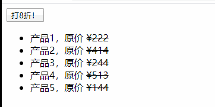

# WebAPI课程目标

- 浏览传智官网，观看相关效果

- 一句话目标：

  ==能够让我们通过JavaScript这门语言，结合浏览器提供给我们的一些操作方法，来动态地改变（操作）网页的外观表现和行为，从而提升用户的使用体验。==


----------------------

# 预备知识

##初步介绍

- JavaScript的构成
  - ECMAScript语言
  - 文档对象模型（DOM）
  - 浏览器对象模型（BOM）

- WebApi介绍
  - 什么是API？
  
    Application  Program  Interface（应用程序编程接口）
  
    Math.abs(1.5),  Math.round( 1.8 )
  
  - WebApi概述：
  
    Web领域的API。
  
  - DOM概述：
  
    就是网页中的各种构成部分的可用的操作（api）
  
  - BOM概述：
  
    就是浏览器中的各种构成部分的可用的操作（api）
- 网页中的几种输出方式
  - alert( '提示性文字信息' )
  - console.log( '要输出的文本内容' )
  - ducument.write( '要写入页面的html内容' )

## WebApi入门体验案例★★★

### 案例1

点击一个按钮，让一个div
变换界面效果：其背景变为粉红色，并出现边框。

```	html
<button id="btn1">点我呀</button>
<div id="box1">我们要开始学习WebApi了，请站稳扶好！</div>
<script>
    /*
    步骤：
    	1， 在js代码中获取到要点击的按钮，以及意图改变界面效果的div标签
    	2， 让该按钮“被点一下”的时候，去调用一个函数
    	3， 在该函数中，去实现目标（完成具体要做的事）
    */ 
	// 在js中，获取到页面中id为btn1的元素（即标签）
	var btn1 = document.getElementById('btn1');
	// 在js中，获取到页面中id为box1的元素（即标签）
	var box1 = document.getElementById('box1');
	// btn1被点击后，就会调用这里赋值给它的函数（此处为匿名函数）
	btn1.onclick = function(){
		// 这里就是要做的事：修改box1
		box1.style.backgroundColor = 'pink';// 修改box1的背景颜色
		box1.style.border = '2px solid red';// 修改box1的边框线
	}
</script>
```

案例总结：

​	1， 此案例只是体验性演示案例。

​	2， 此案例演示的是WebApi编程的基本模式： **找到标签》》设定动作》》实现功能**


### 案例2

一个div “提示信息”，点击“x”可以关闭，双击内容区可以缩小内容区高度以节省空间。

```html
<style>
	#msg {
		position: relative;
		height: 44px;
		line-height: 44px;
		border: 1px dashed #f00000;
		text-align: center;
		background-color: lightyellow;
		overflow: hidden;
	}
	#close {
		position: absolute;
		width: 12px;
		height: 12px;
		line-height: 12px;
		font-size: 12px;
		border: 1px solid #ccc;
		background-color: #ddd;
		top: 0px;
		right: 0px;
		cursor: pointer;
	}
	#close:hover {
		color: red;
	}
</style>
<div id="msg">
	我们要开始学习WebApi了，请站稳扶好！
	<span id="close">X</span>
</div>
<script>
	// 获取到两个标签（元素）
	var msgBox = document.getElementById('msg');
	var closeBtn = document.getElementById('close');
	// 给 关闭按钮 添加 点击 事件
	closeBtn.onclick = function(){
		msgBox.style.display = 'none';// 设置display的值为'none'
	};
	// 给 消息盒子 添加 双击（dblclick） 事件
	msgBox.ondblclick = function(){
		msgBox.style.height = '14px';// 设置height的值为'8px'
    }
</script>
```

总结：

​	1， 可见，我们实现了不同的功能，但整个代码的模式跟之前一样：**找到标签》》设定动作》》实现功能**

​	2， 那问题就来了，既然实现各种不同功能，首先前提总是需要找到标签，那到底有哪些方式找到标签呢？


# DOM模型

**学习目标**：

- [ ] ==掌握DOM模型中有关网页的各种元素的各种操作方法，可以高度概括为4个字：增、删、改、查。==


- [ ]  ==查：就是找到页面上的元素。==

- [ ] ==增：就是添加元素到页面上。==

- [ ] ==删：就是将页面上的元素移除。==

- [ ] ==改：就是修改页面上的元素的“现状”。==

以上，都是指在js代码中根据具体情形的需要而动态实现。

----------------------

## DOM编程初识

### 从一个简单html网页开始

假设我们有这样一个网页文件，其内容如下所示：

```html
<html>
<head>
	<title>My title</title>
</head>
<body>
	<h1>My header</h1>
	<a href="http://www.itcast.cn">My link</a>
</body>
</html>
```

在此基础上，我们提出如下几个术语或概念。

### 几个基本术语

- 文档（document）：

  js中，document 就是一个对象，代表整个网页（文件），直接使用。

  我们可以直接输出该对象看看：

  ```javascript
  console.log( document )
  ```

- 节点node（了解）：

  构成网页的所有组成部分，在js中都被称为节点。

  节点包括各种标签(标签节点)，文本(文本节点)，属性(属性节点)等等。

  - 节点类型包括：
    - 元素节点，就是指“标签”， 比如 \<div>\</div>，在js中就是一个元素节点。
    - 属性节点，就是“标签的属性”，不如`` 中的 src="abc.jpg"就是一个属性节点
    - 文本节点，就是html中的文本内容，比如`<div>abc</div>`中的 `abc` 就是一个文本节点 
  - 节点属性：在js中，节点本身就是“对象”，而对象就会有属性。节点的基本属性有如下3个：
    - nodeType：表示节点类型。就是前述节点分类中的某一种，结果是一个数字值，如果是1代表元素节点，如果是2代表属性节点，如果是3代表文本节点
    - nodeName：表示节点名称。
    - nodeValue：表示节点的值。

- 元素（element）：

  就是html中的标签，在js中称为元素或对象，是节点的一种，也称为元素节点。

###DOM树（DOM结构）

对于如下这个网页文件：

```html
<html>
<head>
	<title>My title</title>
</head>
<body>
	<h1>My header</h1>
	<a href="http://www.itcast.cn">My link</a>
</body>
</html>
```

其每一个构成部分，在js“眼中”，就是节点。

节点跟节点之间，相互有一定的关系，就构成了“节点树”（DOM树/DOM结构），类似家谱，如下所示：


###DOM编程到底是要干什么？

**DOM编程的核心目的是：**

​	**==通过js获取到网页中的有关标签(元素)，并对其进行某种所需要的操作==。**


## 获取元素

**学习目标**：

- [ ] ==能够根据id和标签名获取元素。==
- [ ] ==能够获取指定元素的父节点和子节点==

------------------

### 根据特征信息获取元素

- 根据ID获取元素★★★
  - 语法： document.getElementById( 'id名' )
  - 解释： 结果是该id所对应的元素（对象/节点）
- 根据标签获取元素
  - 语法： document.getElementsByTagName( '标签名' )
  - 解释： 结果是一个“集合”（伪数组）
- 根据类名获取元素
  - 语法： document.getElementsByClassName( '类名' )
  - 解释： 结果是一个“集合”（伪数组）
- 根据选择器获取单个元素★★★
  - 语法： document.querySelector( '选择器' )
  - 解释： 结果是该选择器所对应的第一个元素（对象/节点）
- 根据选择器获取多个元素★★★
  - 语法： document.querySelectorAll( '选择器' )
  - 解释： 结果是一个“集合”（伪数组）

==演示==：

​	使用get系列方法和query系列方法获取元素。

​	准备的素材：一个设定了id和class的div。

```html
<div id="box1" class="msg">黑马程序员</div>
```


### 根据节点关系获取元素★★

- 获取父元素
  - 语法： xx元素.parentNode
  - 解释： 获取到某元素的父元素
- 获取子元素
  - 语法： xx元素.children
  - 解释： 获取到某元素的所有子元素，是一个集合（伪数组）
- 获取第一个子元素
  - 语法： xx元素.firstElementChild
  - 解释： 获取到某元素的第一个子元素
- 获取最后一个子元素
  - 语法： xx元素.lastElementChild
  - 解释： 获取到某元素的最后一个子元素
- 获取后一个兄弟元素
  - 语法： xx元素.nextElementSibling
  - 解释： 获取到某元素的后一个兄弟元素
- 获取前一个兄弟元素
  - 语法： xx元素.previousElementSibing
  - 解释： 获取到某元素的前一个兄弟元素

==演示==：

​	使用元素的一些关系属性获取元素。

​	准备的素材：一个有id的无序列表。通过children找出第2个li，然后据此演示使用其他一些关系以获取元素。

```html
	<ul id="list">
		<li>项目1</li>
		<li>项目2</li>
		<li>项目3</li>
		<li>项目4</li>
		<li>项目5</li>
	</ul>
```

找对象总结：

​	1， 通过某些特征信息找：

​	2， 通过节点相互关系找：


## 添加元素

**学习目标**：

- [ ] ==能够将新的元素添加到网页的目标位置。==

---------

- 创建元素★★★
  - 语法： var node1 = document.createElement( '标签名' )
  - 解释： node1此时就是一个元素（标签）。但需要注意：该元素目前还只是一个内存变量形式，还没有放入网页中。
- 克隆元素
  - 语法： var node2 = xx元素.cloneNode( true/false )
  - 解释： 参数 true 表示同时克隆该元素的所有内容， false表示不克隆其内部内容。
  - 解释： node2此时也是一个新创建出来的元素，跟document.createElement()结果类似。
- 添加元素到末尾★★
  - 语法： xx父元素.appendChild( xx要添加的元素 )
  - 解释： 结果该新添加的元素成为了父元素的最后一个子元素。
- 添加元素到某个之前★★
  - 语法： xx父元素.insertBefore( xx要添加的元素， xx现有子元素）
  - 解释： 结果该新添加的元素成为了父元素的一个子元素，并在指定的子元素前。
- 替换某个现有元素：
  - 语法：xx父元素.replaceChild(xx新的元素，xx现有子元素）
  - 解释：结果就是新的 元素替换了所给定的现有子元素

==案例1==：

动态创建ul列表，要求如下：

页面上一个按钮，一个空的ul。每点击一次按钮，就创建一个 li 元素。放入到ul中。

==案例2==：

在一个无序列表中实现如下需求：

​	1，点击按钮1，创建一个div放入第一个li中，

​	2，点击按钮2，克隆第一个li，并放到该列表的倒数第2个的位置（即最后一个的前面），,

​	3，点击按钮3，将最后一个li替换为一个新创建的li。

准备的素材： 一个包含多个列表项的无序列表，以及几个按钮，如下所示：

```html
	<button id="btn1">添加一个div到第1个li</button>
	<button id="btn2">复制第1个li并放入倒数第2个位置</button>
	<button id="btn3">替换最后1个li</button>
	<ul>
		<li>列表项1</li>
		<li>列表项2</li>
		<li>列表项3</li>
		<li>列表项4</li>
	</ul>
```


## 删除元素★★

**学习目标**：

- [ ] ==能够通过removeChild方法移除页面上的元素。==

---------------------

学习目标

- 删除元素：
  - 语法： 父元素.removeChild( 子元素 )
  - 解释： 可见要删除一个元素，需要同时找到该元素本身，以及该元素的父元素。

==案例==：

​	 在上一个案例基础上，加一个按钮，点击该按钮，移除第二个li标签（元素）


## 修改元素

**学习目标**：

​	能够修改网页中的元素的各种信息，具体来说包括：

- [ ] ==能够操作元素的html固有属性==

- [ ] ==能够使用checked、selected和disabled这几个特殊属性==

- [ ] ==能够使用innerText/innerHTML设置元素之间的内容==

- [ ] ==能够使用style、className和classList操作元素的样式==

-------------------------------

### 修改元素的基本理解

- 修改元素其实就是修改元素的各种“属性”，从而改变其特性或表现。

- 各种属性包括：html属性，自定义属性，样式属性，class属性

- 代码示例：

  ```html
  <a  href="http://www.itcast.cn"  target="_blank"  data-id="12700" style="background-color: yellow"  class="link1 active" /> 这是一个链接 </a>
  ```

  在上述代码中：

  - href 和 target 就是 html属性（原生属性）
  - data-id 是自定义属性（自定义属性就是我们自己给的属性，不是html原本的属性）
  - style中的 background-color 就是样式属性
  - class中的 link1 和 active 就是class属性

### 修改元素的原生html属性★★★

html属性的说明：

-  html属性就是写在一个标签中的以 xxx="xxx" 形式出现的属性
- 比如常见的 src, href, width, height, title, align, value
- 这些属性都是可读可写的（即可取值可赋值）

具体语法形式：

- 取值（读取）： var v1 = xx元素.xx属性;
- 赋值（修改）： xx元素.xx属性 = "xx值";

==案例1==：

页面上有两个按钮，一张图片。每点击一次按钮1，使图片变大20像素，每点击一次按钮2，使图片变小20像素。

==案例2==：

购买数量的增减操作，如下所示：


代码素材如下：

```
<style>
	div {
		width: 80px;
	}
	input[type="text"] {
		width: 50px;
		height: 44px;
		outline: none;
		border:1px solid #ccc;
		text-align: center;
	}
	input[type="button"] {
		height: 24px;
		width: 22px;
	}
	input {
		float: left;
	}
</style>
<div>
	<input type="text" id="total" value="1" readonly>
	<input type="button" value="+" id="add">
	<input type="button" value="-" id="reduce" disabled>
</div>
```


==案例3（介绍开关思想）==： 

网页上有一按钮，点击按钮，使整个页面能够在“关灯/开灯”之间切换。

所谓关灯/开灯，就是让网页的整体背景为黑色和白色。

### 几个特殊的html属性★★

表单元素中有几个特殊属性，他们的特征都是“有/无”，“是/否”， “真/假” 这种状态特性，如下：

- checked属性
  - 用于单选或多选按钮的选中状态
  - true表示选中，false表示不选中
- selected属性
  - 用于下拉选项(option)的某项的选中状态
  - true表示选中，false表示不选中
- disabled属性
  - 用于一个表单元素的禁用状态
  - true表示禁用，false表示不禁用

**这些属性的值，都是布尔值！！！**

具体语法示例：

- xx元素.disabled = true；// 该元素被禁用
- xx元素.disabled = false；// 该元素可用
- xx元素.checked = true；// 该元素被选中
- xx元素.checked = false；// 该元素未被选中

==案例==：

全选/全不选切换效果，并且一旦全选按钮选中，则“批量删除”按钮处于可用状态，相反则处于禁用状态。

准备的代码素材如下：

```html
	<input type="button" id="btn1" disabled value="批量删除">
	<table border="1" cellspacing="0" id="table1" width="200">
		<thead>
			<tr>
				<th align="left">
                    <input type="checkbox" id="selectAllBtn">全选
                </th>
				<th>标题</th>
			</tr>
		</thead>
		<tbody>
			<tr>
				<td><input type="checkbox"></td>
				<td>标题啦啦啦1</td>
			</tr>
			<tr>
				<td><input type="checkbox"></td>
				<td>标题啦啦啦2</td>
			</tr>
			<tr>
				<td><input type="checkbox"></td>
				<td>标题啦啦啦3</td>
			</tr>
		</tbody>
	</table>
```


### 容器元素的两个内容属性★★★

所谓容器元素，就是html中的“双标签”，因为双标中间可以放其他内容，因此称为容器元素。

大多数元素都是容器元素（双标签），比如div，h1, p, span, a, td, ul, li, table, tr, tbody等。

只有很少量的几个元素是非容器元素（单标签），比如 br，hr，img，input。

以下两个属性只适用于容器元素。

- xx元素.innerHTML
  - 表示一个容器元素（就是双标签）内部的所有html代码。
  - 可取值，可赋值。
  - 赋值时，其中的html代码，会被当做html元素，即这也是创建元素的一种方式。
- xx元素.innerText
  - 表示一个容器元素（就是双标签）内部的所有可见文本内容。
  - 可取值，可赋值。
  - 赋值是，写入的内容（不管是否包含html代码），都只是当前文本字符。

==案例==：

点击按钮，将第一个div中的无序列表（内容），复制到第二个div中。用两个按钮，分别使用innerHTML和innerText实现，对比结果。

需要准备的素材如下：

```html
	<button id="btn1">复制html</button>
	<button id="btn2">复制text</button>
	<div id="box1">
		<ul >
			<li>项目1</li>
			<li>项目2</li>
			<li>项目3</li>
		</ul>
	</div>
	<div id="box2"></div>
```


### 操作自定义属性

#### 自定义属性的概念

**设置在标签身上，但不是html的原生属性的属性。**

这是html5的新特性，即任何标签都可以自行添加任何属性。

示例：

```html
<div data-id="90" company="传智黑马" class-name="前端第90期" > .... </div>
```

上述html代码中， data-id ，company 和 class-name都是自定义属性（div标签本身没有这些属性）

#### 操作自定义属性的方法★★

- 设置一个属性的值（就是给属性赋值）
  - xx元素.setAttribute( '属性名', '属性值' )
- 获取给定属性的值
  - xx元素.getAttribute( '属性名' )
- 移除一个属性
  - xx元素.removeAttribute( '属性名' )

==案例==：

在html中初始设置多个 li 的 oldPrice 自定义属性，并显示该原价。点击一个按钮后，对这些价格打8折，并同时显示打折后的价格。初始时每个 li 中有3个span标签，分别要显示的内容要求如下：

第一个span显示产品名称，第二span显示原价，第三个span显示现价。

运行的效果如下图所示：



要准备的代码素材如下：

```html
	<button id="btn1">打8折！</button>
	<ul id="list1">
		<li oldPrice="222"><span>产品1</span><span></span><span></span></li>
		<li oldPrice="414"><span>产品2</span><span></span><span></span></li>
		<li oldPrice="244"><span>产品3</span><span></span><span></span></li>
		<li oldPrice="513"><span>产品4</span><span></span><span></span></li>
		<li oldPrice="144"><span>产品5</span><span></span><span></span></li>
	</ul>
```


### 操作样式属性

#### 样式属性的概念

所谓样式属性，是指一个html标签的css样式设定，该样式设定会影响该html标签的外观表现形式，比如font-size， font-weight， border， margin， background-color等等。

#### 通过style来操作样式★★

- 含义：
  - 操作的是元素身上的style属性中设定的css属性
- 形式示例：
  - \<div style="==color: red==; ==font-size: 18px==; "> .... \</div>
- js中读取：
  - var v1 = xx元素.style.xx样式属性名；
- js中设置：
  - xx元素.style.xx样式属性名 = '新的样式值'；
  - 提示： 样式值都是字符串类型的值。
- 局限性：
- 
  - 通过style读取和设置的都只能是行内样式。
  - 样式的值都是字符串的类型
  - 值的样式属性名的写法跟css有所出入，必须使用“小驼峰”命名法，类似这样：xxxYyyZzz

####通过className来操作样式

- 含义：
  - 就是指元素身上的 class属性，但在js中需要使用 className这个名称
- 形式示例：
  - \<div ==class="top"==> .... \</div>
- js中读取：
  -  var v1 = xx元素.className
- js中设置：
  - xx元素.className = '类名';
  - 提示： 如果元素有多个类名，则用空格隔开进行赋值就可以，比如 box.className = "nav  top"

#### 通过classList来操作样式★★

使用classList操作的仍然是一个元素身上的class属性，只是另一种做法而已。

- 添加一个类（class）：
  - xx元素.classList.add( '类名' )
- 移除一个类（class）：
  - xx元素.classList.remove( '类名' )
- 切换一个类（class）：
  - xx元素.classList.toggle( '类名' )
  - 解释： 切换的意思是： 有就移除，没有就添加。

==案例1==：

给一个div通过style来设定文字颜色和字体大小，通过className来设定一个类以改变背景，通过classList来添加一个类以改变边框。

准备的代码素材：

```html
<style>
    .bgPink {
        background-color: pink;
    }
    .redBorder {
        border: 1px solid red;
    }
</style>
<div id="box1">
    键盘敲烂，月薪过万！背水一战，说干就干！
</div>
```

*思考题*：

​	通过className来操作类，和通过classList来操作类，有什么区别？


# 事件处理

**学习目标**：

- [ ] ==能够写出事件绑定的3种方式。==

- [ ] ==能够理解并使用事件处理函数中的this==

- [ ] ==能够使用事件对象event的相关属性和方法==

- [ ] ==能够理解事件流3个阶段并阻止事件的传播==

- [ ] ==能够使用事件委托==

--------------------

## 事件基本概念

**目标**

- [ ] 	==能够理解事件处理的基本概念==

- [ ] 	==能够理解事件三要素==

---------------------

- 事件的概念

  - 就是指网页上的“一件事情”发生了。
  - 比如鼠标点击了，鼠标移动了，键盘的按键按下了，等等

- 事件处理的概念

  - 就是指网页上一个事件发生后我们应该（可以）做什么。这个“做什么”就是我们要预先写好代码，这就是所谓事件处理。

- 事件三要素★★

  - 要素1，事件源：就是发生事件的那个元素，比如某个按钮，某个div，某个图片等
  - 要素2，事件类型：就是具体发生的事件名称，比如点击(click)，鼠标移动(mousemove)，等
  - 要素3，事件处理程序：就是事件发生后希望做什么的程序代码，通常是一个函数，称为事件处理函数。

  **==事件三要素其实就是设定某个元素上发生了某个事件后要做什么事情==**

  将上述三要素“关联”在一起的过程（代码），就叫做**事件绑定**（也叫**事件注册**）。

- 常见事件概览

  - 常见鼠标事件：
    - ==click==， mouseover， mouseout， mousemove,  mouseenter, mouseleave
  - 常见键盘事件：
    - keypress， keydown， keyup
  - 常见表单事件：
    - submit， change， focus， blur
  - 其他常见事件：
    - load


##事件的绑定和移除★★★

**目标**：

- [ ] 	==能够说出事件绑定的3种方式。==
- [ ] 	==能够使用addEventListener注册事件==
- [ ] 	==能够使用removeEventListener移除事件==

-------------

- 事件绑定的含义：

  所谓事件绑定，==就是将某个元素跟某个事件和某个函数（即所谓事件三要素）关联起来==。

  ==结果就是：该元素上发生该事件后就会自动执行该函数==。

- 事件移除的含义：

  就是将这三者解除关联。


事件绑定和移除有以下方式：

- 通过标签属性绑定——**过时，不推荐使用，认识就行**
  - 语法形式： <div  onXX事件="xx函数()" > ... \</div>
  - 对应移除的方式： 
    - xx元素.onXX事件 = null
    - 或直接在html中删除该事件绑定代码——不过这就不是js的工作了。
- 通过对象属性绑定——**简洁，常用，满足绝绝大多数情况所需**
  - xx元素.onXX事件 = function() { ... };	//这里是匿名函数，也可以用一个有名字的函数的函数名
  - 对应移除的方式： 
    - xx元素.onXX事件 = null
- 通过对象方法绑定——**推荐使用**
  - xx元素.addEventListener( 'XX事件', xx事件处理函数 )；
  - 第2个参数是事件处理函数，可以是匿名函数，也可以是一个函数名
  - 对应移除的方式：
    - xx元素.removeEventListener('XX事件', 对应的处理函数 )
    - 特别注意：绑定后如果需要再移除，则需要使用同样的函数名，且第1个参数也要求一样。

==案例==：

使用不同的方式给三个不同的div 绑定click 事件，并测试触发结果。

点击一次后，并都全部移除其身上的事件。

准备的代码素材：

```html
	<div class="box1"> box1 </div>
	<div class="box2"> box2 </div>
	<div class="box3"> box3 </div>
```


##事件处理函数中的this★★★

**目标**：

- [ ] 	==能够理解并使用事件处理函数中的this==

----------------------

- 含义：

  this关键词在事件处理函数中，代表“事件发生时绑定了当前事件”的元素。

- 作用：

  获取到当前事件所绑定到的元素。

- 使用方式： 

  直接在事件处理函数中使用 this 这个词就可以。

提示：在对象属性绑定和通过对象方法绑定的事件处理函数中，都**可以直接使用this关键词**。但通过元素标签属性的形式绑定的事件处理函数中不可以直接使用。

==案例1==：

多个button按钮，其中的初始文字都是数字0，要求实现：点谁谁加1。

准备的素材：

```html
<button>0</button>
<button>0</button>
<button>0</button>
```


==案例2（排他思想）==：

切换美女图，如图所示：


准备的素材：

```html
<button data-src="./images/t1.jpg">美女1</button>
<button data-src="./images/t2.jpg">美女2</button>
<button data-src="./images/t3.jpg">美女3</button>
<button data-src="./images/t4.jpg">美女4</button>
<div>
    
</div>
```


==案例3（排他思想应用）==：

tab栏切换效果，如图所示：


准备的素材：

```html
	<style>
		.tab {
			border: solid 1px red;
			width: 620px;
			height: 300px;
			overflow: hidden;
		}
		.tab ul {
			margin: 0;
			padding: 0;
			list-style: none;
			display: flex;
		}
		.tab ul li {
			flex: 1;
			border-right: solid 1px red;
			border-bottom: solid 1px red;
			height: 25px;
			line-height: 25px;
			text-align: center;
			cursor: pointer;
			background-color: pink;
		}
		.tab ul li:last-child {
			border-right: solid 1px transparent;
		}
		.tab ul li.active {
			border-bottom-color: transparent;
			background-color: transparent;
		}
		.tab .content div {
			display: none;
		}
		.tab .content div.active {
			display: block;
		}
	</style>

	<div class="tab">
		<ul>
			<li class="active">栏目1</li>
			<li>栏目2</li>
			<li>栏目3</li>
			<li>栏目4</li>
		</ul>
		<div class="content">
			<div class="active">对应的内容哒哒哒 001 </div>
			<div>对应的内容哒哒哒 002</div>
			<div>对应的内容哒哒哒 003</div>
			<div>对应的内容哒哒哒 004</div>
		</div>
	</div>
```


## 事件对象event

**目标**：

- [ ] 	==能够使用事件对象event的相关属性和方法==

- [ ] 	==事件属性包括：target， type， clientX/Y，pageX/Y， keyCode==

- [ ] 	==事件方法包括： preventDefault( )==

---------------------

###事件对象的概念

事件对象就是指一个事件发生时保存了跟事件有关的信息的一个对象。

事件对象的信息内容由系统维护，我们只是使用它。

### 事件对象的作用

能够让我们获取到事件发生时的跟事件有关的信息，比如鼠标的位置，键盘的按键，事件源对象等等，并进行事件的相关控制

### 事件对象的使用方式★★★

在事件处理函数定义时作为函数的第一个形参，如下所示：

```javascript
xx元素.onXX事件 = function( e ) { 
	// 在此函数中， e 就代表 event对象
 }
```

或：

```javascript
xx元素.addEventListener( 'XX事件', function( e ) { 
	// 在此函数中， e 就代表 event对象
 });
```

或：

```javascript
xx元素.onXX事件 = func1;
xx元素.addEventListener( 'XX事件', func1);	// 特别注意： 这里只要写也只能写函数名称
function func1( e ) { 
	// 在此函数中， e 就代表 event对象
 }
```


### 事件对象event的属性★★

- event.target
  - 代表当前直接触发事件的元素本身
- event.type
  - 代表当前事件类型，其实就是事件的名称，比如click， mouseover， keypress， keydown
- event.clientX, event.clientY
  - 代表事件发生时鼠标在当前窗口可视区域范围的位置
  - 仅仅针对鼠标事件有效
- event.pageX, event.pageY
  - 代表事件发生时鼠标在页面文档范围的位置
  - 仅仅针对鼠标事件有效
- event.keyCode
  - 代表键盘事件发生时所按下的按键的按键码，是一个数字
  - 仅仅针对键盘事件有效

==演示==：

一个网页中有一个高度为1000的div，使用点击事件演示event对象上相关属性。

==案例1==：

跟随鼠标移动的小天使（一张图片而已），如下所示：


==案例2==：

输入框中输入内容，回车后添加为一条新的新闻列表的标题，效果如下所示：


准备的代码素材：

```html
	<h3>输入框中输入内容，回车后可以添加一条新闻标题</h3>
	<input type="text" id="inp1">
	<ul id="list1"></ul>
```


### 事件对象event的方法★★

- event.preventDefault()
  - 含义与作用： 取消事件的默认行为，比如a标签的链接行为，form标签的提交行为。

==演示==：

让a标签的链接失效，让form表单的提交失效（后者常用）。


## 事件流

- [ ] ==能够说出事件的三个阶段==
- [ ] ==能够阻止事件冒泡（阻止传播）==

### 事件流概念

就是一件事件发生时该事件在整个DOM结构的相关元素间的传播过程。

一句话概括：事件发生的流程（过程）

类比：

​	两个人远距离打电话，语音信号其实是从说话者的最近基站，一层层往上传到某个中心基站，然后中心基站再一层层下传到听电话的人的最近基站的过程。

对于一个发生了的事件，比如click，其传播过程也类似：从最外层的元素（对象）开始，一层层向下传到具体最终点击的元素（对象），然后再又一层层向上传到外层的元素（对象）。

这个过程是内部机制，是肯定存在的，只是我们写代码的时候，是否需要用到这个特性的问题。

### 事件流示意图

如下所示：


另一个图示如下：


### 事件流的3个阶段★★

- 捕获阶段
  - 就是事件从“外面大的盒子向当前直接触发事件的盒子传播”的过程。
  - 事件阶段代码为1(如果需要可以获取到，下同)
- 目标阶段
  - 就是传播到当前直接触发事件的盒子的时点
  - 事件阶段代码为2
- 冒泡阶段
  - 就是事件从“当前直接触发事件的盒子向外面更大的盒子传播”的过程。
  - 事件阶段代码为3
  - 默认情况下，我们前面使用的事件绑定方式绑定的事件，都是冒泡型事件。

事件绑定的第3种方法（addEventListener方法），就可以将事件绑定在这个事件流过程中某个阶段（捕获阶段还是冒泡阶段），语法如下：

​	xx元素.addEventListener( 'XX事件'， 事件处理函数， false或true)；

其中，第3个参数是布尔值，false表示设定的是冒泡阶段的事件，true表示设定的是捕获阶段的事件。默认false。

==演示==：

结构为 #div1>#div2>#div3，div2绑定捕获阶段事件处理函数，div1和div3绑定冒泡阶段事件处理函数，观察结果。

准备的素材代码：

```html
	<style>
		div {
			border: solid 1px red;
			padding: 10px;
		}
	</style>
	<div id="div1">
		div1
		<div id="div2">
			div2
			<div id="div3">
				div3
			</div>
		</div>
	</div>
```

### 阻止事件传播（阻止冒泡）★★

- 含义： 

  让事件在整个事件传播过程中的某个时间节点“停下来”，不再传播下去。

  通常，阻止事件传播，一般就是阻止冒泡。

- 做法：

  event.stopPropagation( )

==演示==： 

结构为 #div1>#div2>#div3，均绑定click冒泡事件，点击div3，演示在div2中阻止或不阻止事件冒泡的情况下的不同结果。

准备的代码素材：

```html
	<style>
		div {
			border: solid 1px red;
			padding: 10px;
		}
	</style>
	<div id="div1">
		div1
		<div id="div2">
			div2
			<div id="div3">
				div3
			</div>
		</div>
	</div>
```


## 事件委托★★

**目标**：

- [ ] 	==能够说出事件委托的作用==
- [ ] 	==能够使用事件委托绑定元素==

-------------------

### 事件委托的概念

事件委托就是利用事件的冒泡特性而将一个元素上发生的事件处理函数绑定到该元素的上级元素身上。

### 事件委托的作用

事件委托可以简化事件绑定行为，能够将多个子元素的同类事件一次性绑定到他们共同的上级元素身上，从而简化代码。

### 事件委托的具体做法

​	1， 给意图实现事件处理的子孙元素的某个上级元素注册事件

​	2， 在事件处理程序中，通过 event.target 获取到当前触发事件的对象

​	3， 通过适当的方式（比如获取到类名）判断是否是我们意图实现事件处理的元素：

​		3.1， 如果是，就正常处理

​		3.2， 如果不是，就略过不管

==案例1==：

点击一个列表标签的任意一个li，获取到其中的文本内容，并打印出来。

可以对比不同做法：

​	做法1是给每个li绑定事件。

​	做法2是给li的父元素绑定事件（也就是委托）。

==案例2==：

（综合案例）微博发布，效果如图所示：


准备的代码素材：

```html
	<style>
		.weibo {
			border: 1px solid #ccc;
			width: 500px;
			padding: 10px;
		}
		.weibo textarea {
			width: 492px;

			height: 50px;
			border: solid 2px #ccc;
			outline: none;
			resize: none;
		}
		.weibo textarea:focus {
			border: solid 2px orange;
		}
		.weibo #publishBtn {
			background-color: #ddd;
			border:none;
			outline: none;
			border-radius: 3px;
		}
		.weibo #publishBtn:focus {
			background-color: orange;
		}
		.weibo .weiboList {
			list-style: none;
			padding: 0;
		}
		.weibo li {
			border-bottom: 1px dotted #ddd;
			line-height: 35px;
		}
		.weibo li a {
			float: right;
		}
	</style>
	<div class="weibo">
		<textarea name="" id="" cols="30" rows="10"></textarea>
		<input type="button" id="publishBtn" value="发布">
		<ul class="weiboList"></ul>
	</div>
```


# BOM模型

**学习目标**：

- [ ] 	==能够理解BOM模型的主要包括的几个对象==

- [ ] 	==能够理解最高层对象window及其方法==

- [ ] 	==能够使用定时器实现定时操作==

- [ ] 	==能够使用location对象的属性和方法==

- [ ] 	==能够理解history对象==

- [ ] 	==能够理解navigator对象==

- [ ] 	==能够理解并使用localStorage对象==

---------------------------------

BOM是指： Browser  Object  Model（浏览器对象模型）

BOM模型其实就是在浏览器这个级别（网页是在浏览器中呈现的）所提供的API接口。

BOM模型中也就几个对象而已，我们学习的是怎样使用对象的属性或方法。

##window对象

**目标**：

- [ ] 	==能够理解最高层对象window及其方法==

- [ ] 	==能够使用定时器实现定时操作==

--------------------

###全局变量和全局函数★★

- window对象是整个javascript对象体系中的最高一层对象
- 全局变量和全局函数，其实自动成为了window对象的属性
  - 如果 var v1 = 10 是全局变量，则 v1 === window.v1 为真
  - 如果 function  fn1 = function(){... }是全局函数，则 fn1 === window.fn1为真。
- window自身的属性方法，以及全局的变量和函数，都可以“直接使用”，而无需使用“window.”这个前缀。


### 弹出提示信息

- window.alert( '提示信息' )
- 凡是window的方法或属性，都可以省略前缀 “window.”， 下同。

### 弹出确认信息

- confirm( '你真的要删除吗？' );
- 该方法返回布尔值：点击“确定”返回true，点击“取消”返回false

==案例==：

删除一条新闻时，弹出确认信息。如果用户点击确认，则删除，否则就什么也不做。

界面效果如下：


准备的代码素材如下：

```html
	<style>
		a {
			color: white;
			text-decoration: none;
		}
		#btn1 {
			margin-bottom: 5px;
		}
		#table1,
		#table1 td,
		#table1 th{
			border-collapse: collapse;
			border: solid 1px #ccc;
			font-size: 14px;
		}
		.edit,
		.delete {
			background-color: #5BC0DE;
			border-radius: 4px;
			border: none;
			outline: none;
			padding: 2px 8px;
		}
		.delete {
			background-color: #D9534F;
		}
		#table1 td:last-child {
			text-align: center;
		}
	</style>

	<input type="button" id="btn1" disabled value="批量删除">
	<table cellspacing="0" id="table1" width="600" cellpadding="5">
		<thead>
			<tr>
				<th align="left">全选<br><input type="checkbox" id="selectAllBtn"></th>
				<th>标题</th>
				<th>操作</th>
			</tr>
		</thead>
		<tbody>
			<tr>
				<td><input type="checkbox"></td>
				<td>Vue 中 axios 拦截器的封装</td>
				<td>
					<a href="javascript:;" class="edit">编辑</a>
					<a href="javascript:;" class="delete">删除</a>
				</td>
			</tr>
			<tr>
				<td><input type="checkbox"></td>
				<td>HTML常用meta大全</td>
				<td>
					<a href="javascript:;" class="edit">编辑</a>
					<a href="javascript:;" class="delete">删除</a>
				</td>
			</tr>
			<tr>
				<td><input type="checkbox"></td>
				<td>用OpenCV，给女朋友做个不会死的贪吃蛇！</td>
				<td>
					<a href="javascript:;" class="edit">编辑</a>
					<a href="javascript:;" class="delete">删除</a>
				</td>
			</tr>
			<tr>
				<td><input type="checkbox"></td>
				<td>高效率工具：web前端开发VScode必备插件大全</td>
				<td>
					<a href="javascript:;" class="edit">编辑</a>
					<a href="javascript:;" class="delete">删除</a>
				</td>
			</tr>
		</tbody>
	</table>
```


### 使用一次性定时器★★

- 定义（创建）一次性定时器：
  - var **timer1** = window.setTimeout( 要调用的函数, 等待的时间);
  - 要调用的函数可以是一个匿名函数，也可以是一个具名函数
  - 等待的时间的单位是毫秒
  - 含义是： 在该时间后，会执行一次所指定的函数。
- 清除（销毁）一次性定时器：
  - window.clearTimeout( **timer1** )

==演示==：

​	3秒后，整个网页都绿了！


### 使用重复性定时器★★

- 定义（创建）重复性定时器：
  - var timer2 = window.setInterval( 要调用的函数, 间隔的时间);
  - 要调用的函数可以是一个匿名函数，也可以是一个具名函数
  - 等待的时间的单位是毫秒
  - 含义是： 每间隔该时间，都会执行一次所指定的函数。
- 清除（销毁）重复性定时器：
  - window.clearInterval( **timer2** )

==定时器案例1==： 

​	页面上动态显示当前即时时间，精确到秒，如下所示：


==定时器案例2==：

​	发送验证码后进行倒计时显示，效果如下所示：


==定时器案例3==：

​	图片轮播：自动播放，鼠标悬停时就停止播放，效果如下所示：


###浏览器加载事件load★★

- 含义： 

  指整个网页中的所有资源（html，css，js，图片等）都加载完成。

  load事件也可以用于图片的加载事件，表示一张图片加载完成。

- 使用形式： 

  window.onload = function() { .... }
  
  或：
  
  window.addEventListener( 'load', function(){ .... } );

==案例==：

​	获取网页中一张图片的宽高尺寸。


## location对象

**目标**：

- [ ] 	==能够使用location对象的href属性和reload()方法==

-----------------------------

location对象代表网页所在浏览器的地址栏。其常用属性或方法如下：

- location.href
  - 代表浏览器地址栏中的网页地址（url），可读可写。
  - 取值： var  url = location.href
  - 赋值： location.href = '一个新的url地址';  // 赋值的结果其实是跳转到了该新的网页
  - 应用场景： 当完成某工作（比如添加文章）后，跳转到另外某个页面（比如文章首页）。
- location.search
  - 代表浏览器地址栏中网页地址（url）里“？”号后面的查询参数部分
  - 其形式类似这样： ?username=zhangsan&age=18&sex=男
  - 上述示例包含了3个查询参数（username， age， sex）
  -  虽然可读可写，但应用中基本只需要读取。
  - 应用场景： 获取到从其他页面跳转到当前页面时传入到当前页面的参数数据
- location.reload()
  - 这是一个方法，表示“重新加载”当前网页，也就是“刷新网页”。
  - 应用场景： 在一个页面完成某工作（比如删除文章）后，需要重新刷新当前页面以更新数据。

==演示==：

​	点击按钮1可以刷新当前网页，点击按钮2可以获取到当前网页的查询参数，点击按钮3可以跳转到另一个网页。


##history对象

**目标**：

- [ ] 	==能够理解history对象并使用back()方法==

----------------------

- 含义： 

  代表当前浏览器窗口中所浏览过的网页历史记录

- 作用：

  能够通过js代码控制当前窗口中浏览历史的前进后退行为（相当于点击了浏览器中的前进后退按钮）

- 使用：
  - history.back( )： 后退一步
  - history.forward( )： 前进一步
  - history.go( n )：后退（n为负时）或前进（n为正时）n步。

==演示==：

​	在page1中点击一个按钮，跳转到page2中，page2中判断是否传入参数id，如果没有就提示用户后直接返回。


## navigator对象

**目标**：

- [ ] 	==能够理解navigator对象并使用其userAgent属性==

-----------

- 含义：

   代表当前浏览器（对象），其中包括了一些浏览器的信息，比如浏览器的名称，浏览器的版本。

- 作用： 

  获取到浏览器的信息，以供程序需要时用来判断不同的浏览器。

- 使用：
  
  - navigator.userAgent：获取到浏览器的信息（字符串）


##localStorage对象

**目标**：

- [ ] 	==能够理解localStorage对象并使用其方法进行数据的存取操作==

--------------------

### 含义

 就是可以将数据存储到当前浏览器中的一种数据存储对象。

注意：

​	1，它跟数组或变量中存储的数据不同，前者是在内存中存储，网页关闭就消失了。

​	2， localStorage对象中存储的数据，类似文件中存储的内容，即使关闭电脑也不会丢失。

​	3， localStorage对象存储的数据只能是“键值对”形式的字符串，键就是某个数据的名称。

​	4， 查看该数据：

​			谷歌浏览器中：开发者工具》Application》Storage》Local Storage

​			火狐浏览器中：开发者工作》存储》本地存储》

###作用

可以将一些数据以键值对的形式存储起来以供日后使用或其他页面的程序使用。

### 使用方法

- localStorage.setItem( 'key名称', '值' )
  - 以给定的键（key）存储一个数据。
  - 特别注意： localStorage只能存储字符串值。
- localStorage.getItem( 'key名称' )
  - 获取指定键（key）对应的数据
- localStorage.removeItem( 'key名称' )
  - 删除指定键（key）对应的数据

==演示==：

 页面1设定一个localStorage的key值，并可以获取到，页面2也可以获取到。页面2中再清除，页面1中就不再能获取到。

要准备的素材：

```html
<!-- 页面1 -->
<button id="btn1">设置</button>
<button id="btn2">获取</button>
```

```html
<!-- 页面2 -->
<button id="btn1">获取</button>
<button id="btn2">删除</button>
```


#知识扩展

## 移动端事件

###移动端事件类型

- 移动端事件概念：

  移动端事件是专门针对移动端设备定义的事件，只有移动端设备上才有。

- 移动端事件类型包括：
  - touchstart： 触摸开始事件
  - touchmove： 触摸移动事件 
  - touchend： 触摸结束事件

- 相关说明：
  - 移动端事件绑定方式强烈推荐 addEventListener( ) 方式
  - pc端大多数事件在移动端也都能用，比如最常用的click事件，照样可用
  - 一些pc端的事件在移动端使用效率低，比如click，我们尽量不用。

==演示==：

绑定移动端的3个事件（touchstart，touchmove，touchend）


###移动端事件对象（触摸点）

- 概念

  移动端事件是通过手指触摸屏幕实现的，而且可以用多个手指进行触摸操作，因此，手指触摸屏幕时的相关信息就被事件对象存储起来，这就是触摸点信息，比如有多少个触摸点，每个触摸点的坐标位置，等等。

- 怎样获取触摸点？

  触摸点信息其实是事件信息的一部分，因此，跟之前一样，需要通过event对象来获取触摸点信息。

  获取触摸点信息的途径或方式如下：

  事件处理函数传入参数（event），然后事件处理函数中，**==event.触摸点集合[i]==** 就是一个触摸点。

  其中，触摸点集合是一个伪数组（因为有可能有多个触摸点），i 指是第几个（从0开始）

- 有3种触摸点集合
  - event.touches： 代表整个屏幕上的所有触摸点，是一个集合。
  - event.targetTouches： 代表当前绑定事件的某个元素（对象）上的所有触摸点，是一个集合。
  - event.changedTouches： 代表当前变换了的触摸点，它主要是用于touchend事件中获取相应的触摸点，因为touchend事件发生时，手指已经离开屏幕，此时前两个集合中就没有触摸点信息了。

==演示==： 

在touchstart事件和touchend事件中获取3种触摸点列表。

- 触摸点属性
  - touch.clientX： 触摸点在当前窗口中的x坐标
  - touch.clientY： 触摸点在当前窗口中的y坐标
  - touch.pageX： 触摸点在当前网页中的x坐标
  - touch.pageY： 触摸点在当前网页中的y坐标

==演示==： 

获取触摸点的clientX，clientY的值


### 移动端手势

- 概念解释：
  - 所谓移动端手势，就是手指在移动端屏幕上所作的各种操作，比如点击，滑动，放大，缩小，旋转等等。
  - 移动端手势并不是事件，而是人们根据具体的应用场景和需求，在移动端3个基本事件的基础上封装模拟出来的。
  - 应用中我们并不需要自己去封装这些手势事件，而是直接调用第三方封装好的方法就可以。

- 移动端手势分类：


==案例1==：

模拟移动端的tap事件

==案例2==：

模拟移动端的左划、右划事件


## transitionend（过渡完成）事件

- 解释：

  这是 css3 所提供的一个事件，表示过渡效果执行完成的那个时刻。

- 对比：

  window.onload事件是网页所有内容都加载完成那个时刻：

- 绑定方式：

  xx元素.addEventListener('transitionend',  事件处理函数 );

==演示==：

点击一个div，让其宽度发生渐变（过渡），然后过渡结束后，改变背景颜色。


##swiper轮播插件

### swiper插件介绍

- 什么是插件？
  - 插件就是别人封装好的 js 代码 或 css代码，可以直接拿来使用。
- swiper插件是第三方封装好的专门用于制作各种轮播图效果的插件
- swiper插件的中文官方网站： https://www.swiper.com.cn

一个演示效果如下所示：


制作这样一个常见的轮播图，只要几行代码！这就是插件的魅力！


### swiper插件使用步骤

- 1，引入swiper插件的css文件，比如：
  - \<link rel="stylesheet" href="./css/swiper.min.css">
- 2， 按swiper插件的结构和样式要求编写轮播区域的html代码
- 3， 引入swiper插件的js文件，比如：
  - \<script src="./js/swiper.min.js">\</script>
- 4， 在自己的js代码中，按swiper插件的使用形式创建（激活）swiper对象

主要代码示例如下：

```html
    <div class="swiper-container">
        <div class="swiper-wrapper">
            <div class="swiper-slide">Slide 1</div>
            <div class="swiper-slide">Slide 2</div>
            <div class="swiper-slide">Slide 3</div>
        </div>
        <!-- 如果需要分页器 -->
        <div class="swiper-pagination"></div>

        <!-- 如果需要导航按钮 -->
        <div class="swiper-button-prev"></div>
        <div class="swiper-button-next"></div>

        <!-- 如果需要滚动条 -->
        <div class="swiper-scrollbar"></div>
    </div>
	<script>
	    var mySwiper = new Swiper('.swiper-container', {
            direction: 'vertical', // 垂直切换选项
            loop: true, // 循环模式选项
            autoplay: true,	// 自动播放

            // 如果需要分页器
            pagination: {
                el: '.swiper-pagination',
            },

            // 如果需要前进后退按钮
            navigation: {
                nextEl: '.swiper-button-next',
                prevEl: '.swiper-button-prev',
            },

            // 如果需要滚动条
            scrollbar: {
                el: '.swiper-scrollbar',
            },
        })
	</script>
```


### swiper配置项


