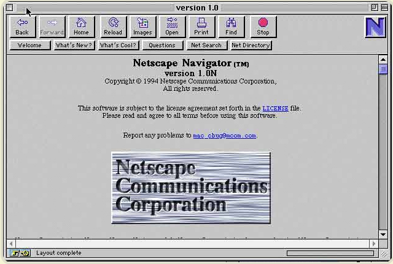
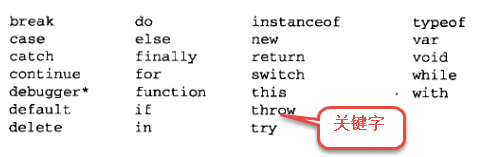
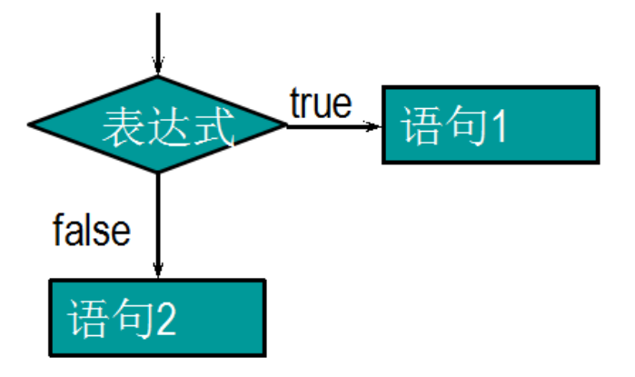
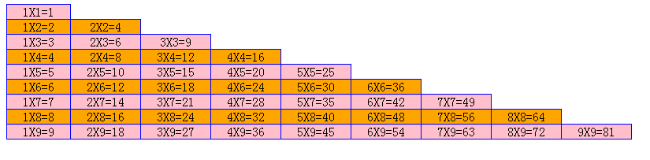
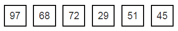
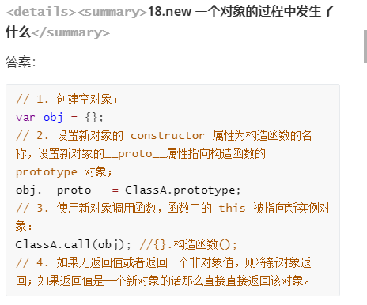

# 01-JavaScript基础

## 核心知识点

1. javaScript书写位置
2. javaScript变量
3. javaScript数据类型
4. javaScript数据类型转换
5. javaScript运算符

## 今日学习目标

1. 能够定义一个变量并完成变量的赋值
2. 能够说出每一种具体的数据类型
3. 能够数据类型之间的相互转化
4. 能够掌握各种运算符的作用

## 序言

> ### JavaScript发展历史(js)

```javascript
1. 1994年，网景公司(Netscape)发布了Navigator浏览器0.9版，这是世界上第一款比较成熟的网络浏览器，
	轰动一时。但是这是一款名副其实的浏览器--只能浏览页面，浏览器无法与用户互动,当时解决这个问题有两个办		法，一个是采用现有的语言,许它们直接嵌入网页。另一个是发明一种全新的语言。

2. 1995年Sun公司将Oak语言改名为Java，正式向市场推出。Sun公司大肆宣传，许诺这种语言可以"一次编写，到处运	 行"(Write Once, Run Anywhere)，它看上去很可能成为未来的主宰。

3. 网景公司动了心，决定与Sun公司结成联盟

4. 34岁的系统程序员Brendan Eich登场了。1995年4月，网景公司录用了他,他只用10天时间就把Javascript设计出来了。  （多肽语言）

5. (1)借鉴C语言的基本语法; (2)借鉴Java语言的数据类型和内存管理; (3)借鉴Scheme语言，将函数提升到"第一等公民"(first class)的地位; (4)借鉴Self语言，使用基于原型(prototype)的继承机制。
```



> ### JavaScript是什么？

```javascript
JavaScript： 基于对象和事件驱动，运行在浏览器客户端的脚本语言。[js]
     ✔ js的运行环境： 运行在浏览器端的一种语言
     ✔ 最后将所有的js代码都要以对象的形式去执行，都要通过事件的方式去触发执行【DOM】
	
 对象： 
	 现实世界中的对象：  将任何一个具体的事物都是一个对象【万事万物皆对象】
     编程中的对象： 对现实中对象的抽象描述
     
     面向对象特征：  封装   继承   多态
 
 编程思想：
 
 ✔面向对象：【推荐】
 	   代码执行都要以一个具体的对象为整体去执行
 ✔面向过程：
 	   代码执行的时候，一行一行执行的。
```

> ### JavaScript能干什么？

```javascript
  ☞ 常见的网页效果【表单验证，轮播图。。。】
  ☞ 与H5配合实现游戏【水果忍者： http://www.jq22.com/demo/html5-fruit-ninja/】
  ☞ 实现应用级别的程序【 http://naotu.baidu.com】
  ☞ 实现统计效果【http://echarts.baidu.com/examples/】
  ☞ 地理定位等功能【http://lbsyun.baidu.com/jsdemo.htm#i4_5】
  ☞ 在线学编程【https://codecombat.163.com/play/】
  ☞ js可以实现人工智能  【面部识别】
  ☞ 可以实现服务端功能  nodejs
```

> ### JavaScript组成

```javascript
  ☞ ECMASCRIPT    定义了javascript的语法规范,描述了语言的基本语法和数据类型
  
  ☞ BOM （Browser Object Model） 即浏览器对象模型。
	浏览器对象模型,一套操作浏览器功能的API,通过BOM可以操作浏览器窗口，比如：弹出框、控制浏览器跳转、获取分辨率等
    
  ☞ DOM (Document Object Model) 文档对象模型,一套操作页面元素的API,DOM可以把HTML看做是文档树，通过	      DOM提供的API可以对树上的节点进行操作 【js+HTMl+css】
```

## JavaScript书写位置

> ### 内嵌式写法

```javascript
 ☞  在html页面内部设置
    <script type="text/javascript">
		 js
	</script>

  注意：
  	  该标签可以放到head标签中或者body标签中
```

> ### 外联式写法[推荐写法]

```javascript
 ☞ 
 	1. 新建js文件
    2. 通过script标签引用到当前页面中
    <script type="text/javascript" src="test.js"></script>

注意：
	1. 不能将代码写到外联式标签中。
    2. 一个网页中可以同时调用多个外部js文件
    <script type="text/javascript" src="test.js"></script>
	<script type="text/javascript" src="test.js"></script>
	<script type="text/javascript" src="test.js"></script>
	<script type="text/javascript" src="test.js"></script>
```

> ### 行内式写法（不推荐）

```javascript
☞  将js代码写到标签内部
<div onclick="js代码"></div>

注意：
	 onclick 是一个点击事件： 当点击div的时候，会触发该事件，执行该事件中的代码
```

## JavaScript中输入消息方式

```javascript

alert();

document.write('<h1>我是一段文字</h1>');   在网页中输出信息

prompt("请输入姓名","测试");   //接收用户输入的

confirm("确定不听课么");

console.log("adsadsfafds");	 //在控制台中输出消息

总结：
	 1. 在js中如果希望输出一个具体的文本信息，必须带引号
     2. 在使用document.write();的时候，可以在方法内输出html标签，加引号。
```

## 变量（重点）

> ### 变量概念

```javascript
 ☞ 变量：  变量指的是在程序中保存数据的一个容器
```

> ### 定义变量及赋值

```javascript
 ☞ 定义变量
 	 var  变量名;
 ☞ 赋值
 	  变量名 = 值;
 ☞ 总结：
	   1. 一个变量一次只能保存一个值
       2. 最后一次的赋值结果
       3. 变量是区分大小写（js区分大小写）
```

> ### 变量命名规范

```javascript
☞ 规则    必须遵守的，不遵守的话 JS引擎 发现并报错 
    1. 由字母(A-Za-z)、数字(0-9)、下划线(_)、美元符号( $ )组成，如：var usrAge, num01, _name
    2. 区分大小写 强调：JS 严格区分大小写 ，var app; 和 var App; 是两个变量
    3. 不能 以数字开头，或者汉字定义变量名
    4. 不能 是关键字、保留字 和 代码符号，例如：var、for、while、&, class
    5. 不能出现空格
        
☞ 规范  建议遵守的，不遵守的话 JS引擎 也不会报错
	1. 变量名必须有意义
    2. 遵守驼峰命名法。首字母小写，后面单词的首字母需要大写。
```




> ### 课堂测试

```javascript
1.下面四个变量声明语句中，哪一个变量的命名是正确的？
    A．var for               B．var txt_name               
    C．var myname myval      D．var 2s
    
2.下面哪一个语句定义了一个名为 Myval 的变量并将它的值赋为2205？
    A．var myval=2205         B．var MyVal = 2205
    C．var Myval=2205         D．Myval=2205 【不规范】
    

3. 气温表示方式有两种：摄氏度和华氏度
	   华氏度=9/5*摄氏度+32
   请使用代码完成：让用户输入任意的摄氏度，得到对应的华氏度。

4. 交换两个变量的值
     var a = 1;
	 var  b = 2;

    最后通过程序的方式将变量a的值改为 2，变量b的值改为1

5. 定义两个变量，求和
```

## 数据类型（重点）

> ### 数据类型
>
> ```javascript
>  ☞ 数据类型：  数据类型指的是变量的数据类型
> ```

> ### 简单数据类型
>
> - 数字类型(number)
>
> ```javascript
> ☞ 凡是数字都属于该类型【整数，小数，负数】
> 
> ☞ 只要变量的值是一个具体的数字，那么当前变量的数据类型就是数值类型
> 
> ☞ number类型表示的数字大小：
> 最大值是±1.7976931348623157乘以10的308次方    Number.MAX_VALUE
> 最小值是±5 乘以10的-324次方				     Number.MIN_VALUE
> ```
>
> - 字符串类型(string)
>
> ```javascript
> ☞ 字符串可以是引号中的任意文本。可以使用单引号或双引号
> 
> ☞ 在js中一般写字符串类型的变量时候，推荐使用单引号。
> 
> ☞ 注意：
> 	 1. 单引号和双引号之间的嵌套
> 	例如： 输出    我是"高帅富"程序猿;  
>   
>      2. 转义字符
> 	 \n 换行
>         \\  斜杠
>         \'  单引号
> 	 \"  双引号
> 	 \r  回车符
>   
>   例如：
>   var strMsg = 'I'm the GOD of my world ~!';   //输出：I'm the GOD of my world ~!
>   var strMsg2 = "I"m the GOD of my world ~!";  //输出：I"m the GOD of my world ~!
>   var strMsg3 = '反斜杠是这个 \\，神奇！';  //输出：反斜杠是这个 \，神奇！
> ```
>
> - 布尔类型(boolean)
>
> ```javascript
> ☞ true  和 false 
> ```
>
> - undefined类型（了解）
>
> ```javascript
> 		//如果一个变量没有赋值，该变量的默认是undefined
> 		var n1;
> 		//如果一个变量的值是undefined，那么该变量的数据类型就是undefined类型
> ```
>

> ### 复杂数据类型（目前不讲）
>
> - object类型
>
> ### 课堂测试

```javascript
请说出如下变量分别对应的数据类型是什么？
	var  a1=123;    var a2="123";    var a3=true;  var a4="false";   var a5="1.63";
	var  a6; 		var a7=null;	 var a8="null"
```

## 数据类型判断

```javascript
 ☞ 使用  typeof 变量  可以得到对应变量的数据类型
 ☞ 例如：
	   var n1 = 123;
		//获取n1的数据类型
		console.log(typeof n1);
		var n2 = '123';
		console.log(typeof n2);
		var n3 = true;
		console.log(typeof n3);
```

## 判断一个变量是不是数字

```javascript
isNaN(x) 方法

例如：
	var usrAge = 21;
    var isOk = isNaN(usrAge);
    console.log(isNum); // false ，21 不是一个 非数值

    var usrName = "James";
    console.log(isNaN(usrName));//true ，"James"是一个 非数值
```

## 数据类型转换

- 转数值类型

```javascript
 ☞Number(变量)：
  	 总结：
     	  1. 可以通过该方法将数据类型转换为数值类型
            var n1 = '123';
            console.log(typeof n1);
            //方法一：通过Number()
                n1 = Number(n1);
            console.log(typeof n1);
          2. 在转换的过程中可以将原来的值保留，遇到小数直接保留下来，不会舍去
          3. 如果变量无法转换为数值类型，那么返回的结果是NaN； 对应的数据类型依然是数值类
          4. 如果将布尔类型转换为数值类型，true 转化后的结果是 1  false 转化后的结果是0
          
  ☞parseInt(变量)
  	var num1 = parseInt("12.3abc");   // 返回12，如果第一个字符是数字会解析知道遇到非数字结束
    var num2 = parseInt("abc123");   // 返回NaN，如果第一个字符不是数字或者符号就返回NaN
    备注：
        1  只会保留整数部分，通过该方式进行数据类型转换后得到就是一个整数
        2. 如果一个变量中的值无法转换为具体数字，那么返回的结果是一个 NaN 的值
        3. NaN (not  a  number)   ----NaN对应的数据类型是数值类型
        4. 通过该方法可以将其他数据类型转为数值类型
        
  ☞parseFloat(变量)
	总结：
    	 1. 通过该方法可以将其他数据类型转换为数值类型
         2. 在转换过程中，如果遇到小数，那么会直接将小数部分保留
         3. 如果转化不成功过，返回的结果NaN
         
	parseFloat()把字符串转换成浮点数
```

- 转字符串类型

```javascript
 ☞  变量.toString()
 		var num = 5;
		console.log(num.toString());

 ☞  String(变量)
    	
	备注：
	String()函数存在的意义：有些值没有toString()，这个时候可以使用String()。比如：undefined和null
```

- 转布尔类型

```javascript
 ☞ Boolean() 
 备注：
	 0  |''(空字符串) | null | undefined | NaN  会转换成false  其它都会转换成 true
```

### 课堂测试（作业）

```javascript
 1. 让用户输入一个三位数【整数】，使用代码分别获取到这个三位数字百位，十位，个位上的数字。
  	 例如：
  	 用户输入： 456， 最后在浏览中分别弹出 4,5,6
  	 	
 2. 用户任意输入一个三位数，求这个三位数字百位，十位，个位之和。 
```

## 算数运算符

```javascript
 + 运算
	总结：
       1. 如果是数值类型的变量相加，结果就是一个数值类型的结果
       2. 如果是一个字符串类型的变量相加，最后的结果就是字符串（加号起到的作用就是拼接字符串的功能）
    	
 -运算
	 总结：
     	1. 如果是数值类型的变量相减，结果就是一个数值类型的结果
        2. 如果是数字的字符串相减，得到的结果也是一个数值类型结果（发生了隐式类型转化）
            var n1 = '123';
            var n2 = '123';
    	3. 如果是非数字的字符串相减，得到的结果是NaN
 *运算
	
 /运算
	   1.如果是数值类型的变量相除，结果就是一个数值类型的结果
       2. 如果是数字的字符串相除，得到的结果也是一个数值类型结果（发生了隐式类型转化）
       3. 如果是非数字的字符串相除，得到的结果是NaN
       4. 如果除数是0 ，得到的结果是 Infinity （无穷大的值）
	 
 %取余（获取余数）  
```

### 课堂案例

```javascript
 请使用代码完成：
  1. 如果今天是周六，那么100天以后是周几？
  2. 写一个程序，要求用户先输入鸡蛋数，然后再输入每个盒子中装多少个鸡蛋，最后实现要多少个盒子。
```

## 赋值运算符

```javascript
 += |  -=   |  *=  |  /=  |   %= 

var  a += b ;    =====> 等价于        a = a+b;
```

## 一元运算符

- 前置++  和 后置 ++

```javascript

```

- 前置-- 和 后置--

```javascript
  
```

### 课堂一测

```javascript
1.
    var    a;
    var    b=6;
    a=++b;
    请问：a的值是多少，b的值是多少。
    a=b++;
    请问：a的值是多少，b的值是多少。
2.
var a = 1; var b = ++a + ++a;   console.log(b);    
var a = 1; var b = a++ + ++a;   console.log(b);    
var a = 1; var b = a++ + a++;   console.log(b);    
var a = 1; var b = ++a + a++;   console.log(b); 
```

## 比较运算符

```javascript
1.   >  
    
2.   <
    
3.   >=     大于 或者 等于，只要有一个满足即可
    
4.   <=     小于 或者 等于，只要满足一个即可

5.  ==      只用来比较变量中的值是否相等，不考虑数据类型
    
6.  ===     用来判断值和数据类型必须同时相等
    
7.  !=	    判断值是否不相等，不考虑数据类型
 
8.  !==      判断值和数据类型
    
    
☞ 总结：
	  ✔ 通过比较运算符得到的结果只有两个结果，一个是正确的，一个是错误的
      ✔ 通过比较运算符得到的结果 只有 true[正确] 和 false[错误]
```

## 逻辑运算符

```javascript
 1.   ||  或： 条件只要有一个满足即可
      总结：
      	  1. 如果条件中有一个结为true(代表有一个条件满足了)，那么通过或运算后最后的结果为true
          2. 如果条件中结果都不满足，那么通过或运算后结果为false
     
 2.   &&  且： 要求所有的条件都必须满足才可以
 	  总结：
	      1. 如果条件都为真（true），那么通过且运算后最后的结果也是真（true）
          2. 如果条件中自少有一个条件不满足（false），那么通过且运算后的结果为false
     
 3.   !	  非（取反） : 
```

## 运算符优先级（了解）

```javascript
优先级从高到底
	1. ()  优先级最高
	2. 一元运算符  ++   --   !
	3. 算数运算符  先*  /  %   后 +   -
	4. 关系运算符  >   >=   <   <=
	5. 相等运算符   ==   !=    ===    !==
	6. 逻辑运算符 先 &&   后 ||
	7. 赋值运算符
```

## isNaN()

```javascript
 ☞  判断一个变量的值 是不是数字
 
 	   var n1 = '123';
		//判断n1是不是一个数字
		var res = isNaN(n1);
		console.log(res);

		// isNaN 返回的是一个 true， 不是数字
		// isNaN 返回的是一个false , 是一个数字 
```

## 条件判断（分支）

> ### 语法

```javascript
//单条件表达式
☞   if ( 条件表达式【布尔类型的结果】 ) { 
       
   	    逻辑代码。。。
       
     }else {
       
         逻辑代码。。。
     } 

//多条件表达式
☞  if ( 条件表达式 ) {
    
	}else if ( 条件表达式 ) {
    
    }else {
        
    }
```

> ### 执行过程

```javascript
1. 单条件条件判断代码执行过程：
	 ✔ 先进行表达式结果判断 
     ✔ 如果结果是true, 程序只会执行if中的语句，不会执行else中的语句
	 ✔ 如果结果是false， 程序只会执行else中的语句，不会执行if中的语句
```



> ### 断点调试

```

```

> ### 课堂案例

```javascript
  1. 接收用户输入两个数字，求两个数的最大数。

  2. 接收用户输入一个数字，判断一个数是偶数还是奇数
  
  3. 当点击确定，弹出消息提示“您已退出” 当点击取消  弹出消息“您已取消退出”
  
作业：

   1. 判断一个年份是闰年还是平年
      闰年：能被4整除，但不能被100整除的年份 或者 能被400整除的年份

   2. 依据一个人的年龄判断是否成年（大于18岁）
   
   3. 一个加油站为了鼓励车主多加油，所以加的多有优惠。
      92号汽油，每升6元；如果大于20升，那么超出部分每升5.9；
      95号汽油，每升7元；如果大于30升，那么超出部分每升6.95
      编写JS程序，用户输入自己的汽油编号，然后输入自己加多少升，弹出价格。
      
   4.  收先接收用户输入的用户名，判断该用户名是否是admin,如果不是直接程序终止，如果是那么再次提示让用户输入密码,如果密码是88888,那么提示登录成功，否则提示登录失败。

    5.分数转换，把百分制转换成ABCDE   <60  E  60-70 D  70-80 C  80-90 B  90 - 100 A
```

## 三元运算

> ### 语法

```
   表达式 ?  结果1 ：  结果2 
```

> ### 执行过程

```
  	✔ 先判断表达式的结果是 true还是false
  	✔ 如果结果是true ,那么代码执行 结果1
  	✔ 如果结果是false，那么代码执行 结果2
  	
  	？  ====> 相当与条件判断中的if
  	：  =====> 相当于else
```

> ### 课堂案例(使用三元运算的方式解决)

```
1:接收用户输入的数字，判断是奇数还是偶数
2:当点击确定，弹出消息提示“您已退出”  当点击取消  弹出消息“您已取消退出”
3:从两个数中找最大值
4:从三个数字中找最大值
```

## switch语句

> ### 语法

```javascript
switch ( 变量 ) {
    case  值1:
        代码语句..
     break;
    case  值2:
        代码语句...
    break;
    default:    
    break;
}
```

> ### 执行过程

```javascript
 总结：
	 1. 如果在程序中要表示一个范围，那么推荐使用条件判断
     2. 如果程序中表示的是一个具体的值， 可以用switch语句
  注意：
	//1. switch 后面的变量数据类型必须和 case 后面的值数据类型保持一至
	//2. break语句必须加
```

> ### 课堂案例

```javascript
☞ 根据用户输入月份，显示对应的季节（例如：3,4,5为春季）

☞ 根据用户输入数字，显示对应星期数
	
   例如：用户输入数字1 ，显示 周一

☞ 李四的年终工作评定,如果定为A级,则工资涨500元,如果定为B级,则工资涨200元,如果定为C级,工资不变,如果	 定为D级工资降200元,如果定为E级工资降500元.
设李四的原工资为5000,请用户输入李四的评级,然后显示李四来年的工资.
```

## 循环

```javascript
 ☞  循环：  重复的再做一件事件
 
 	✔ 当条件满足的时候，执行循环代码
    ✔ 条件不满足的时候，不会执行循环代码
```


## while循环

> ### 语法
>
> ```
> while(条件表达式) {
> 代码（循环体）
> }
> ```
>
> ### 执行过程
>
> ```
>  1.  先条件判断结构是 true 还是 false
>  2.  如果是true，那么程序会一直执行循环体中的代码
>  3.  如果条件为false，那么程序会立即跳出循环体代码结束执行
> ```
>
> ### 课堂案例
>
> ```
> 1. 将 1 到 100 之间的所有数字输出到控制台中
> 2. 将1到100之间的所有是3的倍数的值找出来，在控制台中输出
> 3. 求1到100之间的数字和。在控制台中输出（5050）
> 4. 首先接收用户输入用户名和密码，只要用户名不是admin或者密码不是888就一直提示要求重新输入,如果正确则提登录成功.
> 5. 请将1到50中所有的奇数并求和，在控制台中输出！【输出1-50之间的所有奇数，输出1-50中所有奇数的和】
> ```

## do .. while 循环

> ### 语法
>
> ```
> do {
> 
> 循环体代码
> 
> }while(条件表达式)
> ```
>
> ### 执行过程
>
> ```
> ☞ 先执行循环体代码
> ☞ 然后判断条件
> ☞ 如果条件为true，继续执行循环体代码
> ☞ 如果条件为false,循环体代码立即结束，跳出循环
> 
> 
> 与while循环的区别：
>  	 1. 如果条件不满足，do while循环会比while循环多执行一次
>      2. 如果条件满足，do while循环和while循环执行的次数是一样一样的。
> ```
>
> ### 课堂案例
>
> ```
> 1. 将1到100之间的所有是3的倍数找出来，在控制台中输出
> 2. 求1到100之间的数字和。在控制台中输出
> 3. 首先接收用户输入用户名和密码，只要用户名不是admin或者密码不是888就一直提示要求重新输入,如果正确则提登录成功.
> 4. 请将1到50中所有的奇数并求和，在控制台中输出！
> ```

## for 循环

```javascript
☞  如果能明确循环次数，推荐使用for循环， 如果循环次数不确定，可以使用while获取do while循环
for (变量初始化; 条件表达式 ;  变量自增（变量自减）) {
     循环体代码
}
```

### 执行过程

```javascript
1. 先执行变量初始化
2. 条件判断，结构是否为true
3. 如果条件为true，进入循环体中执行代码 【如果条件为false，循环立即结束】
4. 变量自增或自减  --   条件判断   --  true  --- 执行代码
```

### 案例演示

```javascript
1. 计算1到100的和 
2. 将1到100之间所有是6的倍数的数字输出到控制台中
3. 在页面中打印 两行每行中有10颗*
4. 在页面中打印直角三角形
5. 在页面中打印99乘法表

作业：	
6. 输入班级人数(比如5人),然后依次输入学员成绩
    1. 计算班级学员的总成绩
    2. 计算班级的平均成绩
   	优化第6个题目：  
        	1 。判断用户输入的班级人数是不是数字 。判断用户输入的学生成绩是不是数字
            2. 如果用户输入的班级学生人数不是数字，程序直接提示退出即可
            3. 如果用户输入的班级人数是数字，那么判断用户输入的学生成绩是不是数字，如果不是数字，提示用户，并程序退出，否则继续计算最后结果
```




## continue语句

### 特点

```javascript
 1.  当程序遇到continue的时候，会结束本次循环，后面的代码也不会执行。进入到下一次循环中。
```

### 案例体验

```javascript
 1. 求整数1～100的累加值，要求跳过所有个位为3的数
```

## break语句

### 特点

```javascript
 1. 当程序遇到break语句的时候，程序会立即终止，后面的代码不执行
```

### 案例体验

```javascript
1. 求整数1～100的累加值，要求碰到3的倍数则停止累加 
```

## 数组

```javascript
 思考如果我们希望同时保存多条数据该怎么办？【例如：如何将班上所有学生姓名保存起来】
```

### 学习数组的意义？

```javascript
 ☞ 数组： 可以一次保存多条数据， 数组也是一个用来保存数据的容器。
```

### 学习数组

> ### 创建数组
>
> - ### 构造函数创建数组（了解）
>
> ```javascript
> var   自定义数组名称  = new Array();
> ```
>
> - ### 字面量创建数组
>
> ```javascript
> var  自定义数组名称 = [] ;
> ```
>
> ### 数组赋值
>
> - ### 创建数组并赋值
>
> ```javascript
> ☞ 构造函数方式
> 	  var  ary = new  Array (1,2,3,5,6);
> 
> ☞ 字面量方式赋值
> 	 var  ary = [1,2,3,4,6];
> ```
>
> - ### 通过索引方式赋值
>
> ```javascript
> var  ary = [];
> 	ary[0]=1;
> 	ary[1]=2;
> 
> 总结：
>   	 1. 数组中索引值是从 0 开始的
>        2. 通过索引的方式给数组赋值，要按照顺序个数设置
>        3. 通过  数组名.length 可以获取到当前数组的长度
> ```
>
> ### 获取数组中的值
>
> ```javascript
> ☞  通过索引的方式获取数组中的值，数组的索引从0开始
> 
> ☞  语法：
> 	    数组名[索引号]
> 
> 例如：
> 	   var  ary = [1,2,3,4,5];
> 	   ary[0];
> 	   ary[1];
> ```
>
> ### 数组课堂案例
>
> ```js
>  -  练习1：统计班级学生就业薪资，计算总薪资 和 平均薪资。
> 
>   - 练习2：统计班级学生就业薪资，计算薪资超过15000的人的个数。
> 
>   - 练习3：给一个不重复的数字数组，求最大值和最大值的在数组中的位置
> 
>   - 练习4：给一个字符串数组，将数组中的每一个数据拼接在一起，每个数据之间用 | 符合拼接。 如： ‘张三|李四|王五’
> 
> 作业：
>   - 练习5：给一个数字数组，该数组中有很多数字0，将不为0的数据存入到一个新的数组中
>   - 练习6：给一个数组，将数组中的数据反转，存放到一个新的数组中。
>   - 练习7：给一个不重复的数字数组，最小值和最小值的在数组中的位置
> ```
>
> ### 冒泡排序
>
> ```js
> 
> ```

## 操作字符串方式

> - 分割字符串
>
> ```js
> split()   //	以一个分割符,将一个字符串串分割成一个数组
> ```
>
> - 课堂案例
>
> ```js
> 1. https://www.test.com/login?uname=zs&&pwd=123; 获取用户名和密码
> ```

## 获取系统日期

> - 获取系统时间
>
> ```js
>  var  日期变量 = new Date()
> ```
>
> - 获取日期其他部分
>
> ```js
>    日期变量.getSeconds()  //获取秒
>    日期变量.getMinutes()  //获取分钟
>    日期变量.getHours()    //获取小时
>    日期变量.getDay()      //返回周几   （0表示周日）
>    日期变量.getDate()     //返回当前月的第几天
>    日期变量.getMonth()    //返回月份   （从0开始）
>    日期变量.getFullYear()  //返回年份
> 备注：
> 	getYear()  返回从 1900年到当前系统时间的差，不推荐使用。
> ```
>
> - 课堂案例
>
> ```js
>    1. 将当前系统时间以  yyyy-mm-dd HH:mm：ss 输出到控制台中。
> ```

## 与数学相关的操作

> - 获取随机数
>
> ```js
> Math.random()
> ```
>
> - 对数字取整
>
> ```js
> 1.Math.floor(x)
> 2.Math.ceil(x)
> ```
>
> - 课堂案例
>
> ```js
>   1. 求 1 到 10之间的随机整数【包括边界值】
>   2. 求 20 到 50 之间的随机整数【包括边界值】
>   3. 求m到n之间的随机整数(公式)
>  	 Math.floor(Math.random()*(n-m+1)+m);
> ```

## 知识点-冒泡排序




1. 排序（冒泡排序）能帮我们解决什么问题？

   - 可以将数据按照一定的规律显示出来
     - 数据从小到大显示   [升序排列]
     - 数据从大到小显示   [降序排列]

2. **冒泡排序实现过程知识点铺垫**

   - 如何实现交换两个变量的值

     - 定义一个中间变量

       ```css
       var c = ary[i];
       
       ary[i] = ary[i+1];
       
       ary[i+1] = c;
       ```

   - 如何在数组中表示相邻的两个值

     ```js
     ary[i]  和  ary[i+1]
     ```

3. 冒泡排序的实现过程思路

   ```js
   1. 要确定通过多少次循环完成最后的排序
   for(var i = 0; i < ary.length-1; i++) {
       
       2. 循环遍历数组中的每一个值
       for(var j = 0;  j < ary.length; j++) {
           
           3.比较大小(相邻的两个值比较大小)
           if(ary[j] < ary[j+1]) {
               
               4. 交换位置
               
               var c = ary[j];
               
               ary[j] = ary[j+1];
               
               ary[j+1] = c;
               
           }
       }
   }
   ```

## 2.小娜综合案例

1. 分割字符串 [split()] 

   ```js
   var str = '1,2,3';
   str.split(',')    ====> 得到是一个数组
   ```

2. 获取系统日期

   ```js
   ☞ 定义一个日期对象(变量)	
   	
   	var d = new Date();
   
   ☞ 获取年     getFullYear();
   ☞ 获取月份   getMonth();     =====> 月份从0开始
   ☞ 获取日期   getDate();
   ☞ 获取小时   getHours();
   ☞ 获取分钟   getMinutes();
   ☞ 获取秒     getSeconds();
   ```

3. 获取随机数

   ```js
   创建一个随机数: 
   var  num = Math.random();
   特点:
   Math.random() 产生的随机数 大于等于0 且 小于 1
   ```

4. 对数字取整

   ```js
   ☞ parseInt()   对数字取整
   ☞ Math.floor();  对数字进行向下取整(返回一个 小于等于当前值,与原值最接近的一个整数)
   ☞ Math.ceil();   对数字进行向上取整(返回一个 大于等于 当前值,与原值最接近的一个整数)
   ☞ 如果当前值就整数, Math.floor() | Math.ceil()  都返回当前值本身
   ```

5. **如何在一个约定的范围内产生随机整数**

   ```js
   公式:
    Math.floor( Math.random() * (m-n+1) + n);
   备注:
   	m ---> 最大值
   	n ---> 最小值
   ```

## 3.知识点-函数【重点】

1. **学习函数的目的**

   - 函数就是为了将相同的功能（代码）包装，然后提供给程序员调用。减少重复的代码量，提高工作效率

2. **函数的使用**

   - 函数的定义及调用

     - 函数的定义

       1. 通过 function关键字定义函数 【常用的方式】

          ```js
          function  函数名称() {
               函数体代码
          }
          ```

       2. 通过字面量的方式(函数表达式)定义函数 【js高级后常用的一种方式】

          ```js
          var fn = function () {
              函数体代码
          }
          ```

     - 函数的调用

       ```js
         函数名()   -----> 执行函数中的代码
       ```

   - 函数中的参数

     - 作用

       ```js
       可以通过参数,将函数外部的值传递到函数内部使用
       ```

     - 参数详解

       1. 形参

          ```js
           在定义函数时候,函数名后面小阔中, 形参就是一个变量
          ```

       2. 实参

          ```js
          在函数调用的时候,函数名后面小括号中
          ```

       3. 实参和形参的关系

          ```js
          形参的值 = 实参的赋值
          ```

       4. 函数中参数的总结

          ```js
          1. 如何在定义函数的时候,没有写形参,那么就不需要写实参
          2. 形参的个数要和实参的个数相同
          3. 如果形参没有赋值,那么形参的默认是 undefind
          ```

   - **函数中的返回值**

     ```js
     原因: 在函数内部定义的变量,在函数外部不能访问. 如果希望将函数内部的值让函数外部使用,那么就需要用返回值
     
     注意事项:
     1. 一个函数中只能写一个 return,而且 return 之后的代码再也不执行了
     2. 数组可以作为返回值, 返回值是什么,外面接收返回值的变量就是什么类型
     3. 如果一个函数没有写返回值, 默认的返回值是 undefined
     ```

## ☞函数其他部分

- ***arguments***

  ```js
  arguments: 在函数中用来获取参数的信息
  
  ☞注意
  	1. arguments其实就是一个数组
      2. arguments.length  用来获取参数的个数
      3. 通过arguments以数组的形式保存每一个参数的值
      
  ☞ arguments 使用场景
  	1. 当函数的形参个数无法确定的时候,可以用arguments得到用户传递的实参信息
  	2. 如果函数的形参个数是明确的,那么推荐还是使用形参
  ```

- ***匿名函数 自调用函数***  (了解)

  - **匿名函数**

    ```js
    没有名字的函数
    
    例如:
    	 function () {}
    
    
    ☞ 解决匿名函数第一种执行方式就是将 匿名函数 赋值给以变量
    
    var  fn = function () {}
    
    	 fn()
    ```

  - **自调用函数**

    ```js
    自调用函数(自执行函数):  函数自己调用自己, 可以不通过函数名调用.
    
    语法:
    (函数)();
    
    例如:
    
    (function fn() {
    	alert(1);
    })();
    
    
    (function () {
        alert(1);
    })()
    ```

- **函数作用域及作用域链**    [了解]

  ```js
  作用域: 代码能够发生作用的区域
  
  全局作用域: 在函数外部的区域, 在全局作用域中定义的变量,称为全局变量
   	 全局变量,可以在任何一个作用域中使用
  
  局部作用域: 在函数内部的区域,在局部作用域中定义的变量,称为局部变量
  	 局部变量,只能在其所在的局部作用域中使用,不能在全局作用域中使用
  
  
  作用链: 本质上就通过一个链状结构将作用域组合到一块
  
  作用: 变量定义赋值,都可以参照作用域链执行
  ```

- **代码预解析**  [了解]

  ```js
  代码预解析: 类似于长跑运动员做的预备动作
  
  
  代码预解析做的事情有: 变量提升 和 函数提升
  变量提升: 当程序开始执行的时候,遇到变量,那么就会将变量的定义提升到当前作用域的开始位置, 不包括变量的赋值
  
  
  函数提升: 当程序开始执行的时候,遇到函数,那么就会将函数的声明提升的当前作用域的开始位置,不包括函数的调用
  ```

## 1.知识点-对象基本介绍

- 为什么要学习对象？

  ```js
  目的: 
  1. 为了保存数据
  2. 数据和具体的某个事物要对应起来
  ```

- 对象的概念

  ```js
  对象: 可以实现将数据和具体的事物对应保存的一个容器
  ```

- 对象的组成

  ```js
  ☞ 属性: 属性是用来描述对象的基本特征(名词)
  ☞ 方法: 方法是用来实现具体功能的. ---- 本质上就是一个函数
  ```

## 2.对象的使用

- 知识点-创建对象及赋值

  > 创建对象：
  >
  > ```js
  > var  自定义对象的名称 = {
  >  属性: 值,
  >  属性: 值
  > }
  > ```
  >
  > 给对象赋值
  >
  > 1. 直接创建对象并赋值（以键值对的形式）【优先掌握第一种方式】
  >
  > ```js
  > var obj = {
  >     属性: 值;
  > }
  > ```
  >
  > 2. 通过对象名的方式赋值
  >
  > ```js
  > var obj = {}
  > 
  > 	obj.属性 = 值;
  > ```

- 知识点-获取对象中的值

  > ☞   对象.属性
  >
  > ☞  对象['属性']

- 知识点-执行对象中的方法

  >☞ 对象.方法名()      ------> 推荐写法
  >
  >☞对象['方法名'] ()
  >
  >```js
  >var qipan = {
  >userName: '齐盼',
  >gender: '女',
  >score: 100,
  >// 方法
  >sing : function() {
  >	     alert('正在唱歌....');
  > },
  > dance: function() {
  >   alert('正在跳舞');
  > }
  >};
  >```

## 3.其他创建对象的方式

- 知识点-通过构造函数创建对象【创建单个对象】

  ```js
  var obj = new Object();
  ```

- 知识点-通过工厂方式创建对象【创建多个对象】

  ```js
  function fn(name) {
      var obj = new Object();
     
      	obj.uname = name;
      
      return obj;
  }
  var  zs = fn('张三');
  
  var  ls = fn('李四');
  ```

- 知识点-通过自定义构造函数创建对象【推荐写法】

  ```js
  //自定义构造函数  ----> 创建对象
  function Student(uname) {
       this.userName = uname;
  }
  var zs = new Student('张三');
  ```

- **创建对象总结**

  - 4种方式

    - 字面量方式创建对象  ---->  适用于创建单个对象

      ```js
       var  对象名 = {}
      ```

    - 通过js内置的构造函数创建对象  -----> 适用于创建单个对象

      ```js
      var 对象名 = new Object();
      ```

    - 通过工厂方式创建对象      ------>  适用于批量创建对象

      ```js
      function  student(stuName) {
          var obj = new Object();
          	obj.stuName = stuName;
          return obj;
      }
      var  zs =  student('张三');
      ```

    - 自定义构造函数创建对象   -----> 适用于批量创建对象

      ```js
      function  Student(stuName) {
          this.useName = stuName;
      }
      var zs = new Student('张三');
      ```

  - 给对象赋值的方式

    - **通过对象点的方式**

      ```js
       obj.自定义属性 =  值;
      ```

    - 通过中括号的方式赋值

      ```js
      obj['自定义属性'] = 值;
      ```

  - 从对象中取值

    - 通过对象名点的方式

      ```js
       obj.userName      ====> 获取对象的用户名
       
       obj.方法名()	     ====> 执行对象中的方法
      ```

    - 通过对象名 + []  方式获取值   

      ```js
      obj['属性名']  
      ```


## 对象

> ```javascript
> 思考： 如何通过js函数将人的信息输出？
> ```
>
> ### 什么是对象？
>
> ```javascript
> ☞现实世界： 万事万物皆对象。
> 
> ✔对象： 必须是一个具体的事物。 （手机，汽车不是对象，属于一类对象）
> 	      ◆ 对象是由 特征（名词）【属性】 和 行为（动词）【方法】
>     
> ☞程序中的对象： 对现实对象的抽象
> 
> 
> ☞ 总结：
> 1. 程序中的对象：
>     ✔ 对象必须有对应的属性【描述对象的特点，在程序中一般使用名词描述】
>     ✔ 对象必须有行为动作方法 【方法用来描述具体对象的行为动作，一般方法使用动词】
> ```
>
> ### 对象字面量创建对象
>
> ```javascript
> ☞ 通过字面量方式创建对象
> 	
> 	 var  变量名  =  {  key: value, key: value,  key: functon () {}  };
> 
> 备注：
> 	1. 创建对象，必须要确定具体的事物
>     2. 创建对象，必须要确定对象有哪些属性【特征】或者方法【动作，行为】
>     3. 如果一次想要输出多个对象，那么可以将每一个对象放到一个数组中。
> 
> 
> ☞ 访问对象属性    （对象.属性   |  对象['属性名']）
> ☞ 访问对象方法    （对象.方法名）
> 
> 注意：
> 	 1、 如果通过  对象['属性名']访问对象的属性时候，必须保证使用字符串格式
> 
> 
> ☞ 函数：独立存在的函数
> 
> ☞ 方法： 属于对象的函数（匿名函数）
> ```
>
> ### 通过Object创建对象
>
> ```javascript
> ☞   var  变量  =  new Object();
> 
>      1. Object 是一个构造函数
>       2. 通过new调用构造函数
> 
> 
> ☞ 添加属性：
> 	 对象变量.属性名 = 值;
> 
> ☞ 添加方法：
> 对象变量.方法名 =  function () {}
> ```
>
> ### 工厂方式创建对象
>
> ```javascript
>  1. 思考如何创建多个游戏对象？
> 
>  2. 例如：
> function  create ( name, age, height ) {
> var  Ob = new Object()
> 	  Ob.name = name;
> 	  Ob.age = age;
>   	  Ob.height = height;
>   	  Ob.eat = function () {}
>   
>    return Ob;
> }
> ```
>
> ### 自定义构造函数创建对象
>
> ```javascript
> ☞ 使用帕斯卡命名法 （每个单词首字母大写）
> 
> ☞ 例如：
> function  CreateHero ( name, age, height ) {
>     this.name = name;
>     this.age = age;
>       this.height = height;
>  }
> 
> ☞ 课堂案例：
>    1. 使用自定义构造函数方式创建3个对象，并添加到数组中 【对象基本的属性有： name， age, gender】
> ```
>
> ### new 关键字执行过程
>
> ```
> 1. 在内存中创建一个空对象
> 2. this指向创建的对象
> 3. 执行函数
> 4. 返回当前对象
> 
> 注意：
> 	 1. 在构造函数中，默认的返回值就是当前创建的对象
> ```
>
> 
>
> ### this关键字
>
> ```
> 1. 普通函数中的this     指向Window
> 2. 在方法中的this	   指向当前方法所属的对象
> 3. 在构造函数的this	  指向创建的对象
> 总结：
> 	 构造函数谁调用函数，this就指向谁
> ```
>
> ### 遍历对象删除对象属性
>
> ```javascript
> ☞ 通过   for   in  遍历 对象的成员
> 
> ☞ 遍历对象中的属性
> 
> ☞ 遍历对象中的值
> ```
>
> ### 对象案例
>
> ```javascript
> 1. 通过构造函数创建3个对象，并将3个对象放到数组中，最后再将数组中每一个对象的信息输出。
> 备注：
>   ☞对象的信息需要从用户输入中获取
> ```
>
> ### 检测对象的数据类型
>
> ```javascript
> 对象  instanceof  构造函数
> ```

## 对象总结

``` javascript
 1. 程序中的对象： 在程序中对具体事物的抽象
 2. 对象的基本的组成：  属性【描述对象特征特点】  |  方法 【描述对象行为动作功能】
 3. 创建对象方式：
 		✔ 字面量方式
        var  obj = {
            key ： 值,
            key ： function () {
            
        	}
        }
        
        ✔ 通过构造函数
        var  obj = new Object();	
			 obj.自定义属性名 = 值;
             obj.自定义方法名 = function () {

             }
             
        ✔ 工厂模式创建对象（本质就是对第二种方式的封装，创建多个对象）
        function people (name) {
            var obj = new Object();
            	obj.自定义属性名 = name;
            return obj
        }

	  	var zs = people('zs');

		✔ 自定义构造函数创建对象（确定对象的类型）
        function People (name) {
             this.自定义属性名 = name;
        }

		var zs  = new People('zs');
        
 4. 对象的基本操作
 		✔ 获取对象的属性或方法
        
        1.  对象.自定义属性名  ||  对象['属性名']

		2.  对象.自定义方法名()
 		
 5. 判断对象的具体类型
  	  对象名称  instanceOf  构造函数
```

## 其他扩展部分

### 简单数据类型在内存中的存储

```javascript
  ☞ 简单数据类型（值类型） 存储在内存的 栈 上
  
  ☞ Number  String   Boolean  Null Undefined
  
  ☞ 分析简单数据类型在内存中的存储方式
  	var  n1 = 10;
	var  n2 = n1;

```

### 复杂数据类型在内存中的存储

```javascript
  ☞ 复杂数据类型（引用类型） 存储在内存的 堆 上
  
  ☞  Object | Array | 函数
```

### 简单数据类型作为函数的参数在内存存储

```javascript
 ☞  分析案例代码
 
 function  fn ( a, b ) {
      a = a+1;
      b = b+1;
      console.log( a );
      console.log( b );
 }

 var  x = 10；
 var  y = 5;

 fn(x, y);

 console.log( x, y );   思考：x ， y 的值是多少？
```

### 复杂数据类型作为函数的参数在内存存储

```javascript
  ☞ 
  
  function Person ( name, age ) {
       this.name =  name; 
       this.age = age;
       this.sayHi = function () {
          console.log( "你好" );
       }
  }

   var p1 = new Peron( "张三", 18 );

    function getperson ( person ) {
		
          person.name = "李四";
        
    }
	getperson( p1 );

    console.log( p1.name );   思考： p1 的name值是什么？

```

## 课堂案例

```javascript 
☞ 
function Person ( name, age ) {
    this.name = name;
    this.age = age;
    this.sayHi = function () {
        console.log( "你好" );
    }
}

var p1 = new Person(" 张三 ", 18);
function getperson ( person ) {
    person.name = "李四";
    person = new Person("王五",20);
    console.log(person.name);  
}

getperson(p1);
console.log(p1.name);    思考： p1.name 输出的结果是什么？

```


## ☞ 对象其他部分 [理解]

- **遍历对象**  [学会]

  ```js
  原因: 对象中通过属性的方式保存了多条值
  
  语法:
  for(key  in  obj) {
      obj[key]
  }
  ```

- new 关键字执行过程

  ```js
  1. new    ----> 在内存中开辟空间
  
  2. 将实参的值 赋值给 形参
  
  3. 将形参的值 赋值给 this
  
  4. 将 this 所在的内存地址 赋值给 外部的变量
  ```

- this关键字的指向

  ```js
  ☞ this 到底指向谁?   谁调用就指向谁.
  
  ☞ 在普通函数中的 this 指向的是 window
  ☞ 在构造函数中的 this 指向的是 创建的对象(变量)
  ☞ 在对象中的 this 指向的就是当前对象
  ```

- instanceof关键字

  ```js
  instanceof : 判断对象是否是通过某个构造函数创建的 
  
  如果是 那么返回  true
  如果不是 那么返回  false
  
  注意:
    typeof 是用来获取变量的数据类型
  ```

- 简单数据类型在内存中的存储方式

  ```js
  简单数据类型是在栈中存储的.
  
  简单数据类型在栈区中是如何保存数据的:  直接将值放到对应的空间位置中
  ```

- 复杂数据类型在内存中的存储方式

  ```js
  复杂数据类型(对象)在堆中存储的.
  
  复杂数据类型在堆区中是如何保存数据的: 将堆区中对应的内存地址 复制 给 栈上的变量
  ```

## 1. 知识点-内置对象

- 为什么要学内置对象？

  ```js
  通过内置对象,帮助解决相关的问题
  ```

- 什么是内置对象？

  ```js
  内置对象:  js内部已经封装好的对象
  ```

- 内置对象要学什么？怎么学？

  ```js
  重点学内置对象中的方法
  
  怎么学?    先记(常用的)  ===> 会查(查手册)      =====> 学汉字
  
  
  手册地址:  https://developer.mozilla.org/zh-CN/docs/Web/JavaScript
  ```

## 2. 知识点-内置对象Math

- **Math**

  ```json
  提供了与数学操作相关的方法和属性
  ```

  - 属性:   Math.PI      获取圆周率

  - 方法:

    - 求一个数字的幂数(几次方)

      ```js
      Math.pow(x, y)
      ```

    - 获取一组数字的最大值

      ```js
      Math.max()
      ```

    - 获取一组数字中的最小值

      ```js
      Math.min();
      ```

    - 求一个数字的绝对值

      ```js
      Math.abs();
      ```

    - 求一个数字的四舍五入运算

      ```js
      Math.round()
      ```

    - 随机数

      ```js
      Math.random()       大于等于 0  小于 1
      ```

    - Math.floor()   

    - Math.ceil()

## 3. 知识点-内置对象数组

- 数组添加值   push()   unshift()

  ```js
  push() 
  例如:   ary.push('值');      在数组的末尾添加值
  
  unshift()
  例如:  ary.unshift('值');    在数组的开始位置添加值
  ```

- 删除数组中的值  pop()   shift()

  ```js
  pop()
  
  例如:  ary.pop()    ====>  从数组的末尾开始删除, 有返回值,返回表示的就是删除的值
  
  shift()
  例如:  ary.shift()  =====> 从数组的开始位置删除, 有返回值,返回值表示的是删除的值
  ```

- 翻转数组

  ```js
  reverse()      ====> 将数组翻转    
  ```

- join

  ```js
  join('链接符')	    =====>  将数组中的值以某个链接符拼接到一块, 返回的结果是一个字符串
  ```

- indexOf()、lastIndexOf() 

  ```js
  indexOf()		:  获取数组中某个值的位置 [从前向后找]
  
  lastIndexOf()   :  获取数组中某个值的位置 [从后向前找]
  
  总结:
  1. indexOf 和  lastIndexOf 在获取值索引位置的时候,如果能够找到该值,那么就返回其对应的索引位置
  2. 如果未找到对应的值, 那么返回的结果是 -1
  3. indexOf 和 lastIndexOf 都可以设置第二个参数,第二个参数表示从该位置起,向后查找,如果找到返回对应的索引位置,否则返回 -1
  ```

- 合并数组

  ```js
  concat()
  
  例如:  ary3 = ary.concat(ary1);     ====>   返回的结果是一个新数组
  ```

## 4. 知识点-内置对象字符串

- 获取指定位置处的字符

  ```js
  charAt(索引值)
  
  字符串[索引值]
  ```

- **截取字符串 [重点]**

  ```js
  ☞ slice(startIndex[, end])
      备注:
  	   1. startIndex 该参数表示从哪开始截取,必须设置
  	   2. end 参数,表示结束位置,如果不设置,代表到结尾
  	   3. 如果设置了 end,那么代表在该位置处结束,但是不包含该位置的值
  
  ☞ substring(startIndex[,end]);
  	备注: 
  	    1. startIndex 该参数表示从哪开始截取,必须设置
  		2. end 参数,表示结束位置,如果不设置,代表到结尾
  	    3. 如果设置了 end,那么代表在该位置处结束,但是不包含该位置的值
  
  ☞ substr(startIndex[, length])
  	备注:
      	1. startIndex 该参数表示从哪开始截取,必须设置
  		2. 如果第二参数不设置,那么代表截取到结尾位置处
  		3. 如果设置第二个值,那么该值表示要截取多少个(长度)
  ```

- 拼接字符串

  ```js
  concat()  ====> 将字符串拼接到一块, 返回一个新的字符串
  ```

- **分割字符串[重点]**

  ```js
  split('分割符')    ====> 返回的是一个数组
  ```

- 替换

  ```js
  replace('targetElement', 'element')   ====> 返回的结果也是字符串
  ```

- 去除空白

  ```js
  trim()    ====> 将字符串的首尾空白去掉
  ```

- **indexOf(字符)  lastIndexOf(字符)**

  ```js
  indexOf(字符)	: 都是用来获取字符串中对应字符的索引位置, 从左向右查找, 如果找到那么就直接返回对应的索引位置, 如果没有找到,那么就返回-1
  
  lastIndexOf(字符) : 都是用来获取字符串中对应字符的索引位置, 从后向前找, 如果找到那么就直接返回对应的索引位置, 如果没有找到,那么就返回-1
  
  备注:
  1. indexOf(字符) 和  lastIndexOf(字符)  支持第二参数的设置,如何设置了第二个参数,那么代表从指定的位置起,向后(向前)查找
  ```

## 5. 今日内容小扩展

1. 知识点-字符串的特性

   ```js
   字符串特性: 不可变
   
   注意事项:
   尽量不要大量的拼接字符串
   ```

2. 实例成员和静态成员

   ```js
   实例成员: 如果一个对象是通过 new 关键字创建的,那么该对象中的所有属性和方法都称为 ----> 实例成员
   
   静态成员: 在创建对象的时候,不需要通过 构造函数创建,直接使用的成员   ---> 静态成员 
   ```

3. js的书写规范总结

   - 变量的命名规范:   驼峰命名法  

     ```js
     例如:    var userName;
     ```

   - 函数的命名规范:  动词+名词

     ```js
     function  getSum() {}
     ```

   - 构造函数的命名规范:   帕斯卡命名法 (单词首字母都大写)  + 名词

     ```js
     function  Person() {
         
     }
     ```

   - 运算符前后需要加空格

     ```js
     var a = '张三';
     ```

   - 一元运算不需要加空格

     ```js
     a++
     ```

   - 三元运算符

     ```js
     在程序中,根据条件要重新赋值的时候,可以使用  三元运算符
     ```

     

​	

