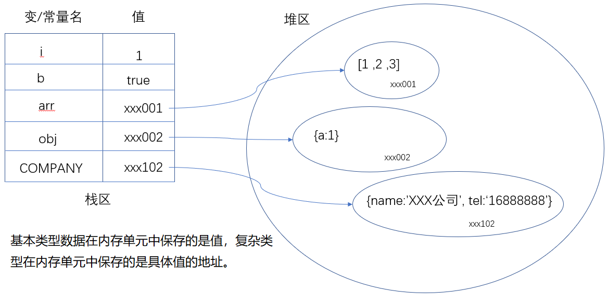

# ES6 介绍

## ES6 是什么

- [ECMAScript](https://baike.baidu.com/item/ECMAScript/1889420) 6，简称ES6 。是 Javascript 语言下一代标准。随着js语言应用场景的不断扩展，开发者需要编写的代码越来越复杂。在这个背景下，ES6 的目标是`使JavaScript语言可以用来编写复杂的大型应用程序，成为企业级开发语言 `。ES 是一种语言标准，6表示版本号。
- ECMA（European Computer Manufacturers Association）的第39号技术专家委员会（Technical Committee 39，简称TC39）负责制订ECMAScript标准组织每年都会发布ECMAScript的版本：
  - ES2015：称为es6。
  - ES2018:   https://www.ecma-international.org/ecma-262/8.0/index.html
  - ES2019：https://www.ecma-international.org/ecma-262/9.0/index.html
- ES6与javascript的关系：ECMAScript是一种语言标准，Javascript实现了这个标准（还有JScript和ActionScript也实现这个标准）。
  - 1996年11月，Javascript的创造者-----Netscape公司，决定将javascript提交给ECMA，以便使之成为国际标准。
  - 1997年，ECMA发布ECMA-262号标准文件，规定了浏览器脚本语言的标准，并将这种语言标准称为ECMAScript，这个版本就是1.0版本。
  - 这个标准开始就是针对 Javascript 语言制定的，但没有称其为 Javascript，主要原因如下：
    - 商标。Javascript本身已经被Netscape公司注册为商标。
    - ECMA比 Javascript更开放，更中立。
- ES6 与 ECMAScript2015的关系
  - ECMAScript2015 是具体到2015年6月发布的那一版。
  - **ES6有两层含义**
    - 特指ECMAScript2015
    - 泛指ES2015及之后的新增特性，虽然之后的版本应当称为ES2018，ES2019...但可统称为ES6。

## 学习内容

ES6新增了很多强大的语法，如下是比较常使用的：

1. let 和 const
2. 解构赋值
3. 函数扩展
4. 字符串扩展
5. 数组扩展
6. 对象的简写

其它内容，请自行补充学习。

## 学习参考

1. 各种环境中对es6的支持程度： <http://kangax.github.io/compat-table/es6/>
2. ES6电子书： <http://es6.ruanyifeng.com/#docs/intro>


# let 和 const

> 我们之前定义变量的关键字是`var`，它定义的变量有很多奇怪的特点，如下有两点比较突出：

- 变量先使用再定义------ 变量提升。

  ```js
  console.log(a);
  var a = 1;
  console.log(a)
  ```

- 缺少块级作用域。

  ```js
  // 此处为了使用循环，定义一个循环变量i。
  for(var i=1; i<10;i++){}
  // i在循环体之外也能使用。
  console.info(i);
  ```

这两个问题都容易让初学者混淆，也容易让从其它语言转过来的程序员混淆。为了解决这些问题，ES6中新增了let。

而ES6引入const的原因是，因为ES5中并没有提供`常量`的功能。

## let 变量

作用：定义变量。（var也是用来定义变量）

## let基本使用

格式： let 变量名 = 变量值；

它用来定义变量，基本使用格式与var关键字一样。在可以在使用var 的地方改成let。

## 与var的区别

- 不能重复定义
- 没有变量提升（var定义的变量是有变量提升的），必须`先定义再使用`
- 全局变量不会附加到window对象的属性中
- 具有块级作用域

### 代码演示

#### 不能重复定义

```js
// 1. let 定义变量，变量不可以再次定义
let name = 'zhangsan';
name = 'lisi';
console.log(name); // lisi
let name = 'wangwu'; // 再次定义，报错：Identifier 'name' has already been declared
```

#### 块级作用域

作用域

- 全局作用域
- 局部作用域
- 块级作用域（ES6中提出的）

如果是通过let关键字来定义变量的，则js代码中就可以通过{}来切分作用域了。

```js
// 具有块级作用域，块就是大括号
{
    let myAge = 18;
    console.log(myAge); // 18
}
console.log(myAge); // 报错，此作用域中没有myAge的定义

// 块级作用域的嵌套
{
    let a = 1;
    {
        let a = 2;
        console.log(a); // 2
        a = 3;
        console.log(a); // 3
    }
    console.log(a); // 1
}

// 隐藏的块级作用域
for (let i = 0; i < 10; i++) {
    // i 只能在此范围内使用，因为有块级作用域
}
console.log(i);  // 报错，此作用域中没有i的定义
```


#### 没有变量提升

通过let定义的变量，不再有没有变量提升，必须先定义再使用

```js
console.log(myGender); // 报错，此时还没有定义myGender
let myGender = '男'; 

console.log(myAge); // 不报错，输出undefined
var myAge = 13; 
```


#### 全局变量不会赋值加在顶级对象中

- 浏览器环境中顶级对象为window
- nodejs环境中顶级对象为global

let声明的全局变量不会以属性的形式附加在window对象中，全局变量与window对象再无关系。

```js
// 浏览器环境下代码：
let hobby = '吃饭';
var a = 1
console.log(window.hobby);  // undefined
console.log(window.a); // 1

// nodejs环境下代码：
let hobby = '吃饭';
var a = 1
console.log(window.hobby);  // undefined
console.log(window.a); // 1
```

ES6中保留了对var的支持，你可以在代码中同时使用var和let。当然，建议使用let。


## const 常量

### 使用场景

程序员在协同开发项目时，会遇到一种场景：有一些数据大家都需要用到，但是都不能修改，即数据是`只读的`。举个例子：在开发公司的网站时，公司的基本信息：地址，公司名，电话等等信息可以在多个地方都需要使用，但不允许去修改。 显示，使用变量来保存这些信息是不适合的，因为变量不是只读的。这种情况下， 我们就可以把这些数据保存在常量中。

### 语法格式及命名规范

作用：定义一个只读的常量。

格式： `const 常量名 = 常量值;`

示例：`var COMPANY_NAME = "XXX公司"`

注意：

- 区别于变量名，常量名**推荐采用全大写**的方式，多个单词之间**使用_下划线分隔**。

### const特点

所谓常量，就是不能修改，即：

- 一旦定义就不能修改；

- 一旦声明，就必须立即初始化；

```javascript
const a = 1;
a = 2; // 报错
```


其它与let相似的特点

- 具有块级作用域
- 没有变量提升，必须先定义再使用
- 常量也是独立的，定义后不会添加为window对象的属性

### 本质

`const`实际上保证的，并不是变量的值不得改动，而是`变量指向的那个内存单元中保存的数据不得改动`

```javascript
const obj = { a:1 };
obj.a = 2;
console.log(obj); // 问题：obj对象的属性值a是否修改了。
```

- 对于简单类型数据（数值、字符串、布尔值），值就保存在变量指向的那个内存单元，因此等同于常量值。

- 对于复杂类型数据（如对象和数组），变量指向的内存单元，保存的只是一个指向实际数据的指针，`const`只能保证这个指针是固定的（即总是指向另一个固定的地址），至于它指向的数据结构是不是可变的，就不能控制了。因此，`将一个对象声明为常量必须非常小心,它的属性是可以修改的`。

  

如果你真的希望**定义一个不能修改的对象**（属性不能添加，修改，删除），你可以使用Object.freeze()。下面是一段参考代码：它一个可以把一个对象全部冻结的函数（深冻结）:

```javascript
// 设置函数，对一个对象进行深冻结(用于防止复杂数据被修改)
function deepFreeze(obj) {
  Object.freeze(obj);
  for (var k in obj) {
    if (typeof obj[k] === 'object') {
      deepFreeze(obj[k]);
    }
  }
}

// 声明要冻结的对象
const obj = {
  name: 'jack',
  age: 18,
  hobbies: {
    eat: '吃',
    drink: '喝',
    run: '跑步',
    playBall: ['篮球', '弹球', '悠悠球']
  }
};

// 调用函数冻结对象obj
deepFreeze(obj);
obj.name = 'rose';
obj.hobbies.eat = '各种吃';
obj.hobbies.playBall[2] = '各种弹';
console.log(obj); // obj没有变化，说明冻结完成
```

## 小结

| 关键字 | 变量提升 | 块级作用域 | 是否必设初始值 | 是否可更改 | 是否是顶级对象属性 |
| :----: | :------: | :--------: | :------------: | :--------: | :----------------: |
|  let   |    ×     |     √      |       -        |    Yes     |         No         |
| const  |    ×     |     √      |      Yes       |     No     |         No         |
|  var   |    √     |     ×      |       -        |    Yes     |        Yes         |


# 解构赋值

> 我们经常会遇到一个场景：从对象中取出它的属性值，并保存在一个变量中。

例如：

```js
// 这里的item是一个对象{}，其中包含属性name和age
let name = item.name; 
let age = item.age;
```

另外，如ajax请求的回调函数

```js
$.ajax({
	// ..省略其它参数
	success : function(result){
		// 这里的result是一个对象，其中有code属性和data属性，data是一个数组
		if(result.code === 200){
			let data = result.data;
			data.forEach(); // ..省略内部操作
		}
	}
})
```

ES6提供了一个更加方便的方式从对象中取出属性值来，这就解构赋值。

## 定义

ES6 允许按照一定**模式**，从数组和对象中提取值，对变量进行赋值，这被称为解构（Destructuring）。

它有两个动作：

	- 解构：意思是把有结构的数据分解开成为一个一个的值
	- 赋值：把解构之后的值保存到变量

基本示例:

```javascript
let arr = [1, 2, 3, 4];
// 需求: 快速地从数组中取出值来赋值给变量a, b, c, d
let a = arr[0], b = arr[1], c = arr[2], d = arr[3];
console.log(a, b, c, d); // 1 2 3 4
```


## 数组的解构赋值

它能够快速从数组中取出值保存到变量中。它的本质是给变量赋值。

内容：

- 语法格式及解构规则
- 常规使用:变量个数等于数组长值
- 非常规使用
  - 变量个数大于数组长度
  - 变量个数小于数组长度
- 高级使用
  - 用空跳过不需要的值
  - 剩余值
  - 复杂嵌套场景
- 小面试题

### 语法格式及解构规则

格式：

```javascript
let [变量1=默认值1, 变量2=默认值2, 变量n=默认值n] = [数组元素1, 数组元素2, 数组元素n];
```

> 注：默认值是可选的，可以设置，也可以不设置；

规则：

- 赋值符号左右两边都是数组，把右边的数组按下标从小到大取出来，放入左边的数组中。
- 如果左边的变量并没有分配到某一个值：
  - 有默认值，使用其默认值。
  - 无默认值，其值是undefined
- 最开始的let可选，也可写成var或省略，与解构赋值功能无关，仅代表变量的声明方式。

### 基本示例

```js
//最简单的场景： 变量个数和数组中元素的是相等的
let arr = [5, 9, 10];
let [a, b, c] = arr;
console.log(a, b, c); // 输出 5 9 10
// 等价于：
let a = arr[0];
let b = arr[1];
let c = arr[2];
```

注意：

- “=”左右两边的格式要统一。

### 闯关练习(重要)

我们可以通过如下练习来掌握数组的解构赋值，搞定这些练习，解构赋值操作就没有什么问题啦~

```js
// 1 变量多，值少:
let arr = [5, 9, 10];
let [a, b, c, d] = arr;
console.log(a, b, c, d); // 5 9 10 undefined
// 结论：没有匹配上的值是undefined

// 2 默认值:
let arr = [5, 9];
let [a, b, c, d = 4] = arr;
console.log(a, b, c, d); // 5 9 undefined 4
// 结论：对于没有匹配上的变量，有默认值就使用默认值，否则就是 undefined，

// 3 变量少，值多:
let arr = [5, 9, 10, 8, 3, 2];
let [a, b] = arr;
console.log(a, b); // 5 9
// 结论：多余的忽略

// 4 用空跳过不需要的值:
let arr = [5, 9, 10, 8, 3, 2];
let [, , a, , b] = arr; 
console.log(a, b); // 10 3
// 结论：不需要用变量接收的值，用空位占位

// 5 复杂的场景，只要符合模式，即可解构:
let arr = ['zhangsan', 18, ['175cm', '65kg']];
// 5.1 如何让a的值是175cm,b的值是65kg?
let [, , [a, b]] = arr;
console.log(a, b); // '175cm' '65kg'
// 5.2 如何让wxyz对应arr中的四个数据呢？
let [w, x, [y, z]] = arr;
console.log(w, x, y, z); // 'zhangsan' 18 '175cm' '65kg'
```


### 剩余值

```js
let arr = [5, 9, 10, 8, 3, 2];
let [a, b, ...c] = arr; // ...c 接收剩余的其他值，得到的c是一个数组
console.log(a, b, c); // 结果为： 5 9 [10, 8, 3, 2]
// 等价于：
// let a = 5, 
// let b = 9, 
// let c = [10, 8, 3, 2]
```

注意：

- ... **只能用在最后一个变量上**。这个变量一定是一个数组。
- 在解构赋值的过程中，如果有出现数组元素个数大于变量个数的情况，它将会把多余的参数起来，保存在这个数组。如果元素个数不足（没有剩余元素），也会返回空数组。

### 一个解构赋值的小面试题

交换两个变量的值？

```javascript
let a = 1, b = 2;
// 写代码,实现互换a,b的值
// ???? 
 
[a, b] = [b, a];

console.log(a,b); // 要求输出 2, 1
```


## 对象的解构赋值

作用：快速从对象中获取值保存到变量中。它的本质是给变量赋值。

### 使用格式及规则

`完整格式`

```javascript
let {"属性名1"：变量名1=默认值1, "属性名2"：变量名2=默认值2,... } = {"属性名1"：属性值1,"属性名2"：属性值2,...}
```

解析规则：

- 默认值是可选的。你可以指定默认值，也可以不指定。
- 右边的"属性名"与左边的“属性名” 一致，则把右边的属性值赋值给左边的变量名。
- 如果右边的匹配不成立，看看是否有使用默认值，有默认值就使用默认值，没有就是undefined。

`精简格式`

如果左侧对象中属性名与变量名相同，则可左侧合并：

```javascript
let {变量名1=默认值1，变量名2=默认值2} = {"属性名1"：属性值1,"属性名2"：属性值2,...}
```

解析规则：

- 右边的"属性名"与左边的变量名 一致，则把右边的属性值赋值给左边的变量名。


### 基本使用

场景1，变量名和属性名一样

```js
// 场景1，默认要求变量名和属性名一样
let { name, age } = {age: 27, name: 'jack'};
console.log(name, age); // 'jack' 27

let {a, c} = {a: 'hello', b: 'world'};
console.log(a, c); // 'hello' undefined
```

注意：

- “=” 左右两边的格式一致。
- 对象是属性的无序集合，所以不需要管顺序

场景2，变量改名

```js
// 场景2，可以通过:为变量改名
let {b, name:a} = {name: '李雷'};
console.log(b, a, name); // undefined '李雷' undefined
// 解释：操作中，将属性name的值保存给变量a，所以只有a有值
```

#### 闯关练习

```js
// 默认值:
var {b=1, name:a,age:b=20 } = {name: '韩梅梅'};
console.log(b, a, name); // 2 '韩梅梅' undefined


// 复杂的嵌套，只要符合模式，即可解构
let obj = {
    name: '小红',
    age: 22,
    dog: {
        name: '小明',
        gender: '男'
    }
};
// 如何才能把age和name解析出来
let {name, age, dog: {name：dogName, gender}} = obj;
console.log(name, age, dogName, gender); // '小红' 22 '小明' '男'


// 假设从服务器上获取的数据如下
let response = {
    data: ['a', 'b', 'c'],
    meta: {
        code: 200,
        msg: '获取数据成功'
    }
}
// 如何获取到 code 和 msg
let { meta: { code, msg } } = response;
console.log(code, msg); // 200 '获取数据成功'


let {max,min,PI} = Math;
```


### 剩余值

```js
// 把其它的属性全收集起来
let obj = {name:'zs', age:20, gender:'男'};
let {name, ...a} = obj;
console.log(name, a);
// 结果：
// name = zs
// a = {age: 20, gender: "男"};
```


# 定义对象的简洁方式

- 对属性名的简化
- 对方法的简化，
  - 回想js高级课程class中的方法设置，写法是一样的。

```js
let name = 'zhangsan', age = 20, gender = '女';
let obj = {
    name: name, // 原来的写法
    age, // 对象属性和变量名相同，可以省略后面的 “:age”，下面的gender同理
    gender,
    fn1 : function(){  // 常规写法
        console.log(123);
    },
    fn2 () { // function可以省略 
        console.log(456);
    }
};
console.log(obj.age); // 20
obj.fn2(); // 456
```


# 函数的拓展

es6对函数的功能进行了一些拓展，补充了很多功能。学习这个部分的内容我们就可以更加灵活优雅地使用函数啦。

## 参数默认值

在定义一个函数时，我们可以给形参设置默认值：当用户不传入对应实参时，我们有一个保底的值可以使用。这个特性在ES6之前，是不支持的，我们以前会通过一些变通的方式来实现。

### 传统的默认值设置方式

参数的默认值在之前的课程内容已经涉及，例如在`xhr.open(请求类型,请求地址,是否异步) `方法中，第3个参数默认是true，即表示异步ajax。

- 默认值的意思是：
  - 如果传入对应实参，就用你传的值。
  - 如果不传，就使用某个特殊的、事先定义好的值。这个值也就是默认值。
- 示例代码：（以ajax课程中的ajax函数封装为示例）

```js
// ES5 中给参数设置默认值的变通做法，以ajax函数部分封装为示例：
function ajax (type, url, isAsync) {
	// 基本写法：  
  if(isAsync === undefined){
      isAsync = true;
  }
  // 简化写法：
	// isAsync = isAsync || true;
  
  console.log(type, url, isAsync);
	//.. 其他代码略
}
// 下面这两句是等价的
open("get","common/get"); // 参数3使用默认值true
open("get","common/get",true);

open("get","common/get",false);
```

以上代码是利用了形参的一个特点：没有传入对应实参的话，其默认值是undefined。

观察后发现，代码是可以工作的，但是显得很累赘，es6提供了更简单的实现。

### ES6的实现

#### 格式

```
function 函数名 (参数名1=默认值1，参数名2=默认值2，参数名3=默认值3){
    // 函数体
}
```

#### 示例

```js
function open(type, url, isAsync = true) {
    console.log(type, url, isAsync);
}
// 下面这两句是等价的
open("get","common/get")；// // 参数3使用默认值true
open("get","common/get",true);

open("get","common/get",false); 
```

思考与回忆：

- 能否跳过isAsync,url，而只给type设置默认值？

注意:

- 带默认值的形参放在形参列表的最右边。

### 练习

```javascript
function f(a = 1,b = 2){
	console.log(a, b);
}
f(10);
f(10,20);
f();

function f2(a = 1,b){
	console.log(a, b);
}
f2(10);
f2(10,20);
f2(,3); // 报错：Uncaught SyntaxError: Unexpected token
f2(); 

// 与解析赋值一起使用:
function f1({a = 1, b = 2} = {}){
   console.log(a, b);
}	

f1({a:10,b:20});
f1({a:20});
f1({c:1});
f1(); // 注意：如果形参位置不设置 = {}，会出现报错
```


## rest 参数

rest （其它的，剩余的）参数 用于获取函数多余参数，把它们放在一个数组中。

### 语法格式

> rest参数不能设置默认值，且必须设置在参数列表最后位置

在定义函数时，在最后一个参数前面加上`...`， 则这个参数就是剩余参数；

```javascript
let fn = function(参数1，参数2，...rest参数){}

let fn = (参数1，参数2，...rest参数) => { }; // 箭头函数具体使用，见下一小节。
```

只是在定义函数时，在形参列表中区别一下，而在调用函数时并无区别。

### 示例

回答如下问题

```javascript
function f2 (x,...y){
    console.log(x,y)
}
f2(1,2);
f2(2,3,4);

function f1 (x,y){
    console.log(x,y)
}
f1(1,2);
f1(2,3,4);
```

### 应用--代替arguments

问题：编写一个函数，求所有参数之和；

方法一：arguments

方法二：rest参数

```javascript
function getSum (){
    //  在这里写你的代码
    var sum = 0 ; 
    for(var i = 0; i < arguments.length; i++){
        console.info( arguemnts[i])
        sum += arguments[i];
    }
}
```

如果以箭头函数 的方式去定义这个函数，则内部不可以使用arguments这个对象了。此时，我们就可以使用

rest 参数，它可以替代 arguments 的使用。 代码如下：

```js
// 参数很多，不确定多少个，可以使用剩余参数
const  getSum = (...values) => {
    var sum = 0 ; 
    for(var i = 0; i < values.length; i++){
        console.info( values[i])
        sum += values[i];
    }
}
// 调用
console.log(fn(6, 1, 100, 9, 10));
```

与arguments相比，它是一个真正的数组，可以使用全部的数组的方法。

## 箭头函数

学习箭头函数能让代码更简洁，效率更高；能看懂别人写的代码 ；

```javascript
let fn3 = x => x * 2;
```


### 什么是箭头函数

> 箭头函数本质上是 匿名函数的简化写法。

ES6 中允许使用箭头函数的方式来定义一个函数。前面学习的定义一个函数有两种方式:

1. 函数声明式
2. 函数表达式

现在有了一个新的方式：

​	3. 箭头函数

### 格式

```javascript
let 函数名 = (形参1，...形参n) => {
    // 函数体
};
```


### 定义一个箭头函数

```js
// 1. 函数声明式
function fu1(x){
    return x * 2;
}
// 2. 函数表达式
let fn2 = function (x) {
    return x * 2;
};

// 3. 箭头函数 (赋值给变量，作为函数表达式使用)
let fn3 = (x) => {
    return x * 2;
};

// 对比2、3两种写法会发现，箭头函数的写法要比传统匿名函数简洁。
```

格式小结：

1. 去除function关键字
2. 在形参和函数体之间设置 `=>`

注意：

	=>是一个整体，不要加空格
	箭头函数只在书写格式上有些区别，但在函数调用方式上，是没有区别的。


### 简化写法

- 当形参有且只有一个，可以省略小括号

  ```js
  let f = (x) => {console.log(x)}
  // 可以简化成：
  let f = x => {console.log(x)}
  ```

- 当函数体只有一条语句，可以省略大括号; 

  ```js
  let f = x => {console.log(x);}
  // 可以简化成：
  let f = x => console.log(x);
  ```

- 当函数体只有一条语句，并且就是return语句，则可以省略return和大括号。

  - 如果省略了大括号，则必须省略return，否则报错

  ```js
  let f = x => {return x*2; }
  // 可以简化成：
  let f = x => x*2;
  ```

- 注意如果返回值是一个对象，要加()

  ```js
  let f = x => { return {a:1};  }
  // 可以简化成：
  let f = x => {a:1}; // 如果不加，{}会被认为是函数的代码块，不会被解析器当成对象处理
  let f = x => ({a:1});
  ```


### 箭头函数与普通函数的区别

- 内部没有this
- 内部没有arguments（了解）
- 不能作为构造器（了解）


#### 内部的`this`对象，指向定义时所在的对象，而不是使用时所在的对象。

```js
// 箭头函数中this的问题：
let obj = {
  name: 'jack',
  age: 18,
  sayHi() {
    // 方法中直接访问this：
    console.log(this); // 对象obj

    // 普通调用的函数中的this：
    var f1 = () => {
      console.log(this); // 对象obj
    };
    f1();

    // 同上：
    setTimeout(() => {
      console.log(this); // 对象obj
    }, 0);

    // 另一个对象的方法中的this
    let obj2 = { name: 'rose' };
    obj2.sayHehe = () => {
      console.log(this); // 对象obj
    };
    obj2.sayHaha = function () {
      console.log(this); // 对象obj2，因为没有使用箭头函数
    };
    obj2.sayHehe();
    obj2.sayHaha();

  }
};
obj.sayHi();
```


#### 没有 arguments

- 因为es6中提供了函数的rest剩余值功能，可以替代arguments

```js
let fn = (a,b) => {
    console.log(arguments); // 报错，arguments is not defined
};
fn(1, 2);
```


#### 箭头函数不能作为构造函数

```js
let Person = () => {
	// ..代码
};
let obj = new Person(); // 报错，Person is not a constructor
// 换个角度理解，箭头函数中都没有自己的this，无法处理成员，所以不能当构造函数
```

在javascript中，函数的功能太多了，除了起到最基本的封装代码之外，还可以当做构造器来使用。ES6中提出的箭头函数让函数减负了，只适合代码的封装操作。


#  数组的扩展

数组对象是js中非常重要的对象，它本身提供了非常多的方法，例如：push，pop，shift，unshift，splice，concat，sort，indexOf，join，map，forEach，filter，every，some，reduce... 。由于前端的主要工作内容之一是与后端进行数据交互，而数据交互的载体大多是数组和对象，所以我们对数组的操作要求也非常高。

曾经有一道面试题：写出10个你用过的与数组相关的方法。

这一小节的学习会让我们多掌握几个数组的方法。

## 扩展运算符

功能：它的作用是把数组中的元素一项项地展开：把一个整体的数组拆开成单个的元素。

格式：`...数组`

基本用法

```javascript
console.log(...[1,2,3]);
```

应用1：数组拷贝


应用2： 数组合并

从把一个数组中的值全取出来，放在另一个数组中的

```javascript
var arr0 = ['a', 'b'];
var arr1 = [1, 2, 3];
var arr2 = [...arr1];
var arr3 = [...arr0, ...arr1];
```

应用3：Math.max()

```javascript
Math.max(1,3,4,6);
var arr = [1,3,4,6];
Math.max(...arr);
// 或者 Math.max.apply(this, [1, 2, 3, 566]);
```

## Array.from()

功能：把其它伪数组的对象转成数组。

格式： `数组 = Array.from(伪数组对象)`

它的实参有三种情况：

1. 自定义的，类似数组格式的对象。

```js
let fakeArr = {
  0: 'a',
  1: 'b',
  2: 'c',
  length: 3
};
```

就是为了演示，并无实际应用价值。

2. arguments对象
3. DOM 操作返回的 NodeList 集合

## find方法

在实际的开发中，我们经常会遇到一种场景：从一个数组中找出符合条件的元素。我们要的讨论的重点是如何从数组中找出符合条件的元素，当然，我们可以通过手写循环的方式来实现这个功能，但是现在es6中提供了现成的功能。find/findIndex

作用：从数组中找出我们符合条件的第一个元素（或者是下标）。

### 格式

find和findIndex的格式是一致的。

```javascript
let result = [].find(function(item,index,self){ 
    //...
    // 如果满足查找的条件
    return true;
});
```

- 回调函数有三个参数，分别表示：数组元素的值、索引及整个数组
- 如果某次循环返回的是true，find和findIndex方法的返回值就是满足这个条件的第一个元素或索引

### 执行流程

- find和findIndex方法，会遍历传递进来的数组
- 如果在回调函数体内，某个时刻return true，则表示查找过程结果，返回值就是本轮循环中的元素（或者是下标）；如果全部的循环结束，也没有return true，则表示没有找到，没有找到会返回undefined。

- **findIndex** 找到数组中**第一个满足条件**的成员并**返回该成员的索引**，如果找不到返回 **-1**。

```js
let arr = [1, 2, 4, 0, -4, 3, -2, 9];
arr.find(function (item, index, self) {
    console.log(item); // 数组中的每个值
    console.log(index); // 数组中的每个索引/下标
    console.log(self); // 当前的数组
});
```

### 简单示例

```js
// 用法：找数组中第一个小于0的数字
let arr = [1, 2, 4, 0, -4, 3, -2, 9];
let result = arr.find(function (item) {
    return item < 0; //遍历过程中，根据这个条件去查找
});
console.log(result); // -4
```

注意通过箭头函数来简化代码。

### 实践应用

从一个复杂的对象数组中找出符合条件的对象。

```javascript
let data = [
    {id:2,name:'严高',age:15},
    {id:3,name:'徐阶',age:17},
    {id:4,name:'高拱',age:18},
    {id:1,name:'张居正',age:12},
];
```


## findIndex()

findIndex 的使用和 find 类似，只不过它查找的不是数组中的元素，而是元素的下标。


## includes()

功能：判断数组是否包含某个值，返回 true / false

格式：`数组.includes(参数1，参数2)`

- 参数1，必须，表示查找的内容
- 参数2，可选，表示开始查找的位置，0表示从第一个元素开始找。默认值是0。

示例：

```js
let arr = [1, 4, 3, 9];
console.log(arr.includes(4)); // true
console.log(arr.includes(4, 2)); // false， 从2的位置开始查，所以没有找到4
console.log(arr.includes(5)); // false
```

> ​	字符串也有这个方法，功能也是相似的。


#  Set对象

Set是集合的意思。是ES6 中新增的内置对象，它类似于数组，但是`成员的值都是唯一的，即没有重复的值`。使用它可以方便地实现用它就可以实现数组去重的操作。

## 创建set对象

- 创建空set；

- 根据已有数组创建set

```js
// 1. 基本使用
let set = new Set();
// 得到一个空的Set对象

let set = new Set([1,2,3])
```


## Set 的成员方法

- `size`：属性，获取 `set` 中成员的个数，相当于数组中的 `length`
- `add(value)`：添加某个值，返回 Set 结构本身。
- `delete(value)`：删除某个值，返回一个布尔值，表示删除是否成功。
- `has(value)`：返回一个布尔值，表示该值是否为`Set`的成员。
- `clear()`：清除所有成员，没有返回值。
- ` forEach`:遍历

## 应用-数组去重

```javascript
let arr = [1,1,2,3,3];
console.log([...new Set(arr)])
```


#  String的扩展

es6中对字符串提供了新的特性，我们介绍其中几个方法：

- 模板字符串
- includes
- startsWith
- endsWith
- repeat

## 模板字符串

在做字符串拼接时，使用`+`来拼接复杂内容是很麻烦的，而模板字符串可以解决这个问题。

格式：\``${变量}` `${表达式}`\`

语法：

- 模板字 符串使用反引号 **`** 把内容括起来，类似于普通字符串的""。
- ${}充当界定符的作用，其中可以写变量名，表达式等。
- 允许字符串内部进行换行，代码更好读更好的体验

示例：

```javascript
let name = 'zs';
let age = 18;
// 拼接多个变量，在模板字符串中使用占位的方式，更易懂
let str = `我是${name}，今年${age}`;

// 内容过多可以直接换行
let obj = [{name: 'flex', age: 20},{name: 'james', age: 21}];

let arr = ['175cm', '60kg'];
let html = `
	<div>
		<ul>
			<li>${obj.name}</li>
			<li>${obj.age}</li>
			<li>${arr[0]}</li>
			<li>${arr[1]}</li>
		</ul>
	</div>`;
```

## includes()

- 格式：`str.includes(searchString, [position])`		
- 功能：返回布尔值，表示是否找到了参数字符串
  - position: 从当前字符串的哪个索引位置开始搜寻子字符串，默认值为0。

## startsWith()

- 格式：`str.startsWidth(searchString, [position])`         
- 功能：返回布尔值，表示参数字符串是否在原字符串的头部或指定位置
  - position: 在 `str` 中搜索 `searchString` 的开始位置，默认值为 0，也就是真正的字符串开头处。

## endsWith()

- 格式：`str.endsWith(searchString, [len])`            
- 功能：返回布尔值，表示参数字符串是否在原字符串的尾部或指定位置.
  - len:可选。作为 `str` 的长度。默认值为 `str.length`。

## repeat()

`repeat`方法返回一个新字符串，表示将原字符串重复`n`次。

语法:`str.repeat(n)`

```js
let html = '<li>itheima</li>';
html = html.repeat(10);
```


#  ECMAScript 6 降级处理

##  ES 6 的兼容性问题 ###

- ES6 (2015年10月)虽好，但是有兼容性问题，IE7-IE11 基本不支持 ES6

  [ES6 兼容性列表](http://kangax.github.io/compat-table/es6/)

- 在最新的现代浏览器、移动端、Node.js 中都支持 ES6

- 后续我们会讲解如何处理 ES6 的兼容性

##  ES 6 降级处理 ###

因为 ES 6 有浏览器兼容性问题，可以使用一些工具进行降级（把ES6的代码转成ES5的代码·），例如：**babel**


babel官网](https://www.babeljs.cn/)

实时转码：https://babeljs.io/repl

# ES2020新特征

ES2020发布了新特性 [https://github.com/tc39/proposals](https://links.jianshu.com/go?to=https%3A%2F%2Fgithub.com%2Ftc39%2Fproposals)

### 新功能概览

1. 可选链运算符 - Optional Chaining
2. 空值合并运算符 - Nullish coalescing Operator
3. 标准化的全局对象 - globalThis
4. Promise.allSettled
5. String.prototype.matchAll
6. BigInt
7. for-in mechanics
8. 异步加载模块 - import()

详细介绍

### 1. 可选链运算法

我们有时候为了访问深层嵌套的属性，一不小心就会报`undefined`的错，需要写一个很长的`&&`链去检查每个属性是否存在，代码如下


```kotlin
  let name = result && result.data && result.data.info && result.data.info.name;
```

如果不这么做，很可能会报程序异常 `Uncaught TypeError: Cannot read property 'xxx' of undefined`,为了简化上述的代码，ES2020新增了**可选链运算符**，就是在需要判断是否存在的属性后面加上`?`，代码如下：


```bash
let name = result?.data?.info?.name;
```

可选运算符也可以作用到方法上，如下


```bash
let name = getUserInfo?.().data?.info?.name;
```

### 2.空值合并运算法 - Nullish coalescing Operator

获取对象的属性的时候，我们经常需要为`null/undefined`的属性设置默认值。现在我们都是使用`||`运算符来处理，例如：


```bash
let userInfo = {};
let name = userInfo.name || 'Lucky';
```

但是，这么做会导致 `false 、0 , ' '`等属性值被覆盖掉，导致运算结果不准确，为了避免这种情况，ES2020新增了 **空值合并运算符 ??**，代码如下：


```kotlin
const result = {
  data: {
    nullValue: null,
    numberValue: 0,
    textValue: '',
    booleanValue: false
  }
};
const undefinedValue = result.data.undefinedValue ?? 'default value';
// 'default value'
const nullValue = result.data.nullValue ?? 'default value';
// 'default value'
const numberValue = result.data.numberValue ?? 200;
// 0
const textValue = result.data.textValue ?? 'default value';
// ''
const booleanValue = result.data.booleanValue ??  true;
// false
```

### 3. 标准化的全局对象-globalThis

Javascript在不同的环境中获取全局对象的方式不同：
 node: 通过 global;
 浏览器：通过window、self等，甚至通过this，但是this的指向比较复杂，依赖当前的执行上下文;

过去获取全局对象，可通过下面的函数：


```jsx
const getGlobal = () => {
  if (typeof self !== 'undefined') return self;
  if (typeof window !== 'undefined') return window;
  if (typeof global !== 'undefined') return global;
  throw new Error('unable to locate global object');
}
const globals = getGlobal(); 

if (typeof globals.setTimeout !== 'function') { 
  // 此环境中没有 setTimeout 方法！
}
```

ES2020提供的globalThis，目的就是提供一种标准化方式访问全局对象。上述的方法就可以直接改成


```csharp
if (typeof globalThis.setTimeout !== 'function') {
  //  此环境中没有 setTimeout 方法！
}
```

### 4.Promise.allSettled

`Promise.all`可以并发执行多个任务，但是Promise.all有个缺陷，那就是只要其中有一个任务出现异常了，就会直接进入catch的流程，所有任务都会挂掉，这不是我们想要的。


```jsx
const promise1 = new Promise((resolve) => setTimeout(resolve, 200, 'ok'));
const promise2 = new Promise((resolve, reject) => setTimeout(reject, 100, 'bad'));
const promises = [promise1, promise2];

Promise.all(promises)
  .then(result => {
    // 不会触发
   })
  .catch((err) => {
    console.log(err); // bad
  })
  .finally(() => {
    // 会触发，获取不到我们想要的内容
  })
```

这时候需要一个方法来保证如果一个任务失败了，其他任务还会继续执行，这样才能最大限度的保障业务的可用性。
 ES2020提供的`Promise.allSettled`可以解决这个问题，`Promise.allSettled`会返回一个promise,这个返回的promise会在所有输入的promise  resolve或reject之后触发。看代码：


```jsx
const promise1 = new Promise((resolve) => setTimeout(resolve, 200, 'ok'));
const promise2 = new Promise((resolve, reject) => setTimeout(reject, 100, 'bad'));
const promises = [promise1, promise2];

Promise.allSettled(promises)
  .then((results) => results.forEach((result) => console.log(result)));

// output:
// {status: "fulfilled", value: "ok"}
// {status: "rejected", reason: "bad"}
```

### 5. String.prototype.matchAll

我们先来看一下 `String.prototype.match`


```xml
const str = '<p>JS</p><p>正则表达式</p>';
const reg = /<\w+>(.*?)<\/\w+>/g;
console.log(str.match(reg));

// output: ['<p>JS</p>', '<p>正则表达式</p>']
```

可以看出返回的数组里包含了父匹配项，但未匹配到子项('JS'、'正则表达式')。
 移除全局搜索符`g`试试


```xml
const str = '<p>JS</p><p>正则表达式</p>';
const reg = /<\w+>(.*?)<\/\w+>/; // 这里把 g 去掉了
console.log(str.match(reg));

// output: 
/*
["<p>JS</p>", "JS", index: 0, input: "<p>JS</p><p>正则表达式</p>", groups: undefined]
*/
```

这样可以获取到匹配的父项，包括子项，但只能获取到一个满足的匹配字符。

**如何获取到全局所有匹配项，包括子项呢？**
 ES2020提供了一种简易的方式：`String.prototype.matchAll`,该方法会返回一个迭代器。


```xml
const str = '<p>JS</p><p>正则表达式</p>';
const reg = /<\w+>(.*?)<\/\w+>/g; // 这里是带 g 的
const allMatches = str.matchAll(reg);

for (let item of allMatches) {
    console.log(item);
}

/*
output:
第一次迭代：
[
  "<p>JS</p>",
  "JS",
  index: 0,
  input: "<p>JS</p><p>正则表达式</p>",
  groups: undefined
]
第二次迭代：
[
  "<p>正则表达式</p>",
  "正则表达式",
  index: 9,
  input: "<p>JS</p><p>正则表达式</p>",
  groups: undefined
]
*/
```

能看到每次迭代中可获取所有的匹配，以及本次陪陪的成功的一些其他的信息。

### 6. BigInt

JS中Number类型只能安全的表示`-(2^53-1)`至`2^53-1`范围的值，即Number.MIN_SAFF_INTERGER 至 Number.MAX_SAFF_INTERGER,超出这个范围的整数计算或者表示会丢失精度。
 比如，我们在开发过程中，有时候订单id会特别长，返回到浏览器就会失去精度，只能用字符串来传。


image.png


ES2020提供了一个新的数据类型：BigInt。使用BigInt有两种方式：

1. 在整数字面量后面加`n`


```bash
let bigIntNum = 9007199254740993n;
```

1. 使用`BigInt`函数


```bash
let bigIntNum = BigInt(9007199254740993);
```

通过BigInt，我们就可以安全的进行大数整型计算了。


```csharp
let big = 9007199254740994n + 9007199254740994n; // 结果为 18014398509481988n
```

**注意：**
 BigInt 跟 number 不严格相等


```bash
0n === 0    //false
0n == 0    // true
```

BigInt不能跟number 一起运算


```cpp
1n + 2 
// VM8334:1 Uncaught TypeError: Cannot mix BigInt and other types, use explicit conversions...
```

不能使用`+`把BigInt转化成number


```jsx
+1n
// TypeError: Cannot convert a BigInt value to a number
Number(1n)
// 1
```

### 7. for-in mechanics

之前在不同的引擎下for int循环出来的内容顺序可能是不一样的，现在标准化了。

### 8. 异步加载模块 - import()

有时候我们需要动态加载一些模块，这时候就可以使用ES2020提供的`import()`了


```jsx
// utils.js
export default {
  test: function () {
    console.log('test')
  }
}

// index.js
import('./utils.js')
  .then((module) => {
    module.default.test();
  })
```

### 后记

项目中使用ES2020,只需要在babel配置文件中添加


```json
{
  "presets":  ["es2020"]
}
```

### 参考资料

[https://github.com/tc39/proposals/blob/master/finished-proposals.md](https://links.jianshu.com/go?to=https%3A%2F%2Fgithub.com%2Ftc39%2Fproposals%2Fblob%2Fmaster%2Ffinished-proposals.md)
 [https://zhuanlan.zhihu.com/p/100251213](https://links.jianshu.com/go?to=https%3A%2F%2Fzhuanlan.zhihu.com%2Fp%2F100251213)


