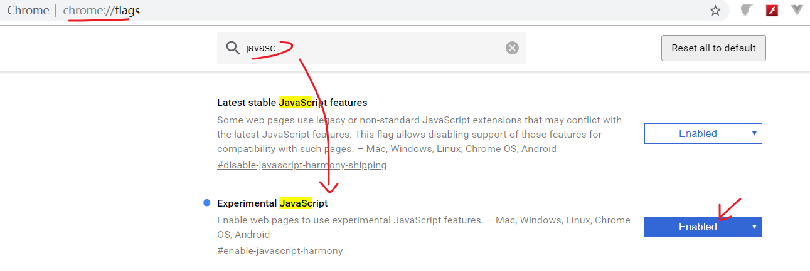
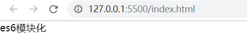
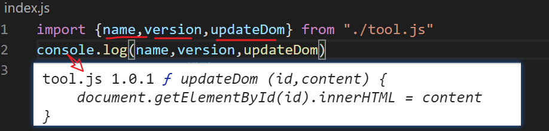

学习使用es6的模块化


## 引入

历史上，javascript作为一门解释型的弱类型语言一直不被人看重。其中有很一个很重要的因素是它没有模块体系。

模块体系说起来很高大上，其实就是一句话：它不支持在一个.js中引入另一个.js文件。

例如：

有两个文件：a.js，b.js

```javascript
// a.js
function f1() {}

```

b.js

```
// 如何去使用a.js中定义的f1?
```

这个问题在其它很多编程语言中都不是问题，例如java,php,c,c++,python..... 。 

在es6出来之前，解决这个问题很痛苦，有如下两种曲线救国的方法：

1. 在.html中先引入a.js，再引入b.js。这样就可以直接在b.js中使用f1了。
2. 第三方的模块工具：sea.js，require.js。


这两种方式可以达到目标，但没有能从根上解决javascript不支持模块的苦楚（甚至css都有自已的@import可以导入另外的css）。


好了，es2015登场，带着自已强大的语法能力回来了，它的目标是成为一门企业级的开发语言，它带着基因中的模块化回来了。


下面我们来学习es6中的模块化吧。

- 如何搭建一个支持es6模块化的环境
- 学习import ,export 

## 如何搭建一个支持es6模块化的环境

如何搭建一个支持es6模块化的环境?我们不是一直就在浏览器中js代码吗？难道浏览器中不支持es6的模块化吗？


先给你一个坏答案：不支持！


是不是很惊喜？是不是很意外？ 一个nb的es6中自带一个nb的模块化机制，居然在浏览器中不能直接用。哈哈。就是这样！

### 浏览器不支持es6模块化

写一份代码试一试，让你被错误打击一下。

一共涉及三个文件如下：

```
- index.html 在这里引入 index.js
- tool.js 定义updateDom()
- index.js 引入tool.js并使用updateDom()方法
```

代码如下：

```javascript
<!DOCTYPE html>
<html lang="zh">
<head>
  <title>es6模块化</title>
</head>
<body>
  <div id="app">
  </div>

  <scriptsrc="./index.js"></script> 
</body>
</html>
```

tool.js

 ```javascript
function updateDom(id,content) {
  document.getElementById(id).innerHTML = content
}

export default updateDom
 ```


index.js

```javascript
import tool from "./tool.js"

tool("app",'es6模块化')
```


此时，你打开浏览器去访问index.html，肯定会报一个错误给你说"import 不认识" 。

至少我的chrome74.0.3729.131 是这么无情。号称程序员最喜欢的浏览器都不支持，那其它的浏览器就别想了。


现在你应该可以认同我的结论的了吧，**如果你想尝试使用es6的模块化，需要自已有一个环境。**


下面来说如何去搭建一个支持es6模块化的环境。我给你三个选择：

- 方法一：用webpack之类的打包工具来打包es6成es5，这样你可以先写es6再转成es5。
- 方法二：用前端框架中的脚手架工具创建一个项目，例如vue-cli去创建一个vue项目，也是可以支持的。
- 方法三：给chrome设置一个开关，并小改一下代码。


好吧，我估计你会选择第三个。

### 让chrome浏览器支持es6模块化

需要两个步骤，就可以在chrome浏览器感受es6的模块化了，来，坐稳：

1. 启用es6的特性.

   打开chrome浏览器，在地址栏中输入 `chrome://flags`;  找到`experimental javascript`，启用它；最后重启chrome浏览器。（注，我的版本是：chrome74.0.3729.131）



2 .修改index.html中引入.js 的方式

```
<!DOCTYPE html>
<html lang="zh">
<head>
  <title>es6模块化</title>
</head>
<body>
  <div id="app">
  </div>

  <script type="module" src="./index.js"></script> 
</body>
</html>
```

- 注意到上面的type="module"

3. 好吧，再去运行上面的代码

index.js

```

import tool from "./tool.js"

tool("app",'es6模块化')
```

tool.js

```
function updateDom(id,content) {
  document.getElementById(id).innerHTML = content
}

export default updateDom
```

结果如下 ：



好了。你有一个可以去尽情使用es模块化的环境，下面去到export , import的世界里开心的玩耍吧。


## import 和export

es6的模块功能由export 和import这两个命令来提供。

- 模块。就是一个独立的.js文件。一个.js就是一个模块。

- export 命令。用来在模块内部导出你想要对外开放的接口功能。
- import命令。用来输入其它模块提供的功能。


## export

### export 导出多个 

下面修改tool.js中的内容如下：

```javascript
export let name = "tool.js"
export const version = "1.0.1"
export function updateDom (id,content) {
    document.getElementById(id).innerHTML = content
}
```

在上面的模块内部，我们通过export 命令导出了 三个 东东。

下面去index.js来试着导入它们：修改在index.js中的代码

````
import {name,version,updateDom} from "./tool.js"
console.log(name,version,updateDom)
````

打印结果如下：



注意：

- export在模块内部多次使用。
- import要与export一一对应。


### export 导出多个

下面两段代码是等价的：

```javascript
export let name = "tool.js"
export const version = "1.0.1"
export function updateDom (id,content) {
    document.getElementById(id).innerHTML = content
}
```

上面是多次export，下面是一个export，但是效果是一样的。

 ```javascript
let name = "tool.js"
const version = "1.0.1"
function updateDom (id,content) {
  document.getElementById(id).innerHTML = content
}

export { name, version, updateDom}
 ```

在import时也是需要这样：

```javascript
import {name,version,updateDom} from "./tool.js"
```

> 我觉得只使用一个export会比较好看一些，但是，如果我的团队里有人是写多个export，我也觉得ok，我这人比较好说话。哈哈


### export 导出时给起别名

在模块内部，自已想起什么函数名，变量名都可以，因为在导出时可以起别名。

例如下面我给函数起名叫`updateDom`,但是导出时，我们换个名字`modifyDom`

```
//tool.js
let name = "tool.js"
const version = "1.0.1"
function updateDom (id,content) {
  document.getElementById(id).innerHTML = content
}

export { name, version, updateDom as modifyDom}
```

那在另一个index.js中导入这个模块时，也必须用modifyDom这个名字了。

```javascript
import {name,version,modifyDom} from "./tool.js"
console.log(name,version,modifyDom)
```


### import 整体导入

对于import来说，它要导入某个模块中的内容，在不确定知道模块中的方法名，函数名，变量时，是很痛苦的。

例如：在index.js中要导入tool.js，要这样写：

```
import {name,version,modifyDom} from "./tool.js"
```

其实这里有一个隐藏的前提：name,version,modifyDom ... 这些名字在index.js要提前知道。

如果写错名字，就导入失败了。对于import来说，有没有方法可以不用提前去拘泥于tool.jsk 的各个名字呢？


有， 这个方法就是整体导入

```javascript
import * as obj from "./tool.js"

console.log(obj)

console.log(obj.name)

console.log(obj.version)
```


## export default

在上面的例子，当用户要引入一个模块时，我们在index.js中的import的写法是：

```
// 按需逐个引入
import { name, version } from "./tool.js"
// 整体导入
import * as obj from "./tool.js"
```

而你直接写

```
import obj from "./tool.js"
```

就挂了。错误提示是这样的：

```
index.html:1 Uncaught SyntaxError: The requested module './tool.js' does not provide an export named 'default'
```

其实使用引用别人模块的index.js来说，`import obj from "./tool.js"`的意思是：我不管你的tool.js模块里面有什么，我直接就是想要把它们全导到obj中。

但是，es6的语法不支持你这么做（nodejs中的模块化在这一点就好的多）。

如果你是开发tool.js的人，也是就提供模块给他人来使用的人，你可以通过export default来给使用你模块的人一个结果，让他避免上述的错误。

### 基本使用

在tool.js中添加一句`export default name`

```javascript
let name = "tool.js"
const version = "1.0.1"
function updateDom (id,content) {
  document.getElementById(id).innerHTML = content
}
export default name; // 新加的。默认导出tool.js
export { name, version, updateDom as modifyDom}
```

在index.js中使用：

```
// 把tool.js中默认导出的部分放在obj中
import obj from "./tool.js"

console.log(obj) // 输出tool.js
```


### export default 只有一个

在tool.js中来两个export default，如下

```

let name = "tool.js"
const version = "1.0.1"
function updateDom (id,content) {
  document.getElementById(id).innerHTML = content
}
export default name; // 新加的
export default {name, version}; // 再来一个，会报错
export { name, version, updateDom as modifyDom}
```

一个模块中只能有一个默认导出，多了就会报错。

```
Uncaught SyntaxError: Identifier '.default' has already been declared
```


### export default与export同时使用

在模块内部导出东东时，可以它们一起使用，如下

tool.js

```javascript
let name = "tool.js"
const version = "1.0.1"
function updateDom (id,content) {
  document.getElementById(id).innerHTML = content
}
export default {version};  
export { name, updateDom}
```

在导入模块时，分别去接收export default的内容 和export的内容。

在index.js中

```
import obj, {name, updateDom} from "./tool.js"
console.log(obj) // 得到export default的内容 {version:'1.0.1'}
console.log(name)  // tool.js
console.log(updateDom) // function updateDom
```


### export default 的本质

它的本质，好吧，再说吧 。你先掌握上面的再说吧。

## 小结

小结一下吧。

| 导出方式(a.js)                                    | 导入方式                            |      |
| ------------------------------------------------- | ----------------------------------- | ---- |
| export let name=''; export function f1=function() | import {name,f} from './a.js'       | 正确 |
| export ｛ name,f1}                                | import {name,f} from './a.js'       | 正确 |
| export default {name,f1}                          | import obj from './a.js'            | 正确 |
| export ｛ name,f1}                                | import obj from './a.js'            | 错误 |
| export {name,f1}; export default {version};       | import obj, {name,f1} from './a.js' | 正确 |

