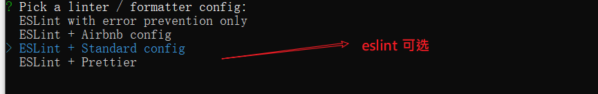
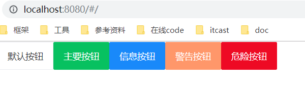
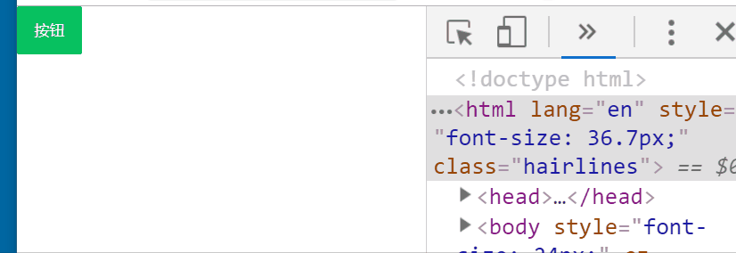

# 项目起步

目标：

- 创建项目
- 调整目录结构
- 代码托管
- 引入Vant
- REM适配
- 封装axios

## 创建项目

创建项目：

```sh
vue create mheima95
```

采用自定义方式去创建项目：

- 手动选择特性
- 依赖插件：Babel, Router,Vuex,CSS Pre-processors, Linter
- 
- 路由是否使用history模式：不采用
- 
- css 预处理器: 使用less
- 
- 语法风格：Standard
- 
- 检查节点：保存时检查，提交时检查
- 存储插件配置位置：单独放在不同的文件中 in dedicated config files。
- 

创建完毕启动项目


##  github|gitee代码托管

采用vue cli创建完成项目之后，它会自动在本地初始化代码仓库，所以接下来你可以选择把本地仓库链接到某个远程仓库中去。

这一步是可选的。

步骤：

1. 在github上创建**同名**的**空的**仓库
2. 把本地的仓库与远程仓库关联
3. 推送代码

### 在github上创建

在github上创建一个与本地项目同名的仓库。在创建的过程中，只填写项目的名称，而它的选项保持为空，这样的好处在于这个远程仓库是完全空的，有利于我们直接把本地的仓库内容推进来。


github仓库创建完成之后，可见到如下类似页面。


### 关联

回到本地项目中，通过git命令可以看到，我们在用vue 脚手架时，就已经给我们提交了一次代码。


接下来，我们把本地创建好的仓库与github上的仓库关联起来，并同步一次代码。

```bash
git remote add origin https://github.com/fanyoufu/hm-toutiao-m-100.git
```


###  推送


如果一切顺利，你就可以在github上的仓库中看到我们刚才推送的代码了。


### 正常的git操作

```bash
git add .
git commit -m ""
git push  // 只需要写push ，后面不再需要添加其它的参数
```


### 把本地的新分支推送到远程

1. 在本地建立分支，并正常commit

2. 创建用当前分支的代码去创建远程分支

   ```
   git push origin 当前分支名:远程分支名
   ```

3. 推送并建立关联：`git push --set-upstream origin 分支名`
4. 后续推送，就直接 `git push`

## 调整目录结构

默认生成的目录结构不满足我们的开发需求，所以这里需要做一些自定义改动。

这里主要就是下面的两个工作：

- 删除初始化的默认文件
- 新增调整我们需要的目录结构

```sh
├── node_modules
├── public	静态资源托管目录
│   ├── favicon.ico
│   └── index.html
└── src	源码
    ├── api	请求接口封装模块
    ├── assets	资源目录
    ├── components	组件目录
    ├── router	路由模块
    ├── store	 Vuex容器模块
    ├── styles 样式目录
    ├── utils  工具模块目录
    ├── views  视图组件目录
        ├─home  #首页模块
        	├── index.vue
        ├─video #视频模块
        	├── index.vue
        ├─question #问答模块
        	├── index.vue
        ├─search #搜索模块
        	├── index.vue
        ├─user #用户模块
        	├── index.vue
        └─Layout.vue #公用布局
    ├── App.vue	根组件
    └── main.js	入口文件
├── .browserslistrc
├── .editorconfig
├── .eslintrc.js
├── .gitignore
├── babel.config.js	#babel配置文件
├── package-lock.json	#npm相关文件
├── package.json	#npm相关文件
├── postcss.config.js	#postcss配置文件
└── README.md	#项目说明文件
```

在 src 目录下中补充创建以下目录：

- /api ： 存储请求函数模块
- /styles:样式文件模块
- /utils:工具函数模块

### 删除一些文件

清空src/views/App.vue中的内容。

```
<template>
  <div id="app">
    <router-view/>
  </div>
</template>

<style lang="less">
</style>
```

删除默认生成的一些文件：

- components/HelloWorld.vue
- views/Home.vue
- views/About.vue
- assets/logo.png


## 引入移动端组件库 Vant


> 参考：
>
> https://youzan.github.io/vant/#/zh-CN/quickstart

基于 Vue.js 的移动端组件库有很多，在官方的 [awesome](https://github.com/vuejs/awesome-vue#mobile) 中也推荐了一些：

- vux
- mint(element-ui)
- vant

在我们的项目中使用的是**有赞**开发的 [Vant](https://github.com/youzan/vant)。

### 导入方式

完整引入

- 好处：使用方便
- 缺点：打包体积大

按需引入（建议）

- 好处：打包体积小
- 缺点：相对于全部引入要稍微麻烦一些


将 Vant 导入项目中，这里直接使用完整引入方式。

### 操作步骤

1.安装 Vant

与element-ui一致。

```bash
npm i vant
```

2. 引入 Vant 组件

src/main.js 注册组件：

```javascript
import Vue from 'vue';
import Vant from 'vant';
import 'vant/lib/index.css';

Vue.use(Vant);
```

3. 测试使用：

在App.vue中，测试使用

```html
<van-button type="default">默认按钮</van-button>
<van-button type="primary">主要按钮</van-button>
<van-button type="info">信息按钮</van-button>
<van-button type="warning">警告按钮</van-button>
<van-button type="danger">危险按钮</van-button>
```



### vscode中vant插件

这个操作是**可选的**。

如果你使用的是vscode编辑器，还可以安装vant提供的插件功能，以便快速键入vant组件结构。


## REM适配

因为这个项目是移动端，所以，它需要去适配不同的手机屏幕。我们希望实现适配的效果是：与屏幕大小相关。以按钮为例：**在大屏手机，按钮的宽高都大些，在小屏手机上尺寸小些**。

技术手段：

- 把所有px单位改成rem （[postcss-pxtorem](https://github.com/cuth/postcss-pxtorem) ）
- 根据不同的手机屏幕的宽度，来动态设置rem的参考值：html标签上的font-size的大小。（[lib-flexible](https://github.com/amfe/lib-flexible) ）


Vant组件采用的是流式布局：在页面宽度变化时，组件的宽度也变化，但是高度是不变的。这与我们的目标有一点差距。

[地址](https://youzan.github.io/vant/#/zh-CN/quickstart#rem-gua-pei)

Vant 中的样式默认使用`px`作为单位，如果需要使用`rem`单位，推荐使用以下两个工具一起工作，来达到目标。

- [postcss-pxtorem](https://github.com/cuth/postcss-pxtorem) 是一款 postcss 插件，用于将px转化为 rem
  - 它需要设置在开发依赖
- [lib-flexible](https://github.com/amfe/lib-flexible) 用于设置 rem 基准值 
  - 它对应的包名不是这个名字。
  - 它需要是生产依赖

### 安装包

这两个包在安装时有一些区别

```sh
# 后处理器 开发阶段使用
# 作用：把px单位自动转成rem单位
npm i postcss-pxtorem -D
# 修改rem基准值的js插件   需要在打包后需要使用
# 作用: 根据设置屏幕的宽度去调整rem的值（html标签上font-size的大小）
#       它的计算方式是屏幕宽度的1/10
npm i amfe-flexible
```

### 设置postcss

修改根目录下的**postcss.config.js** 文件（如果没有这个文件，可以手动添加一份）

```javascript
module.exports = {
  plugins: {
    'autoprefixer': {},
    'postcss-pxtorem': {
      rootValue: 37.5,
      propList: ['*']
    }
  }
}
```

这一步完成之后，它会把原来样式中的px单位自动转成rem单位。


上图是转之前的，下图是转之后的。


> 如果没有生效，重启一下项目`npm run serve`。


### 引入flexible

最后，入口文件main.js导入 amfe-flexible 

```js
import Vue from 'vue'
import App from './App.vue'
import router from './router'
import store from './store'

// 引入Vant所有的组件
import Vant from 'vant'
// 用它的样式
import 'vant/lib/index.css'

// 它会根据的手机尺寸来调整rem的基准值：html标签上的font-size。
import 'amfe-flexible'
```

注意

- rootValue 是转换px的基准值，参考设备iPhone6，设备宽度375px。
- flexible 在iPhone6设备设置的  html--->font-size 也为37.5px 。
- 但是 设计稿 尺寸750px 大小，所以在设计稿量取的尺寸使用时候需要  **除以2**  。

最后的效果如下：




## 封装 axios 请求函数

为了调用ajax方便，这里我们先对 axios进行一次封装为一个请求模块，在需要的时候直接加载使用。

思路：

- 安装aixos包

- 对axios进行二次封装，把基地址提前写好。

### 安装 axios

```bash
npm i axios
```

### 封装

创建 `utils/request.js` ， 在这个文件中写代码。


之前：

```javascript
axios.defaults.baseURL = 'XXX'
axios.get()
axios.post()
```

如果一个项目中的接口地址分别在多台不同的服务器上，即它们的基地址是不同的，那么上面的做法就不好做了---原因很简单:defaults.baseURL只能写一个。


此时，我们也就可以使用[自定义](https://www.npmjs.com/package/axios#axioscreateconfig)的方式。

```js
import axios from 'axios'

// axios.create 方法
const request = axios.create({
  baseURL: 'http://ttapi.research.itcast.cn'
})

export default request

```


### 调用测试

在app.vue组件中去测试一下这个封装的效果。

> 只是测试一下axios的用法代码的效果，后期会删除这些代码的。

```javascript
// 导入
import request from './utils/request'

export default {
  created() {
    // 发送get请求
    request.get('/app/v1_0/channels').then(res => {
      console.log(res)
    })
  }
}
```

可以在控制台中看到类似如下：


## 整体路由设置

目标：

- 把项目中所有用到的组件及路由表定下来

### 约定路由规则

| path           | 文件                     | 功能     | 组件名       | 路由级别 |
| -------------- | ------------------------ | -------- | ------------ | -------- |
| /login         | views/login/index.vue    | 登录页   | Login        | 一级路由 |
| /              | views/layout/index.vue   | 布局     | Layout       | 一级路由 |
| ├─ /           | views/home/index.vue     | 主页     | Home         | 二级路由 |
| ├─ /question   | views/question/index.vue | 问答     | Question     | 二级路由 |
| ├─ /video      | views/video/index.vue    | 视频     | Video        | 二级路由 |
| ├─ /user       | views/user/index.vue     | 个人中心 | User         | 二级路由 |
| /user/profile  | views/user/profile.vue   | 编辑资料 | UserProfile  | 一级路由 |
| /user/chat     | views/user/chat.vue      | 小智同学 | UserChat     | 一级路由 |
| /search        | views/search/index.vue   | 搜索中心 | Search       | 一级路由 |
| /search/result | views/search/result.vue  | 搜索结果 | SearchResult | 一级路由 |
| /article/:id   | views/article/index.vue  | 文章详情 | Article      | 一级路由 |


### 实现路由配置

```js
import Vue from 'vue'
import VueRouter from 'vue-router'
import Layout from '../views/Layout.vue'

Vue.use(VueRouter)

const routes = [
  {
    path: '/login',
    name: 'login',
    // // 后面接一个箭头函数。
    // const f = () =>  {
    //   return import('../views/login/index.vue')
    // }
    // 它的返回就是import进来这个组件
    // 组件懒加载 ：只有当你访问这个路由时，它才会去加载这个组件
    component: () => import('../views/login/index.vue')
  },
  {
    path: '/',
    component: Layout,
    children: [
      { path: '/', name: 'Home', component: () => import('../views/home/index.vue') },
      { path: '/question', name: 'Question', component: () => import('../views/question/index.vue') },
      { path: '/video', name: 'Video', component: () => import('../views/video/index.vue') },
      { path: '/user', name: 'User', component: () => import('../views/user/index.vue') }
    ]
  }
  // {
  //   path: '/about',
  //   name: 'About',
  //   // route level code-splitting
  //   // this generates a separate chunk (about.[hash].js) for this route
  //   // which is lazy-loaded when the route is visited.
  //   component: () => import(/* webpackChunkName: "about" */ '../views/About.vue')
  // }
]

const router = new VueRouter({
  routes
})

export default router

```

- 根据约定的路由规则定义。
- 且先定义规则对应的组件。


### 全局样式

`src/styles/index.less`

```less
// 全局样式 在main.js中引入即可
.van-nav-bar{
    background-color: #3196fa;
    .van-nav-bar__title{
        color:#fff;
    }
}

```


### 功能组件的基本架子

目标：把路由表中的各个组件都做出一个基本的架子来。

home/index 组件

```vue
<template>
  <div class='container'>Home</div>
</template>

<script>
export default {
  name: 'home-index'
}
</script>

<style scoped lang='less'></style>
```

question/index 组件

```vue
<template>
  <div class='container'>
    <van-skeleton title :row="3" />
    <van-skeleton title :row="3" />
    <van-skeleton title :row="3" />
  </div>
</template>

<script>
export default {
  name: 'question-index'
}
</script>

<style scoped lang='less'>
.van-skeleton{
  margin-top: 10px;
}
</style>
```

video/index 组件

```vue
<template>
  <div class='container'>
    <van-skeleton title avatar :row="3" />
    <van-skeleton title avatar :row="3" />
    <van-skeleton title avatar :row="3" />
  </div>
</template>

<script>
export default {
  name: 'video-index'
}
</script>

<style scoped lang='less'>
.van-skeleton{
  margin-top: 10px;
}
</style>
```

user/index 组件

```vue
<template>
  <div class='container'>User</div>
</template>

<script>
export default {
  name: 'user-index'
}
</script>

<style scoped lang='less'></style>
```

search-index 组件

```vue
<template>
  <div class="container">
    <van-nav-bar title="搜索中心" left-arrow @click-left="$router.back()" />
  </div>
</template>

<script>
export default {
  name: 'search-index'
}
</script>

<style scoped lang='less'></style>
```

search/result 组件

```html
<template>
  <div class='container'>
    <van-nav-bar title="搜索结果" left-arrow @click-left="$router.back()" />
  </div>
</template>

<script>
export default {
  name: 'search-result'
}
</script>

<style scoped lang='less'></style>
```

user/profile 组件

```vue
<template>
  <div class="page-user-profile">
    <van-nav-bar left-arrow @click-left="$router.back()" title="编辑资料" right-text="保存" @click-right="save()"></van-nav-bar>
  </div>
</template>

<script>
export default {
  name:'user-profile'
  methods: {
    save () {
      this.$toast.success('保存成功')
    }
  }
}
</script>

<style scoped lang='less'></style>
```

user/chat 组件

```vue
<template>
  <div class="page-user-chat">
    <van-nav-bar fixed left-arrow @click-left="$router.back()" title="小智同学"></van-nav-bar>
  </div>
</template>

<script>
export default {
  name: 'user-chat'
}
</script>

<style scoped lang='less'></style>

```

user/login 组件

```vue
<template>
  <div class="page-user-chat">
    <van-nav-bar left-arrow @click-left="$router.back()" title="登录"></van-nav-bar>
  </div>
</template>

<script>
export default {
  name: 'user-chat'
}
</script>

<style scoped lang='less'></style>

```

article.vue  详情组件

```html
<template>
  <div class='container'>
    <van-nav-bar fixed left-arrow @click-left="$router.back()" title="文章详情"></van-nav-bar>
  </div>
</template>

<script>
export default {
  name: 'article'
}
</script>

<style scoped lang='less'></style>

```


## 附：axios关于传参

### Headers参数

```
axios({
method:'XXX',
headers:{
	key:value
}
})
```

### query 参数

```
axios({
    method:'XXX',
    params:{
        key:value
    }
})
```


### body 参数

```
axios({
    method:'XXX',
    data:{
        key:value
    }
})
```


