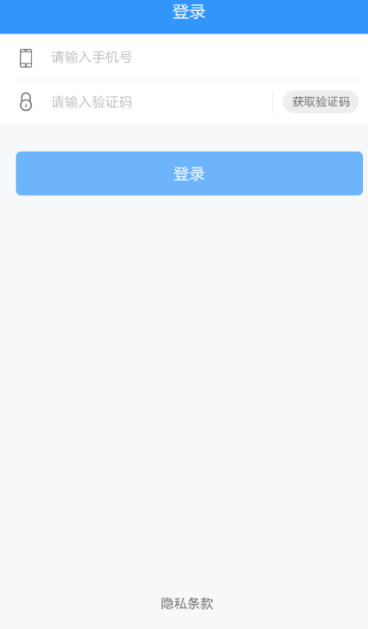
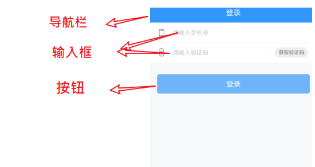
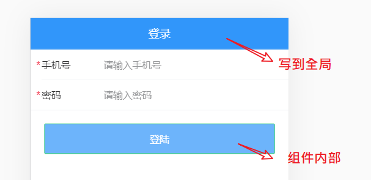
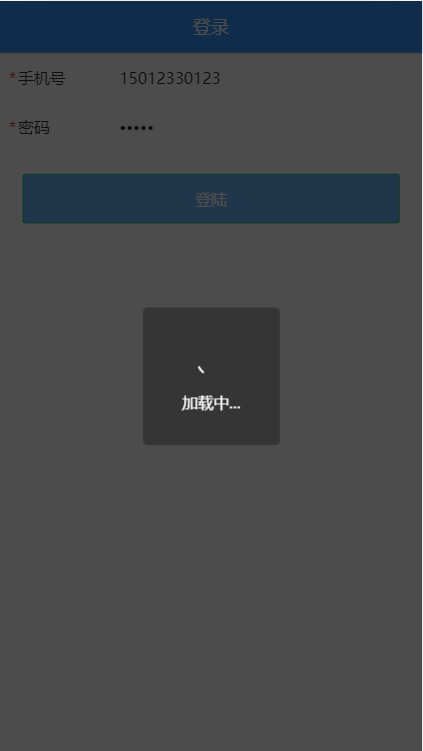
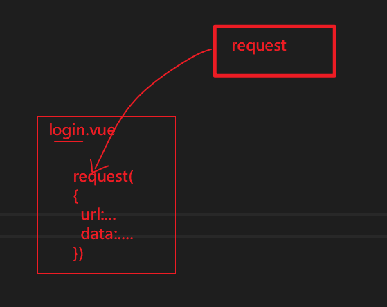
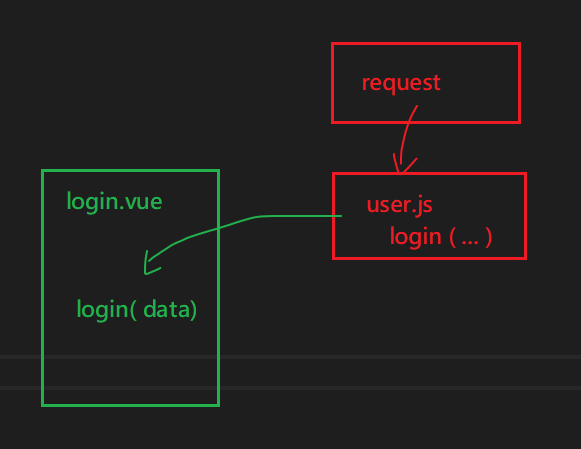

# 登陆页


## 效果及思路



思路：

- 创建组件
- 配置路由
- 布局结构
- 调整样式
- 实现业务功能
  - 数据有效性校验
  - 调用接口

## 创建组件并配置路由

### 创建组件

 views/login/index.vue

```javascript
<template>
  <div class="login">登录页面</div>
</template>

<script>
export default {
  name: 'LoginIndex'
}
</script>

<style lang="less" scoped>
</style>
```

### 配置路由

然后在 `router/index.js` 中配置路由表：

```javascript
import Vue from 'vue'
import Router from 'vue-router'
import Login from '@/views/login'

Vue.use(Router)

export default new Router({
  routes: [
    {
      name: 'login',
      path: '/login',
      component: Login
    }
  ]
})
```

### 在根组件app.vue配置路由容器

```html
<template>
  <div id="app">
    <router-view></router-view>
  </div>
</template>
```


### 测试

最后，访问 `/login` 查看是否能访问到登录页面组件。


## 实现布局结构（用vant来做布局）

这里主要使用到三个 Vant 组件：



- [NavBar 导航栏](https://youzan.github.io/vant/#/zh-CN/nav-bar)
- [Field 输入框](https://youzan.github.io/vant/#/zh-CN/field)
- [Button 按钮](https://youzan.github.io/vant/#/zh-CN/button)

1、将登录页修改为：

```html
<template>
  <div class="login">
    <!-- 导航栏 -->
    <van-nav-bar
      title="标题"
    />
    <!-- /导航栏 -->

    <!-- 登录表单 -->
    <van-cell-group>
      <van-field
        required
        clearable
        label="手机号"
        placeholder="请输入手机号"
      />

      <van-field
        type="password"
        label="验证码"
        placeholder="请输入验证码"
        required
      />
    </van-cell-group>
    <!-- /登录表单 -->

    <!-- 登录按钮 -->
    <div class="btn-wrap">
      <van-button type="info" class='btn'>登录</van-button>
    </div>
    <!-- /登录按钮 -->
  </div>
</template>

<script>
export default {
  name: 'LoginIndex'
}
</script>
```

要点：

- 在官网上复制组件代码

## 样式处理

- 把设置登录页头部的样式写到全局（全局生效），因为其它页面也要使用。

- 把非公共样式写到页面组件内部，避免和其它组件样式冲突。

下面是具体实现步骤。

### 添加并使用全局样式

希望在其它的页面中的头部的区域的样式也能复用。

1、创建 `styles/index.less` 并写入以下内容：

```less
.van-nav-bar {
  background-color: #3196fa;
  .van-nav-bar__title {
    color: #fff;
  }
}
```

这一步是要实现顶部van-nav-bar的样式。

2、在 `main.js` 中加载

```
// ...其它代码
import './styles/index.less'
```

测试查看效果。

### 添加局部样式

将 `views/login/index.vue` 组件中的 style 修改为：

```css
<style lang="less" scoped>
.login {
  .btn-wrap {
    padding: 20px;
    .btn {
      width: 100%;
      background-color: #6db4fb;
      color: #fff;
    }
  }
}
</style>
```

### 最终效果

两个地方的颜色写在不同的地方。



## 功能实现

实现流程：

- 获取表单数据（绑定）
- 注册点击登录的事件
- 表单验证（不能为空）
- 发请求提交
- 根据请求结果做下一步处理

下面是具体的实现过程：

### 数据绑定

1、根据[接口](http://topline.m.lipengzhou.com/api.html#u7528u6237u8ba4u8bc1uff08u767bu5f55u6ce8u518cuff090a3ca20id3du7528u6237u8ba4u8bc1uff08u767bu5f55u6ce8u518cuff093e203ca3e)要求绑定数据

在登录页面组件的实例选项 data 中添加 `user` 数据字段：

```javascript
...
data () {
  return {
    user: {
      mobile: '',
      code: ''
    }
  }
}
```

2、在表单中使用 `v-model` 绑定对应数据：

```diff
<!-- van-cell-group 仅仅是提供了一个上下外边框，能看到包裹的区域 -->
<van-cell-group>
  <van-field
+    v-model.trim="user.mobile"
    required
    clearable
    label="手机号"
    placeholder="请输入手机号"
  />

  <van-field
+    v-model.trim="user.code"
    type="password"
    label="验证码"
    placeholder="请输入验证码"
    required
  />
</van-cell-group>
```

最后在浏览器使用 VueDevtools 调试工具查看是否绑定成功。

### 表单验证

- 添加数据项

- 设置van-field组件中errormessage属性

- 抽出一个独立的方法来做验证

```
data () {
    return {
      user: {
        // 用这个帐号去登陆是有数据的
        mobile: '13911111111', // 手机
        code: '246810'
      },
      // 保存错误信息
      errInfo: {
        mobile: '',
        code: ''
      }
    }
  },
```


视图

```
<van-field
        label="手机号"
        v-model.trim="user.mobile"
        :error-message="errInfo.mobile"
        required
        clearable
        placeholder="请输入手机号" />

      <van-field
        type="password"
        v-model.trim="user.code"
        :error-message="errInfo.code"
        required
        clearable
        label="密码"
        placeholder="请输入密码"
      />
```

抽出一方法

```
checkInfo (user) {
      if (user.mobile === '') {
        this.errInfo.mobile = '手机号不能为空'
        return false
      }
      if (user.code === '') {
        this.errInfo.code = '密码不能为空'
        return false
      }
      return true
    },
    async hLogin () {
      // 1. 对用户的信息进行验证
      if (!this.checkInfo(this.user)) {
        return
      }
   }
```


### 登陆提交

1、给登录按钮注册点击事件处理函数

```html
<div class="btn-wrap">
      <van-button type="primary" @click="hLogin" class="btn">登陆</van-button>
</div>
```

2、登录处理函数

```javascript
import request from '@/utils/request'

async hLogin () {
  request({
      method: 'POST',
      url: '/app/v1_0/authorizations',
      data: this.user
  })
    
}
```


### 登录 loading 效果



可以使用vant中的**toast组件**来实现loading的效果。

> [toast组件](https://youzan.github.io/vant/#/zh-CN/toast#zu-jian-nei-diao-yong)

加载提示

```javascript
this.$toast.loading({
  duration: 0, // 持续展示 toast,永远不会关闭
  mask: true,
  message: '加载中...'
})
```

代码

```javascript
async hLogin () {
      // 1. 对用户的信息进行验证
      if (!this.checkInfo(this.user)) {
        return
      }

      // 2. loading
      this.$toast.loading({
        message: '登陆中....',
        duration: 0, // 会一直存在,如果有下一个this.$toast被调用，它就会被覆盖，也就消失了
        mask: true // 整体加一个遮罩
      })

      // 3. 调用接口 ,成功失败要给提示
      try {
        // 如果 login这个操作没有错误，则不会进入catch
        const result = await login(this.user)
        console.log(result)
        this.$toast.success('登陆成功')

        // todo : 用户跳转
      } catch (err) {
        // 有错误，就会到这里来
        // err这个错误是 axios给出来了。它表示通过axios发请求时，请求出错了
        // console.dir(err)
        const errMsg = err.response.data.message
        if (errMsg) {
          if (errMsg.mobile) {
            // 说明手机号错误
            this.$toast.fail('手机号错误')
          }
          if (errMsg.code) {
            // 说明手机号错误
            this.$toast.fail('密码错误')
          }
        } else {
          this.$toast.fail('登陆出错')
        }
      }
    }
```


注意：

把网络速度调整慢一些可以看到效果。


## 封装 api 请求模块

### 原因



上面的代码中对于ajax请求的做法比较直观：点击按钮就发出请求，请求写出url地址，方法，参数。但是它这样做是有一些问题的：

- 不方便代码复用。如果在另一个模块中也需要用户登陆功能的话，就可能再写一次了。
- 不方便统一修改url地址。如果要修改url地址，还需要找到这个组件内部才能定位去修改。


考虑到上面两个问题，我们提前将所有业务操作都封装为一个模块。



### 步骤

1. 创建模块
2. 使用模块

下面是具体的实现方式：

#### 建立模块

创建 `api/user.js` 并写入

```javascript
import request from '@/utils/request'

/**
* 登录
*/
export function login (user) {
  return request({
    // method 用来指定请求方法，这是 axios 的固定 API，不能瞎写
    method: 'POST',
    // url 用来指定请求路径
    url: '/app/v1_0/authorizations',
    // data 是 axios 请求要求的字段名，用来传递请求体数据的
    data: user
  })
}
```

#### 使用模块

然后在登录页面login/login.vue中加载调用：

```diff
import { login } from '@/api/user'

async hLogin () {
      console.log(this.user)
      // todo: 检测一下数据有效性
      // 问，如何获取接口返回的数据？
      const result = await login(this.user)
      console.log(result)

      // request({
      //   method: 'POST',
      //   url: '/app/v1_0/authorizations',
      //   data: this.user
      // })
    }
```

之后项目中所有的涉及接口的请求就都不要直接在组件中直接写了，而是：

1. 先写成模块

2. 再从模块中取出方法来在组件中使用

