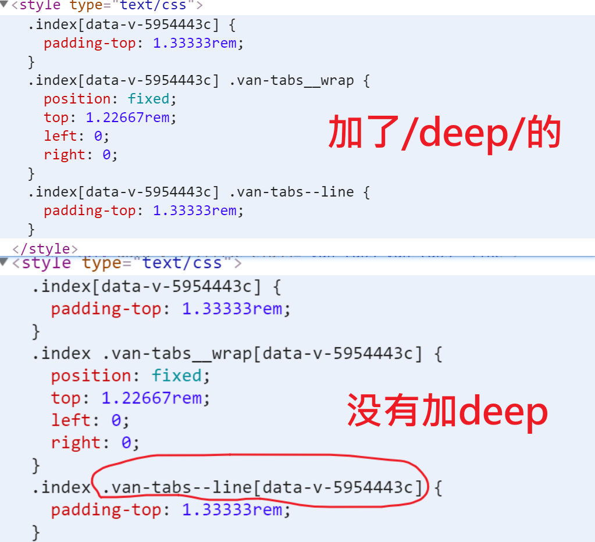

首页之频道列表

目标如下：

- 推荐，后端,css,.... 这些都是频道列表的内容。它固定在顶部。


功能：

- 获取频道，并显示

## 基本结构

使用[tabs组件](https://youzan.github.io/vant/#/zh-CN/tab#hua-dong-qie-huan)

```html
<div class="index">
    <van-tabs>
      <van-tab v-for="index in 8" :title="'标签 ' + index" :key="index">
        <p>内容 {{ index }}内容</p>
        <p>1</p>
        <p>1</p>
        <p>1</p>
        <p>1</p>
        <p>1</p>
        <p>1</p>
        <p>1</p>
        <p>1</p>
        <p>1</p>
        <p>1</p>
        <p>1</p>
        <p>1</p>
        <p>1</p>
        <p>1</p>
        <p>1</p>
        <p>1</p>
        <p>1</p>
      </van-tab>
    </van-tabs>
  </div>
```

真正的内容要放在`van-tab`中。

### 样式

1.去 layout.vue中，给头部的标题加一个fixed,实现固定定位。

```diff
<van-nav-bar
      title="黑马头条"
      right-text="搜索"
+     fixed
      @click-right="hRearch"
    />
```

2.在styles/index.less中通过全局样式来覆盖vant库自已的样式。

在组件内部写样式：

- 加在上了scoped，样式会变成私有的，它会加上一些data-v-XXXXX这种项，达不到去覆盖

  vant-ui样式的目的

- 解决方案：
  
  - 写成全局的样式。（个人建议把项目中的css写在一个独立的位置，不要以局部样式的方式来写）


src/styles/index.less

```less
// 主页
.index{
    padding-top:50px;
    .van-tabs__wrap {
      position:fixed;
      top:46px;
      left:0px;
      right:0px;

    }
    .van-tabs--line{
        padding-top:50px; // 让出van-tabs的高度
    }
  }
```


## 封装api函数

涉及频道的相关操作很多，封装一个模块好来统一处理。

新增一个文件： `src/api/channel.js`

```js
import request from '@/utils/request'

// 获取当前频道
export const getChannels = () => {
  return request({
    url: '/app/v1_0/user/channels',
    type: 'get'
  })
}

```

注意：这个版本的接口允许不传入token。

## 调用接口以获取数据

- 导入接口
- 调用接口

在views/home/index.uve中导入接口函数

```js
import { getChannels } from '@/api/channel'
```

使用接口函数 

```js
<script>
// 导入接口
import { getChannels } from '@/api/channel.js'

export default {
  name: 'HomeIndex',
  data () {
    return {
      // 申明数据
      channels: []
    }
  },
  created () {
    this.getChannels123()
  },
  methods: {
    async getChannels123 () {
      const result = await getChannels()
      console.log(result)
      // 把接口返回的数据保存在channels数据项中
      this.channels = result.data.data.channels
    }
  }
}
</script>
```

## 渲染组件

```html
<div class="index">
    <van-tabs>
      <van-tab v-for="(item,index) in channels" :title="item.name" :key="index">
        <p>内容 {{ item.name }}内容</p>
        <p>1</p>
        <p>1</p>
        <p>1</p>
        <p>1</p>
        <p>1</p>
        <p>1</p>
        <p>1</p>
        <p>1</p>
        <p>1</p>
        <p>1</p>
        <p>1</p>
        <p>1</p>
        <p>1</p>
        <p>1</p>
        <p>1</p>

        <p>1</p>
      </van-tab>
    </van-tabs>
  </div>
```


## 补充介绍deep

> 如何在父组件中去覆盖子组件中样式


如果一定要父组件中去覆盖子组件（第三方的）的样式：

方法一： 不要写成scoped. 此时，样式就是全局的。

方法二： 在保持scoped的情况下，还可以使用 /deep/。


为什么用了scoped之后，不能覆盖子组件的样式？


因为scoped会在选择器最后加data-v-xxxxxxx这属性名，所以无法选中子组件的样式。


为什么用了/deep/之后，就可以覆盖子组件的样式？

```css
.index{
    padding-top:50px;
    /deep/ .van-tabs__wrap {
      position:fixed;
      top:46px;
      left:0px;
      right:0px;

    }
    /deep/ .van-tabs--line{
        padding-top:50px; // 让出van-tabs的高度
    }
  }
```

因为加了deep之后，属性就不会加在其后的选择器上了。

解析后css如下：




