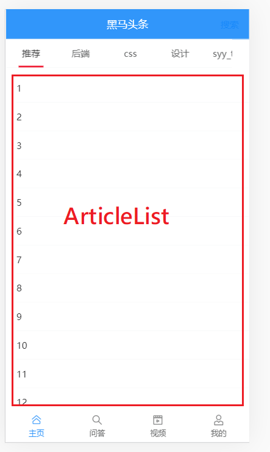
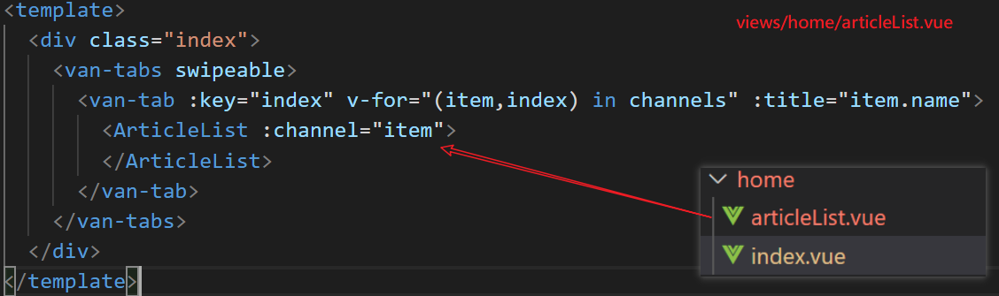
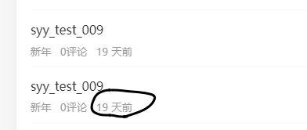

文章列表上拉加载与下拉刷新



目标

- 实现文章列表的上拉加载（进入主页之后，取出一些文章来，手指向上，相当于是翻页。）
- 下拉刷新功能

说明

- 这个部分功能比较复杂，单独列出来做一个组件。

涉及vant组件如下：

- [van-list组件](https://youzan.github.io/vant/#/zh-CN/list#ji-chu-yong-fa): 上拉加载
- [van-pull-refresh](https://youzan.github.io/vant/#/zh-CN/pull-refresh#ji-chu-yong-fa)组件: 下拉刷新
- van-cell
- van-grid 
- van-image

要点：

- 要在项目中使用全局过滤器

## 组件结构

由于这一块的逻辑比较复杂，所以单独抽出来成一个组件来处理。

```
|-views
|--home/articleList.vue
|--home/index.vue
```

然后在index.vue中引入articleList.vue组件。



- 每一个分类下，就会有一个articleList
- van-tabs会产生懒加载的效果：“只有激活了某个标签，才会去加载ArticleList”


articleList.vue的代码如下

```html
<template>
  <div>
    {{channel.id}}-  {{channel.name}} 文章列表
  </div>
</template>

<script>
export default {
  name: 'ArticleList',
  props: {
    channel: {
      type: Object,
      required: true
    }
  },
  data () {
    return {

    }
  }
}
</script>

<style lang="" scoped>

</style>
```


## articleList基本效果

引入[van-list组件](https://youzan.github.io/vant/#/zh-CN/list#ji-chu-yong-fa) 来实现上拉加载。这个功能在list组件中已经实现了。


下面是基础结构

```html
<van-list
  v-model="loading"
  :finished="finished"
  finished-text="没有更多了"
  @load="onLoad"
>
  <van-cell v-for="item in list" :key="item" :title="item" />
</van-list>
export default {
  data() {
    return {
      list: [],
      loading: false,
      finished: false
    };
  },
  methods: {
    onLoad() {
      // 异步更新数据
      // setTimeout 仅做示例，真实场景中一般为 ajax 请求
      setTimeout(() => {
        for (let i = 0; i < 10; i++) {
          this.list.push(this.list.length + 1);
        }

        // 加载状态结束
        this.loading = false;

        // 数据全部加载完成
        if (this.list.length >= 40) {
          this.finished = true;
        }
      }, 1000);
    }
  }
}
```


通过`loading`和`finished`两个变量控制加载状态：

当组件滚动到底部时，会触发`load`事件并将`loading`设置成`true`。此时可以发起异步操作并更新数据，数据更新完毕后，将`loading`设置成`false`即可。若数据已全部加载完毕，则直接将`finished`设置成`true`即可。


list组件的[数据加载机制](https://youzan.github.io/vant/#/zh-CN/list#list-de-yun-xing-ji-zhi-shi-shi-me)：

- 如果当前的内容不够一屏，它会自动调用onLoad去加载数据。

- `List`有以下三种状态，理解这些状态有助于你正确地使用`List`组件：

  - 非加载中，`loading`为`false`，此时会根据列表滚动位置判断是否触发`load`事件（列表内容不足一屏幕时，会直接触发）
  - 加载中，`loading`为`true`，表示正在发送异步请求，此时不会触发`load`事件
  - 加载完成，`finished`为`true`，此时不会触发`load`事件

  在每次请求完毕后，需要手动将`loading`设置为`false`，表示加载结束


## 准备接口

在src/api目录下补充一个article.js模块来获取文章数据

```javascript
// 所有与文章相关的操作
import request from '@/utils/request'

/**
 * 获取文章列表信息
 * @param {*} data
 *
 * {
 *   channel_id: 频道ID,
 *   timestamp: 时间戳，请求新的推荐数据传当前的时间戳，请求历史推荐传指定的时间戳
 *   with_top:1
 * }
 */
export const getArticles = (data) => {
  return request({
    url: '/app/v1_1/articles',
    type: 'GET',
    params: data
  })
}

```

说明：

- 接口使用v1_1的。固定with_top为1。
- 参数说明：
  - channel_id: 当前频道编号
  - timestamp: 时间戳。请求新的推荐数据传当前的时间戳，请求历史推荐传指定的时间戳
  - with_top: 1 。固定为1。


## 接口调用

在article_list.vue组件中，当进入页面时，由于不满一屏，所以，van-list会自动调用onload方法，因此， 我们可以直接在onload方法去调用getAritcles来加载数据。


```javascript
// 引入接口
import { getArticles } from '@/api/article'

export default {
  name: 'ArticleList',
  props: {
    // 从父组件中获取当前的频道信息
    channel: {
      type: Object,
      required: true
    }
  },
  data () {
    return {
      list: [], // 文章列表数据
      loading: false,
      finished: false,
      timestamp: null // 保存本次请求数据要用到的时间戳
    }
  },
  methods: {
    // onLoad:执行时机：
    // 1. 页面打开，van-list内容不足一屏，则会自动调用
    // 2. 手动上拉，也会执行
    async onLoad () {
      console.log('加载新数据.....')
      const result = await getArticles({
        channel_id: this.channel.id, // 当前的频道ID
        timestamp: this.timestamp || Date.now(),
        // 请求新的推荐数据传当前的时间戳，请求历史推荐传指定的时间戳
        with_top: 1
      })
      // 把取回来的数据放在 data中的数据项中
      const arr = result.data.data.results
      // 1.1 把取回来的数组arr中的数据放入 this.list中。
      //    相当于是要把数组arr中的内容 填充到数组this.list.
      this.list.push(...arr)

      // 1.2 更新一下，下一次请求时发的时间戳
      this.timestamp = result.data.data.pre_timestamp

      // 2. 加载状态结束
      this.loading = false

      // 3.判断是否全部的数据已经加载完成
      if (arr.length === 0) {
        this.finished = true
      }
    }
  }
}
```

- 要注意 timestamp这个参数的。当前请求时，要传入上一次请求回来的timestamp，以取到正确的数据。

## 补充修改样式

对于样式进行小量修改

```diff
.index{
    padding-top:50px; // 让出layout组件中title的高度
+    margin-bottom: 50px; // 让出layout组件中底部固定路导航的高度，能显示 正在加载 
    /deep/ .van-tabs__wrap {
      position:fixed;
      top:46px;
      left:0px;
      right:0px;
+      z-index: 1; // 解决文章列表内容会覆盖频道列表

    }
    /deep/ .van-tabs--line{
        padding-top:50px; // 让出van-tabs的高度
    }
  }
```


## 文章列表布局


知识点：

- van-cell 中的[slot="label"](https://youzan.github.io/vant/#/zh-CN/cell#cell-slots) 
  
  - 整体包裹
  
- van-grid 

  - 用作图片布局

- van-image
  
  

```html
<div>
     <!--van-list:自带有下拉加载更多的效果-->
    <van-list
      v-model="loading"
      :finished="finished"
      finished-text="讨厌，人家被你看完了"
      @load="onLoad"
    >
      <van-cell v-for="(item,index) in list" :key="index" :title="item.title">
        <!--
           label是一个插槽名，是van-cell组件中提供的。它的作用是让元素在标题的正下方
          -->
        <div slot="label">
          <!--
            图片
            有几张图，分成几列

            van-grid： 宫格。
          -->
          <van-grid :column-num="item.cover.images.length">
            <van-grid-item v-for="(img,idx) in item.cover.images" :key="idx">
              <van-image :src="img" />
            </van-grid-item>
          </van-grid>

          <!-- 文字说明 -->
          <div class="meta">
            <span>{{item.aut_name}}</span>
            <span>{{item.comm_count}}评论</span>
            <span>{{item.pubdate}}</span>
          </div>
        </div>
      </van-cell>
    </van-list>

  </div>

<style lang="less" scoped>
.meta {
  span {
    margin-right:10px;
  }
}
</style>
```

说明：

- 从后端取出来的每篇文章中，最多有三张图。具体分成如下三种情况：
  - 三图
  - 一图
  - 无图。
- 图片保存在`cover.images`中。


样式：

```less
<style lang="less" scoped>
    .meta span {
      margin-right: 10px;
    }
</style>
```


## 实现下拉刷新

当用户向下拉动页面时，用当前的时间戳去请求接口（求最新的数据），把数据填充到页面的`最上方`，以实现下拉刷新的功能。

### 基本结构

[van-pull-refresh](https://youzan.github.io/vant/#/zh-CN/pull-refresh#ji-chu-yong-fa)组件已经集成了下拉刷新的这个功能，直接使用即可。先来看van-pull-refresh的基本结构。

```javascript
<van-pull-refresh v-model="isLoading" @refresh="onRefresh">
  <p>刷新次数: {{ count }}</p>
</van-pull-refresh>
import { Toast } from 'vant';

export default {
  data() {
    return {
      count: 0,
      isLoading: false
    }
  },
  methods: {
    onRefresh() {
      setTimeout(() => {
        Toast('刷新成功');
        this.isLoading = false;
        this.count++;
      }, 1000);
    }
  }
}
```

说明：

- 下拉刷新时会触发 `refresh` 事件，在事件的回调函数中可以进行同步或异步操作，操作完成后将 `v-model` 设置为 `false`，表示加载完成。


### 完成结构

按上面对van-pull-refresh的分析，直接在van-list的外面包一个van-pull-refresh即可。

```html
<template>
  <div>
    <van-pull-refresh v-model="isLoadingNew" @refresh="onRefresh">
      <!--van-list:自带有下拉加载更多的效果-->
      <van-list
        v-model="loading"
        :finished="finished"
        finished-text="讨厌，人家被你看完了"
        @load="onLoad"
      >
        <van-cell v-for="(item,index) in list" :key="index" :title="item.title">
          <!--
            label是一个插槽名，是van-cell组件中提供的。它的作用是让元素在标题的正下方
            -->
          <div slot="label">
            <!--
              图片
              有几张图，分成几列

              van-grid： 宫格。
            -->
            <van-grid :column-num="item.cover.images.length">
              <van-grid-item v-for="(img,idx) in item.cover.images" :key="idx">
                <van-image :src="img" />
              </van-grid-item>
            </van-grid>

            <!-- 文字说明 -->
            <div class="meta">
              <span>{{item.aut_name}}</span>
              <span>{{item.comm_count}}评论</span>
              <span>{{item.pubdate}}</span>
            </div>
          </div>
        </van-cell>
      </van-list>
    </van-pull-refresh>

  </div>
</template>

<script>
// 引入接口
import { getArticles } from '@/api/article'

export default {
  name: 'ArticleList',
  props: {
    // 从父组件中获取当前的频道信息
    channel: {
      type: Object,
      required: true
    }
  },
  data () {
    return {
      list: [], // 文章列表数据
      isLoadingNew: false, // 是否正在下拉刷新
      loading: false, // 当前是否正在取数据，它来控制菊花
      finished: false, // 控制当手指向上滑时，是否再去触发loading
      timestamp: null // 保存本次请求数据要用到的时间戳
    }
  },
  methods: {
    // 下拉加载的具体代码
    async onRefresh () {
      // 1. 发请求，取回最新的文章
      console.log('上拉刷新加载新数据.....')
      const result = await getArticles({
        channel_id: this.channel.id, // 当前的频道ID
        timestamp: Date.now(), // 请求最新的推荐数据传当前的时间戳
        with_top: 1
      })
      // 2. 添加到list中,是加在list数组的头部还是尾部？
      // 确定是要放在头部（unshift）
      const arr = result.data.data.results
      this.list.unshift(...arr)

      const msg = arr.length ? `刷新成功${arr.length}` : '没有最新数据'
      this.$toast(msg)

      // 3.修改下拉刷新的状态
      this.isLoadingNew = false
    },
    // onLoad:执行时机：
    // 1. 页面打开，van-list内容不足一屏，则会自动调用
    // 2. 手动上拉，也会执行
    async onLoad () {
      console.log('加载新数据.....')
      const result = await getArticles({
        channel_id: this.channel.id, // 当前的频道ID
        timestamp: this.timestamp || Date.now(),
        // 请求新的推荐数据传当前的时间戳，请求历史推荐传指定的时间戳
        with_top: 1
      })
      // 把取回来的数据放在 data中的数据项中
      const arr = result.data.data.results
      // 1.1 把取回来的数组arr中的数据放入 this.list中。
      //    相当于是要把数组arr中的内容 填充到数组this.list.
      this.list.push(...arr)

      // 1.2 更新一下，下一次请求时发的时间戳
      this.timestamp = result.data.data.pre_timestamp

      // 2. 加载状态结束
      this.loading = false

      // 3.判断是否全部的数据已经加载完成
      if (arr.length === 0) {
        this.finished = true
      }
    }
  }
}
</script>
<style lang="less" scoped>
.meta {
  span {
    margin-right:10px;
  }
}
</style>

```

- 在onRefresh中调用接口时要设置`with_top=1`,并且要设置timestamp是最新的时间戳。


## 相对时间处理

目标




解决方案

- dayjs + **vue过滤器**
- 考虑这个功能可能在其它的项目中也会用到，所以，我们封装成一个模块

### 思路

- 安装包dayjs
  - dayjs: [安装](https://day.js.org/zh-CN/)
  - 时间插件：[relativeTime](https://day.js.org/docs/zh-CN/plugin/relative-time)
- 封装插件
- 注入插件
- 在组件中使用


### 步骤

1. 安装包

```
npm i dayjs
```

2. 封装模块

封装插件：在src/utils/下创建一个date-time.js。`src/utils/date-time.js`

```javascript
// 提供用来处理日期时间的工具模块
import dayjs from 'dayjs'

// 引入中文语言包
import 'dayjs/locale/zh-cn'

// 引入插件 dayjs/plugin/relativeTime
// 在你npm i daysj时，插件已经下载了。
// 具备计算相对时间的功能
import rTime from 'dayjs/plugin/relativeTime'

// 使用中文语言包。固定格式
dayjs.locale('zh-cn')

// 使用插件。固定格式dayjs.extend(插件)
dayjs.extend(rTime)

export const relativeTime = function (yourTime) {
  // 使用dayjs提供的api对用户传入的时间 yourTime
  // 进行格式化，以返回一个相对时间
  return dayjs().to(dayjs(yourTime))
  // console.log(yourTime)
  // return dayjs(yourTime).format('DD/MM/YYYY')
}

```


### 在main.js中以全局过滤器的引入

 要在项目中使用全局过滤器

```diff
import Vue from 'vue'
import App from './App.vue'
import router from './router'
import store from './store'
+ import { relativeTime } from '@/utils/date-time'
// 引入Vant所有的组件
import Vant from 'vant'
// 用它的样式
import 'vant/lib/index.css'

// 它会根据的手机尺寸来调整rem的基准值：html标签上的font-size。
import 'amfe-flexible'

// 引入项目中全局样式
import './styles/index.less'

// 用一下组件
Vue.use(Vant)

// 定义一个全局过滤器
// relativeTime是在/utils/date-time.js中定义的
+ Vue.filter('relativeTime', relativeTime)

Vue.config.productionTip = false
new Vue({
  router,
  store,
  render: h => h(App)
}).$mount('#app')

```


### 在模块中使用

前面成功注册了过滤器了，现在就可以直接使用了。

```diff
<div class="meta">
    <span>{{ item.aut_name }}</span>
    <span>{{ item.comm_count }}评论</span>
+    <span>{{ item.pubdate | relativeTime}}</span>
</div>
```

上面的`item.pubdate` 就是我们要处理的时间了。

## 图片懒加载

目标：在文章列表中很多文章，每一个文章都有可能有图（1，3张），在加载文章列表时，对其中的图片进行懒加载处理：并不是一开始就加载全部的图片，而当某张图快要进入可见区域时，再去加载。

参考：[图片懒加载](https://youzan.github.io/vant/#/zh-CN/image#tu-pian-lan-jia-zai)

> 图片数据（就是url地址）取回来之后，不是**立刻设置**给image的src属性。
>
> > 只要设置了src 属性，浏览器就会立即去请求src中的那张图。
>
> 只要当这张图片处于可见区域（或者是快了接近）时，就去设置src属性去求图片。

在main.js中，引入Lazyload指令

```javascript
// 引入Vant所有的组件
// 在vant这模块中如下两种导出模块的方式同时存在:
// export default  默认导出
// export {Lazyload}  普通导出
//
// 在导入的时，XXX ---> Vant
//            Lazyload 就是 普通导出 Lazyload
import Vant, { Lazyload } from 'vant'

// 使用懒加载
Vue.use(Lazyload)
```

在 articleList.vue组件中使用

```diff
          <van-grid :column-num="item.cover.images.length">
              <van-grid-item v-for="(img,idx) in item.cover.images" :key="idx">
 +               <van-image lazy-load :src="img" />
              </van-grid-item>
            </van-grid>
```


