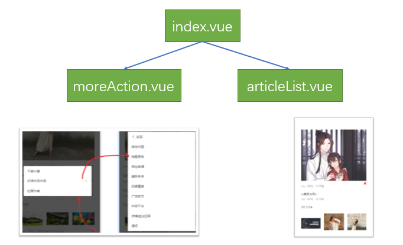
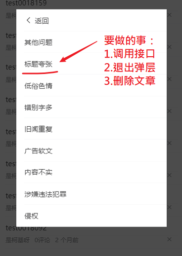

2目标：对于已经登陆的用户，可允许他们去关闭某篇文章，或者是反馈内容。

技能点：

- JSONBig包
- eventBus
- 父子组件事件通信


## 整体分析

这个部分的功能比较复杂，也单独抽成一个组件。

组件划分：

```
|---home/index.vue
|---home/articleList.vue # 文章列表
|---home/moreAction.vue  # 更多操作
```

在index.vue中包含它们这两个组件。


## moreAction组件-基本内容

```html
<template>
  <div class="more-action">
    <van-cell-group v-if="!isReport">
      <van-cell>不感兴趣</van-cell>
      <van-cell is-link @click="isReport=true">反馈垃圾内容</van-cell>
      <van-cell>拉黑作者</van-cell>
    </van-cell-group>
    <van-cell-group v-else>
      <van-cell icon="arrow-left" @click="isReport=false">返回</van-cell>
      <van-cell>侵权</van-cell>
      <van-cell>色情</van-cell>
      <van-cell>暴力</van-cell>
      <van-cell>低俗</van-cell>
      <van-cell>不适</van-cell>
      <van-cell>错误</van-cell>
      <van-cell>其他</van-cell>
    </van-cell-group>
  </div>
</template>

<script>
export default {
  data () {
    return {
      isReport: false
    }
  }
}
</script>

<style lang='less' scoped>
.more-action {
  border-radius: 4px;
}
</style>
```

通过isReport来切换两种视图


## moreAction组件-在父组件中使用

这个组件不是放在文章列表中的。



index.vue中引入moreAction并使用。这里要用到van-popup组件来包含内容

```javascript
import MoreAction from './moreAction.vue'
```

van-popup可以提供弹层的效果。

```diff
<template>
  <div class="index">
    <van-tabs>
      <van-tab v-for="(item,index) in channels" :title="item.name" :key="index">
        <!-- 要把当前的频道的信息给给子组件ArticleList -->
        <ArticleList :channel="item"></ArticleList>
      </van-tab>
    </van-tabs>

    <!-- 文章更多操作：反馈，举报..... -->
    <van-popup :style="{width:'80%'}" v-model="showMoreAction">
      <more-action></more-action>
    </van-popup>
  </div>
</template>
```

- 用van-popup来包含内容。

- 设置一个showMoreAction来控制是否显示popup的显示


## moreAction组件-在articlelist中激活


整体效果：

对于登陆用户（不登陆则不会显示关闭按钮），在文章列表中的每篇文件后，附一个**关闭**按钮,用户点击之后，弹出moreAction组件。


步骤：

- 修改aticleList视图。如果是登录用户，则额外提供一个关闭按钮。可以根据vuex来判断。
- 给按钮添加事件，emit事件到父组件index.vue
- 在父组件index.vue中监听事件，并在响应函数中去显示moreAction。


修改aticleList视图

```diff
<!-- 文字说明 -->
<div class="meta">
    <span>{{item.aut_name}}</span>
    <span>{{item.comm_count}}评论</span>
    <!-- relativeTime成为一个全局过滤器来使用
这里的结果就是：relativeTime(item.pubdate)的返回值
-->
    <span>{{item.pubdate | relativeTime}}</span>

    <!--
登陆用户可以看见 X
依据：只有登陆用户才有vuex 中 user
-->
+    <span class="close" v-if="$store.state.user" @click="hMoreAction">
+       <van-icon name="cross"></van-icon>
+    </span>
</div>

```

方法:

```
hMoreAction () {
// 在文章列表上 点击某个文章的 X
// 预期的目标是：在index.vue中弹出 更多操作。
//              就是要去修改index.uve中showMoreAction设为true

// 通过自定义事件，告诉父组件去弹窗
this.$emit('showMoreAction')
}
```


样式：

```
.meta {
  display:flex;
  span {
    margin-right:10px;
  }
  .close{
    // 让它在最右边
    // 它的父级容器是flex的，给当前元素设置左外边距为auto，会让这个元素在父级容器
    // 的最右边
    margin-left:auto;
  }
}
```


在父组件index.vue中显示moreAction。

- 监听articleList中的事件

```diff
<template>
  <div class="index">
    <van-tabs>
      <van-tab v-for="(item,index) in channels" :title="item.name" :key="index">
        <!-- 要把当前的频道的信息给给子组件ArticleList -->
        <ArticleList
        :channel="item"
+        @showMoreAction="hMoreAction"
        ></ArticleList>
      </van-tab>
    </van-tabs>

    <!-- 文章更多操作：反馈，举报..... -->
    <van-popup :style="{width:'80%'}" v-model="showMoreAction">
      <more-action></more-action>
    </van-popup>
  </div>
</template>
```

补充方法hMoreAction

```javascript
  data () {
    return {
      // 申明数据
      channels: [],
 +     showMoreAction: false
    }
  },
  components: {
    ArticleList,
    MoreAction
  },
    hMoreAction () {
      // 处理子组件articleList中的点击 X 事件
      // 1. 显示弹窗
      this.showMoreAction = true
    },
```


## 数据传递分析


## 传递文章编号

目标：在ariticleList组件中，当点击关闭按钮时，要把当前的文章编号传回给父组件，以备使用。

思路:  $emit 。在点击时，会向父组件发布一个事件，从而达到调用父组件中的方法的目的。考虑到后续的操作都需要文章编号做为参数，所以，这里还需要在articleList组件中把用户当前点击关闭的文章编号传出来。

### 大数值处理

安装一个包

```
npm i json-bigint
```


关键字：

- JSONBig
- axios的transformResponse

后端回传的真实id是19位的数值，超过了js能表达的最大安全整数，所以要引入一个额外的包JSONBig来处理这个问题。


在src/utils/request.js中

```diff
// 对axios进行二次封装
import axios from 'axios'
+ import JSONBig from 'json-bigint' // 引入大数字包
// 如何在.js模块中去使用vuex中的数据
import store from '@/store/index.js'

const request = axios.create({
  // 基地址
  baseURL: 'http://ttapi.research.itcast.cn',
  //   此函数是后台响应回来 但是还没进入到 axios的响应拦截器时执行 数组里可以写多个的处理函数
+ transformResponse: [function (data) {
+   //   data就是后端响应回来的字符串
    // JSON.parse()
+   return data ? JSONBig.parse(data) : {}
  }]
})
```

- transformResponse发生在axios 的响应拦截器之前。
- JSONBig.parse()用来处理大数。


### 在子组件articleList内获取并传文章编号

视图

```html
<div class="meta">
    <span>{{ item.aut_name }}</span>
    <span>{{ item.comm_count }}评论</span>
    <span>{{ item.pubdate  }}</span>
    <span class="close" v-if="$store.state.user" @click="hMoreAction(item.art_id)">
        <van-icon name="cross"></van-icon>
    </span>
</div>
```

代码

```
hMoreAction (bigintObj) {
      // 在request中封装了对大数的处理，所以这里的article_artId不是一个数值
      // 而是一个bigint对象，要获取它真正的数据，要通过toString

      // 在文章列表上 点击某个文章的 X
      // 预期的目标是：在index.vue中弹出 更多操作。
      //              就是要去修改index.uve中showMoreAction设为true

      // 通过自定义事件，告诉父组件去弹窗

      this.$emit('showMoreAction', bigintObj.toString())
    }
```

### 在父组件index.vue组件中，保存子组件中传递的id

```
 hMoreAction (articleId) {
      // 处理子组件articleList中的点击 X 事件
      // 1. 显示弹窗
      console.log('从子组件articleList中传递要删除的文章编号是', articleId)
      this.showMoreAction = true

      // 2.保存当前要操作的文章编号，备用
      this.articleId = articleId
    },
```


## 实现“不感兴趣”


目标：在弹出的moreAction组件中，点击 `不感兴趣`，要做如下三件事：

1. **去调用接口**。让服务器之后不要再推类似的文章给我了。

2. 退出弹层

3. 把我点击的文章删除掉。

   A:在后端服务器上删除这个文章（错误）

   B:在当前articleList组件中删除文章（正解）

以上三件事，是在index.vue组件中来做的。


### 在moreAction组件中抛出事件

在子组件moreAction.vue中抛出事件

```html
<van-cell @click="$emit('dislike')">不感兴趣</van-cell>
```

在父组件index.vue中监听事件

```
    <!-- 文章更多操作：反馈，举报..... -->
    <van-popup :style="{width:'80%'}" v-model="showMoreAction">
        <!-- 监听不喜欢事件 -->
      <more-action
        @dislike="hDislike"></more-action>
    </van-popup>
```

index.vue代码

```
hDislike () {
      // todo:调用接口
    },
```


### 准备接口

在src/api/article.js中添加一个方法，调用接口

```

/**
 * 不喜欢指定的文章
 * @param {*} articleId 文章
 */
export const dislikeArticle = (articleId) => {
  return request({
    url: '/app/v1_0/article/dislikes',
    method: 'POST',
    data: {
      target: articleId
    }
  })
}
```

通过阅读接口文档，分析出要传入的参数。


### 调用接口

index.vue中

```javascript
async hDislike () {
    // 收到moreAction中的点击动作， 不喜欢文章

    // 1. 调用接口
    const result = await dislikeArticle(this.articleId)
    console.log(result)
    // 2. 退出弹层
    this.showMoreAction = false

    // happy
    this.$toast.success('操作成功')

    // 3. 去articleList中删除对应的文章
    // todo
}
```


接下来实现对数据的删除。

### 实现对数据的删除


目标：

​	想在父组件index.vue中去删除子组件articleList中的数据。


难点：

- 父组件index.vue中引入了多个articleList组件
- 数据是维护在子组件articleList组件内部的

思路：

- 引入事件总线来解决。


步骤：

- 注册事件总线
- 在index.vue中发布要删除数据的事件 ($emit)
- 在aritcleList.vue中**监听（$on）删除数据的事件**，如果收到事件，则执行删除数据的动作。

#### 引入eventBus实现跨组件消息传递

在main.js中，创建一个新的Vue实例并挂载在原型上

```diff
import Vue from 'vue'
import App from './App.vue'
import router from './router'
import store from './store'
// 引入Vant所有的组件
import Vant from 'vant'
// 用它的样式
import 'vant/lib/index.css'

// 它会根据的手机尺寸来调整rem的基准值：html标签上的font-size。
import 'amfe-flexible'

// 引入项目中全局样式
import './styles/index.less'

// 挂载事件总线
// prototype是构造器的原型对象。
// Vue是构造器。
// 给Vue这个构造器的原型上添加一个属性：
//     名为$eventBus(名字可以更改)
//     值为new Vue()

// 则在所有组件内部，可以通过this.$eventBus来访问这个事件总线
+ Vue.prototype.$eventBus = new Vue()

// 用一下组件
Vue.use(Vant)
Vue.config.productionTip = false
new Vue({
  router,
  store,
  render: h => h(App)
}).$mount('#app')

```

把$eventBus挂载在Vue的原型对象上，则所有的组件内部都可以通过this.$eventBus来访问。


#### 在父组件index.vue中发布事件

发布事件，名为`delArticle`，参数是一个对象，其中包含：当前的频道编号，当前的文章编号。

> 为什么要传入频道编号？ 
>
> 由于“推荐”频道和其它频道中的文章极有可能重复，所以光传一个文章编号不能唯一确定要删除的文章。


```diff
+ <van-tabs v-model="activeIndex">
      <van-tab v-for="(item,index) in channels" :title="item.name" :key="index">
        <!-- 要把当前的频道的信息给给子组件ArticleList -->
        <ArticleList
        :channel="item"
        @showMoreAction="hMoreAction"
        ></ArticleList>
      </van-tab>
    </van-tabs>
```

补充一个数据项：activeIndex。


```diff
async hDislike () {
      // 收到moreAction中的点击动作， 不喜欢文章

      // 1. 调用接口
      const result = await dislikeArticle(this.articleId)
      console.log(result)
      // 2. 退出弹层
      this.showMoreAction = false

      // happy
      this.$toast.success('操作成功')

      // 3. 去articleList中删除对应的文章
      // 通过事件总线发布事件,传递参数

      // 参数中，只传要删除的文章编号是不够，还要传入当前的频道编号
      // 因为在多个频道中 可能有共同的文章。
+      this.$eventBus.$emit('delArticle', {
+        articleId: this.articleId,
+        channelId: this.channels[this.activeIndex].id// 当前频道编号
+      })
+    },
```

#### 在子组件articleList中监听事件

> 由于articleList组件是嵌套在vant的tabs组件中，对于tabs来说，它有`懒加载`的效果，在不点击标签时，articleList组件是不会创建的。


在创建组件时，开启监听事件总线上的'delArticle'事件。

执行逻辑如下：

收到事件时，判断是否是当前频道

- 是：找到文章并删除。
- 否：不作处理。

```javascript
created () {
    console.log(`创建articleList,当前是${this.channel.id}频道`)
    // 在创建articleList时去监听
    // 监听事件总线上的delArticle事件
    // 当事件发生时，去执行第二个参数（就是这个函数）
    // obj就是在$emit()时，传过来的参数。
    this.$eventBus.$on('delArticle', (obj) => {
      console.log(`收到了delArticle事件，当前是${this.channel.id}频道`)
      console.log('参数是', obj)
      // 判断是不是要在我这个列表中删除？
      // 是不是当前频道？
      if (obj.channelId === this.channel.id) {
        // 在list中找到id为 obj.articleId的文章，并删除
        const idx = this.list.findIndex(it => it.art_id.toString() === obj.articleId)
        if (idx !== -1) {
          // 找到了
          this.list.splice(idx, 1)
        }
      }
    })
  },
```


## 实现举报文章


目标：与不感兴趣类似，提供更具体的举报功能。

### 抽出常量

通过阅读接口文档，把后端需要的举报类型方案抽出来，封装成一个常量数组

utils/constants.js

```
const reports = [{
  value: 0,
  label: '其他问题'
}, {
  value: 1,
  label: '标题夸张'
}, {
  value: 2,
  label: '低俗色情'
}, {
  value: 3,
  label: '错别字多'
}, {
  value: 4,
  label: '旧闻重复'
}, {
  value: 5,
  label: '广告软文'
}, {
  value: 6,
  label: '内容不实'
}, {
  value: 7,
  label: '涉嫌违法犯罪'
}, {
  value: 8,
  label: '侵权'
}]

export { reports }

```

这个模块就可以在视图中引入并渲染了。

### 页面渲染

在moreAction.vue中，引入上面封装的常量 ，并循环输出来。

```html
<template>
  <div class="more-action">
    <van-cell-group v-if="!isReport">
    <!-- 不做具体的工作，把事件抛给父组件 -->
      <van-cell @click="$emit('dislike')">不感兴趣</van-cell>
      <van-cell is-link @click="isReport=true">反馈垃圾内容</van-cell>
      <van-cell>拉黑作者</van-cell>
    </van-cell-group>
    <van-cell-group v-else>
      <van-cell icon="arrow-left" @click="isReport=false">返回</van-cell>
      <!-- 点击事件，向父组件抛出事件 -->
+      <van-cell
+        v-for="item in reports"
+        :key="item.value"
+        @click="$emit('report',item.value)">
+        {{item.label}}
+      </van-cell>
    </van-cell-group>
  </div>
</template>

<script>
import { reports } from '@/utils/constants.js'
export default {
  name: 'MoreAction',
  data () {
    return {
      isReport: false,
      reports: reports // 只有定义了数据项，才能用v-for
    }
  }
}
</script>
```

效果：



要做的三件事，也是应该放在父组件index.vue中去做

- 抛出事件给父组件(index.vue)：`@click="$emit('report', item.value)"`

### 在父组件index.vue监听report事件

在home/index.vue中监听事件。

```diff
<!-- 文章更多操作：反馈，举报..... -->
<van-popup :style="{width:'80%'}" v-model="showMoreAction">
     <!--
       监听不喜欢事件
       监听举报事件
      -->
   <more-action
     @dislike="hDislike"
+    @report="hReport"></more-action>
</van-popup>
```

补充一个hReport方法：

```
hReport(typeId){
	alert(typeId)
	// 1.调用接口
	// 2.退出弹层
	// 3.删除文章
}
```


### 封装接口

查询接口文档，分析参数，然后在src/api/article.js中补充一个接口

```
/**
 * 举报文章
 * @param {*} articleId 编号
 * @param {*} type 类型编号
 */
export const reportArticle = (articleId, type) => {
  return request({
    url: '/app/v1_0/article/reports',
    method: 'POST',
    data: {
      target: articleId,
      type: type
    }
  })
}
```

### 调用接口

在父组件src/home/index.vue中

```javascript
delArticle () {
    //  去articleList中删除对应的文章
    // 通过事件总线发布事件,传递参数

    // 参数中，只传要删除的文章编号是不够，还要传入当前的频道编号
    // 因为在多个频道中 可能有共同的文章。
    this.$eventBus.$emit('delArticle', {
        articleId: this.articleId,
        channelId: this.channels[this.activeIndex].id// 当前频道编号
      })
    },
    async hReport (typeId) {
// typeId就是在moreAction组件中抛出来的举报类型
      // 1. 调用接口
      const result = await reportArticle(this.articleId, typeId)
      console.log(result)
      // 2. 退出弹层
      this.showMoreAction = false

      // happy
      this.$toast.success('操作成功')
      // 3. 删除对应的文章
      this.delArticle()
    }
}
```


## 小bug

在moreAction中，如果是在这种状态退出的，则下次再打开时，它也是这个状态。原因是isReport被设置成了true。


思路：

- 只要点击了x ,就把moreAction中的isReport设置为false

知识点：

- 如何在父组件中去修改子组件的数据？`this.$refs.refMoreAction.isReport = false`

代码：

在index.vue中，在收到用户点击x时，对isReport进行重置

```diff
hMoreAction (articleId) {
      // 处理子组件articleList中的点击 X 事件
      // 1. 显示弹窗，确保它的isReport是flase
      console.log('从子组件articleList中传递要删除的文章编号是', articleId)
      this.showMoreAction = true

      // 确保它的isReport是flase
+      if (this.$refs.refMoreAction) {
+        // 在父组件中去修改子组件的数据
+        // this.$refs.refMoreAction就是子组件
+        this.$refs.refMoreAction.isReport = false
      }
      // console.log(this.$refs.refMoreAction)
      // 2.保存当前要操作的文章编号，备用
      this.articleId = articleId
    }
```


