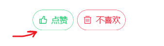

文章详情页

## 目标


## 基本结构

创建 `views/article/index.vue` 并写入以下内容。一共分成如下3个基本的部分。

```html
<template>
  <div class="article-container">
    <!-- 导航栏 -->
    <van-nav-bar
      fixed
      left-arrow
      @click-left="$router.back()"
      title="文章详情"
    ></van-nav-bar>
    <!-- /导航栏 -->

    <!-- 加载中 loading -->
    <van-loading class="article-loading" />
    <!-- /加载中 loading -->

    <!-- 文章详情 -->
    <div class="detail">
      <h3 class="title">标题</h3>
      <div class="author">
        <van-image round width="1rem" height="1rem" fit="fill" />
        <div class="text">
          <p class="name">作者</p>
          <p class="time">4天前</p>
        </div>
        <van-button
          round
          size="small"
          type="info"
        >+ 关注</van-button>
      </div>
      <div class="content">
        <p>正文</p>
      </div>
      <van-divider>END</van-divider>
      <div class="zan">
        <van-button round size="small" hairline type="primary" plain icon="good-job-o">点赞</van-button>
        &nbsp;&nbsp;&nbsp;&nbsp;
        <van-button round size="small" hairline type="danger" plain icon="delete">不喜欢</van-button>
      </div>
    </div>
    <!-- /文章详情 -->

  </div>
</template>

<script>
export default {
  name: 'ArticleIndex',
  data () {
    return {
      loading: true, // 控制加载中的 loading 状态
      article: { }
    }
  }
}
</script>

<style scoped lang='less'>
.article-container{
  position: absolute;
  left: 0;
  top: 0;
  overflow-y: scroll;
  width: 100%;
  height: 100%;
}
.article-loading {
  padding-top: 100px;
  text-align: center;
}
.error{
  padding-top: 100px;
  text-align: center;
}
.detail {
  padding: 50px 10px;
  .title {
    font-size: 16px;
  }
  .zan{
    text-align: center;
  }
  .author {
    padding: 10px 0;
    display: flex;
    .text {
      flex: 1;
      padding-left: 10px;
      line-height: 1.3;
      .name {
        font-size: 14px;
        margin: 0;
      }
      .time {
        margin: 0;
        font-size: 12px;
        color: #999;
      }
    }
  }
  .content {
    font-size:14px;
    overflow: hidden;
    white-space: pre-wrap;
    word-break: break-all;
    /deep/ img{
      max-width:100%;
      background: #f9f9f9;
    }
  }
}
</style>

```

## 路由配置

然后在 `router/index.js` 中新增路由配置项

```js
Vue.use(VueRouter)

const router = new VueRouter({
  // 配置路由表
  routes: [
    ......

      {
        path: '/article/:id',
        name: 'articleDetail',
        component: () => import('../views/article/index.vue')
      }
  ]
})

export default router
```

在地址栏中直接输入/article/111来测试一下。


## 路由跳转

在如下两处可以跳转详情页

- 文章列表
- 搜索页

views/home/articleList.vue中，点击文章列表项的时候，传递文章id跳转到文章详情页：

```html
<van-cell
        v-for="(item,index) in list"
        :key="index"
        :title="item.title"
        @click="$router.push('/article/'+item.art_id)"
        >
          <!--
            label是一个插槽名，是van-cell组件中提供的。它的作用是让元素在标题的正下方
            -->
          <div slot="label">
            <!--
              图片
              有几张图，分成几列

              van-grid： 宫格。
            -->
            <van-grid :column-num="item.cover.images.length">
              <van-grid-item v-for="(img,idx) in item.cover.images" :key="idx">
                <van-image lazy-load :src="img" />
              </van-grid-item>
            </van-grid>

            <!-- 文字说明 -->
            <div class="meta">
              <span>{{item.aut_name}}</span>
              <span>{{item.comm_count}}评论</span>
              <!-- relativeTime成为一个全局过滤器来使用
                这里的结果就是：relativeTime(item.pubdate)的返回值
               -->
              <span>{{item.pubdate | relativeTime}}</span>

              <!--
                登陆用户可以看见 X
                依据：只有登陆用户才有vuex 中 user
               -->
              <span class="close" v-if="$store.state.user" @click.stop="hMoreAction(item.art_id)">
                <van-icon name="cross"></van-icon>
              </span>

            </div>
          </div>
        </van-cell>
```

- @click="$router.push('/article/'+item.art_id.toString())">
- @click.stop

## 获取数据并显示

这里我们主要实现两个主要功能：

- 获取展示文章详情
- 处理加载中 loading


步骤：

- 封装接口
- 发送请求获取数据
- 模板绑定

下面是具体实现：

### 封装接口

1、在 `api/article.js` 中新增一个方法

```js

/**
 * 获取文章详情
 * @param {*} articleId 文章编号
 */
export const getArticle = (articleId) => {
  return request({
    method: 'GET',
    url: '/app/v1_0/articles/' + articleId
  })
}

```

### 调用接口

在views/article/index.vue组件中调用接口，获取文章详情

```js
import { getArticle } from '@/api/article'
export default {
  name: 'ArticleIndex',
  data () {
    return {
      loading: false, // 控制加载中的 loading 状态
      article: {}
    }
  },
  created () {
    this.loadArticle()
  },
  methods: {
    async loadArticle () {
      this.loading = true

      const result = await getArticle(this.$route.params.id)
      console.log(result)
      this.article = result.data.data

      // 取消加载状态
      this.loading = false
    }
  }
}
```

### 模板绑定

```html
<div class="article-container">
    <!-- 导航栏 -->
    <van-nav-bar
      fixed
      left-arrow
      @click-left="$router.back()"
      title="文章详情"
    ></van-nav-bar>
    <!-- /导航栏 -->

    <!-- 加载中 loading -->
    <van-loading class="article-loading" v-if="loading" />
    <!-- /加载中 loading -->

    <!-- 文章详情 -->
    <div class="detail">
      <h3 class="title">{{article.title}}</h3>
      <div class="author">
        <van-image round width="1rem" height="1rem" fit="fill" :src="article.aut_photo" />
        <div class="text">
          <p class="name">{{article.aut_name}}</p>
          <p class="time">{{article.pubdate | relativeTime}}</p>
        </div>
        <van-button
          round
          size="small"
          type="info"
        >+ 关注</van-button>
      </div>
      <div class="content">
        <div v-html="article.content">
        </div>
      </div>
      <van-divider>END</van-divider>
      <div class="zan">
        <van-button round size="small" hairline type="primary" plain icon="good-job-o">点赞</van-button>
        &nbsp;&nbsp;&nbsp;&nbsp;
        <van-button round size="small" hairline type="danger" plain icon="delete">不喜欢</van-button>
      </div>
    </div>
    <!-- /文章详情 -->

  </div>
```


效果：


## 文章操作

目标：

- 对作者进行 关注 或者 取消关注
- 对文章进行 点赞 或者 取消点赞
- 对文章进行 不喜欢 或者取消不喜欢

### 关注&取关

细节：

 在获取文章详情时，会带回一个` is_followed `来标记你是否关注


is_followed: false 表示当前登陆用户并没有关注过本文章的作者。

步骤：

- 封装接口
- 请求调用
- 模板处理


下面是具体实现过程：

#### 封装接口

在 `api/user.js` 中新增

```js

/**
 * 关注指定用户
 * @param {数值} userId 用户编号
 */
export function followUser (userId) {
  return request({
    method: 'POST',
    url: '/app/v1_0/user/followings',
    data: {
      target: userId
    }
  })
}

/**
 * 取关指定用户
 * @param {数值} userId 用户编号
 */
export function unFollowUser (userId) {
  return request({
    method: 'DELETE',
    url: '/app/v1_0/user/followings/' + userId
  })
}
```

#### 调用接口

然后在模板中

```html
<!-- 文章详情 -->
    <div class="detail">
      <h3 class="title">{{article.title}}</h3>
      <div class="author">
        <van-image round width="1rem" height="1rem" fit="fill" :src="article.aut_photo" />
        <div class="text">
          <p class="name">{{article.aut_name}}</p>
          <p class="time">{{article.pubdate | relativeTime}}</p>
        </div>
        <van-button
+         @click="hFollow"
          round
          size="small"
          type="info"
+        >{{ article.is_followed ? '取消关注' : '+ 关注一下'}}</van-button>
      </div>
      <div class="content">
        <div v-html="article.content">
        </div>
      </div>
      <van-divider>END</van-divider>
      <div class="zan">
        <van-button round size="small" hairline type="primary" plain icon="good-job-o">点赞</van-button>
        &nbsp;&nbsp;&nbsp;&nbsp;
        <van-button round size="small" hairline type="danger" plain icon="delete">不喜欢</van-button>
      </div>
    </div>
```

代码：

```
import { unFollowUser, followUser } from '@/api/user'


async hFollow () {
      if (this.article.is_followed) {
        // 为真，说明你是要 取关
        await unFollowUser(this.article.aut_id)
      } else {
        // 为假，说明你是要 加关
        await followUser(this.article.aut_id)
      }
      this.article.is_followed = !this.article.is_followed
    }
  }
```


### 点赞|取消点赞



细节：

这里唯一的难点对接口属性的使用。从后端取回来的文章详情中有一个attitude属性：用户对文章的态度

- -1 无态度
- 0  不喜欢
- 1  点赞


>  如果是做点赞，就是把attitude改成1 。
>
> 取消点赞，就是把 attiude改成-1


状态上有两个地方要修改：

- 方案
- 图标。

步骤：

- 封装接口
- 请求调用
- 模板处理

#### 封装接口

在 `api/article.js` 中封装数据接口

```js

/**
 * 取消点赞
 * @param {*} articleId 文章编号
 */
export const deleteLike = (articleId) => {
  return request({
    method: 'DELETE',
    url: '/app/v1_0/article/likings/' + articleId
  })
}

/**
 * 给文章点赞
 * @param {*} articleId 文章编号
 */
export const addLike = (articleId) => {
  return request({
    method: 'POST',
    url: '/app/v1_0/article/likings',
    data: {
      target: articleId
    }
  })
}

```

#### 调用接口

然后在 `views/article/index.vue` 组件中

```html
<template>
   ..... 
  <div class="zan">
        <van-button
        round
        size="small"
        hairline
        type="primary"
        plain
        @click="hLike"
        :icon="article.attitude === 1 ? 'good-job' : 'good-job-o'">
        {{ article.attitude === 1 ? "取消点赞" : "+点赞"}}
        </van-button>
      ......
      
</template>

<script>
import { getArticle, addLike, deleteLike } from '@/api/article'

export default {
  ...
  methods: {

// 是否点赞
    async hLike () {
      const articleId = this.article.art_id.toString()
      if (this.article.attitude === 1) {
        // 为真，说明你是要 取消点赞
        await deleteLike(articleId)
        this.article.attitude = -1
      } else {
        // 为假，说明你是要 添加点赞
        await addLike(articleId)
        this.article.attitude = 1
      }
    }
  }
}
</script>
```


### 不喜欢|取消不喜欢


步骤

- 封装接口
- 请求调用
- 模板处理

下面是具体实现流程：


#### 封装接口

1、在 `api/article.js` 中封装两个请求方法

```js
/**
 * 文章接口相关请求模块
 */
import request from '@/utils/request'


/**
 * 对文章不喜欢
 */
+ export function addDislike (articleId) {
+   return request({
+     method: 'POST',
+     url: '/app/v1_0/article/dislikes',
+     data: {
+       target: articleId
+     }
+   })
+ }

/**
 * 取消对文章不喜欢
 */
+ export function deleteDislike (articleId) {
+   return request({
+     method: 'DELETE',
+     url: '/app/v1_0/article/dislikes/' + articleId
+   })
+ }
```

#### 调用接口

然后在 `views/article/index.vue` 组件中

```html
<template>
    <van-button
          round
          size="small"
          hairline
          type="danger"
          plain
          icon="delete"
+          @click="onDislike"
+        >{{ article.attitude === 0 ? '取消不喜欢' : '不喜欢'}}</van-button>
    </div>
</template>

<script>
import { getArticle } from '@/api/article'
import { followUser, unFollowUser } from '@/api/user'
+ import { addLike, deleteLike, addDislike, deleteDislike } from '@/api/article'


    /**
     * 不喜欢/取消不喜欢
     */
+    async onDislike () {
+      const articleId = this.article.art_id.toString()
+      // 如果是不喜欢状态，则取消不喜欢
+      if (this.article.attitude === 0) {
+        await deleteDislike(articleId)
+        this.article.attitude = -1
+      } else {
+        // 否则，不喜欢
+        await addDislike(articleId)
+        this.article.attitude = 0
+      }
+    }
  }
}
</script>

```


