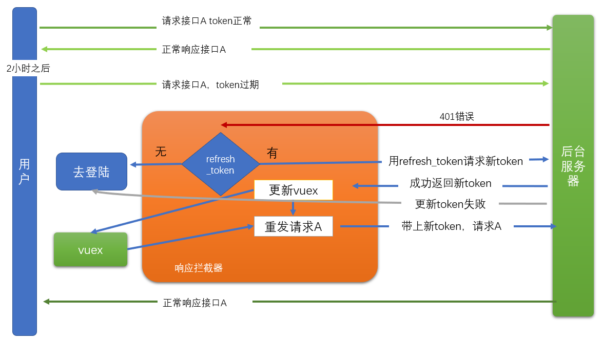

一个项目有很多个页面，有些页面是需要有**权限**的用户才有访问的。例如：修改密码这个页面，肯定只能是登陆用户才能访问。


当我们发现一个没有用户的用户试图去访问一个需权根的页面时，我们应该把它引导到登陆界面，当用户完成登陆操作之后，再跳回到他之间访问的页面。


## 全局前置路由

一个没有登陆的用户肯定是不能去访问`/user`这个页面的。也就是说，当用户从一个路由进入到`/user`这个路由时，应该去检查一下它是否已经登陆了。如果它登陆了，则允许访问，否则，转到登陆页，等他登陆成功之后，再次回来。

> 在本项目中，有如下三个路由需要进行检查
>
> /user     /user/chat    /user/profile

在router/index.js中补充一个前置路由守卫

```javascript
// 就是把store/index.js中的export default 的内容
// 保存在store中，store这个名，是可以改的。
import store from '@/store/index.js'

// 前置守卫
// beforeEach是由VueRouter提供的
// 每当路由变化 时，在跳入到目标路由之前就会执行这个函数
// A ---> B
router.beforeEach(function (to, from, next) {
  // to   : 目地 B
  // from : 从哪里 A
  // next ：是一个函数，可以用来做路由的跳转
  console.log(to, from, next)
  if (isOk(to)) {
    next() // 不加参数，就是允许进入到to路由
  } else {
    // 回到登陆页
    // 不忘初心。
    // 如果用户没有登陆，他现在的路由是 "/a1/b"
    //   它要访问的是 "/user"
    //   它就被路由守卫跳转到了 "/login"
    // 问:当它在/login中成功登陆之后，应该要跳回到哪里去？
    // A: 主页
    // B: /user (正解)
    next({
      path: '/login',
      query: {
        from: to.fullPath // 让它可以找到来时的路 /user
      }
    })
  }
})

// 写具体的规则
// 如何在index.js文件中，得知当前用户是否有登陆？
// 答：通过vuex中的store来判定

// 在组件内部，可以通过this.$store来访问vuex
// 在一个普通的js文件中，如何去获取vuex中的数据？
// import XXXX from "@/store/index.js"

function isOk (to) {
  // 检查是否允许访问
  // 如果你访问的路由是以"/user"开头，则一定要是登陆状态，否则不允许
  if (to.path.startsWith('/user') && !store.state.user) {
    console.log(to)
    return false
  } else {
    return true
  }
}

```

- to     ，表示在当前路由变化时，你进入哪个路由。
- from，表示在当前路由变化时，你要离开哪个路由。
- next。必须要调用这个next()来结束对当前的动作的处置。不管你决定这个路由跳转应该如何处理，但一定要给一个处理结果。（这个过程就像是express框架中的res.end()一样）
  - next() // 放行
  - next(false) // 不让跳，回到from
  - next(路由) 进入指定路由
    - next({path:, name:, ....})


在login/index.vue 中要改进一下跳转的目标

```
// 用户跳转
const to = this.$route.query.from || '/'
this.$router.push(to)
```


## token过期处理

目标：

 通过axios响应拦截器来处理token过期的问题，让整个过程用户无感。


当用户登陆成功之后，返回的token中有两个值，说明如下：

- token:
  - 作用：在访问一些接口时，需要传入token，就是它。
  - 有效期：2小时。

- refresh_token
  - 作用: 当token的有效期过了之后，可以使用它去请求一个特殊接口（这个接口明确需要refresh_token），并返回一个新的token回来（有效期还是2小时），以替换过期的那个token。
  - 有效期：14天。




思路：

request的[响应拦截器](https://www.npmjs.com/package/axios#interceptors)中：

- 对于某次请求A，如果是401错误
  - 有refresh_token，用refresh_token去请求回新的token
    - 新token请求成功
      - 更新本地token
      - 再发一次请求A
    - 新token请求失败
      - 清空vuex中的token
      - 携带请求地址，跳转到登陆页
  - 没有refresh_token
    - 清空vuex中的token
    - 携带请求地址，跳转到登陆页


代码

```javascript


// 引入路由
import router from '@/router/index.js'

// .....


// Add a 响应拦截器 interceptor
request123.interceptors.response.use(function (response) {
  // Any status code that lie within the range of 2xx cause this function to trigger
  // Do something with response data
  return response
}, async function (error) {
  // 有错误到这里来,只处理401错误(是由token过期，错误导致)。
  if (error.response.status === 401) {
    if (store.state.user && store.state.user.refresh_token) {
      try {
        // 用refresh_token去求一个特殊的接口以获取新的token
        const result = await axios({
          url: 'http://ttapi.research.itcast.cn/app/v1_0/authorizations',
          method: 'PUT',
          headers: {
            Authorization: `Bearer ${store.state.user.refresh_token}`
          }
        })
        // 从接口返加值中去取出新token，更新到当前的vuex中
        // mutations去改token
        store.commit('updateToken', result.data.data.token)
        console.log('更新token ok')
        // console.log(result)
        // error.config 就是当前错误发生时，axios中的配置

        // 更新了token请求重发一次
        return request123(error.config)
        // store.state.user.token = result.data.data.token
      } catch (e) {
        console.log('更新token，refresh_token 失败')
        // 消除vuex的token
        store.commit('setUser', null)
        // 必须要重新登陆
        router.push({
          path: '/login',
          query: {
            // router中有一个属性currentRoute
            from: router.currentRoute.fullPath
          }
        })
      }
    } else {
      console.log('没有refresh token,准备去重新登陆吧')
      router.push({
        path: '/login',
        query: {
          // router中有一个属性currentRoute
          from: router.currentRoute.fullPath
        }
      })
    }
    console.log('响应拦截器')
    console.dir(error)
  } else {
    return Promise.reject(error)
  }
})
```

