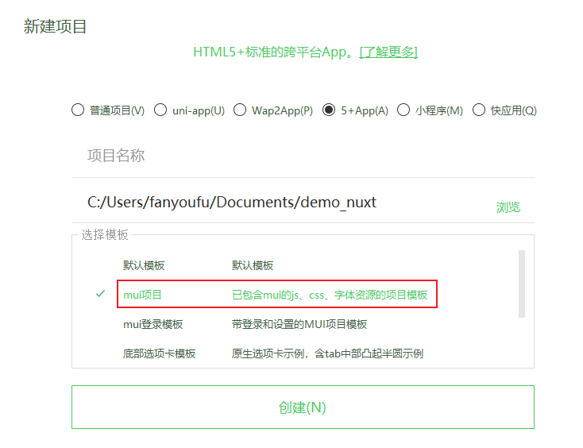
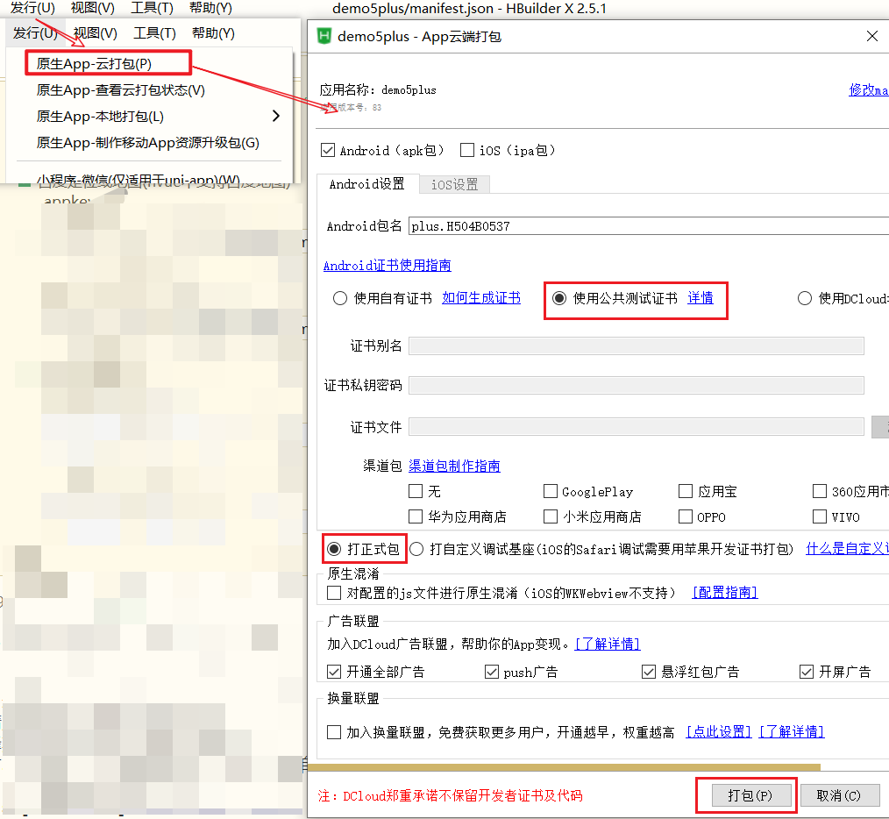
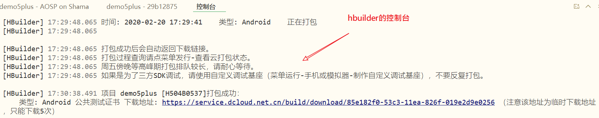

## 混合开发app

目标：

- 介绍一款编辑器
- 了解混合开发

准备工作

- 软件：
  - [hbuilderX](https://www.dcloud.io/hbuilderx.html): 一个强大的编辑器，用来编辑代码。
  - [夜神模拟器](https://www.yeshen.com/)：一个安卓手机模拟器，用来调试代码[可选]。
- 硬件：
  - 手机数据线。用来做真机调试，安装打包后的app。


### Hbuilder

下载并安装编辑器

- HbuilderX 普通版
- [HbuilderX开发版](https://www.dcloud.io/hbuilderx.html)

### 创建5+App 项目

我们要选择5+App 项目,mui也是一套前端框架，可以选择一个mui项目。



- 普通项目。 普通H5项目, Hbuilder内置了几套模板,作用不大,同学们基本都会自己创建
- uni-app。多端应用,一套代码,复用八端,时下最火的一个跨端框架
- wap2App。wap项目转 App , 原来只运在手机上的wap(无线网络协议,诺基亚,爱立信时代)项目 可转app项目
- **5+ App**。利用DCloud 的 **`5+ Runtime`**来做原生能力提供者的 项目
- 小程序。微信原生小程序的另外一个编辑器,比微信提供的开发者工具好用,但是现在谁还在用原生写小程序呢?
- 快应用 。原生快应用编辑器 , 较为冷门的生态, 目前不太热闹


### 示例代码

```
<!DOCTYPE html>
<html>
	<head>
		<meta charset="utf-8">
		<meta name="viewport" content="width=device-width,initial-scale=1,minimum-scale=1,maximum-scale=1,user-scalable=no" />
		<title></title>
		<script src="js/mui.min.js"></script>
		<link href="css/mui.min.css" rel="stylesheet" />
		<style type="text/css">
			.image-box {
				width: 80%;
				margin: 20px auto;
				border-radius: 5px;
				border: 1px solid #2AC845;
				padding: 10px;
				box-shadow: 2px 2px 5px 2px rgba(0, 0, 0, .1);
			}

			.image-box img {
				display: block;
				width: 100%;
			}
			
			
		</style>
		<script type="text/javascript" charset="utf-8">
			mui.init();
		</script>

		<script type="text/javascript">
			document.addEventListener('plusready', function() {
				// 5+runtime 初始化完成
				console.log('原生能力已经就绪')
				console.dir(plus)
			})
		</script>
	</head>
	<body>
		<header class="mui-bar mui-bar-nav">
			<h1 class="mui-title">标题</h1>
		</header>
		<div class="mui-content" id="content">
			<ul class="mui-table-view mui-grid-view mui-grid-9">
				<li id="btnCamera" class="mui-table-view-cell mui-media mui-col-xs-4 mui-col-sm-3">
					<a href="#">
						<span class="mui-icon mui-icon-camera"></span>
						<div class="mui-media-body">camera</div>
					</a>
				</li>
				<li id="btnLocation"class="mui-table-view-cell mui-media mui-col-xs-4 mui-col-sm-3">
					<a href="#">
						<span class="mui-icon mui-icon-location"></span>
						<div class="mui-media-body">Location</div>
					</a>
				</li>

				<li id="btnPhone"class="mui-table-view-cell mui-media mui-col-xs-4 mui-col-sm-3">
					<a href="#">
						<span class="mui-icon mui-icon-phone"></span>
						<div class="mui-media-body">Phone</div>
					</a>
				</li>
			</ul>
			
			<div class="image-box">
				
			</div>

		</div>
		<nav class="mui-bar mui-bar-tab">
			<a class="mui-tab-item mui-active">
				<span class="mui-icon mui-icon-home"></span>
				<span class="mui-tab-label">首页</span>
			</a>
			<a class="mui-tab-item">
				<span class="mui-icon mui-icon-phone"></span>
				<span class="mui-tab-label">电话</span>
			</a>
			<a class="mui-tab-item">
				<span class="mui-icon mui-icon-email"></span>
				<span class="mui-tab-label">邮件</span>
			</a>
			<a class="mui-tab-item">
				<span class="mui-icon mui-icon-gear"></span>
				<span class="mui-tab-label">设置</span>
			</a>
		</nav>

		<script type="text/javascript">
			// 拍照
			document.getElementById("btnCamera").addEventListener('tap', () => {
				if (plus) {
					var carmera = plus.camera.getCamera(1) // 获取主摄像头对象
					carmera.captureImage(function(url) {
						// 注意这个地址不能用 需要转化
						// 需要将相对手机路径变成绝对路径
						let absoluteUrl = plus.io.convertLocalFileSystemURL(url)
						// 我们把地址放到一个新的图片上
						let imageBox = document.createElement("div")
						imageBox.className = "image-box"
						let img = document.createElement("img")
						img.src = absoluteUrl
						imageBox.appendChild(img)

						document.getElementById("content").appendChild(imageBox)
					})
				}
			})
		
			document.getElementById("btnPhone").addEventListener("tap",()=>{
				// 打电话 
				plus.device.dial('10086')
			})
		</script>
	</body>
</html>
```

上面的演示代码中，就已经有原生的能力：打电话，拍照。


### 5+项目的使用和测试

我们的界面搭建完毕, 接下来我们要尝试去调用摄像头 以及电话，很显然，这属于原生的能力。那么，现在我们的代码中有原生的能力了吗？

答案是：有。

我们创建的项目是 5+ Runtime,  这个项目本身就自带原生能力的， 我们的项目中多了一个文件 **`manifest.json`**   [说明地址](https://ask.dcloud.net.cn/article/94),该文件是一个w3c的webapp配置文件。


HbuilderX 给我们的页面中注入了个全局对象 **`plus`**, 这个plus就是我们的原生能力

我们可以在页面中监听plus初始化完成的事件

```js
document.addEventListener('plusready', function(){
	console.log('原生能力准备好了')
})
```

上述代码在浏览器中是不会执行的，它必须要在真机或者手机模拟器中使用。


### 真机测试

整体思路是：通过数据线把手机与电脑连接，并在手机上**开启开发者模式**，开放权限，以方便hbuilder识别手机。

步骤：

1. 开启手机的开发者模式。 一般是在手机版本号上连续点击多次。
2. 启动手动上的usb调试，开放安装，访问等权限。
3. 用数据线连接到电脑，并从充电模式切换文件传输模式。
4. 在hbuilder中，运行->运行到手机或者模拟器，检查是否能识别到手机。

[HBuilder/HBuilderX真机运行、手机运行、真机联调常见问题](http://ask.dcloud.net.cn/article/97)


### 打包5+项目成App

打包方式有两种：

- 本地打包：本地打包**`需要配置`**  安卓以及苹果的开发打包环境  [安卓本地打包说明](https://ask.dcloud.net.cn/article/508)

- 云打包：是把我们的资源提交到DCloud服务器, 由DCloud完成打包，比较简单不需要 环境安装, 我们此次采用云打包方式。

#### 打包原理

把本机上的项目代码 + 基座   ------> app软件 （安卓的.apk 或者 苹果的 .ipa）

#### 步骤

- 本地配置mainfest.json文件
  - app图标
- 云打包。
- 下载并使用。

#### 配置mainfest.json

操作：配置[mainfest.json](http://ask.dcloud.net.cn/article/94)文件 , 此文件是配置我们app的各种配置,例如 图标,权限,启动屏等。

- 图标

  - 大小：1024*1024
  - 格式：png
  - 使用到的图片会自动拷贝到根目录的unpackage文件夹中。

  

#### 打包

发行->云打包->设置



如果一切正常，你将会在控制台中看到类似如下的结果：



这就是云打包成功了。

#### 下载安装包

在给定的上一步中给出的临时地址中下载安装包到本地，

类似如下的图标。

然后你可以安装到模拟器上，或者是你自已的手机上。

- 安装到模拟器：直接拖放到模拟器上即可。
- 安装到手机上：先用其它工具（例如：微信的文件传输助手，或者qq都行）传到手机中，再使用手机自带的文件管理工具找到它，再安装。


## 打包现有h5项目

问： 

如果我们已经使用vue技术开发了一个纯h5的web应用，是否可以给它也打包成一个app呢？答案是：可以。

接下来，以前面学习的头条项目为例，来介绍如何打包成app。


在实操之前有两个知识点要回顾一下：

- 要打包项目，就必须要用mainfest.json文件，而h5项目中是没有的。
- 在vue项目中，npm run build会把pulic中的资源打包进入dist目录。

### 步骤

#### 向h5项目中添加manifest.json

由于mainfest.json中的配置项比较复杂，不方便手动编写。可以：

- 方法1：从已有的5+项目中复制出。

- 方法2：新建一个5+项目，并配置相关信息之后，生成manifest再去复制出来。


最后把得到的manifest.json及unpackage目录全都拷贝到vue项目的public目录下，在打包时，它们会自动拷贝到dist目录下。

#### 在main.js中添加一段代码

H5就是运行在浏览器中的, 只不过运行在 **`5+ Runtime`**这个增强版浏览器里面, 浏览器和 APP的物理按钮并没有进行关联, 也就是 点击手机返回按钮, 浏览器并不会进行后退操作。

上面的理论比较不好理解，下面来一个具体的场景:

用户进入app，屏幕上显示文章列表，用户进一步点开一篇文章，此时会显现出这篇文章的详情内容。问： 如果用户在手机上按下后退键（或者是触屏手机上在屏幕向右滑动一下），我们希望得到的结果是：

- 情况A. 回到文章列表。
- 情况B. 退出这个app。

显然A结果是比较好的效果。

好的，结论来了，如果不加入下面的代码，你就会得到B结果，加完之后，就会得到A效果。

具体来说就是把下面的代码添加到vue项目的main.js中。

```javascript
// 在main.js中添加如下代码  此代码是采用的 5+ Runtime中的plus对象
document.addEventListener('plusready', function () {
  var webview = window.plus.webview.currentWebview()
  window.plus.key.addEventListener('backbutton', function () {
    webview.canBack(function (e) {
      if (e.canBack) {
        webview.back()
      } else {
        // webview.close(); //hide,quit
        // plus.runtime.quit();
        // 首页返回键处理
        // 处理逻辑：1秒内，连续两次按返回键，则退出应用；
        var first = null
        window.plus.key.addEventListener('backbutton', function () {
          // 首次按键，提示‘再按一次退出应用’
          if (!first) {
            first = new Date().getTime()
            setTimeout(function () {
              first = null
            }, 1000)
          } else {
            if (new Date().getTime() - first < 1500) {
              window.plus.runtime.quit()
            }
          }
        }, false)
      }
    })
  })
}) 

```


#### 正常打包vue项目

现在正常打包vue项目。在头条项目的根目录下，运行：

```bash
npm run build
```

如果打包正常，则会自动生成dist目录。

进入到dist目录下，检查一下，可以发现原来在public目录下的unpackage及mainfest.json也拷贝过来了。

此时，可以认为dist目录下的整体个内容就是一个完整的5+项目了，只不是它没有使用5+的api而已。


#### 打包5+项目

启动hbuilder，用它打开dist目录，hbuilder会自动检测它的目录结构，并当成是一个5+项目。接下来，按前面学习的云打包方式云打包即可。


### 附：打包ios

参考：https://blog.csdn.net/qq_34440345/article/details/99711586