## VUE 基础-day01

> 两个课程阶段：vue 基础 + vue 项目（头条自媒体管理 PC 端）

### 01-介绍-vue 是什么

> 目标：了解 vue 的一些基础概念。

vue 是一个 javascript 框架，官方的解释：渐进式 JavaScript 框架。

小概念：

- 库：提供一些**api 方法**，组合在一起的 js 模块。
- 框架：提供一套解决方案，提供了一套规则，需要按照这个规则来组织实现功能。

总结：使用 vue 就是想学习 vue 提供的规则，后面的项目就可以使用这些规则来实现。

### 02-介绍-vue 做什么

> 目标：知道我们学习 vue 的原因。

**vue 适合做单页面应用程序**（在一个页面上实现网站功能），术语：SPA （single page application ）。大家之前做的大事件项目，是多页面应用程序，传统类型的网站系统。

- 如果在一个页面实现一个网站所有的功能，这个页面非常复杂，开发难度很高。
- 那么 框架（**vue** react angular）也就诞生，来解决这个问题的。
- 因为 vue 比较符合现有的开发思想，比较好入门，国内最流行的 js 框架。

疑问：可不可在传统类型的网站使用？可以，情况较少。

总结：vue 主要做 SPA 类型的系统。

### 03-介绍-vue 的核心

> 目标：了解 vue 的核心功能。

vue 提供的核心功能：

- 数据驱动视图

  - 好处：只需要操作数据，即可达到页面更新，大大的减少 dom 操作，提供开发效率。

- 数据双向绑定

  - mvvm 前端开发思想（类似后台开发思想 MVC），拆开：M + V + VM ，三部分组成：
    - M 数据
    - V 视图（页面）
    - VM 视图与数据管理者

  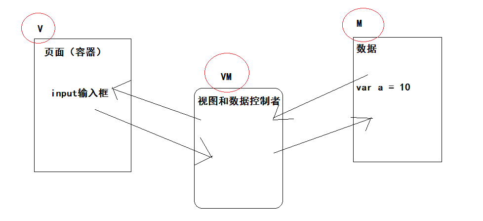

- 组件化开发
  - 把页面拆分成若干个容器，每一个容器实现：
    - html 结构
    - css 样式
    - js 逻辑
  - 好处：复用，单独维护较为复杂业务功能，提供代码可维护性。

总结：vue 的核心功能：数据驱动视图，双向属性绑定（MVVM），组件化开发。

### 04-起步-安装 vue

> 目标：知道怎么去安装 vue 的几种方式。

安装的几种方式：

- 本地引入

  - 下载：https://cn.vuejs.org/js/vue.js
  - 引入：` <script src="./vue.js"></script> `

- cdn 引入

  ```html
  <script src="https://cdn.jsdelivr.net/npm/vue@2.6.11"></script>
  ```

- npm 下载

  - 安装：`npm i vue`

总结：我们采用本地引入，先下载，在引入。

### 05-起步-体验 vue

> 目标：能够自己独立的完成第一个 vue 程序。

```html
<!DOCTYPE html>
<html lang="en">
  <head>
    <meta charset="UTF-8" />
    <meta name="viewport" content="width=device-width, initial-scale=1.0" />
    <title>01-vue基础-体验例子</title>
  </head>
  <body>
    <div id="app">
      <h3>{{msg}}</h3>
      <input type="text" v-model="msg" />
    </div>
    <script src="./vue.js"></script>
    <script>
      // 体验例子
      const vm = new Vue({
        el: "#app",
        data: {
          msg: "hi vuejs",
        },
      });
    </script>
  </body>
</html>
```

总结：先模仿写一个 demo

- vm 就是 vue 的实例，对应 MVVM 中的 vm
- data 选项中存放数据，对应 MVVM 中的 m
- app 的容器，对应 MVVM 中的 v

### 06-★ 选项-el

> 目标：知道 vue 选项中 el 选项的使用方法和注意事项。

```html
<div id="app"></div>
<script src="./vue.js"></script>
<script>
  const vm = new Vue({
    // 指定vm实例管理的视图容器 el 就是 element 的简写。
    // 1. 通过选择器可以指定容器（具体标签），这个标签内的东西可以通过vue来管理（使用vue的功能）
    // 2. 通过 具体的dom对象来指定 例如：document.querySelector('#app')
    // 3. 注意：不能指定 html body 容器作为视图容器
    el: "#app",
  });
</script>
```

- el 通过 选择器指定 vue 管理的容器
- 不能管理 html body

### 07-★ 选项-data

> 目标：知道 vue 选项中 data 选项的使用方法和注意事项。

```html
<div id="app">
  <h3>{{msg}}</h3>
  <h4>{{user.name}}</h4>
</div>
<script src="./vue.js"></script>
<script>
  const vm = new Vue({
    el: "#app",
    // 如果在管理的视图容器中，需要使用数据，name在data当中声明。
    // 体验修改数据：vm.msg = '123'，为何可以这样进行修改。
    // 解释：
    // 1. {data:'数据配置选项'} 传入个Vue钩子函数去使用的
    // 2. vue在实例化的时候 会将data属性设置在 $data 的实例属性中
    // 3. 其实可以使用 vm.$data.msg = 123  进行数据的修改，但是略微麻烦
    // 4. vue把$data当中的数据，代理在 vm 实例下，所以直接通过实例也可以修改访问数据
    // 注意：
    // 我们把修改数据后，视图容器使用数据的位置，也发生更新，称为：数据驱动视图
    // 能够驱动视图更新的数据，也可以认为是响应式数据，响应式数据必须 显性的声明。
    // 如果使用响应式数据，必须在data当中提前声明。
    data: {
      msg: "hi vuejs",
      // 现在user中没有任何属性
      user: {
        // 提前声明
        name: "",
      },
    },
  });
</script>
```

总结：

- 在 vue 实例 vm 中有$data 是你传入的数据，但是 vm 实例上也有这些数据，方便使用。
- 注意：如果要声明响应式数据（数据驱动视图），data 中必填提前声明。

### 08-★ 选项-methods

> 目标：知道 vue 选项中 methods 选项的使用方法和注意事项。

```html
<div id="app">
  <h3>{{msg}}</h3>
  <h4>{{say()}}</h4>
  <h4>{{say1()}}</h4>
  <h4>{{say2()}}</h4>
</div>
<script src="./vue.js"></script>
<script>
  const vm = new Vue({
    el: "#app",
    data: {
      msg: "hi vuejs",
    },
    // methods 选项的作用是，声明在vue实例中需要使用的函数
    methods: {
      // 声明函数：提供给vm使用，也可以提供给视图使用。
      // 传统写法
      say: function () {
        return "你好";
      },
      // 简写写法
      say1() {
        return "你好1 " + this.msg; // this === vm 就是vue实例
      },
      // 箭头函数
      say2: () => {
        // 注意：在vue的methods中不建议使用箭头函数
        // 原因：箭头还是没有this,使用外层代码的this,此时外层代码是window
        return "你好2 " + this.msg;
      },
    },
  });
</script>
```

总结：

- 在 vue 实例中声明函数，在 methods 选项中进行
- 声明完之后：
  - 可以在模板但是使用
  - 可以通过 vue 实例来使用
- 注意：不建议使用箭头函数，在函数内访问不到 vm 实例。

### 09-术语-插值表达式

> 目标：了解 vue 术语插值表达式是什么和使用场景。

概念：在视图容器中的 `{{ }}` 称为插值表达式

```html
<div id="app">
  <!-- 以下是js表达式 -->
  <h4>{{msg}}</h4>
  <h4>{{ 1 + 1 }}</h4>
  <h4>{{ count > 10 ? '大' : '小' }}</h4>
  <h4>{{ say() }}</h4>
  <!-- 以下是js语句:不能再插值表达式中写 js语句,例如：声明变量，分支语句，循环语句 -->
  <h4>{{ var a = 10 }}</h4>
</div>
<script src="./vue.js"></script>
<script>
  const vm = new Vue({
    el: "#app",
    data: {
      msg: "hi vuejs",
      count: 10,
    },
    methods: {
      say() {
        return "你好";
      },
    },
  });
</script>
```

总结：`{{ js表达式 }}` 可以写任意的 js 表达式

- `{{msg}}` 使用 data 当中的数据
- `{{ 1 + 1 }}` 简单运算，js 表达式
- `{{count > 10 ? '大' : '小'}}` 三元运算，js 表达式
- `{{say()}} ` 可以使用 methods 中的方法
- 注意：不能使用 js 语句 （变量声明，分支循环语句）

### 10-术语-指令

> 目标：了解 vue 术语指令是什么和使用场景。

解释：vue 给标签扩展功能的属性，可以认为是指令。

例如：`v-model` 扩展 input 标签的功能，双向数据绑定功能。

定义：使用 v- 开头的属性，你就可以认为是指令。

在接下来的课程内容中，会学习 vue 提供的指令。

### 11-指令-v-text 和 v-html

> 目标：能够使用 v-text 和 v-html 去更新标签内容。

提供的功能是：更新标签中的内容。

- v-text 是更新标签内容，格式是 文本 （dom 属性 innerText）
- v-html 是更新标签内容，格式是 html (dom 属性 innerHtml)

```html
<div id="app">
  <!-- v-text  更新 文本内容 -->
  <div v-text="textStr"></div>
  <!-- v-html  更新 html内容 -->
  <div v-html="htmlStr"></div>
</div>
<script src="./vue.js"></script>
<script>
  const vm = new Vue({
    el: "#app",
    data: {
      textStr: "<b>文本内容1</b>",
      htmlStr: "<b>html内容2</b>",
    },
  });
</script>
```

总结：v-text 渲染文本，v-html 渲染 html 结构。

### 12-指令-v-show 和 v-if

> 目标：能够使用 v-show 和 v-if 去控制标签的显示隐藏。

提供的功能是：

- v-show 提供的是，标签的显示和隐藏。
- v-if 提供的是，标签的创建和移除。

演示：

```html
<div id="app">
  <!-- v-show 提供的是，标签的显示和隐藏 -->
  <!-- 如果值是 true 就是显示，如果值是 false 就是隐藏（display:none） -->
  <div v-show="isShow">使用v-show指令</div>
  <!-- v-if 提供的是，标签的创建和移除。 -->
  <!-- 如果值是 true 就是显示（创建元素），如果值是 false 就是隐藏（移除元素） -->
  <div v-if="isShow">使用v-if指令</div>
</div>
<script src="./vue.js"></script>
<script>
  const vm = new Vue({
    el: "#app",
    data: {
      isShow: false,
    },
  });
</script>
```

结论：

- v-show 通过样式控制显示隐藏
- v-if 通过创建和移除元素来进行显示和隐藏。

补充：

- v-show 使用场景：当元素需要频繁的切换显示和隐藏
  - 例如：选项卡
- v-if 使用场景：当在渲染的时候，就需要判断是否显示，今后不需要频繁切换。

### 13-指令-v-on

> 目标：能够使用 v-on 去绑定事件。

提供绑定事件的功能：`v-on:click="处理逻辑"` 或者 `@click="处理逻辑"`

```html
<div id="app">
  <!-- v-on:具体事件="处理逻辑" 处理逻辑：简单js表达式 或者  methods中的函数 -->

  <!-- v-on:具体事件="处理逻辑" 传统写法 -->
  <button v-on:click="isShow = false">隐藏DIV</button>

  <!-- @ 是 v-on: 的简写 -->
  <!-- 
      情况：如果处理逻辑的代码很多，不是一个简单的表达式能够搞定的，
      建议绑定methods中的函数，在函数中实现较为复杂的逻辑，比较常见。
    -->

  <!-- 
      情况：如果在事件绑定的函数中获取 事件对象
      如果1：绑定函数的时候加上了括号  @click="show($event)" 使用$event传递事件对象
      如果2：绑定函数的时候没有加括号  其实会有默认传参  就是事件对象
     -->

  <!-- 
       情况：在触发事件的时候，给绑定的函数传参
       如果：你需要给绑定的函数传参 @click="show($event,100)" 必须带上括号
      -->
  <button @click="show($event,100)">显示DIV</button>

  <div v-show="isShow">我是一个DIV</div>
</div>
<script src="./vue.js"></script>
<script>
  const vm = new Vue({
    el: "#app",
    data: {
      isShow: true,
    },
    methods: {
      // 显示div
      show(e, num) {
        // e 就是事件对象
        console.log(e);
        console.log(num);

        // this就是vm  就是vue实例
        this.isShow = true;
      },
    },
  });
</script>
```

其他情况：**事件修饰符**

- 绑定 a 标签的点击事件时候，处理触发事件，还会进行跳转 prevent
- 比如：事件只想触发一次 once

```html
<!-- a标签绑定点击事件  阻止默认行为-->
<a href="http://www.baidu.com" @click.prevent="fn">百度</a>
<!-- 让事件只触发一次 -->
<span @click.once="fn1">只触发一次事件</span>
```

```html
// fn函数 fn () { console.log('点击了A标签') }, // fn1 函数 fn1 () {
console.log('点击SPAN标签') }
```

### 14-指令-v-for

> 目标：能够使用 v-for 去遍历标签。

给标签提供了遍历功能。使用 v-for 的场景。

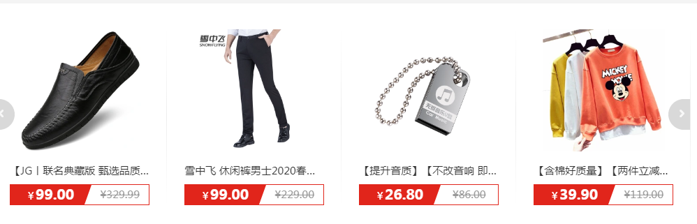

具体看看指令使用：

```html
<div id="app">
  <!-- v-for 遍历标签 -->

  <!-- 情况1：不依赖数据，直接遍历4次 -->
  <ul>
    <!-- i  是一个变量，含义 从1开始的序号-->
    <li v-for="i in 4">{{i}}</li>
  </ul>
  <hr />

  <!--  情况2：依赖data中的数据 数组 -->
  <ul>
    <!-- item 是一个变量，含义：遍历list的时候每一项数据 -->
    <!-- in 是固定写法 -->
    <!-- list 也是变量，data当中声明的数据，类型（数组|对象）-->
    <li v-for="item in list">{{item}}</li>
  </ul>
  <hr />

  <!--  情况3：依赖data中的数据 数组 获取索引-->
  <ul>
    <!-- item 是一个变量，含义：遍历list的时候每一项数据 -->
    <!-- i 是一个变量，含义：索引 -->
    <!-- in 是固定写法 -->
    <!-- list 也是变量，data当中声明的数据，类型（数组|对象）-->
    <li v-for="(item,i) in list">{{item}}--->{{i}}</li>
  </ul>
  <hr />

  <!--  情况4：依赖data中的数据 对象 获取 键值 -->
  <ul>
    <!-- v 是一个变量，含义：值 -->
    <!-- k 是一个变量，含义：键 -->
    <!-- i 是一个变量，含义：索引 -->
    <li v-for="(v,k,i) in obj">键：{{k}}--->值：{{v}}--->索引：{{i}}</li>
  </ul>
</div>
<script src="./vue.js"></script>
<script>
  const vm = new Vue({
    el: "#app",
    data: {
      // 把list中的数据生成若干个li标签
      list: ["周杰伦", "林俊杰", "王力宏"],
      // 通过对象来遍历li标签
      obj: {
        name: "周杰伦",
        age: 40,
        gender: "男",
      },
    },
  });
</script>
```

补充细节：

- 使用 v-for 的时候，有个规范和约定，遍历处理的每一个元素，最后使用 key 属性进行标识。
  - 这样做的好处：操作元素的时候，更快找到对应的元素，性能有所提高。
  - 数组：`<li v-for="(item,i) in list" :key="i">`
  - 对象：`<li v-for="(v,k,i) in obj" :key="k">`
  - 注意：key 的值一定要是一个唯一的标识。
- 大家可能以后会遇见这样代码 `<li v-for="item of list">`
  - 在 vue 中 for in 和 for of 的使用没有区别。

### 15-指令-v-bind

> 目标：能够使用 v-bind 去绑定属性的值。

提供了标签属性的动态绑定功能

```html
<div id="app">
  <!-- 动态绑定标签属性值 -->
  <!-- 插值表达式只能在标签内容使用，属性需要动态绑定需要使用v-bind -->
  <!-- 完整写法 -->
  <div v-bind:title="title">我是一个div</div>
  <!-- 简写写法 -->
  <div :title="title" :name="name">我是一个div</div>
</div>
<script src="./vue.js"></script>
<script>
  const vm = new Vue({
    el: "#app",
    data: {
      title: "vue提供的title",
      name: "div",
    },
  });
</script>
```

大家即可理解 `:key="i"` 是何意思：

- 给 标签动态绑定 key 属性的值。

### 16-案例

> 串一串今天的知识。

案例：列表渲染+删除功能

```html
<!DOCTYPE html>
<html lang="en">
  <head>
    <meta charset="UTF-8" />
    <meta name="viewport" content="width=device-width, initial-scale=1.0" />
    <title>Document</title>
    <link rel="stylesheet" href="./bootstrap.min.css" />
    <style>
      .container {
        margin-top: 100px;
      }
    </style>
  </head>
  <body>
    <div id="app">
      <div class="container">
        <table class="table table-bordered">
          <thead>
            <tr>
              <th>汽车品牌</th>
              <th>创建时间</th>
              <th>操作</th>
            </tr>
          </thead>
          <tbody>
            <tr v-for="(item,i) in list" :key="i">
              <td>{{item.brand}}</td>
              <td>{{item.time}}</td>
              <td><a href="#" @click.prevent="delBrand(i)">删除</a></td>
            </tr>
          </tbody>
        </table>
      </div>
    </div>
    <script src="./vue.js"></script>
    <script>
      const vm = new Vue({
        el: "#app",
        data: {
          list: [
            { brand: "宝马", time: "2011-10-10" },
            { brand: "奥迪", time: "2015-10-10" },
            { brand: "奔驰", time: "2010-10-10" },
            { brand: "宝骏", time: "2000-10-10" },
          ],
        },
        methods: {
          delBrand(index) {
            // 删除当前行（以前直接操作dom,现在操作去数据）
            // 删除当前行对应数据，根据索引找到对应的数据，进行删除即可
            // console.log(index)
            // 删除 list 中 index 索引对应的数据
            this.list.splice(index, 1);
          },
        },
      });
    </script>
  </body>
</html>
```

## VUE 基础-day02

- vue 是什么
  - JavaScript 框架
- vue 做什么
  - 主要做 SPA
- vue 核心
  - 数据驱动视图（响应式数据）
  - 双向数据绑定（MVVM 实现体现）
    - M 认为 data 中数据
    - V 认为 el 指定的容器
    - VM 认为 new Vue() 后的实例
  - 组件化开发
- vue 的选项
  - el 指定管理视图
  - data 声明依赖数据
  - methods 声明函数
- vue 的指令
  - v-text 与 v-html
  - v-show 与 v-if
  - v-on 简写 @
  - v-for
  - v-bind 简写 :

### 03-指令-v-bind 绑定 class

> 目标：知道通过 vue 怎么去操作类，也就是 class 属性的值。

- v-bind 作用是绑定标签的属性，绑定之后可以通过数据动态设置。
- 但是在标签上有一些特殊的属性，例如：class style 有特殊的绑定值得方法。

```html
<!DOCTYPE html>
<html lang="en">
  <head>
    <meta charset="UTF-8" />
    <meta name="viewport" content="width=device-width, initial-scale=1.0" />
    <title>01-vue基础-v-bind绑定class属性</title>
    <style>
      .red {
        color: red;
      }

      .bg {
        background: #ccc;
      }

      .border {
        border: 1px solid green;
      }
    </style>
  </head>

  <body>
    <!-- 1. class静态属性  :class属性是可以共存  :class 绑定的类及可以叠加 -->
    <!-- 2. :class=“绑定的值”  要求：对象类型  数组类型 -->

    <!-- 2.1 给:class属性绑定对象，对象当中是键值对 {key:value} -->
    <!-- key 就是类的名称，value是布尔类型：true 添加这个类，false 移除这个类 -->
    <!-- 如果需要操作多个类，对象里面可以写很多键值对 -->
    <!-- <div id="app">
    <div class="red" :class="{bg:hasBg,border:false}">01-vue基础-v-bind绑定class属性</div>
    <button @click="addClass">添加类</button>
    <button @click="removeClass">移除类</button>
  </div>
  <script src="./vue.js"></script>
  <script>
    const vm = new Vue({
      el: '#app',
      data: {
        hasBg: false
      },
      methods: {
        addClass() {
          // 加上背景
          this.hasBg = true
        },
        removeClass() {
          // 移除背景
          this.hasBg = false
        }
      }
    })
  </script> -->

    <!-- 2.2 给:class属性绑定数组，['item1','item2'] -->
    <!-- item1 item2 代表的是 类的名称 -->
    <div id="app">
      <div class="red" :class="classList">01-vue基础-v-bind绑定class属性</div>
      <button @click="addClass">添加类</button>
      <button @click="removeClass">移除类</button>
    </div>
    <script src="./vue.js"></script>
    <script>
      const vm = new Vue({
        el: "#app",
        data: {
          classList: [],
        },
        methods: {
          addClass() {
            // 往数组中添加，就是添加类
            this.classList.push("bg");
          },
          removeClass() {
            // 从数组中移除，就是移除类
            this.classList = [];
          },
        },
      });
    </script>
  </body>
</html>
```

总结：

- class 和 ：class 可以共存，：class 绑定的类是会累加
- ：class 可以绑定对象，对象中的 key 是类名 value 是 是否添加类名 布尔类型值
- ：class 可以绑定数组，数组当中 存在的每一项就是类名，移除这一项就是移除类名，添加一项就是添加类名。

###04-指令-v-bind 绑定 style

> 目标：知道通过 vue 怎么去操作行内样式，也就是 style 属性的值。

- style 的值比较特殊：`font-size:12px;color:red` 如果绑定的是字符串肯定不好操作。
- style 在绑定的时候：`:style="值"` 值：对象 数组

```html
<!DOCTYPE html>
<html lang="en">
  <head>
    <meta charset="UTF-8" />
    <meta name="viewport" content="width=device-width, initial-scale=1.0" />
    <title>02-vue基础-v-bind绑定style属性</title>
  </head>

  <body>
    <div id="app">
      <!-- 对象方式，绑定style -->
      <!-- 
      {key:value} 
      key就是css的属性名称(如果不加引号，需要遵循驼峰命名)  
      value就是css属性值 
    -->
      <!-- <div :style="styleObject">02-vue基础-v-bind绑定style属性</div> -->

      <!-- 数组方式，绑定style -->
      <!-- 
      [item1,item2,...] item1 指的就是对象{key,value}  
      key就是css的属性名称(如果不加引号，需要遵循驼峰命名) 
      value就是css属性值
    -->
      <div :style="styleArray">02-vue基础-v-bind绑定style属性</div>
      <button @click="addStyle">添加样式</button>
    </div>
    <script src="./vue.js"></script>
    <script>
      const vm = new Vue({
        el: "#app",
        data: {
          // 注意：属性的名称需要显性声明
          // styleObject: {
          //   fontSize: '16px'
          // }
          styleArray: [],
        },
        methods: {
          // addStyle () {
          //   // 添加 字体大小 40px 的样式
          //   this.styleObject.fontSize = '40px'
          // }
          addStyle() {
            // 往数组中追加对象，对象中就是样式
            this.styleArray.push({ fontSize: "40px" });
          },
        },
      });
    </script>
  </body>
</html>
```

总结：

- ：style 可以绑定对象，key 就是 css 属性名称，value 就是 css 属性的值。
  - 注意：属性名称中有 - `font-size` 在书写的时候，使用引号包裹，使用驼峰命名。
- ：style 可以绑定数组，[item，。。。] ，item 也是对象，需要遵循同上的规则。

### 05-指令-v-model

> 目标：知道如何绑定多种类型的表单元素，以及 v-model 语法糖原理。

作用：实现表单元素（视图 V）和 data 当中的数据（数据模型 M）的双向的绑定。

具体：（双向数据绑定）

- data 当中的数据需要在表单元素中显示（M--->V）
- 当表单元素的值发生改变，绑定的 data 当中对应的数据也需要改变（V--->M）

**(重点)第一个知识：v-model 语法糖原理**

发问：不使用 v-model 能否实现双向数据绑定

- 前提 data 当中有数据：`data:{msg:'表单数据'}`
- `<input type="text" :value="msg">` 赋值 （M--->V）
- `<input type="text" @input="msg=$event.target.value">` 改值 (V--->M)
- 把 :value 与 @input 合在一起，就实现了双向数据绑定。

```html
<div id="app">
  {{msg}}
  <!-- <input type="text" :value="msg" @input="msg=$event.target.value"> -->
  <input type="text" v-model="msg" />
  <!-- 1. 使用 :value 赋值给表单元素 -->
  <!-- 2. 使用  @input 使用表单元素改变的值去修改data中的数据 -->
  <!-- 结论：v-model指令是一个语法糖（简写代码），它简写了 :value 与 @input 两段代码 -->
</div>
<script src="./vue.js"></script>
<script>
  const vm = new Vue({
    el: "#app",
    data: {
      msg: "表单数据",
    },
    // methods: {
    //   fn (e) {
    //     console.log(e.target.value)
    //   }
    // }
  });
</script>
```

_总结：v-model 指令是一个语法糖（简写代码），它简写了 :value 与 @input 两段代码_

**第二个知识：绑定其他的表单元素类型**

- 文本域
- 复选框
- 单选框
- 下拉框

```html
<!-- - 文本域 -->
<textarea v-model="textareaStr">原始内容不生效</textarea>
<hr />

<!-- - 复选框 -->
<!-- 1. 单个复选框  绑定的值是布尔类型  选中 true  不选中 false -->
<input type="checkbox" v-model="isChecked" />
<!-- 2. 多个复选框 需要写value属性表示选中后的值  同时绑定同一个数据，数据类型数组-->
<hr />

<input type="checkbox" value="篮球" v-model="list" />篮球
<input type="checkbox" value="足球" v-model="list" />足球

<!-- - 单选框  需要写value属性表示选中后的值 同时绑定同一个数据，数据类型不是复杂数据类型都可以 -->
<hr />
<input type="radio" value="篮球" v-model="hobby" />篮球
<input type="radio" value="足球" v-model="hobby" />足球

<!-- - 下拉框 selectValue 收集的是 下拉选项选中后的值-->
<hr />
<select v-model="selectValue">
  <option value="">请选择</option>
  <option value="1">篮球</option>
  <option value="2">足球</option>
</select>
```

```js
      data: {
        msg: '表单数据',
        // 文本域
        textareaStr: '我的文本域的内容',
        // 单个复选框
        isChecked: false,
        // 多个复选框
        list: [],
        // 单选框
        hobby: '篮球',
        // 下拉框
        selectValue: ''
      },
```

###06-指令-v-cloak

> 目标：知道如何解决插值表达式闪烁问题。

作用：在 vue 解析视图容器前，会有插值表达式先显示，当视图容器解析完成后，才正常显示数据。

```html
<!DOCTYPE html>
<html lang="en">
  <head>
    <meta charset="UTF-8" />
    <meta name="viewport" content="width=device-width, initial-scale=1.0" />
    <title>Document</title>
    <style>
      /* 2. 根据v-cloak属性，写上一个隐藏样式 */
      [v-cloak] {
        display: none;
      }
    </style>
  </head>
  <body>
    <!-- 1. 加上 v-cloak 指令 -->
    <div id="app" v-cloak>{{msg}}</div>
    <script src="https://cdn.jsdelivr.net/npm/vue@2.6.11"></script>
    <script>
      // 3. 当vue解析完成视图容器，去除v-cloak指令（属性）
      const vm = new Vue({
        el: "#app",
        data: {
          msg: "我是一段信息",
        },
      });
    </script>
  </body>
</html>
```

### 07-指令-v-once

> 目标：知道如何让视图只渲染一次，不受数据变化影响。

作用：指定某块区域值渲染一次，之后不受绑定数据改变的影响。

```html
<div id="app">
  <div v-once>{{msg}} 只想渲染一次</div>
  <div>{{msg}} 数据变化就有更新</div>
</div>
<script src="./vue.js"></script>
<script>
  const vm = new Vue({
    el: "#app",
    data: {
      msg: "我是一段信息",
    },
  });
</script>
```

### 08-案例-渲染列表

> 目标：完成表格列表渲染。

准备数据：

```js
data: {
  list: [
    { id: 1, brandName: "宝马", createTime: new Date() },
    { id: 2, brandName: "奥迪", createTime: new Date() },
    { id: 3, brandName: "奔驰", createTime: new Date() },
  ];
}
```

进行遍历：

```html
<tbody>
  <!-- 进行遍历 :key唯一标识规范写法 -->
  <tr v-for="item in list" :key="item.id">
    <td>{{item.id}}</td>
    <td>{{item.brandName}}</td>
    <td>{{item.createTime}}</td>
    <td><a href="#">删除</a></td>
  </tr>
  <!-- 如果没有数据，提示“暂无数据” -->
  <tr v-if="list.length===0">
    <td colspan="4" style="text-align:center;">暂无数据</td>
  </tr>
</tbody>
```

### 09-案例-完成删除

> 目标：完成表格一行删除。

绑定事件：传入 ID，作为删除的唯一标识

```html
<td><a href="#" @click.prevent="delBrand(item.id)">删除</a></td>
```

处理函数：（删除前来一个确认提示）根据 ID 找到数据对应的索引，根据索引进行删除即可。

```js
      methods: {
        // 删除函数
        delBrand (id) {
          // 确认框
          if (confirm('您是否删除品牌？')) {
            // 1. 根据ID找索引
            const index = this.list.findIndex(item => item.id === id)
            // 2. 根据索引删除
            this.list.splice(index, 1)
          }
        }
      }
```

### 10-案例-添加品牌

> 目标：完成表格添加品牌。

准备输入框：

```html
<!-- 添加品牌 -->
<div style="margin-top:20px">
  <input
    type="text"
    class="form-control"
    style="width:200px;display: inline-block;"
    placeholder="请输入品牌名称"
  />
  <button class="btn btn-primary">确认</button>
</div>
```

绑定确认按钮点击事件：

```html
<button class="btn btn-primary" @click="addBrand()">确认</button>
```

实现添加逻辑：`methods` 定义

```js
        // 添加函数
        addBrand() {
          // 获取输入的内容 this.brandName
          // 判断是否输入内容
          if (!this.brandName.trim()) {
            return alert('请输入品牌名称')
          }
          // 进行添加
          this.list.push({
            // 如果数组没有长度  默认就是1
            // 如果数组有长度 取出最后一条数据的ID累加1即可
            id: this.list.length ? this.list[this.list.length - 1].id + 1 : 1,
            brandName: this.brandName,
            createTime: new Date()
          })
          // 清空输入框
          this.brandName = ''
        }
```

### 11-案例-梳理其它功能

> 目标：确定还有哪些功能需要完成。

准备筛选区域：

```html
<!-- 筛选区域 -->
<div style="margin-bottom:20px">
  <input
    autofocus
    type="text"
    class="form-control"
    style="width:200px;display: inline-block;"
    placeholder="输入关键字查询"
  />
  <button class="btn btn-success">查询</button>
</div>
```

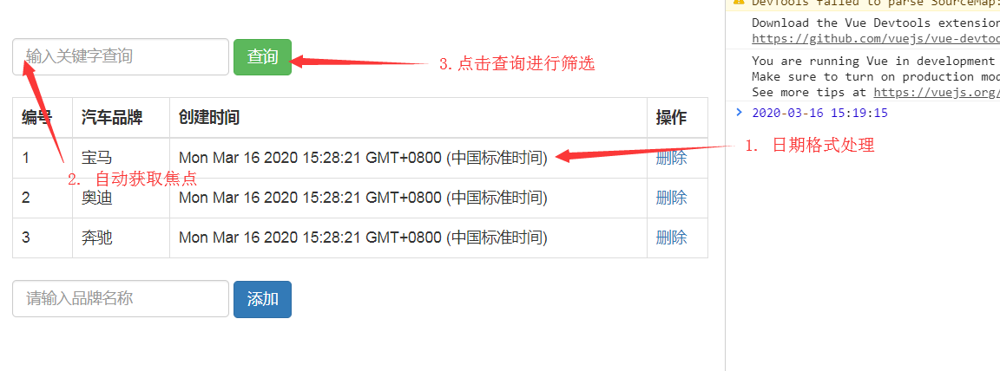

### 12-vue 定义过滤器

> 目标：知道如何定义过滤器和使用过滤器。

作用：在插值表达式获取 v-bind 绑定的属性中使用，转换数据格式。

定义过滤器：

- 全局过滤器（在任何视图度可以使用）

```js
// 1. 全局过滤器
// api 使用方法 Vue.filter('过滤器名称','过滤器处理函数')
Vue.filter("up", (value) => {
  // value 是你使用过滤器的时候传入的  原始数据
  // 对应 value 原始数据进行处理（格式转换）
  // 处理好了 需要返回 return 出去，返回的内容就是输出的结果
  return value.toUpperCase();
});
```

- 局部过滤器（在当前 vue 实例管理的视图才可以使用）

```diff
    const vm = new Vue({
+      // 2. 局部过滤器
+      filters: {
+        // key 就是过滤器名称，value就是处理函数
+        up (value) {
+          return value.toUpperCase()
+        }
+      },
      el: '#app',
      data: {
        msg: 'hi vuejs'
      }
    })
```

使用过滤器：

```html
<div id="app">
  <!-- 需求：输出的字符串是大写（对现有的数据格式不满意，要进行格式转换，使用过滤器） -->
  <!-- 使用过滤器, | 术语：管道符 -->
  {{msg|up}}
</div>
```

总结：

- `Vue.filter('过滤器名称','处理函数') `固定
- `filters:{'过滤器名称':'处理函数'}` 固定
- 处理函数 return 使用固定
- 过滤器的名字，过滤器处理逻辑，都不固定，根据需求来决定。

### 13-vue 操作 dom

> 目标：知道使用 ref 获取 dom 元素。

作用：在 vue 中去获取 dom 操作 dom。

疑问：在 vue 中极大的解放了 dom 操作，数据驱动视图，有一些极端情况确实需要操作。

方案：

- 在你需要获取的标签上加上**ref**属性
- 给 ref 属性加上属性值（最好唯一） 例子：`<div ref="myDom"></div>`
- 在 vue 的方法中，通过`this.$refs.myDom`即可获取到 dom 元素
- 总结：ref 属性是固定的，this.$refs 也是固定的，myDom 自己来决定。

```html
<div id="app">
  <div ref="myDom">我是一个元素</div>
  <span ref="span">我是一个span</span>
  <!-- 特殊情况 -->
  <ul>
    <li ref="li" v-for="i in 2">{{i}}</li>
  </ul>
  <button @click="fn">获取dom</button>
</div>
<script src="./vue.js"></script>
<script>
  const vm = new Vue({
    el: "#app",
    methods: {
      fn() {
        // this.$refs 是收集了视图中所有加了ref属性的dom元素
        // this.$refs = {myDom: 'dom元素',span: 'dom元素',li: ['li对象','li对象']}
        const dom = this.$refs.myDom;
        console.log(this.$refs);
        console.log(dom);
      },
    },
  });
</script>
```

### 14-vue 自定义指令

> 目标：知道如何定义自定义指令，使用自定义指令。

作用： 我们学过很多 vue 提供的指令，能够帮助我们实现很多功能，但是不能实现将来我们遇到的所有业务功能，所以 vue 给你提供了扩展 vue 指令的方式。（自己封装指令）

注册指令：

- 全局自定义指令

```js
// 1. 全局自定义指令
// 2. Vue.directive('指令的名称','指令的配置对象')  基本语法
// 3. 指令的名字在定义时候不需要加v-，在是用的时候才需要加v-
Vue.directive("focus", {
  //   // 4. 固定属性：inserted 在使用指令的元素渲染完毕后触发的函数
  inserted(el) {
    //     // 5. 这个函数执行了，代表元素渲染完毕，才可以操作元素。
    //     // 6. 最后根据你指令的需求，实现业务逻辑。el 是使用指令的dom元素
    //     // console.log(el)
    el.focus(); // dom提供的api用了获取焦点
  },
});
```

- 局部自定义指令

```diff
    const vm = new Vue({
      // 1. 局部自定义指令
      // 2. directives:{ key: value }
      // 3. key是 指令的名称 要求：定义时候不需要加v-，在是用的时候才需要加v-
      // 4. value是 指令的配置对象
+      directives: {
+        focus: {
+          // 5. 固定属性：inserted 在使用指令的元素渲染完毕后触发的函数
+          inserted (el) {
+            // 6. el 是使用指令的dom元素
+            // 7. 最后根据你指令的需求，实现业务逻辑
+            el.focus()
+          }
+        }
+      },
      el: '#app'
    })
```

使用指令：

```html
<!-- 指令：directive -->
<div id="app">
  <!--需求： v-focus 的指令，自动获取焦点 -->
  <input type="text" v-focus />
</div>
```

### 15-vue 的计算属性

> 目标：知道如何定义计算属性，已经计算属性和函数的区别。

使用场景：

- vue 不建议在模板中（视图中）使用过于复杂的 js 表达式，可读性差，不好维护。
- 使用**计算属性**，降低模板（视图中）的 js 表达式非复杂度。

如何定义：**计算属性**

```js
new Vue({
  el: "#app",
  data: {
    message: "hi vuejs",
  },
  // 计算属性写法,固定的
  computed: {
    // 写函数处理复杂逻辑
    reversedMessage() {
      // 反转逻辑，处理之后的结果，是一定要return出去
      return this.message.split("").reverse().join("");
    },
  },
});
```

如何使用：**计算属性**

```html
<div id="app">
  <!-- 在模板中直接使用计算属性配置对象中声明的函数名称即可（这个函数名称叫计算属性） -->
  {{reversedMessage}}
</div>
```

思考：

- 发现 computed 声明计算属性是函数，当做属性来用了。
- 为什么不能再 methods 中直接声明一个函数，在模板调用函数得到处理结果。

## VUE 基础-day03

`findIndex` 使用

```js
const list = [
  { id: 1, name: "tom" },
  { id: 2, name: "tony" },
];
const id = 2;
// 1   根据id去list中找到对应数据的索引
list.findIndex(function (item) {
  // 满足一下条件，返回当前item对应的索引
  return item.id === id;
});
// 2   使用箭头函数
list.findIndex((item) => {
  return item.id === id;
});
// 3   使用箭头函数：当函数只有返回数据的时候，没有其他逻辑，return也是可以省略的。
list.findIndex((item) => item.id === id);
```

v-bind 动态绑定 class 属性，怎么根据索引去删除某个类。

```html
<div id="app">
  <span :class="classArr"></span>
  <button @click="fn">删除red</button>
</div>
<script>
  const vm = new Vue({
    el: "#app",
    data: {
      classArr: ["bg", "red", "border"],
    },
    methods: {
      fn() {
        // 根据索引去删除类名
        const index = this.classArr.findIndex((item) => item === "red");
        this.classArr.splice(index, 1);
      },
    },
  });
</script>
```

vue 怎么操作 class

- `:class="{red:false}"`
- `:class="['red','bg']"`

vue 怎么操作 style

- `:style="{fontSize:'40px'}"`
- `:style="[{fontSize:'40px'}]"`

指令-v-model

- 语法糖：`:value="msg" @input="msg=$event.target.value"`
- 双向数据绑定

指令-v-cloak

- 解决插值表达式闪烁问题

指令-v-once

- 让元素只渲染一次

过滤器

- 全局：`Vue.filter('名称','处理函数')`
- 局部：`new Vue({ filters: { '名称':'处理函数' } })`

获取 dom

- 加 ref `<div ref="xxx"></div>`
- 获取 `this.$refs.xxx`

自定义指令

- 全局：`Vue.directive('指令名称':{inserted(el){ //完成指令功能 }})`
- 局部：`new Vue({ directives: { '指令名称':{inserted(el){ //完成指令功能 }} } })`

计算属性

- 当你使用 data 中的数据，需要在模板中通过复杂逻辑处理，才能得到理想的数据。
- 此时就应该使用计算属性来得到理想数据，从而降低模板内容的逻辑复杂度。
- 语法：`new Vue({ computed:{ '计算数据名称':function(){ //进行逻辑处理 return '理想数据' } }})`

### 03-computed 和 methods 区别

> 目的：了解 computed 和 methods 区别。

computed 和 methods 都可以达到：根据 data 当中的数据，进行一定的处理，得到我们想要的数据。

computed

- 当依赖的 data 数据发生变化的时候，处理函数才会重新执，得到新的结果。
- 如果在使用计算属性的时候，依赖的 data 没有变化，是不会重新执行的，拿的是之前缓存的结果。
  - 好处：性能更高

methods

- 只要调用了，就会重新执行。

```html
<div id="app">
  {{msg}}
  <hr />
  methods: {{resMsgFn()}} methods: {{resMsgFn()}} methods: {{resMsgFn()}}
  <hr />
  computed: {{resMsgCom}} computed: {{resMsgCom}} computed: {{resMsgCom}}
</div>
<script src="./vue.js"></script>
<script>
  const vm = new Vue({
    el: "#app",
    data: {
      msg: "hi vue",
    },
    computed: {
      // 得到反转字符串
      resMsgCom() {
        console.log("计算属性");
        return this.msg.split("").reverse().join("");
      },
    },
    methods: {
      // 得到反转字符串
      resMsgFn() {
        console.log("函数");
        return this.msg.split("").reverse().join("");
      },
    },
  });
</script>
```

**总结：**根据 data 当中的数据，进行一定的处理，得到我们想要的数据，建议使用`计算属性`

###04-案例-完善其他功能

> 目的：运用 过滤器，自定义指令，计算属性，ref 获取 dom，完善功能。

- 处理时间格式（过滤器）

```js
// 全局过滤器
Vue.filter("formatTime", (value) => {
  // value 是使用过滤器的时候，过道符前的js表达式结果
  // '2010/10/10' | format  此时的value就是 `2010/10/10`
  // 进行格式转换：`2010-10-10 00:00:00` 目标格式
  const date = new Date(value);
  // 获取 年 月 日 时 分 秒
  const y = date.getFullYear();
  const m1 = date.getMonth() + 1;
  const d = date.getDate();
  const h = date.getHours();
  const m2 = date.getMinutes();
  const s = date.getSeconds();
  // 进行拼接
  return `${y}-${m1 > 9 ? m1 : "0" + m1}-${d > 9 ? d : "0" + d} ${
    h > 9 ? h : "0" + h
  }:${m2 > 9 ? m2 : "0" + m2}:${s > 9 ? s : "0" + s}`;
});
```

```html
<td>{{item.createTime|formatTime}}</td>
```

- 自动获取焦点（自定义指令）

```js
// 自定义指令
Vue.directive("focus", {
  inserted(el) {
    // 元素创建（渲染）完毕
    // el是使用指令的当前元素
    el.focus();
  },
});
```

```html
<input
  v-focus
  type="text"
  class="form-control"
  style="width:200px;display: inline-block;"
  placeholder="输入关键字查询"
/>
```

- 根据关键字筛选（计算属性）

思路：根据 搜索框 中的关键字，去列表数据中查找符合条件的数据，组织成一个新的数组，进行渲染即可。

- 搜索框 双向数据绑定
- 列表其实就是 data 中的 list 数据。
- 话术：我们现在根据 data 中的 keyword 和 list，经过筛选得到一个新的数组，使用计算属性。
- 最后渲染新的数组，而不是之前的 list

定义搜索关键字数据：`data`

```js
// 搜索关键字
keyword: "";
```

定义计算属性得到筛选后的数组：

```js
      computed: {
        // 筛选后的结果
        newList () {
          // 根据 keyword 的值，挨个去list中的数据，进行匹配（只要brandName包含keyword）就满足
          const arr = []
          this.list.forEach(item => {
            // 如果满足条件,追加到新数组
            // 如果 this.keyword 值为 '' 那么将会查询到所有的数据
            if (item.brandName.includes(this.keyword)) {
              arr.push(item)
            }
          });
          return arr
        }
      },
```

绑定 筛选 按钮事件：

```html
<button class="btn btn-success" @click="search()">查询</button>
```

定义事件对应的函数：`mothods`

```js
        // 查询
        search () {
          // 获取搜索input的值赋值给keyword即可
          this.keyword = this.$refs.search.value
        },
```

### 05-工具-json-server

> 目的：模拟后台接口。

问题：前端需要依赖后台接口才能获取数据，但是我们前端开发的时候，后台一定写好了接口吗？

模拟：使用 json-server 这个基于 nodejs 的命令行工具，模拟后台接口，让前端可以继续进行开发。

安装：

```bash
npm i json-server -g
```

使用：准备一个 json 文件即可，启动 json-server 服务，根据 json 文件自动生成接口。

- `db.json` 准备文件，打算放进文件夹 `server`
- 书写 `db.json` 的内容，必须满足 json 格式，必须是一个 json 对象

```json
{
  "brands": [
    { "id": 1, "brandName": "宝马", "createTime": "2010-10-10 10:10:10" }
  ]
}
```

- 启动：来到 `server` 文件夹执行命令 `json-server db.json`
- 如果 json-server 服务启动了，我们通过 http://localhost:3000/brands 访问数组数据。

###06-规则-RESTful

> 目的：了解接口规则。

我们使用 json-server 启动的接口符合 restful 接口定义的规则。

| 路径      | 请求方式 | 具体对应操作                    |
| --------- | -------- | ------------------------------- |
| /brands   | GET      | 获取品牌数组数据                |
| /brands/1 | GET      | 获取当前品牌数据                |
| /brands   | POST     | 添加品牌（请求体传参）          |
| /brands/1 | DELETE   | 删除品牌                        |
| /brands/1 | PUT      | 修改品牌（请求体传参） 完整修改 |
| /brands/1 | PATCH    | 修改品牌（请求体传参） 局部修改 |

使用接口按照以上规则进行使用即可。

### 07-工具-postman

> 目的：测试后台接口。

POST

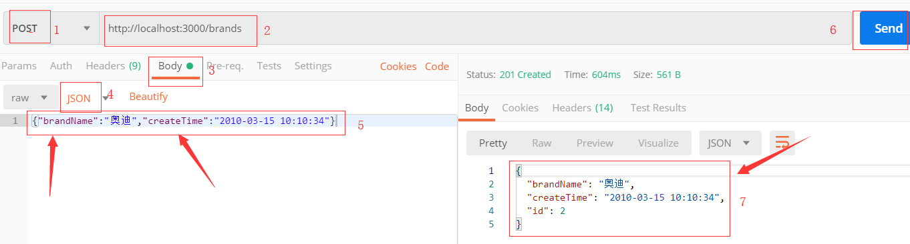

DELETE

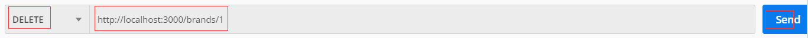

PUT

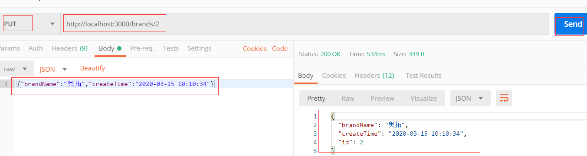

PATCH

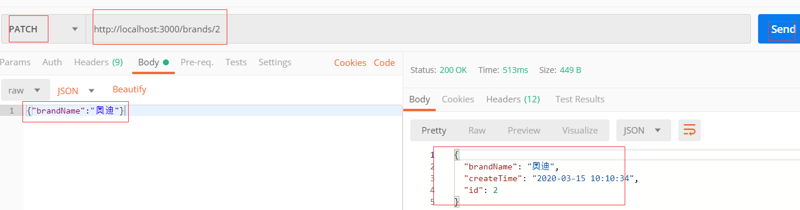

模糊查询

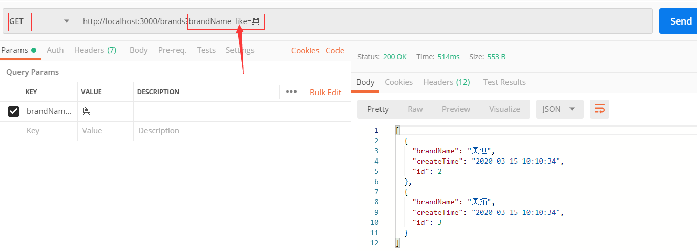

总结：通过工具测试接口，知道调用接口的流程，将来我们落地到代码上面。

### 08-插件-axios.js

> 目的：调用后台接口。

axios 是一个 js 插件，它可以在 nodejs 中使用，也可在前端浏览器中使用，它是基于**XMLHttpRequest**对象和**Promise**对象封装的，发送 ajax 请求的插件。

get 请求

```js
// get请求  补充：如果有get传参
// 1. 笨方法：地址?key=value&key1=value1
// 2. 便利方法：get()的第二个参数传入一个对象 {params:{参数对象}}
axios
  .get("http://localhost:3000/brands", {
    params: {
      brandName_like: "奥",
    },
  })
  .then((res) => {
    // res 是响应对象（响应主体，响应状态行,响应头）
    // res.data 是响应主体（后端返回数据在响应主体中）
    console.log(res.data);
  });
```

post 请求

```js
// post请求
// 1. post是请求体传参 post()的第二个参数
axios
  .post("http://localhost:3000/brands", {
    brandName: "宝马",
    createTime: new Date(),
  })
  .then((res) => {
    // 成功
    console.log(res.data);
  })
  .catch((err) => {
    // 失败
    // err.message 错误信息
    console.log(`错误原因：${err.message}`);
  });
```

delete 请求

```js
// delete请求
axios
  .delete("http://localhost:3000/brands/4")
  .then((res) => {
    console.log("删除成功");
  })
  .catch((err) => {
    console.log("删除失败");
  });
```

put 请求

```js
// put请求  是请求体传参 put()的第二个参数
axios
  .put("http://localhost:3000/brands/3", {
    brandName: "宝马",
    createTime: new Date(),
  })
  .then((res) => {
    console.log("修改成功");
  })
  .catch((err) => {
    console.log("修改失败");
  });
```

patch 请求

```js
// patch请求  是请求体传参 patch()的第二个参数
axios
  .patch("http://localhost:3000/brands/3", {
    brandName: "宝马3系",
  })
  .then((res) => {
    console.log("修改成功");
  })
  .catch((err) => {
    console.log("修改失败");
  });
```

综合写法：

```js
// 综合写法
axios({
  // 请求方式  get|post|put|patch|delete
  method: "get",
  // 地址
  url: "http://localhost:3000/brands",

  // 如果是get请求 在params传参
  params: {
    brandName_like: "3",
  },

  // 出去get外，都是请求体传参
  // data: {
  //   brandName: '宝马',
  //   createTime: new Date()
  // }

  // 请求头传参
  // headers: {
  //   'Content-Type': 'application/json'
  // }
})
  .then((res) => {
    console.log(res.data); // 响应主体（后台数据）
  })
  .catch((err) => {
    console.log("请求失败");
  });
```

### 09-案例-接口版-渲染列表

> 目的：通过 axios 进行拉取数据操作

```html
<!DOCTYPE html>
<html lang="en">
  <head>
    <meta charset="UTF-8" />
    <meta name="viewport" content="width=device-width, initial-scale=1.0" />
    <title>Document</title>
    <link rel="stylesheet" href="./bootstrap.min.css" />
    <style>
      .container {
        margin-top: 100px;
      }
    </style>
  </head>

  <body>
    <div id="app">
      <div class="container">
        <!-- 筛选区域 -->
        <div style="margin-bottom:20px">
          <input
            type="text"
            class="form-control"
            style="width:200px;display: inline-block;"
            placeholder="输入关键字查询"
          />
        </div>
        <table class="table table-bordered">
          <thead>
            <tr>
              <th>编号</th>
              <th>汽车品牌</th>
              <th>创建时间</th>
              <th>操作</th>
            </tr>
          </thead>
          <tbody>
            <tr v-for="item in list" :key="item.id">
              <td>{{item.id}}</td>
              <td>{{item.brandName}}</td>
              <td>{{item.createTime}}</td>
              <td><a href="#">删除</a></td>
            </tr>
            <tr v-if="list.length===0">
              <td colspan="4">暂无数据</td>
            </tr>
          </tbody>
        </table>
        <!-- 添加品牌 -->
        <div style="margin-top:20px">
          <input
            type="text"
            class="form-control"
            style="width:200px;display: inline-block;"
            placeholder="请输入品牌名称"
          />
          <button class="btn btn-primary">添加</button>
        </div>
      </div>
    </div>
    <script src="./vue.js"></script>
    <script src="./axios.min.js"></script>
    <script>
      // 1. 渲染品牌列表
      // 2. 上传品牌
      // 3. 添加品牌
      // 4. 搜索品牌

      const vm = new Vue({
        el: "#app",
        data: {
          // 品牌列表
          list: [],
        },
        // 配置选项  created 它是一个函数
        // 当vue对象实例化完成的时候回执行created
        created() {
          // 获取品牌列表数据
          this.getBrands();
        },
        methods: {
          // 获取品牌列表数据
          getBrands() {
            // 通过axios调用接口
            axios
              .get("http://localhost:3000/brands")
              .then((res) => {
                // 获取数据成功
                // 赋值data中list （模板视图可以使用）
                this.list = res.data;
              })
              .catch((err) => {
                console.log("网络繁忙");
              });
          },
        },
      });
    </script>
  </body>
</html>
```

### 10-案例-接口版-删除品牌

> 目的：通过 axios 进行删除数据操作

绑定事件：

```html
<td><a href="#" @click.prevent="delBrand(item.id)">删除</a></td>
```

处理函数：

```js
        // 删除品牌
        delBrand (id) {
          // 1. 发送删除请求
          // 2. 如果成功：更新列表
          // 3. 如果失败：删除失败
          if (confirm('您确认删除吗？')) {
            axios.delete(`http://localhost:3000/brands/${id}`).then(res=>{
              // 更新列表
              this.getBrands()
            }).catch(err=>{
              console.log('删除失败')
            })
          }
        }
```

### 11-案例-接口版-添加品牌

> 目的：通过 axios 进行添加数据操作

绑定事件

```html
<button class="btn btn-primary" @click="addBrand()">添加</button>
```

绑定输入框

```html
<input
  v-model="brandName"
  type="text"
  class="form-control"
  style="width:200px;display: inline-block;"
  placeholder="请输入品牌名称"
/>
```

```diff
      data: {
        // 品牌列表
        list: [],
+        // 品牌名称
+        brandName: ''
      },
```

处理函数

```js
        // 添加品牌
        addBrand () {
          // this.brandName 获取输入的内容
          if (!this.brandName.trim()) {
            return alert('请输入品牌名称')
          }
          // 发起添加品牌请求
          axios.post('http://localhost:3000/brands',{
            brandName: this.brandName,
            createTime: new Date()
          }).then(res=>{
            // 添加成功
            // 1. 更新列表
            this.getBrands()
            // 2. 清空内容
            this.brandName = ''
          }).catch(res=>{
            console.log('添加失败')
          })
        }
```

### 12-案例-接口版-搜索品牌

> 目的：掌握 vue 侦听器功能。

侦听器：在需要监听某项数据的变化然后去，做**异步操作**或开销较大操作（逻辑非常复杂）。

- 补充：凡是以后需要监听数据的变化而去做一些事情，就可以使用侦听器。

语法：

```js
new Vue({
  data: {
    msg: "hi vuejs",
  },
  // 侦听器
  watch: {
    // key 是就是你想监听数据的 字段名称
    // value 是函数，当数据变化的时候执行该函数
    msg: function (newMsg, oldMsg) {
      // newMsg 改变后的值
      // oldMsg 改变前的值
      // 做你自己的业务逻辑（官方建议：异步|复杂操作）
    },
  },
});
```

功能具体实现：

- 绑定数据

```html
<input
  v-model="keyword"
  type="text"
  class="form-control"
  style="width:200px;display: inline-block;"
  placeholder="输入关键字查询"
/>
```

- 数据

```diff
      data: {
        // 品牌列表
        list: [],
        // 品牌名称
        brandName: '',
+        // 搜索关键字
+        keyword: ''
      },
```

- 查询，需要带上搜索关键字

```diff
        // 获取品牌列表数据
        getBrands() {
          // 通过axios调用接口
+          axios.get('http://localhost:3000/brands',{
+            params: {
+              brandName_like: this.keyword
+            }
+          }).then(res => {
            // 获取数据成功
            // 赋值data中list （模板视图可以使用）
            this.list = res.data
          }).catch(err => {
            console.log('网络繁忙')
          })
        },
```

- 监听。关键字变化

```js
      watch: {
        keyword () {
          // 当keyword发生变化函数执行
          this.getBrands()
        }
      },
```

## VUE 基础-day04

- computed 和 methods 的区别

  - 计算属性，是会做缓存的，提高获取数据的性能。

- json-server

  - 模拟后台接口的工具，提供了符合 restful 规则的接口。
  - post 添加 get 查询 delete 删除 put 完整修改 patch 局部修改

- postman 测试接口

- axios 使用

  - 五个函数（post() get() delete() put() patch()）
  - 综合函数 axios({配置对象})
  - 注意：**传参**
    - get 传参(url?后键值对传参)
      - `/user?id=100` `axios.get(url,{params:参数对象})` `axios({params:参数对象})`
    - 除去 get 其他请求传参(请求体传参)
      - `axios.post(url,参数对象)` `axios({data:参数对象})`
    - 请求头传参
      - `axios({headers:参数对象})`
    - 路劲传参
      - `/user/100`

- 完成 网络版 案例

  - created(){} 是 vue 提供的回调函数（当 vue 实例初始化完毕）
  - watch:{} 是 vue 的提供配置选项，监听某些数据的变化。

  ```js
  new Vue({
    data: {
      count: 100,
    },
    watch: {
      count(newVal, oldVal) {
        // 当count发送变化，执行这个函数
      },
    },
  });
  ```

### 03-★ 组件-概念

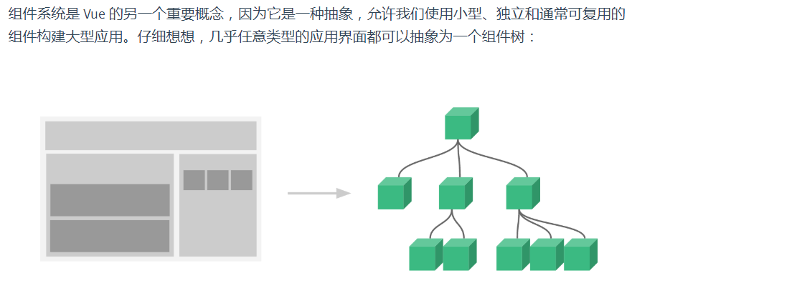

组件：其实就是对网页功能的封装（对界面封装 html+css+js）。

本质：其实也是一个 vue 实例，组件这个实例不支持 el 选项，其他选项都支持

- data methods created filters directives computed watch 。。。
- 组件是使用 template 选项，去指定当前组件实例管理的模板（视图）

特点：

- 组件可复用
- 拆分界面功能（组件是相互独立）提高可维护性。

体验：

- 没有使用组件

```html
<div id="app">
  <!-- 我们界面上，其实有三个同样的业务功能 -->
  <!-- 点击按钮，让数字自增 -->
  <div>{{count}} <button @click="fn">自增+1</button></div>
  <div>{{count1}} <button @click="fn1">自增+1</button></div>
  <div>{{count2}} <button @click="fn2">自增+1</button></div>
</div>
<script src="./vue.js"></script>
<script>
  new Vue({
    el: "#app",
    data: {
      count: 0,
      count1: 0,
      count2: 0,
    },
    methods: {
      fn() {
        this.count++;
      },
      fn1() {
        this.count1++;
      },
      fn2() {
        this.count2++;
      },
    },
  });
</script>
```

- 使用组件优化

```html
<div id="app">
  <count-add></count-add>
  <count-add></count-add>
  <count-add></count-add>
</div>
<script src="./vue.js"></script>
<script>
  // 使用组件
  Vue.component("count-add", {
    template: `<div>{{count}} <button @click="fn">自增+1</button></div>`,
    data() {
      return {
        count: 0,
      };
    },
    methods: {
      fn() {
        this.count++;
      },
    },
  });
  // 根实例
  new Vue({
    el: "#app",
  });
</script>
```

### 04-★ 组件-全局注册

`Vue.component()` 注册方法

- 传参 1：组件的名称
- 参数 2：组件配置对象（和 new Vue({})中{}的配置对象一致，没有 el 选项）
  - 配置对象必须包含 template 选项，写模板内容（视图结构），约定：**必须只有一个根元素**。
  - **组件中 data 选项必须是函数**，函数必须返回一个对象，对象就是声明数据的位置。

```html
<div id="app">
  <com-a></com-a>
</div>
<script src="./vue.js"></script>
<script>
  // 全局组件 component
  Vue.component("com-a", {
    // 一定需要template选项，选项的值必须是html结构，必须只有一个根元素
    template: `<div>组件A {{msg}}</div>`,
    // 必须是函数，返回对象，对象中就是组件数据
    data() {
      return {
        msg: "A组件信息",
      };
    },
  });

  // 根实例
  new Vue({
    el: "#app",
  });
</script>
```

### 05-★ 组件-局部注册

`new Vue({ components:{} })` 局部注册

- 键：组件名称
- 值：组件配置对象，组件配置对象（和 new Vue({})中{}的配置对象一致，没有 el 选项）
  - 配置对象必须包含 template 选项，写模板内容（视图结构），约定：**必须只有一个根元素**。
  - **组件中 data 选项必须是函数**，函数必须返回一个对象，对象就是声明数据的位置。

```html
<div id="app">
  <com-b></com-b>
</div>
<script src="./vue.js"></script>
<script>
  // 组件B配置对象
  const ComB = {
    template: `<div>组件B {{msg}}</div>`,
    data() {
      return {
        msg: "B组件信息",
      };
    },
  };
  // 根实例
  new Vue({
    el: "#app",
    components: {
      // key 就是组件名称
      // value 就是组件配置对象
      "com-b": ComB,
    },
  });
</script>
```

### 06-★ 组件-命名规则

组件的命名规则，说白了，就是这么给组件取名字，在模板中怎么使用组件，的一些约定。

- 以横线分隔写法 `count-add` `com-a` `com-b`

```html
<div id="app">
  <!-- 使用组件 -->
  <count-add></count-add>
</div>
<script>
  Vue.component("count-add", 组件配置对象);
  new Vue({
    el: "#app",
  });
</script>
```

- 单词首字母大写写法 `CountAdd` `ComA` `ComB`

```js
// 父组件
Vue.component("com-parent", {
  template: `
     <div class="parent"> 
        父组件 
        <com-child></com-child>
        <ComChild></ComChild>
    </div>`,
});

// 子组件
Vue.component("ComChild", {
  template: `<div class="child"> 子组件 </div>`,
});
```

补充：

- 以后我们有单文件组件，以上的规则在单文件组件使用的时候，肯定 OK。
  - **单文件组件**，写组件结构的时候，都是模板字符串。
- 在 DOM 中使用时看不到效果的会报错，在组件的 template 中两种写法都生效。

### 07-★ 组件-组件嵌套

```html
<div id="app">
  <com-parent></com-parent>
</div>
<script src="./vue.js"></script>
<script>
  // 父组件
  Vue.component("com-parent", {
    template: `<div class="parent"> 父组件 <com-child></com-child></div>`,
  });

  // 子组件
  Vue.component("com-child", {
    template: `<div class="child"> 子组件 </div>`,
  });

  // 根实例
  new Vue({
    el: "#app",
  });
</script>
```

###08-★ 组件-组件传值

组件与组件之间数据，是相互独立的，当然有需要组件与组件之间进行数据通信的情况。

- 传递数据的方式和组件与组件之前的关系有关。
  - 父组件 传值 子组件
  - 子组件 传值 父组件
  - 非父子关系，组件传值

父传子 `props`

```html
<div id="app">
  <com-parent></com-parent>
</div>
<script src="./vue.js"></script>
<script>
  // 父组件
  Vue.component("com-parent", {
    template: `
      <div class="parent"> 
          父组件 {{msg}}
          <com-child :abc="msg"></com-child>
      </div>`,
    //1. :abc="msg" 在子组件上绑定一个自定义属性abc，这个属性的值是父组件msg的数据
    data() {
      return {
        msg: "PARENT DATA",
      };
    },
  });

  // 子组件
  Vue.component("ComChild", {
    // 2. 选项props的作用，是接收父组件的传值，接收子组件绑定的自定义属性。
    // ['abc'] 接收abc属性的值，在当前vue实例上就拥有一个abc数据 `this.abc` 访问数据
    props: ["abc"],
    template: `<div class="child"> 子组件 {{abc}}</div>`,
  });

  // 根实例
  new Vue({
    el: "#app",
  });
</script>
```

子传父 `$emit()`

```html
<div id="app">
  <com-parent></com-parent>
</div>
<script src="./vue.js"></script>
<script>
  // 父组件
  Vue.component("com-parent", {
    template: `
      <div class="parent"> 
          父组件 {{str}}
          <com-child @child-to-parent="handleFn"></com-child>
      </div>`,
    //  @child-to-parent="handleFn" || @child-to-parent="handleFn(event)"
    // 1. 给子组件绑定自定义事件 事件的名字：child-to-parent
    // 2. handleFn 触发事件的处理函数，如果是自定义事件 $event 代表是触发事件时候传参
    data() {
      return {
        str: "",
      };
    },
    methods: {
      handleFn(msg) {
        // 如果可以打印：子传父实现
        // console.log(msg)
        this.str = msg;
      },
    },
  });

  // 子组件
  Vue.component("ComChild", {
    template: `<div class="child"> 子组件 <button @click="fn">子传父</button></div>`,
    data() {
      return {
        msg: "CHILD DATA",
      };
    },
    methods: {
      fn() {
        // 子组件的msg数据  传递给父组件
        // 1. $emit 是vue实例提供的api函数
        // 2. 函数的作用：触发当前组件的自定义事件
        // 3. 参数1：自定义事件的名称
        // 4. 参数2：触发自定义事件的默认传参
        this.$emit("child-to-parent", this.msg);
      },
    },
  });

  // 根实例
  new Vue({
    el: "#app",
  });
</script>
```

### 上午内容-总结

- `$emit()` 这个方法啥时候调用？
  - 模拟一个场景（点击按钮传值给父组件），才绑定了点击事件。
  - 当你需要给父组件传递数据的时候，你来调用 `$emit()` 即可。
- `$emit()` 触发事件：传递数据，绑定自定义事件：接受数据
  - 谁绑定的事件，谁才能去触发。`<com-child @child-to-parent=""></com-child>`
  - 所以：在子组件通过 this.$emit('child-to-parent')
- 在子组件取使用父组件传递的数据，模板中没有使用 this。
  - props:['abc'] 接收到的数据，和你在 data 当中声明的数据，使用上是一样的。
  - 注意：**props 接收数据，只读。（只可以访问，不能修改）**
- 教训：
  - 命名规则（如果是大写字母开头单词进行的命名，有两种写法，在 模板字符 下生效）

### 09-SPA-特点介绍

> spa 是 single page application 简写，意思是单页面应用程序。vue 适合开发 spa 类型的项目。

概念：一个页面上，开发一个网站需要的所有功能。

问题：如果所有的功能在一个页面上开发，业务逻辑非常复杂，代码不好维护，我们需要开展很多个业务场景。

例子： https://music.163.com/ 可以去体验一下 单页应用程序。

优点：

- 业务场景的切换，性能很好。
- 集中维护一个网站的功能。
- 完全的前后端分离（前后端可以并行开发，提供系统开发效率）

缺点：

- 所有的功能集中的一个页面，依赖的资源是非常多的，加载第一次的时候很慢。
- 业务复杂度很高（解决方案：vue 组件，前端路由）

###10-SPA-前端路由

前端路由：

- 根据不同的 url 地址，页面上展示不同的内容。

- 根据**url**地址的不同分发到不同的**组件**。

矛盾的点：

- 我们做一个单页面应用，不会跳转。
- 但是 根据 URL 地址的不同，切换页面显示的内容。
- 地址的更改，不一定会跳转。
  - 地址栏**hash 值**得改变，是不会发生跳转的，和单页应用就不矛盾了。

```js
// https://music.163.com/#/my/
const hash = location.hash;
// 地址栏上  #和#后的路径  统称为hash字符串
```

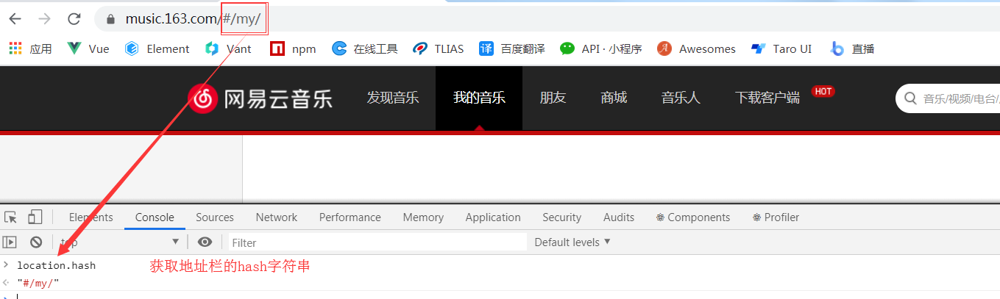

什么是前端路由：

- 通过地址栏 hash 字符串的改变，去更新页面的内容。

基于 hash 的前端路由的原理：

```html
<!-- 菜单 -->
<div>
  <a href="#/">发现音乐</a>
  <a href="#/my">我的音乐</a>
  <a href="#/friend">朋友</a>
</div>
<div id="content">
  <!-- 内容 -->
</div>
<!-- 前端路由：根据hash值得改变，去更新页面内容。-->
<!-- 
    1. 监听hash值得改变
      - window.onhashchange = function() { console.log('ok') } 
    2. 改变后渲染对应内容
      - 获取hash  location.hash  然后去判断  渲染不同内容
   -->
<script>
  // 内容容器
  const content = document.querySelector("#content");
  // 监听hash改变
  window.onhashchange = function () {
    // 改变后的hash
    const hash = location.hash;
    // path 值可能是：/   /my   /friend
    const path = hash.replace("#", "");
    // 判断路径
    switch (path) {
      case "/":
        content.innerHTML = "发现音乐的网页内容";
        break;
      case "/my":
        content.innerHTML = "我的音乐的网页内容";
        break;
      case "/friend":
        content.innerHTML = "朋友F的网页内容";
        break;
      default:
        break;
    }
  };
</script>
```

### 11-★vue-router-使用步骤

vue-router 是基于 vue 的 js 插件，实现了前端路由功能。

文档： https://router.vuejs.org/zh/

下载：https://unpkg.com/vue-router/dist/vue-router.js

使用：

- 准备组件配置对象
- 定义路由规则（什么路径对应什么组件）
- 初始化 vue-router 实例
- 需要把路由实例挂载到 vue 中
- 路由跳转链接 `<router-link />`
- 路由显示组件的位置 `<router-view />`

代码：

```html
<div id="app">
  <!-- 菜单 -->
  <div>
    <!-- 5. 路由连接组件 -->
    <router-link to="/">发现音乐</router-link>
    <router-link to="/my">我的音乐</router-link>
    <router-link to="/friend">朋友</router-link>
  </div>
  <div>
    <!-- 内容 -->
    <!-- 6. 显示当前路由规则对应的组件 -->
    <router-view></router-view>
  </div>
</div>

<script src="./vue.js"></script>
<script src="./vue-router.js"></script>
<script>
  // 1. 准备组件配置对象
  const Home = { template: `<div>发现音乐COMPONENT</div>` };
  const My = { template: `<div>我的音乐COMPONENT</div>` };
  const Friend = { template: `<div>朋友COMPONENT</div>` };
  // 2. 定义路由规则（vue-router提供）
  const routes = [
    // path 是路径  component 对应的组件配置对象
    { path: "/", component: Home },
    { path: "/my", component: My },
    { path: "/friend", component: Friend },
  ];
  // 3. 路由初始化
  // const router = new VueRouter({
  //   // 传入路由规则
  //   routes: routes
  // })
  const router = new VueRouter({ routes });

  // 根实例
  new Vue({
    el: "#app",
    // 4. 在vue的根实例下进行 路由实例 挂载
    router,
  });
</script>
```

###12-★vue-router-动态路由

动态路由：不同的 URL 地址，映射到同一个组件。

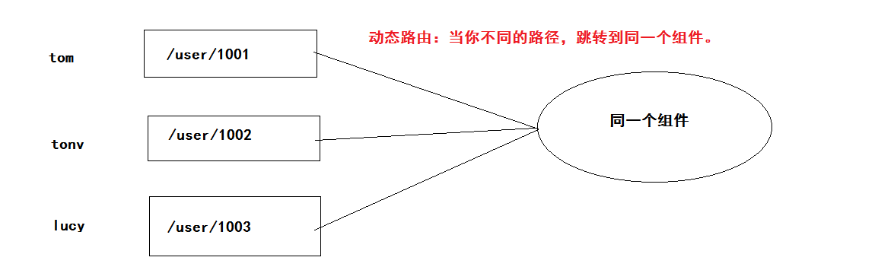

代码实现：

```html
<div id="app">
  <router-view></router-view>
</div>
<script src="./vue.js"></script>
<script src="./vue-router.js"></script>
<script>
  // 用户列表组件配置对象
  const UserList = {
    template: `
        <ul>
          <li><router-link to="/user/1001">tom</router-link></li>
          <li><router-link to="/user/1002">tony</router-link></li>
          <li><router-link to="/user/1003">lucy</router-link></li>
        </ul>
      `,
  };
  // 用户详情组件配置对象
  const UserDetail = {
    template: `<div> 用户详情组件 用户的ID是：{{$route.params.id}}</div>`,
    // 模板获取路径传参：$route.params.id
    // 组件的函数中获取：this.$route.params.id
  };
  const routes = [
    // (页面初始化的时候 跳转/ )默认根路径 / 显示用户列表组件
    { path: "/", component: UserList },
    // 动态路由
    { path: "/user/:id", component: UserDetail },
  ];
  const router = new VueRouter({ routes });
  // 根实例
  new Vue({
    el: "#app",
    router,
  });
</script>
```

总结：

- 规则 ` { path: '/user/:id', component: UserDetail }`
- 获取路径传参：`{{$route.params.id}}`

###13-★vue-router-(to 属性)

使用路由的时候，路由跳转的时候如何去进行传参？两种：

- 路径传参 `/user/1001` 就是路径传参
- 键值对传参 `/user?id=10001` 就是键值对传参

```html
<div id="app">
  <!-- to 使用字符串 to属性的值就是路径 -->
  <router-link to="/user">地址1</router-link>

  <!-- to 键值对传参 字符串-->
  <router-link to="/user?id=1001&name=tom">地址2</router-link>
  <!-- to 键值对传参 对象方式-->
  <router-link :to="{path:'/user', query:{id:1001,name:'tom'}}"
    >地址3</router-link
  >

  <hr />
  <!-- to 路径传参 字符串-->
  <router-link to="/user/1001">地址4</router-link>
  <!-- to 路径传参 对象方式-->
  <router-link :to="{name: 'user', params:{id:1003}}">地址5</router-link>

  <router-view></router-view>
</div>
<script src="./vue.js"></script>
<script src="./vue-router.js"></script>
<script>
  // 路由规则
  const routes = [
    // name 路由规则的名称
    {
      path: "/user/:id",
      name: "user",
      component: { template: `<div> 动态路由 {{$route.params.id}}</div>` },
    },
  ];
  // 实例化vue-router
  const router = new VueRouter({ routes });

  new Vue({
    el: "#app",
    // 挂载
    router,
  });
</script>
```

总结：

- 重点掌握，键值对传参对象形式

```html
{path:'/user', query:{id:1001,name:'tom'}}
```

- 重点掌握，路径传参对象形式

```js
{name: 'user', params:{id:1003}}
```

## VUE 基础-day05

```js
// location 操作地址栏相关信息
// hash 特点：当你改变hash的时候，是不会发生页面跳转，不会发请求。
// 但是  hash   的改变，是会记录到浏览器的浏览历史当中。（可以前进和后退）
// 在单页面应用程序中，充当路由功能（当地址栏发生变化，页面对应的进行更新）
{
  hash: "#/publish?id=1240581363032129536";
}
{
  hash: "#/publish/1240581363032129536";
}
// 传参： ?后键值对字符串  query    /路径有的拼接字符串  params
```

组件传值：子传父

- 自定义事件：非原生事件，就是自定义事件。

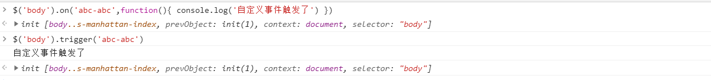

- 在 vue 中怎么绑定自定义事件，如果触发自定义事件。

```html
<com-a @abc="触发事件处理函数($event)"> </com-a>
```

```js
// com-a 的组件中  this 指的就是组件实例
this.$emit("abc", "触发事件传递数据");
```

- 子传父

父组件：

```js
Vue.component('com-a',{
	template: `<div>父组件 <com-b @abc="fn($event)"></com-b></div>`
  methods: {
  	fn (data) {
  		// 当子组件触发 abc 事件的时候，fn被调用
  		// 使用 子组件的  数据
		}
	}
})
```

子组件：

```js
Vue.component("com-b", {
  template: `<div>子组件 <span @click="fn">子传父</span></div>`,
  methods: {
    fn() {
      this.$emit("abc", "子组件数据");
    },
  },
});
```

### 03-★vue-router-重定向

> 大白话：访问某一个路由，自动跳转到另外一个路径。

```html
<div id="app">
  <!-- 打开页面：默认访问的路由地址 `/` -->
  <!-- 我们的 '/home' 才是首页路由的路径 -->
  <!-- 当默认打开页面的时候 重定向到 首页 -->
  <router-view></router-view>
</div>
<script src="./vue.js"></script>
<script src="./vue-router.js"></script>
<script>
  const router = new VueRouter({
    // 指定路由规则
    routes: [
      // redirect 重定向的路由地址
      { path: "/", redirect: "/home" },
      {
        path: "/home",
        component: {
          template: `<h1>首页</h1>`,
        },
      },
    ],
  });

  new Vue({
    el: "#app",
    router,
  });
</script>
```

总结：`{ path: '/', redirect: '/home' }`

### 04-★vue-router-编程式导航

以前：

- 跳转 `<a href="http://baidu.com">百度</a>`
- 跳转 `<button>百度</button>` 通 js 实现 `location.href="http://baidu.com"`

路由：

- 跳转 `<router-link to="/user">用户</router-link>`
- 跳转 `<button>百度</button>` 通 js 实现 `this.$router.push('/user')`

编程式导航：通过 js 的方式触发路由的跳转。

```html
<div id="app">
  <button @click="fn">用户</button>
  <router-view></router-view>
</div>
<script src="./vue.js"></script>
<script src="./vue-router.js"></script>
<script>
  const router = new VueRouter({
    // 指定路由规则
    routes: [
      {
        path: "/user",
        component: {
          template: `<h1>用户页面</h1>`,
        },
      },
    ],
  });

  new Vue({
    el: "#app",
    router,
    methods: {
      fn() {
        // 编程式导航
        this.$router.push("/user");
      },
    },
  });
</script>
```

总结：

- `$route` 获取路由相关信息（路由传参 this.$route.params）
- `$router` 提供路由相关函数 ( 跳转方法 this.$router.push() )

###05-★vue-router-路由嵌套

```html
<div id="app">
  <div class="nav">
    <router-link to="/">发现音乐</router-link>
    <router-link to="/my">我的音乐</router-link>
    <router-link to="/friend">朋友</router-link>
  </div>
  <!-- 显示一级路由对应组件位置 -->
  <router-view></router-view>
</div>
<script src="./vue.js"></script>
<script src="./vue-router.js"></script>
<script>
  // 一级路由组件
  const Home = {
    template: `<div>
        <router-link to="/tj">推荐</router-link>
        <router-link to="/bd">榜单</router-link>
        <router-link to="/dj">DJ</router-link>
        <!-- 显示二级路由对应组件位置 -->
        <router-view></router-view>
      </div>`,
  };
  const My = { template: "<div> 我的音乐Content </div>" };
  const Friend = { template: "<div> 发朋友Content </div>" };

  // 二级路由组件
  const Tj = { template: "<div> 推荐LIST </div>" };
  const Bd = { template: "<div> 榜单LIST </div>" };
  const Dj = { template: "<div> DJ-LIST </div>" };

  const routes = [
    {
      path: "/",
      component: Home,
      children: [
        { path: "/tj", component: Tj },
        { path: "/bd", component: Bd },
        { path: "/dj", component: Dj },
      ],
    },
    { path: "/my", component: My },
    { path: "/friend", component: Friend },
  ];

  const router = new VueRouter({ routes });

  new Vue({
    el: "#app",
    router,
  });
</script>
```

总结：要进行路由的嵌套，只需要在一级路由规则下，加上一个属性 children，即可定义二级路由规则。

###06-vue-cli-介绍

> 我们在构建项目的时候，都有自己的构建习惯。如果是这种情况去开发项目，项目的架构非常难看懂。
>
> 最好：统一项目的架构风格。
>
> 我们在开发项目的过程中，可能或依赖一些工具去进行开发，而且很多工具是大家都会去使用的。
>
> 最好：创建项目的时候需要的工具依赖就能配置好。

当我们如果统一了上面两点，在这个基础之上来进行开发，将会效率提高很多。

vue-cli 提供了我们需要的以上功能，含义：开发 vue 项目的**脚手架**


Vue CLI 致力于将 Vue 生态中的工具基础标准化。它确保了各种构建工具能够基于智能的默认配置即可平稳衔接，这样你可以专注在撰写应用上，**而不必花好几天去纠结配置的问题**。

###07-vue-cli-安装

> 这个 vue-cli 是一个命令行工具，所以首先需要全局安装，然后才可以使用这个工具创建项目基础结构。

安装命令：

```bash
npm install -g @vue/cli
```

另外：`yarn global add @vue/cli` 熟悉 yarn 工具可选择这种方式。

检查命令：

```bash
vue --version
```

测试：看到版本号，代表安装成功。

另外补充：

- 可能会遇见安装失败，原因：90%以上是网络问题。
  - 清除缓存 `npm cache clean --force`
  - 切换网络 `手机热点`
  - 再次安装 `npm install -g @vue/cli`
- 大家支持 vue 相关的命令的时候报错

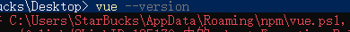

- vue.ps1 错误，删除这个地址都有的文件即可。

另外建议：

- 不建议使用淘宝镜像，可能有滞后性。意思安装某些包可能会失败。

### 08-vue-cli-创建项目

执行命令：

```bash
# project-demo 项目的名称
vue create project-demo
```

选择默认：


回车：后创建项目，并且下载包，大家等待即可。

安装完毕：


启动项目：

```bash
# 切换到项目目录
cd project-demo
# 启动项目
npm run serve
```

注意：在项目的根路径下执行 `npm run serve` 即可启动。


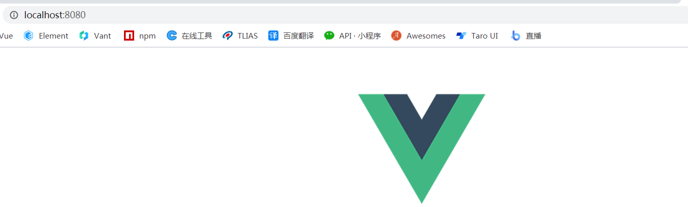

### 09-vue-cli-入口文件

关心的结构：

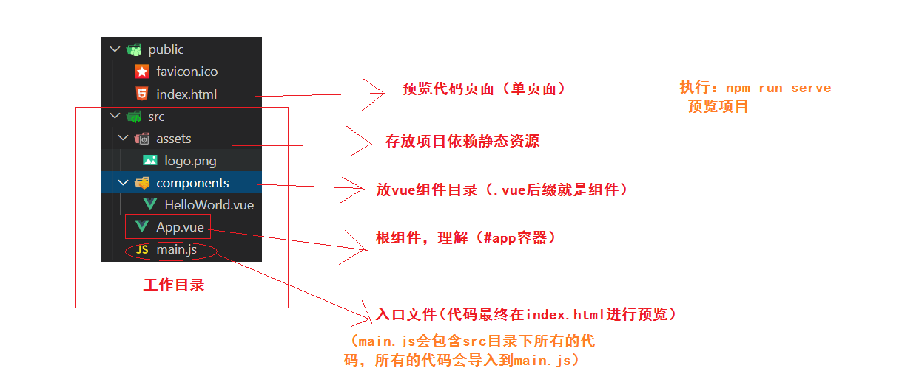

关心的代码：

```js
// import xxx from 'xxx' 等于 const xxx = require('xxx')
// 遵循ES6模块化。
// 导入：import 变量名 from '包的名字|模块路径'
// 导出：export default { // 被导出的对象 }

// 导入vue核心代码
import Vue from "vue";
// 导入 App 组件配置对象 APP === {template:'组件结构'}
import App from "./App.vue";

// 是否开启产品（上线）级别的提示
// 1. 在开发阶段：我看的日志的时候，期望是更具体更详细。这样才能便利调试。
// 2. 在上线阶段：日志越少越好
Vue.config.productionTip = false;

// 创建根实例
new Vue({
  // 通过 el 去指定管理的#app根容器，#app容器内的结构就是根实例的结构。
  // 解析 App 组件的内容
  render: (h) => h(App),
}).$mount("#app");
// 把 render 函数解析的APP组件的内容，渲染到#app容器
// #app容器 index.html 中
```

render 解释

```js
  // createElement 创建dom结构的函数
	render: function( createElement ) {
    // 根据 App.vue 组件配置对象，来创建dom结构
    // 返回给 render 属性
    return createElement(App)
  }
```

补充：vue 提供三种方式确定 #app 容器的内容

- el
- template
- render （权利最大）

### 10-vue-cli-单文件组件

> 通过后缀名是.vue 的文件创建的组件，称为：单文件组件。
>
> 单文件组件有固定格式：template 标签(必须的) script 标签 style 标签

例如：

`App.vue` 组件

```html
<template>
  <!-- 相当于组件配置对象中的 template, 书写组件html结构的 -->
  <!-- 必须有一个根元素 -->
  <div id="app">APP 根组件</div>
</template>
<script>
  // 除去组件的template外，如果组件还有其他配置选项，就需要导出去
  export default {
    // 组件名称
    name: "App",
  };
</script>
<style>
  /* 写样式 */
</style>
```

**最后：替换 vue-cli 生成的 App.vue 组件内容，删除 `HelloWorld.vue`**

###11-英雄案例-项目介绍

> 就是一套增删改查，关于 英雄信息 。

- 英雄列表
  - 列表查询
  - 增加英雄
  - 编辑英雄
  - 删除英雄
- 装备列表
- 技能列表

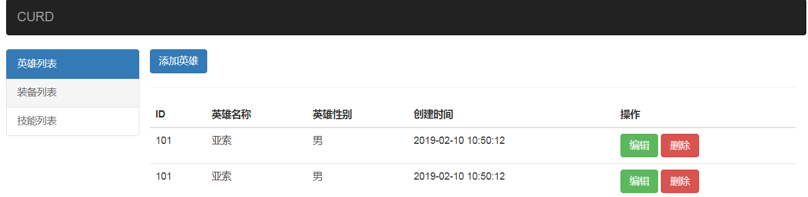

###12-英雄案例-布局分析


页面是基于 bootstrap 所有需要先引入 这个框架的样式。

在项目中安装：

```bash
npm i bootstrap@3.3.7
```

`main.js` 引入`bootstrap`

```js
// 引入bootstrap
import "bootstrap/dist/css/bootstrap.min.css";
```

验证：`App.vue`

```html
<div id="app">APP 根组件 <button class="btn btn-success">按钮</button></div>
```

###13-英雄案例-定义组件

前提：`<div id="app" class="container">` 加类 `App.vue` 组件修改。

1. **导航组件的创建与使用：**

`components/NavBar.vue` 创建组件

```html
<template>
  <nav class="navbar">
    <a class="navbar-brand" href="#">CURD</a>
  </nav>
</template>

<script>
  export default {
    // 不用和原生的标签重名
    name: "nav-bar",
  };
</script>

<style>
  .navbar {
    background: #333;
  }
</style>
```

`App.vue` 注册使用组件

```js
// 导入 导航组件
import NavBar from "./components/NavBar";
```

```js
// 注册组件
components: {
  NavBar;
}
```

```diff
  <div id="app" class="container">
    <!-- 导航组件 -->
+    <nav-bar></nav-bar>
  </div>
```

2. **侧边栏组件创建于使用：**

`components/MyAside.vue` 创建组件

```html
<template>
  <div class="row">
    <div class="list-group">
      <a href="#" class="list-group-item active">英雄列表</a>
      <a href="#" class="list-group-item">装备列表</a>
      <a href="#" class="list-group-item">技能列表</a>
    </div>
  </div>
</template>

<script>
  export default {
    name: "my-aside",
  };
</script>

<style></style>
```

`App.vue` 注册使用组件

```js
import MyAside from "./components/MyAside";
```

```js
// 注册组件
components: {
  NavBar, MyAside;
}
```

```html
<div class="col-md-2">
  <!-- 侧边栏组件 -->
  <my-aside></my-aside>
</div>
<div class="col-md-10">内容</div>
```

###14-英雄案例-实现路由

> 点击侧边栏的连接。需要切换右侧的内容。这个需要路由来实现。

安装：

```bash
npm i vue-router
```

导入：`main.js`

```js
import VueRouter from "vue-router";
```

**注册：**

```
Vue.use(VueRouter)
```

准备组件：`HeroesList.vue` `ZbList.vue` `JnList.vue`

路由规则：

```js
import HeroesList from "./views/HeroesList.vue";
import ZbList from "./views/ZbList.vue";
import JnList from "./views/JnList.vue";
```

```js
const routes = [
  { path: "/", redirect: "/heroes" },
  { path: "/heroes", component: HeroesList },
  { path: "/zb", component: ZbList },
  { path: "/jn", component: JnList },
];
```

初始化：

```js
const router = new VueRouter({ routes });
```

挂载根实例：

```diff
new Vue({
  render: h => h(App),
+  router
}).$mount('#app')
```

使用 router-link router-view

`components/MyAside.vue`

```html
<router-link to="/heroes" class="list-group-item active">英雄列表</router-link>
<router-link to="/zb" class="list-group-item">装备列表</router-link>
<router-link to="/jn" class="list-group-item">技能列表</router-link>
```

`App.vue`

```html
<div class="col-md-10">
  <!-- 路由对应组件显示的位置 -->
  <router-view></router-view>
</div>
```

### 15-英雄案例-提取路由模块
