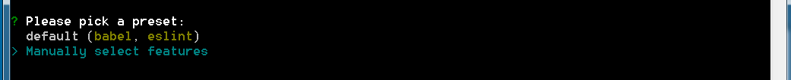
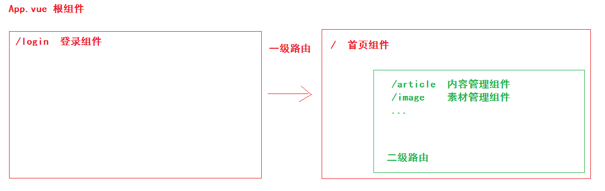

## VUE项目-黑马头条PC端-day01

### 01-每日反馈

| 姓名 | 意见或建议                                           |
| ---- | ---------------------------------------------------- |
| ***  | 1，HeroesList. vue组件，编辑按钮那里加的动态路由不懂 |

- 当不同路由地址（/heroes/edit/3|4|5），需要去到同一个组件，需要是动态路由规则。
- 去做编辑功能需要路径传参，首先需要根据ID先后台获取当前英雄的数据后，你才能进行修改。


### 02-每日回顾


### 03-项目介绍

项目功能介绍：

- 黑马头条（类似于今日头条）有一个手机APP端，它对应会有一个PC管理后台，自媒体PC管理端。
- 大概的功能：登录，首页，欢迎页面，内容管理，素材管理，发布文章，评论管理，粉丝管理。个人设置。

项目技术介绍:

- div+css 布局
- javascript 
- vue基础
- vue-router插件
- axios插件
- echarts插件
- 依赖的是线上服务器接口（接口文档）
- vue-cli使用
- 饿了么UI（element-ui）
  - 它是一个基于VUE的组件库（提供了网站开发常用的组件）
  - 看文档


### 04-创建项目

使用vue-cli来创建项目：

```bash
vue create hm-toutiao-pc-95
```

具体的步骤：

1. 选择自定义创建方式



2. 选择项目需要依赖插件
   1. Babel  作用把ES6语法转换成ES5语法，让项目兼容更多的浏览器。
   2. Linter / Formatter  约束代码风格，代码规范 ( 很多流行代码规范 )，让项目的代码风格统一。
   3. CSS Pre-processors  选择预处理器（less sass stylus）。


注明：空格键，是选择和取消选择。

3. 选择 Less 作为css预处理器


4. 选择 Standard 代码风格


5. 检查代码风格的时机：保存代码，提交代码 去做检查。


6. 依赖的工具，每一个工具对应生成一个配置文件。而不是统一写在package.json中。


7. 是否记录以上选择操作，方便下次快速创建。不记录，因为每次都不一样。


8. 创建成功


### 05-了解结构


总结：

通过vue-cli创建的项目几乎是零配置（自己不用写配置），将来可能会修改配置，能够找到对应的文件即可。


### 06-调整结构

我们需要调整src的目录结构，分工明确，代码可维护性更好。

```bash
src
├─api            # 接口相关代码，axios相关代码
├─assets         # 静态资源，css  images ...
├─components     # 公用级别组件
├─router         # 路由相关代码
├─styles         # less相关代码
├─utils          # 全局工具模块相关代码
├─views          # 路由级别组件
└─App.vue        # 根组件
└─main.js        # 入口文件
```

总结：

重要的是大家需要有这种拆分模块的编程思维，至于目录名称是否和老师一模一样不做约束。以上目录仅供参考。


### 07-版本控制

把项目托管到远程仓库：

- 老师：每一个小功能，提交一次代码，对应代码的差异性，更好找到完成这个功能到底修改了那些代码。
- 大家：锻炼一下，git工具使用。


步骤：

- 由于git是不会管理空文件夹，所以需要找每一个空文件夹下，新建一个 `.gitkeep` 作为占位文件。
- 添加到暂存 `git add .`
- 提交本地仓库 `git commit -m "初始化项目结构"`
- 新建一个码云远程仓库   ssh地址 `git@gitee.com:zhoushugang/hm-toutiao-pc-95.git` 
- 推送本地代码：
  - ` git push git@gitee.com:zhoushugang/hm-toutiao-pc-95.git master`


总结：我们现在关注的是每个功能的实现，有提交记录即可。没去使用分支分模块开发。


### 08-使用element-ui

官方地址： https://element.eleme.cn/#/zh-CN 

组件库：提供了网站开发的常用组件，基于vue的组件。

作用：依赖这个组件库，适合可以快速的构建后台管理系统的界面，让开发者的精力集中在业务功能实现。


使用步骤：

1、安装 ` npm i element-ui -S `

- `-S`  === `--save`  安装的包上线后也要用，`-D` === `--save-dev`   开发过程中使用的包，上线不用。

2、导入 `main.js`

```diff
import Vue from 'vue';
+import ElementUI from 'element-ui';
+import 'element-ui/lib/theme-chalk/index.css';
import App from './App.vue';

+Vue.use(ElementUI);

new Vue({
  el: '#app',
  render: h => h(App)
});
```

- 注明：以上写法是**完整引入**，在开发阶段使用。如果将来需要优化，改成按需引入。

3、测试 `App.vue`

```html
  <div id="app">
    根组件 <el-button type="success">成功按钮</el-button>
  </div>
```


###09-使用vue-router

使用步骤：

1、安装 `npm i vue-router`

2、导入 `src/router/index.js`

```js
import VueRouter from 'vue-router'
```

3、注册

```js
import Vue from 'vue'
Vue.use(VueRouter)
```

4、路由规则定义

```js
const routes = [ //路由规则 ]
```

5、初始化路由实例

```js
const router = new VueRouter({routes})
```

6、导出路由实例

```js
export default router
```

7、导入路由实例  `src/main.js`

```js
import router from './router/index.js'  // 模块路径
```

8、挂载到根实例

```diff
new Vue({
  render:h=>h(App),
+  router
}).$mount('#app')
```


最后落地代码：

`router/index.js`

```js
// 导入路由
import VueRouter from 'vue-router'
// 导入vue
import Vue from 'vue'
// 注册路由
Vue.use(VueRouter)

// 声明路由规则
const routes = []

// 初始化路由实例
const router = new VueRouter({ routes })

// 导出路由实例
export default router

```

`main.js`

```js
// 导入路由实例
import router from './router/index.js'
```

```diff
new Vue({
  render: h => h(App),
  // 挂载路由实例
+  router
}).$mount('#app')
```


如果检测路由生效：

`访问项目地址`  默认在地址后加上  `#/`  代表已经生效。


### 10-路由规则



| 路由路径    | 路由组件     | 路由级别 |
| ----------- | ------------ | -------- |
| /login      | 登录组件     | 一级路由 |
| /           | 首页组件     | 一级路由 |
| ├─ /        | 欢迎组件     | 二级路由 |
| ├─ /article | 内容管理组件 | 二级路由 |
| ├─ /image   | 素材管理组件 | 二级路由 |
| ├─ /publish | 发布文章组件 | 二级路由 |
| ├─ /comment | 评论管理组件 | 二级路由 |
| ├─ /fans    | 粉丝管理组件 | 二级路由 |
| ├─ /setting | 个人设置组件 | 二级路由 |


###11-登录模块-组件与路由

创建登录组件：`src/views/Login.vue`

```html
<template>
  <div class='container'>
    Login
  </div>
</template>

<script>
export default {
  name: 'my-login'
}
</script>

<style scoped lang='less'></style>
```

配置路由规则：`src/router/index.js`

```js
// 导入组件
import Login from '../views/Login.vue'
```

```js
// 声明路由规则
const routes = [
  { path: '/login', component: Login }
]
```

显示路由规则对应的组件：`src/App.vue`   使用  `router-view`  渲染组件

```html
  <div id="app">
    <!-- 一级路由组件显示的位置 -->
    <router-view></router-view>
  </div>
```

检查效果：


###12-代码片段设置

第一步：


第二步：


第三步：


第四步：


```json
{
	"vue模版": {
		"prefix": "vue",
		"body": [
			"<template>",
			"  <div class='container'></div>",
			"</template>\n",
			"<script>",
			"export default {}",
			"</script>\n",
			"<style scoped lang='less'></style>",
		],
		"description": "Create vue template"
	}
}
```

使用：在后缀名 .vue 文件中，输入 vue 后回车即可。

解释：

- lang="less"  意思是使用less语法写样式
- scoped  样式作用域只会在当前组件生效，不会影响其他组件的样式。


### 13-登录模块-基础布局

需要做好的布局：

- 全屏容器
  - 白色卡片
    - logo图片

具体的代码实现：

```html
<template>
  <div class='login-container'>
    <el-card class="my-card">
      
    </el-card>
  </div>
</template>

<script>
export default {
  name: 'my-login'
}
</script>

<style scoped lang='less'>
// 全屏容器
.login-container{
  position: absolute;
  left: 0;
  top: 0;
  // 让高度和宽度直接继承窗口大小
  width: 100%;
  height: 100%;
  background: url(../assets/login_bg.jpg) no-repeat center / cover;
  .my-card{
    width: 400px;
    height: 350px;
    position: absolute;
    left: 50%;
    top: 50%;
    transform: translate(-50%,-60%);
    img{
      display: block;
      width: 200px;
      margin: 0 auto 20px;
    }
  }
}
</style>

```


###14-登录模块-绘制表单

饿了么UI提供了表单组件，我们使用其组即可。

分析组件结构：

```html
<!-- el-form 表单容器 -->
<!-- ref="form" 将来$refs可以获取当前组件实例 （ref标识DOM|组件） -->
<!-- :model="form" 动态属性绑定，把收集表单所有信息的form对象传递给表单组件，校验会用到 -->
<!-- label-width="80px" 控制文字说明的宽度 -->
<el-form ref="form" :model="form" label-width="80px">
  <!-- 表单项（文字说明，具体表单元素） -->
  <!-- label="活动名称"  设置文字说明 -->
  <el-form-item label="活动名称">
    <!-- 表单元素组件 -->
    <!-- v-model="form.name" 双向绑定数据 -->
    <el-input v-model="form.name"></el-input>
  </el-form-item>
</el-form>
<script>
  export default {
    data() {
      return {
        form: {
          name: ''
        }
      }
    }
  }
</script>
```

- 注意：每一个组件的文档的最下方，都会对组件拥有的 属性  方法  事件  做详细的解析。
- 推荐：try 一 try   试一试

落地项目当中：

- 结构

```html
      <!-- 表单 -->
      <el-form>
        <el-form-item>
          <el-input v-model="loginForm.mobile" placeholder="请输入手机号"></el-input>
        </el-form-item>
        <el-form-item>
          <el-input v-model="loginForm.code" placeholder="请输入验证码" style="width:240px;margin-right:8px"></el-input>
          <el-button>发送验证码</el-button>
        </el-form-item>
        <el-form-item>
          <el-checkbox :value="true" > 我已阅读并同意用户协议和隐私条款</el-checkbox>
        </el-form-item>
        <el-form-item>
          <el-button type="primary" style="width:100%">登 录</el-button>
        </el-form-item>
      </el-form>
```

- 数据

```js
  data () {
    return {
      // 登录表单数据对象
      loginForm: {
        mobile: '',
        code: ''
      }
    }
  }
```


