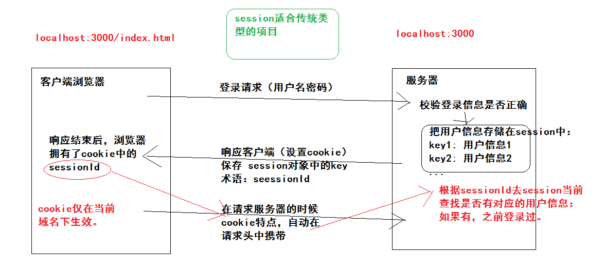
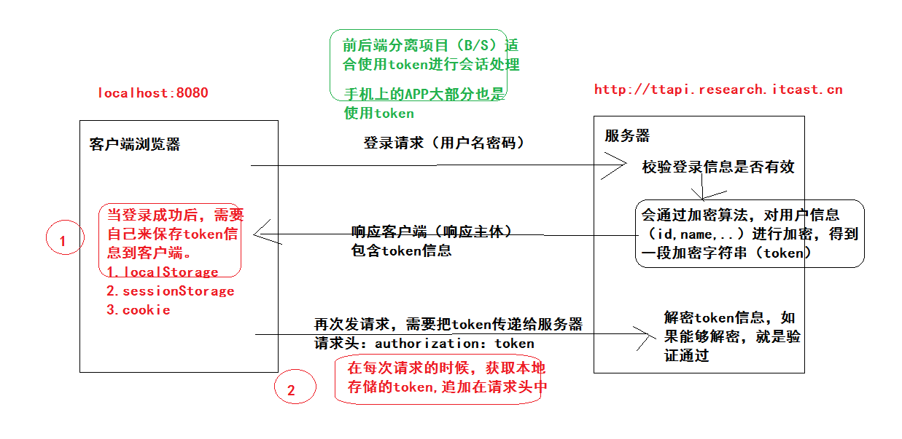
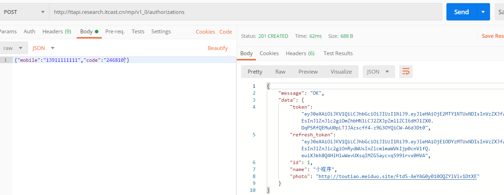
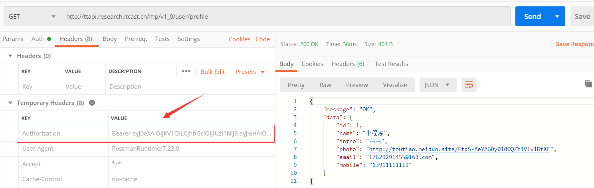
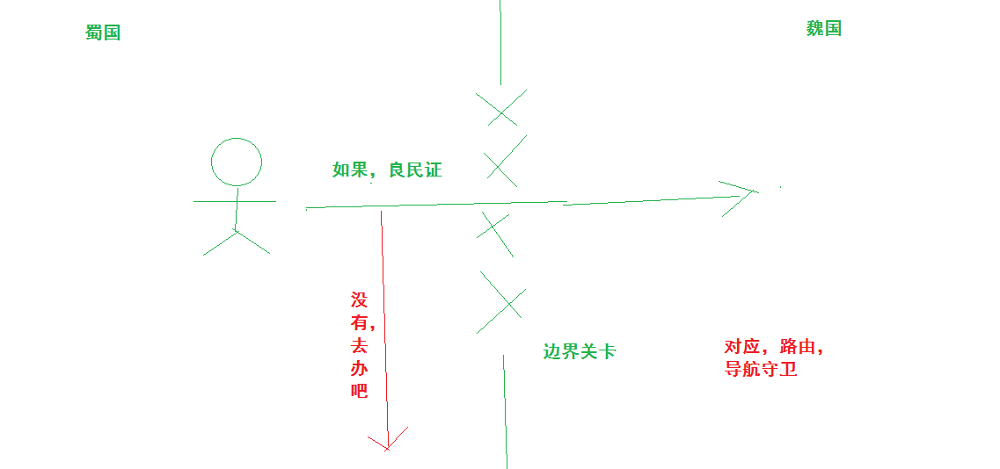
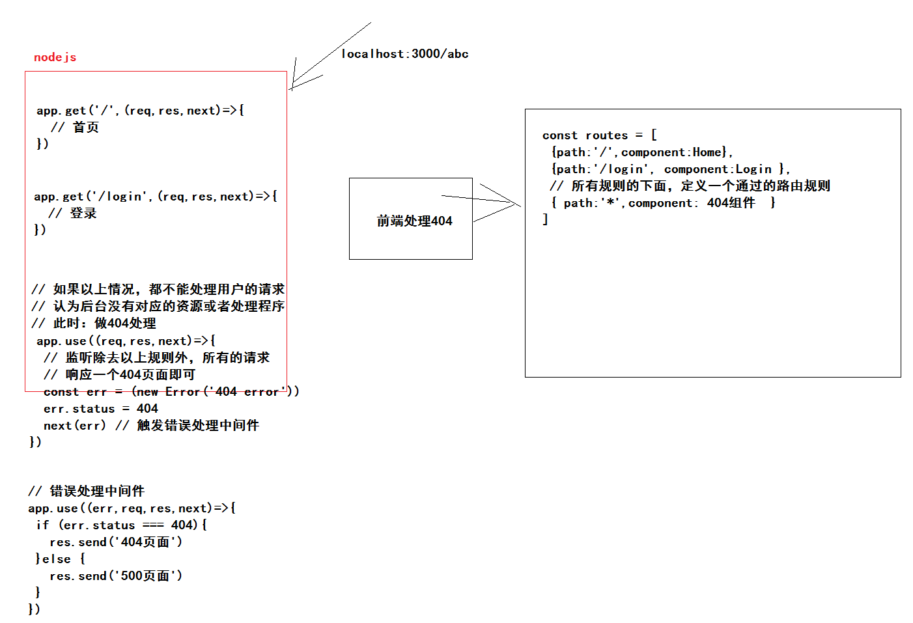

## VUE项目-黑马头条PC端-day03

### 01-每日反馈

| 姓名 | 意见或建议                                                   |
| ---- | ------------------------------------------------------------ |
| ***  | 这几天不知道怎么了，总是犯一些低级的错误，状态不是很好       |
| ***  | 老师能讲解下element-ui中导航栏里slot这个属性吗?文档也没查到,百度上说slot是充当插槽使用,不太明白. |
| ***  | 老师 什么时候用表单submit进行提交,什么时候用button提交?      |

- 错误肯定会有，尝试自己排查，锻炼自己排错能力。
- vue基础知识，在项目中会使用，大概后天课程内容中会涉及插槽，我们需要封装灵活度更高的组件。
- 表单数据提交，是使用 submit 事件进行提交，还是使用 click 事件进行提交？
  - 昨天 使用的是 button 的点击click事件，进行登录的手机号和验证码的提交。
    - 表单是组件：el-form 组件上是否有 submit 事件呢？
  - 以前  使用的是 form 的提交submit事件，进行数据提交。
    - form 表单中的 button 按钮的点击默认会触发form表单的提交事件，因为button默认的类型是submit 类型。
    - 如果你想点击按钮的时候去绑定点击事件进行数据的提交，那么需要 设置button按钮的类型为button即可。


### 02-首页模块-侧边栏折叠效果

当你点击 头部图标的时候  切换侧边栏效果：

- 侧边栏宽度
  - 展开：200px
  - 收起：64px
- logo图片
  - 展开：使用大的logo图片，带文字
  - 收起：使用小的logo图片，不带文字
- 导航菜单
  - 展开：绑定属性  collapse  值  false
  - 收起：绑定属性  collapse  值  true

思路：声明一个数据，来表示两种状态，根据这个数据，来动态设置以上三个地方的效果。

代码：

- 声明数据

```js
  data () {
    return {
      // 侧边栏是不是展开状态，默认展开
      isOpen: true
    }
  },
```

- 操作数据

```html
        <!-- 图标 -->
        <span class="el-icon-s-fold icon" @click="toggleAside()"></span>
```

```js
  methods: {
    // 切换侧边栏展开与收起
    toggleAside () {
      this.isOpen = !this.isOpen
    }
  }
```

- 根据数据实现效果

侧边栏

```html
<el-aside class="my-aside" :width="isOpen?'200px':'64px'">
```

logo

```html
<div class="logo" :class="{minLogo:!isOpen}"></div>
```

```diff
    .logo{
      width: 100%;
      height: 60px;
      background: #002244 url(../assets/logo_admin.png) no-repeat center / 140px auto;
    }
+    // 覆盖background 的图片和大小，类书写在logo的下方。
+    .minLogo{
+      background-image: url(../assets/logo_admin_01.png);
+      background-size: 36px auto;
+    }
```

导航菜单

```html
      <!-- 导航菜单 -->
      <el-menu
      :collapse="!isOpen"
      :collapse-transition="false"
```


### 03-登录补充-回顾session

回顾session的目的是，区别token的使用场景。




### 04-登录补充-了解token



总结：

- 登录成功后，在本地存储token
- 每次请求前，需要在请求头中携带token


### 05-登录补充-演示使用token

> 通过postman演示token的使用，将来我们通过代码做对应的事情即可。

进行登录




获取用户资料




总结：

- 登录之后的token在，响应主体对象中  data 中 token 字段。
- 在请求头携带token，
  - 字段： Authorization 
  - 值： Bearer  + 英文空格 + token字符串


###06-登录补充-保存用户信息

封装操作本地用户信息（包含token）的工具模块：`src/utils/auth.js`

```js
// 管理用户信息，身份认证信息，操作函数相关。

// 1. 确认本地存储用户信息的方式：sessionStorage
// 1.1 原因：关闭浏览器之后登陆失效，提供了便利的API函数。
// 2. sessionStorage.setItem('数据名字','字符串类型数据')
// 2.1 数据的名字定义成常量，数据格式：json格式的字符串 例如：{"id":1,...}
const KEY = 'hm-toutiao-pc-95-user'

/**
 * 设置用户信息
 * @param {Object} user - 用户信息对象
 */
const setUser = (user) => {
  window.sessionStorage.setItem(KEY, JSON.stringify(user))
}
// 获取用户信息
const getUser = () => {
  // 如果KEY对应没有信息，你获取的是null，你可以执行的代码：getUser().id 报错
  return JSON.parse(window.sessionStorage.getItem(KEY) || '{}')
}
// 删除用户信息
const delUser = () => {
  window.sessionStorage.removeItem(KEY)
}

export default { setUser, getUser, delUser }

```

在登录后通过这个功能模块，存储用户信息。`src/views/Login.vue`

```js
// 导入工具模块
import auth from '@/utils/auth'
```

```diff
          this.$http.post('authorizations', this.loginForm).then(res => {
            // 登录成功
+            // 存储用户信息 res === {data:{message:'提示信息',data:'用户信息对象'}}
+            // res.data 是响应主体，响应主体才是后台返回的数据
+            auth.setUser(res.data.data)
+            // 跳转到首页
            this.$router.push('/')
          }).catch(() => {
```


###07-登录补充-访问权限控制

需求：访问权限控制

​	除去登录路由外，其他功能路由，在访问的时候，都应该是登录状态，如果不是登录状态，去访问了这些功能路由，我们应该拦截访问到登录路由。


确定：登录状态判断依据

​	当浏览器端保存过用户信息，此时认为已经登录。如果没有存储用户信息，此时认为未登录。


方案：实现拦截

​	当你在路由跳转之前，获取当的用户信息，来判断登录的状态，如果登录了放行，如果没有登录拦截到登录页面。


通过**导航守卫**可以实现，跳转前做一些事情。




```js
const router = new VueRouter({ ... })
// 路由实例的函数，添加一个导航守卫，回调函数在每次路由跳转前会执行
// to 跳转的目标，路由对象。
// from 来自哪个路由，路由对象。
// next() 放行，你访问哪里你就去哪里，next('/login')  拦截到登录路由                         
router.beforeEach((to, from, next) => {
  // ...
})
```


最后落地代码：`src/router/index.js`

```js
// 导航守卫
router.beforeEach((to, from, next) => {
  // 如果你访问的路径是除去登录外的路径，并且你此时没有登录，拦截到登录页面。
  // 其他情况一概放行。
  const user = auth.getUser()
  if (to.path !== '/login' && !user.token) return next('/login')
  next()
})
```


###08-首页补充-用户信息展示

在头部，有 用户名称 和 用户头像 需要根据当前登录的用信息来设置。

- 在首页的data中，声明 用户名称   和  用户头像
- 在首页组件初始化的时候，从本地存储中获取用信息。
- 然后，给你声明的数据赋值即可。
- 最后，模板中使用数据即可。


`src/views/Home.vue` 

声明数据

```diff
  data () {
    return {
      // 侧边栏是不是展开状态，默认展开
      isOpen: true,
      // 用户名
+      userName: '',
      // 用户头像
+      userPhoto: ''
    }
  },
```

获取数据，数据赋值

```js
import auth from '@/utils/auth'
```

```js
  created () {
    // 1. 从本地存储中获取数据
    const user = auth.getUser()
    // 2. 给data中数据赋值
    this.userName = user.name
    this.userPhoto = user.photo
  },
```

渲染数据

```html
            <!-- 头像 -->
            
            <!-- 名字 -->
            <span class="user-name">{{userName}}</span>
```


###09-首页补充-退出登录功能

当点击右上角下拉菜单的选项

- 退出登录，其实就是清除本地存储的用户信息，同时跳转到登录页面。
- 个人设置，跳转到个人设置路由即可。


1、绑定下拉菜单选项的点击事件，分别以上两件事件即可。

问题：

- 在给组件绑定事件的时候，如果组件内部没有实现这个事件，那么该事件绑定无效。
- 组件最终还是解析成dom，dom是支持这样的原生事件的，告诉组件这是一个原生事件，组件就会把事件绑定在解析后的dom原生上。

绑定事件：`  @click.native`

```html
          <el-dropdown-menu slot="dropdown">
            <el-dropdown-item @click.native="setting()" icon="el-icon-setting">个人设置</el-dropdown-item>
            <el-dropdown-item @click.native="logout()" icon="el-icon-unlock">退出登录</el-dropdown-item>
          </el-dropdown-menu>
```

处理函数：

```js
    // 跳转个人设置
    setting () {
      this.$router.push('/setting')
    },
    // 进行退出
    logout () {
      // 1. 清除用户信息
      auth.delUser()
      // 2. 跳转到登录页面
      this.$router.push('/login')
    }
```


2、根据element-ui提供的方式来实现，更好。

- el-dropdown组件有一个事件， command 事件 当你点击了下拉选项 就会触发。
- el-dropdown-item组件上有指令， command 属性的值，点击的时候回传递给，el-dropdown组件的command事件的处理函数。

```html
        <!-- 下拉菜单组件 -->
        <el-dropdown class="my-dropdown" @command="handleClick">
```

```html
            <el-dropdown-item command="setting" icon="el-icon-setting">个人设置</el-dropdown-item>
            <el-dropdown-item command="logout" icon="el-icon-unlock">退出登录</el-dropdown-item>
```

```js
    // 跳转个人设置
    setting () {
      this.$router.push('/setting')
    },
    // 进行退出
    logout () {
      // 1. 清除用户信息
      auth.delUser()
      // 2. 跳转到登录页面
      this.$router.push('/login')
    },
    // 点击下拉选项处理函数
    handleClick (command) {
      // 判断你点击的是 个人设置还是退出登录
      // console.log(command)
      // 逻辑：if (command==='setting') 设置
      // 逻辑：if (command==='logout') 登录
      // command 正好就是你要执行的函数名称
      this[command]()
    }
```


###10-首页补充-404页面

思路分析：



落地代码：

`src/views/404.vue`

```html
<template>
  <div class='container-404'></div>
</template>

<script>
export default {}
</script>

<style scoped lang='less'>
.container-404{
  position: absolute;
  left: 0;
  top: 0;
  width: 100%;
  height: 100%;
  background: url(../assets/404.png) no-repeat center / cover;
}
</style>

```

`src/router/index.js`

```js
import NotFound from '../views/404.vue'
```

```diff
// 声明路由规则
const routes = [
  // 登录
  { path: '/login', component: Login },
  // 首页
  {
    path: '/',
    component: Home,
    children: [
      { path: '/', component: Welcome }
    ]
  },
+  // 通配规则，匹配以上规则没处理的 路径
+  { path: '*', component: NotFound }
]
```


