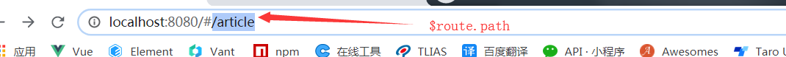
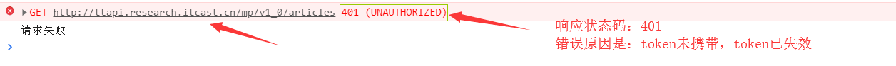
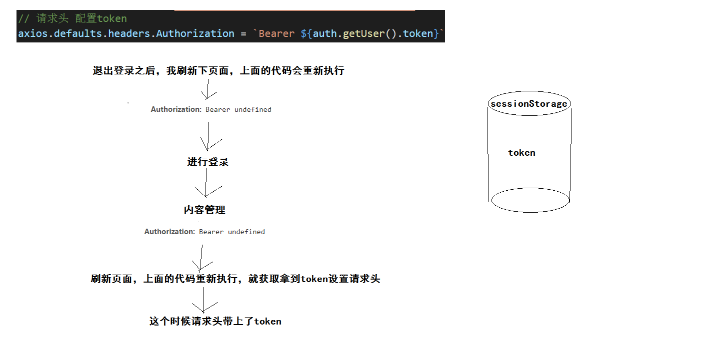
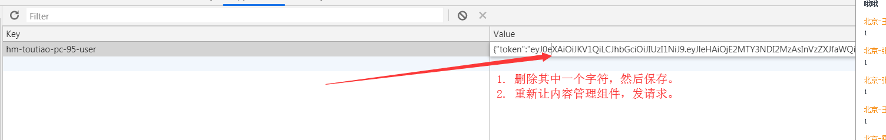

### VUE项目-黑马头条PC端-day04

### 01-每日反馈&每日回顾

首页模块：

- 侧边栏折叠效果

会话处理：

- session 回顾
- token 回顾
  - 登录后本地存储token信息
  - 以后凡是需要登录才能调通的接口，必须在请求头部携带token信息
    - Authorization === Bearer  + 英文空格 + token字符串
- 访问权限控制
  - 通过路由提供的导航守卫，在每次跳转路由前，判断登录状态
    - 登录：放行
    - 没有登录：拦截登录页面
- 用户信息展示
- 退出登录功能
- 访问路由规则外的地址，显示404页面


### 02-内容管理-导航菜单路由功能

> 使用的是导航菜单组件，思考：组件是否提供点击后的跳转路由的功能。

- el-menu  提供了 router 属性
  -  是否使用 vue-router 的模式，启用该模式会在激活导航时以 index 作为 path 进行路由跳转 

```diff
<el-menu
+      router
      :collapse="!isOpen"
      :collapse-transition="false"
      style="border-right:none"
+      default-active="/"
      background-color="#002233"
      text-color="#fff"
      active-text-color="#ffd04b">
+        <el-menu-item index="/">
          <i class="el-icon-s-home"></i>
          <span slot="title">首页</span>
        </el-menu-item>
+        <el-menu-item index="/article">
          <i class="el-icon-document"></i>
          <span slot="title">内容管理</span>
        </el-menu-item>
+        <el-menu-item index="/image">
          <i class="el-icon-picture"></i>
          <span slot="title">素材管理</span>
        </el-menu-item>
+        <el-menu-item index="/publish">
          <i class="el-icon-s-promotion"></i>
          <span slot="title">发布文章</span>
        </el-menu-item>
+        <el-menu-item index="/comment">
          <i class="el-icon-chat-dot-round"></i>
          <span slot="title">评论管理</span>
        </el-menu-item>
+        <el-menu-item index="/fans">
          <i class="el-icon-present"></i>
          <span slot="title">粉丝管理</span>
        </el-menu-item>
+        <el-menu-item index="/setting">
          <i class="el-icon-setting"></i>
          <span slot="title">个人设置</span>
        </el-menu-item>
      </el-menu>
```


### 03-内容管理-路由与组件

创建组件：`src/views/Article.vue`

```html
<template>
  <div class='article-container'>
    Article
  </div>
</template>

<script>
export default {
  name: 'my-article'
}
</script>

<style scoped lang='less'></style>
```

配置路由：`src/router/index.js`

```js
import Article from '../views/Article.vue'
```

```diff
  // 首页
  {
    path: '/',
    component: Home,
    children: [
      { path: '/', component: Welcome },
+      { path: '/article', component: Article }
    ]
  },
```


### 04-内容管理-动态激活菜单

问题：不管访问那个页面，默认激活的都是首页菜单。

原因：el-menu组件上有个属性，default-active它是来指定激活哪个菜单的，值是写死的 `/`

解决：

- 动态绑定default-active这个属性，然后就可以动态赋值。
- 激活规则：
  - 如果激活 首页菜单  default-active值为：`/`    首页菜单index属性的值
  - 如果激活 内容管理  default-active值为：`/article`   内容管理index属性的值
  - 结论：值需要获取**路由路径**，设置给 default-active 后，即可激活对应的导航菜单。
- `$route`  获取路由相关信息的（传参 `$route.params`，路径 `$route.path`）



代码：

```diff
      <!-- 导航菜单 -->
      <el-menu
      router
      :collapse="!isOpen"
      :collapse-transition="false"
      style="border-right:none"
-      default-active="/"      
+      :default-active="$route.path"
```


### 05-内容管理-axios默认配置

当我们使用默认的axios去发送获取数据的请求，报错：



- 原因：请求头中没有携带token，或者携带的token无效。
- 解决：请求头： Authorization === Bearer  + 英文空格 + token字符串

我们的做法是，统一配置axios的请求头。`axios.defaults.headers`  进行配置即可。


落地代码：`src/api/index.js`

```js
import auth from '@/utils/auth'
```

```js
// 请求头  配置token
axios.defaults.headers.Authorization = `Bearer ${auth.getUser().token}`
```


有BUG，有问题：

- 退出登录，在登录页面，刷新一下（浏览器），在进行登录，来到内容管理，报错：没带上token
- 在内容管理，刷新一下（浏览器），正常获取数据：带上了token


### 06-内容管理-axios请求拦截器

上一个章节问题分析图：




解决方案：

- 不依赖页面初始化（页面刷新）设置token的代码。
- 在每次请求前，去获取一次token，然后设置在请求头中。
- 使用axios的**请求拦截器**，可以在每次发送请求前，做一些事情。

axios文档：

```js
// axios对象，interceptors拦截器，request请求拦截器，use做什么事情
// use(fn1,fn2) fn1 拦截成功执行的函数。 fn2 做拦截的时候代码报错，执行。
// fn1 拦截成功执行的函数  fn2 拦截失败执行的函数
axios.interceptors.request.use(function (config) {
  // config 是axios请求配置
  // 修改 config  这个请求配置（追加token）
  // 一定要返回出去，axios才能使用你修改后的请求配置
  return config;
}, function (error) {
	// 拦截失败做的事情，目前不做任何事情。
  // 1. axios基于promise的
  // 2. 如果失败了，axios要求返回一个promise对象，而且执行结果一定是失败。
  // 3. Promise.reject(error) 创建一个一定执行失败的promise对象。
  return Promise.reject(error);
});
```


项目中落地代码：`src/api/index.js`

```js
// 请求头 配置token
- // axios.defaults.headers.Authorization = `Bearer ${auth.getUser().token}`

+// 请求拦截器
+axios.interceptors.request.use(config => {
+  // 当前函数：在每次请求前都会执行。
+  // 修改请求头配置，追加上token
+  // 做一个严谨的判断，本地存储了token就是追加
+  const { token } = auth.getUser()
+  if (token) config.headers.Authorization = `Bearer ${token}`
+  return config
+}, err => Promise.reject(err))
```


### 07-内容管理-axios响应拦截器

问题：

- 情景1：如果没有登录，去获取后台数据，后台反馈：响应401错误
- 情景2：如果已经登录，但是过了2个多小时（现在token有效期两个小时），后台反馈：响应401错误
- 情景3：假设本地token被篡改（无效token），去后台获取数据，后台反馈：响应401错误

总结：

- 以上三种情景，理解成同一个场景，登录失效。
- 需要我们做：再每次响应失败后，根据错误状态码401，清除本地token相关信息，跳转到登录页面重新登录即可。

技术：

- 通过axios的响应拦截器，可以在每次响应后（成功，失败）做一些事件。

```js
// axios对象，interceptors拦截器，response响应拦截器，use做些什么。
// use(fn1,fn2) fn1作用：响应成功就会执行，fn2作用：响应失败就会执行。
axios.interceptors.response.use(function (response) {
  // response 响应报文对象，response.data 就是后台的响应主体数据
  // 对响应数据做点什么
  // 这里返回的 response 其实就是 then(res=>{}) 调用接口后的res
  return response;
}, function (error) {
  // 对响应错误做点什么
  // 业务：判断401状态码，清除本地token信息，跳转到登录页面。
  // 规定：一定返回一个失败的promise对象。
  return Promise.reject(error);
});
```


项目中的代码：`src/api/index.js`

```js
import router from '@/router'
```

```js
// 响应拦截器
axios.interceptors.response.use(res => res, err => {
  // 业务：判断401状态码，清除本地token信息，跳转到登录页面
  // 1. 获取响应状态码  在响应报文中
  // 2. 响应报文对象 err.response
  // 3. 总结：statusCode ==== err.response.status  响应状态码
  if (err.response && err.response.status === 401) {
    // 1. 清除本地token信息
    auth.delUser()
    // 2. 跳转到登录页面
    // 在vue实例下,在组件代码中，可以使用this.$router.push('/login')
    // 所以在这里不能通过组件实例，访问$router这个对象，使用其push函数。
    // 方案1：window.location.href = 'http://localhost:8080/#/login'
    // 方案2：window.location.hash = '#/login'
    // 以上方式不建议：通过location直接修改地址，可能导致路由有些功能无法触发。
    // $router 其实就是 new VueRouter() 的实例对象，所以 路由实例也可以调用push函数
    router.push('/login')
  }
  return Promise.reject(err)
})
```


测试拦截器代码：`src/views/Article.vue`

```js
export default {
  name: 'my-article',
  created () {
    // 测试获取后台数据
    this.$http.get('articles')
      .then(res => console.log(res.data))
      .catch(() => console.log('请求失败'))
  }
}
```




### 08-内容管理-async与await使用

其实async与await是ES7语法，但是统称ES6语法。

作用：

- jquery的ajax有回调地狱问题，可读性差。
- promise可以解决回调地狱问题，但是还是需要写then写catch，代码不够简洁和优雅。

- async与await，使用同步写法，来书写异步代码，业务逻辑更加清晰。

语法：

```js
// async 与 await 基于 promise
const axios = () =>{
  return new Promise((resolve,reject)=>{
    window.setTimeout(()=>{
      if ( true ) {
        resolve("数据")
      } else {
        reject(new Error('错误对象'))
      } 
    },1000)
  })
} 
// 使用promise的方式
// axios().then(res=>{
//   // res === "数据"
// })
const getData = async () => {
  // res就是promise执行成功后的返回数据
  const res = await axios()
}
```

- 使用 await 关键字修饰的 promise 对象，可以直接获取promise成功返回的数据。
- await 关键字必须写在async 关键字修饰的函数内，否则语法不通过会报错。
- await 修饰的 promise 对象函数，它是同步执行，会阻塞其他程序的，但是没关系，因为使用了async函数包裹 await 书写的同步代码，外层函数执行是异步的，整体上是不会阻塞其他程序的运行。


### 09-内容管理-改写登录请求

目的：

- 使用 async 和 await 来发请求
- 处理 async 和 await 异常情况

`src/views/Login.vue`

```js
this.$refs.loginForm.validate(async valid => {
        if (valid) {
          // async 和 await 修改登录请求
          // res是什么？是响应报文对象（响应结果对象），响应主体数据 res.data
          // 一下三句代码是理想情况下的代码，但是下面三句代码可能报错
          // ES语法：try{ // 可能出现异常代码片段 }catch(e){ // 捕获异常，前面try的代码片段出现异常，执行catch里面代码 }
          // catch(e) e参数：error 错误对象，exception 异常对象。
          try {
            const res = await this.$http.post('authorizations', this.loginForm)
            auth.setUser(res.data.data)
            this.$router.push('/')
          } catch (e) {
            this.$message.error('手机号或验证码错误')
          }
        }
      })
```


### 10-内容管理-筛选条件容器布局

筛选条件容器布局：

- 卡片容器
  - 头部（面包屑）
  - 内容（表单）
    - 单选框组
    - 下拉框
    - **日期控件 (DOTO)**   作业

具体的结构代码：`src/views/Article.vue`

```html
<template>
  <div class="article-container">
    <!-- 筛选条件区域 -->
    <el-card>
      <!-- 面包屑 -->
      <div slot="header">
        <el-breadcrumb separator-class="el-icon-arrow-right">
          <el-breadcrumb-item :to="{ path: '/' }">首页</el-breadcrumb-item>
          <el-breadcrumb-item>内容管理</el-breadcrumb-item>
        </el-breadcrumb>
      </div>
      <!-- 表单 -->
      <el-form label-width="80px">
        <el-form-item label="状态：">
          <el-radio-group v-model="reqParams.status">
            <el-radio :label="null">全部</el-radio>
            <el-radio :label="0">草稿</el-radio>
            <el-radio :label="1">待审核</el-radio>
            <el-radio :label="2">审核通过</el-radio>
            <el-radio :label="3">审核失败</el-radio>
            <el-radio :label="4">已删除</el-radio>
          </el-radio-group>
        </el-form-item>
        <el-form-item label="频道：">
          <el-select v-model="reqParams.channel_id" placeholder="请选择">
            <el-option
              v-for="item in channelOptions"
              :key="item.value"
              :label="item.label"
              :value="item.value"
            ></el-option>
          </el-select>
        </el-form-item>
        <el-form-item label="日期：">

        </el-form-item>
        <el-form-item></el-form-item>
      </el-form>
    </el-card>
    <!-- 筛选结果区域 -->
  </div>
</template>

<script>
export default {
  name: 'my-article',
  data () {
    return {
      // 筛选条件对象数据
      reqParams: {
        // 当字段的值为null的时候，这个不会发送给后台
        status: null,
        channel_id: null
      },
      // 频道下拉选项数据
      channelOptions: [{ value: 1000, label: '前端' }]
    }
  },
  created () {
    // 测试获取后台数据
    // this.$http.get('articles')
    //   .then(res => console.log(res.data))
    //   .catch(() => console.log('请求失败'))
  }
}
</script>

<style scoped lang='less'></style>

```


