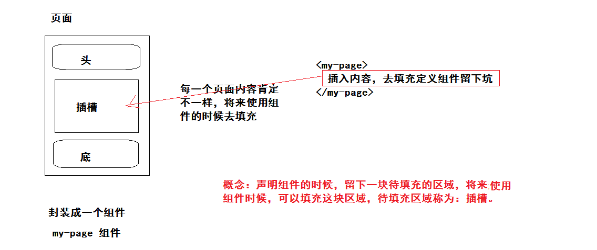
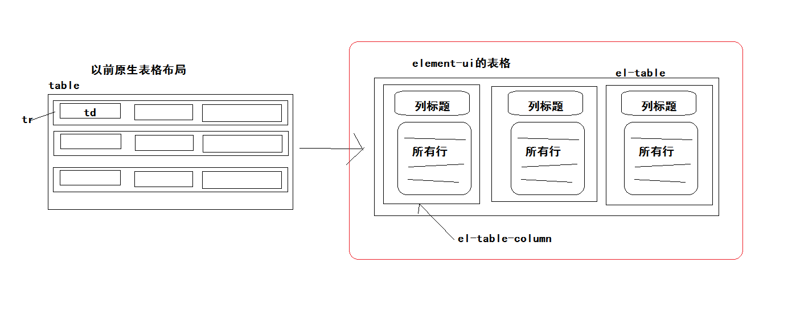
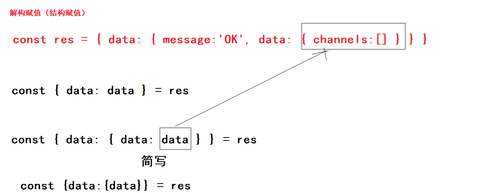

###VUE项目-黑马头条PC端-day05

### 01-每日反馈

| 姓名 | 意见或建议                                                   |
| ---- | ------------------------------------------------------------ |
| ***  | 老师能不能再给讲一下promise，都忘记了，自己看了看也没大看明白 |

- 业务场景：获取两个接口的数据，必须先获取到A接口数据，才能获取B接口数据。
  - xhr 方式发请求
  - promise  + xhr  方式发请求，简易axios
  - 基于promise结合async与await 方式发请求

```html
<!DOCTYPE html>
<html lang="en">

<head>
  <meta charset="UTF-8">
  <meta name="viewport" content="width=device-width, initial-scale=1.0">
  <title>Document</title>
</head>

<body>


  <script>
    // 业务场景：获取两个接口的数据，必须先获取到A接口数据，才能获取B接口数据。
    // - xhr 方式发请求
    // - promise  + xhr  方式发请求，简易axios
    // - 基于promise结合async与await 方式发请求

    // 获取A接口数据
    // const xhr = new XMLHttpRequest()
    // xhr.open('get', 'http://localhost:3000/a')
    // xhr.send()
    // xhr.onload = () => {
    //   console.log(xhr.responseText)
    //   // 获取B接口数据  
    //   const xhr2 = new XMLHttpRequest()
    //   xhr2.open('get', 'http://localhost:3000/b')
    //   xhr2.send()
    //   xhr2.onload = () => {
    //     console.log(xhr2.responseText)
    //   }
    // }

    const axios = (config) => {
      // 创建promise对象的方式：五种
      // new Promise((resolve,reject)=>{})  执行结果：成功 失败
      // Promise.resolve() 执行结果：成功
      // Promise.reject() 执行结果：失败
      // 扩展
      // Promise.all()  执行多个异步操作，等所有操作完成后，调用then获取所有操作结果
      // Promise.race()  执行多个异步操作，等最快的操作完成后，调用then获取最快操作结果
      return new Promise((resolve, reject) => {
        // 基于xhr 发送请求
        const xhr = new XMLHttpRequest()
        xhr.open(config.method, config.url)
        xhr.send()
        xhr.onload = () => {
          if (xhr.status === 200) {
            // 函数调用时候传参，就是then中函数的接收的数据
            resolve(xhr.responseText)
          } else {
            // 函数调用时候传入的错误对象，就是catch中函数的err对象
            reject(new Error('my axios error'))
          }
        }
      })
    }

    // promise 串联调用
    // axios({ method: 'get', url: 'http://localhost:3000/a' })
    //   .then(data => {
    //     // 获取A接口数据
    //     console.log(data)
    //     return axios({ method: 'get', url: 'http://localhost:3000/b' })
    //   }).then(data => {
    //     // 获取B接口数据
    //     console.log(data)
    //   }).catch(err => {
    //     console.log(err)
    //   })


    const getData = async () => {
      const a = await axios({ method: 'get', url: 'http://localhost:3000/a' })
      const b = await axios({ method: 'get', url: 'http://localhost:3000/b' })
      console.log(a)
      console.log(b)
    }
    getData()

    
  </script>
</body>

</html>
```


### 02-每日回顾

- axios 怎么进行默认配置

```js
axios.defaults.baseURL = 'xxx'
```

- axios 请求拦截器

```js
axios.interceptors.request.use(config=>config,err=>Promise.reject(err))
```

- axios 响应拦截器

```js
axios.interceptors.response.use(res=>res,err=>Promise.reject(err))
```


### 03-内容管理-筛选条件区域布局

> 日期，需要是element-ui提供的日期组件来实现。

结构：

```html
        <el-form-item label="日期：">
          <el-date-picker
            v-model="dateArr"
            type="daterange"
            range-separator="至"
            start-placeholder="开始日期"
            end-placeholder="结束日期">
          </el-date-picker>
        </el-form-item>
        <el-form-item>
          <el-button type="primary">筛选</el-button>
        </el-form-item>
```

数据：

```diff
      // 筛选条件对象数据
      reqParams: {
        // 当字段的值为null的时候，这个不会发送给后台
        status: null,
        channel_id: null,
+        begin_pubdate: null,
+        end_pubdate: null
      },
```

```js
      // 时间范围 [起始日期,结束日期]
      // 待实现：当日期控件选择了日期后动态给 reqParams 中 begin_pubdate end_pubdate 赋值
      dateArr: []
```

设置表单控件尺寸：

```html
<el-form label-width="80px" size="small">
```


### 04-内容管理-vue插槽知识

概念理解：



有四个知识点：

- 默认插槽 (当组件中只有一处内容需要插入的时候，使用默认插槽)

定义组件

```html
<template>
  <div class="page">
    <header>page-header</header>
    <div class="content">
      <!-- 默认插槽 -->
      <slot></slot>
    </div>
    <footer>page-footer</footer>
  </div>
</template>

<script>
export default {
  name: 'my-test'
}
</script>
```

使用组件

```html
    <my-test>内容1</my-test>
    <my-test>内容2</my-test>
```

- 备用内容 (在使用组件的时候，你不插入内容，也想默认显示默认内容)

```html
      <!-- 备用内容 -->
      <slot>备用内容</slot>
```

在slot标签中，默认存在的内容，就叫备用内容。当你使用组件的时候即使不插入内容，就会使用备用内容。

- 具名插槽（当你有多处内容需要插入的时候，需要声明具名插槽）

定义组件

```html
<template>
  <div class="page">
    <header>page-header</header>
    <div class="content">
      <!-- 具名插槽 -->
      <slot name="content"></slot>
    </div>
    <footer>
      <!-- 具名插槽 -->
      <slot name="footer"></slot>
    </footer>
  </div>
</template>

<script>
export default {
  name: 'my-test'
}
</script>
```

使用组件

```html
    <my-test>
      <!-- slot作用：指定当前标签的内容插入的插槽名称 -->
      <div slot="content">内容</div>
      <div slot="footer">page-footer</div>
    </my-test>
```


- 作用域插槽 ( 当你在插槽填充的内容时候，你想使用组件《定义插槽的组件》内部的数据 )

定义组件

```html
<template>
  <div class="page">
    <header>page-header</header>
    <div class="content">
      <!-- 具名插槽 -->
      <slot name="content" :info="msg" abc="100"></slot>
    </div>
    <footer>
      <!-- 具名插槽 -->
      <slot name="footer"></slot>
    </footer>
  </div>
</template>

<script>
export default {
  name: 'my-test',
  data () {
    return {
      msg: '组件内部数据'
    }
  }
}
</script>
```

使用组件

```html
    <my-test>
      <!-- slot作用：指定当前标签的内容插入的插槽名称 -->
      <!-- slot-scope作用：接收插槽传递的所有数据，对象类型。scope === {info,abc} -->
      <div slot="content" slot-scope="scope">内容 {{scope.info}}</div>
      <div slot="footer">page-footer</div>
    </my-test>
```


补充： 在 2.6.0 中，我们为具名插槽和作用域插槽引入了一个新的统一的语法 (即 `v-slot` 指令)。它取代了 `slot` 和 `slot-scope` 这两个目前已被废弃但未被移除 

```html
    <my-test>
      <!-- slot作用：指定当前标签的内容插入的插槽名称 -->
      <!-- slot-scope作用：接收插槽传递的所有数据，对象类型。scope === {info,abc} -->
      <!-- <div slot="content" slot-scope="scope">内容 {{scope.info}}</div> -->
     
      <!-- v-slot:插槽名称="作用域数据（插槽上绑定所有属性数据）变量名" -->
      <!-- 注意：使用v-slot指令，标签的名称必须是 template  -->
      <template v-slot:content="scope">内容 {{scope.info}}</template>
      
      <div slot="footer">page-footer</div>
    </my-test>
```


总结：我们为什么学习插槽？

- 能够自己封装简单的基于插槽的组件。
- 能够看懂第三方组件库（element-ui）提供的组件结构代码。


### 05-内容管理-面包屑组件封装

组件：`src/components/my-bread.vue`

```html
<template>
  <el-breadcrumb separator-class="el-icon-arrow-right">
    <el-breadcrumb-item :to="{ path: '/' }">首页</el-breadcrumb-item>
    <el-breadcrumb-item>
      <!-- 插槽 -->
      <slot></slot>
    </el-breadcrumb-item>
  </el-breadcrumb>
</template>

<script>
export default {
  name: 'my-bread'
}
</script>

<style scoped lang='less'></style>

```

注册：`src/views/Article.vue`

```js
import MyBread from '@/components/my-bread'
export default {
  components: { MyBread },
```

使用：`src/views/Article.vue`

```html
        <!-- 使用面包屑组件 -->
        <my-bread>內容管理</my-bread>
```


### 06-内容管理-vue插件封装

思考：element-ui提供了很多组件，当你 Vue.use() 之后，所有的组件进行了全局注册，在任意组件下都可以使用。其实类似于 this.$message  vue实例上的属性，也是在 Vue.use() 发生的。

解释：Vue.use() 安装插件，扩展vue原有功能的一个方法。Vue.use() 传入一个**基于Vue的插件**，你在插件中可以来扩展Vue功能：全局组件，全局过滤器，自定义指令，原型属性或函数...

插件：

- 首先，插件就是一个js模块。
- 然后，这个js模块需要导出一个对象。
- 其次，对象中必须包含一个属性，属性名字：install
- 然后，install属性必须指定一个函数
- 继续，这个函数必须有一个传参，参数名字 Vue ，其实就是Vue构造函数。
- 最后，在函数内基于Vue对象来扩展功能：
  - Vue.component() 全局组件注册
  - Vue.directive() 全局自定义指令的注册
  - Vue.filter() 全局过滤器注册
  - Vue.prototype.$abc 挂载原型属性或方法


封装插件：`src/utils/plugin.js`

```js
// 基于vue的插件
import MyBread from '@/components/my-bread'
export default {
  // Vue 来源：main.js使用Vue.use(插件)，调用插件中install函数，且或传入Vue对象。
  install (Vue) {
    // 基于Vue对象来扩展Vue功能
    Vue.component(MyBread.name, MyBread)

    // 将来，你有其他的全局组件，全局过滤器，全局自定义指令及原型属性或函数，都可以在这里进行扩展。
  }
}
```

使用插件：`src/main.js`

```js
// 使用自己封装的插件
import plugin from '@/utils/plugin'
Vue.use(plugin)
```


### 07-内容管理-筛选结果区域布局

筛选结果区域布局：

- 卡片组件
  - 头部（文字）
  - 内容
    - 表格组件
    - 分页组件

分析表格组件：



```html
 <template>
   <!-- el-table 表格容器 -->
   <!-- :data="tableData"  表格数据，数据类型数组，[{id:'',name:''},{},{},...] -->
    <el-table
      :data="tableData">
      <!-- el-table-column 表格列容器 -->
      <!-- label="日期" 列的标题 -->
      <!-- prop="date" 指定列的每一行显示的数据，数组中对象中的字段名称。 -->
      <!-- width="180" 列表宽度 默认单位PX 可以写百分比 -->
      <el-table-column
        prop="date"
        label="日期"
        width="180">
      </el-table-column>
    </el-table>
  </template>

  <script>
    export default {
      data() {
        return {
          tableData: [{
            date: '2016-05-02',
          }, {
            date: '2016-05-04'
          }, {
            date: '2016-05-01'
          }]
        }
      }
    }
  </script>
```

分析分页组件：

```html
<!-- el-pagination 分页容器 -->
<!-- background 背景样式的分页按钮 -->
<!-- layout="prev, pager, next" 拥有三个布局  上一页按钮  分页页码按钮  下一页按钮 -->
<!-- :total="1000" 总条数，默认是一页10条，总页数一共 100 页 -->
<el-pagination
  background
  layout="prev, pager, next"
  :total="1000">
</el-pagination>
```


最后所有的布局落地代码：

```html
    <!-- 筛选结果区域 -->
    <el-card style="margin-top:20px">
      <div slot="header">根据筛选条件共查询到 0 条结果：</div>
      <!-- 表格 -->
      <el-table :data="articles">
        <el-table-column label="封面"></el-table-column>
        <el-table-column label="标题"></el-table-column>
        <el-table-column label="状态"></el-table-column>
        <el-table-column label="发布时间"></el-table-column>
        <el-table-column label="操作"></el-table-column>
      </el-table>
      <!-- 分页 -->
      <el-pagination style="margin-top:20px" background layout="prev, pager, next" :total="1000"></el-pagination>
    </el-card>
```

数据：

```js
      // 文章列表
      articles: []
```


### 08-内容管理-频道下拉

实现的大致步骤：

- 当组件初始的时候，获取所有的频道信息
- 给 channelOptions 选项数据赋值
- 遍历选项数据的时候，修改数据中的字段名称。

落地到项目代码：

```js
  created () {
    this.getChannelOptions()
  },
  methods: {
    // 获取频道下拉选项数据
    async getChannelOptions () {
      // 解构是针对res的，那么res的数据结构 {data:{message:'OK',data:{channels:[]}}}
      // const {data} = res 现在：data响应主体  res.data
      // const { data: { data } } = res  现在：data具体data字段对应数据，res.data.data
      const { data: { data } } = await this.$http.get('channels')
      // this.channelOptions = [{id:'频道ID',name:'频道名称'},...]
      this.channelOptions = data.channels
    }
  }
```

```js
      // 频道下拉选项数据
      channelOptions: [],
```

```html
            <el-option
              v-for="item in channelOptions"
              :key="item.id"
              :label="item.name"
              :value="item.id"
            ></el-option>
```




### 09-内容管理-文章列表

实现的大致步骤：

- 在组件初始化的时候，根据默认的筛选条件，获取文章列表数据
- 获取数据后，需要给articles赋值，表格才能接收到文章列表数据
- 渲染表格：
  - 普通列渲染 (prop属性指向行显示的字段数据即可)
  - 自定义列渲染（额外往组件的行里面插入其他的内容《html标签，组件》）


获取数据

```js
  created () {
    this.getChannelOptions()
    this.getArticles()
  },
  methods: {
    // 获取文章列表数据
    async getArticles () {
      const { data: { data } } = await this.$http.get('articles', { params: this.reqParams })
      this.articles = data.results
    },
```

渲染普通列

```html
        <el-table-column label="封面"></el-table-column>
        <el-table-column label="标题" prop="title"></el-table-column>
        <el-table-column label="状态"></el-table-column>
        <el-table-column label="发布时间" prop="pubdate"></el-table-column>
        <el-table-column label="操作"></el-table-column>
```


渲染自定义列


