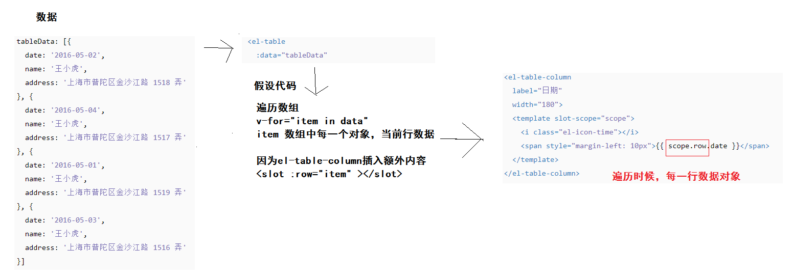
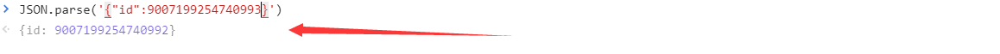
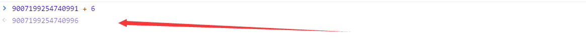
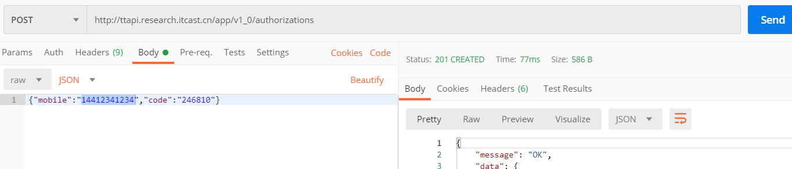

## VUE项目-黑马头条PC端-day06


###01-每日反馈&每日回顾

插槽：*学习目的，能够自己封装基于插槽组件，能够理解第三方组件插槽代码。*

- 默认插槽(只插入一处内容)  `<slot></slot>`
- 备用内容(不用定义好的插槽，默认显示内容)  `<slot> 默认的内容（备用内容） </slot>`
- 具名插槽(多处内容需要插入)  `<slot name="header"></slot>`
- 作用域插槽(当使用插槽的时候，获取组件内部数据) 
  - 定义组件，定义插槽  `<slot name="header" :msg="组件内部数据" ></slot>`
  - 使用组件，使用插槽  
    - vue版本2.6.0之前写法，还是可以使用的。
    - `<div slot="header" slot-scope="scope">使用header插槽 {{scope.msg}}</div>`
    - vue版本2.6.0之后写法
    - `<template v-slot:header="scope">使用header插槽 {{scope.msg}}</template>`


插件：*学习目的，能够自己基于vue封装插件，降低main.js的代码复杂度。*

- 是一个js模块
- 导出一个对象
- 属性 install
- install 指定的是一个函数
- 函数有默认传参 Vue  对象
- 在函数内，基于Vue来扩展原有的功能
  - 全局组件
  - 全局过滤器
  - 全局自定义指令
  - 原型属性或方法


阅读element-ui文档：

- 首先得有需求，比如：实现一个表格
- 然后去文档当中找到对应的组件位置
  - 提供了示例demo，和你需求相近示例。
  - 打开下方的示例源代码，分析代码。
    - 试一试，自己写个小栗子，删一删，改一改。
  - 每一个组件都提供了完善的文档
    - 属性解释
    - 函数解释
    - 事件解释
- 按照自己的需求，使用组件代码。

如果element-ui没有提供组件，寻找第三方的组件，自己尝试封装一个。


###02-内容管理-文章列表-自定义列

需求：文章列表的，封面，状态，操作，使用表格的自定义列表来实现。

分析：scope.row 遍历传给表格的数组，产生的item，认为是行数据。



实现-封面列

```html
        <el-table-column label="封面">
          <template slot-scope="scope">
            <el-image fit="cover" :src="scope.row.cover.images[0]" style="width:150px;height:100px">
              <div slot="error" class="image-slot">
                 
              </div>
            </el-image>
          </template>
        </el-table-column>
```

实现-状态列

```html
        <el-table-column label="状态">
          <template slot-scope="scope">
            <el-tag v-if="scope.row.status===0" type="info">草稿</el-tag>
            <el-tag v-if="scope.row.status===1">待审核</el-tag>
            <el-tag v-if="scope.row.status===2" type="success">审核通过</el-tag>
            <el-tag v-if="scope.row.status===3" type="warning">审核失败</el-tag>
            <el-tag v-if="scope.row.status===4" type="danger">已删除</el-tag>
          </template>
        </el-table-column>
```

实现-操作列

```html
        <el-table-column label="操作" width="120px">
          <template>
            <el-button type="primary" icon="el-icon-edit" circle plain></el-button>
            <el-button type="danger" icon="el-icon-delete" circle plain></el-button>
          </template>
        </el-table-column>
```


### 03-内容管理-分页功能

1、总条数显示：

```diff
      // 文章列表
      articles: [],
+      // 文章总条数
+      total: 0
```

```diff
    // 获取文章列表数据
    async getArticles () {
      const { data: { data } } = await this.$http.get('articles', { params: this.reqParams })
      this.articles = data.results
+      // 总条数
+      this.total = data.total_count
    },
```

```html
 <div slot="header">根据筛选条件共查询到 {{total}} 条结果：</div>
```


2、渲染分页组件：

- 总页数 = 总体条数 / 每页显示多少条（默认10条）  组件自动计算
- total  总条数
- current-page 当前页码
- page-size 每页显示多少条

```html
      <!-- 分页 -->
      <el-pagination
        style="margin-top:20px"
        background
        layout="prev, pager, next"
        :page-size="reqParams.per_page"
        :current-page="reqParams.page"
        :total="total"
      ></el-pagination>
```


3、切换分页：

```diff
      <el-pagination
        style="margin-top:20px"
        background
        layout="prev, pager, next"
        :page-size="reqParams.per_page"
        :current-page="reqParams.page"
        :total="total"
+        @current-change="changePager"
      ></el-pagination>
```

```js
  methods: {
    // 进行分页
    changePager (newPage) {
      // 根据新的页码，重新获取列表数据即可，进行渲染
      this.reqParams.page = newPage
      this.getArticles()
    },
```


###04-内容管理-筛选功能

> 通过 reqParams 收集了筛选条件，自动收集 文章状态  所属频道 ，
>
> 但是没有自动收集 开始时间和结束时间。


1、在选择日期范围后，开始时间和结束时间，进行赋值。

```diff
          <el-date-picker
            v-model="dateArr"
            type="daterange"
            range-separator="至"
            start-placeholder="开始日期"
            end-placeholder="结束日期"
+            @change="changeDate"
+            value-format="yyyy-MM-dd"
          ></el-date-picker>
```

```js
    // 改变日期
    changeDate (dateArr) {
      // 根据选择的时间，给起始和结束数据赋值。
      // 现在日期格式是标准日期格式 Date 格式。
      // 后台接口要是 字符串格式 的日期  例如： `2020-03-01`
      // 在给 起始和结束数据赋值前  转换格式为 字符串日期格式 value-format="yyyy-MM-dd"
      // 如果 执行清空日期操作  dateArr === null
      if (dateArr) {
        this.reqParams.begin_pubdate = dateArr[0]
        this.reqParams.end_pubdate = dateArr[1]
      } else {
        this.reqParams.begin_pubdate = null
        this.reqParams.end_pubdate = null
      }
    },
```


2、点击筛选按钮，根据筛选条件，回到第一页，重新获取文章列表数据且进行渲染。

```html
<div slot="header">根据筛选条件共查询到 {{total}} 条结果：</div>
```

```js
    // 筛选文章
    filterArticle () {
      // 回到第一页
      this.reqParams.page = 1
      // 根据reqParams进行进行查处
      this.getArticles()
    },
```


3、选择频道后，去掉频道的功能（查询全部频道），开启选择框的清空功能。

```html
 <el-select clearable v-model="reqParams.channel_id" placeholder="请选择">
```

但是清空后的是数据是  ''  空字符串，不符合后的要求，要么别传(值null)，要么就传对数字。

```html
<el-select @change="changeChannel" clearable v-model="reqParams.channel_id" placeholder="请选择">
```

```js
    // 选择频道
    changeChannel (value) {
      // 清空的时候值是 '' 不符合后台要求，你应该改成 null  代表查询全部
      if (value === '') this.reqParams.channel_id = null
    },
```


###05-内容管理-编辑跳转

- 编辑文章 与 发布文章  功能相似度非常高，所以在同一个组件下完成。
- 发布文章  路由规则  `{path: '/publish', component: Publish}`
- 编辑文章  路由规则 和 发布文章的路由规则是同一个。
  - 但是编辑文章，需要获取原有文章信息，才能编辑才能修改。
  - 你需要根据文章的ID获取文章信息，填充表单中，然后才能修改。
  - 在这里不能使用动态路由，因为我们使用的路由规则不是动态路由
    - 动态路由：`{path: '/publish/:id', component: Publlish}`
    - 你需要写两套路由规则，所以我们不采用。
  - 我们使用?key=value来进行传参
    - `locahost:8080/#/publish?id=10000`   这个路径符合约定路由规则。

```diff
+          <template slot-scope="scope">
+            <el-button @click="editArticle(scope.row.id)" type="primary" icon="el-icon-edit" circle plain></el-button>
            <el-button type="danger" icon="el-icon-delete" circle plain></el-button>
          </template>
```

```js
 //  methods: {
    // 编辑文章
    editArticle (id) {
      this.$router.push(`/publish?id=${id}`)
    },
```


###06-内容管理-JS最大安全数值

工具作用：

- 使用谷歌开发者工具，NetWork功能，预览接口响应数据。
- 后台接口响应的数据是JSON字符串格式，直接观察数据不是特别方便。
- Preview意思，是把json字符串转成成json对象形式，方便我们了解数据结构。
  - 它使用 JSON.parse()转换json字符串成为json对象。
- Response意思，接口返回的原始数据（json格式字符串）

奇怪现象：

- 原始数据  `"id": 1244088406116401152`
- 预览后数据  ` "id": 1244088406116401200 `
- 我们使用的axios获取数据，默认会使用 `JSON.parse()` 进行转换，说明我们在代码中会遇到和开发者工具中看到的一样的现象。
- 总结：使用 JSON.parse()转换数据ID会有问题。

问题原因：

- 在javascript中如果数字的值太大了，在转换json对象的时候，在进行运算的时候，会有误差。
- 换句话说：数值太大不安全，javascript有最大安全数值，超过了这个数值的运算和转换是不安全的。
- **最大安全数值**
  - 2 的 53 次方
  - Number.MAX_SAFE_INTEGER 






解决问题：

- 原因：插件axios获取数据，默认会使用 `JSON.parse()` 进行转换。
- 方案：我们需要在要在响应拦截器之前，通过第三方的json数据转换插件来转换json字符串。
  - 插件 `json-bigint`  完成超出最大安全数值的数据格式是的转换，采用对象来表示大的数字。
- 步骤：


1、安装

```bash
npm i json-bigint
```

2、使用 

```js
var JSONbig = require('json-bigint');
var json = '{ "value" : 9223372036854775807, "v2": 123 }'
JSONbig.parse(json)
```


项目代码：`src/api/index.js`

```js
import JSONbig from 'json-bigint'
```

```js
// 1. transformResponse配置中的函数   2. 响应拦截器    3. then()catch()
axios.defaults.transformResponse = [data => {
  // data 就是后台原始响应数据  理想情况下：json字符串
  // 其实在现在我们的后台接口有时候，返回的不是json字符串，结果来进行转换会报错
  // 转换后的数据要return出去
  try {
    return JSONbig.parse(data)
  } catch (e) {
    return data
  }
}]
```


###07-内容管理-删除功能

大致的实现步骤：

- 绑定 删除按钮 的点击事件，指定处理函数，且传入文章ID
- 在处理函数中
  - 确认框提示
  - 点击确认，发起删除请求，进行删除
  - 成功：提示 + 更新当前列表
  - 失败：提示

落地到项目当中：

```html
            <el-button @click="deleteArticle(scope.row.id)" type="danger" icon="el-icon-delete" circle plain></el-button>
```

```js
    // 删除文章
    deleteArticle (id) {
      // 确认框
      this.$confirm('此操作将永久删除该文章, 是否继续?', '温馨提示', {
        confirmButtonText: '确定',
        cancelButtonText: '取消',
        type: 'warning'
      }).then(async () => {
        // 点击确认
        try {
          // 发删除请求
          await this.$http.delete(`articles/${id}`)
          // 成功提示
          this.$message.success('删除成功')
          // 更新列表
          this.getArticles()
        } catch (e) {
          // 错误提示
          this.$message.error('删除失败')
        }
      }).catch(() => {})
    },
```

在测试删除文章：

- 使用自己的账户，别用13911111111账户，测试账户数据受保护，不能删除。
-  http://zhoushugang.gitee.io/hm-toutiao-pc-93/#/article   去录入文章，使用自己账户。
  - 文章标题    10个字
  - 文章内容     10个字
  - 封面选择一张
  - 频道需要选择
- 然后在自己开发的项目中，使用自己的账户登录，然后测试删除文章。


###08-内容管理-注册方式

方式1：

- 百度一下，下载一个APP叫黑马头条，目前支持安卓手机，安装即可。
- 使用 自己的手机号 +  万能验证码246810  进行登录，其实就是注册。

方式2：

- 使用postman调用移动端的登录接口，其实就是注册。
  - 地址： http://ttapi.research.itcast.cn/app/v1_0/authorizations 
  - 请求：post
  - 参数：`{"mobile":"14412341234","code":"246810"}`




###09-素材管理-路由及组件

创建组件：`src/views/Image.vue`

```html
<template>
  <div class='images-container'>Image</div>
</template>

<script>
export default {
  name: 'my-image'
}
</script>

<style scoped lang='less'></style>
```

配置路由：`src/router/index.js`

```js
import Image from '../views/Image.vue'
```

```diff
    children: [
      { path: '/', component: Welcome },
      { path: '/article', component: Article },
+      { path: '/image', component: Image }
    ]
```


###10-素材管理-基础布局

卡片容器

- 头部：面包屑组件
- 内容：
  - 按钮栏
  - 图片列表
  - 分页组件

具体代码

```html
<template>
  <div class='images-container'>
    <el-card>
      <div slot="header">
        <my-bread>素材管理</my-bread>
      </div>
      <!-- 按钮栏 -->
      <div class="btn_box">
        <el-radio-group v-model="reqParams.collect" size="small">
          <el-radio-button :label="false">全部</el-radio-button>
          <el-radio-button :label="true">收藏</el-radio-button>
        </el-radio-group>
        <el-button type="success" size="small" style="float:right">添加收藏</el-button>
      </div>
      <!-- 图片列表 -->
      <div class="img_list">
        <div class="img_item" v-for="i in 10" :key="i">
          
          <div class="option">
            <span class="el-icon-star-off"></span>
            <span class="el-icon-delete"></span>
          </div>
        </div>
      </div>
      <!-- 分页 -->
      <el-pagination
        background
        layout="prev, pager, next"
        :total="1000">
      </el-pagination>
    </el-card>
  </div>
</template>

<script>
export default {
  name: 'my-image',
  data () {
    return {
      // 查询素材参数
      reqParams: {
        // 默认查询全局 false 收藏 true
        collect: false,
        page: 1,
        per_page: 10
      }
    }
  }
}
</script>

<style scoped lang='less'>
// 图片列表
.img_list{
  margin-top: 20px;
  .img_item{
    width: 180px;
    height: 180px;
    border: 1px dashed #ddd;
    display: inline-block;
    position: relative;
    margin-right: 50px;
    margin-bottom: 15px;
    img {
      width: 100%;
      height: 100%;
      display: block;
    }
    .option {
      position: absolute;
      left: 0;
      bottom: 0;
      height: 30px;
      line-height: 30px;
      background: rgba(0,0,0,0.3);
      text-align: center;
      width: 100%;
      color: #fff;
      span{
        margin: 0 30px;
      }
    }
  }
}
</style>

```


