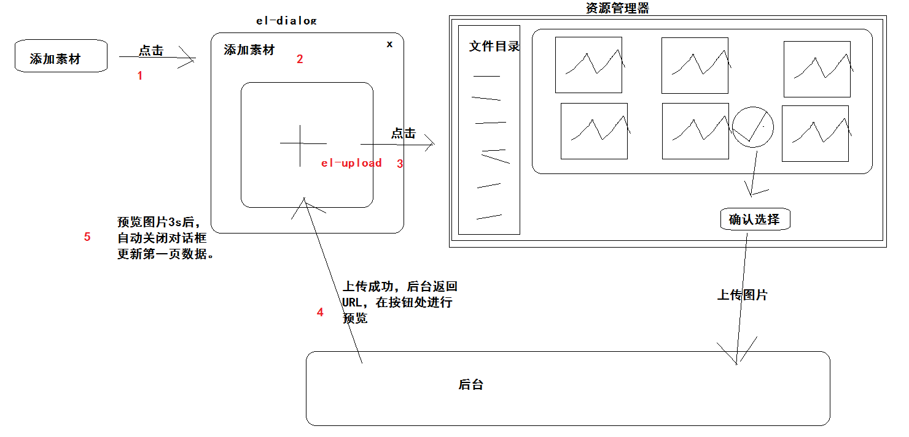

## VUE项目-黑马头条PC端-day07

### 01-每日反馈

| 姓名 | 意见或建议                                              |
| ---- | ------------------------------------------------------- |
| ***  | 为什么绑定事件后面的方法，有的时候带括号，有的时候不带, |

```html
<template>
  <div @click="fn"></div>
</template>
```

- 绑定事件指函数带不带括号：
  - 如果你不需要传参，带与不带没有任何差别。
  - 如果你需要传参：
    - 需要默认传参，不带括号。
    - 自己来传参，带上括号，自己需要传入实参。

### 02-每日回顾

- 内容管理-自定义列
- 使用分页组件实现分页功能
- 实现日期组件修改时赋值给请求参数
- 筛选功能
- 编辑跳转
- 删除功能
  - 问题：ID超出了最大的安全数值
  - 处理：使用第三方的插件 json-bigint 
  - 位置：axios的配置，transformResponse进行处理
- 素材管理
  - 基础布局


###03-素材管理-渲染列表

实现的大致步骤：

1. 在data声明素材列表数据
2. 在组件初始化的时候获取素材列表数据
   1. 在methods中声明获取数据的函数，获取数据后赋值给data中的列表数据。
   2. 在created中调用这个函数即可
3. 在模板中进行渲染。


具体在项目实现：

- 声明数据

```diff
  data () {
    return {
      // 查询素材参数
      reqParams: {
        // 默认查询全局 false 收藏 true
        collect: false,
        page: 1,
        per_page: 10
      },
+      // 素材列表
+      images: []
    }
  },
```

- 获取数据

```js
  created () {
    this.getImages()
  },
  methods: {
    // 获取素材列表
    async getImages () {
      const { data: { data } } = await this.$http.get('user/images', { params: this.reqParams })
      this.images = data.results
    }
  }
```

- 渲染模板

```html
        <div class="img_item" v-for="item in images" :key="item.id">
          
          <div class="option">
            <span class="el-icon-star-off" :style="{color:item.is_collected?'red':'#fff'}"></span>
            <span class="el-icon-delete"></span>
          </div>
        </div>
```


###04-素材管理-分页功能

实现的大致步骤：

1. 声明总条数数据，且在获取列表数据时，给总条数数据赋值。
2. 让分页组件动态绑定 total 属性为，总条数数据。
3. 让分页组件动态绑定 page-size 属性为，请求参数中的每页多少条的数据。
4. 让分页组件动态绑定 current-page 属性为，请求参数中的第几页的数据。
5. 需要实现分页功能，给组件绑定一个事件，current-change指定函数，在函数中实现分页。


具体在项目实现：

- 获取总条数数据

```diff
      // 素材列表
      images: [],
+      // 总条数
+      total: 0
```

```diff
    // 获取素材列表
    async getImages () {
      const { data: { data } } = await this.$http.get('user/images', { params: this.reqParams })
      this.images = data.results
+      this.total = data.total_count
    }
```

- 动态绑定分页组件属性

```html
      <!-- 分页 -->
      <el-pagination
        background
        layout="prev, pager, next"
        @current-change="changePager"
        :page-size="reqParams.per_page"
        :current-page="reqParams.page"
        :total="total">
      </el-pagination>
```

- 实现分页函数

```js
    // 切换分页
    changePager (newPage) {
      this.reqParams.page = newPage
      this.getImages()
    },
```


###05-素材管理-切换全部与收藏

实现的大致步骤：

1. 监听切换了单选框（素材状态）的值，绑定事件： change 指定函数。
2. 在指定函数中，回到第一页，重新获取数据，实现列表与分页重新渲染。
3. 在全局查询状态，显示图片底部的操作栏，在收藏查询状态，隐藏。


具体在项目实现：

- 绑定事件

```html
<el-radio-group @change="changeCollect()" v-model="reqParams.collect" size="small">
```

- 处理函数

```js
    // 切换全局与收藏
    changeCollect () {
      this.reqParams.page = 1
      this.getImages()
    },
```

- 控制操作栏显示与隐藏

```html
<div class="option" v-if="!reqParams.collect">
```


###06-素材管理-添加收藏&取消收藏

实现的大致步骤：

1. 绑定 收藏按钮 的点击事件，指定对应处理函数，传入参数（图片ID、图片状态）
2. 在处理函数中，发送修改图片状态的请求，得提交参数给后台
   1. 图片ID在路径上拼接
   2. 图片状态（你想改的状态）在请求体进行提交  collect
   3. 请求方式 PUT  地址 user/images/:target  指的是图片ID
3. 响应成功：进行成功（添加|取消）提示，更新当前图片状态。
4. 响应失败：进行错误提示


具体在项目实现：

- 绑定事件

```html
<span @click="toggleStatus(item)" class="el-icon-star-off" :style="{color:item.is_collected?'red':'#fff'}"></span>
```

- 处理函数

```js
    // 切换 添加收藏 与 取消收藏
    async toggleStatus (item) {
      try {
        // 修改请求
        const { data: { data } } = await this.$http.put(`user/images/${item.id}`, {
          collect: !item.is_collected
        })
        // data.collect 修改后的图片状态
        // 提示
        this.$message.success(data.collect ? '添加收藏成功' : '取消收藏成功')
        // 视图：收藏按钮颜色样式
        // item 就是渲染当前图片的，修改item即可驱动视图修改
        item.is_collected = data.collect
      } catch (e) {
        this.$message.error('操作失败')
      }
    },
```


###07-素材管理-删除功能

实现的大致步骤：

1. 绑定  删除按钮 的点击事件，指的处理函数，函数中传入参数：图片ID
2. 在处理函数中，确认框提示，点击确认后发起删除请求即可
   1. 请求方式  DELETE
   2. 请求地址  user/images/:target  :target 是图片ID
3. 响应成功：成功提示+更新当前页数据
4. 响应失败：错误提示


具体在项目实现：

- 绑定事件

```html
<span @click="deleteImage(item.id)" class="el-icon-delete"></span>
```

- 处理函数

```js
    // 删除图片素材
    deleteImage (id) {
      this.$confirm('此操作将永久删除该图片素材, 是否继续?', '温馨提示', {
        confirmButtonText: '确定',
        cancelButtonText: '取消',
        type: 'warning'
      }).then(async () => {
        // 点击确认
        try {
          // 请求
          await this.$http.delete(`user/images/${id}`)
          // 成功提示
          this.$message.success('删除成功')
          // 更新当前页素材列表
          this.getImages()
        } catch (e) {
          // 失败提示
          this.$message.error('删除失败')
        }
      }).catch(() => {})
    },
```


###08-素材管理-添加素材

实现的大致步骤：

1. 绑定  添加素材 按钮点击事件，指定对应的处理函数
2. 在处理函数中，打开一个对话框（el-dialog）组件：
   1. 标题：添加素材
   2. 内容：上传组件（el-upload）
3. 当点击上传按钮的时候，从本地选择一张图片，提交给后台进行上传。
4. 上传成功后，成功提示 + 上传按钮处预览图片（上传成功后台给图片地址）
5. 然后在3s时间后，自动关闭对话框，回到第一页，更新图片素材列表。




具体在项目实现：

- 点击添加素材打开对话框

```html
<el-button @click="openAddImgDialog()" type="success" size="small" style="float:right">添加素材</el-button>
```

```html
    <!-- 对话框 -->
    <el-dialog title="添加素材" :visible.sync="dialogVisible" width="300px">
      <span>上传组件</span>
    </el-dialog>
```

```js
    // 打开添加素材对话框
    openAddImgDialog () {
      // 1. 准备对话框
      // 2. 才能打开它
      this.dialogVisible = true
    },
```

- 先分析上传组件的示例代码

```html
<!-- class="avatar-uploader" 不能，需要对应样式 -->
<!-- action="https://jsonplaceholder.typicode.com/posts/" 上传接口地址 -->
<!-- :show-file-list="false" 上传一张图片，不需要文件列表 -->
<!-- :on-success="handleAvatarSuccess" 绑定的函数在上传成功后户调用 -->
<el-upload
  class="avatar-uploader"
  action="https://jsonplaceholder.typicode.com/posts/"
  :show-file-list="false"
  :on-success="handleAvatarSuccess">
  <!-- 两个标签  上传按钮  预览图片 只能显示一个 -->
  <!-- v-if="imageUrl" 有图片地址，那显示图片，把地址绑定src -->
  
  <!-- v-else  没有图片地址 ，那显示上传按钮  +号按钮 -->
  <!-- 同级的标签，才能v-if和v-else配合使用  -->
  <i v-else class="el-icon-plus avatar-uploader-icon"></i>
</el-upload>

<style>
  .avatar-uploader .el-upload {
    border: 1px dashed #d9d9d9;
    border-radius: 6px;
    cursor: pointer;
    position: relative;
    overflow: hidden;
  }
  .avatar-uploader .el-upload:hover {
    border-color: #409EFF;
  }
  .avatar-uploader-icon {
    font-size: 28px;
    color: #8c939d;
    width: 178px;
    height: 178px;
    line-height: 178px;
    text-align: center;
  }
  .avatar {
    width: 178px;
    height: 178px;
    display: block;
  }
</style>

<script>
  export default {
    data() {
      return {
        imageUrl: ''
      };
    },
    methods: {
      // 默认传参：响应对象  文件对象
      handleAvatarSuccess(res, file) {
        // 上传成功 
      }
    }
  }
</script>
```

- 上传组件完成布局

样式： `src/styles/index.less`

```less
// 公用的样式

// 上传组件样式,style标签上加了scoped,给其他组件的样式是不能生效的。
// 自己组件的标签，你在当前组件的template中能看到的，就属于自己的标签，style[scoped]写的样式生效。
// 其他组件的标签，style[scoped]写的样式作用不了其他组件的样式。
.avatar-uploader{
  text-align: center;
}
.avatar-uploader .el-upload {
  border: 1px dashed #d9d9d9;
  border-radius: 6px;
  cursor: pointer;
  position: relative;
  overflow: hidden;
}
.avatar-uploader .el-upload:hover {
  border-color: #409EFF;
}
.avatar-uploader-icon {
  font-size: 28px;
  color: #8c939d;
  width: 178px;
  height: 178px;
  line-height: 178px;
  text-align: center;
}
.avatar {
  width: 178px;
  height: 178px;
  display: block;
}
```

结构：`src/views/Images.vue`

```html
      <el-upload
        class="avatar-uploader"
        action="https://jsonplaceholder.typicode.com/posts/"
        :show-file-list="false"
        :on-success="uploadImageSuccess">
        
        <i v-else class="el-icon-plus avatar-uploader-icon"></i>
      </el-upload>
```

数据：`src/views/Images.vue`

```js
      // 上传成功后图片地址（预览）
      imageUrl: null
```

方法：`src/views/Images.vue`

```js
    // 上传图片成功
    uploadImageSuccess () {

    },
```

- 开始进行上传的配置
  - 上传地址：http://ttapi.research.itcast.cn/mp/v1_0/user/images
  - 请求方式：post （上传组件默认提交方式post）
  - 字段名称：image  代表  图片数据  （name="image"）
  - 携带token：需要自己配置请求头 (  headers="{}" )
  - 成功之后：{data:{url:'图片地址'}}  响应主体数据

```diff
      <el-upload
        class="avatar-uploader"
+        action="http://ttapi.research.itcast.cn/mp/v1_0/user/images"
+        name="image"
+        :headers="headers"
        :show-file-list="false"
        :on-success="uploadImageSuccess">
        
        <i v-else class="el-icon-plus avatar-uploader-icon"></i>
      </el-upload>
```

```js
      // 上传组件的请求头  (data中声明的数据)
      headers: {
        Authorization: `Bearer ${auth.getUser().token}`
      }
```

- 上传成功处理逻辑
  - 提示 + 预览
  - 3s后，关闭对话框 + 更新第一页（根据后台排序）  + 清空预览图

```js
    // 上传图片成功
    uploadImageSuccess (res) {
      // 预览
      this.imageUrl = res.data.url
      // 提示
      this.$message.success('上传素材成功')
      // 3s后
      window.setTimeout(() => {
        // 关闭对话框
        this.dialogVisible = false
        // 更新第一页
        this.reqParams.page = 1
        this.getImages()
        // 考虑：重新打开对话框的时候，看到加号图标，而不是之前预览的图片
        this.imageUrl = null
      }, 3000)
    },
```


###09-发布文章-路由与组件

准备组件：`src/views/Publish.vue`

```html
<template>
  <div class='publish-container'>Publish</div>
</template>

<script>
export default {
  name: 'my-publish'
}
</script>

<style scoped lang='less'></style>

```

路由规则：`src/router/index.js`

```js
import Publish from '../views/Publish.vue'
```

```diff
    children: [
      { path: '/', component: Welcome },
      { path: '/article', component: Article },
      { path: '/image', component: Image },
+      { path: '/publish', component: Publish }
    ]
```


###10-发布文章-基础布局

基础布局：

- 卡片组件
  - 头部（面包屑）
  - 内容
    - 表单
      - 标题
      - 内容（富文本）
      - 封面（封装封面组件）
      - 频道（封装频道组件）
      - 按钮

布局代码：

```html
<template>
  <div class='publish-container'>
    <el-card>
      <div slot="header">
        <my-bread>发布文章</my-bread>
      </div>
      <!-- 表单 -->
      <el-form label-width="120px">
        <el-form-item label="标题：">
          <el-input v-model="articleForm.title" placeholder="请输入文章标题" style="width:400px"></el-input>
        </el-form-item>
        <el-form-item label="内容：">
          富文本
        </el-form-item>
        <el-form-item label="封面：">
          <el-radio-group v-model="articleForm.cover.type">
            <el-radio :label="1">单图</el-radio>
            <el-radio :label="3">三图</el-radio>
            <el-radio :label="0">无图</el-radio>
            <el-radio :label="-1">自动</el-radio>
          </el-radio-group>
          <div>
            封面组件
          </div>
        </el-form-item>
        <el-form-item label="频道：">
          频道组件
        </el-form-item>
        <el-form-item>
          <el-button type="primary">发布文章</el-button>
          <el-button>存入草稿</el-button>
        </el-form-item>
      </el-form>
    </el-card>
  </div>
</template>

<script>
export default {
  name: 'my-publish',
  data () {
    return {
      // 文章表单数据对象
      articleForm: {
        title: null,
        content: null,
        cover: {
          type: 1,
          images: []
        },
        channel_id: null
      }
    }
  }
}
</script>

<style scoped lang='less'></style>

```

总结：待完成

- 频道组件
- 富文本
- 封面组件


###11-发布文章-频道组件封装

封装原因：

1. 内管理组件与发布文章组件使用同一个频道功能，所以需要封装。
2. 大家的组件封装能力去考虑，提高大家组件相关知识掌握。

预备知识：

1. 组件通讯：父组件传值给子组件

```html
<!-- 父组件 -->
<template>
  <com-child :value="msg"></com-child>
</template> 
<script>
export default {
  name: 'com-parent',
  data () {
    return {
      msg: '父组件数据'
    }
  }
}
</script>
```

```html
<!-- 子组件 -->
<template>
  <div>
    父组件数据：{{value}}
  </div>
</template> 
<script>
export default {
  name: 'com-child',
	props: ['value']
}
</script>
```

2. 组件通讯：子组件传值给父组件

```html
<!-- 父组件 -->
<template>
  <!-- $event 触发的是自定义事件：传递的数据 -->
  <!-- $event 触发的是原生事件：事件对象 -->
  <com-child @input="msg=$event"></com-child>
  子组件数据：{{msg}}
</template> 
<script>
export default {
  name: 'com-parent',
  data () {
    return {
      msg: ''
    }
  }
}
</script>
```

```html
<!-- 子组件 -->
<template>
  <button @click="fn">按钮</button>
</template> 
<script>
export default {
  name: 'com-child',
  methods: {
    fn () {
      // 通过自定义事件发送数据
      this.$emit('input', '子组件数据')
    }
  }
}
</script>
```

3. v-model语法糖原理

   1. 双向数据绑定  `data:{msg:'数据'}`
   2. 赋值：`:value="msg"`
   3. 改值：`@input="msg=$event.target.value"`
   4. 以上两句代码，是v-model绑定表单元素的完整代码。
   5. 如果使用v-model绑定在组件上：
      1. 父传子：`:value="msg"`
      2. 子传父：`@input="msg=$event"`
      3. 完成以上功能代码，组件就支持了v-model指令。

   6. 总结：**组件如何实现v-model。**


组件的封装步骤：

- 先实现组件功能

组件：`src/components/my-channel.vue`

```html
<template>
  <el-select @change="changeChannel" clearable v-model="channelId" placeholder="请选择">
    <el-option v-for="item in channelOptions" :key="item.id" :label="item.name" :value="item.id"></el-option>
  </el-select>
</template>

<script>
export default {
  name: 'my-channel',
  data () {
    return {
      // 频道ID
      channelId: null,
      // 频道下拉选项
      channelOptions: []
    }
  },
  created () {
    this.getChannelOptions()
  },
  methods: {
    // 获取频道下拉选项数据
    async getChannelOptions () {
      // 解构是针对res的，那么res的数据结构 {data:{message:'OK',data:{channels:[]}}}
      // const {data} = res 现在：data响应主体  res.data
      // const { data: { data } } = res  现在：data具体data字段对应数据，res.data.data
      const {
        data: { data }
      } = await this.$http.get('channels')
      // this.channelOptions = [{id:'频道ID',name:'频道名称'},...]
      this.channelOptions = data.channels
    },
    // 选择频道
    changeChannel (value) {
      if (value === '') this.channelId = null
    }
  }
}
</script>

<style scoped lang='less'></style>
```

注册：`src/utils/plugin.js`

```diff
// 基于vue的插件
import MyBread from '@/components/my-bread'
+import MyChannel from '@/components/my-channel'
export default {
  // Vue 来源：main.js使用Vue.use(插件)，调用插件中install函数，且或传入Vue对象。
  install (Vue) {
    // 基于Vue对象来扩展Vue功能
    Vue.component(MyBread.name, MyBread)
+    Vue.component(MyChannel.name, MyChannel)

    // 将来，你有其他的全局组件，全局过滤器，全局自定义指令及原型属性或函数，都可以在这里进行扩展。
  }
}
```

使用：`src/views/article.vue`

```html
        <el-form-item label="频道：">
          <!-- 自己封装的频道组件 -->
          <my-channel></my-channel>
        </el-form-item>
```

- 再实现双向绑定

父传子：

`src/views/article.vue`

```html
<my-channel :value="reqParams.channel_id"
```

`src/components/my-channel.vue`

```js
  props: ['value'],
```

```html
<el-select @change="changeChannel" clearable :value="value" 
```

子传父：

`src/components/my-channel.vue`

```diff
    // 选择频道
    changeChannel (value) {
+      if (value === '') value = null
      // 把 value 数据提交给父组件，让父组件给 reqParams.channel_id赋值。
+      this.$emit('input', value)
    }
```

`src/views/article.vue`

```html
<my-channel :value="reqParams.channel_id" @input="reqParams.channel_id=$event">
```

简写：

```html
<my-channel v-model="reqParams.channel_id"></my-channel>
```


