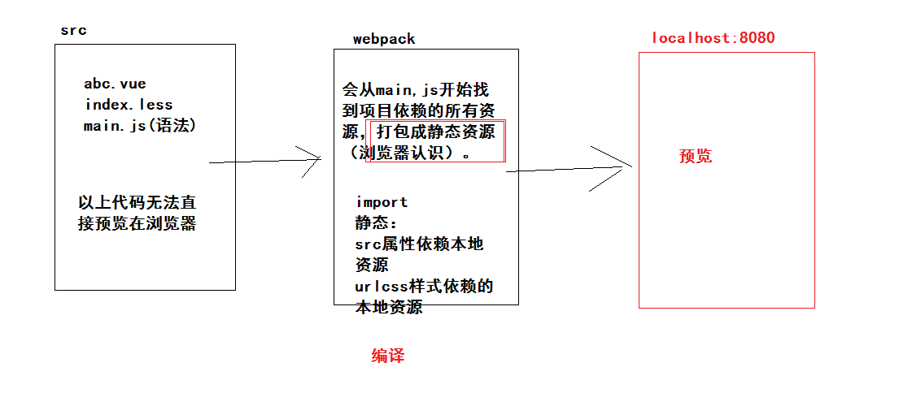

## VUE项目-黑马头条PC端-day08

### 01-每日反馈

| 姓名 | 意见或建议                                                   |
| ---- | ------------------------------------------------------------ |
| ***  | 现在讲的有些难理解了。希望老师能把之前讲过的知识点，遇到再简单说下，同时增加记忆，之前的忘了就不知道怎么回事了，谢谢老师！ |

- 使用之前的知识先回顾。

### 02-每日回顾

- 素材管理
  - 列表渲染
  - 分页
  - 切换全部收藏
  - 取消收藏  添加收藏
  - 删除
  - 添加图片
- 发布文章
  - 基础布局
  - 封装频道组件
    - 父传子
    - 子传父
    - v-model语法糖原理
    - 组件怎么去支持v-model


### 03-发布文章-富文本使用

vue资源项目

- 地址： https://gitee.com/neekko33/awesome-vue?_from=gitee_search 

富文本编辑器

- 地址： https://www.npmjs.com/package/vue-quill-editor 

vue-quill-editor 基本使用步骤

- 安装：`npm install vue-quill-editor`
- 局部注册：

```js
// 导入样式
import 'quill/dist/quill.core.css'
import 'quill/dist/quill.snow.css'
import 'quill/dist/quill.bubble.css'
// 导入组件
import { quillEditor } from 'vue-quill-editor'
// 注册组件
export default {
  components: {
    quillEditor
  }
}
```

- 使用组件：

```html
<!--
- content字段名称
- editorOption组件配置对象
-->
<quill-editor v-model="content" :options="editorOption"></quill-editor>
```


在项目中使用：

`src/views/Publish.vue`

导入注册

```js
// 导入样式
import 'quill/dist/quill.core.css'
import 'quill/dist/quill.snow.css'
import 'quill/dist/quill.bubble.css'
// 导入组件
import { quillEditor } from 'vue-quill-editor'
export default {
  components: {
    quillEditor
  },
```

使用组件

```html
        <el-form-item label="内容：">
          <quill-editor v-model="articleForm.content" :options="editorOption"></quill-editor>
        </el-form-item>
```

声明数据

```js
      // 富文本配置对象
      editorOption: {}
```


### 04-发布文章-富文本定制

功能修改

- 工具栏配置    精简
- 占位提示   去除

文档： https://quilljs.com/docs/modules/toolbar/   (quill富文本的工具栏配置)

```js
var toolbarOptions = [
  ['bold', 'italic', 'underline', 'strike'],        // toggled buttons
  ['blockquote', 'code-block'],

  [{ 'header': 1 }, { 'header': 2 }],               // custom button values
  [{ 'list': 'ordered'}, { 'list': 'bullet' }],
  [{ 'script': 'sub'}, { 'script': 'super' }],      // superscript/subscript
  [{ 'indent': '-1'}, { 'indent': '+1' }],          // outdent/indent
  [{ 'direction': 'rtl' }],                         // text direction

  [{ 'size': ['small', false, 'large', 'huge'] }],  // custom dropdown
  [{ 'header': [1, 2, 3, 4, 5, 6, false] }],

  [{ 'color': [] }, { 'background': [] }],          // dropdown with defaults from theme
  [{ 'font': [] }],
  [{ 'align': [] }],

  ['clean']                                         // remove formatting button
];

// 初始化插件
var quill = new Quill('#editor', {
  modules: {
    toolbar: toolbarOptions
  },
  theme: 'snow'
});
```

以上是一个相对比较完整的工具栏配置，仅供参考。


项目代码：

```js
      // 富文本配置对象
      editorOption: {
        // 占位配置
        placeholder: '',
        modules: {
          // 配置工具栏
          toolbar: [
            ['bold', 'italic', 'underline', 'strike'],
            ['blockquote', 'code-block'],
            [{ header: 1 }, { header: 2 }],
            [{ list: 'ordered' }, { list: 'bullet' }],
            [{ indent: '-1' }, { indent: '+1' }],
            ['image']
          ]
        }
      }
```


样式修改

- 内容高度    写死
- 工具栏间距   紧凑


`src/styles/index.less`

```less
// 覆盖富文本样式(publish-container目的提高选择器优先级)
.publish-container .ql-editor{
  height: 300px;
}
.publish-container .ql-toolbar.ql-snow{
  padding: 0 8px;
}
```


### 05-发布文章-封面组件-需求分析

实现封装封面组件大致步骤：

1. 准备一个新的组件，在components文件夹下。
2. 组件布局包含两部分：
   1. 默认显示 **图片按钮**（预览封面图功能）
   2. 点击图片按钮后，显示 封面图**选择对话框**
3. 图片选择对话框
   1. 使用tab组件，完成素材库与上传图片的切换
   2. 素材库：
      1. 素材列表渲染
      2. 分页功能
      3. 全部与收藏切换
      4. 选中素材图片功能
   3. 上传图片
      1. 实现用户图片素材上传
   4. 确认图片功能
      1. 素材库确认（保证选中了图片，没有警告提示）
      2. 上传图片确认（保证上传了图片，没有警告提示）
      3. 在图片按钮处进行预览
   5. 打开对话框
      1. 把之前选中的效果清除
      2. 把自取上传的图片清除
4. 实现组件的双向绑定


### 06-发布文章-封面组件-基础结构

基础结构：

- 按钮图片
- 对话框
  - tab组件
    - 素材库
    - 上传图片

具体代码：

- 组件 `src/components/my-cover.vue`

```html
<template>
  <div class="my-cover">
    <!-- 图片按钮 -->
    <div class="btn_img" @click="openDialog()">
      
    </div>
    <!-- 对话框 -->
    <el-dialog :visible.sync="dialogVisible" width="720px">
      <!-- tab组件 -->
      <el-tabs v-model="activeName" type="card">
        <el-tab-pane label="素材库" name="image">素材库内容</el-tab-pane>
        <el-tab-pane label="上传图片" name="upload">上传图片内容</el-tab-pane>
      </el-tabs>
      <span slot="footer" class="dialog-footer">
        <el-button @click="dialogVisible = false">取 消</el-button>
        <el-button type="primary" @click="dialogVisible = false">确 定</el-button>
      </span>
    </el-dialog>
  </div>
</template>

<script>
export default {
  name: 'my-cover',
  data () {
    return {
      // 控制对话框显示隐藏
      dialogVisible: false,
      // 当前tabs组件激活的选项卡的name属性的值
      activeName: 'image'
    }
  },
  methods: {
    openDialog () {
      this.dialogVisible = true
    }
  }
}
</script>

<style scoped lang='less'>
// 图片按钮
.btn_img {
  width: 150px;
  height: 150px;
  border: 1px dashed #ddd;
  img {
    width: 100%;
    height: 100%;
    display: block;
  }
}
</style>
```

- 注册 `src/utils/plugin.js`

```js
import MyCover from '@/components/my-cover'
```

```diff
    Vue.component(MyBread.name, MyBread)
    Vue.component(MyChannel.name, MyChannel)
+    Vue.component(MyCover.name, MyCover)
```

- 使用 `src/views/Publish.vue`

```html
          <!-- 封面图组件 -->
          <div style="margin-top:10px">
            <my-cover></my-cover>
          </div>
```


### 07-发布文章-封面组件-素材库布局

基础布局：

- 结构

```html
        <el-tab-pane label="素材库" name="image">
          <!-- 切换按钮 -->
          <el-radio-group v-model="reqParams.collect" size="small">
            <el-radio-button :label="false">全部</el-radio-button>
            <el-radio-button :label="true">收藏</el-radio-button>
          </el-radio-group>
          <!-- 素材列表 -->
          <div class="img_list">
            <div class="img_item" v-for="i in 8" :key="i">
              
            </div>
          </div>
          <!-- 分页组件 -->
          <el-pagination
            background
            layout="prev, pager, next"
            :total="1000">
          </el-pagination>
        </el-tab-pane>
```

- 样式

`my-cover.vue`

```less
// 素材列表
.img_list{
  margin-top: 15px;
  .img_item{
    width: 150px;
    height: 120px;
    border: 1px dashed #ddd;
    display: inline-block;
    margin-right: 15px;
    img {
      width: 100%;
      height: 100%;
      display: block;
    }
  }
}
```

`styles/index.less`

```css
// 覆盖 my-cover 组件中的对话框样式
.my-cover .el-dialog__body{
  padding-bottom: 0;
}
```

- 数据

```js
      // 筛选条件对象
      reqParams: {
        // 列表类型（全部，收藏）
        collect: false,
        page: 1,
        per_page: 8
      }
```


### 08-发布文章-封面组件-素材库列表

- 渲染列表
- 分页功能
- 切换 全部与收藏


依赖数据：

```js
      // 素材列表
      images: [],
      // 总条数
      total: 0
```

获取数据：

```diff
    // 打开对话框
    openDialog () {
      this.dialogVisible = true
+      // 只有用户打开了对话框，才有选择素材的需求，再去加载数据才是合理的。
+      // 而且每次打开对话框，都可以拿到最新的素材数据。
+      this.getImages()
    },
```

依赖函数：

```js
    // 全部 收藏
    changeCollect () {
      this.reqParams.page = 1
      this.getImages()
    },
    // 分页函数
    changePager (newPage) {
      this.reqParams.page = newPage
      this.getImages()
    },
    // 获取素材列表
    async getImages () {
      const { data: { data } } = await this.$http.get('user/images', { params: this.reqParams })
      this.images = data.results
      this.total = data.total_count
    }
```

渲染界面：

```html
 <!-- 切换按钮 -->
          <el-radio-group @change="changeCollect" v-model="reqParams.collect" size="small">
            <el-radio-button :label="false">全部</el-radio-button>
            <el-radio-button :label="true">收藏</el-radio-button>
          </el-radio-group>
          <!-- 素材列表 -->
          <div class="img_list">
            <div class="img_item" v-for="item in images" :key="item.id">
              
            </div>
          </div>
          <!-- 分页组件 -->
          <el-pagination
            background
            layout="prev, pager, next"
            hide-on-single-page
            @current-change="changePager"
            :page-size="reqParams.per_page"
            :current-page="reqParams.page"
            :total="total">
          </el-pagination>
```


###09-发布文章-封面组件-选中素材

实现的大致步骤：

1. 图片选中效果如何实现？

   1. 如果使用 div 来实现遮罩+图标，需要给当前结构加入额外的标签，麻烦。
   2. 但是使用 伪元素 来实现遮罩+图标，咱们只需要写样式就可以，方便些。
   3. 给 div.img_item 加伪元素。`.img_item.selected::after{ //样式 }`

2. 图片选中逻辑如何实现？

   1. 当你点击 图片的时候  给当前点击的图片加上 selected类 其他图片去除 selectd类
   2. jquery：操作dom

   ```js
   $('.img_item').click(function(){ 
     $(this).addClass('selected').sliblings().removeClass('selected')
   })
   ```

   3. vue：操作数据
      1. 当你点击一张图的时候，记住这张图片的唯一标识
      2. 遍历图片的时候，你拿着这个标识去判断，遍历的当前图片标识===记录的标签
         1. 如果一样，给当前图片加上 selected
         2. 如果不一样，给当前图片移除这个类
      3. 唯一标识：使用图片地址，确认图片的时候可以直接使用，作为封面图地址。


在项目中的实现：

写样式：`src/components/my-cover.vue`

```less
// 素材列表
.img_list{
  margin-top: 15px;
  .img_item{
    width: 150px;
    height: 120px;
    border: 1px dashed #ddd;
    display: inline-block;
    margin-right: 15px;
    position: relative;
    img {
      width: 100%;
      height: 100%;
      display: block;
    }
    // 给.img_item加上一个类.selected
    // 这个类上包含一个::after的伪元素
    // &在less中表示作用：连接符
    // .a{.b{}}  ===> .a .b{}  后代选择器
    // .a{&.b{}} ===> .a.b{} 交集选择器
    // 解析后：.img_list.selected::after{}  目标
    &.selected::after{
      content: "";
      position: absolute;
      left: 0;
      top: 0;
      width: 100%;
      height: 100%;
      background: rgba(0,0,0,0.3) url(../assets/selected.png) no-repeat center / 50px 50px;
    }
  }
}
```

写逻辑：`src/components/my-cover.vue`

- 数据

```js
      // 选中的图片地址
      selectedImageUrl: null
```

- 记录

```html
            <div
              @click="selectedImage(item.url)"
              class="img_item"
```

```js
    // 选中图片
    selectedImage (url) {
      this.selectedImageUrl = url
    },
```

- 判断，添加类

```diff
            <div
+              :class="{selected: item.url === selectedImageUrl}"
              @click="selectedImage(item.url)"
              class="img_item"
              v-for="item in images"
              :key="item.id">
              
            </div>
```


###10-发布文章-封面组件-上传图片

实现的大致步骤：

1. 需求使用上传组件
2. 设置  完整上传路径
3. 设置  提交文件数据字段名称
4. 设置  请求头
5. 上传成功：只需预览


在项目中的实现：

- 结构

```html
        <el-tab-pane label="上传图片" name="upload">
          <!-- 上传组件 -->
          <el-upload
            class="avatar-uploader"
            action="http://ttapi.research.itcast.cn/mp/v1_0/user/images"
            name="image"
            :headers="headers"
            :show-file-list="false"
            :on-success="uploadSuccess">
            
            <i v-else class="el-icon-plus avatar-uploader-icon"></i>
          </el-upload>
        </el-tab-pane>
```

- 数据

```js
      // 上传的请求头
      headers: {
        Authorization: `Bearer ${auth.getUser().token}`
      },
      // 上传的图片地址
      uploadImageUrl: null
```

- 函数

```js
    // 上传图片
    uploadSuccess (res) {
      // 预览 + 提示
      this.uploadImageUrl = res.data.url
      this.$message.success('上传图片成功')
    },
```


### 11-发布文章-封面组件-确认图片

实现的大致步骤：

1. 点击对话框的确认按钮，确认图片
2. 确认图片前需要校验
   1. 如果tab激活素材库，判断有没有选中一张图片，没有选中需要提示+阻止程序运行
      1. 提示：请先选中一张图片
   2. 如果tab激活上传图片，判断有没有上传一张图片，没有选中需要提示+阻止程序运行
      1. 提示：请先上传一张图片
3. 确认图片（预览图片）
   1. 在图片按钮处预览
   2. 把你选中的图片地址或者上传的图片地址，放在图片按钮的img标签上显示。
   3. 对话框隐藏


在项目中的实现：

- 绑定事件：

```html
        <el-button type="primary" @click="confirmImage()">确 定</el-button>
```

- 处理函数

```js
    // 确认图片
    confirmImage () {
      // 知道现在激活的tab选项卡是谁
      if (this.activeName === 'image') {
        // 素材库
        if (!this.selectedImageUrl) {
          return this.$message.warning('请先选中一张图片')
        }
        // 预览
        this.coverImageUrl = this.selectedImageUrl
      }
      if (this.activeName === 'upload') {
        // 上传图片
        if (!this.uploadImageUrl) {
          return this.$message.warning('请先上传一张图片')
        }
        // 预览
        this.coverImageUrl = this.uploadImageUrl
      }
      // 关闭对话框
      this.dialogVisible = false
    },
```

- 依赖数据

```js
      // 封面地址
      coverImageUrl: '../assets/default.png'
```

- 预览封面

```diff
    <div class="btn_img" @click="openDialog()">
+      
    </div>
```

- 最后

```js
    // 打开对话框
    openDialog () {
      // 重置数据
      this.selectedImageUrl = null
      this.uploadImageUrl = null
      this.activeName = 'image'
```

BUG：

- 默认图片丢失。


###12-发布文章-封面组件-处理默认图

现象：

- 正常显示默认图

```html

```

- 无法显示默认图

```html

```

```js
// 数据
coverImageUrl: '../assets/default.png'
```

原因：

- 项目中src中的所有资源，需要通过webpack打包，到开发服务器进行预览。
- webpack之后打包，代码中静态依赖的本地资源，和通过improt导入的资源。

```html

```

```less
background: rgba(0,0,0,0.3) url(../assets/selected.png) no-repeat center / 50px 50px;
```

```js
import 'quill/dist/quill.core.css'
```



方案：

- 自己去主动的通过 import  导入需要的图片。

```js
import defaultImg from '@/assets/default.png'
```

```diff
-coverImageUrl: '../assets/default.png'
+coverImageUrl: defaultImg
```


