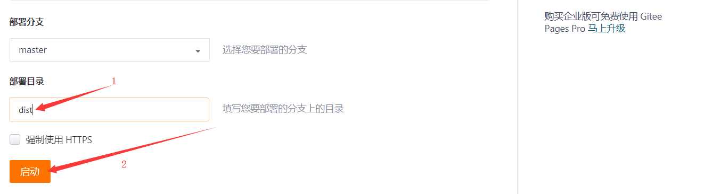

## VUE项目-黑马头条PC端-day10

### 01-每日反馈

| 姓名 | 意见或建议                                                   |
| ---- | ------------------------------------------------------------ |
| ***  | 晚上自己把整个项目写完了，感觉老师讲的特别棒。多希望以后的课都是周老师 |
| ***  | 项目的内容讲的很详细.最后一天,过来留个言,^_^感谢老师,,       |
| ***  | my-cover组件里面的 this.coverImageUrl = this.selectedImageUrl和this.$emit('input', this.selectedImageUrl)的区别，没懂。前者怎么体现出，它只在子组件中起作用。后者，提交给父组件之后的又起到了什么作用。 |


### 02-每日回顾

- 发布文章
  - 使用封面图组件
  - 添加文章
  - 完成两个业务场景切换（添加|修改）
  - 修改文章
- 评论管理
- 粉丝管理


### 03-粉丝管理-echarts使用

默认激活粉丝画像tab

```js
      // tabs的当前激活选项卡的name属性值
      activeName: 'img',
```

在当前tab内容实现柱状图，使用echarts插件。

基本使用步骤：

1、安装

```bash
npm i echarts
```

2、导入 `src/views/Fans.vue`

```js
import echarts from 'echarts'
```

3、准备dom容器

```html
<div ref="main" style="width: 600px;height:400px;"></div>
```

4、初始化实例

```js
const myChart = echarts.init(this.$refs.main)
```

5、准备图表配置对象

```js
const option = { // 官方配置|示例配置  }
```

6、使用配置

```js
myChart.setOption(option)
```


在项目中落地代码：

```js
import echarts from 'echarts'
```

```html
        <el-tab-pane label="粉丝画像" name="img">
          <div ref="main" style="width: 600px;height:400px;"></div>
        </el-tab-pane>
```

```js
 // dom生成完毕后会执行的回调函数（钩子函数）
  mounted () {
    this.initBar()
  },
  methods: {
    // 初始化 柱状图
    initBar () {
      const myChart = echarts.init(this.$refs.main)
      const option = {
        color: ['#3398DB'],
        tooltip: {
          trigger: 'axis',
          axisPointer: {
            type: 'shadow'
          }
        },
        grid: {
          left: '3%',
          right: '4%',
          bottom: '3%',
          containLabel: true
        },
        xAxis: [
          {
            type: 'category',
            data: ['Mon', 'Tue', 'Wed', 'Thu', 'Fri', 'Sat', 'Sun'],
            axisTick: {
              alignWithLabel: true
            }
          }
        ],
        yAxis: [
          {
            type: 'value'
          }
        ],
        series: [
          {
            name: '直接访问',
            type: 'bar',
            barWidth: '60%',
            data: [10, 52, 200, 334, 390, 330, 220]
          }
        ]
      }
      myChart.setOption(option)
    },
```

使用后台数据渲染echarts图表：

````js
        xAxis: [
          {
            type: 'category',
            // x坐标的刻度说明文字
            data: [],
            axisTick: {
              alignWithLabel: true
            }
          }
        ],
````

```js
        series: [
          {
            name: '直接访问',
            type: 'bar',
            barWidth: '60%',
            // 图表的每一个柱子需要数据
            data: []
          }
        ]
```

```js
      // 1. 获取后台统计数据
      const { data: { data } } = await this.$http.get('statistics/followers')
      // 2. 修改配置项中的数据
      // data === {age:{le18:200,...}}
      // xAxis[0].data 追加选项  series[0].data 追加选项
      for (const key in data.age) {
        option.xAxis[0].data.push(key.replace('le', '小于').replace('gt', '大于') + '岁')
        option.series[0].data.push(data.age[key])
      }
```

总结：

- 接口不太稳定，遇到接口错误多刷新几次。


### 04-个人设置-组件与路由

组件：`src/views/Setting.vue`

```html
<template>
  <div class='setting-container'>Setting</div>
</template>

<script>
export default {
  name: 'my-setting'
}
</script>

<style scoped lang='less'></style>
```

路由：`src/router/index.js`

```js
import Setting from '../views/Setting.vue'
```

```diff
      { path: '/comment', component: Comment },
      { path: '/fans', component: Fans },
+      { path: '/setting', component: Setting }
```


### 05-个人设置-基础布局

```html
<template>
  <div class='setting-container'>
    <el-card>
      <div slot="header">
        <my-bread>个人设置</my-bread>
      </div>
      <!-- 栅格 -->
      <el-row>
        <el-col :span="12">
          <!-- 表单 -->
          <el-form label-width="120px">
            <el-form-item label="编号：">100</el-form-item>
            <el-form-item label="手机：">13444442222</el-form-item>
            <el-form-item label="媒体名称：">
              <el-input v-model="userInfo.name"></el-input>
            </el-form-item>
            <el-form-item label="媒体简介：">
              <el-input v-model="userInfo.intro" type="textarea" :rows="3"></el-input>
            </el-form-item>
            <el-form-item label="联系邮箱：">
              <el-input v-model="userInfo.email"></el-input>
            </el-form-item>
            <el-form-item>
              <el-button type="primary">保存设置</el-button>
            </el-form-item>
          </el-form>
        </el-col>
        <el-col :span="12">
          <!-- 上传组件 -->
          <el-upload
            class="avatar-uploader"
            action="https://jsonplaceholder.typicode.com/posts/"
            :show-file-list="false">
            
            <i v-else class="el-icon-plus avatar-uploader-icon"></i>
          </el-upload>
          <p class="edit-photo">修改头像</p>
        </el-col>
      </el-row>
    </el-card>
  </div>
</template>

<script>
export default {
  name: 'my-setting',
  data () {
    return {
      // 用户信息
      userInfo: {
        name: '',
        intro: '',
        email: ''
      },
      // 支持上传组件的数据
      imageUrl: null
    }
  }
}
</script>

<style scoped lang='less'>
.edit-photo{
  font-size: 12px;
  text-align: center;
}
</style>

```


### 06-组件通讯-非父子传值

组件通讯方式：

1. 父传子  `:msg="xxx"`   `props:['msg']`
2. 子传父  `@abc="msg=$event"`  `this.$emit('abc','xxx')`
3. 非父子组件传值 ，是通过自定义事件来实现。


非父子组件传值：假设 组件A 和 组件B 是非父子关系，B组件=====>A组件。

1. 在组件A中绑定一个自定义事件，触发这个事件的时候，接收触发事件的传参。
2. 在组件B中触发这个自定义事件，触发这个事件的时候，可以传递自己数据。
3. 自定义事件，那个组件（vue实例）绑定的那么只能由这个组件（vue实例）来触发。
4. 第三者C，C是一个vue实例。
   1. 绑定事件  C.$on('abc',(data)=>{ // data 触发事件时传参 })`
   2. 触发事件  C.$emit('abc','数据')`


总结：

- 非父子传值可是使用事件总eventBus来实现
- 实现的原理是：通过eventBus绑定事件，和触发事件来完成数据通信。


演示代码

- 组件A `src/components/com-a.vue`

```html
<template>
  <div class='container'>
    组件A {{str}}
  </div>
</template>

<script>
import eventBus from '@/utils/eventBus'
export default {
  data () {
    return {
      str: ''
    }
  },
  created () {
    // 使用事件总线绑定事件
    eventBus.$on('b2a', (data) => {
      // data触发事件时候的传参
      this.str = data
    })
  }
}
</script>
```

- 组件B `src/components/com-b.vue`

```html
<template>
  <div class='container'>
    组件B <button @click="fn">B传值A</button>
  </div>
</template>

<script>
import eventBus from '@/utils/eventBus'
export default {
  data () {
    return {
      msg: 'B组件数据'
    }
  },
  methods: {
    fn () {
      // 提交数据给A组件
      // 使用事件总线触发事件，进行传值
      eventBus.$emit('b2a', this.msg)
    }
  }
}
</script>
```

- 事件总线 `src/utils/eventBus.js`

```js
// 事件总结 eventBus 负责组件通讯，事件绑定和事件触发。
import Vue from 'vue'
// 导出vue实例
export default new Vue()
```

- 测试 `src/views/Setting.vue`

```html
    <!-- 测试 -->
    <com-a></com-a>
    <com-b></com-b>
  </div>
</template>

<script>
import ComA from '@/components/com-a.vue'
import ComB from '@/components/com-b.vue'
export default {
  components: { ComA, ComB },
```


### 07-个人设置-修改用户信息

实现的大致步骤：

1. 获取当前用户资料信息，填充表单，显示头像。
2. 然后用户修改资料后，点击保存设置按钮，发送修改资料请求
   1. 接口 修改用户资料  只负责：用户名  简介  邮箱（不包含头像）
3. 修改成功：提示 + 同步Home组件的用户名 + 同步本地存储的用户名


在项目中的实现：

- ***渲染个人设置***

数据：

```
  data () {
    return {
      // 用户信息
      userInfo: {
        name: '',
        intro: '',
        email: '',
        photo: ''
      }
      // 支持上传组件的数据
      // imageUrl: null
    }
  },
```

获取：

```js
  created () {
    this.getUsetInfo()
  },
  methods: {
    // 获取用户信息
    async getUsetInfo () {
      const { data: { data } } = await this.$http.get('user/profile')
      this.userInfo = data
    }
  }
```

渲染：

```html
           <el-form-item label="编号：">{{userInfo.id}}</el-form-item>
            <el-form-item label="手机：">{{userInfo.mobile}}</el-form-item>
```

```html

```

- ***修改用户信息开始***

绑定事件

```html
<el-button @click="updateUser()" type="primary">保存设置</el-button>
```

提交请求（成功后同步信息）

```js
import eventBus from '@/utils/eventBus'
import auth from '@/utils/auth'
```

```js
    // 修改用户信息
    async updateUser () {
      try {
        // 准备后台需要的数据
        const { name, intro, email } = this.userInfo
        // 发请求提交
        await this.$http.patch('user/profile', { name, intro, email })
        // 成功提示
        this.$message.success('修改用户信息成功')
        // 同步Home组件的用户名
        eventBus.$emit('updateUserName', name)
        // 同步本地存储的用户名  1获取用户信息  2修改用户信息  3重新存入用户信息
        const user = auth.getUser()
        user.name = name
        auth.setUser(user)
      } catch (e) {
        if (e.response && e.response.status === 409) {
          this.$message.error('媒体名称已存在')
        } else {
          this.$message.error('修改用户信息失败')
        }
      }
    },
```

`Home.vue` 组件

```js
import eventBus from '@/utils/eventBus'
```

```diff
  created () {
    // 1. 从本地存储中获取数据
    const user = auth.getUser()
    // 2. 给data中数据赋值
    this.userName = user.name
    this.userPhoto = user.photo
+    // 接收Setting组件的传的用户名称的值
+    eventBus.$on('updateUserName', (data) => {
+      this.userName = data
+    })
  },
```


###08-个人设置-修改用户头像

实现的大致步骤：

1. 使用el-upload组件进行头像的上传
   1. 接口路径：http://ttapi.research.itcast.cn/mp/v1_0/user/photo
   2. 字段名称：photo
   3. 携带令牌：Authorization: `Bearer token`
   4. 请求方式：patch
2. 但是el-upload组件的请求方式 post
   1. 组件不提供修改请求方式的 属性
   2. 所以不能使用el-upload组件提供的默认上传方式
   3. 我们可以使用自己来实现上传
      1.  http-request  配置一个函数来覆盖默认的上传
      2. 在函数中 来实现上传即可
         1. 以前：xhr + FormData + file对象
         2. 现在：axios + FormData + file对象
      3. name属性  headers属性 去掉  action属性保留
3. 上传成功
   1. 成功提示
   2. 本地预览
   3. 同步到home组件的头像
   4. 同步到本地存储的头像


在项目中的代码：

- 上传组件

```html
          <!-- 上传组件 action必须属性-->
          <el-upload
            class="avatar-uploader"
            action=""
            :http-request="uploadPhoto"
            :show-file-list="false">
            
            <i v-else class="el-icon-plus avatar-uploader-icon"></i>
          </el-upload>
```

- 上传函数

```js
    // 选择完成图片后，触发上传头像函数
    async uploadPhoto ({ file }) {
      // console.log(param)  === {file:'选择图片的文件对象'}
      // axios + FormData + file对象
      const formData = new FormData()
      formData.append('photo', file)
      const { data: { data } } = await this.$http.patch('user/photo', formData)
      // 上传成功
      // 提示
      this.$message.success('修改头像成功')
      // 本地预览
      this.userInfo.photo = data.photo
      // 同步home组件
      eventBus.$emit('updateUserPhoto', data.photo)
      // 同步本地存储
      const user = auth.getUser()
      user.photo = data.photo
      auth.setUser(user)
    },
```

- 同步HOME组件 `Home.vue`

```diff
  created () {
    // 1. 从本地存储中获取数据
    const user = auth.getUser()
    // 2. 给data中数据赋值
    this.userName = user.name
    this.userPhoto = user.photo
    // 接收Setting组件的传的用户名称的值
    eventBus.$on('updateUserName', (data) => {
      this.userName = data
    })
+    // 接收Setting组件的传的用户头像的值
+    eventBus.$on('updateUserPhoto', (data) => {
+      this.userPhoto = data
+    })
  },
```


### 09-项目打包-介绍

开发阶段：localhost:8080 进行访问

- 开发时候的服务器，提供了很多开发时候的功能，比如：实时更新，改完代码浏览器立即更新。
- 我们不能是 开发的时候的服务器 作为上线服务器。
- 不能使用 npm run serve  给用户提供访问。

项目打包：

- 是把 src 下的代码，解析编译成，静态文件（css+js+html），直接在浏览器运行
- 然后把打包后的资源托管到线上服务器。

打包命令：

```bash
npm run build
```

资源位置：


托管服务器：（模拟）

- 安装  `npm i serve -g`
- 启动  
  - 找到你需求托管资源的目录
  - 进入目录，在此处打开命令行，执行 `serve`


### 10-项目打包-优化

单页应用程序：

- 弊端：首屏加载慢
- 解决：
  - 当你访问 登录 /login 的时候，我只加载登录需要的资源
  - 当你访问 首页/ 的时候，我只加载首页需要的资源
  - ....


- 所有组件的资源合在这个四个文件中，无法拆分，没有分离。
  - 意味加载一个js文件就把其他路由对应的资源加载过来了。
- **实现路由懒加载**，把这些文件进行拆分，才可以按需去加载路由对应的资源，提高首屏加载速度。

参照代码：

```js
const Foo = () => import('./Foo.vue')
```

导入组件使用以上写法，打包的时候会拆分文件。

`src/router/index.js`

```js
// 导入组件(路由懒加载)
const Login = () => import('../views/Login.vue')
const Home = () => import('../views/Home.vue')
const Welcome = () => import('../views/Welcome.vue')
const NotFound = () => import('../views/404.vue')
const Article = () => import('../views/Article.vue')
const Image = () => import('../views/Image.vue')
const Publish = () => import('../views/Publish.vue')
const Comment = () => import('../views/Comment.vue')
const Fans = () => import('../views/Fans.vue')
const Setting = () => import('../views/Setting.vue')
```

再次打包：


### 11-项目打包-部署

打包的时候：vue.config.js修改

```diff
module.exports = {
  lintOnSave: false,
+  publicPath: './'
}
```

在码云部署：

1. 修改 `.gitignore` 文件

```diff
-/dist
+#/dist
```

2. 重新提交，提交码云

```bash
git add .
git commit -m 'dist'
git push 仓库地址 master
```

3. 在码云托管dist





### 12-总结

- 会通过vue-cli创建项目
- 能够使用使用element-ui快速构建后台系统页面
- 能够使用vue-router完成前端路由实现
- 根据系统的功能设计路由规则
- 能使用axios进行前后端数据交互
- 能够通过token进行会话处理
- 能够使用导航守卫访问权限控制
- 能够使用axios响应拦截器
- 能够使用axios请求拦截器
- 能使用json-bigint处理js安全数值问题
- 能进行不同类型的组件通讯
  - 父传子
  - 子传父
  - 非父子 
- 能理解事件总线原理
- 能够看到restful规则的接口说明
- 能够在vue项目中使用echarts
- 能够在vue项目中使用富文本
- 能实现路由的嵌套
- 具体功能：
  - 登录
  - 首页
  - 内容管理
  - 素材管理
  - 发布文章
    - 合并修改文章
  - 评论管理
  - 粉丝管理
  - 个人设置
- 能打包vue项目
- 能配置路由懒加载优化首屏加载速度
- 能理解部署是什么意思


