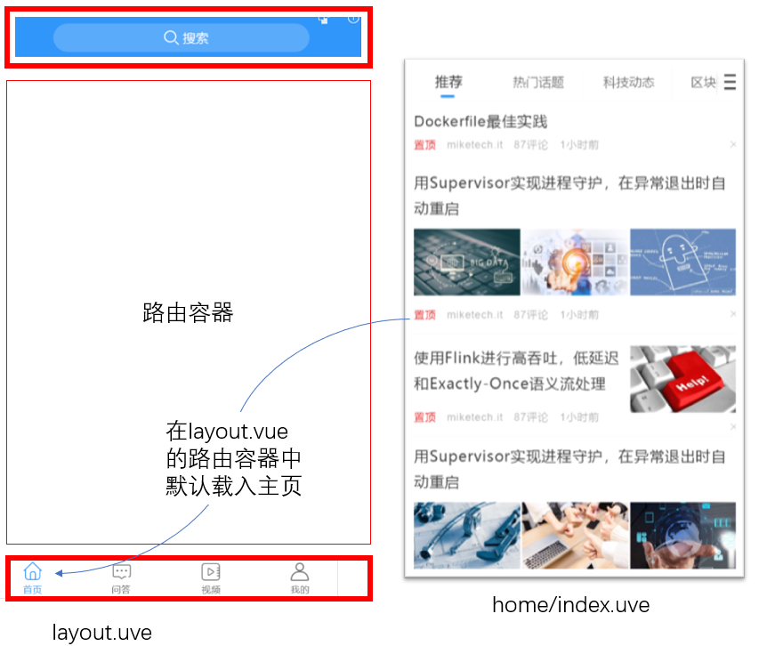

主页整体布局Layout.vue

目标：完成Layout.vue的布局


回顾路由规则

localhost:8080/

```
|--app.vue
|-----Layout.vue
|-------Home/index.vue
```





Layout.vue中的代码如下

```html
<template>
  <div>
    <van-nav-bar
    title="黑马头条"
    right-text="搜索"
    @click-right="hRearch"
  />
    <router-view>
    </router-view>
    <van-tabbar route>
    <!-- 标签栏支持路由模式，用于搭配vue-router使用。
    路由模式下会匹配页面路径和标签的to属性，并自动选中对应的标签-->
      <van-tabbar-item icon="home-o" to='/'>主页</van-tabbar-item>
      <van-tabbar-item icon="search" to='/question'>问答</van-tabbar-item>
      <van-tabbar-item icon="video-o" to='/video'>视频</van-tabbar-item>
      <van-tabbar-item icon="user-o" to='/user'>我的</van-tabbar-item>
    </van-tabbar>
  </div>
</template>

<script>
export default {
  name: 'Layout',
  data () {
    return {

    }
  },
  methods: {
    hRearch () {

    }
  }
}
</script>
```

