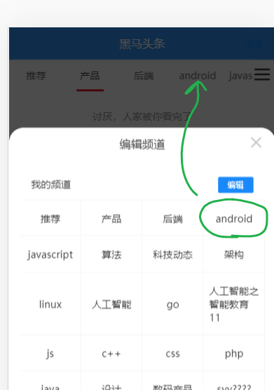

频道管理

在主页中，通过按钮点击，呼出频道管理页，它是以弹出组件来展示的。


目标：

- 让登陆用户可以添加或者删除自已订阅的频道

  


## 基本布局

### 添加频道激活按钮

在频道列表的右侧，放一个按钮，点击这个按钮就可以弹层，在弹层上面对频道进行编辑。


在 `views/home/index.vue` 中添加按钮：

```html
<div class="index">
    <van-tabs v-model="activeIndex">
     ......
    </van-tabs>
    <!-- 频道列表 开关 通过定位 -->
    <div class="bar-btn">
        <van-icon name="wap-nav" size="24" />
    </div>
    <!-- 频道列表 -->
       .....
</div>
```

给它设置一下样式，定位到右侧不动：

```less
.bar-btn{
    position: fixed;
    right: 5px;
    top: 52px;
    display: flex;
    align-items: center;
    background-color: #fff;
    opacity: 0.8;
    z-index:1
}
```

同时给tabs一个right值，让出这个位置

```diff
.index{
    padding-top:50px; // 让出layout组件中title的高度
    margin-bottom: 50px; // 让出layout组件中底部固定路导航的高度
    /deep/ .van-tabs__wrap {
      position:fixed;
      top:46px;
      left:0px;
+      right:30px; 
      z-index: 1;
    }
    /deep/ .van-tabs--line{
        padding-top:50px; // 让出van-tabs的高度
    }
  }
```


测试查看结果。


### 基本布局之弹层组件

补充一个组件channelEdit.vue

```diff
home/index.uve
home/articleList.vue
home/moreAction.vue
+ home/channelEdit.vue
```


在首页中添加弹层组件用来展示频道管理

#### 添加弹层组件

```diff
<template>
  <div class="channel-edit">
    <!-- 当前登陆用户已经订阅的频道 -->
    <div class="channel">
      <van-cell title="我的频道" :border="false">
          <van-button  size="mini" type="info">编辑</van-button>
      </van-cell>
      <van-grid>
        <van-grid-item v-for="index in 8" :key="index">
          <span>频道{{index}}</span>
          <van-icon name="cross" class="btn"></van-icon>
        </van-grid-item>
      </van-grid>
    </div>
     <!-- 当前登陆用户没有订阅的频道 -->
    <div class="channel">
      <van-cell title="可选频道" :border="false"></van-cell>
      <van-grid>
        <van-grid-item v-for="index in 8" :key="index">
          <span>频道{{index}}</span>
        </van-grid-item>
      </van-grid>
    </div>
  </div>
</template>

<script>
export default {
  name: 'ChannelEdit',
  data () {
    return {

    }
  }
}
</script>

<style lang="less" scoped>
  .channel{
    padding:15px;
    font-size:14px;
  }
  .btn {
    position: absolute;
    top: 0;
    right: 0;
    font-size: 24px;
}
</style>

```


#### 在index.vue中引入组件

用van-action-sheet组件包住channelEdit.vue来做弹层效果

```
<van-action-sheet   title="编辑频道" v-model="showChannelEdit">
    <channel-edit></channel-edit>
</van-action-sheet>
```


### 在控制弹窗的显示和隐藏

index.vue

```javascript
data () {
  return {
    ...
    showChannelEdit: true // 这里我们先设置为 true 就能看到弹窗的页面了
  }
}
```

测试查看结果。


## 绑定数据

- 我的频道 :   有现成接口
- 推荐频道 ： 所有频道列表 - 我的频道 = 推荐频道

### 我的频道

这里的数据在Index.vue中的频道列表中就已经获取过的。 从home/index.vue ---> home/channelEdit.vue （典型的组件父传子）

步骤：

- 在子组件中定义属性(channelEdit.vue)
- 在父组件中给属性传值(index.vue)

#### channelEdit.vue

定义props

```javascript
props: {
    channels: {
      type: Array, // 一定要传入数组
      required: true // 不传就报错。
    }
  },
```


数据渲染

```html
<div class="channel">
      <van-cell title="我的频道" :border="false">
          <van-button  size="mini" type="info">编辑</van-button>
      </van-cell>
      <van-grid>
        <van-grid-item v-for="item in channels" :key="item.id">
          <span>{{item.name}}</span>
          <van-icon name="cross" class="btn"></van-icon>
        </van-grid-item>
      </van-grid>
    </div>
```


#### 在index.vue

传递属性值

```diff
<van-action-sheet title="编辑频道" v-model="showChannelEdit">
      <channel-edit
+       :channels="channels"
        >
     </channel-edit>
    </van-action-sheet>
```


### 可选频道(就是当前用户没有订阅的)

当前的接口中没有现成的接口可以拿到推荐频道。但是我们可以使用公式: `系统中所有频道列表 - 我的频道（已经订阅的） = 可选频道`来获取。

实现过程分成两步：

- 获取系统中所有频道，这个是有接口的。
- 计算：
  - 获取我的频道的数据，这个是有接口的，我们在前面已经调用过了。
  - 做`减法`。这个动作使用计算属性来完成。

#### 获取所有频道

1. 添加获取所有频道的接口

在 `api/channel.js` 中新增一个接口

```
/**
 * 获取系统所有的频道
 */
export const getAllChannels = () => {
  // 默认请求类型就是get
  return request({
    url: '/app/v1_0/channels'
  })
}
```

2、在子组件channelEdit.vue中加载调用

```javascript
data () {
    return {
        isEdit: false,
        allChannels: []

    }
},
created () {
    this.getAllChannels()
},
methods: {
    async getAllChannels () {
      // 取回所有的频道
      const result = await getAllChannels()
      console.log(result)
      this.allChannels = result.data.data.channels
    }
  }
}
```

最后回到浏览器中测试结果。


#### 计算推荐频道的数据

按前面的分析，对数组做减法：推荐频道 = 所有频道  - 当前频道

```
推荐频道 = 所有频道  - 当前频道
// 类似于 ： [1,2,3,4,5] - [1,4]
```

这个动作是：根据两个状态进行计算，得到一个新状态。这是典型的计算属性的应用场景。

封装一个计算属性用来获取可推荐的频道

```
computed: {
    // 新增一个计算属性来表示当前可选的频道列表
    recommendChannels () {
      // this.allChannels - this.channels
      // 可选频道的数据 = 所有频道中 除去已订阅频道中的数据
      //                 在所有频道中去过滤一下，选出那些没有在 已订阅频道 中出现频道
      return this.allChannels.filter((channel) => {
        // 对于每一个频道，过滤的条件是：你不能在 已订阅频道中出现
        // 如何去判断在已订阅频道中是否包含 当前的channel ?
        const idx = this.channels.findIndex(item => item.id === channel.id)
        // 如果找到，说明已经包含
        // 如果找不到（idx:-1)，说明当前频道channel并没有在已订阅频道中出现，应该过滤出来
        return idx === -1
      })
    }
  },
```

#### 模板绑定进行展示

获取到了数据之后，再来显示就容易了。

```html
<!-- 当前登陆用户没有订阅的频道 -->
<div class="channel">
    <van-cell title="可选频道" :border="false"></van-cell>
    <van-grid>
        <van-grid-item v-for="item in recommendChannels" :key="item.id">
            <span>{{item.name}}</span>
        </van-grid-item>
    </van-grid>
</div>
```

## 频道跳转



目标：当用户在我的频道上点击时：

- 关闭弹窗
- 切换到当前点击的频道上去

思路：

- 子传父，用$emit

步骤：

- 给频道项添加点击事件
- 在点击事件处理函数内，抛出自定义事件给父组件index.vue
- 在父组件中
  - 关闭弹窗
  - 切换到当前点击的频道上去


在channelEdit组件中，给频道项添加点击事件

```diff
<!-- 当前登陆用户已经订阅的频道 -->
<div class="channel">
<van-cell title="我的频道" :border="false">
<van-button  size="mini" type="info">编辑</van-button>
</van-cell>
<van-grid>
<van-grid-item v-for="item in channels" 
:key="item.id"
+  @click="hClickMyChannel(item)" >
<span>{{item.name}}</span>
<!-- <van-icon name="cross" class="btn"></van-icon> -->
</van-grid-item>
</van-grid>
</div>
```


处理点击事件

```javascript
hClickMyChannel (channel) {
    // 在我的频道上点击一下
    // 目标：
    //    修改父组件index.vue中当前频道项
    this.$emit('updateCurChannel', channel)
    //    关闭弹层
    this.$emit('close')
}
```

在父组件index.vue中监听事件

```diff
     <!-- 频道列表
       传入父组index.uve中的channels给子组件channel-edit显示
     -->
    <van-action-sheet title="编辑频道" v-model="showChannelEdit">
      <channel-edit
       :channels="channels"
+       @updateCurChannel="hUpdateCurChannel"
+       @close="hCloseChannelEdit"
        >
     </channel-edit>
    </van-action-sheet>
```


补充两个方法：

```javascript
    // 关闭编辑频道弹层
    hCloseChannelEdit () {
      this.showChannelEdit = false
    },
    // 把当前的传的channel处于 选中状态
    hUpdateCurChannel (channel) {
      // 计算 channel 在当前频道列表中的下标
      this.activeIndex = this.channels.findIndex(it => it.id === channel.id)
    },
```


## 高亮显示当前频道


思路:

- 从父组件传入prop，表示当前是哪个频道，在子组件中接收prop，并设置特殊的类来标识这个当前频道。

在父组件index.vue

```diff
     <!-- 频道列表
       - 传入父组件index.uve中的channels给子组件channel-edit显示
       - 传入父组件中当前频道的下标
     -->
    <van-action-sheet title="编辑频道" v-model="showChannelEdit">
      <channel-edit
+       :activeIndex="activeIndex"
       :channels="channels"
       @updateCurChannel="hUpdateCurChannel"
       @close="hCloseChannelEdit"
        >
     </channel-edit>
    </van-action-sheet>
```

在子组件channelEdit.vue

补充一个activeIndex属性

```diff
props: {
    channels: { // 当前用户订阅的频道列表
      type: Array, // 一定要传入数组
      required: true // 不传就报错。
    },
+    activeIndex: { // 当前父组件中选中的那个频道的下标,在显示时，它应该要高亮
      type: Number,
      required: true
    }
  },
```

修改视图

```diff
<!-- 当前登陆用户已经订阅的频道 -->
    <div class="channel">
      <van-cell title="我的频道" :border="false">
          <van-button  size="mini" type="info">编辑</van-button>
      </van-cell>
      <van-grid>
        <van-grid-item
        v-for="(item,idx) in channels"
        :key="item.id"
        @click="hClickMyChannel(item)"
+        :class="{'cur':idx===activeIndex}"
        >
          <span>{{item.name}}</span>
          <!-- <van-icon name="cross" class="btn"></van-icon> -->
        </van-grid-item>
      </van-grid>
    </div>
```

:class="{'cur':idx===activeIndex}": 如果`idx===activeIndex`为true，就会多一个cur类。

补充类：

```
  // 高亮显示
  .cur{
    color:red;
    font-weight:bold;
  }
```


## 添加我的频道


目标：

- 登陆用户在在推荐频道区域中，点击了某一个频道，相当于是就是用户要订阅这个频道，即要把这个频道添加到**我的频道**中。

步骤：

- 准备接口
- 调用接口

### 封装接口

>  批量修改用户频道列表（重置式）
>
> 它的接口参数是[{id:1,sql:1},{id:12,sql:2},{id:13,sql:5}]这种格式
>
> 不要传入推荐频道的数据


src/api/channels

```
/**
 * 间接实现添加频道的功能：把当前的，用户选中的所有频道列表传入
 * channels:[]
 *    [{id:1,seq:1},{id:10,seq:2}]
 *
 *  不要 传入 推荐频道
 *  不要 传入 推荐频道
 *  不要 传入 推荐频道
 */
export const addChannel = (channels) => {
  // 默认请求类型就是get
  return request({
    url: '/app/v1_0/user/channels',
    method: 'PUT',
    data: {
      channels
    }
  })
}
```

### 修改视图

 给推荐频道中的频道注册点击事件

```diff
<div class="channel">
      <van-cell title="可选频道" :border="false"></van-cell>
      <van-grid>
        <van-grid-item v-for="(item,index) in recommendChannels"
+        @click="hAddChannel(item)" 
        :key="index">
          <span>{{item.name}}</span>
          <van-icon name="plus"  class="btn"></van-icon>
        </van-grid-item>
      </van-grid>
    </div>
```

### 在添加频道事件处理函数中

```
// 把item这个频道添加到我的频道中
    async hAddChannel (item) {
      // channels表示此时所有的频道信息
      const allChannelNow = [...this.channels, item]
      // 改成接口中需要格式
      const channels = allChannelNow.map((it, idx) => {
        return {
          id: it.id,
          seq: idx
        }
      })
      // 在调用这个接口时，不要把推荐频道也传进去了。
      channels.splice(0, 1) // 删除第一个元素
      // 在调用这个接口时，不要把推荐频道也传进去了。
      console.log(allChannelNow, channels)
      // [{id:1,seq:0},{id:2,seq:1}]
      // /// [{id:1,seq:1},{id:10,seq:2}]
      const result = await addChannel(channels)
      // 调用接口修改后端数据，如上操作没有报错误，则说明操作成功
      console.log(result)

      // 直接修改父级组件中的频道列表
      this.channels.push(item)
      // 1.它会引起可选频道中的数据少一个（计算属性）
      // 2.它会引起我的频道中的数据多一个
      // 3.直接修改父级组件中的频道列表. 父组件中把channels是当作prop传入的，按官方推荐，我不应该
      // 去直接修改prop，或者是，它不允许直接去修改这个prop。
      // 这里有不同之处：
      // channels是一个数组，它不是一个基本数据类型。所以，我们可以在子组件内部去修改父组件的数据
    },
```

注意：这个添加动作看起来是添加了一条数据到我频道中，而效果是 与此同时 推荐频道的数据也少了一份。

原因是按公式: `推荐频道 = 所有频道  - 我的频道` 。 当`我的频道`变化时(加了一项)，`推荐频道`也会随之变化(少了一项)，这一点是由计算属性的特点保障的。也这就是我们使用 计算属性 来保存`推荐频道`的好处。

所以，相当于是一处修改，两处变化。两个数据变化了，当然对应的视图也跟着变化了。 


## 删除我的频道

目标：用户点击"编辑"，在我的频道上，出现X，再点X，就可以删除指定的频道了。


步骤：

- 添加editing数据项，实现视图
- 准备接口
- 调用接口

### 添加editing数据项，实现视图


添加一个数据项

```
data () {
    return {
      allChannels: [], // 所有的频道列表
      editing: false // 是否处于编辑状态
    }
  },
```

修改视图

```
<!-- 当前登陆用户已经订阅的频道 -->
    <div class="channel">
      <van-cell title="我的频道" :border="false">
          <van-button  size="mini" type="info" @click="editing=!editing">
          {{editing ? '取消':'编辑'}}
          </van-button>
      </van-cell>
      <van-grid>
        <van-grid-item
        v-for="(item,idx) in channels"
        :key="item.id"
        @click="hClickMyChannel(item)"
        :class="{'cur':idx===activeIndex}"
        >
          <span>{{item.name}}</span>
          <!-- 推荐 这个频道是不能删除的  -->
          <van-icon name="cross" class="btn" v-show="editing && idx!==0"></van-icon>
        </van-grid-item>
      </van-grid>
    </div>
```


### 准备接口

```

/**
 * 删除频道
 * @param {*} channels  [1,16,9] 要删除的频道的编号
 */
export const deleteChannels = (channels) => {
  // 默认请求类型就是get
  return request({
    url: '/app/v1_0/user/channels',
    method: 'DELETE',
    data: {
      channels
    }
  })
}
```

### 添加点击事件处理

```javascript
async hClickMyChannel (channel) {
      // 在我的频道上点击一下
      // 目标：
      //    如果当前是非编辑状态：修改父组件index.vue中当前频道项
      //    如果当前是正编辑状态：要做删除频道
      if (this.editing) {
        console.log('删除频道 channel')
        // 参数是：当前频道的id
        const result = await deleteChannels([channel.id])
        console.log(result)
        // 如果上面的操作没有错误，则说明已经成功地在服务器上删除了，接下来
        // 更新视图
        // 从当前频道中删除它
        // 1.找出当前的下标
        const idx = this.channels.findIndex(it => it.id === channel.id)
        // 2.删除它
        if (idx !== -1) {
          // 修改了父组件中的数据
          this.channels.splice(idx, 1)
        }
      } else {
        this.$emit('updateCurChannel', channel)
        //    关闭弹层
        this.$emit('close')
      }
    }
```

### bug修复

问题描述：


如果删除的频道在当前频道**之前**，则删除频道之后，会导致当前频道的索引值变化，最终导致显示错误。

如上，当前选中的频道的下标是3,如果删除了后端这个频道，则它的下标应该更新成2。如果你不去更新，则当前频道会变成 javascript。

解决思路：

在删除频道 时，如果下标在当前频道之前，则去更新父组组件的中acitiveIndex

```diff
async hClickMyChannel (channel) {
      // 在我的频道上点击一下
      // 目标：
      //    如果当前是非编辑状态：修改父组件index.vue中当前频道项
      //    如果当前是正编辑状态：要做删除频道
      if (this.editing) {
        console.log('删除频道 channel')
        // 参数是：当前频道的id
        const result = await deleteChannels([channel.id])
        console.log(result)
        // 如果上面的操作没有错误，则说明已经成功地在服务器上删除了，接下来
        // 更新视图
        // 从当前频道中删除它
        // 1.找出当前的下标
        const idx = this.channels.findIndex(it => it.id === channel.id)
        // 2.删除它
        if (idx !== -1) {
          this.channels.splice(idx, 1)
        }
        // 如果当前删除的频道在 活动频道之前 ，则要把活动频道的下标-1。
+        if (idx < this.activeIndex) {
+          // 要把父组件中的activeIndex - 1
+          this.$emit('updateCurIndex', this.activeIndex - 1)
+        }
      } else {
        this.$emit('updateCurChannel', channel)
        //    关闭弹层
        this.$emit('close')
      }
    }
```


在父组件中去监听这个事件 

```diff
    <van-action-sheet title="编辑频道" v-model="showChannelEdit">
      <!--
        channels  这是一个数组，
        在子组件内部，如果通过push来给这个数组添加了元素，
        则父组件中的值也受影响。
      -->
      <channel-edit
       :activeIndex="activeIndex"
       :channels="channels"
+       @updateCurIndex="hUpdateCurIndex"
       @updateCurChannel="hUpdateCurChannel"
       @close="hCloseChannelEdit"
        >
     </channel-edit>
    </van-action-sheet>
```

补充：hUpdateCurIndex

```
// 更新当前选中频道下标
    hUpdateCurIndex (index) {
      this.activeIndex = index
    },
```


