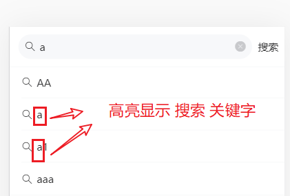
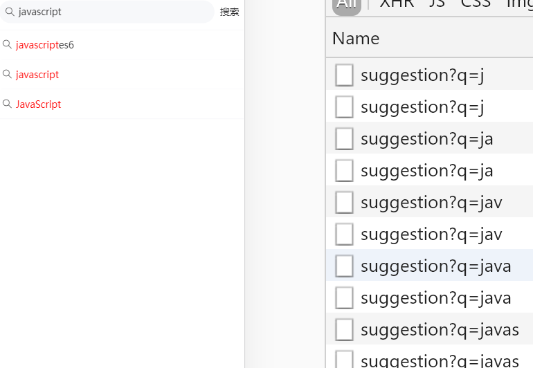

文章搜索模块

目标：

- 提供搜索的入口，实现搜索功能
- 在用户搜索时提供智能提示
- 保存用户的搜索记录


## 路由跳转

### 补充路由配置

补充路由配置,src/router/index.js

```
{
    path: '/search',
    name: 'search',
    component: () => import('../views/search/index.vue')
  },
  {
    path: '/search/result',
    name: 'searchResult',
    component: () => import('../views/search/result.vue')
  }
```

### 创建组件文件

新添加两个文件

```
src/view/search/index.vue
src/view/search/result.vue
```

### 测试路由

- 直接在地址栏中测试

http://localhost:8080/#/search/result

- 路由跳转

在views/home/layout.vue中

```
<template>
  <div>
    <van-nav-bar
      title="黑马头条"
      right-text="搜索"
      fixed
+      @click-right="hRearch"
    />
    <router-view>
    </router-view>
    <van-tabbar route>
    <!-- 标签栏支持路由模式，用于搭配vue-router使用。
    路由模式下会匹配页面路径和标签的to属性，并自动选中对应的标签-->
      <van-tabbar-item icon="home-o" to='/'>主页</van-tabbar-item>
      <van-tabbar-item icon="search" to='/question'>问答</van-tabbar-item>
      <van-tabbar-item icon="video-o" to='/video'>视频</van-tabbar-item>
      <van-tabbar-item icon="user-o" to='/user'>我的</van-tabbar-item>
    </van-tabbar>

  </div>
</template>

<script>
export default {
  name: 'Layout',
  data () {
    return {

    }
  },
  methods: {
    hRearch () {
      // 跳入搜索页
+      this.$router.push('/search')
    }
  }
}
</script>


```


## 搜索页面布局

>  views/search/inde.vue

从上到下，页面结构可以分成三部分

- 输入区。 
  - 使用[search组件](https://youzan.github.io/vant/#/zh-CN/search#zi-ding-yi-an-niu)
- 智能提示区。联想建议
  - 使用[cell组件]( https://youzan.github.io/vant/#/zh-CN/cell#zhan-shi-tu-biao )
- 历史建议区。


涉及vant中的组件

- [search组件]( https://youzan.github.io/vant/#/zh-CN/search#zi-ding-yi-an-niu )  https://youzan.github.io/vant/#/zh-CN/search#zi-ding-yi-an-niu

  

在view/search/index.vue文件中

```html
<template>
<div>
    <!-- 搜索组件一级路由   $router.back()返回上一个页面-->
    <van-nav-bar left-arrow title="搜索中心" @click-left="$router.back()"></van-nav-bar>
    <van-search
      show-action
      placeholder="请输入搜索关键词" shape="round" v-model.trim="keyword"
      >
      <div slot="action" >搜索</div>
    </van-search>

    <!-- 联想建议 -->
    <van-cell-group>
      <van-cell title="js" icon="search" />
      <van-cell title="jsa" icon="search" />
    </van-cell-group>
    <!-- /联想建议 -->

    <!-- 搜索历史记录 -->
    <van-cell-group>
      <van-cell title="历史记录">
      </van-cell>
      <van-cell title="单元格">
        <van-icon name="close" />
      </van-cell>
      <van-cell title="单元格">
        <van-icon name="close" />
      </van-cell>
    </van-cell-group>
    <!-- /搜索历史记录 -->
  </div>
</template>

<script>
export default {
  name: 'Search',
  data () {
    return {
      keyword: '' // 搜索关键字
    }
  }
}
</script>

<style lang="" scoped>

</style>

```


## 搜索联想建议

目标：

- 在输入框中写入内容
- 发请求到后端，根据这个内容给出建议，显示在联想建议区


步骤：

- 封装请求函数
- 当搜索输入变化的时候（search组件已经封装），请求加载联想建议的数据
- 将请求得到的结果绑定到模板中

### 封装数据接口

创建 `api/serach.js` 并写入

```js
/**
 * 文章搜索
 */
import request from '@/utils/request'

/**
 * 获取系统提示的搜索建议
 * @param {*} keyword 关键字
 */
export function getSearchSuggestions (keyword) {
  return request({
    url: '/app/v1_0/suggestion',
    method: 'GET',
    // 它是一个get类型的接口，所以是params
    params: {
      q: keyword
    }
  })
}
```

### 请求获取数据

在 `search/index.vue` 中请求获取数据。

当搜索输入变化的时候（ search组件已经封装好，只需要加对@input的事件响应即可），请求加载联想建议的数据

步骤：

- 在模板中添加事件响应

- 在响应函数中调用接口

- 添加数据项，以保存搜索结果

  

#### 模板中添加事件响应

```html
<template>
<!-- 当用户在输入框中写入内容时去调用接口 -->
    <van-search
      show-action
      placeholder="请输入搜索关键词"
      shape="round"
+      @input="hSearch"
      v-model.trim="keyword"
      >
      <div slot="action" >搜索</div>
    </van-search>
    <!-- /搜索框 -->
  </div>
</template>
```

@input是由Search组件提供的。


#### 在响应函数中调用接口

```js
import { getSearchSuggestions } from '@/api/search'
export default {
  name: 'Search',
  data () {
    return {
      keyword: '', // 搜索关键字
+      searchSuggestions: [] // 搜索建议列表
    }
  },
  methods: {
    async hSearch () {
      // 用户没有输入内容
      if (!this.keyword) {
        return
      }
      // 调接口，取回搜索建议
      const result = await getSearchSuggestions(this.keyword)
      console.log(result)
      this.searchSuggestions = result.data.data.options
    }
  }
}
```


### 显示建议结果

只需要修改模板即可

```html
<!-- 联想建议 -->
    <van-cell-group>
      <van-cell
      v-for="(item,idx) in searchSuggestions"
      :title="item"
      :key="idx"
      icon="search" />
    </van-cell-group>
<!-- /联想建议 -->
```


## 高亮搜索关键字

目标：在显示结果中把关键字高亮




思路：要在一段字符串中把其中一部分高亮，可需要做**替换**即可。例如，如果你需要把"我爱我家"中的`我`字高亮,相当于是把“我”改在一小段特殊的字符串，如下：

```
我爱我家 ----> <span style="color:red">我</span>爱<span style="color:red">我</span>家
```

### 原理：字符串替换

所以，基本想法就是字符串替换。现在的问题简化成了：如何把一段字符串中的指定的内容替换成另一个内容：

```
var str = "abcdefgbefab"
// 目标: 把str中的b全部换成<span>b</span>
// 普通字符串替换：str.replace(目标字符串，要替换的字符串)，它的返回值是替换之后的字符串，注意它不会修改原字符串。
// 它的问题是，它只能替换一次。如上，我们有两个b需要替换，那又该怎么办呢？
// - 循环
// - 正则
```

突破难点

```javascript
<script>
        // 实现正则替换
        var str ="abdAd";
        var keywork = "ab"
        // 目标是：
        //     把所有的a替换成<span style="color:red">a</span>
        // 请开始你的表演
        // replace如果不用正则，只能换一次
        // var str1 = str.replace("a",'<span style="color:red">a</span>')

        // replace(正则，函数)
        // /a/gi :正则
        //      g表明要做全局匹配。只匹配出所有的子串。
        //      i表明匹配不分大小写。
        // new RegExp('a','gi'); 用构造器的方式来创建正则表达式就可以把
        //     第一个参数写成变量
        // 如果在字符串用正则匹配到了内容，则会去执行函数。
        // 函数的执行细节是：
        //  - 参数obj是匹配到的内容 
        //  - 返回值是替换之后的结果 
        var str1 = str.replace(new RegExp(keywork,'gi'),function(obj){
            console.log(obj)
            return '<span style="color:red">'+obj+'</span>'
        })

        console.log(str1); // '<span style="color:red">a</span>bAdd'
    </script>
```


### 实现

- 额外使用一个计算属性来保存高亮之后的值
  - 原来直接获取的数据要做一次加工：对正则replace对内容进行高亮处理
- 用v-html显示数据


```diff
<!-- 联想建议 -->
    <van-cell-group>
      <van-cell
      v-for="(item,idx) in cSearchSuggestions"
      :key="idx"
      icon="search">
+        <div v-html="item"></div>
      </van-cell>

    </van-cell-group>
    <!-- /联想建议 -->

<script>
....
 computed: {
    // 补充一个计算属性对searchSuggestions中的数据做高亮
    cSearchSuggestions () {
      // 创建正则表达式
      const reg = new RegExp(this.keyword, 'gi')
      return this.searchSuggestions.map(str => {
        // 原来是：str
        // 替换成:对关键字进行高亮之后的字符串
        const str1 = str.replace(reg, function (obj) {
          return `<span style="color:red">${obj}</span>`
        })
        return str1
      })
    }
  },
}
</script>
```

注意

- v-html的用法
- str.replace(正则)

## 搜索历史记录

### 历史记录的意义

用户点击搜索有两种情况：

- 在搜索框上的按钮上点击。
- 在系统给出的建议搜索项上点击。


这两种情况下，都应该去进行搜索操作：跳入具体的搜索页面。但在此之前，可以把它们搜索的内容添加到历史记录中，以便下次快速搜索。

### 历史搜索记录的保存方式及格式

有两种方式来保存用户搜索：

- 把搜索记录放在服务器
- 把搜索记录放在本地

这里我们把搜索记录保存在localstorage中。


保存格式：把搜索结果放在一个数组中。

- 最近的搜索结果在最前面
- 搜索历史中不要有重复的项

```
['a','手机','javascript']
```

### 补充一个数据项

```
data () {
    return {
      keyword: '', // 搜索关键字
      searchSuggestions: [], // 搜索建议列表
+      searchHistories: ['hava','abc'] // 搜索历史记录
    }
  },
```

### 封装一个添加历史记录的方法

```
methods:{
// 添加历史记录
    addSearchHistory (str) {
      // 1.添加历史记录
      // 1.1不要有重复项
      // 1.2最近搜索的记录应该在最上面
      const index = this.searchHistories.indexOf(str)
      if (index !== -1) {
        // 说明当前的搜索关键字，已经在前面的搜索记录存在了
        // 要调整顺序：把它放在最前面
        // 删除它
        this.searchHistories.splice(index, 1)
      }
      // unshift是在头部添加
      this.searchHistories.unshift(str)
    },
}
```

在两种情况下去调用这个方法


点击搜索 记录

```
    <!-- 当用户在输入框中写入内容时去调用接口 -->
    <van-search
      show-action
      placeholder="请输入搜索关键词"
      shape="round"
      @input="hSearch"
      v-model.trim="keyword"
      >
+      <div slot="action" @click="hClickSearchInput">搜索</div>
    </van-search>
```


```
// 点击 搜索按钮
    hClickSearchInput () {
      if (this.keyword) {
        this.addSearchHistory(this.keyword)
      }
    },
```


在搜索联想建议上点击

由于这绑定的数据是计算属性，它其中内容是对原数据做了正则替换之后的结果。所以，这里要传入index,而不是item

```
<!-- 联想建议 -->
    <van-cell-group>
      <van-cell
      v-for="(item,idx) in cSearchSuggestions"
      :key="idx"
 +     @click="hClickSuggestion(idx)"
      icon="search">
        <div v-html="item"></div>
      </van-cell>

    </van-cell-group>
```

补充对应的方法

```
// 在搜索建议上点击
    hClickSuggestion (idx) {
      // 取出原数据
      const str = this.searchSuggestions[idx]
      this.addSearchHistory(str)
    },
```


### 显示历史记录

只需修改视图，在searchSuggestion中循环显示即可。

```
<!-- 搜索历史记录 -->
    <van-cell-group>
      <van-cell title="历史记录">
      </van-cell>
      <van-cell
        v-for="(item,idx) in searchHistories"
        :title="item"
        :key="idx"
        >
        <van-icon name="close" />
      </van-cell>

    </van-cell-group>
```


### 删除历史记录

给X添加点击事件

```html
<!-- 搜索历史记录 -->
    <van-cell-group>
      <van-cell title="历史记录">
      </van-cell>
      <van-cell
        v-for="(item,idx) in searchHistories"
        :title="item"
        :key="idx"
        >
        <van-icon name="close" @click="hRemoveHistory(idx)" />
      </van-cell>

    </van-cell-group>
    <!-- /搜索历史记录 -->

```


在方法中补充一下：

```
hRemoveHistory (idx) {
      this.searchHistorys.splice(idx, 1)
},
```


### 保存搜索历史记录到本地

目标：

​	不要在刷新页面时就不见了（和前面的vux一样，要做持久化）。刷新，退出系统这个搜索历史应该一直存在。

思路：

	- 引入前面封装好的持久化工具。
	- 用watch来监视搜索历史的变化。


步骤：

1. 引入持久化工具

```
// 实现搜索记录持久化
// 在添加，或者删除searchHistories时，要同时保存到localstroage
import { getItem, setItem } from '@/utils/storage'
```

2. 初始化

```
  data () {
    return {
      keyword: '', // 搜索关键字
      searchSuggestions: [], // 搜索建议列表
+      searchHistories: getItem('searchHistories') || [] // 搜索历史记录
    }
  },
```

3.保存到本地

```
watch: {
    // 当searchHistories变化时，它会执行
    searchHistories (newVal, oldVal) {
      // console.log(newVal, oldVal)
      // 保存到localstorage
      setItem('searchHistories', newVal)
    }
  }
```


### 联想建议和历史记录的切换显示

联想建议 和 搜索历史 这两个区域是互斥的：

- 如果当前开始去搜索内容，则不显示搜索历史，而显示联想建议。 
- 如果当前并没有搜索内容，则显示搜索搜索历史，不显示联想建议。

```html
<template>
  <div class="search">

    <!-- 联想建议 与 搜索历史记录互斥
      如果用户在搜索框中输入了内容，则显示联想建议，
      否则，显示搜索历史
    -->
+    <van-cell-group v-if="keyword">
     
    </van-cell-group>
    <!-- /联想建议 -->

    <!-- 搜索历史记录 -->
+    <van-cell-group v-else>
      
    </van-cell-group>
    <!-- /搜索历史记录 -->
  </div>
</template>


```

##  搜索优化

现状：

   在输入框中字符变化会立刻去发请求获取搜索建议。



这个搜索的频率太高了（太灵敏，它对用户来说，是好的，因为可以及时收到搜索建议，对服务器有坏处，调用这个接口的频率太高了，给服务器添加了负担。同时用户不会得到更多的好处：在搜索的过程，你录入的单词并没有写完，你得到的搜索建议多半是无用）。


解决思路：

- 降低发请求的频率。

### 防抖处理

```
// 防抖：抖:高频的运动。不要让你抖，抖也没有用。
    // 思路：
    //   当这个函数被调用时，不立刻执行，而是延迟10秒执行。
    //   如果在这10秒内再次调用了这个函数，则从当前被调用的时间开始算，
    //      再延迟10秒。 (整个10秒内，不能被打断,一旦打断，就要重新计时)。
    //   如果在这10秒内没有再次调用这个函数，10秒后执行代码。
    //  (等电梯)
    hSearch () {
      console.log(this.keyword)
      console.log(`当前的定时器是${this.timer}`)
      if (this.timer) {
        console.log(`消除当前的定时器${this.timer}`)
        clearTimeout(this.timer)
      }
      this.timer = setTimeout(async () => {
        // 用户没有输入内容
        if (!this.keyword) {
          return
        }
        // 调接口，取回搜索建议
        const result = await getSearchSuggestions(this.keyword)
        console.log(result)

        this.searchSuggestions = result.data.data.options
      }, 10 * 1000)
      console.log(`开启10s执行的定时器是${this.timer}`)
    }
  },
```

### 节流处理


```
// 节流：水龙头。把水龙头关到最小，让它一滴一滴向下滴水。效果就是降低了水流的频率。
    // 思路是：
    //     如果这个函数距离上一次被调用的时间之间相隔不到10秒，则本次调用，不执行代码
    //     两次有效调用时间，并且至少相隔10秒。
    // 搜索联想提示
    hSearch () {
      console.log(this.keyword)
      // 只有this.timer是null，才会去开启下一个定时器
      if (!this.timer) {
        // 只要setTimeout一执行，this.timer就有值了
        this.timer = setTimeout(async () => {
          this.timer = null

          // 用户没有输入内容
          if (!this.keyword) {
            return
          }
          // 调接口，取回搜索建议
          const result = await getSearchSuggestions(this.keyword)

          this.searchSuggestions = result.data.data.options
        }, 0.3 * 1000)
      }
    }
```


### 对比


防抖：可能就执行第一次调用和最后一次调用。

节流：会执行多次，只是频率降低了。


关键字搜索：建议采用节流的方式来做优化。一方向减少服务器压力（请求次数变少了），用户体验要比防抖要一些。


前端界面上的常见的高频操作（事件会触发多次）：

- 鼠标移动。
- 窗口缩放。
- input。文本框输入。
- scroll。

业务：

- 不能频繁发验证码请求
- 不能不停地登陆
- .......


## 搜索结果页-基本布局

搜索结果是单独在另一个页面显示的，其基本思路是传入你要搜索的关键字，调接口，取回查询结果，并显示。


步骤：

- 注册搜索表单的提交事件处理函数
- 跳转到搜索结果页
  - 根据搜索关键字获取搜索结果
  - 展示到列表中


### 页面布局

rearch/result.vue的结构

```html
<template>
  <div class="serach-result">
    <!-- 导航栏 -->
    <van-nav-bar
      title="xxx 的搜索结果"
      left-arrow
      fixed
      @click-left="$router.back()"
    />
    <!-- /导航栏 -->

    <!-- 文章列表 -->
    <van-list
      class="article-list"
      v-model="loading"
      :finished="finished"
      finished-text="没有更多了"
      @load="onLoad"
    >
      <van-cell
        v-for="item in list"
        :key="item"
        :title="item"
      />
    </van-list>
    <!-- /文章列表 -->
  </div>
</template>

<script>
export default {
  name: 'SearchResult',
  data () {
    return {
      list: [],
      loading: false,
      finished: false
    }
  },

  methods: {
    onLoad () {
      // 异步更新数据
      setTimeout(() => {
        for (let i = 0; i < 10; i++) {
          this.list.push(this.list.length + 1)
        }
        // 加载状态结束
        this.loading = false

        // 数据全部加载完成
        if (this.list.length >= 40) {
          this.finished = true
        }
      }, 500)
    }
  }
}
</script>

<style lang="less" scoped>
.van-nav-bar {
  background-color: #3196fa;
  .van-nav-bar__title {
    color: #fff;
  }
  // 搜索结果页 后退按钮为白色
  .van-icon{
    color:#fff;
  }
}
</style>
```


### 路由跳转传参

在src/router/index.vue中补充路由配置：

```
  {
    path: '/search/result',
    name: 'searchResult',
    component: () => import('../views/search/result.vue')
  }

```

有三个地方要跳入结果页:


在 `views/search/index.vue` 中：

```html
// 在历史记录上点击
    hClickHistory (str) {
      this.addSearchHistory(str)
      // 跳入搜索结果页，并传入参数
      // http://localhost:8080/#/search/result?keyword=abc
      this.$router.push({
        name: 'searchResult',
        query: {
          keyword: str
        }
      })
    },
    // 在搜索建议上点击
    hClickSuggestion (idx) {
      // 取出原数据
      const str = this.searchSuggestions[idx]
      this.addSearchHistory(str)
      // 跳入搜索结果页，并传入参数
      // http://localhost:8080/#/search/result?keyword=abc
      this.$router.push({
        name: 'searchResult',
        query: {
          keyword: str
        }
      })
    },
    // 点击 搜索按钮
    hClickSearchInput () {
      if (this.keyword) {
        this.addSearchHistory(this.keyword)

        // 跳入搜索结果页，并传入参数
        // http://localhost:8080/#/search/result?keyword=abc
        this.$router.push({
          name: 'searchResult',
          query: {
            keyword: this.keyword
          }
        })
      }
    },
```

路由跳转，并传入query来携带参数。


### 在result.vue获取参数

步骤：

- 封装接口
- 发请求，获取结果
- 模板绑定

search/result.vue

在页面内部，我们可以通过this.$route.query.keyword来获取传入的查询关键字

```javascript
created () {
    var keyword = this.$route.query.keyword
    alert(keyword)
}
```


### 封装接口

在 `api/serach.js` 封装请求方法


```js
/**
 * 获取搜索结果
 * @param {*} params ｛page,per_page,qs｝
 */
export function getSearch (params) {
  return request({
    url: '/app/v1_0/search',
    method: 'GET',
    // 它是一个get类型的接口，所以是params
    params
  })
}
```

### 调用接口获取数据

然后在 `views/search-result/index.vue` 中

```js
+ import { getSearch } from '@/api/search'
data () {
    return {
      list: [],
      loading: false,
      finished: false,
      page: 1, // 当前要查询的页数
      per_page: 10 // 每页 10条
    }
  },

  methods: {
    async onLoad () {
      const result = await getSearch({
        page: this.page,
        per_page: this.per_page,
        q: this.$route.query.keyword
      })
      console.log(result)

      // 把结果添加到list中
      this.list.push(...result.data.data.results)
      // 页码+1
      this.page++

      this.loading = false
      if (result.data.data.results.length === 0) {
        this.finished = true
      }
    }
  }

```

### 数据渲染

模板绑定

```html
<template>
  <div class="serach-result">
    <!-- 导航栏 -->
    <van-nav-bar
      :title="$route.query.keyword+'的搜索结果'"
      left-arrow
      fixed
      @click-left="$router.back()"
    />
    <!-- /导航栏 -->

    <!-- 文章列表 -->
    <van-list
      class="article-list"
      v-model="loading"
      :finished="finished"
      finished-text="没有更多了"
      @load="onLoad"
    >
      <van-cell
        v-for="(item,idx) in list"
        :key="idx"
        :title="item.title"
      />
    </van-list>
    <!-- /文章列表 -->
  </div>
</template>

```


## bug修复


在从搜索页跳到搜索结果页时，会出现搜索记录没有保存下来的bug，这个原因是由于watch的监听被路由跳转打断了。

vue数据的响应式是异步的：数据变化到 变化后的回调函数执行 是异步。

- 数据的变化与watch中代码的执行，它是异步的。

解决的方式是：在路由跳转外层，加一个setTimeout


```
setTimeout(() => {
        this.$router.push({
          name: 'searchResult',
          query: {
            keyword: str
          }
        })
      })
// 让watch先执行，再去做跳转
```


原因：

让watch先执行，再去做跳转

```
// 在搜索建议上点击
    hClickSuggestion (idx) {
      // 取出原数据
      const str = this.searchSuggestions[idx]
      // 当我们修改了搜索历史之后，watch不是立即执行的,watch是一个异步的
      this.addSearchHistory(str)
      // this.$nextTick(callback)
      // 跳入搜索结果页，并传入参数
      // http://localhost:8080/#/search/result?keyword=abc
      setTimeout(() => {
        this.$router.push({
          name: 'searchResult',
          query: {
            keyword: str
          }
        })
      // 就可以让watch先执行，再去做跳转
      })
    },
```


解决方案：

放弃用watch来监听搜索历史的变化(删除watch的代码)，而直接在add和remove时，保存;

```
// 删除指定位置的记录记录
    hRemoveHistory (idx) {
      this.searchHistories.splice(idx, 1)
+      setItem('searchHistories', this.searchHistories)
    },
    
    // 添加历史记录
    addSearchHistory (str) {
      // 1.添加历史记录
      // 1.1不要有重复项
      // 1.2最近搜索的记录应该在最上面
      const index = this.searchHistories.indexOf(str)
      if (index !== -1) {
        // 说明当前的搜索关键字，已经在前面的搜索记录存在了
        // 要调整顺序：把它放在最前面
        // 删除它
        this.searchHistories.splice(index, 1)
      }
      // unshift是在头部添加
      this.searchHistories.unshift(str)
+      setItem('searchHistories', this.searchHistories)
    },
```

