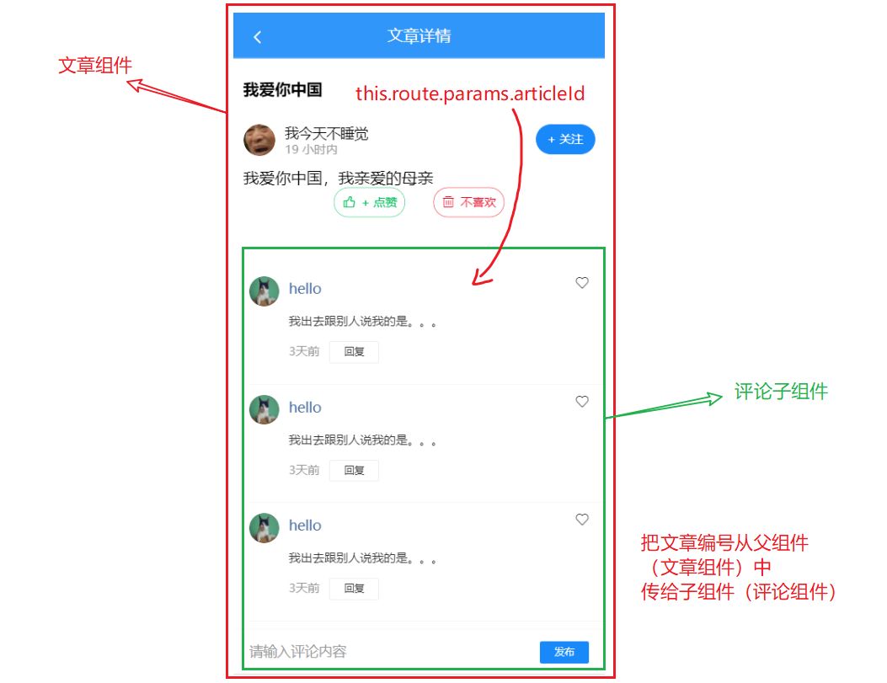
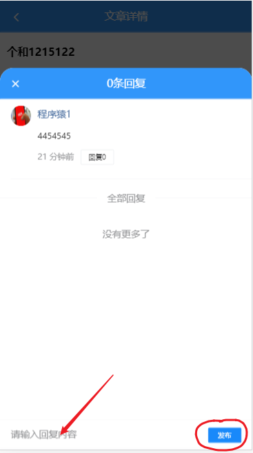
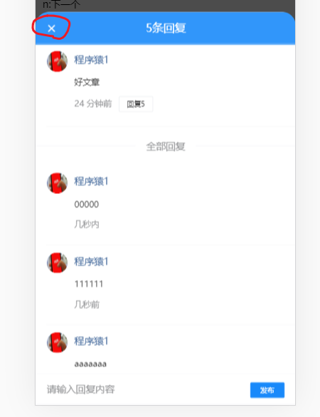

文章评论组件




## 展示文章评论列表

```
|-article/index.vue
|-article/comment.vue # 添加一个组件来完成评论列表功能
```


- 创建评论组件comment.vue，并快速设置页页结构模板；
- 在父组件index.vue中使用,并传入articleId；

### 评论组件的内容

创建 `views/article/comment.vue` 并写入以下内容：

```html
<template>
  <div class="article-comments">
    <!-- 评论列表 -->
    <van-list
      v-model="loading"
      :finished="finished"
      finished-text="没有更多了"
      @load="onLoad"
    >
      <van-cell
        v-for="item in list"
        :key="item"
        :title="item"
      >
        <van-image
          slot="icon"
          round
          width="30"
          height="30"
          style="margin-right: 10px;"
          src="https://img.yzcdn.cn/vant/cat.jpeg"
        />
        <span style="color: #466b9d;" slot="title">hello</span>
        <div slot="label">
          <p style="color: #363636;">我出去跟别人说我的是。。。</p>
          <p>
            <span style="margin-right: 10px;">3天前</span>
            <van-button size="mini" type="default">回复</van-button>
          </p>
        </div>
        <van-icon slot="right-icon" name="like-o" />
      </van-cell>
    </van-list>
    <!-- 评论列表 -->

    <!-- 发布评论 -->
    <van-cell-group class="publish-wrap">
      <van-field
        clearable
        placeholder="请输入评论内容"
      >
        <van-button slot="button" size="mini" type="info">发布</van-button>
      </van-field>
    </van-cell-group>
    <!-- /发布评论 -->
  </div>
</template>

<script>
export default {
  name: 'ArticleComment',
  props: {},
  data () {
    return {
      list: [], // 评论列表
      loading: false, // 上拉加载更多的 loading
      finished: false // 是否加载结束
    }
  },

  methods: {
    onLoad () {
      // 异步更新数据
      setTimeout(() => {
        for (let i = 0; i < 10; i++) {
          this.list.push(this.list.length + 1)
        }
        // 加载状态结束
        this.loading = false

        // 数据全部加载完成
        if (this.list.length >= 40) {
          this.finished = true
        }
      }, 500)
    }
  }
}
</script>

<style scoped lang='less'>
// 发表评论的区域是固定在下端的
.publish-wrap {
  position: fixed;
  left: 0;
  bottom: 0;
  width: 100%;
}
// 给发表评论区空出地方
.van-list {
  margin-bottom: 45px;
}
</style>

```

### 注册并引入

在文章详情页面index.vue中加载注册文章评论子组件：

```js
import ArticleComment from './comment'

export default {
  ...
  components: {
    ArticleComment
  }
}
```

在文章详情页面中使用文章评论子组件

```html
<div class="article-container">
	...  	
  <!-- 文章评论 -->
    <article-comment :articleId="articleId"></article-comment>
  <!-- /文章评论 -->
</div>
```

## 发布文章评论


步骤：

- 封装接口
- 注册发布处理函数
- 根据响应结果进行后续处理

实现：

### 封装接口

在 `api/comment.js` 中添加封装数据接口

```js
import request from '@/utils/request'

/**
 * 添加评论
 * target integer 必须  评论的目标id（评论文章即为文章id，对评论进行回复则为评论id）
   content string 必须  评论内容
  art_id integer 非必须  文章id，对评论内容发表回复时，需要传递此参数，表明所属文章id。
对文章进行评论，不要传此参数。
 */
export const addComment = (data) => {
  return request({
    method: 'POST',
    url: '/app/v1_0/comments',
    data
  })
}
```


### 在父组件中传入文章id

index.vue

```
    <article-comment
      :articleId="$route.params.id">
    </article-comment>
```


### 准备数据项，添加点击事件，调用接口


在 `comment.vue` 组件中

```html
<template>
  <div class="article-comments">
    <!-- 评论列表 -->
    <!-- 评论列表 -->

    <!-- 发布评论 -->
    <!-- 发布评论 -->
    <van-cell-group class="publish-wrap">
      <van-field
        clearable
        placeholder="请输入评论内容"
        v-model.trim="commentText"
      >
        <van-button
        slot="button"
        size="mini"
        type="info"
        @click="hAddComment">发布</van-button>
      </van-field>
    </van-cell-group>
    <!-- /发布评论 -->
    <!-- /发布评论 -->
  </div>
</template>

<script>
import { addComment } from '@/api/comment'
export default {
  name: 'ArticleComment',
  props: {
    articleId: {
      type: String,
      required: true
    }
  },
  data () {
    return {
      commentText: '', // 当前评论的内容
      list: [], // 评论列表
      loading: false, // 上拉加载更多的 loading
      finished: false // 是否加载结束
    }
  },

  methods: {
    // 给文章添加评论
    async hAddComment () {
      // 1. 获取当前评论的内容
      if (!this.commentText) {
        return
      }

      // 2. 调用接口，实现添加评论的功能
      const result = await addComment({
        target: this.articleId, // 文章编号
        content: this.commentText
      })
      // 把从接口中返回的数据，添加到评论列表中
      // 3. 最加入的评论应该在数组头部
      this.list.unshift(result.data.data.new_obj)

      // 4. 文本框清空
      this.commentText = ''
    }
 }
</script>
```


## 获取文章评论数据并显示

步骤：

- 封装接口
- 请求获取数据
- 处理模板

实现：

### 封装请求方法

1、在 `api/comment.js` 中封装请求方法

```js

/**
 * 获取评论（回复）
 *  * @param {*} params
 * type 是 a或c 评论类型，a-对文章(article)的评论，c-对评论(comment)的回复
   source 是 源id，文章id或评论id
   offset 否 获取评论数据的偏移量，值为评论id，表示从此id的数据向后取，不传表示从第一页开始读取数据
   limit 否 获取的评论数据个数，不传表示采用后端服务设定的默认每页数据量
 */
export const getComments = (params) => {
  return request({
    method: 'GET',
    url: '/app/v1_0/comments',
    params
  })
}

```

有一个offset参数要注意一下。

### 加载获取数据

在 `views/article/comment.vue` 组件中加载获取数据

```js
import { getComments } from '@/api/comment'

export default {
  name: 'ArticleComment',
  props: {
      article_id:{
          type: String,
          required: true
      }
  },
  data () {
    return {
      commentText: '', // 当前评论的内容
      list: [], // 评论列表
+      offset: null, // 列表数据的偏移量，实现类似分页的效果，要传给后端
      loading: false, // 上拉加载更多的 loading
      finished: false // 是否加载结束
    }
  },

  methods: {
    async onLoad () {
      //    type 是 a或c 评论类型，a-对文章(article)的评论，c-对评论(comment)的回复
      //    source 是 源id，文章id或评论id
      //    offset 否 获取评论数据的偏移量，值为评论id，表示从此id的数据向后取，不传表示从第一页开始读取数据

      // 1. 请求数据
      const result = await getComments({
        type: 'a', // 对文章(article)的评论
        source: this.articleId, // 文章id
        offset: this.offset
      })

      // 2. 将数据添加到列表中
      this.list.push(...result.data.data.results)

      // 加载状态结束
      this.loading = false

      if (result.data.data.results.length) {
        // 更新一下offset
        // 这个值是后端要求的，用来作分页效的
        // 在发下一次时，要把上一次请求回的来最后一个id传入
        this.offset = result.data.data.last_id
      } else {
        this.finished = true
      }
    }
  }
}
```

### 模板绑定

```html
<template>
  <div class="article-comments">
    <!-- 评论列表 -->
    <van-list
      v-model="loading"
      :finished="finished"
      finished-text="没有更多了"
      @load="onLoad"
    >
      <van-cell
        v-for="(item,idx) in list"
        :key="idx"
        :title="item.content"
      >
        <van-image
          slot="icon"
          round
          width="30"
          height="30"
          style="margin-right: 10px;"
          :src="item.aut_photo"
        />
        <span style="color: #466b9d;" slot="title">{{item.aut_name}}</span>
        <div slot="label">
          <p style="color: #363636;">{{item.content}}</p>
          <p>
            <span style="margin-right: 10px;">{{item.pubdate | relativeTime}}</span>
            <van-button size="mini" type="default">回复</van-button>
          </p>
        </div>
        <van-icon slot="right-icon" name="like-o" />
      </van-cell>
    </van-list>

  </div>
</template>
```


## 评论点赞

### 目标


**关键点**

在后端接口取出回来的数据中，有一个特殊的字段`is_liking`表示当前用户对当前评论是否喜欢。

### 思路

1. 从接口中取出数据之后，根据is_liking这个字段来来更新视图
2. 用户点击之后，调用接口去修改is_liking这个字段在服务器上的值，并更新视图。

### 封装接口

在 `api/comment.js` 中添加两个方法

```js
/**
 * 对评论点赞
 */
+ export function addCommentLike (commentId) {
+   return request({
+     method: 'POST',
+     url: '/app/v1_0/comment/likings',
+     data: {
+       target: commentId
+     }
+   })
+ }

/**
 * 取消对评论点赞
 */
+ export function deleteCommentLike (commentId) {
+   return request({
+     method: 'DELETE',
+     url: '/app/v1_0/comment/likings/' + commentId
+   })
+ }


```

### 修改视图

在 `views/article/comment.vue` 组件中

```html
<template>
  
        <van-icon
          slot="right-icon"
+          :name="item.is_liking ? 'like' : 'like-o'"
+          @click="onCommentLike(item)"
        />
   
</template>

<script>
import {
  getComments,
  addComment,
+  addCommentLike,
+  deleteCommentLike
} from '@/api/comment'

export default {
  methods: {
    /**
     * 评论点赞/取消评论点赞
     */
    + async onCommentLike (comment) {
    +   const commentId = comment.com_id.toString()
    +   // 如果已点赞，则取消点赞
    +   if (comment.is_liking) {
    +     await deleteCommentLike(commentId)
    +   } else {
    +     // 否则，点赞
    +     await addCommentLike(commentId)
    +   }
    +   comment.is_liking = !comment.is_liking
    + }
  }
}
</script>
```


## 评论回复

> 小张写了文章 ，小李在下面写了评论1，而小王对这个评论1进行了回复。


对当前评论进行回复，以弹层的方式来显示回复内容。这里的弹层就是vant中的[popup组件](https://youzan.github.io/vant/#/zh-CN/popup#yuan-jiao-dan-chuang)。

由于评论回复这个功能比较复杂，所以单独创建一个组件来完成。

```
|--article
|--article/index.vue
|--article/comment.vue
|--article/commentReply.vue #评论
```


### 创建组件

创建 `views/article/commentReply.vue` 并写入基本结构如下：


```html
<template>
<div class="article-comments">
    <!-- 导航栏 -->
    <van-nav-bar title="1条回复">
      <van-icon slot="left" name="cross" />
    </van-nav-bar>
    <!-- /导航栏 -->

    <!-- 当前评论 -->
    <van-cell title="当前评论">
      <van-image
        slot="icon"
        round
        width="30"
        height="30"
        style="margin-right: 10px;"
        src="https://img.yzcdn.cn/vant/cat.jpeg"
      />
      <span style="color: #466b9d;" slot="title">hello</span>
      <div slot="label">
        <p style="color: #363636;">评论内容</p>
        <p>
          <span style="margin-right: 10px;">几天前</span>
          <van-button
            size="mini"
            type="default"
          >回复 10</van-button>
        </p>
      </div>
      <van-icon slot="right-icon" />
    </van-cell>
    <!-- /当前评论 -->
    <van-divider>全部回复</van-divider>

    <!-- 对当前评论 回复列表 -->
    <van-list
      v-model="loading"
      :finished="finished"
      finished-text="没有更多了"
      @load="onLoad"
     >
      <van-cell
        v-for="(item, index) in list"
        :key="index"
        :title="item"
      >
        <van-image
          slot="icon"
          round
          width="30"
          height="30"
          style="margin-right: 10px;"
          src="https://img.yzcdn.cn/vant/cat.jpeg"
        />
        <span style="color: #466b9d;" slot="title">hello</span>
        <div slot="label">
          <p style="color: #363636;">内容</p>
          <p>
            <span style="margin-right: 10px;">时间</span>
          </p>
        </div>
      </van-cell>
    </van-list>
    <!-- 回复列表 -->

    <!-- 发布回复 -->
    <van-cell-group class="publish-wrap">
      <van-field
        clearable
        placeholder="请输入回复内容"
      >
        <van-button
          slot="button"
          size="mini"
          type="info"
        >发布</van-button>
      </van-field>
    </van-cell-group>
    <!-- /发布回复 -->
</div>

</template>
<script>
export default {
  name: 'CommentReply',
  data () {
    return {
      list: [], // 评论列表
      loading: false, // 上拉加载更多的 loading
      finished: false // 是否加载结束
    }
  },
  methods: {
    onLoad () {
      // 异步更新数据
      setTimeout(() => {
        for (let i = 0; i < 10; i++) {
          this.list.push(this.list.length + 1)
        }
        // 加载状态结束
        this.loading = false

        // 数据全部加载完成
        if (this.list.length >= 40) {
          this.finished = true
        }
      }, 500)
    }
  }
}
</script>
<style lang="less" scoped>
// 发表评论的区域是固定在下端的
.publish-wrap {
  position: fixed;
  left: 0;
  bottom: 0;
  width: 100%;
}
// 给发表评论区空出地方
.van-list {
  margin-bottom: 45px;
}
</style>

```


### 使用组件

目标：

​	在评论的回复按钮上点击，则在页面的底部升起一个弹层，在弹层中，放上面定义的子组件。


在 `views/article/comment.vue` 组件中：

- 加载使用，外层包一个van-popup
- 补充一个数据项：isReplyShow，控制是否显示弹层组件
- 给列表中的回复按钮添加click，来设置isReplyShow为true。

```html
<template>

    <!-- 评论回复 -->
    <van-popup
      v-model="isReplyShow"
      round
      position="bottom"
      :style="{height:'85%'}"
    >
      <comment-reply></comment-reply>
    </van-popup>
     <!-- 评论回复 -->

  </div>
</template>

<script>

+ import CommentReply from './comment-reply'
  data () {
    return {
+     isReplyShow: false, // 是否显示评论回复
      commentText: '', // 当前评论的内容
      list: [], // 评论列表
      offset: null, // 列表数据的偏移量，实现类似分页的效果，要传给后端
      loading: false, // 上拉加载更多的 loading
      finished: false // 是否加载结束
    }
  },
+  components: {
+    CommentReply
+   }
```

控制显示回复

```
hReply () {
  this.isReplyShow = true
},
```


### 展示当前评论

思路：典型父传子。把当前的评论数据从comment.vue中传commentReply

父组件：comment.vue

	- 预置一个数据项：currentComment
	- 点击回复按钮时就修改数据项

子组件：comment-reply.vue

- 属性 comment。用来接收currentComment的值。


#### comment.vue

把在文章评论组件中所点击的评论对象传递到评论回复组件中。

```html
<template>
          <p>
            <span style="margin-right: 10px;">{{item.pubdate | relativeTime}}</span>
            <van-button size="mini" type="default" @click="hReplay(item)">回复</van-button>
          </p>
      

      <!-- 评论回复 -->
    <van-popup
      v-model="isReplyShow"
      round
      position="bottom"
      :style="{height:'85%'}"
    >
       <!--在父组件中把数据传给子组件 -->
      <comment-reply
        :comment="currentComment">
      </comment-reply>
    </van-popup>
     <!-- 评论回复 -->
</template>

<script>

  data () {
    return {
+     currentComment: {} // 查看回复的当前评论
      ///
    }
  },

  methods: {
// 在某一条评论的 回复 按钮上点击
    hReplay (item) {
      // 展示回复组件
      this.isReplyShow = true

      // 更新当前 正在回复的评论
      this.currentComment = item
    },
  }
}
</script>
```

2、然后在子commentReply组件接收

定义prop

```
props: {
    comment: {
      type: Object,
      required: true
    }
  },
```


·更新视图

```javascript
<template>
  <!-- 导航栏 -->
    <van-nav-bar :title="comment.reply_count+'条回复'">
      <van-icon slot="left" name="cross" />
    </van-nav-bar>
    <!-- /导航栏 -->

    <!-- 当前评论 -->
    <van-cell title="当前评论">
      <van-image
        slot="icon"
        round
        width="30"
        height="30"
        style="margin-right: 10px;"
        :src="comment.aut_photo"
      />
      <span style="color: #466b9d;" slot="title">{{comment.aut_name}}</span>
      <div slot="label">
        <p style="color: #363636;">{{comment.content}}</p>
        <p>
          <span style="margin-right: 10px;">{{comment.pubdate | relativeTime}}</span>
          <van-button
            size="mini"
            type="default"
          >回复{{comment.reply_count}}</van-button>
        </p>
      </div>
      <van-icon slot="right-icon" />
    </van-cell>

```


### 展示评论回复列表


目标：把回复显示出来。

步骤：

​	定义接口(与获取文章的评论是一个接口)；调用接口，获取数据;渲染页面。

将评论回复组件中请求获取评论列表的参数稍加修改就可以获取回复列表了（同一个数据接口）

```js
import { getComments } from '@/api/comment'

  data () {
    return {
      list: [], // 评论列表
      loading: false, // 上拉加载更多的 loading
      finished: false, // 是否加载结束
+      offset: null
    }
  },
      
async onLoad () {
      //    type 是 a或c 评论类型，a-对文章(article)的评论，c-对评论(comment)的回复
      //    source 是 源id，文章id或评论id
      //    offset 否 获取评论数据的偏移量，值为评论id，表示从此id的数据向后取，不传表示从第一页开始读取数据

      // 1. 请求数据
      const result = await getComments({
        type: 'c', // 对评论(comment)的回复
        source: this.comment.com_id.toString(), // 评论id
        offset: this.offset
      })

      // 2. 将数据添加到列表中
      this.list.push(...result.data.data.results)

      // 加载状态结束
      this.loading = false

      if (result.data.data.results.length) {
        // 更新一下offset
        // 这个值是后端要求的，用来作分页效的
        // 在发下一次时，要把上一次请求回的来最后一个id传入
        this.offset = result.data.data.last_id
      } else {
        this.finished = true
      }
    }

```

页面数据绑定

```html
<!-- 对当前评论 回复列表 -->
    <van-list
      v-model="loading"
      :finished="finished"
      finished-text="没有更多了"
      @load="onLoad"
     >
      <van-cell
        v-for="(item, index) in list"
        :key="index"
        :title="item.aut_name"
      >
        <van-image
          slot="icon"
          round
          width="30"
          height="30"
          style="margin-right: 10px;"
          :src="item.aut_photo"
        />
        <span style="color: #466b9d;" slot="title">{{item.aut_name}}</span>
        <div slot="label">
          <p style="color: #363636;">{{item.content}}</p>
          <p>
            <span style="margin-right: 10px;">{{item.pubdate | relativeTime}}</span>
          </p>
        </div>
      </van-cell>
    </van-list>
    <!-- 回复列表 -->
```


### 发布评论回复



#### 封装接口

接口与给文章评论是同一个接口，只需要额外传递第三个参数即可：

```javascript
addComment({
target: this.comment.com_id.toString(), // 评论的目标id（评论文章即为文章id，对评论进行回复则为评论id）
content: commentText, // 评论内容
art_id: 文章id // 文章id，对评论内容发表回复时，需要传递此参数，表明所属文章id。对文章进行评论，不要传此参数。
})
```

由于这里还需要一个文章的编号,可以通过this.$route.params.id获取


#### 添加事件

在评论回复组件中，对发布评论的请求稍加修改即可：

```js
import {
  getComments,
  addComment
} from '@/api/comment'

export default {

  data () {
    return {

+      commentText: ''
    }
  },

  methods: {
   // 添加回复
    async hAddReply () {
      // 1.收集用户输入
      if (!this.commentText) {
        return
      }
      // 2.调用接口
      /* target integer 必须  评论的目标id（评论文章即为文章id，对评论进行回复则为评论id）
        content string 必须  评论内容
        art_id integer 非必须  文章id，对评论内容发表回复时，需要传递此参数，表明所属文章id。
      对文章进行评论，不要传此参数。
      */
      const result = await addComment({
        target: this.comment.com_id.toString(), // 评论id
        content: this.commentText,
        art_id: this.$route.params.id// 当前文章的id
      })
      console.log(result)

      // 3.根据调用结果给出反馈
      // 3.1  从接口的返回值中去取出new_obj(表示前评论回复的内容)，添加到listK
      this.list.unshift(result.data.data.new_obj)
      // 3.2 把评论条数加1
      this.comment.reply_count++

      this.$toast('回复成功')
      // 4.清空回复内容
      this.commentText = ''
    }
    
  }
}

```


### 在评论回复组件中关闭弹层



在子组件中向父组件传递信息，以达到修改父组件数据的目的（相应地也就修改了父组件的视图）

- 在子组件发布一个自定义事件
- 在父组件中监听处理这个事件

1、在评论回复组件中发布一个自定义事件

```html
<template>
  <div class="article-comments">
    <!-- 导航栏 -->
    <van-nav-bar :title="comment.reply_count + '条回复'">
      <van-icon
        slot="left"
        name="cross"
+        @click="$emit('close')"
      />
    </van-nav-bar>
    <!-- /导航栏 -->

</template>

```

2、在文章评论组件中监听处理

```html
<template>
  <div class="article-comments">
    <!-- 评论回复 -->
    <van-popup
      v-model="isReplyShow"
      round
      position="bottom"
      :style="{ height: '90%' }"
    >
      <comment-reply
        :comment="currentComment"
        v-if="isReplyShow"
+        @close="isReplyShow = false"
      />
    </van-popup>
    <!-- /评论回复 -->
  </div>
</template>

```


### bug修复

现状： 对于commentReply组件，由于请求回复列表的动作只在第一次创建这个组件时执行，所以导致第二次点击某个评论的回复时，还是显示第一次点击回复时取回来的回复列表。


解决：

每次点击回复时，都去创建一个新commentReply组件。

做法：

`v-if="isReplyShow"`

```
<!-- 评论回复 -->
    <van-popup
      v-model="isReplyShow"
      round
      position="bottom"
      :style="{height:'85%'}"
    >
       <!--在父组件中把数据传给子组件 -->
      <comment-reply
+        v-if="isReplyShow"
        @close="isReplyShow=false"
        :comment="currentComment">
      </comment-reply>
    </van-popup>
     <!-- 评论回复 -->
```

