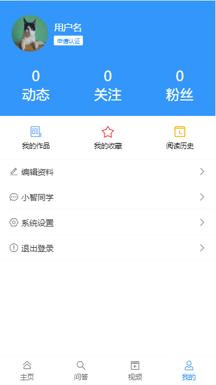
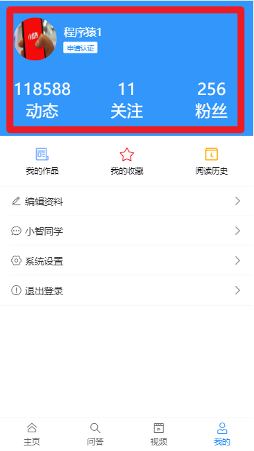
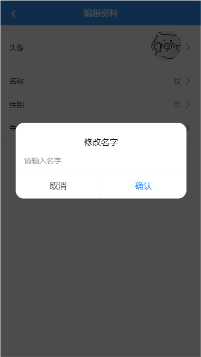

个人中心

## 基础布局

src/views/user/index.vue

### 结构

```html
<template>
  <div class="container">
    <!-- 用户个人资料 -->
    <div class="user-profile">
      <div class="info">
        <van-image round src="https://img.yzcdn.cn/vant/cat.jpeg" />
        <h3 class="name">
          用户名
          <br />
          <van-tag size="mini">申请认证</van-tag>
        </h3>
      </div>
      <van-row>
        <van-col span="8">
          <p>0</p>
          <p>动态</p>
        </van-col>
        <van-col span="8">
          <p>0</p>
          <p>关注</p>
        </van-col>
        <van-col span="8">
          <p>0</p>
          <p>粉丝</p>
        </van-col>
      </van-row>
    </div>

    <!-- 操作链接 -->
    <van-row class="user-links">
      <van-col span="8">
        <van-icon name="newspaper-o" color="#7af" />我的作品
      </van-col>
      <van-col span="8">
        <van-icon name="star-o" color="#f00" />我的收藏
      </van-col>
      <van-col span="8">
        <van-icon name="tosend" color="#fa0" />阅读历史
      </van-col>
    </van-row>

    <!-- 编辑入口 -->
    <van-cell-group class="user-group">
      <van-cell icon="edit" title="编辑资料" to="/user/profile" is-link />
      <van-cell icon="chat-o" title="小智同学" to="/user/chat" is-link />
      <van-cell icon="setting-o" title="系统设置" is-link />
      <van-cell icon="warning-o" title="退出登录" to="/login" is-link />
    </van-cell-group>
  </div>
</template>

<script>
import { getInfo } from '@/api/user.js'
export default {
  name: 'UserIndex',
  data () {
    return {

    }
  },
  created () {
  // 在user/index.vue中调用user.js/getInfo
    getInfo()
  }

}
</script>

<style lang="less" scoped>
.user {
  &-profile {
    width: 100%;
    height: 200px;
    display: block;
    background: #3296fa;
    color: #fff;
    .info {
      display: flex;
      padding: 20px;
      align-items: center;
      .van-image{
        width: 64px;
        height: 64px;
      }
      .name {
        font-size: 16px;
        font-weight: normal;
        margin-left: 10px;
      }
      .van-tag {
        background: #fff;
        color: #3296fa;
      }
    }
    p{
      margin: 0;
      text-align: center;
    }
  }
  &-group {
    margin-bottom: 15px;
  }
  &-links {
    padding: 15px 0;
    font-size: 12px;
    text-align: center;
    background-color: #fff;
    .van-icon {
      display: block;
      font-size: 24px;
      padding-bottom: 5px;
    }
  }
}
</style>

```

### 修改layout.vue

修改layout.vue中的nav-bar的显示

```
<!--如果当前是/user，则要隐藏van-nav-bar -->
    <van-nav-bar
      v-show="$route.path!=='/user'"
      title="黑马头条"
      right-text="搜索"
      fixed
      @click-right="hRearch"
    />
```




## 数据渲染

定义API `src/api/user.js`

```js
/**
 * 获取用户自已的信息
 */
export function getInfo () {
  return request({
    method: 'GET',
    url: '/app/v1_0/user'
  })
}
```

获取个人信息

```js
import {getInfo} from '@/api/user'

export default {
  data () {
    return {
      user: {}
    }
  },
  created () {
  // 在user/index.vue中调用user.js/getInfo
    this.getInfo()
  },
  methods: {
    async getInfo () {
      const result = await getInfo()
      this.user = result.data.data
    }
  }
}
```

渲染组件：

```html
<!-- 用户个人资料 -->
    <div class="user-profile">
      <div class="info">
        <van-image round :src="user.photo" />
        <h3 class="name">
          {{user.name}}
          <br />
          <van-tag size="mini">申请认证</van-tag>
        </h3>
      </div>
      <van-row>
        <van-col span="8">
          <p>{{user.art_count}}</p>
          <p>动态</p>
        </van-col>
        <van-col span="8">
          <p>{{user.follow_count}}</p>
          <p>关注</p>
        </van-col>
        <van-col span="8">
          <p>{{user.fans_count}}</p>
          <p>粉丝</p>
        </van-col>
      </van-row>
    </div>
```




## 退出登录

绑定事件

```html
 <!-- 你再玩一会吧，大爷-->
      <van-cell icon="warning-o" title="退出登录" @click="hLogout" is-link />
```

补充vuex中的mutation

```
import { setItem, getItem, removeItem } from '@/utils/storage'

delUser (state) {
   state.user = null
   removeItem('user')
},
```

在组件中view/user/index.vue

```js
import { mapMutations } from 'vuex'
```

```js
methods: {
    ...mapMutations(['delUser']),
    async getInfo () {
      const result = await getInfo()
      this.user = result.data.data
    },
    hLogout () {
      // 1. 让他不要走
      this.$dialog.confirm({
        title: '提示',
        message: '走了就不要回来！！！'
      }).then(() => {
        // on confirm
        // alert('真走了')
        // 2.  他一定要走，删除vuex
        // 在组件中调用mutations
        // 方法一：mapMutations
        this.delUser()
        // 方法二：
        // this.$store.commit('delUser')

        // 3，跳回登陆
        this.$router.push('/login')
      })
        .catch(() => {
          // on cancel
        })
    }
  }
```


## 编辑个人资料

它是一个新的一级路由

```
user/index.vue
user/profile.vue #个人资料
```


### 创建组件

src/views/user/profile.vue

### 添加路由

```
  {
    path: '/user/profile',
    name: 'userProfile',
    component: () => import('../views/user/profile.vue')
  }
```


### 基础布局

静态结构：

```html
<template>
  <div class="container">
    <van-nav-bar left-arrow @click-left="$router.back()" title="编辑资料"></van-nav-bar>
    <van-cell-group>
      <van-cell is-link title="头像"  center>
        <van-image
          slot="default"
          width="1.5rem"
          height="1.5rem"
          fit="cover"
          round
          :src="user.photo"
        />
      </van-cell>
      <van-cell is-link title="名称" :value="user.name" @click="showName=true"/>
      <van-cell is-link title="性别" :value="user.gender === 1?'男':'女'" @click="showGender=true"/>
      <van-cell is-link title="生日" :value="user.birthday" @click="showBirthday=true"/>
    </van-cell-group>

    <!-- 编辑区域 姓名-->
    <van-dialog @confirm="hSaveName" v-model="showName" title="修改名字" show-cancel-button>
      <van-field type="text" focus v-model="newName" placeholder="请输入名字" />
    </van-dialog>

    <van-popup v-model="showGender" position="bottom">
      <van-nav-bar
          title="修改性别"
          left-text="取消"
          right-text="保存"
          @click-left="showGender=false"
      >
      </van-nav-bar>

        <van-cell is-link title="男" @click="hChangeGender(1)" />
        <van-cell is-link title="女" @click="hChangeGender(0)" />
    </van-popup>

    <van-popup v-model="showBirthday" position="bottom">
      <van-nav-bar
        title="修改生日"
      >
      </van-nav-bar>
      <van-datetime-picker
        v-model="newDate"
        @confirm="hSaveBirthday"
        @cancel="showBirthday=false"
        type="date"
        :min-date="minDate"
        :max-date="maxDate"
      />
    </van-popup>
  </div>
</template>

<script>
export default {
  name: 'userProfile',
  created () {
    this.getInfo()
  },
  data () {
    return {
      // 控制弹层
      showName: false,
      showGender: false,
      showBirthday: false,

      // 当前用户的信息
      user: {},

      // 修改后的新名字
      newName: '',
      // 修改后新生日
      newDate: new Date(),
      minDate: new Date(1965, 0, 10), // dateTime-picker中最小时间
      maxDate: new Date() // 当前时间
    }
  },
  methods: {
    async getInfo () {

    },
    async hSaveName () {

    },
    async hChangeGender (g) {

    },
    async hSaveBirthday () {

    }
  }
}
</script>

<style lang="less">
.van-nav-bar__text{
  color:#fff;
}
</style>
```

### 获取数据并渲染

准备api，在api/user.js中，添加一个如下 的接口

```javascript
/**
 * 获取个人信息
 */
export function getProfile () {
  return request({
    method: 'GET',
    url: '/app/v1_0/user/profile'

  })
}
```


调用api，渲染数据

```
<template>
  <div class="container">
    <van-nav-bar left-arrow @click-left="$router.back()" title="编辑资料" right-text="保存" ></van-nav-bar>
    <van-cell-group>
      <van-cell is-link title="头像"  center>
        <van-image
          slot="default"
          width="1.5rem"
          height="1.5rem"
          fit="cover"
          round
          :src="user.photo"
        />
      </van-cell>
      <van-cell is-link title="名称" :value="user.name" />
      <van-cell is-link title="性别" :value="user.gender === 1?'男':'女'"/>
      <van-cell is-link title="生日" :value="user.birthday" />
    </van-cell-group>
  </div>
</template>


<script>
import { getProfile } from '@/api/user.js'
export default {
  name: 'userProfile',
  created () {
    this.getInfo()
  },
  data () {
    return {
      // 控制弹层
      showName: false,
      showGender: false,
      showBirthday: false,

      // 当前用户的信息
      user: {},

      // 修改后的新名字
      newName: '',
      // 修改后新生日
      newDate: new Date(),
      minDate: new Date(1965, 0, 10), // dateTime-picker中最小时间
      maxDate: new Date() // 当前时间
    }
  },
  methods: {
    // 获取用户档案
    async getInfo () {
      const result = await getProfile()
      console.log(result)

      // 保存数据
      this.user = result.data.data
    },
    async hSaveName () {

    },
    async hChangeGender (g) {

    },
    async hSaveBirthday () {

    }
  }
}
</script>
```

## 编辑个人资料-姓名



### 思路

在点击了名字项后，在dialog弹层出来，进行修改。

### 添加弹层结构

- 添加popup
- 添加数据项控制弹层显示
- 添加click，实现基本效果

```html
<!-- 编辑区域 姓名-->
    <van-dialog @confirm="hSaveName" v-model="showName" title="修改名字" show-cancel-button>
      <van-field type="text" focus v-model="newName" placeholder="请输入名字" />
    </van-dialog>
```


### 准备api

api/user.js,添加接口

```javascript
/**
 * 修改用户信息
 * @param {*} data
 * 请求的字段参数 发送几个保存几个，不发送的不修改
 */
export function updateUserInfo (data) {
  return request({
    method: 'PATCH',
    url: '/app/v1_0/user/profile',
    data
  })
}

```

### 调用

在view/user/profile.vue中，调用上面的接口，实现功能。

```javascript
import { getInfo, updateUserInfo } from '@/api/user'
export default {

  data () {
    return {

      newName: ''
    }
  },
  methods: {
    async hSaveName () {
      console.log(this.newName)
      if (!this.newName) {
        this.showName = false
        return
      }
      // 1. 调用接口，保存新名字
      const result = await updateUserInfo({
        name: this.newName
      })
      console.log(result)
      // 2. 关闭弹层
      this.showName = false
      // 3. 修改本地信息
      this.user.name = this.newName
    },
  }

}
```


## 编辑个人资料-性别


```html
<van-popup v-model="isShowGender" position="bottom">
    <van-nav-bar
         title="修改性别"
         left-text="取消"
         right-text="保存"
         @click-left="isShowGender=false"
    >
    </van-nav-bar>

    <van-cell is-link title="男" @click="hChangeGender(0)" />
    <van-cell is-link title="女" @click="hChangeGender(1)" />
</van-popup>
```

> 后端的接口有问题，在修改性别时，它不能正确保存

```
async hChangeGender (g) {
      console.log(g)
      // 1. 调用接口，保存性别
      const result = await updateUserInfo({
        gender: g
      })
      console.log(result)
      // 2. 关闭弹层
      this.showGender = false
      // 3. 修改本地信息
      this.user.gender = g
    },
```


## 编辑个人资料-生日

使用[datetime-picker](https://youzan.github.io/vant/#/zh-CN/datetime-picker#xuan-ze-ri-qi-nian-yue)组件来提供用户选择新的日期时间。

-        @cancel = "isShowBirthday=false"
        @confirm="hChangeBirthday"


日期组件中的格式是日期格式的，而接口中要的日期格式是字符串格式的'YYYY-MM-DD'，可以引入dayjs 来做个格式化。

```html
<van-popup v-model="isShowBirthday" position="bottom">
      <van-nav-bar
        title="修改生日"
      >
      </van-nav-bar>
      <van-datetime-picker
        v-model="newDate"
        @cancel = "isShowBirthday=false"
        @confirm="hChangeBirthday"
        type="date"
        :min-date="minDate"
        :max-date="maxDate"
      />
</van-popup>
```

代码

```
import dayjs from 'dayjs'

async hSaveBirthday () {
      // 保存生日
      // 由于后端接口需要的格式是 '2018-12-20'，而我们取到的数据是一个Date对象
      // 所以在传给后端之前要做一下格式化。
      // 在项目中已经引入了dayjs，所以，这里直接拿来用一下
      console.log(this.newDate)
      const birthday = dayjs(this.newDate).format('YYYY-MM-DD')

      // 1. 调用接口，保存性别
      // birthday 生日，格式'2018-12-20'
      const result = await updateUserInfo({
        birthday
      })
      console.log(result)
      // 2. 关闭弹层
      this.showBirthday = false
      // 3. 修改本地信息
      this.user.birthday = birthday
    }
```


## 编辑个人资料-头像

> 本质就是调用接口，上传头像文件

思路：

- 移花接木。创建一个隐藏的文件域： input type="file"  。当用户点击图像时，主动去调用文件域的click，呼出选择文件的对话框。
- 创建接口，注意接口的格式是formData。


### 结构

补充一个`input type="file"`,让它隐藏起来。

```
<div class="container">

    <!--

      文件域：用来选中本地文件
      change事件：当用户选中文件时，它会触发。
      hidden: 隐藏自己，只是不可见，不占空间，但它的功能还是在嘀。
    -->
    <input type="file" hidden @change="hFileChange" ref="file"/>
    
    <van-nav-bar left-arrow @click-left="$router.back()" title="编辑资料" right-text="保存" ></van-nav-bar>
    <van-cell-group>
      <van-cell is-link title="头像"  center @click="hShowImage">
        <van-image
          slot="default"
          width="1.5rem"
          height="1.5rem"
          fit="cover"
          round
          :src="user.photo"
        />
      </van-cell>
      <van-cell is-link title="名称" :value="user.name" @click="showName=true"/>
      <van-cell is-link title="性别" :value="user.gender === 1?'男':'女'" @click="showGender=true"/>
      <van-cell is-link title="生日" :value="user.birthday" @click="showBirthday=true"/>
    </van-cell-group>
```


### 封装API

查询接口文档(编辑用户照片资料（头像、身份证照片）)，在 src/api/user.js中添加接口：

```js
/**
 * 修改用户的头像
 * @param {*} formData  参数是formData格式
 */
export function updatePhoto (formData) {
  return request({
    method: 'PATCH',
    url: '/app/v1_0/user/photo',
    data: formData
  })
}
```


### 代码

```javascript
// 在头像上单击了
    hShowImage () {
      // alert(1)
      // 手动去触发input的点击事件
      this.$refs.file.click()
    },

    // 文件域中用户选择文件
    //  change 变化
    // （1） 从有图片1  --> 没有图片（用户没有选 中）
    // （2） 从有图片1  --> 有图片2
    // （2） 从没有图片 --> 有图片1
    async hFileChange () {
      console.log('hFileChange')
      // 1. 找到用户选中的头像文件
      // this.$refs.file 就是当前的<input type="file">
      // files[0] 是用户选中的文件
      const file = this.$refs.file.files[0]
      if (!file) {
        // 只有用户选择头像文件，才向下走
        return
      }
      console.dir(file)
      // 2. 调用接口
      // 按接口要求，要创建一个formData对象
      const fd = new FormData()
      // 补充一个参数
      fd.append('photo', file)
      const result = await updatePhoto(fd)
      // 3. 如果成功，则更新本地数据
      console.log(result)
      this.user.photo = result.data.data.photo
    }
```


