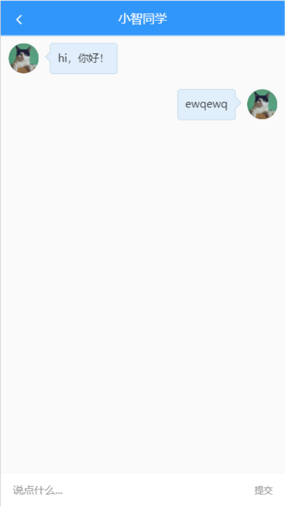
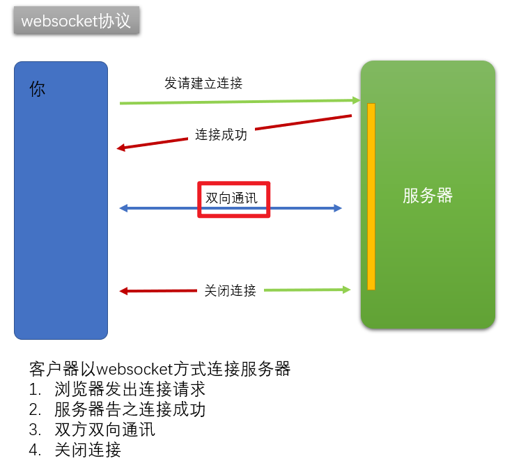
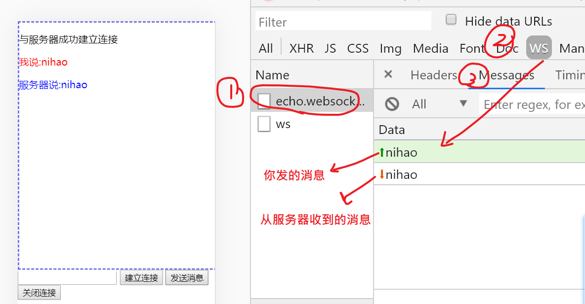

## 小智同学



单独创建一个组件（chat.vue）及对应的路由来实现与小智的聊天功能。

```
user/index.vue
user/profile.vue
user/chat.vue ##
```

### 路由

在router/index.js中添加路由：

```
[
  //...
  {
    path: '/user/chat',
    name: 'userChat',
    component: () => import('../views/user/chat.vue')
  }
]
```


### 组件结构

```
<template>
    <div class="container">
    <van-nav-bar fixed left-arrow @click-left="$router.back()" title="小智同学"></van-nav-bar>
    <div class="chat-list">
      <!-- 左侧是机器人小智 -->
      <div class="chat-item left">
        <van-image fit="cover" round src="https://img.yzcdn.cn/vant/cat.jpeg" />
        <div class="chat-pao">hi，你好！</div>
      </div>

      <!-- 右侧是当前用户 -->
      <div class="chat-item right">
        <div class="chat-pao">ewqewq</div>
        <van-image  fit="cover" round src="https://img.yzcdn.cn/vant/cat.jpeg" />
      </div>
    </div>
    <div class="reply-container van-hairline--top">
      <van-field v-model.trim="word" placeholder="说点什么...">
        <span  @click="send()" slot="button" style="font-size:12px;color:#999">提交</span>
      </van-field>
    </div>
  </div>
</template>

<script>
export default {
  name: 'UserChat',
  data () {
    return {
      word: ''
    }
  },
  methods: {
    send () {
      console.log(this.word)
    }
  }
}
</script>

<style lang="less" scoped>
.container {
  height: 100%;
  width: 100%;
  position: absolute;
  left: 0;
  top: 0;
  box-sizing: border-box;
  background:#fafafa;
  padding: 46px 0 50px 0;
  .chat-list {
    height: 100%;
    overflow-y: scroll;
    .chat-item{
      padding: 10px;
      .van-image{
        vertical-align: top;
        width: 40px;
        height: 40px;
      }
      .chat-pao{
        vertical-align: top;
        display: inline-block;
        min-width: 40px;
        max-width: 70%;
        min-height: 40px;
        line-height: 38px;
        border: 0.5px solid #c2d9ea;
        border-radius: 4px;
        position: relative;
        padding: 0 10px;
        background-color: #e0effb;
        word-break: break-all;
        font-size: 14px;
        color: #333;
        &::before{
          content: "";
          width: 10px;
          height: 10px;
          position: absolute;
          top: 12px;
          border-top:0.5px solid #c2d9ea;
          border-right:0.5px solid #c2d9ea;
          background: #e0effb;
        }
      }
    }
  }
}
.chat-item.right{
  text-align: right;
  .chat-pao{
    margin-left: 0;
    margin-right: 15px;
    &::before{
      right: -6px;
      transform: rotate(45deg);
    }
  }
}
.chat-item.left{
  text-align: left;
  .chat-pao{
    margin-left: 15px;
    margin-right: 0;
    &::before{
      left: -5px;
      transform: rotate(-135deg);
    }
  }
}
.reply-container {
  position: fixed;
  left: 0;
  bottom: 0;
  height: 44px;
  width: 100%;
  background: #f5f5f5;
  z-index: 9999;
}
</style>

```

### 引入用户头像

思路：

​	把用户头像的地址信息保存在vuex中，在这里引用

第一步：设置vuex （src/store/index.js）

- 添加state
- 添加mutation

```
state: {
    // 保存公共数据
    // vuex的初始值从localStorage中去取
    user: getItem('user'),
    photo: '' // 用户头像的地址
  },
  mutations: {
    // 修改头像
    updatePhoto (state, photo) {
      state.photo = photo
    }
}
```

第二步：设置vuex中的photo

在user/index.vue中，当成功获取数据之后，把头像地址保存起来：

```javascript
async getUserInfo () {
    const result = await getInfo()
    this.user = result.data.data
    this.$store.commit('updatePhoto', this.user.photo) // 更新用户的头像
},
```

第三步：在user/chat.vue中使用vuex中的photo

```
<!-- 右侧是当前用户 -->
      <div class="chat-item right">
        <div class="chat-pao">ewqewq</div>
        <van-image  fit="cover" round :src="$store.state.photo" />
      </div>
```


### 约定聊天数据结构

```
// 设计聊天记录
list: [
        { name: 'xz', msg: '今天天不好，我是小智', timestamp: Date.now() },
        { name: 'me', msg: '我是编程小王子，我这里好的很！', timestamp: Date.now() },
        { name: 'xz', msg: '你以会在网上抄代码，就是程序员了吗？', timestamp: Date.now() }
], // 聊天记录
word: '' // 你说话的内容
```

### 更新视图

左侧是小智，右侧是用户

```
<div class="chat-item"
        v-for="(item,idx) in list"
        :key="idx"
        :class="item.name==='xz'?'left':'right'">
          <van-image v-if="item.name === 'xz'"  fit="cover"
            round
            src="https://img.yzcdn.cn/vant/cat.jpeg" />

          <div class="chat-pao">{{item.msg}}</div>

          <van-image v-if="item.name === 'me'"  fit="cover"
            round
            :src="$store.state.photo" />
      </div>
```


## 认识websocket

>  WebSocket 是一种数据通信协议，类似于我们常见的 http 协议。

### 为什么需要它？

http协议是最基础的网络协议，是整个互联网的基石，它也有自己的典型不足：

- 通信只能由客户端发起。HTTP 协议做不到服务器主动向客户端推送信息。

举个例子：你要开发一个网站，在这个网页上和妹子聊天。


由于http只能由客户端发起请求，所以，如果你希望及时接到对方给你的留言，则必须不断去请求是否有新数据：

- 刷新页面
- **轮询**（用一个定时器，去不断发ajax请求，取最新的数据....）


WebSocket 就是这样发明的。WebSocket 协议在2008年诞生，2011年成为国际标准。

它的最大特点就是，服务器可以**`主动向客户端推送信息`**，客户端也可以主动向服务器发送信息，是真正的双向平等对话。



>
>
>http协议不足：不能让服务器主动向客户端发消息。
>
>所以，它在实现类似于聊天室的功能时，就很不方便。可以采用轮询技术
>
>比轮询更好的手段：用webSocket协议。
>
>

## 使用WebSocket

浏览器为 HTTP 通信提供了 XMLHttpRequest 对象，同样的，也为 WebSocket 通信提供了一个操作内置对象：WebSocket。我们可以通过WebSocket对象来与服务器建立连接。

通信模型：

- 拨号（建立连接）  
  - 建立与服务器(**`连接地址`**)的连接  
- 通话（双向通信)
  - 相互通话
- 结束通话（关闭连接）


**核心api**

```bash
# 打开websocket连接

var ws = new WebSocket('wss://echo.websocket.org') // 建立与服务端地址的连接

# 如果与服务器建立连接成功, 调用 websocket实例的 回调函数 onopen
ws.onopen = function () {
    // 如果执行此函数 表示与服务器建立关系成功
}

# 发送消息
ws.send('消息')

# 接收消息
ws.onmessage = function (event) {
    // event中的data就是服务器发过来的消息
}

# 关闭连接成功
ws.onclose = function () {
    // 关闭连接成功
}
```


代码体验：

```html
<!DOCTYPE html>
<html lang="en">
<head>
    <meta charset="UTF-8">
    <meta name="viewport" content="width=device-width, initial-scale=1.0">
    <title>体验websocket</title>
    <style>
        #contanier {
            width: 500px;
            height: 400px;
            border: 2px dashed #7575e7;
            overflow-y: auto;
        }
    </style>
</head>
<body>
    <div id="contanier"></div>
    <!-- 1  建立连接 (拨号) -->
    <!-- 2  发消息 接消息 -->
    <!-- 3  关闭连接 -->
    <input type="text" id="message">
    <button onclick="openWS()">建立连接</button>
    <button onclick="sendMessage()">发送消息</button>
    <button onclick="closeWS()">关闭连接</button>
     

    <script>
        var dom = document.getElementById("contanier")
        var inputDom = document.getElementById("message")
        var isOpen = false  // 表示是否已经建立了拨号
        var ws;  // 别的方法 也需要使用ws
           // 打开websocket连接
          var  openWS = function (){
              /// 网络上提供的一个测试websocket功能的服务器地址。
              /// 它的效果是，你向服务器发什么消息 ，它就完全回复还给你。
              ws =  new WebSocket('wss://echo.websocket.org')  // 建立与服务器的联系

              // onopen是webSocket约定事件名
              // 当本地客户端浏览器与服务器建立连接之后，就会执行onopen的回调
              ws.onopen = function (event) {
                isOpen = true
                // 建立成功
                dom.innerHTML = dom.innerHTML + `<p>与服务器成功建立连接</p>`
              }
              //   接收消息
              // onmessage是webSocket约定事件名
              // 如果从服务器上发过来了消息，则会进入onmessage的回调
              ws.onmessage = function (event) {
                  // 由于 我们先给服务器发了消息 服务器给我们回了消息
                  dom.innerHTML = dom.innerHTML + `<p style='color: blue'>服务器说:${event.data}</p>`
              }
              // onclose是webSocket约定事件名
              ws.onclose = function () {
                   // 此函数表示 关闭连接成功
                   isOpen = false // 把状态关闭掉
                   dom.innerHTML = dom.innerHTML + `<p>与服务器连接关闭</p>`
              }
          }
        //   发送消息 接收消息
          var sendMessage = function () {
            if(inputDom.value && isOpen)   {
             // 发消息 要等到 连接成功才能发 而且内容不为空

             // 发消息就是send
             ws.send(inputDom.value) // 发送消息
            //   发完之后 添加到 当前视图上
             dom.innerHTML = dom.innerHTML + `<p style='color: red'>我说:${inputDom.value}</p>`
             inputDom.value = ''
            }

          }
          // 关闭连接
          var  closeWS = function () {
              ws.close() // 关闭连接
          }
    </script>
</body>
</html>
```



小结

- WebSocket是浏览器内置一个对象（与XMLHttpRequest一样）
- 它的核心步骤：
  - 创建连接： ws = new WebSocket(''服务器的地址“)
  - 向服务器发消息：ws.send()
  - 接收服务器的消息：ws.onmessage = function(){}

## 体验socket.io

> 原生的 WebSocket 使用比较麻烦，所以推荐使用一个**`封装好的解决方案`**：socket.io 。
>
> 类似于
>
> 原生的ajax使用比较麻烦，所以推荐使用jquery中的$.ajax或者是axios

socket.io 提供了**`服务端 + 客户端`**的实现

- 客户端：浏览器
- 服务端：Java、Python、PHP、.... Node.js

参考：

- 官网：https://socket.io/

- 代码：https://github.com/socketio/socket.io

- 官网的DEMO：https://socket.io/get-started/chat/

### 案例

1. 建立一个空文件夹expressSocketIO(其它名也ok)
2. 在这个文件夹下，初始化一个项目

```bash
npm init -y # -y的目的是 快速生成一个package.json 不用频繁回车了
```


3. 安装对应的依赖

```bash
npm i express socket.io  # 安装对应的两个依赖
```

4. 创建服务器代码

**`服务端代码`**：=> 根目录下 创建 **`app.js`**, 写入下方的代码

```js
var app = require('express')();
var http = require('http').createServer(app);
var io = require('socket.io')(http);

app.get('/', function(req, res){
  res.sendFile(__dirname + '/index.html');
});

io.on('connection', function(socket){
  // 主动向客户端发消息
  setInterval(() => {
    io.emit('chat message', Date.now());
  }, 1000);


  socket.on('disconnect', function(){
    console.log('user disconnected');
  });

  // 在服务器收到客户端的消息，on
  // chat message 是消息名，可以自定义
  socket.on('chat message', function(msg){
    // 一行价值100万美元的代码，可以用来实现搞笑有趣的人工智能对话
    msg =  msg.replace("你","我").replace("吗","").replace("？","!")

    // 发消息给客户端是emit
    io.emit('chat message', msg);
    
  });
});

http.listen(3000, '0.0.0.0', function(){
  console.log('listening on *:3000');
});
```

**`客户端代码`**：=>根目录 下 创建index.html 

```html
<!doctype html>
<html>
  <head>
    <title>Socket.IO chat</title>
    <meta charset="utf-8" >                  
    <style>
      * { margin: 0; padding: 0; box-sizing: border-box; }
      body { font: 13px Helvetica, Arial; }
      form { background: #000; padding: 3px; position: fixed; bottom: 0; width: 100%; }
      form input { border: 0; padding: 10px; width: 90%; margin-right: .5%; }
      form button { width: 9%; background: rgb(130, 224, 255); border: none; padding: 10px; }
      #messages { list-style-type: none; margin: 0; padding: 0; }
      #messages li { padding: 5px 10px; }
      #messages li:nth-child(odd) { background: #eee; }
    </style>
  </head>
  <body>
    <!-- 消息列表 -->
    <ul id="messages"></ul>

    <!-- 发送消息的表单 -->
    <form action="">
      <input id="m" autocomplete="off" /><button>Send</button>
    </form>

    <!-- SocketIO 提供了一个客户端实现：socket.io.js -->
    <script src="/socket.io/socket.io.js"></script>
    <script src="https://code.jquery.com/jquery-1.11.1.js"></script>
    <script>
      // 建立连接，得到 socket 通信对象
      var socket = io()

      socket.on('connect', () => {
        console.log('建立连接成功了')
      })

      $('form').submit(function(e){
        e.preventDefault();
        // 用socket.io这个包发消息是emit
        // 原生的websocket是用send
        socket.emit('chat message', $('#m').val());
        $('#messages').append($('<li>').text('我说:'+$('#m').val()));
        $('#m').val('');
        return false;
      });
      // 收来服务器的消息：用on
      socket.on('chat message', function(msg){
        $('#messages').append($('<li>').text('服务器:'+msg));
      });
    </script>
  </body>
</html>
```

启动项目 

```bash
$  node app.js  #启动创建好的项目
```


### 要点

- socket.io是一套解决方案：即有前端也有后端；对各种不同的语言都有支持。
- 在写前端代码时，只要引入它的客户端即可。


总结：我们关注的是**`客户端代码`**。

- 安装包  socket.io-client   导入使用 `import io from 'socket.io-client'`
- 建立连接 `const socket = io('地址',{额外传参})`  等同于 原生websocket new WebSocket()

- 发消息：`socket.emit('自定义消息名', '内容');`
- 收消息：`socket.on('自定义消息名', function(msg){}`

## 个人中心-小智同学-实现小智同学

接口解读

- 固定地址，要加token
- 约定消息名为**message**


步骤：

- 安装包 `npm i socket.io-client`
  - 在本项目中，我们只要管前端即可，不需要安装socket.io
- 在创建组件时 
  - 创建websocket连接
  - 监听connect事件，连接成功，模拟小智打个招呼
  - 监听message事件，收到回复时，添加到聊天记录中
- 点击发送按钮后
  - 接接口要求，封装消息对象
  - 通过emit发出去
  - 清空说话内容


参考代码

```
// 引入socket.io-client这个包提供的websocket功能
import io from 'socket.io-client'

// 1. 建立与接口的连接
// 2. 向服务器发消息
//    emit('消息名',内容)
// 3. 接收服务器的消息
//    on('消息名',function(){
//
//    })

export default {
  name: 'UserChat',
  data () {
    return {
      // 设计聊天记录
      list: [
        // { name: 'xz', msg: '今天天不好，我是小智', timestamp: Date.now() },
        // { name: 'me', msg: '我是编程小王子，我这里好的很！', timestamp: Date.now() },
        // { name: 'xz', msg: '你以会在网上抄代码，就是程序员了吗？', timestamp: Date.now() }
      ], // 聊天记录
      word: '' // 你说话的内容

    }
  },
  created () {
    // io(服务器地址 ，其它的参数)
    // 按接口文档的要求，写入地址，及token
    this.socket = io('http://ttapi.research.itcast.cn', {
      query: {
        token: this.$store.state.user.token
      }
    })
    // on是监听事件,connect是固定名称，就表示与服务器连接成功
    this.socket.on('connect', () => {
      console.log('与websocket服务器连接成功')
      this.list.push({ name: 'xz', msg: '我是小智，你有什么可以告诉我的？', timestamp: Date.now() })
    })
    // 收到服务器的回复
    this.socket.on('message', (data) => {
      console.log(data)
      // 添加数据到list
      this.list.push({
        name: 'xz',
        msg: data.msg,
        timestamp: data.timestamp
      })
    })
  },
  methods: {
    send () {
      // 向服务器发消息
      console.log(this.word)
      if (!this.word) {
        return
      }

      // 1. 向服务器发消息
      const obj = {
        msg: this.word,
        timestamp: Date.now()

      }
      this.socket.emit('message', obj)

      // 2. 把消息添加到list中
      this.list.push({
        name: 'me',
        msg: obj.msg,
        timestamp: obj.timestamp
      })

      // 3. 清空留言区
      this.word = ''
    }
  }
}
</script>
```


### bug:

在对话时，内容区域滚动条不能自己到达底部

知识点：

- document.querySelector('.chat-list').scrollTop = 2000

  设置dom元素的滚动条距离元素顶部的距离是2000px

  如果这个值大于元素的高度，也只会让它滚动条底部,就是说写成20000与2000可能效果是一样的：

  document.querySelector('.chat-list').scrollTop = 20000

解决方案是：

```
document.querySelector('.chat-list').scrollTop = document.querySelector('.chat-list').scrollHeight
```

可以让这个.chat-list元素中的滚动条到达最底部！！

补充一个方法

```
// 让滚动条到达底部
    toBottom () {
      // dom
      //     document.querySelector('.chat-list').scrollTop = document.querySelector('.chat-list').scrollHeight
      // 在vue中通过$refs这个方式来获取对dom的引用

      // 让这个代码在整体list的高度变高之后再去执行

      // this.$nextTick是vue的一个api
      // 格式： this.$nextTick(()=>{})
      // 作用:让修改数据到dom结构渲染有一个同步的执行效果
      //   本质：让其中回调函数等着当前数据变化而导致的dom变化完成之后，才去执行
      //        类似于setTimeout()的效果
      this.$nextTick(() => {
        this.$refs.list.scrollTop = this.$refs.list.scrollHeight
      })

    },
```


在给list.push()之后，去调用这个方法就ok

```
this.list.push({
        name: 'me',
        msg: obj.msg,
        timestamp: obj.timestamp
      })

      // 滚动条到底部
      this.toBottom()
```


