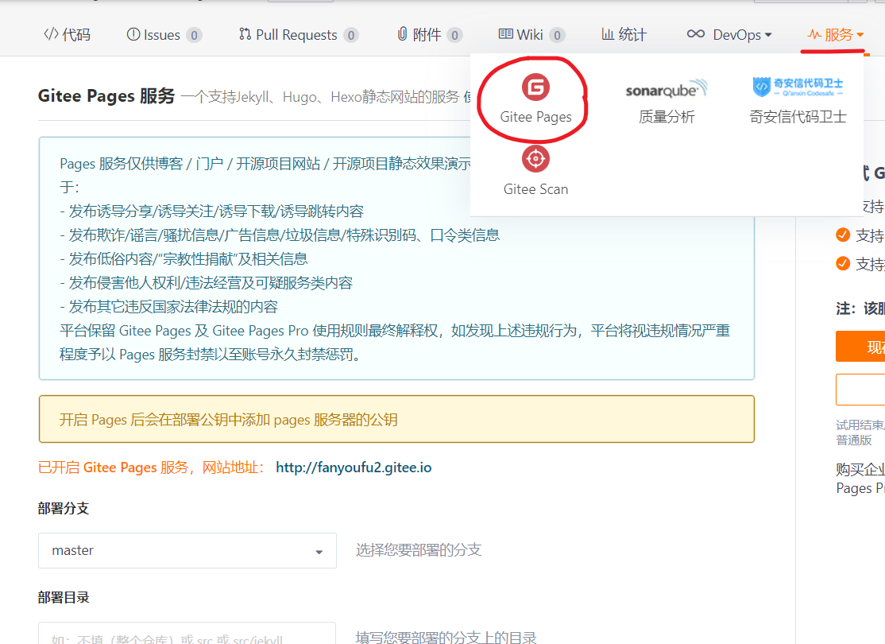
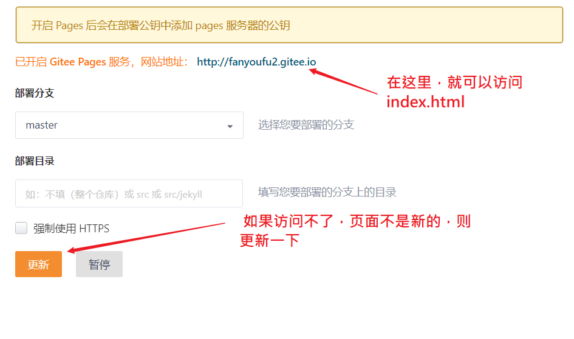

## 交互优化

### 问题1：解决从文章详情中返回时，主页要重新加载

现状：home/index.vue这个组件会被重新加载。

原因：路由的跳转，会导致组件的销毁和重建。

优化： 通过[keep-alive](https://cn.vuejs.org/v2/guide/components-dynamic-async.html#%E5%9C%A8%E5%8A%A8%E6%80%81%E7%BB%84%E4%BB%B6%E4%B8%8A%E4%BD%BF%E7%94%A8-keep-alive)组件来进行对组件进行缓存。


什么是**`组件缓存`**?

如果对组件进行了缓存， 就是 **`一旦组件被创建`**, 那么**`就不会被销毁`**, 虽然我们跳转路由 **`看不到`**了组件,但是这个组件并没有销毁，它的dom虽然没了,但是它的虚拟dom还在,只要我们切回路由, 虚拟dom就会立刻转化成dom。

```
<div id="app">
    <keep-alive>
      <router-view ></router-view>
    </keep-alive>
</div>
```


> 如果缓存的组件过多，或者是把不必要的组件也缓存了，会造成内存占用过多。
>
> 策略：把那些重要,高频的（如主页），或者是不怎么变化的组件缓存下来。


思路：给要缓存的路由做个标记，然后在载入路由时，动态决定是否要缓存。更加精确控制要缓存的组件:

在定义路由时，额外添加路由[元信息](https://router.vuejs.org/zh/guide/advanced/meta.html)，来补充一些信息要素。

```
{ path: '', name: 'Home', component: () => import('../views/home/index.vue'), meta: { isKeepAlive: true } },
```

元信息就是路由对象中的meta属性，它也是一个对象，它可以自定义一些属性，这些属性可以在使用路由时访问得到。

app.vue

```
<div id="app">
  <!--
    keep-alive:它是一个特别的组件，
    作用：把它其中组件进行缓存

    如果路由容器外有keep-alive，则组件会缓存
    如果路由容器外有没有keep-alive，则组件不会缓存

    可以自己定义路由组件时，给路由添加meta，
    设置isKeepAlive是否为true来约定指定要缓存是哪些组件

    $route:路由对象 meta元信息 isKeepAlive（可以改名） 缓存依据

  -->
    <keep-alive>
       <router-view v-if="$route.meta.isKeepAlive"/>
    </keep-alive>
     <router-view v-if="!$route.meta.isKeepAlive"/>
  </div>
```


### 问题2：频道上的文章列表共享滚动条

现状：在某个频道中拖动滚动条时，其它的频道的位置也变化了。

原图：滚动条是公用的，没有独立出来。

解决思路:

- 让每一个articleList.vue自己产生滚动条。

  >  让一个div有自己固定的高度，再通过overflow:auto，那么当它的内容足够多时，就会产生滚动条

步骤：补充必要的css，让articList自己产生滚动条。

直接在style/index.less中进行全局设置即可

```
// 全局样式 在main.js中引入即可
// vant-ui有自已的样式
// 如果这个项目需要去覆盖vant-ui的样式，统一写在这里
.van-nav-bar{
    background-color: #3196fa;
    .van-nav-bar__title{
        color:#fff;
    }
    // 搜索
    .van-nav-bar__text{
        color:#fff;
    }
    .van-icon{
        color:#fff;
    }
}

#app{
    position: absolute;
    left: 0;
    top: 0;
    overflow: hidden;
    width: 100%;
    height: 100%;
}
// .container是Layout.vue组件的根元素的类名
.container{
    width: 100%;
    height: 100%;
}
.index {
    height: 100%;
    .van-tabs {
        display: flex;
        flex-direction: column;
        height: 100%;
        .van-tabs__content {
            flex:1;
            overflow: hidden;
        }
    }
    .van-tab__pane{
        height: 100%;
    }
    // .scroll-wrapper是ArticleList.vue组件的根元素的类名
    .scroll-wrapper{
        overflow:auto;
        height: 100%;
    }
}

```

要在组件补充两个class:

- .container是Layout.vue组件的根元素的类名
- .scroll-wrapper是ArticleList.vue组件的根元素的类名

### 问题3：文章列表的滚动条位置没有记忆

现状：从主页中上的某个频道中改变一下滚动条的位置，然后点击进入文章详情，再次返回，发现滚动条的位置回到了起点。

原因：我们虽然对主页组件进行了缓存，但是这个缓存并不能记录当前文章列表的滚动条的位置。对组件缓存之后，只是缓存数据,虚拟dom，在切换路由，激活组件时，还是会重新生成dom，则滚动条就回到了起点。

解决思路：

- 在每个articleList.vue组件上记录当前的滚动条位置
- 当它的状态变成激活时，去恢复滚动条位置。

步骤

#### articleList.vue

在articleList中，根元素的类为scroll-wrapper，给它监听scroll事件

```
<template>
 <!--
   scroll-wrapper 在这个容器产生滚动条。
   为了恢复页时，能记住它的滚动条位置
   1. 当滚动事件发生时，把当前的滚动条位置记下
     scroll事件
   2. 当页面恢复，重新设置一下滚动条位置
     对于已经缓存组件，它自己及它的子组件都会多出两个特殊的生命周期钩子函数
      activated:  组件激活
      deactivated:组件失活
 -->
  <div class="scroll-wrapper" @scroll="remember" ref="myScroll">
  <van-pull-refresh v-model="isLoadingNew" @refresh="onRefresh">
  </van-pull-refresh>
</div>
```

remember的函数是：

```
// 当scroll发生了，会自动传 event 事件对象
    remember (event) {
      // 取出当前滚动条的位置
      // 保存到一个普通的属性中。
      this.scrollTop = event.target.scrollTop
      // console.log(this.scrollTop)
    },
```

它的作用是当用户在文章列表是滚动条时，会记下位置。 


当articleList.vue激活时恢复

```
activated () {
    // 组件激活时的钩子函数
    // console.log('activated')
    // 去设置一下滚动条的位置
    if (this.scrollTop && this.$refs.myScroll) {
      // 恢复
      this.$refs.myScroll.scrollTop = this.scrollTop
    }
  },
```


- 如果对于组件采用了缓存 `<keep-alive>`，则它会多出两个生命周期钩子函数：[activated, deactivated](https://cn.vuejs.org/v2/api/#activated)。

  

## 打包发布

### 理解打包

作用：用webpack把.vue,.less.css ----> 浏览器可直接执行的代码。

命令:  `npm run build`

打包结果：内部集成了webpack,会在根目录下创建 /dist，在这个目录下创建打包完成的结果

>chunk:块  vendors代理商
>
>chunk-vendors：第三方包的代码统一放在这里（dayjs,vue,vuex,vue-router）
>
>chunk-hash值.js 某个模块对应的js
>
>chunk-hash.js.map ：它会记录当前的.js文件中包含了哪个模块，对应代码位置,有利于代码出错快速找到源代码的位置。


### 打包[结果分析](https://cli.vuejs.org/zh/guide/cli-service.html#vue-cli-service-build)

vuecli中提供一个打包分析的工具：`vue-cli-service build --report`

操作：在package.json 中的build项中，添加 `--report`

```
"scripts": {
    "serve": "vue-cli-service serve",
    "build": "vue-cli-service build --report",
    "lint": "vue-cli-service lint"
  },
```

运行：

```
npm run build
```

它会在dist目录下产生一个report.html文件，其中就有对打包结果的分析说明。


### 查看导出默认配置

vuecli打包工具仍是webpack，只不过vuecli把webpack的配置封装起来了，我们不能直接看到，可通过如下命令来查看：

```bash

#导出当前生产模式下的webpack配置文件到config.json
vue inspect --mode=production > config.json 
```


## 修改打包配置

由于vuecli4集成了webpack的配置，所以可以直接在根目录下新建vue.config.js文件，其中输入内容如下：

```
module.exports = {
  // configureWebpack 配置是vuecli中提供的一个配置项
  // 用来对webpack打包做更加精细的控制
  // 后面的函数中，config就是当前打包时采用的webpack配置
  // 我们可以在这个函数中，对config进行修改
  configureWebpack: (config) => {
    console.log(config)
    config.mode = 'development'
  },
  // https://cli.vuejs.org/zh/config/#publicpath
  // 设置打包后访问资源方式，以是相对路径来访问
  // dist目录下的index.html就可以直接双击打开
  publicPath: './'
}

```

>  对于一些老的vue项目，用vuecli3之前的脚手架创建的项目还是需要去修改webpack.config.js


## 优化打包

优化打包的目标：让打包出来的文件尽可能的小一点。

### vant组件中的按需导入

> 如果我们开发时，只用到van中一部分组件，则我们在打包时，是否需要把整个van全部打包进来？
>
> 按需导入!

共三步：

1. 安装依赖包

```
npm i babel-plugin-import -D
```

2. 在项目根目录创建:babel.config.js

```
module.exports = {
  plugins: [
    ['import', {
      libraryName: 'vant',
      libraryDirectory: 'es',
      style: true
    }, 'vant']
  ],
  presets: [
    '@vue/cli-plugin-babel/preset'
  ]
}

```

3. 在main.js中，只引入需要的部分。

```
import {
  Tabbar,
  TabbarItem,
  Form,
  Field,
  Button,
  NavBar,
  Toast,
  Tabs,
  Tab,
  List,
  Lazyload,
  CellGroup,
  Cell,
  Icon,
  Grid,
  GridItem,
  Popup,
  Row,
  Col,
  Tag,
  Image,
  PullRefresh,
  ActionSheet

} from 'vant'

Vue.use(Tabbar)
Vue.use(TabbarItem)
Vue.use(Form)
Vue.use(Field)
Vue.use(Button)
Vue.use(NavBar)
Vue.use(Toast)
Vue.use(Tabs)
Vue.use(Tab)
Vue.use(List)
Vue.use(Lazyload)
Vue.use(CellGroup)
Vue.use(Cell)
Vue.use(Icon)
Vue.use(Grid)
Vue.use(GridItem)
Vue.use(Popup)
Vue.use(Row)
Vue.use(Col)
Vue.use(Tag)
Vue.use(Image)
Vue.use(PullRefresh)
Vue.use(ActionSheet)
```

### 去掉打包后的console.log

目标：

​      在开发时可以随意写console.log，只要打包时，自动去掉它们。


步骤，共两步


1. 安装依赖

```
npm install terser-webpack-plugin --save-dev
```

2. 修改配置文件

```
module.exports = {
 
configureWebpack: (config) => {
    // console.log(config)
    // config.mode = 'development'
    // 如果当前是生产模式
    if (process.env.NODE_ENV === 'production') {
      // 在webpack的配置对象 config的 optimization属性的minimizer数组的第一个元素的options中设置....
      // 在打包之后的js中去掉console.log
     config.optimization.minimizer[0].options.terserOptions.compress.drop_console = true
    }
  
  },
  publicPath: './'
}
```


## 上线

直接发布到服务器。以码云为例。

- 建立与码云帐号同名的,公开的仓库
- 正常维护代码
  - git
- 确保在项目的根目录下有一个index.html 
- 启用仓库的服务--->gitte pages
- 

-

