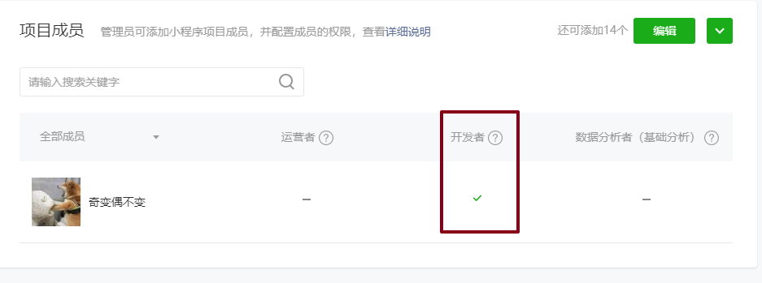

# 01-小程序-介绍-了解

* 微信开发不是前端的专利：支付、验证需要**后台**进行配合！
* ugo:支付
* 微信网页：登录验证；课堂上需要node知识；express框架；

* 微信小程序开发：支付宝小程序、头条、百度、QQ，淘宝小程序；
  * 原生语法；模板、JS语法；循环，判断；语法大同小异；
  * 看市场上有没有框架：uniapp很神奇；


# 02-小程序-申请-了解

* **注意：邮箱，干净的邮箱**
* 学习：个人，没有申请下，今天来说，不影响；


# 03-小程序-ID&&IDE

* ID：标识小程序唯一的身份，会用ID；
  * 如果没有申请下来，不用着急；IDE测试号；
  * 申请下来：找到ID，找一个地方（桌面的txt文档）保存起来；前端，开发！！


* IDE：集成开发环境，测试号；
  * https://developers.weixin.qq.com/miniprogram/dev/devtools/download.html
  * 下载完成后，安装（下一步）；建议不要装在C盘；


# 04-小程序-初始化-01-登录

* 正常出现二维码，不需要设置！
* 联网：但是没有出现登录二维码，网络设置：


* 申请下来：填入appID


* 没有申请下来小程序：


# 04-小程序-初始化-02-新建管理导入及IDE界面

* 如何添加项目：新建，填入appID，不使用云开发；

* 关闭当前项目：
  * 再次打开IDE，默认进入上一个项目；
  * 需求：关闭当前项目，（项目/ 关闭当前项目）
  * 进入：初始化界面（新建，或者点击旧的项目）


* 管理：


* 导入：


# 04-小程序-初始化-03-开发成员

整个入职开发流程：

* 前端组长：
  * 把小程序代码开发完毕；
  * 上传到公司的私有仓储里；

* 小刘（代表着我们）入职公司：
  * 找前端组长或者运营的同学，让他们把我（小刘）添加为项目人员；
  * **继续开发：下拉代码；导入项目；**
  * **可以在IDE中继续开发小程序的代码；**（不然，没有开发权限）
  * 把小刘开发完成后的代码，推到公司的私有仓储上（git版本控制）




* 那公司的 小程序ID 拿到；

* 把公司代码从github 拉取下来；

  


# 04-小程序-初始化-04-目录结构

* 总结：小程序
  * JSON文件，配置文件；需要相关的知识；
  * wxml、wxss：可以理解为HTML和css；
  * 初始化生成一个utils文件夹：在我们后面的开发，可有可无；


* 页面目录结构：


* 规则：
  - 自动在app.json文件中自动把新建的路径添加上去；
  - 所有小程序的页面想要被使用，需要在app.json文件配置后才能使用；
  - 删除一个文件夹cc：需要手动删除app.json配置记录！


# 05-小程序-游乐园-01-navigationBar

* 位置：


* 初始化配置：


* 文档：


* VSC设置自动保存？
  * 不要开启这个自动保存；
  * 自动保存：电脑突然就黑了；再次打开电脑，刚刚写的代码没了；
  * 自动：保存在内存上（没有电，里面的数据都没了）
  * 点击键盘上ctrl+S 绝对是保存在硬盘！！！


# 05-小程序-游乐园-02-tabBar-01-基础配置

* 在app.json里面配置：默认就是底部的tab栏；

```json
  "tabBar":{
    "list":[
      {
        "text":"首页",
        "iconPath":"icons/home-default.png",
        "selectedIconPath":"icons/home-active.png",
        "pagePath":"pages/index/index"
      },
      {
        "text": "卡券",
        "iconPath": "icons/ticket-default.png",
        "selectedIconPath": "icons/ticket-active.png",
        "pagePath": "pages/logs/logs"
      },
      {
        "text": "我的",
        "iconPath": "icons/face-default.png",
        "selectedIconPath": "icons/face-active.png",
        "pagePath": "pages/center/index"
      }
    ]
  },
```

* 具体每一项的配置：
  * text：每项的文字
  * iconPath：没有点击的时候图标
  * selectedIconPath：点击后，当前的图标路径
  * pagePath：点击后，去到哪个页面；主要不能以“./”;


# 05-小程序-游乐园-02-tabBar-02-基础配置

* 修改目录：


* 文字和背景色的配置：https://developers.weixin.qq.com/miniprogram/dev/reference/configuration/app.html

  


# 06-小程序-游乐园-首页轮播图

* 轮播图：
  * 左右滑动；
  * 自动轮播；
  * 无缝衔接；
  * 小点跟着动；
* 小程序：`<view>` <text> 组件；
  * 当作标签去使用就可以了；
  * 轮播图准备好组件；


* 需知：
  * 
  * 没有div  ul  li ; view 块级组件；（view == div）
  * 表达类：
    * input没有边框线’；
    * form 行内元素；
  * navigator （==a）url="./pages/xx/xx"
  * 没有img ，image组件；

* 问题：
  * 发现图片不好看！图片不适配！
  * 适配？换个手机，正常显示！
  * 怎么出现这个问题？image组件默认的宽写成固定320px；在任何屏幕下面，都是320px;

* 代码：

```html
<swiper indicator-dots indicator-color="rgba(255,255,255,0.6)" indicator-active-color="#FFFFFF" autoplay interval="3000" circular>

  <swiper-item>
    <image src="/static/uploads/slide_1.jpg"></image>
  </swiper-item>
  <swiper-item>
    <image src="/static/uploads/slide_2.jpg"></image>
  </swiper-item>
  <swiper-item>
    <image src="/static/uploads/slide_3.jpg"></image>
  </swiper-item>
  <swiper-item>
    <image src="/static/uploads/slide_4.jpg"></image>
  </swiper-item>
  <swiper-item>
    <image src="/static/uploads/slide_5.jpg"></image>
  </swiper-item>

</swiper>
```


# 08-小程序-游乐园-适配

* 涉及到：各个手机上适配！

  * 移动web阶段：rem布局；页面宽度算出来是10rem的时候：CSS代码一直是10rem；
  * 适配：1rem背后代表值在变：


* 小程序如何适配？**rpx；**
  * **记住：小程序规定页面宽度750rpx；**
  * 谁在变？1rpx背后代表的??px
  * 如何变化？rpx单位可以自动识别现在手机是哪个型号，自动找出现在1rpx==??px；
  
  
  
  * 手机：张宏昌发明一个手机 ZHCphone ，手机型号宽度就是750px；问写页面wxss  盒子宽度是750rpx； 1rpx背后代表??px  1rpx = 1px；
* **如果我们到了公司：UI妹纸！！给我们出图设计稿宽度就是750px **
  
  * 如果设计稿上面有个元素标注的是 320px;
  * 在wxss：如何设置？直接就写成320rpx；
    * 在ZHCphone（750px）上：元素应该是多宽？320rpx = 320* 1px = 320px；
    * 在小米MIX 2S（360px）上：元素应该显示多宽？320rpx = 320 * 0.48px = 153.6px;
  * **如果UI出图不是750px，前端可以拒接！！！！**


​	

