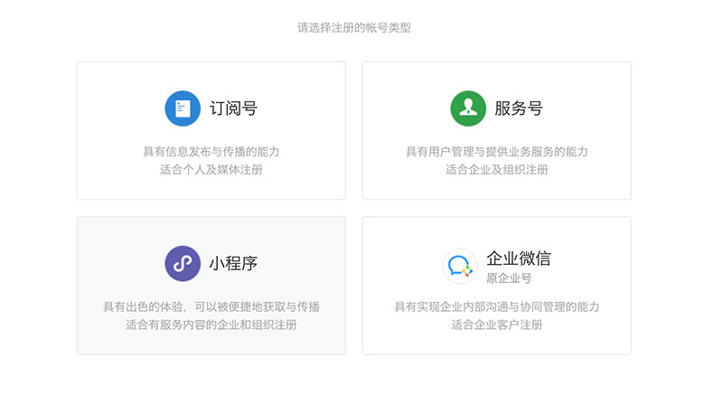
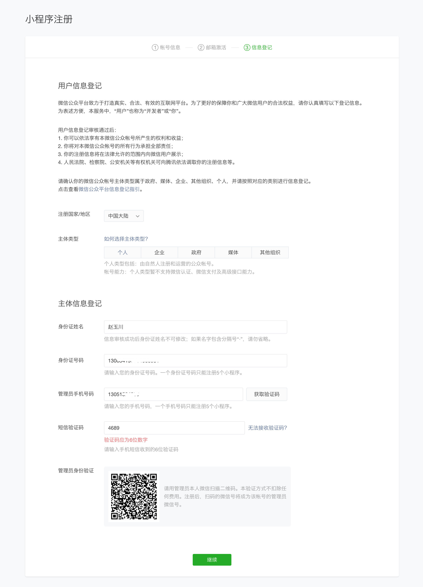
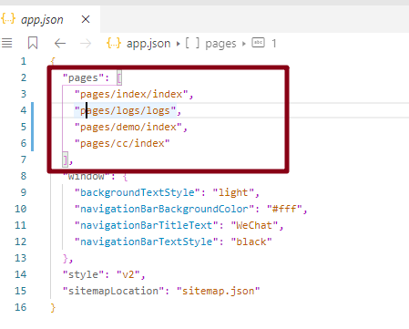
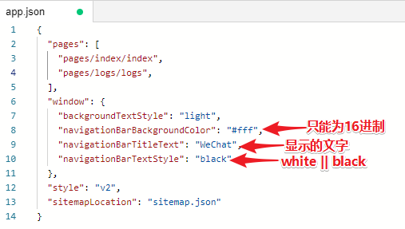
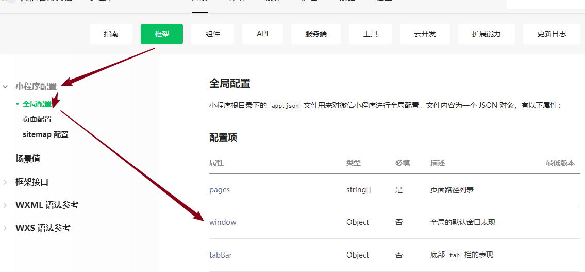

# 小程序 day_01

## 介绍

* 我们学习是什么？**微信**小程序；（支付宝小程序、头条、百度、QQ）
* 微信是什么？**品牌**
  * 支付工具：微信
  * 即时聊天：wechat
  * 公众号：自媒体（订阅号、服务号）
  * 小程序：人多，流量多，传播；商业商城！
* 微信开发：开发微信下面这些（等）
  * 用户登录:  ugo
  * 支付 : 前端不能单独做支付，需要后台配合；
  * 分享：ugo
* 开发平台 
  * 网站
  * 移动
  * 公共平台：mp.weixin.qq.com（mp是微信公众平台的域名，是媒体平台Media Platform的英文缩写。微信公众平台,给个人、企业和组织提供业务服务与用户管理能力的全新服务平台。）
    * 公共号
    * 小程序 
* 切记：微信开发不是前端的专利：支付！微信网页登录验证！


## 申请

* 注册：`mp.weixin.qq.com`


* 选择类型




* 填写信息：


* 信息登记：注意管理员（拥有者）登记



* 登录


* 管理员验证：


* 登录成功


## ID&&IDE

### ID：身份证

* 每个注册的小程序的账号有个唯一的ID，用于开发，上线等；
  * 张三：申请小程序；
  * 李四：申请小程序；


### IDE：集成开发环境

* 开发工具
* IDE：Integrated Development Environment  集成 开发环境，界面显示、开发、调试都在一个界面上显示；
  * VSC：
    * 开发界面；
    * 效果和调试：浏览器；
* 下载：https://developers.weixin.qq.com/miniprogram/dev/devtools/download.html
* 页面寻找：


## 初始化

* ID：小程序
* 下载：IDE 小程序开发共工具；

### 登录

* 联网：二维码没有出来，网络设置的问题；
* 正常：什么设置都不要动；


* 使用**管理者的微信**号扫一扫进行扫描，手机点击确认登录：


### 添加及界面

* 点击+号，新建项目或导入写好的项目：


* 大概功能区：


* 主题配置：


### 开发成员

- 小程序就一个
  - 唯一ID
  - 拥有者：注册的时候，信息主体登记；公司的小程序的管理员是谁?老板；我们到了公司怎么开发？
- 登录：
  - 需要用一个手机二维码扫描：进入IDE进行开发；
  - 前端组长，运营同学；
- **公司配合：**
  - 我管理员 张宏昌 前端组长：
    - 1.我现在的角色：小程序管理员：拥有的权限的最大；（管理员可以做开发！！！）现在开发完毕！
    - 2.按照正常的流程：应该把刚才开发的代码**上传到我们公司私有github**
    - 3.现在大家入职了：小刘（bjxhnn） 继续做小程序部分功能的开发；
      - 我小程序管理员应该把小刘添加为开发人员！在哪里添加？成员管理！
  - 小刘：
    - 1.拿到我们公司的appID  **wx9c591d6ce4c3c227**
    - 2.把公司的项目的地址上代码拉下来！！！
    - 3.开发：需要打开开发软件，把我们的项目**导入**进去！
    - 


- 项目成员：成为项目开发人员，
  - 拿着小程序的ID （唯一）   就可以用了
  - 下次用自己的手机扫描二维码：可以出现两个选择，一个是自己的小程序；一个就是公司的小程序；


### 目录

* 目录结构：
  * json文件在小程序这里：配置使用；


* 其他：


* 新建目录 ，新建page；


* 规则：
  * 自动在app.json文件中自动把新建的路径添加上去；
  * 所有小程序的页面想要被使用，需要在app.json文件配置后才能使用；
  * 删除一个文件夹cc：需要手动删除app.json配置记录！




## 代码初体验

### 介绍

* 游乐园：代码初体验；
* 切图：
  * PS
  * sketch：

* UI的工具：sketch；了解
  * **导出会生成HTML文件**，点击页面上元素，右侧显示样式；（前端：非常的方便查看页面元素大小）
  * 为了方便我们前面去查看元素的信息；
* PSD格式文件有什么区别呢？PS软件直接查看


### app.json

* 小程序：JSON文件里面都是配置文件；

* 注意JSON文件的格式：字段为双引号，数组末尾成员没有逗号；
* pages：数组
  * 新建的页面自动新增在pages属性；（规则：写了一个新页面，必须要写在pages里面。不然看不见）
  * 默认显示的是pages数组的第一项的页面；
  * 路径后面没有后缀的，自动找到wxml页面；


* window：窗口；


### 顶部栏配置

* 页面的构成：打开一个微信页面，手指按在页面最上面，往下拽，出现一个灰色的区域；


* background 下拉页面时，才可以看到，以后会在下拉刷新讲到；

* 头部：`navigationBar 配置


* 配置：



* 文档




### tabBar


* 配置tabBar后：报错：需要list字段，且为数组（需要记住的字段 list）


* 配置list为数组后：


* 至少需要一项：配置每项
  * text：选项文字
  * iconPath：图标路径，相对路径
  * selectedIconPath: 当前选择项的图标路径
  * pagePath：选项卡点击后的页面地址


* 配置三项：


* 配置文字被选择的颜色：
  * color：选项卡字体默认颜色
  * selectedColor:被选择中的字体颜色
  * **大小和字号：固定设置；**


* 顶部线设置：
  * borderStyle：顶部线颜色，没有样式和宽度设置；只能为white或者black；


* tabBar的位置：
  * position：默认bottom;当设置top时，图标没有，下横线没有；内部设置设置的！！！


### 页面-初体验

* 新建一个页面：app.json 配置项自动配置


* 配置到“我的”pagePath，且配置为当前显示页；


* 需知：
  * **规则：小程序同一个目录下面 index.xwss  自动找同名的  index.wxml   文件；**
  * **特别：小程序里面没有 ul  li  div 标签；**
  * view  相当于html中 div；在我们小程序这块叫组件！**把组件当做标签使用；**
  * input 没有边框线；
  * form 默认为行内元素；
  * **navigator url="./index/index" 页面转跳，需要点击后才能转跳；相当于是HTML 里面 a**
  
* 初体验：60页；

```html
<!--pages/center/index.wxml-->
<form>
  <view class="item">
    <label>姓名:</label>
    <input />
  </view>
  <view class="item">
    <label>姓名:</label>
    <input />
  </view>
  <view class="item">
    <label>验证码:</label>
    <input />
  </view>
</form>
```

```css
form {
  display: block;
  padding: 15px;
  box-sizing: border-box;
}

.item {
  display: flex;
  height: 40px;
  line-height: 40px;
  border-bottom: 1px solid #ccc;
}

.item label {
  width: 60px;
}
.item input {
  flex: 1;
  height: 100%;
}
```


### 首页-轮播图

* 页面：


* 开发文档：


* 设置每项图片，使用image 标签；属性src为图片地址：
* **细节：图片不设置宽高，和屏幕一样框，默认750rpx;**
* 属性设置：值为Boolean，只要放入该属性名就是默认为true;


### 页面适配

- 问题的出现：
  - 小程序中：图片是固定的大小，换手机就应该适配；
  - 为什么出现这个问题？image：固定默认大小320px；

- 移动端 rem：
  - 页面宽度，CSS元素的特点：10rem；
  - rem：各个档位下1rem背后的值；
  - 实际手机如何操作呢？**手机会自动找到当前屏幕宽度下 1rem 背后代表的值；**


- 小程序 rpx：
  - 约定：**页面宽度750rpx，在所有手机屏幕下都是750rpx**
  - 变的是什么：各个屏幕下1rpx背后代表的值；
  - **比如：**
    - **有个手机（ZHCphone手机）宽度刚好是750px，需要UI多大设计稿?750px;**
    - **那么根据约定小程序页面宽度同时也是750rpx；那么此时1rpx = 1px;**
  - 实际手机如何操作呢？**手机会自动找到当前屏幕宽度下 1rpx 背后代表的值；**

| 设备           | 屏幕尺寸  | rpx换算px (屏幕宽度/750) |
| -------------- | --------- | ------------------------ |
| iPhone5        | 320px     | 1rpx = 0.42px            |
| 小米MIX 2S     | 360px     | 1rpx = 0.48px            |
| iPhone6        | 375px     | 1rpx = 0.5px             |
| iPhone6 Plus   | 414px     | 1rpx = 0.552px           |
| HUAWEI Mate 10 | 480px     | 1rpx = 0.64px            |
| **ZHCphone**   | **750px** | **1rpx = 1px;**          |

- UI给我们什么：
  - 750px的设计稿，为什么？方便我直接测量，把测量后的结果直接变为rpx；（1rpx = 1px）
  - 如果UI给的不是750px设计稿：**拒接，沟通重新出图；**


