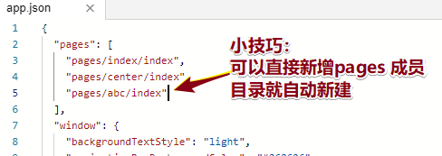

# 00-回顾

* 申请：目的，为了得到小程序的appID；
* 目录结构：
  * app.json：用于？配置？界面配置：window tabBar：会查文档就可以；
  * app.wxss：样式文件；css：手机上显示，css：移动端布局：**flex布局复习一下；**
  * app.js：入口函数；
  * pages / cc(目录) /
    * index.wxml：结构：组件 
  * index.wxss   局部页面样式
    * index.js  ： 局部JS交互文件
    * index.json：局部的配置文件？
* 轮播图：swiper 组件功能，基本都是以属性配置的方式；
  * 属性不要记住；
  * 记住如何查文档；
* rpx：适配；为什么UI给750rpx设计稿：
  * 小程序屏幕宽全部：750rpx;
  * UI必须给750px;


* 反馈：语速：加速；慢慢的放下节奏；慢慢的来~~~~
* 开心~~


# 01-小程序-游乐园-01-预览问题及解决

* 遇到问题：
  * 因为啥出现？
  * 如何解决？


* 问题：


* 原因：

  * 小程序上传代码大小2M；可以通过设置最多8M；
  * 本地图片大小超出2M；

* 图片角色：

  * 搭建静态页：图片帮助我们搭建页面；
  * 上线之前：**图片地址都是后台返给网络地址！**

* **重点：正式开发**

  * 1.替换 相对路径 为 网络地址
  * 2.配置：https://developers.weixin.qq.com/miniprogram/dev/devtools/projectconfig.html
  


* 成功的忽略：


# 01-小程序-游乐园-02-wxss内图片问题

* 报错：把图片以本地相对路径形式引入到wxss，作为背景图：
* 解决：
  * **图片作为网络地址引入**
  * base64 图片流；
* **重点：**
  * wxml：可以使用本地路径，需要最后把图片换为 **网络地址；**
  * wxss：
    * 不能使用本地路径，以后换为**网络地址  base64 图片流；**
    * 字体库：iconmoon；字体文件**（网络地址）**
  * 网络地址：后台给**图片，字体图标的文件，都是以网络地址的形式**（后台管理图片、字体文件）
  * tabBar ： icons做为图标的配置：每一项中 iconPath：**不支持网络图片，支持本地相对地址。**


* **前端配置 重点：**
  * 设置忽略：
    * **工作：本地图片，字体文件，设置忽略。**
    * 从哪里来？后台来，给前端就是**网络地址**；
    * 网络地址用在哪里？wxml  wxss里！
  * **不能忽略谁：tabBar所用的图标地址；不是网络地址**


# 02-小程序-发布流程

* 1.上传：专人去做
  * 版本号：v2.1.1  (前端无需关心)
  * 上传到微信小程序的服务器上，我们在哪里可以看到？小程序管理后台界面；
* 2.来到后台管理界面：需要把本次版本设置为 **体验版本；**


* 3.谁体验？**成员管理 / 体验成员  测试人员；（不会代码，老板）**

* 4.测试完成后，没有bug；进行提交审核小组内专门的人负责（提交给微信团队人员）；审核通过后，不会帮咱们发布；
* 5.公司自己专门的人点发布；


* 前端团队里面：有个专门的人负责提交，测试，发布；
* 公司：前端组，就你一个人；负责前端团队；


* 小点：**详情的时候：唯独不要选择  小游戏**；选择账户，注销；


* 分小组：

  * 组内：2-3小组；相互监督；一起做作业；一起开语音；讨论问题；

  * 自觉：保证控制1小时 无电子感染；学习；


# 03-小程序-注意-VSC开发小程序

* VSC插件：**minapp**：注意：先输入`<`输入   组件名称；

* 以后：代码编辑：VSC；

* 小程序IDE开发工具：不再编辑！

  * **1.新建page；**自动会在`app.json`添加路径；**小技巧：可以在json直接添加；**

  

  * **2.指定测试页等**：不需要修改app.json 文件；

  

  * **3.真机测试；**可以在手机上真实看到页面调试效果；

  


# 04-小程序-注意-v2样式问题


* 建议：上来就删除 `style:v2`;默认就是旧版本；没有v1：只有旧版本和v2，


* 样式：效果不应该出现，没有报错；看样式层叠没有问题；有可能就是V2样式；意见：上来删除v2，使用旧样式；

* v2内置样式库：会使btn  有一定的宽度；权重问题，想修改默认btn样式的话，提高自己写的样式权重；
* 旧样式库：会使btn 宽度就是屏幕的宽度；想修改默认btn样式的话，直接写就可以了；


# 05-小程序-数据渲染-01-{{}}和for

* 简单的数据渲染：**加{{}}，无论在 组件标签内部，行内属性**

```html
<!-- 5.组件内标准属性渲染 class id url -->
<view class="{{className}}">这是组件内标准属性渲染</view>

<!-- 6.自定义属性 :格式 data- 事件对象里面可以获取  -->
<view data-abc="{{attr}}">这是组件内标准属性渲染</view>
```

* **wx:for={{}}**

```js
<!-- 2.对内置变量index item  替换  -->
<view 
  wx:for="{{arr}}"
  wx:for-index="i"
  wx:for-item="ele">
  {{i}}  *******>   {{ele}}
</view>


<!-- 3.wx:key 找一个唯一的字符串或者数组 保留关键字  *this, 不需要加{{}}-->
<view 
  wx:key="id"
  wx:for="{{list}}">
  	{{item.name}}
</view>
<view 
	wx:key="*this" 
	wx:for="{{list}}">
    {{item.name}}
</view>
```


# 05-小程序-数据渲染-02-if

* wx:if  要不就出现要不就不出现；使用在wxml 结构上

```html
<view wx:if="{{item.age>=18}}">成年</view>
<view wx:else>未成年</view>

<!-- block ：可以把一样的判断条件的 组件写在一起：判断条件只写一次 ugo-->
<block wx:if="{{item.age>=18}}">
    <view>成年</view>
    <view>可以参军</view>
</block>

<block wx:else>
    <view>未成年</view>
    <view>不能参军</view>
</block>
```


# 05-小程序-数据渲染-03-hidden

* hidden :类似于 v-show ，会出现在wxml 结构上（显示或隐藏的状态）
  * true  :  确认隐藏，不显示
  * false：不隐藏，显示；


# 06-小程序-事件执行函数-01-基本语法

* 基本语法：不能用@；和vue区分开！
  * bind事件类型 = “函数名”
  * bind:事件类型 = “函数名”  (**推荐大家使用这个**)

```html
<input 
  bind:focus="fn_1"
  bind:blur="fn_2"
  type="text" style="border:1px solid #000"></input>

<button type="primary" bind:tap="btn_tap">点击我输出信息</button>
```


# 06-小程序-事件执行函数-02-自定义属性设置和获取

* 代码：小程序不能传入参数！


* 重点解决需求：设置自定义属性设置 和 获取
  * 1.设置：`wxml 格式上  data-自定义属性名 = {{绑定的值}}`
  * 2.获取：JS内部，事件对象属性获取 **e.target.dataset.自定义属性名**


# 06-小程序-事件执行函数-03-this

* 数据更新：
  * 1.如何获取data上初始化数据：this.data.属性
  * 2.如何更改data上数据“：`this.setData({属性：新的值})`

```js
    // 回想 vue ：this.key = !this.key;

    // 1.获取:data初始化数据如何获取；
    // console.log(this.data.key);

    // 2.设置:data初始化数据如何获取；
    this.setData({
      key: !this.data.key
    });
```


* 笑话：前端开发，一定要立志做一个大牛！为什么？我们要写出非常牛逼，非常傻瓜式框架！让其他程序员用我们这个框架，让他们变成傻瓜，让他们没有工作！
* 参数传递：不支持；自定义属性；
* 更新数据：
* vue：非常便利高级封装！高级工具，回到根本；
* 公司：
  * 1-3 ：夯实技术，业务做精；
  * 往后：源码；vue高级封装；
  * 往后：个人规划；CTO  CEO 产品经理；植发；收集起来；


* 作业：
  * 复习：flex布局；
  * 自己写tab栏点击 效果；作业：完成；我记得住，我抽选几个幸运观众！
  * 预习：下一天的笔记！


