 

# 小程序 day_02


## 预览

### 问题

* 目前我们完成了小程序的首页面，如果通过开发工具=>预览=>扫码，会遇到一个**错误提示**，如图所示：

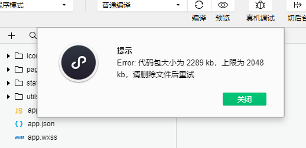

* 错误的原因：微信官方要求小程序代码包体积不允许超过 2M，其中图片资源占用了较大部分空间，然而实际项目中图片资源都是通过服务器返回，而非本地资源，所以 2M 的大小可以满足大部分的需求。


### 解决

* 图片的角色：
  
  * 本地图片：在写静态页时候，以相对路径写wxml；帮助我们搭建静态页；
  * 上线前时候：图片的地址（不是以相对路径写wxml）都是作为后台返回的数据（**图片都是放在服务器上的**）
  
  ```js
  var res = [{
  	imgSrc:"http://www.xxx.xxx/aasd/asdas/xx.jpg"
  }]
  ```


* **现在：学习，没有后台，没有服务器；仍然向要图片：不要相对路径，想要网络地址；造：**
* 我们在学习阶段，又没有自己的服务器，但是我们又想看看效果；把图片上传到GitHub上，设置网站静态资源；把wxml里面标签内使用图片上传到服务器内；
  * 只是学习阶段，真实工作（图片都是放在服务器上的）不是这样；
  
* 1.单独的把图片文件夹拿出来一份：

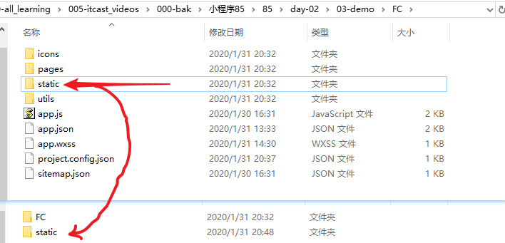


* 2.把上传到github：init，add，commit，push

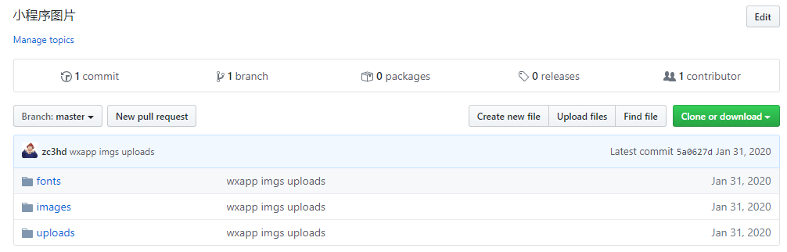


* 3.设置为网站的静态资源及测试

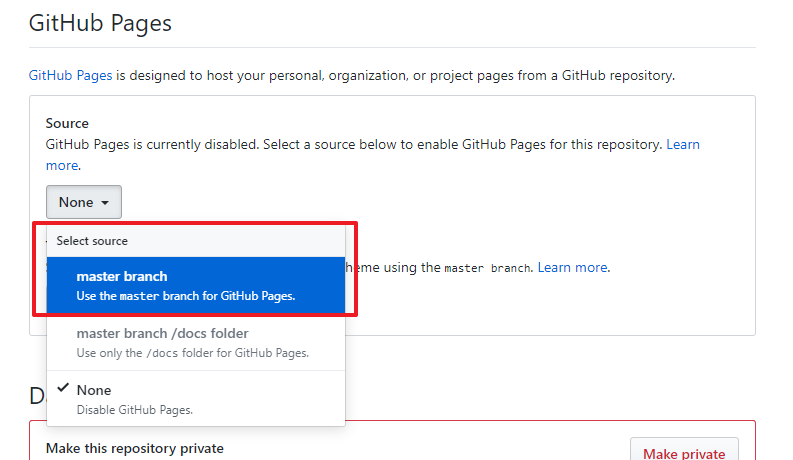

* 测试： https://zc3hd.github.io/wxapp_img/slide_3.jpg

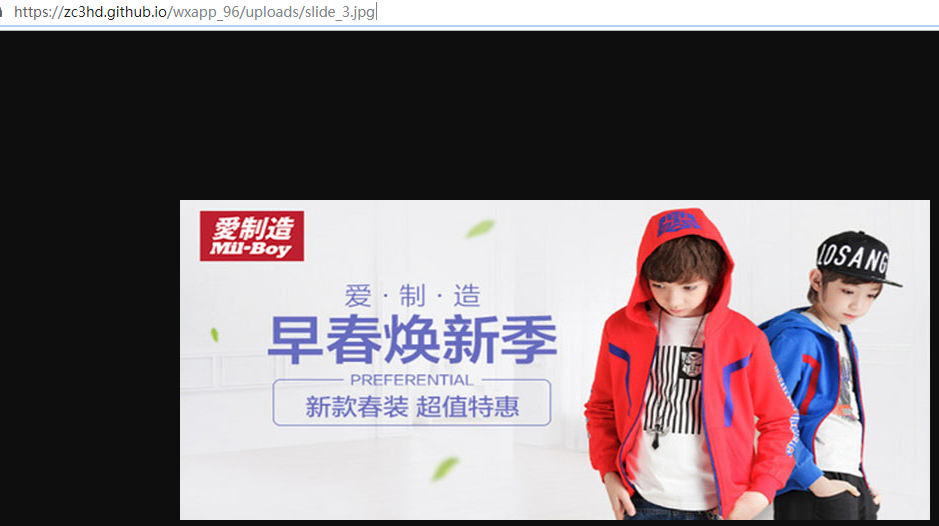

* **4.页面代码替换：相对路径 替换为网络地址  可以打开我们的编辑器**

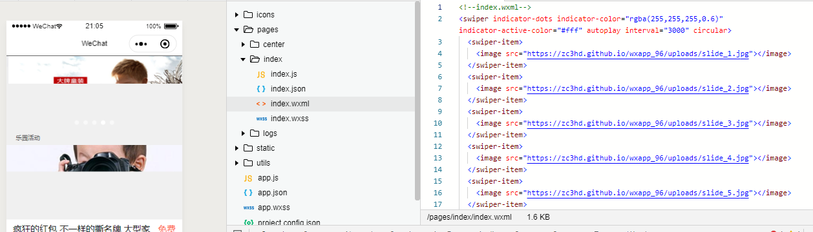

* **5.打包的设置：project.config.json /  packOptions：打包设置  ignore：忽略打包编译项目：**

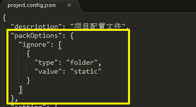

* 文档：

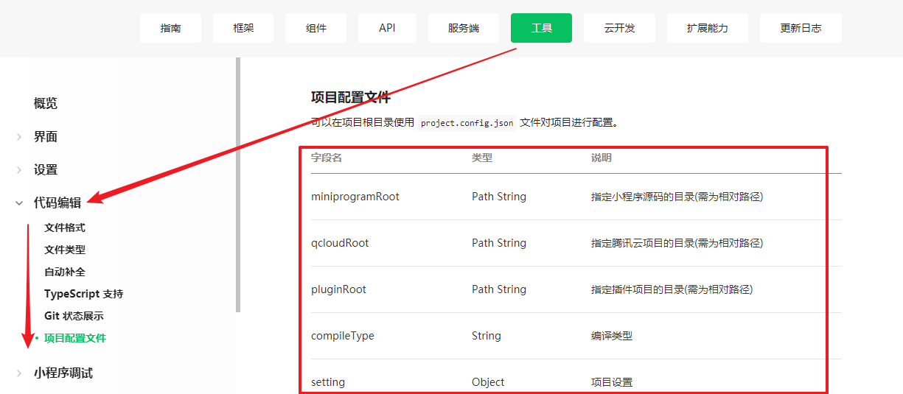

* 找到：packOptions /ignore

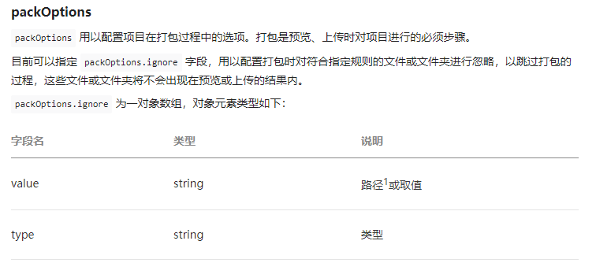

* 预览信息

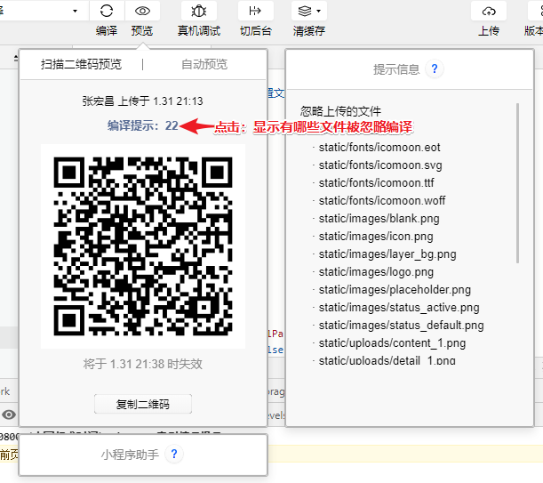


* 正式开发：
  * 图片：
    * 静态页：相对路径
    * 后期：网络地址形式，从哪来？后台来！
  * 前端：
    * 1.需要  相对路径  替换为 网络地址
    * 2.配置：project.config.json 配置忽略；


### wxss内图片问题

* **wxml：**把static文件夹下面的图片上传到GitHub，在 **wxml的标签** 内可以使用；
* **wxss：**在**wxss**内使用相对路径：会有报错；**在wxss文件内使用网络图片**

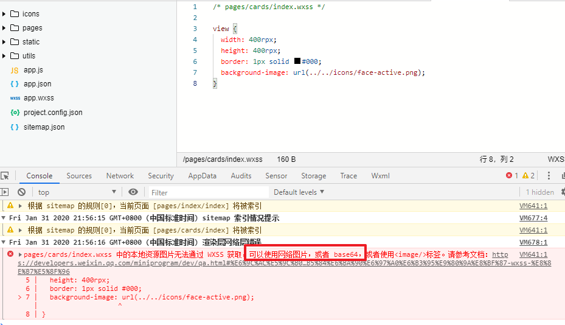

- **字体图标**，iconfonts下载到本地，上传到服务上，wxss里面全部使用网络地址；**注意：wxapp服务器地址需要为https，不然会有问题**
  - 字体图片下载：https://icomoon.io/
  - 上传自己的图标 svg格式（UI设计）

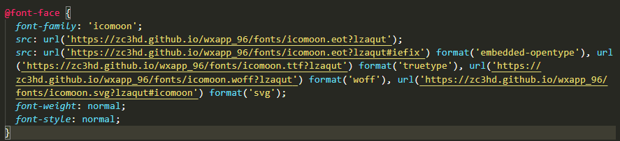

```css
@font-face {
  font-family: 'icomoon';
  src:  url('./fonts/icomoon.eot?lzaqut');
  src:  url('./fonts/icomoon.eot?lzaqut#iefix') format('embedded-opentype'),
  url('https://static.botue.com/paradise/fonts/icomoon.ttf?lzaqut') format('truetype'),
  url('https://static.botue.com/paradise/fonts/icomoon.woff?lzaqut') format('woff'),
  url('https://static.botue.com/paradise/fonts/icomoon.svg?lzaqut#icomoon') format('svg');
  font-weight: normal;
  font-style: normal;
}

[class^="icon-"], [class*=" icon-"] {
  /* use !important to prevent issues with browser extensions that change fonts */
  font-family: 'icomoon' !important;
  speak: none;
  font-style: normal;
  font-weight: normal;
  font-variant: normal;
  text-transform: none;
  line-height: 1;

  /* Better Font Rendering =========== */
  -webkit-font-smoothing: antialiased;
  -moz-osx-font-smoothing: grayscale;
}

.icon-heart:before {
  content: "\e900";
}
.icon-down:before {
  content: "\e901";
}
.icon-clock:before {
  content: "\e902";
}
.icon-location:before {
  content: "\e903";
}
.icon-calendar:before {
  content: "\e904";
}
.icon-headset:before {
  content: "\e906";
}
.icon-flag:before {
  content: "\f11d";
}
.icon-user:before {
  content: "\f2c0";
}
```


* **为什么tabBar使用的icons上传到服务器上？**

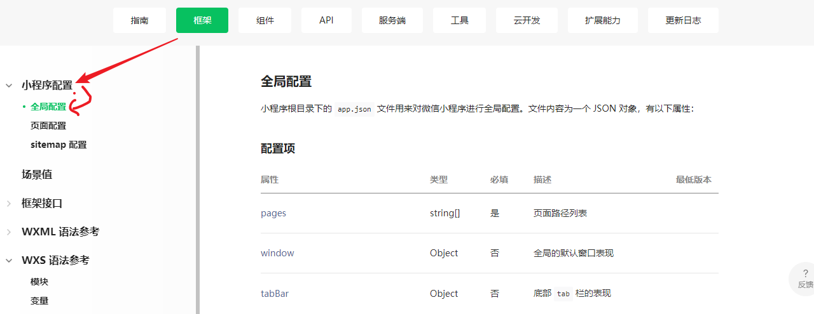

* **tabBar不支持网络图片**

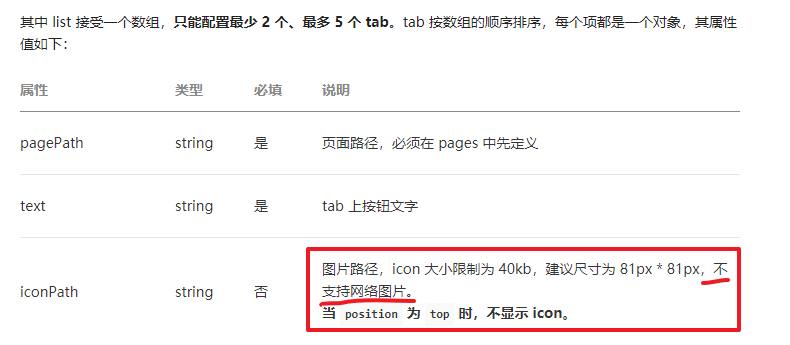


## 发布

* 为什么来到这？卡片：预览，V1版本开发完毕！！
* 开发到哪个位置？看效果！


### 总体流程

* 流程：
  * 1.有**前端组：专门的成员（只有一个人）（版本管理）**把最终的代码进行上传；（平时前端：就是提交git）
  * 2.上传后：微信小程序的服务器上；在管理后台设置为体验版本；上传到微信服务器前面！去哪能看到？小程序账户后台管理界面！UI 前端 后台 测试
  * 3.谁体验？**测试人员；**
  * 4.测试完成后，进行提交审核（提交给微信小程序管理人）；
  * 5.审核成功后，需要我们点击按钮进行发布；（发布后，大家就可以搜索到我们的小程序）

### 上传

* 上传代码到后台，界面中可以看到，但只是在微信的服务器上，没有正式发布；

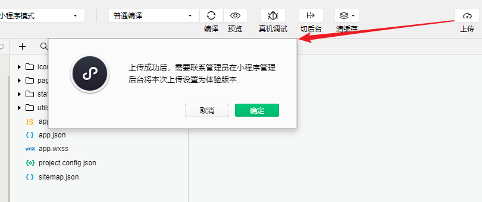

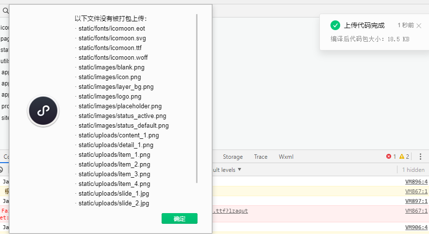


### 设置体验版本

* 点击提交审核右侧的下拉箭头，设置为体验版本：

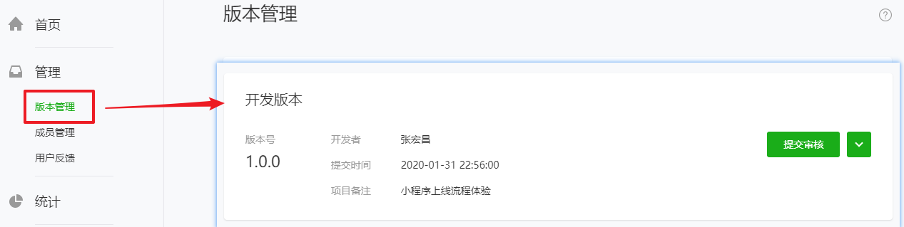

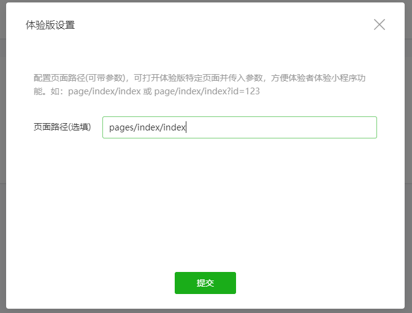

* 设置成功后，出现二维码：

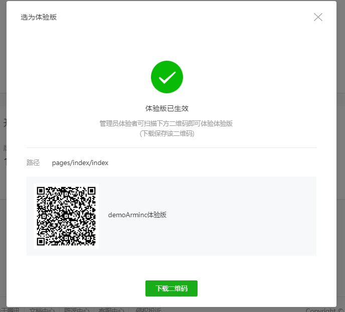


### 体验成员管理

* 哪些人可以称为体验者？**公司的测试人员**

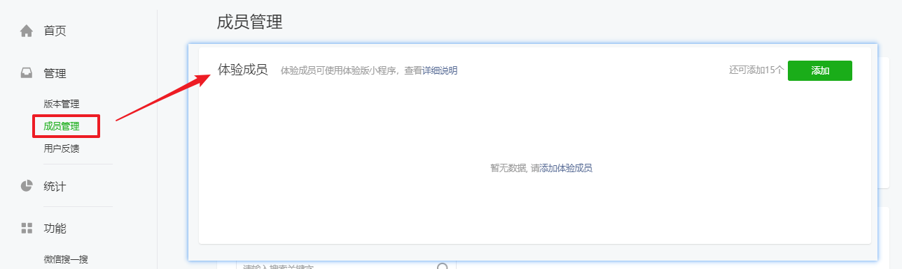

* 测试人员：提bug；数据错误；


### 提交审核

* 测试人员测试完成，没有bug，提交审核给 **微信的审核人员**；
* 小程序里面：出现不好的东西！！！

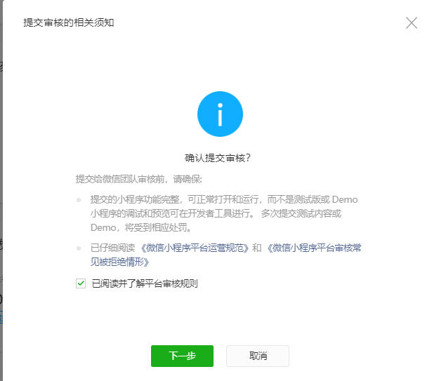

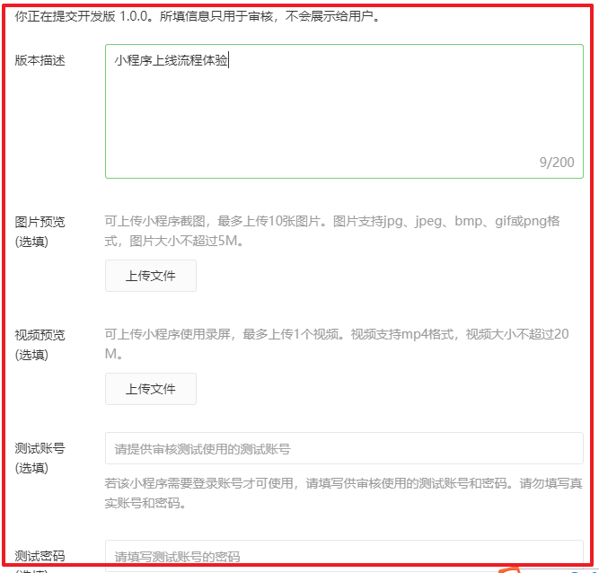

### 发布

* 审核完毕，通过！微信团队人员不会给咱们发布！需要点击发布按钮才能发布！

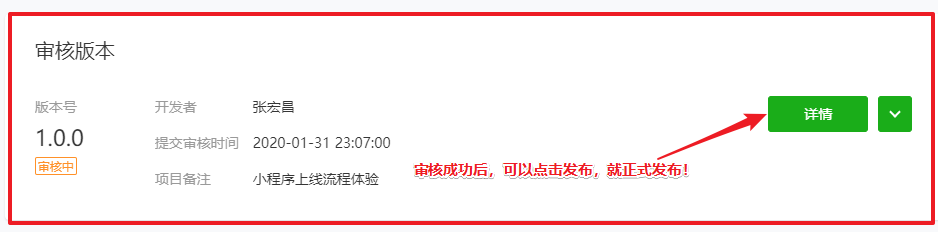


## 注意！！！

### VSC开发小程序

* VSC插件：**minapp**，在编辑里编辑我们的代码；小程序的IDE编辑器可以关了；

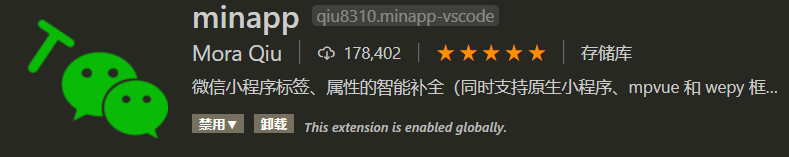

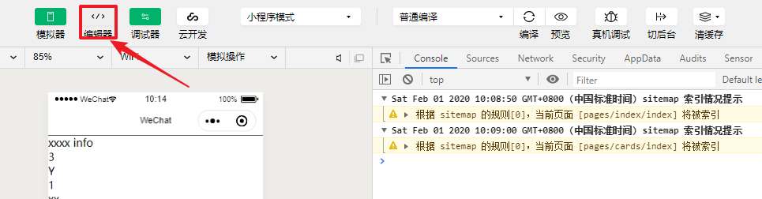

* 小程序的IDE作用：
  * 1.新建page；自动会在`app.json`添加路径；**也可以在json直接添加；**
  * 2.指定测试页等；
  * 3.真机测试：


* **指定测试页等**


* 真机调试

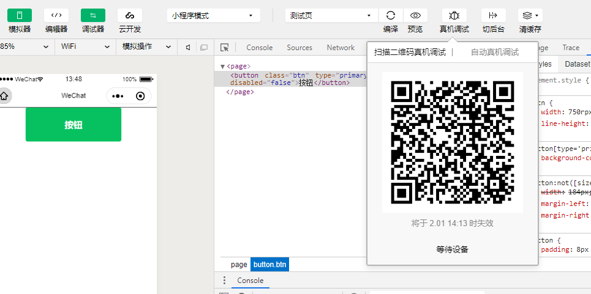

- 鼠标放入dom上时，手机会实时显示状态

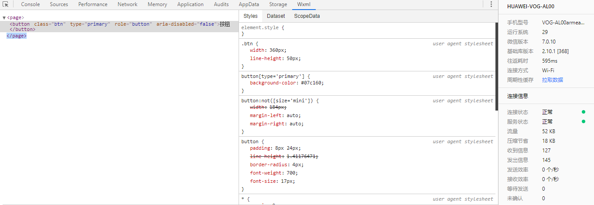

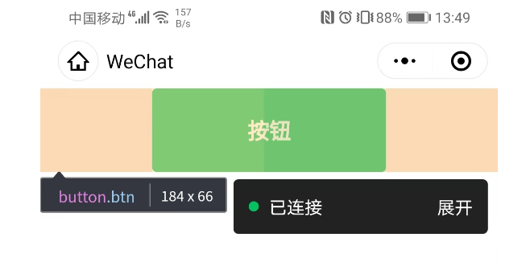


### 新样式v2

* v2：样式版本号，在哪？？

* 设置新样式不会真实的覆盖掉内置的样式，尽管引进划了横线；

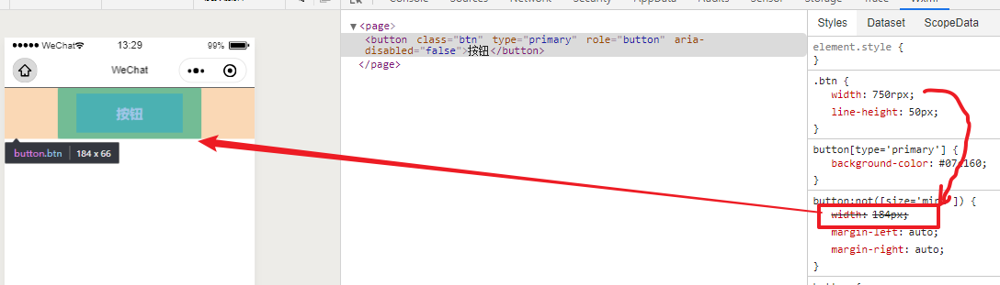


* 解决：
  * 提高CSS权重
  * **不使用v2版本**：（现在只有原来版本，和新版本v2）

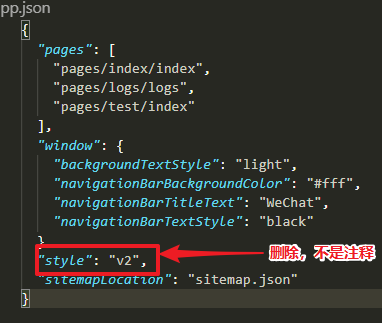


## 数据渲染

### 为什么

* 前面都是样式，没有JS的数据渲染，搞开发都是做数据交互，所以我们需要学习；
* 交互：为了让用户和页面 交流互动；
* 页面中，初始化函数Page(),参数为对象{}，且为必须传入的；

```js
Page({
    
  // 页面初始化数据 和vue类似；
  data:{
      
  }
    
  // 事件的回调函数（执行函数）
  

  // 生命周期函数
});
```

### {{}}

* 简单数据展示：

```js
Page({
  /**
   * 页面的初始数据
   */
  data: {
    msg: "xxxx info",
    a: 1,
    b: 2,
    flag: true,
    list: [1, 2, 3],
    obj: {
      name: "xx"
    }
  },
})
```

```html
<view>{{msg}}</view>
<view>{{a+b}}</view>
<view>{{flag?"Y":"N"}}</view>
<view>{{list[0]}}</view>
<view>{{obj.name}}</view>
```

* 标准属性绑定：

```html
<view class="{{obj.name==true?'ac':''}}"></view>
```

* 自定义属性绑定

```html
<view data-key="{{key==true?'xx':'bb'}}"></view>
```


### wx:for   

* **wx:for 属性将当前组件按着数组的长度动态创建，并且通过 index 变量可以访问到数组的索引值，通过item变量可以访问到单元值。**
* 格式注意：wx:for="{{list}}",**必须加{} 大括号**

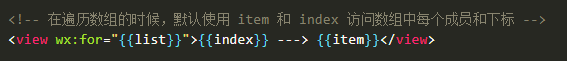

* 如果要替换默认的item和index变量：

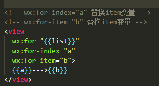

* 使用 `wx:key` 来指定列表中项目的唯一的标识符
  * 字符串，代表在 for 循环的 array 中 item 的某个 property，该 property 的值需要是列表中唯一的字符串或数字，且不能动态改变。
  * 保留关键字 `*this` 代表在 for 循环中的 item 本身

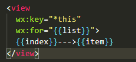

```html
<view 
  wx:key="id"
  wx:for="{{list}}">
  {{item.name}}
</view>
<view wx:key="*this" wx:for="{{list}}">{{item.name}}</view>
```


### wx:if

* 基础使用：

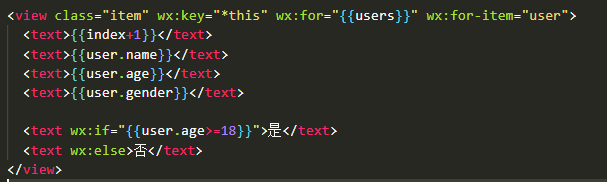

* 如果是同一个判断条件，输出多个标签：使用block组件；

```html
<view class="item" wx:key="*this" wx:for="{{users}}" wx:for-item="user">
  <text>{{index+1}}</text>
  <text>{{user.name}}</text>
  <text>{{user.age}}</text>
  <text>{{user.gender}}</text>

  <!-- block：就是配合 if 输出多个不同标签 -->
  <block wx:if="{{user.age >= 18}}">
    <text>是</text>
    <text>是</text>
  </block>

  <block wx:else>
    <text>否</text>
    <text>否</text>
  </block>
    
    
</view>
```


### hidden

* 控制元素节点是否显示在视图中：`<view hidden>asdsa</view>`;
* wx:if wxml结构出现与否；hidden wxml 出现的，隐藏状态；
  * true：隐藏
  * false：显示

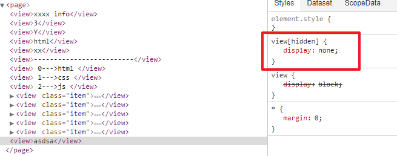

* 如何设置：`<view hidden="{{false}}">asdsa</view>`

* **注意：小程序这，只要是变量或者直接的数据，都需要带{{}}，如果不带，就会把”“里面数据作为字符串了；**


## 事件回调函数

### 为什么

* 为什么要学习这个知识：**交互的入口；**
  * 注册事件：需要事件的执行函数；
  * 知道触发的是哪个盒子：
  * 更改初始化数据；


### 基本语法

* 语法格式：
  * bind事件类型=”事件执行函数“   bind:tap
  * **bind:事件类型=”事件执行函数“   (推荐使用，清晰看见事件类型)**
* 事件类型：
  * tap：手指点击屏幕
  * focus：获取焦点
  * blur：失去焦点：input组件；初始化样式没有 边框的；

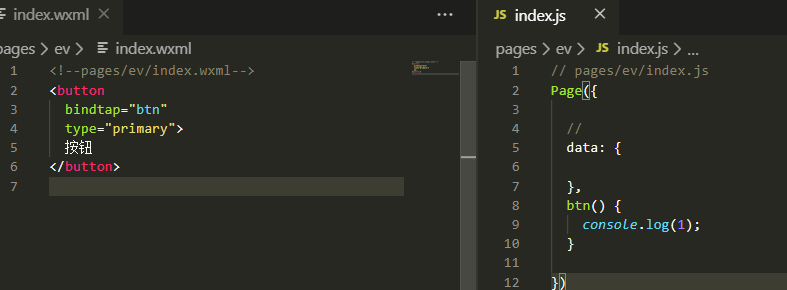


### 事件对象及自定义属性

* **为什么?多个盒子  wx:for循环 注册事件，如何知道点击的是哪个？**
  * 事件对象
  * 自定义属性
* 事件对象语法：

```js
  btn(e) {
    console.log(e);
  }
```

* **自定义属性**的获取（回想原生JS自定义属性的获取）

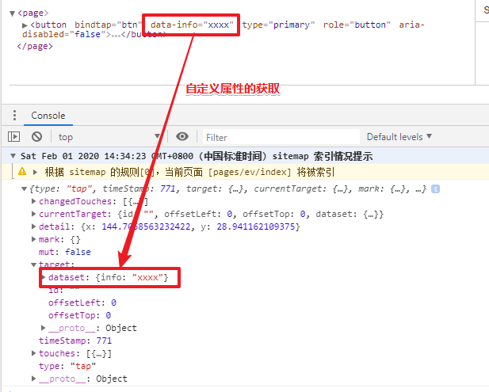


### this数据更新

* this：返回的是Page函数执行后的实例化；但是：(没有像vue那么高级封装)
  * 上面没有data上的所有属性
  * 没有对属性设置setter getter （数据双向绑定）
* **执行方法：实现数据与视图的同步更新，setData()，会自动新传入的对象内，修改变化的属性值进行同步；**

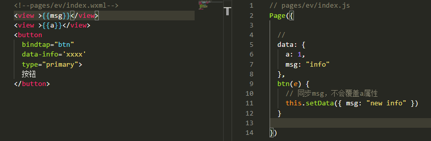

* data调试工具：

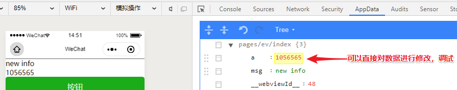


