# 00-回顾

* 布局：小程序最终是移动端显示，布局方案：移动端；
  * 推荐使用flex 移动端兼容性好；布局快（代码会更少）
    * H5：flex布局；如果适配：flex布局的基础上+ rem单位 ( rem布局) 
    * 移动端：推荐使用flex布局，要求大家做适配rpx；
      * **UI必须给我750px设计稿；好处：为了大家好！写wxss特别方便！**
* 预览：代码超出2M：
  * 原因：图片太大；
  * 图片角色：
    * dev开发：处于搭建静态页（相对路径）
    * build：如果我知道图片网络地址，把本地图片删除了？配置：忽略部分文件
  * 注意：
    * wxss：图片背景图；不能用本地图片，只能用**网络地址**或base64位图片流
    * tabBar：本地图片；不支持网络图片
* 发布流程：串一下；
* 基础语法：
  * `wx:for="{{arr}}"   wx:key="id"(没有{{}})     wx:key="*this"`
  * 绑定事件：`bind:tap="fn(item.id)"`
    * 现象：小程序给事件函数传入参数，不认识 ；fn(item.id) 当方法；
    * 解决：
      * 1.设置：在wxml 组件内 设置自定义属性 ， data-xxx = "asd";
      * 2.获取：在函数内部，事件对象：e.target.detail.xxxx
  * 初始化数据：
    * 获取：this.data.属性名
    * 设置：this.setData({属性名:"zs"})

* 作业：

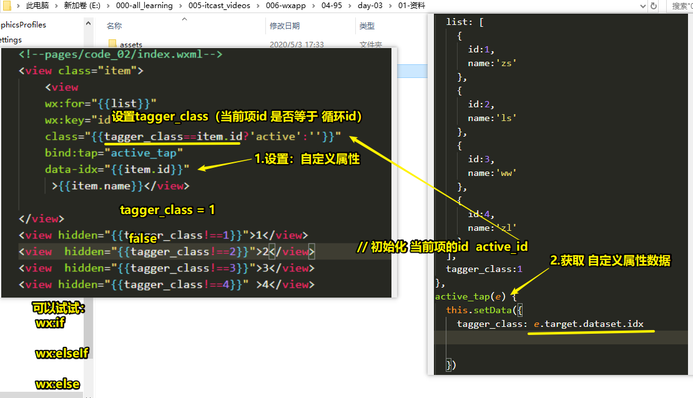


# 01-小程序-请求-01-基本语法及开发阶段配置

* 顶级wx

```js
	// 1.小程序 不支持我们已知；
// 2.有自己的方法；API  （方法）
wx.request({
    url: "http://127.0.0.1:3000", // 请求的地址
    // method: "GET", // 方法 默认就是GET
    // data: {}, // 传入的数据，没有数据，可以不写
    success: function(res) {
        console.log(res);
    },
    fail:function(){
        
    }
});
```

* **报错记住：需要让大家记住，小程序做异步请求，请求这个地址 必须在要小程序后台管理界面进行配置；**（为了安全）
  * 小程序：请求，地址；必须在管理后台进行配置才能使用；
  * 如果不配置：就会有报错！
  * 配置：不允许IP+地址；最终上线之前配置完成！现在开发学习阶段：

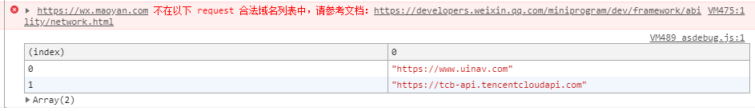

* 开发阶段：如何做请求，IDE 选择项

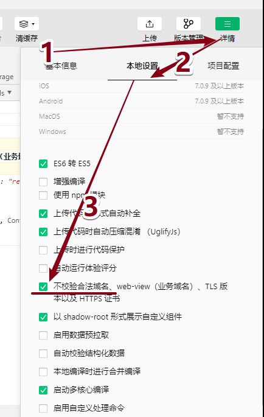


# 01-小程序-请求-02-上线前管理后台配置

* 小程序上传到微信的服务器；
  * 小程序的代码在微信服务器上，
  * 从微信服务器上你的小程序发出一个请求，请求数据；
  * 微信团队为了安全性，要求大家必须先把要请求的地址进行配置；
* 后台管理界面的配置：用于显示小程序或者测试小程序；要求：
  * **域名**要备案
  * https 协议开头 安全证书；
* 拓展：https://github.com/zc3hd/ESC_node_ol  线上服务器购买和部署，域名；阿里云服务器部署；

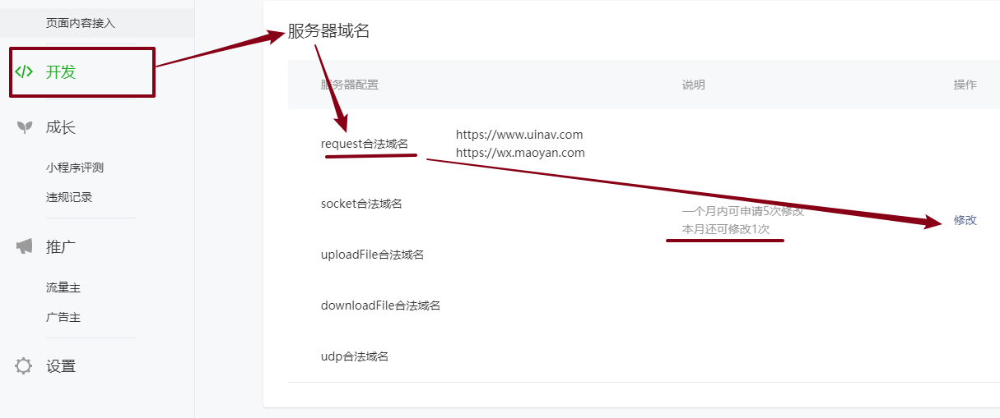

* 如果公司接口地址配置好了，一直用这个地址，IDE里面不需要进行开发阶段配置；
* 如果公司没有接口地址，服务：IP+port；需要给配置IDE 不校验合法域名；

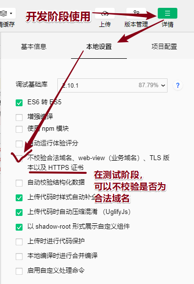


# 02-小程序-猫眼-tab切换

* 分析及步骤：

  * 1.两个选项注册点击事件；

  * 2.点击之后：

    * **如何知道自己现在点击的是哪个？？？**
      * NO：传入参数：小程序传入参数完全当做函数处理；
      * YES ：**自定义属性；data-key**  获取自定义属性的值；（事件对象）
    
    ```
    * **如何获取自定义属性？事件对象；e.target.dataset.key（弥补了函数不能传参）**
    ```
* **知道自己点击的是谁，接下来：**把点击的这个数据先设置在初始化数据；
  
    ```wxml
    <text class="{{ac=='hot'?'current':''}}" data-ac="hot" bind:tap="change">热映</text>
    <text class="{{ac=='coming'?'current':''}}" data-ac="coming" bind:tap="change">待映</text>
    ```
    
    ```js
      change: function(e) {
        // 1.获取到当前点击是谁
        // 2.设置到初始化数据，改变wxml视图
    this.setData({
          ac: e.target.dataset.ac
    });
      },
    ```
    
* 在IDE查看 现在页面显示页面路径

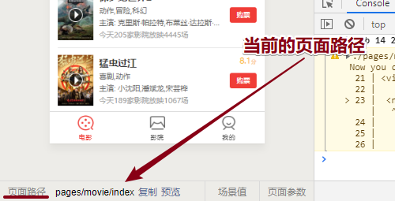

* 对应列表的显示或隐藏（ wx:if 都是可以，逻辑和hidden反过来！）

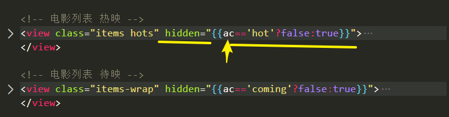


# 03-小程序-猫眼-首页数据加载

* 重点：
  * 报错：xx域名不在合法域名中
  * 解决：
    * 1.不校验  开发阶段
    * 2.去配置，管理后台配置；上线前阶段（添加、修改都算一次机会，共5次）

* **页面一一开始加载**onLoad：
  * 数据请求：猫眼电影API接口 https://wx.maoyan.com/mmdb/movie/v2/list/hot.json；
    * 疫情：电影院不让开！没有热映！！没有数据！
  * 拿到数据，hots数据；怎么办？
    * 初始化数据`hots;`
    * 把获取到数据保存下来，通过`this.setData()`更新视图 一定注意this的指向；
    * 视图wxml：`wx:for  wx:key="*this"`


* IDE：查看页面初始化数据

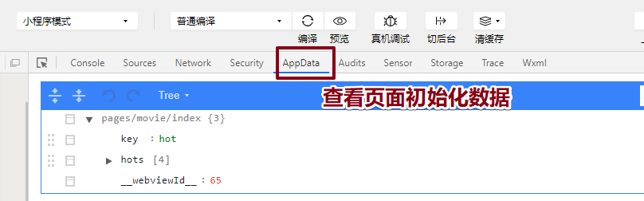


# 04-小程序-事件的执行-01-冒泡及阻止冒泡

* 规则：
  * 1.事件执行三个阶段；
  * 2.事件默认是在冒泡阶段执行；

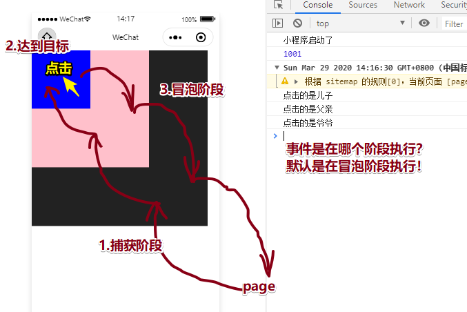

* 处理这个现象：
  * 原因：事件默认在冒泡阶段执行！！
  * 处理：阻止冒泡；

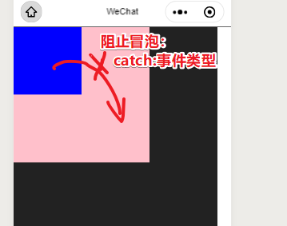

* 用处：**比如父级注册了某个事件，子辈也注册了同样的事件！注意：阻止冒泡；**


```html
<view class="yeye" catch:tap="yeye_tap">
  <view class="fuqin" catch:tap="fuqin_tap">
    <view class="erzi" catch:tap="erzi_tap"></view>
  </view>
</view>
```


# 04-小程序-事件的执行-02-捕获(了解)

* 事件默认只是在冒泡阶段执行，可以通过代码设置 事件在捕获阶段执行！
* 不这样设置，设置知识就是个了解；

- 比如：
  - 上下级父子嵌套了10000层
  - 给每层注册点击事件tap
  - 设置 事件在 捕获阶段执行；
  - 点击最孙子那层的组件，会发生什么事？？
  - 用户体验极其不好。（用户：点击东西？我的事件呢？点丢了？？）`capture-bind`


# 04-小程序-事件的执行-03-互斥(了解)

* 只要是mut-bind绑定事件，
  * 不是阻止冒泡；
  * 互斥，相同的事件类型，在冒泡阶段，事件只会执行一个！触发哪个就执行哪个！
  * 效果和阻止冒泡很像，了解互斥没有阻止冒泡！

```html
<view class="yeye" mut-bind:tap="yeye_tap">
  <view class="fuqin" mut-bind:tap="fuqin_tap">
    <view class="erzi" mut-bind:tap="erzi_tap"></view>
  </view>
</view>
```

* 阻止冒泡：catch:事件类型？
  * 大众习惯：bind:tap；
  * 某个：冒泡执行影响用户体验，想起用catch就可以；


# 05-小程序-生命周期-01-App基础语法及重点

* **生命周期：在JS这**
  - **本质：就是内置的一些函数**
  - 函数：**到了特定的节点，监听小程序到了哪个节点，声明周期这个函数就会执行；**
* App应用级别：

```js
App({


  // 生命周期：函数，内置的；特点：会在特定的节点执行
  // 本质：是个函数，
  // 函数：执行？什么时候执行？到了特定的时间点就会执行！！！

  // 小程序启动的时候：启动只会执行一次；
  // onLaunch(res) {
  //   console.log("小程序启动了");
  // },
    
    
  // // 能看见小程序，从后台切前台
  // onShow() {
  //   // console.log("wxAPP 显示了");  // 从后台前到屏幕前面的时候，执行onShow
  // },
    
    
  // 看不见小程序，切到手机后台的时候
  // onHide() {
  //   console.log("wxAPP 切后台");
  // },

  // ********了解 ：测试，不会出现error，不会出现指定页面不存在！
  // 小程序：很多人在维护；写错了。用户体验可能会有问题；
  // onError() {
  //   console.log("wxapp 出错了");
  //   // 给弹窗用户友好：小程序正在维修；
  // },

  // 小程序在启动的时候，指定打开页面，没有找到的话，函数执行；
  // 小程序启动后，如果点击再次进入其他页面找不到，不会执行了。
  // 意义：当小程序启动时，给用户一个友好提示：弹窗：
  // onPageNotFound() {
  //   // 用户提醒：友好提醒
  //   // 怎么就找不到页面？
  //   console.log("页面找不到友好提醒");
  // },

})
```

* 重点：
  * onLaunch
  * onShow：只要重新看到小程序，就会执行；
  * onHide：只要看不见小程序，就会执行；

* 了解：（点击关闭）微信为了用户体验好！
  * 不会真的被关闭；
  * 小程序处于隐藏状态，没有被销毁；
  * 什么时候被清空数据关闭：
    * 关闭手机；
    * 微信发现手机使用内存很多，微信才会选择性关闭一些小程序；
    * 很长时间都没有再次打开（切前台屏幕），微信会选择清空这个小程序的数据；
  * 把同样的小程序再次打开：
    * 只会执行onShow：切到屏幕前面；
    * 不会执行onLaunch；


# 05-小程序-生命周期-02-Page基础语法及重点

* 重点：
  * onLoad：页面加载后，执行一次，写在onLoad
  * onshow：页面出现的时候
  * onHide：页页面隐藏的时候
* 文档：https://developers.weixin.qq.com/miniprogram/dev/reference/api/Page.html

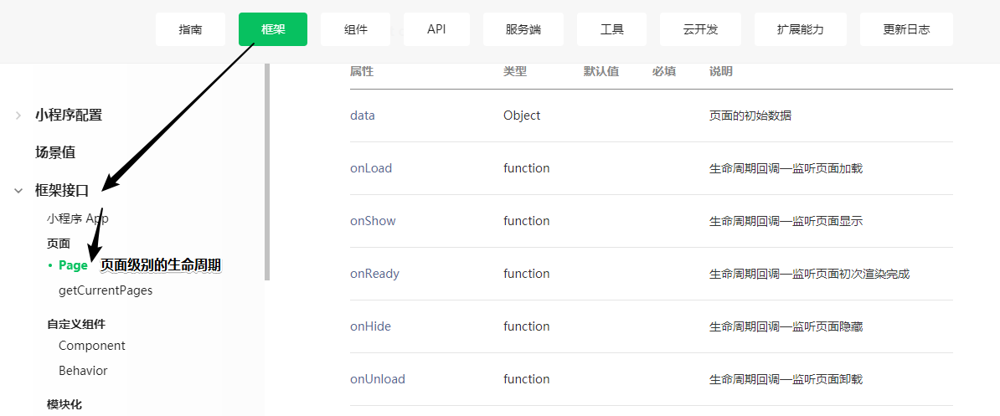

* 过程：
  * A页面（会支持onLoad onShow）：去往 B页面（B页面的 onLoad onShow）；
  * 从B页面（没了，触发onHide）返回 A页面 (重新出现了，会执行onShow)
* 合起来重点：
  * onLaunch：小程序启动后，不容易销毁；
  * onShow  onHide 看见某个页面，会执行
  * 页面：onLoad：首页，一加载后 onLoad,，从首页去往其他页面（首页还在，只是被隐藏）


# 06-小程序-生命周期-03-场景值

* 场景值：小程序处于什么样的场景，会有一个特定的值；
* 比如打开小程序的方式：**扫码、转发、搜索**
  * 打开方式的不同：为什么要知道这个事，打开方式不同，意味，以后如何推广小程序更为合适；
  * 谁：老板；
  * 前端code语法：在app.js 应用级别的 生命周期函数
```js
  App({
    // 启动了，不容易关闭；
  	onLaunch(res){
  		console.log(res.scene);
  	},
    // 专门页面；被使用次数；切手机后台，切回来（用户想用小程序）
    onShow(e){
        console.log(e.scene);
    }
  });
```

* 文档：scene说明 https://developers.weixin.qq.com/miniprogram/dev/reference/scene-list.html


# 06-小程序-生命周期-04-地址参数

* 场景：
  * 进入某个页面，看产品的详情
  * 产品的详情：布局都是一样，这个页面的结构都是一样；进入的是同一个页面；
  * 不一样：页面内的数据
  * 如何解决：进入这个页面的时候，
    * 给这个页面 传入一个参数 ：比如 商品ID；
    * 在页面中 向后台 请求不同的数据；
* 传入：navigator上地址上拼接参数

```wxml
<navigator 
  wx:for="{{list}}" 
  wx:key="id"
  url="../01_good/index?id={{item.id}}">{{item.name}}</navigator>
```

* 多个参数：

```html
<navigator url="../01_good/index?id=6&name=zs">去01-good页面</navigator>
```

* 在具体的页面中：获取传入的参数，onShow是获取不到！

```js
onLoad(query) {  

    // 1.页面加载的时候，可以拿到传入页面的参数
    // console.log(query);

    // 2.拿到参数，可以向后台发出请求，id:1,返回商品详情数据；  wx.request({});
},
```


* 生命周期重点：

  * 代码：函数；什么时候执行！

  * app:

    * onLaunch ：获取场景值
    * onShow：获取场景值
    * onHide

  * page:

    * onLoad：query 获取参数；
    * onShow
    * onHide

  * 场景值：app级别  e.scene;

  * 地址参数：从列表进入单个页面的详细，需要传入参数 商品的ID  

    


# 07-小程序-wx.API-01

* 文档：https://developers.weixin.qq.com/miniprogram/dev/api/ui/interaction/wx.showToast.html

* 弹出框：

```js

    // 1.显示一个加载状态
    wx.showLoading({
      title: '加载中',
    });

    // 2.发出一个请求；

    // 3.请求成功后；
    setTimeout(() => {
      wx.hideLoading();
    }, 2000);


    // ---------------------------------------------弹出框
    wx.showModal({
      title: "用户注意",
      content: "您确认删除此项么？",
      // 
      success: function(res) {
        // 在这个分支下面：写业务；
        if (res.confirm) {
          console.log("您刚才点击的是确认");
        } else {
          console.log("您刚才点击的是取消");
        }
      }
    });


    // ---------------------------------------------简单信息提醒
    wx.showToast({
      duration: 2000,
      title: "信息加载成功",
      icon: "none",
    });
```


