# 小程序 day_03


## 请求

### 为什么

- **前后端分离**：纯数据交互；ajax请求数据，后台返回数据 [{name:"1"}]
  - 以前：前后端不分离；前端切图仔，基本上工作干完了！好多前端JS业务逻辑，不是前端写；后台模板引擎 (把前端写的html文件读取到后台，字符串，HTML改一些特定的格式：`%data%`，注入数据`${{}}`,JS后台写，后台的一些数据注入模板中，访问某个路径的值，注入好的字符串返回；)
  - 现在：前端和后台处于分离；前端有很多业务，JS写，数据来自后台；纯数据交互；ajax数据请求；
- 小程序不支持 ：XMLHttpRequset，axios、$.ajax不能使用；

### 基础语法

- 文档地址：https://developers.weixin.qq.com/miniprogram/dev/api/network/request/wx.request.html

```js
wx.request({
    url: "http://127.0.0.1:3000",
    method: "GET",
    data: {},
    success: function() {},
    fail: function() {}
});

// 搭建一个node服务；
const http = require("http");
http.createServer((req, res) => {
    res.end("hi world");
}).listen(3000);


//----------------------------------------------------------------------------

// 线上地址：
wx.request({
    url: "https://wx.maoyan.com/mmdb/movie/v2/list/hot.json",
    method: "GET",
    data: {
        limit: 12,
        offset: 0,
        ct: "北京",
    },
    success: function(res) {
        console.log(res);
    }
})
```


### 开发阶段配置

* IDE配置：

- 本地设置：不校验合法域名；
- 注意上线前，要把域名换过来；

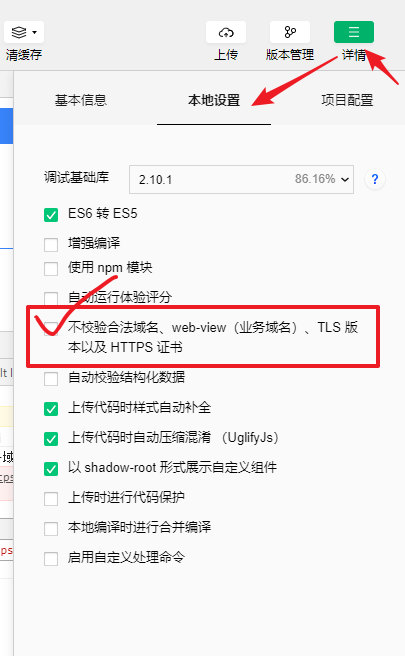

- 请求回来的数据设置到视图上面，注意this的指向的绑定，或者设置变量，临时保存；

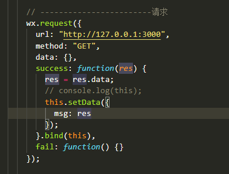


### 上线发布配置

- 直接点击获取数据，会有下面报错：

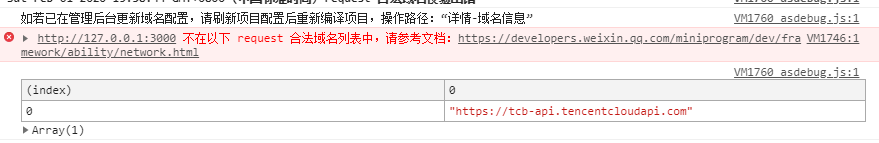

- 需要在后台配置域名；

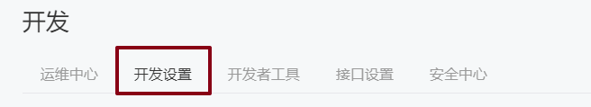

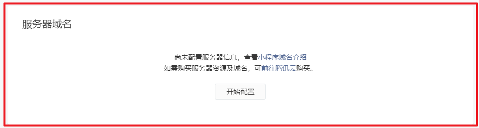

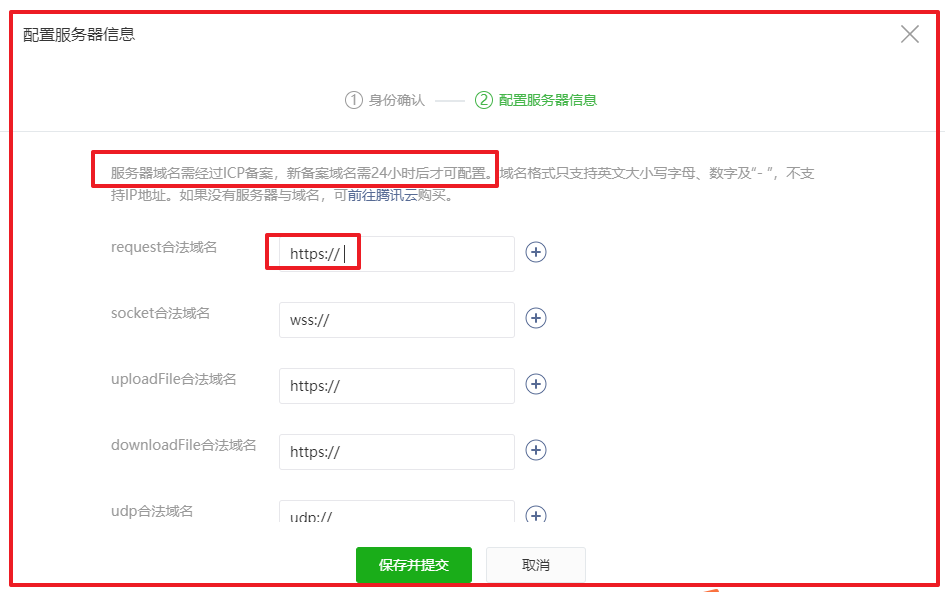


## 猫眼-tab切换

### 为什么

- 练习：
  - 事件的点击；自定义属性！一定练习！
  - 数据的请求；
- 查看当前页面路径：

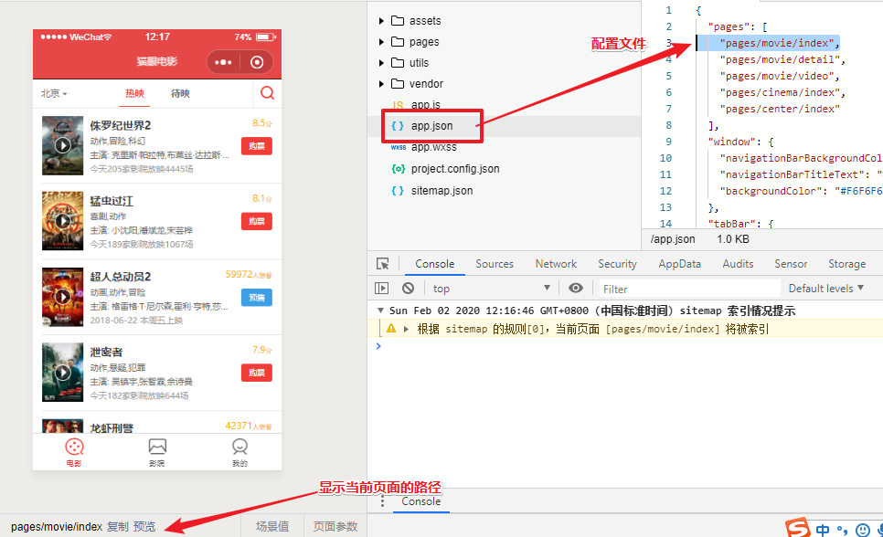

### 需求

- **页面结构已经写好，实现点击切换**
  - 1.点击 热映 待映（注册相应的点击事件）
  - 2.点击其中一个，给当前加类名，思考如何知道当前点击的是哪个？
    - 传入参数？**会报错，小程序事件的回调函数就是函数名，没有参数！**
    - 使用自定义属性（意义相当于是参数；）
  - 3.给点击的当前添加类名？如何添加？
    - 把获取到的数据，用变量保存起来，视图里面进行判断；

### 代码

- 1.注册点击事件
- 2.如何知道当前点击的是哪个？

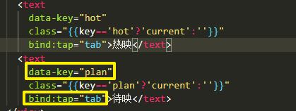

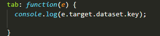

- 3.把获取到的数据，用变量保存起来

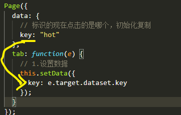

- 4.在视图里面进行判断

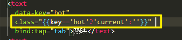

```html
	<navigator url="./detail" wx:for="{{hots}}">
		<view class="item">
			<!-- 播放按钮 -->
			<text class="play"></text>
			<image src="{{item.img}}"></image>
			<!-- 信息 -->
			<view class="meta">
				<text class="name">{{item.nm}}</text>
				<text class="type">{{item.cat}}</text>
				<text class="actor">{{item.desc}}</text>
				<text class="count">{{item.boxInfo}}</text>
			</view>
			<!-- 状态 -->
			<view class="status">
				<view class="extra">
					8.5<text>分</text>
				</view>
				<text class="btn">购票</text>
			</view>
		</view>
	</navigator>
```


## 猫眼-加载数据

- 页面加载完后，请求服务端数据，渲染数据：

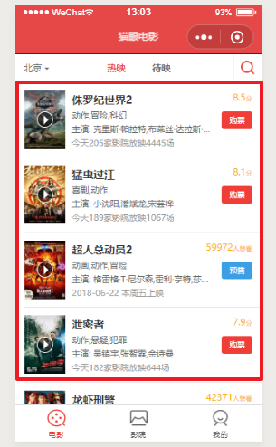

- 页面加载后：**生命周期函数 onload 当页面加载完成后，函数做一些事件**

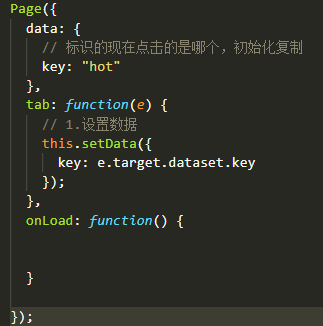

- 请求数据：

```js
    wx.request({
      url: "https://wx.maoyan.com/mmdb/movie/v2/list/hot.json",
      method: "GET",
      data: {
        limit: 12,
        offset: 0,
        ct: "北京",
      },
      success: function(res) {
        console.log(res);
      }
    })
```

- 出现报错：

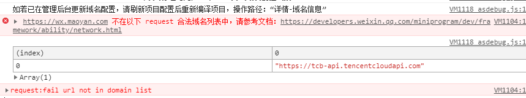

- 配置及查看：

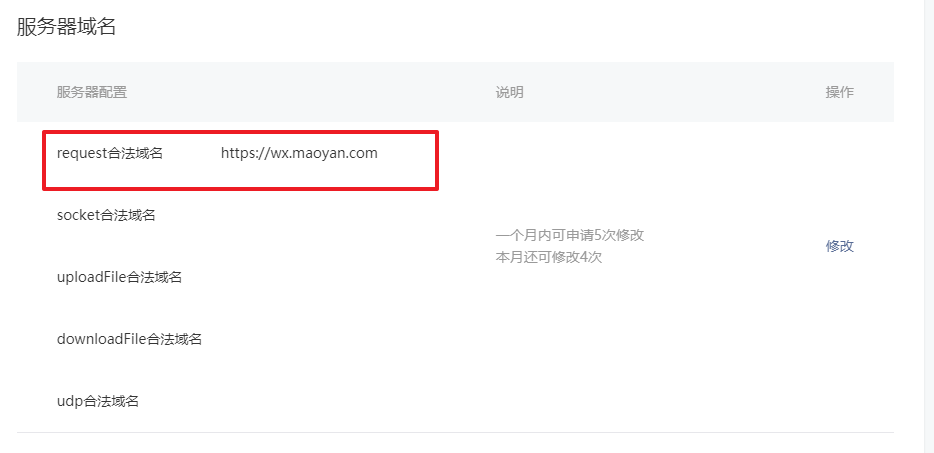

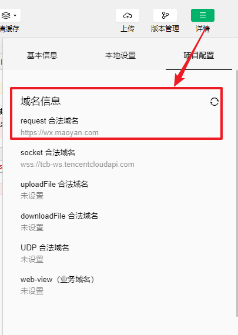

- 拿到返回的数据：

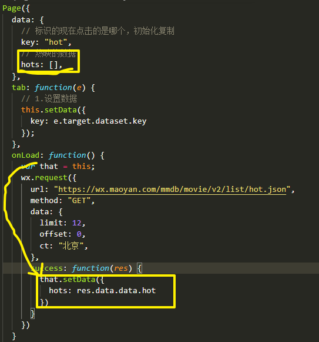

- 图片服务器：需要在渲染之前处理数据：

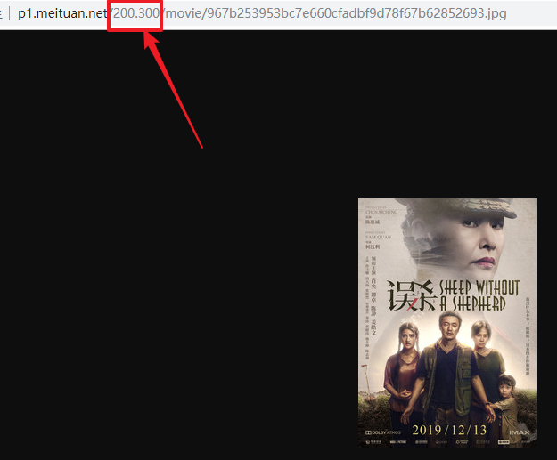

- 使用网络地址注意：
  - 猫眼电影图片信息，从wxml发送出的请求，都是静态资源的请求，不需要设置备案；
  - **只要是通过JS api调用的接口地址都需要备案；**


## 事件的执行

### 为什么

* 两条规则：语法规则，没有为什么；
  * 事件的执行过程的 **三个阶段：捕获、到达目标、冒泡；**（参考 webAPI 捕获与冒泡）
  * 事件是哪个阶段执行：默认是在 **冒泡阶段执行；**
  
* 为什么？如果不清楚事件的执行，注册事件的时候，不是太注意注册父子结构；在用户体验的时候可能会出现问题；

  


### 冒泡及阻止冒泡

* 演示：点击儿子时：同时触发了父级的事件；

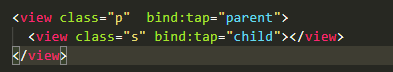

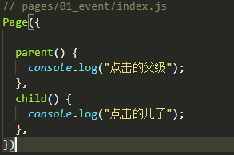

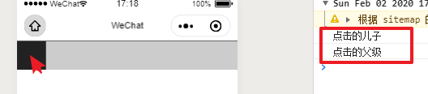

* **阻止冒泡语法：同时监听用户的触发行为，也阻止冒泡；**
  * 注册事件：不用bind   catch: 阻止掉了！
  * **catch:事件类型=“事件执行函数”**
  * catch事件类型=“事件执行函数”

```html
<view class="p"  catch:tap="parent">
  <view class="s" catch:tap="child"></view>
</view>
```


### 捕获(了解)

* 规则：
  * 事件**默认**是在冒泡阶段执行；
  * （可以通过代码设置 把事件在捕获阶段执行！）**不这样做！！！**因为如果把事件设置在捕获阶段执行，用户体验会极其的不好，（体验不好超过 事件在冒泡阶段执行）
* 比如：
  * 上下级父子嵌套了10000层
  * 给每层注册点击事件tap
  * 设置 事件在 捕获阶段执行；
  * 点击最孙子那层的组件，会发生什么事？？
  * 用户体验极其不好。（我的事件呢？点丢了？？？）
* 设置捕获阶段执行：

```html
<view class="p" capture-bind:tap="parent">
  <view class="s" capture-bind:tap="child"></view>
</view>
```

* 阻止捕获阶段的执行

```html
<view class="p" capture-catch::tap="parent">
  <view class="s" capture-catch::tap="child"></view>
</view>
```


### 互斥（了解）

* 基础语法：只要是mut-bind绑定事件，只会执行一个！

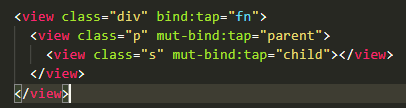

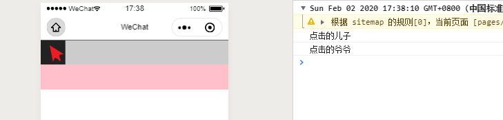


## 生命周期

* 生命：从生到死，都有**特定的时间节点做一些特定事件**：
  * 3岁：幼儿园
  * 7岁：小学
  * 18岁：考大学；
  * 22岁：大学毕业；
  * 22-25岁：立足；基本物质保证！
  * 25-28岁：结婚；
  * 28-30：生子；
  * 30-70 ：  过日子：（孩子长大）
  * 70-90：离世；

- **我们可以在特定的时间节点做相应的人生业务；**  比如：**页面显示后，请求数据；**

- 小程序中将生命周期分成两类，

  - 应用级别App
  - 页面级别Page。

- **生命周期：在JS这，特定时间或者特定请求或者节点**

  - **本质code：小程序内置的一些函数**
  - 函数：**需要执行，什么时候执行？到了特定的节点，监听小程序到了哪个节点，生命周期对应这个函数就会执行；**

- 为什么：

  - 我们写的每个页面都会在不同的初始化，出现，隐藏；这些特定的时间节点都可以使用生命周期函数进行监听；

  * **特别一些参数的使用**

### 生命周期-App

* 基础语法：app.js  小程序入口JS文件

```js
App({
  // 启动就执行；不容易关闭，微信有自己考虑，基于用户体验；
  onLaunch: function() {
    //wx.request();
  },

  // 前台运行时
  onShow: function() {
    console.log(2);
  },
  // 切后台运行时
  onHide: function() {
    console.log(3);
  },
    
  // -------------------------------------------了解
  // 小程序抛出错误时，捕获错误时
  onError: function() {
    console.log("error");
    // 给用户：弹窗提醒：我们小程序出错了~~~~~努力；
  },

  // 小程序启动时且同时，设置的页面找不到时；
  // 启动后，再次找不到其他页面，这个函数不会执行；
  onPageNotFound: function() {
    console.log("没有找到页面");
  }
})
```

* 点击 关闭按钮：**其实就是切后台，小程序并没有被关闭**
* 什么时候被关闭：
  - 关机
  - 内存不够用时，微信会自动选择关闭小程序；
  - 或者  **小程序切后台**  超过一定的时间；

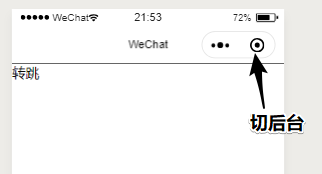


* 重点
  * onLaunch：在于有些逻辑不能写在onLaunch里面，因为只会在开启的时候才会执行一次！！
  * onShow
  * onHide


### 生命周期-Page

* 和整个项目一样，每个页面都有自己的生命周期；

* 基础语法

```js
Page({
  // 页面加载完时
  onLoad: function() {
    console.log("page-页面加载了");
  },
  // 页面显示时
  onShow: function() {
    console.log("page-页面显示");
  },
  // 页面隐藏时
  onHide: function() {
    console.log("page-页面被隐藏的时候");
  },
  // 页面渲染完成时
  onReady: function() {
    console.log("page-页面渲染完成时");
  },

})
```

* 重点

  * onLoad
  * onshow
  * onhide
  * 点击navigator
    * 从A页面转跳到B页面，当A页面只是隐藏；并没有被销毁;
    * **点击返回键，只是 执行 A页面的 onShow，可以理解为A页面只是被隐藏了，A页面不会加载和渲染（不会执行onLoad）；**
    * **在小程序内，只要A页面看不见了，就会触发onHide**


### 场景值

* 场景值：小程序处于什么样的场景，会有一个特定的值；
  * 比如打开小程序的方式：**扫码、转发、搜索**
  * 打开方式的不同：为什么要知道这个事，以后如何推广小程序更为合适；
    * 小程序：商城，产品；
    * 老板：花的推广的钱，哪个方式比较好；
  * 需要后台配合：把拿到值传给后台，后台进行统计，结果返回给我。展示出来；
* 语法：周期函数的事件对象

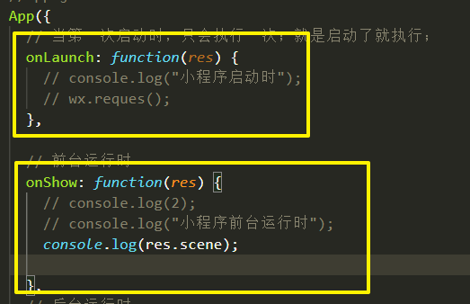

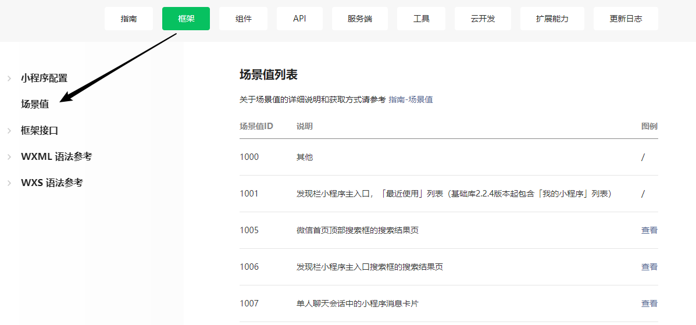

* **意义：比如需要统计小程序哪种方式打开的最多？集中更好的方式进行推广；**


### 地址参数

* 基础语法：

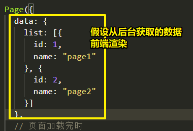

* 把拿到的数据的id放入每个地址上

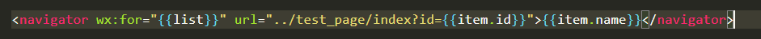

* 点击相应的页面：获取参入的参数

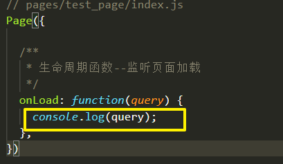

* 意义：可以往页面传入特定的参数，进行相应的数据请求；


## API

### 介绍

* 内置方法：API

* 应用程序接口：
  * 接口：
    * 给你机会，你可以拿到我身上（后台服务端）的数据，后台给你写接口（通过我的接口获取服务器数据）url地址
    * 或者使用我的（前端内置的DOM操作）某些功能：webAPI 
      * BOM:  window；
      * DOM:  document.getElementById()--->返回特定要的东西
  * 代码：
    * 后台：设计的接口 url地址 
    * **前端webAPI**：document.qs(); 
* 小程序：学习API就是方法；顶级对象 `wx`
  * `wx.requset()`
* 文档：https://developers.weixin.qq.com/miniprogram/dev/api/
* 为什么？原生给的一些效果不错；调用硬件！摄像头；

### wx.showLoading()

* 语法：加载框

```js
wx.showLoading({
  title: '加载中',
})

setTimeout(function () {
  wx.hideLoading()；
}, 2000)
```

### wx.showModal()

* 语法：显示一个弹出框，确定和取消

```js
wx.showModal({
  title: '提示',
  content: '这是一个模态弹窗',
  // 点击按钮的执行函数；
  success (res) {
    if (res.confirm) {
      console.log('用户点击确定')
    } else if (res.cancel) {
      console.log('用户点击取消')
    }
  }
});
```

### wx.showToast()

* 语法：点击组件，后简单的信息提示；

```js
wx.showToast({
    title: '成功',
    icon: 'success',
    duration: 2000
});
```


