# 00-复习

- 请求：wx顶级对象；wx. 调用  （BOM window）
  - 小程序：不支持ajax  XMLHttprequest
  - wx.request()；{url:"",data:{},method:"GET"...};
    - 回调函数：涉及到this指向；使用箭头函数；
  - 报错：说xxx请求的地址，不在request合法域名列表中；为了安全；
  - 阶段：
    - 开发：设置IDE，不检测合法的Https请求；
    - 线上：在管理后台界面 配置 **开发/ 开发设置 /服务器配置 / request合法域名**；
      - 域名地址（https协议、备案24小时）
      - 自己想搭建自己网站，有服务器；研究？GitHub
  - 核心：
    - 语法：记住，怎么查；
    - 阶段配置；


- 猫眼切换核心：
  - 步骤：几乎很少写注释；加需求，看原来写的代码；容易上手；
    - 1.如何给组件绑定 active 类名；`class={{key=="hot"?"active":""}}`
    - 2.点击组件：注册事件，事件执行函数；
      - 2.1 wxml组件上 设置自定义属性
      - 2.2 事件执行函数内部获取；
    - 3.拿到点击关键字设置初始化数据 key


- 事件执行：
  - 规则1：三个阶段：捕获、到达目标、冒泡；
  - 规则2：事件的执行默认是在冒泡阶段执行！
  - 现象：嵌套的组件，每个组件都注册了同样的事件；触发嵌套最深组件，冒泡阶段方向组件（如果它都注册一样事件类型）都会跟着触发这个事件；骨肉相连：打儿子，爸爸跟着疼；
  - 解决：阻止冒泡`catch:`


- 生命周期函数：
  - 核心：是函数，终究要执行？到了某个特定的点会执行；
  - app级别：app.js
    - onLaunch（不易关闭）、onShow、onHide（看不见）
  - page级别：pages/xx/index.js
    - onLoad（加载后执行）、onShow、onHide
    - onLoad：
      - A页面加载出来，会执行onLoad，onShow
      - 从A页面进入B页面；这个时候A页面(隐藏)会执行onHide
      - 从B页面点击 返回 回到A页面，这个时候A页面(显示)只会执行onShow 
  - 场景值：
    - 用处：小程序在不同的场景中有不同的值；
    - 场景：
      - 打开方式：搜索、扫码、转发；
      - 拿到场景值：统计哪种方式最多；
    - 语法：app.js 应用级别 onLaunch、onShow：e.scene
  - 页面地址参数：
    - 场景：商品列表中，点击每一个，进入详情页；
      - 页面：同一个页面
      - 不同？内容不同？进入的时候，传入不同信息；
    - 语法：
      - 传入参数：`url地址?id=446&info="xxxx"`
      - 获取index.js：onLoad：事件对象  `{id:446,info:"xxxxx"}`
- API：弹窗 
  - showLoading
  - showModal 确认取消
  - showToast 简单信息（添加成功）

* 复习工具：[http://plan.armincc.com](http://plan.armincc.com/)
  * 技术栈：vue2.0+express+mongoose
  * 日期：
    * 复习，今天看看，明天看看？后天？1周后看不看？
    * 自动复习计划：怎么排出来的？依据 遗忘曲线 科学规律；
    * 我怎么知道什么时候到日期？不能每天都看网站；不用关注日子，到了日子，后天会自动给邮箱发一份邮件：7:30  今天应该复习vue 第几轮；


# 01-小程序-wx.API

* 语法：

```js
// 微信在页面上面有个系统选项卡：
wx.showActionSheet({
    itemList: ['A', 'B', 'C'],
    success(res) {
        // 判断用户点击的是第几项？做业务~~~
        console.log(res.tapIndex);
    },
    fail(res) {
        console.log(res.errMsg)
    }
});


// 从本地相册选择图片或使用相机拍照；调用硬件；
wx.chooseImage({
 // 选择几张照片
  count: 1,
  // 所选的图片的尺寸：原图，压缩图
  sizeType: ['original', 'compressed'],
  // 来源：相册、相机
  sourceType: ['album', 'camera'],
  // 选择其中一项后的回调
  success (res) {
    // tempFilePath可以作为img标签的src属性显示图片
    const tempFilePaths = res.tempFilePaths;
  }
});


// 把文件上传到服务器：
wx.uploadFile({
    url: 'https://example.weixin.qq.com/upload', //仅为示例，非真实的接口地址
    filePath: "https://xx.com/asd/xxx.png",
    name: 'image_file',  // 默认后台接受的字段，要和后台问；
    success (res){
		// 请求成功的时候回调
    }
});
```


# 01-小程序-测颜值-01-布局

* 布局：推荐复习flex布局；
* 图片缩放模式：aspectFit：缩放模式，保持纵横比缩放图片，使图片的长边能完全显示出来。也就是说，可以完整地将图片显示出来。

```html
<image src="/imgs/1.jpg" class="img" mode="aspectFit"></image>
```


# 01-小程序-测颜值-02-交互

* 分析：
  * 1.注册点击事件
  * 2.点击之后：上传或者拍照；拿到图片地址，上传到AI测试接口，返回数据；渲染；

```js
uploadImg: function() {
    var that = this;
    // 1.选择图片
    wx.chooseImage({
      count: 1,
      sizeType: ['original', 'compressed'],
      sourceType: ['album', 'camera'],
      // 选择其中一项后的回调
      success(res) {
        // tempFilePath可以作为img标签的src属性显示图片
        // that.setData({
        //   src: res.tempFilePaths[0]
        // });


        // 2.上传图片
        wx.uploadFile({
          url: 'https://ai.qq.com/cgi-bin/appdemo_detectface?g_tk=5381',
          filePath: res.tempFilePaths[0],
          name: 'image_file', // 默认后台接受的字段
          success(back) {

            // 
            var info = JSON.parse(back.data);
            // console.log(info.data.face[0]);
            that.setData({
              face: info.data.face[0],
              src: res.tempFilePaths[0]
            });

          }
        });

      }
    });
  },
```

* 思考：回调套回调 黑洞；维护代码：很不方便；
* 引出：uniapp：支持promise async await;
* uploadFile合法域名怎么设置 
  * 线上配置：一个月只能改5次；
  * 开发阶段：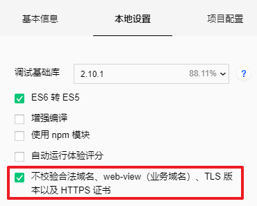


# 02-小程序-模块化-01-基本使用

* 为什么？**把公共方法（公司常用基础业务）写在一个JS文件内！**
* 注意: **有导出有导入；**
* 注意：公共文件放在哪里？没有特定的位置，某个文件夹下面放置就是公共文件就可以！

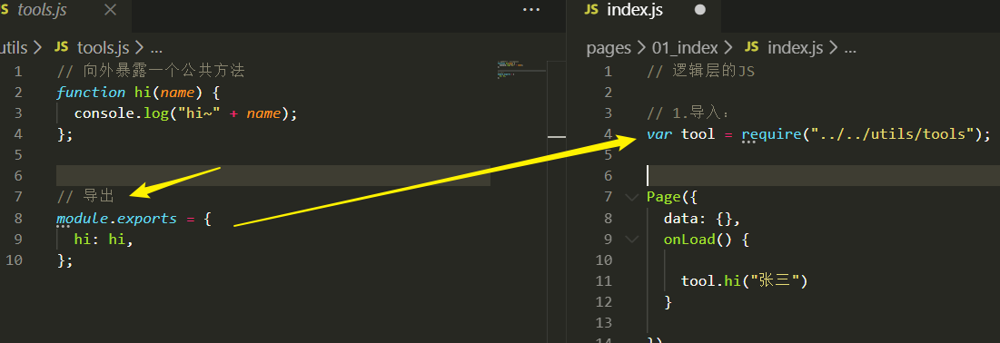


# 02-小程序-模块化-02-npm模块

* npm功能封装更为丰富！vant 移动端vue UI组件库  / 小程序版本！
* nodeJS：导出包  `module.exports`
* 小程序：不能直接在引用 npm 包
  * npm init -y
  * npm i mine -S
* **步骤1：IDE / 工具 / 构建npm**

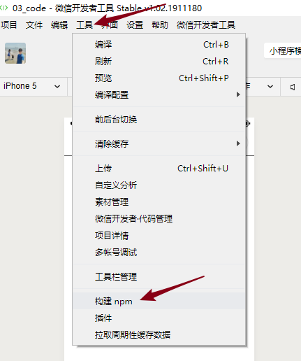

* **步骤2：详情 / 本地设置 / 使用npm包**

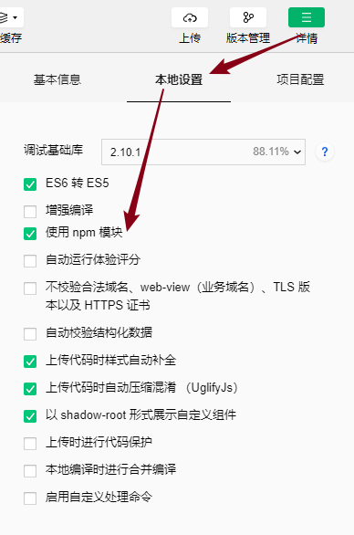

* 了解：小程序寻找包的规则：在JS页面中使用`require`
  - 优先：寻找`miniprogram_npm`下的包
  - 如果没有，则找当前路径下，有没有这个名字的JS文件
  - 如果没有，则页面报错找不到；


# 02-小程序-模块化-03-getApp()

* 意义：app.js 内部可以定义 **公共初始化数据和方法**；
* 设置和使用：推荐！方便！

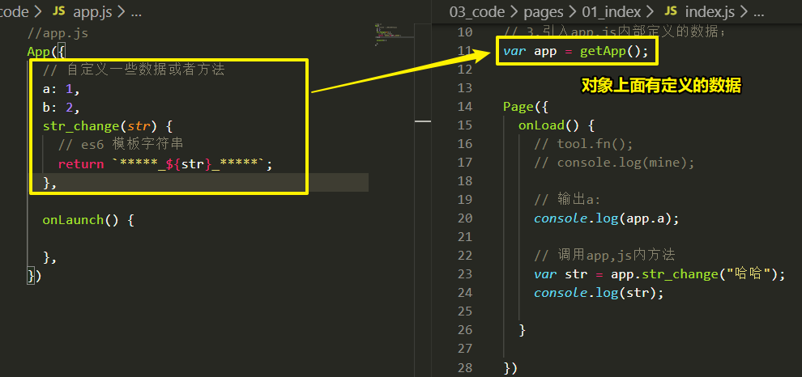


# 02-小程序-模块化-04-需求及问题

* 需求：往显示的文字两边 加翅膀  `***_ info _***`，不要改变原来的数据info；
  * 1.使用的app.js 定义公共方法；
  * 2.在页面的index.js中使用
  * 现象：引入在indexJS内部的方法不能直接在wxml里面使用函数和给函数传入参数；
  * 解决：但是原来页面的**数据其实已经变了；**
  * 目标：展示的时候两边有翅膀，不要改变我原来的数据；

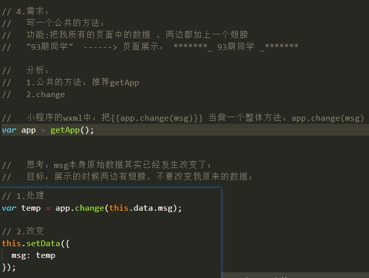


# 03-小程序-wxs-01-问题的原因-wxs基本使用

* 需求：渲染出特定格式的数据 ，但是不要改变源数据

* 原因：小程序底层设计，渲染层和JScore逻辑层是相互独立的；没有关系；（了解）
  
  * wxml 中 不能直接使用来自JS内部的方法，传入参数；
  * wxml 中可以使用 渲染层 wxs (wxml中特有 JS 文件)；
  
  
  
* 基本定义：
  * 1.在wxml中引入wxs标签（可以理解：相当于在微信特有html中的script标签）
  * 2.内部：module.exports 导出对象：写方法！
  * 3.导出：必须有个属性名 `module="obj"` 基本语法

```html
<wxs module="obj">
  module.exports = {
    change:function(str){
      return "***_"+str+"_***";
    }
  }
</wxs>
```

* 使用：obj,change是wxs的方法；

```htmnl
<view>{{obj.change(msg)}}</view>
```

* **意义：**
  
  * **改变数据的显示格式，不改变原数据！！！！**
  * 类比：vue filter过滤器；改变展示格式，不改变源数据；
  
* 场景：

  * 后台返回一堆数据：时间戳；150121121212
  * 让展示wxml 中，最好时间戳不要变；
  * wxs：过滤器方法：把时间戳传入，加工，返回；

  


# 03-小程序-wxs-02-公共wxs

* wxs：可以理解为和wxml配合的JS ；
* wxml wxss wxs 都属于渲染层；wxml 中就可以 一个家庭里面wxs 里 方法；
* 公共wxs使用：
  * 1.创建单独的wxs文件，后缀  .wxs
  * 2.通过 wxs 标签src 属性进行引入（以相对路径） ，module="导出对象的变量名  filter " 
  * 3.使用：`<view >{{filter.change(a)}}</view>`
* 好处：相对于就是页面的过滤器：不改变原页面的数据，可以进行简单的逻辑的格式的展示；

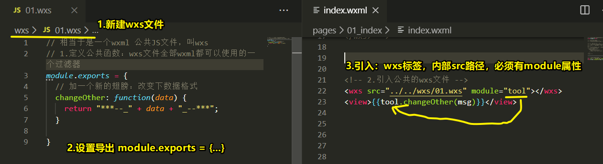


# 03-小程序-wxs-03-小总结

* **各项作用：**

  * 自己写公共JS文件：require导入；页面中JS文件中；一般写公共方法；只能用index.js内部使用；
  * npm：封装功能很**丰富**！require导入；页面中JS文件中；前端非常库；只能用在index,js内部使用；
  * getApp：意义和自己写的公共的JS文件很像；在index.js内部使用 app.js上面的方法；
  * wxs：filter 过滤器
  * 和wxml 一家子 成套 都属于 渲染层（和JS逻辑没有关系的）
    * 搭配的一个渲染层JS（不完全）文件；
    * 意义：**数据格式过滤和处理**  用在 index.wxml上面

* wxs语法：类似JS文件内语法：
  * 变量：不能使用 const 
  * 变量名：没有$
  * 其他的使用：**按照基础 （var ）的JS使用来就行**；尽量不要用es6 

* 工作上：关注公共JS模块多！；


# 04-小程序-组件-01-页面内组件

* 创建组件：IDE工具在目录下面 文件夹 / 新建component
  * js：初始化函数`Component`
  * JSON：属性名`*"component"*: true`

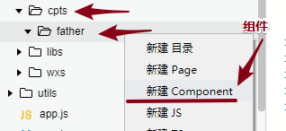

* 在页面中使用：
  * 1.在页面的JSON文件中注册；
  * 2.在页面的wxml中 使用：当做标签使用就可以了（单双标签都是可以的）

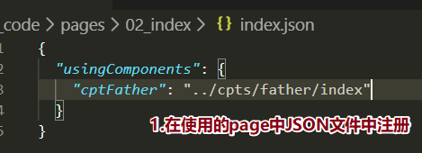

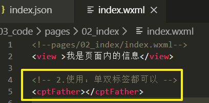


# 04-小程序-组件-02-父子组件

* 难点:

  * 创建两个组件 father son
  * 在页面中使用 father 组件 
  * father 组件 内 使用 son 组件

* 新建一个子组件
  * **1.创建出一个组件的文件夹；**
  * 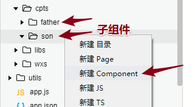
  * 2.在父组件中注册、使用；
  
    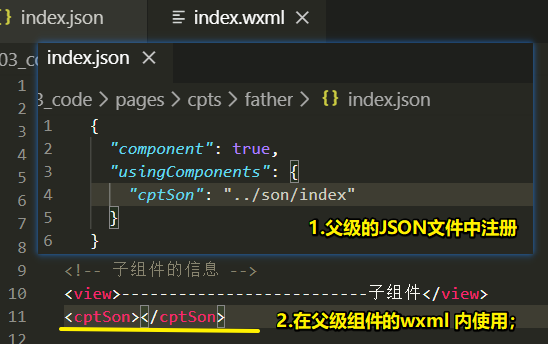


# 04-小程序-组件-03-通信-父给子

* 1.子组件内：定义属性（数据类型和默认值）

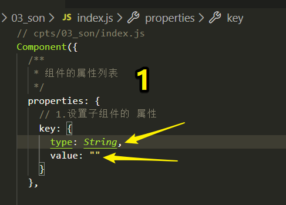

* 2.父组件 给 子组件传递数据：注意 {{}}两边是 “ ”

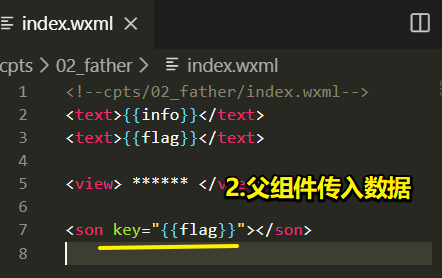

* 3.子组件：拿到从父组件来得数据，展示在子组件的wxml中

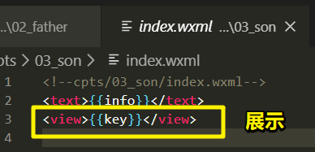


# 04-小程序-组件-04-通信-子给父

* 1.在子组件中：定义一个 **自定义事件名称**，及发送数据！

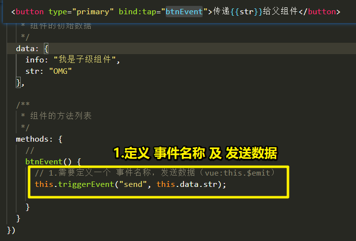

* 2.在父级组件中，使用：

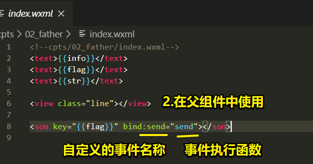

* 3.父级组件内，事件执行函数：展示，视图渲染；

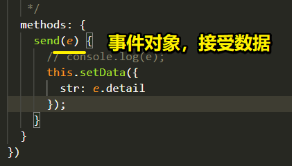


