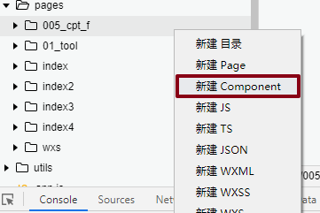
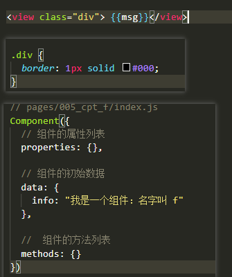

# 小程序 day_04

## wxAPI

### wx.showActionSheet()

- 语法：显示系统的菜单，菜单项可以进行设置

```js
wx.showActionSheet({
  itemList: ['A', 'B', 'C'],
  success (res) {
    console.log(res.tapIndex);
  },
  fail (res) {
    console.log(res.errMsg)
  }
});
```

### wx.chooseImage()

- 从本地相册选择图片或**使用相机拍照。**
  - 在电脑模拟的时候：本地相册
  - 使用手机：打开照相机；

```js
wx.chooseImage({
 // 选择几张照片
  count: 1,
  // 所选的图片的尺寸：原图，压缩图
  sizeType: ['original', 'compressed'],
  // 来源：相册、相机
  sourceType: ['album', 'camera'],
  // 选择其中一项后的回调
  success (res) {
    // 临时的文件地址
    const tempFilePaths = res.tempFilePaths;
  }
});
```

### wx.uploadFile()

- 将本地资源上传到服务器。

```js
wx.uploadFile({
    url: 'https://example.weixin.qq.com/upload', //仅为示例，非真实的接口地址
    filePath: "https://xx.com/asd/xxx.png",
    name: 'image_file',  // 默认后台接受的字段
    success (res){
		// 请求成功的时候回调
    }
});
```


### 案例：测颜值

#### 布局


- wxml：

```html
<view class="box">
  <!-- 预览区 -->
  <view class="img">
    <image mode="aspectFit" src="/imgs/1.jpg" />
  </view>
  <!-- 信息区 -->
  <view class="infos">
    <view class="item">性别:女</view>
    <view class="item">年龄:26</view>
    <view class="item">颜值:100</view>
  </view>


  <!-- 按钮 -->
  <view class="btn">
    <button type="primary">上传照片</button>
  </view>

</view>
```

- wxss：

  - box：采用定位，相对于找定位的父级，就是窗口，w/h：100% 整个窗口
  - 复习：flex布局的相关属性；
  - 图片展示：mode的选择

  

```css
.box {
  position: absolute;
  width: 100%;
  height: 100%;
  background-color: #ccc;
  display: flex;
  flex-direction: column;
}


/* 图片展示区 */

.box .img {
  height: 640rpx;
}

.box .img image {
  width: 100%;
  height: 100%;
}

.box .infos {
  flex: 1;
  display: flex;
  flex-direction: column;
  justify-content: center;
  font-size: 60rpx;
  font-weight: 800;
  text-align: center;
}


/* 按钮区 */
.box .btn {
  height: 100rpx;
}
```


#### 需求

- 1.点击上传照片。注册点击事件；
- 2.选择照片，显示图片;


- 3.返回数据，渲染到页面中；

  - https://ai.qq.com/

  - 测颜值 测试API地址：https://ai.qq.com/cgi-bin/appdemo_detectface?g_tk=5381（人家测试接口：用的时候不稳定）

    ```js
var data = {
        "face_id": "3506237411747215557",
        "x": 263,
        "y": 86,
        "width": 146,
        "height": 146,
        "gender": 99,
        "age": 57,
        "expression": 52,
        "beauty": 71,
        "glass": 1,
        "pitch": 6,
        "yaw": -6,
        "roll": 14,
    }
    ```
    
    


- 拿到数据后进行渲染：


- loading优化


## 模块化

* **公共方法 **：获取系统时间：
* **第三方npm包的使用：前端 lodash**
* 方法：公司公共的方法去使用，没有必要单独写在每一个页面中，需要写为公共模块；

### 基本使用

* **语法：小程序遵循的是类似 CommonJS 的规范。通过 module.exports 或 exports 对外暴露接口，通过 require 导入模块。**
* es6语法：也是可以用的；


* 用处：公用的方法的可以写在一个JS文件内，供每个页面使用。


### npm模块

* npm：前端包 有很多；
* node：地方，模块化，导出语法`语法：module.exports `
  * 在学习node npm :包的背后JS文件；JS导出：`module.exports `
  * 小程序能使用这些包？**能；**

* **为什么要使用这些npm包? 前端包JS文件功能封装的很丰富；人家已经写好需要功能，直接用人家就可以！**
  
* **小程序目前不支持直接引入 node_modules** , 开发者需要使用到 node_modules 时候使用小程序支持的 npm功能。

* 使用步骤：

  * `npm init -y`  ？node如果下载包；

  * `npm i mine -S`：**mine随便下载，体积小，有什么功能？具体下载什么包？**；

  * 3.1 点击 微信开发工具 / 工具 / 构建npm：根目录下面构建一个新的文件夹 

    

  * 3.2 详情  /  本地设置：使用npm模块

    

  * 测试：

    


* 小程序寻找包的规则：在JS页面中使用`require`
  * 优先：寻找`miniprogram_npm`下的包
  * 如果没有，则找当前路径下，有没有这个名字的JS文件
  * 如果没有，则页面报错找不到；


### getApp()

* 使用：在页面的index.js内部使用  getApp()
* 设置：get谁的信息？app.js内部设置的对象；

* 意义：可以在 app.js 内部  **定义全局公共的数据（属性和方法）**


* 在任何页面的JS中使用：


* 意义：共享数据和方法


### 需求

* 需求：去自己设置公共函数，**一个页面要显示在wxml视图层的数据**，两边加上 `***_ info _***`，而不改变源数据 `info`
* 分析：
  * 自己定义公共JS文件，在JS定义公共方法；
  * app.js 内写一个公共方法；(数据以一种特定的格式展示)
    * 1.不改变源数据 `info`
    * 2.经过公共方法加工后：视图层 `***_ info _***`


* 在页面的JS内引入使用：


* 页面没有显示：


* 目前解决：但是这样操作其实已经改变JS内置的data的数据了；


## wxs

* 理解
  * wxml --->html
  * wxss--->css
  * wxs--->js
  * 开头wx，意味他们三个是一整套！

### 不显示的原因(了解)

* 不显示：规定小程序视图wxml  `fn(str)` 尤其这个 fn方法 来自JS文件


* 原因：
  * **规定** 
  * 小程序底层被设计为 渲染层 和 逻辑层，且渲染层 和逻辑层是相互孤立的，没有关系；（了解）


### 基本使用

* 渲染层：有三个层成为一套：wxml wxss wxs；(可以理解为渲染层小程序独有的   html css js)


* **wxml 就可以使用 wxs的 （属性和方法）；**  
  * wxml 不能使用来自JS内部方法！
  * 事件绑定：bind:tap = "btn_tap(id)"
* 使用：
  * 1.使用wxs,要通过`wxs标签`在wxml引入；
  * 2.wxs标签支持模块化：使用`module.exports`
  * 3wxs标签 必须 有 `module` 属性（属性值就是该wxs标签内部作为模块导出的对象名，在wxml内使用）


### 公共wxs 过滤器

* 步骤：
  * 1.找个文件夹定义  wxs后缀  的文件；内部语法：类似JS语法；需要module.exports = {}
  * 2.在wxml页面中引入 wxs后缀  的文件（wxs 相当于wxml特有的JS文件，标签wxs ） ，使用 module属性


* 意义：
  * 1.解决模块化的需求
  * 2.可以在wxml标签内直接使用定义的方法，而且和JS的内置的逻辑没有任何关系，非常的方便！

* 语法使用：https://developers.weixin.qq.com/miniprogram/dev/reference/wxs/
  * 变量：不能使用 const 
  * 变量名：没有$
  * 其他的使用：按照基础的JS使用来就行；尽量不要用es6 

### 作用!!!

* 自己写的公共方法：自己的定义的JS文件或者在App.js内设置的数据，可以作为公共JS数据分享；
* npm模块：第三方模块包，已经写好得更为丰富的方法；
* wxs：**其实就是在负责渲染层（视图层）的数据展示处理，就是vue中的数据过滤；数据格式转化，wxs**


## 组件

* 为什么要学习：组件内置；view image 组件
  * 组件：复用、设置属性方法；
* 学习重点：
  * 如何创建组件
  * 组件之间通信！父子组件传递数据！

### 页面内组件

* 语法：创建组件
  * 1.新建一个文件夹  / 复用组件
  * 2.创建组件相关文件；



* 创建：内容填充起来



* 小程序自定义组件与`页面page`主要有两点不同：
  * 页面JS调用的函数不同；
  * JSON配置：标识自己为组件的属性 `component：true`

* 在页面中使用步骤：
  * 1.注册：在页面级别的 `index.json` 文件中注册
  * 2.使用：在wxml中使用；单标签双标签都可以


### 父子组件

* 定义父级组件：


* 定义子组件：


* 子组件在父组件内使用：


### 通信：父级-->子级

* 1.子级：设置属性，接受（从父组件过来的）数据，：


- 2.父级传递数据：传递给子级的定义属性上：


### 通信：子级-->父级

* 1.子组件 JS内部：**定义自定义事件名称：**  this.$emit("事件名称",发送的数据)


* 子组件wxml：在子组件内调用函数及触发：


* 父组件wxml：子组件绑定自定义事件及父级的回调函数：


* 父组件JS：f_send函数内部：


