#  00-回顾

* 测颜值案例：

  * 1.布局：昨天课堂练习布局简单；flex布局；
  * 2.选择照片（本地相册、相机）---->临时网络地址---->上传到AI地址返回 测出来数据；
    * 回调嵌套回调
    * this：用的this是不是你真实要找的this;如何解决？

* 【重点：模块化】：！！

  * 意义：公共（方法：函数）、方便；
  * 方式：
    * 1.自己定义公共模块 JS文件（公共数据：属性和方法）；支持module.exports   require
    * 2.npm包：（别人写的丰富的包）
      * 2.1 相关下载npm
      * 2.2 构建：工具 / 构建npm
      * 2.3 使用：配置
    * 3.getApp() 在需要的页面的JS内调用，调用的是app.js 初始化函数 定义 （公共数据：属性和方法）
  * **特点：模块化，在页面的JS文件中引入，只能在JS文件使用；**

* wxs：（工作使用反而没有那么多）

  * 需求：改变 wxml 显示数据格式，但是不要改变真实index.JS内的数据；
  * 了解：
    * 模块化JS文件，为什么只能在页面的JS文件中使用？
    * 小程序底层设计：渲染层  JS逻辑层  没有直接关系；
    * 渲染层：wxml wxss wxs (相当于wxapp 特有的 html css js)
    * wxs：里面就可以写方法；就可以直接使用在wxml中；
  * 意义：**过滤器**；数据特定格式通过过滤器展示；

* 【！！重点：组件】

  * 意义：复用；（自己的wxml wxss JS:接受属性，自己定义事件执行）
  * vue 阶段思考：
    * 封装组件  xxx.vue 文件（单文件组件  template style script）（.vue 最终会被webpack编译为 JS css 文件）
      * vue-cli：脚手架（配置好webpack）；不让用vue-cli；不让写 xxx.vue ；
      * 做vue项目；能不能做？能，怎么做？基础阶段vue怎么学的？vue.js引入；new Vue({})
      * webpack：只能用在vue这个地方；前端工程打包编译工具；webpack 好好研究；
    * 复用：飞秋传过来，在组件内，注册下，使用；

  * 组件：经典父子组件传递数据
    * 父--->子：
      * 1.子：定义属 性（一会用于接受 父 给它 传进入来的数据）
      * 2.父：wxml 使用 子组件 传入数据
      * 3.子：拿到数据，展示数据，在子的wxml中；
    * 子----->父：
      * 1.子：定义一个 自定义事件名称（触发子点击事件，为了触发自定义事件，能发送数据）
      * 2.父：wxml中 子组件 上 `bind：子自定义的事件名称 = 事件执行函数`
      * 3.父：事件执行函数，内部通过事件对象获取 传递过来的数据；展示；this.setData


# 01-小程序-Vant-Weapp

* vant小程序版本：https://youzan.github.io/vant-weapp/#/intro

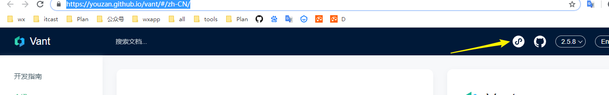

* 下载前要设置初始化  `npm init -y`    **package.json**
* 下载：

```
npm i vant-weapp -S --production
```

* 配置：


* 注册：app.json(全局）页面json（局部）

```json
  "usingComponents": {
    "van-button": "vant-weapp/button",
    "van-datetime-picker": "vant-weapp/datetime-picker"
  }
```

* **注意：官方的引入组件地址需要修改地址后才能使用：**如何配置：看`miniprogram_npm下文件地址`

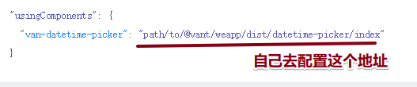


# 01-小程序-F2-图表

* 下载

```
npm i @antv/f2-canvas -S
```

* 构建npm :  

  * 每下载一个新的包，重新构建一次；
  * 构建完成的时候，信息提示（找不到入口，）看见构建完成就OK！

  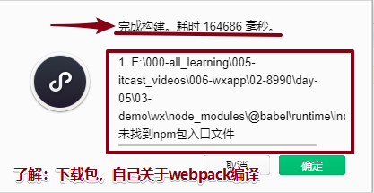

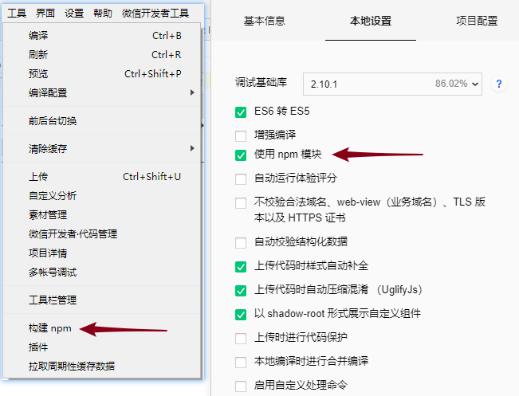

* 注册：全局或者局部 json文件;   本地的演示：app.json;

```json
{
  "usingComponents": {
    "ff-canvas": "@antv/f2-canvas"
  }
}
```

* wxml：要求
  - **必须有父级盒子：类名为container；**
  - **ff-canvas：必须必须设置宽高；在wxss里设置宽高**

```html
<!-- F2特点：1必须有个父级盒子 类名 container -->
<!-- F2特点：2ff-canvas 必须宽高 -->
<view class="container">
  <ff-canvas id="column-dom" canvas-id="column" opts="{{opts}}"></ff-canvas>
</view>
```

* 注意:大家要知道如何替换数据使用：https://f2.antv.vision/zh/examples/basic

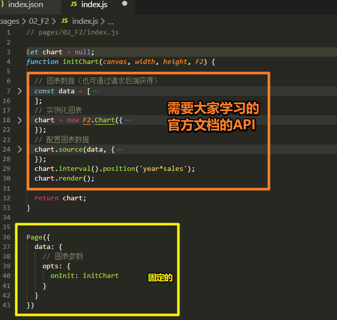


# 01-小程序-wx_calendar-日历

* 注意：**不是npm包，别人写的组件。下载后，放入我们自己组件文件夹cpts内**；

* 下载的是GitHub的地址：https://github.com/treadpit/wx_calendar
* 需要下面的文件夹：

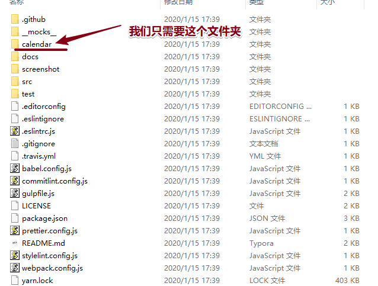

* 放在：**自己定义一个公共组件的文件夹；cpts**
* **注意：这个是我们自己导入的组件，不是npm安装的包；JSON文件内注册**

```json
  "usingComponents": {
    "calendar": "/cpts/calendar/index"
  }
```

* 使用：

```
<calendar />
```


# 02-小程序-表单-01-组件布局

* 和常规的页面标签不一样；
  * input 设置password属性 呈现密码状态
  * 单选：radio-group  下面是radio ；

```html
<form >

    <view class="item">
      <label>姓名</label>
      <input type="text" />
    </view>


    <view class="item">
      <label>密码</label>
      <input type="text" password />
    </view>


    <view class="item">
      <label>性别</label>
      <radio-group>
        <radio checked />男
        <radio />  女
      </radio-group>
    </view>


    <view class="item">
      <label>爱好</label>
      <checkbox-group>
        <checkbox checked /> 代码
        <checkbox checked /> 睡觉
      </checkbox-group>
    </view>
    
    <button type="primary">提交</button>

</form>
```


# 02-小程序-表单-02-数据-01-输入框

* 1.在wxml表单的  input  上面设置name属性。一会输入的数据会和name属性值绑定在一起；

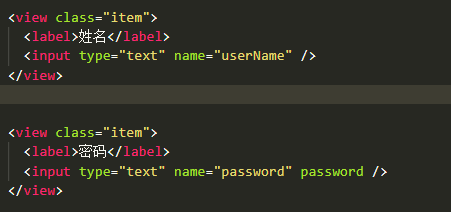

* 2.form表单和按钮设置：
  * form bind:submit
  * button  form-type="submit"

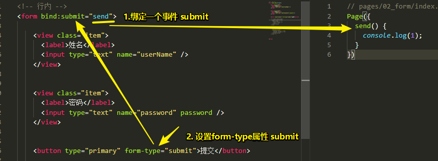

* 获取input 内数据如何获取呢？submit事件执行函数的事件对象

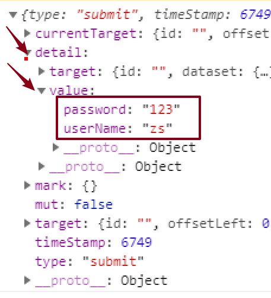


# 02-小程序-表单-02-数据-02-单多选框

* 发现单多选组 ：文档上面没有name属性

* 有bindchange 属性：绑定事件；

* 步骤：

  * 1.wxml  单多选group 组件上 注册 change事件；
  * 2.wxml  组下面：成员设置 value属性值；
  * 3.JS：注册 change事件需要执行函数；函数内部，可以（通过事件对象）获取到 组选择的数据。
  * 4.JS：思考：修改组的状态，目标是为了提交数据。需要把获取的组的数据  存在 初始化数据中；
    * **data 初始化数据值，必须要和wxml 视图上状态保持一致！**
  * 5.JS：点击按钮提交数据，
    * 包括 input数据
    * 单多选组的数据；this.data.cks  this.data.rd;

  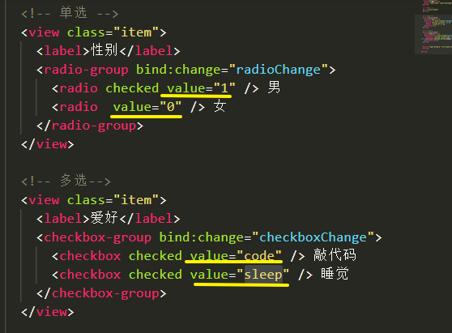

* （事件对象）
  * 场景值
  * 地址参数获取
  * 父子组件通信
  * 单多选数据


# 03-小程序-文档梳理

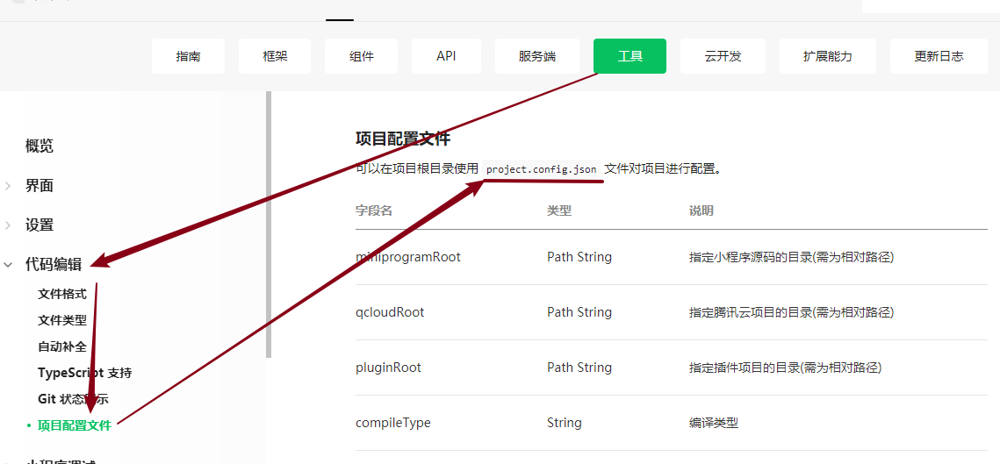

* 文档梳理

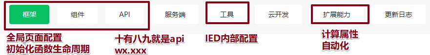


# 04-小程序-uni-app-01-介绍-了解

* **原生：**
  * **生态圈很多很大；**
  * 开会：问你什么时候能做完？**分析业务**
* `uni-app` 是一个使用 [Vue.js](https://vuejs.org/) 开发所有前端应用的框架，开发者编写一套代码，可发布到iOS、Android、H5、以及各种小程序（微信/支付宝/百度/头条/QQ/钉钉）等多个平台。
* https://uniapp.dcloud.io/


# 04-小程序-uni-app-02-创建项目

- **全局安装vue-cli：node在8.9版本以上；**回去看node  nvm 如何安装新的版本

```bash
npm install -g @vue/cli
```

- 如何看本版：`node -v`

* 创建：`my-project` 项目的文件夹的名字

```
vue create -p dcloudio/uni-preset-vue my-project
```

- 选择模板：**选择默认**

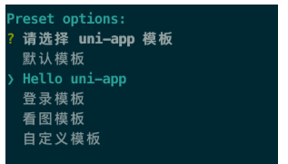

* 开启 dev模式：

```cmd
cd 项目文件夹名下

npm run dev:mp-weixin
```

* dev环境运行成功：

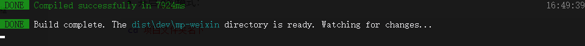


* **1.用IDE（微信小程序官方开发软件）  打开dev 编译后代码**

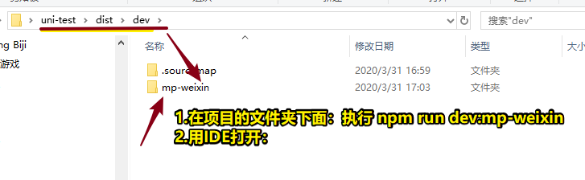


* **2.VSC打开的是什么？项目的src源码：vue组件；**

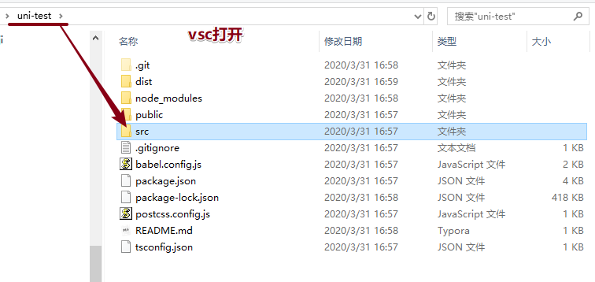

* 用vue组件开发 小程序；


# 04-小程序-uni-app-03-窗口配置

* 源码：src / pages.json :  局部配置和全局配置；
* uni-app框架：webpack 帮助我们打包编译为小程序要的这些文件：app.json  index.json

- 全局配置：


- 页面局部配置：且优先于全局配置


# 04-小程序-uni-app-04-基础语法

* 现在就用 vue 语法：写项目；
  * 组件还使用原生组件；
  * 语法完全时vue语法；

```html
<!-- 组件：小程序原生组件  语法：vue语法 -->
<view v-for="(item,index) in arr" :key="index" @click="ck(item)">
    {{item}}
</view>
```

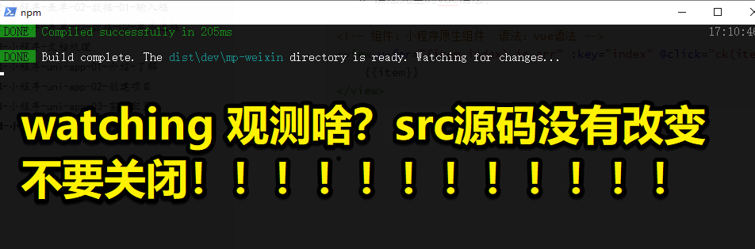


