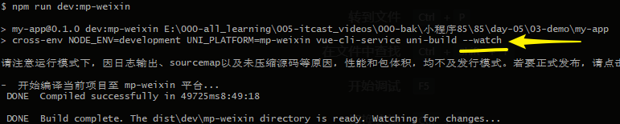

# 小程序 day_05


## Vant Weapp

- Vant Weapp 是移动端 Vue 组件库 [Vant](https://github.com/youzan/vant) 的小程序版本，两者基于相同的视觉规范，提供一致的 API 接口，助力开发者快速搭建小程序应用。 
- 安装：

```bash
# 通过 npm 安装
npm init -y
npm i vant-weapp -S --production
```

- 小程序IDE构建 和配置：


- UI组件库；
  - **组件：需要注册** 自己写的组件 在页面中进行注册；
  - 哪个地方注册？`在app.json`或者页面`index.json` 注册组件：
    - app.json：全局注册；所有的页面中都可以用；
    - index.json：本页面使用；

```json
"usingComponents": {
  "van-button": "vant-weapp/button"
}
```

- 按钮：

```
<van-button type="primary">按钮</van-button>
```

- 其他演示：


## F2

- F2 是一个专注于移动，开箱即用的可视化解决方案，完美支持 H5 环境同时兼容多种环境（Node, 小程序，Weex），完备的图形语法理论，满足你的各种可视化需求，专业的移动设计指引为你带来最佳的移动端**图表**体验。 
- https://f2.antv.vision/zh
- 安装

```bash
npm i @antv/f2-canvas -S
```

- 工具构建配置：有新下载的包，重新构建npm


- JSON注册：app.json 全局注册   || index.json 局部注册

```json
{
  "usingComponents": {
    "ff-canvas": "@antv/f2-canvas"
  }
}
```

- wxml:
  - **必须有父级盒子：类名为container；**
  - **ff-canvas：必须设置宽高；**

```html
<view class="container">
  <ff-canvas id="column-dom" canvas-id="column" opts="{{opts}}"></ff-canvas>
</view>
```

- JS初始化：

```js
// import F2 from '@antv/wx-f2'; 无需引入：

let chart = null;

// 需要用的时候，查官方文档；echarts
function initChart(canvas, width, height, F2) {
  // 图表数据（也可通过请求后端获得）
  const data = [
    { year: '1951 年', sales: 38 },
    { year: '1952 年', sales: 52 },
    { year: '1956 年', sales: 61 },
    { year: '1957 年', sales: 145 },
    { year: '1958 年', sales: 48 },
    { year: '1959 年', sales: 38 },
    { year: '1960 年', sales: 38 },
    { year: '1962 年', sales: 38 },
  ];
  
  // 实例化图表
  chart = new F2.Chart({
    el: canvas,
    width,
    height
  });
	
  // 配置图表数据
  chart.source(data, {
    sales: {
      tickCount: 5
    }
  });
  
  chart.interval().position('year*sales');
  chart.render();
  return chart;
}

Page({
  data: {
    // 图表参数
    opts: {
      onInit: initChart
    }
  }
});
```

- 参考学习地址：https://www.yuque.com/antv/blog/bg9sxf


## 日历

- 文档：https://github.com/treadpit/wx_calendar   不是npm包；不能通过npm安装；
- 下载 github 并解压缩，拷贝 calendar 文件到小程序项目下
  - 需要自己新建一个文件夹：
    - 第三方公共组件
    - 自己的组件；
- 注册组件：

```json
{
  "usingComponents": {
    "calendar": "/component/calendar/index"
  }
}
```

- wxml：

```html
<calendar />
```


## 表单

### 组件

* 密码：设置password属性；
* 单选多选都是专门的组件；

```html
<form >
    
    
  <view class="item">
    <label >name:</label>
    <input type="text" />
  </view>
  <view class="item">
    <label>密码:</label>
    <input type="text"  password/>
  </view>
    
    
    
  <!-- 单选 -->
  <view class="item">
    <label>性别:</label>
    <radio-group>
      <radio  checked /> 男
      <radio  /> 女
    </radio-group>
  </view>
    
    
    
  <!-- 多选 -->
  <view class="item">
    <label>爱好:</label>
    <checkbox-group>
      <checkbox  checked />代码
      <checkbox  checked />睡觉
    </checkbox-group>
  </view>
    

  <button type="primary">提交</button>

</form>
```


### 数据

#### 获取输入框数据

* html  form 输入框 name属性

* wxml表单属性设置：
  * 1.input 有`name`属性，用于提交；单选多选没有`name`属性
  * 2.form组件绑定 submit事件，同时 button按钮 设置`form-type="submit"`用于`submit`或者`reset`

```html
<!-- 监听表单提交 -->
<form bind:submit="send">
  <view class="item">
    <label for="">姓名: </label>
    <input type="text" name="username" />
  </view>
  <view class="item">
    <label for="">密码:</label>
    <input type="text" name="password" password />
  </view>
  <view class="item">
    <!-- 指定 form-type -->
    <button type="primary" form-type="submit">保存</button>
  </view>
    
    
   <!-- 单选 -->
  <view class="item">
    <label>性别:</label>
    <radio-group>
      <radio  checked /> 男
      <radio  /> 女
    </radio-group>
  </view>
  <!-- 多选 -->
  <view class="item">
    <label>爱好:</label>
    <checkbox-group>
      <checkbox  checked />代码
      <checkbox  checked />睡觉
    </checkbox-group>
  </view>
    

  <button type="primary" form-type="submit">提交</button>
</form>
```

* 获取数据：事件对象获取数据

```js
Page({
  data: {},
  send: function (ev) {
    // 通过 ev.detail 获取 input 组件中的数据
    console.log(ev.detail.value);
  }
})
```


#### 获取选择框数据 

* 单选多选获取数据：
  * 绑定change事件，**通过事件对象获取；**
  * 只要一改变，就可以获取数据：


* 点击提交按钮时：


## 文档梳理及小结

* 梳理


* 小结
  * tabBar:
    * 配置的tabBar 
    * 自己写选项卡:  猫眼电影；
    
  * wxml 数据渲染：
    * {{}}
    * wx:for
    * wx:if
    * hidden
    
  * 组件:
    
    * 文档：查文档
    * 适配：rpx；**UI必须给我750px设计稿；** 小程序规定屏幕宽度750rpx  
      * 750px(标注 316px):   wxss  : 316rpx;   1px = 1rpx;
      * 320px(标注是 18px):  wxss:???        ?     1rpx = 0.4545px;
    * 常用：
      * view
      * navigator url="../pages/center/index?id=123" ,可以带参数；
    * 生命周期：
      * 页面加载onLoad：获取传入的参数；res.query
    * 获取表单数据；练习；从头到尾自己能独立写出来；
    * 自定义：复用
      * 1.创建
      * 2.使用：注册。使用；
      * 3.传递值；
    
  * API：
    * wx.request()
    * wx.showLoading();
    * ...
    
  * 模块化：
    
    * 自己写JS文件:公共方法；
    * npm：
      * 构建、本地设置：可以使用npm包；
      * 注册：全局JSON或者页面JSON文件；
    * getApp()：公共数据和方法；
    
  * wxs：过滤器；
  
    


## 框架

### 介绍

* 用原生的小程序写的代码不够高效优雅：
  * 一个组件有多个文件：index.wxml .wxss js json   （ .vue单文件组件）
  * 获取数据 `this.data.xx `    vue：this.xxx
  * 设置数据 `this.setData({...})`   this.xxx = xxx;
  * 测颜值：API大部分为异步，回调黑洞；维护起来不方便；
  * wxss语法比较低效：不能用less预编译语法；
  * **不是没人用：原生开发很多市场；**
* 市场大框架：wepy、mpvue、taro(基于react)、**uni-app**

* `uni-app` 是一个使用 [Vue.js](https://vuejs.org/) 开发所有前端应用的框架，开发者编写一套代码，可发布到iOS、Android、H5、以及各种小程序（微信/支付宝/百度/头条/QQ/钉钉）等多个平台。

* vue：
  * 本身：用户界面的库，自己写组件，界面；以组件的形式存在；
  * vue框架：vue+axios+vueRouter+vuex；  
  * UI框架：Element、Vant；UI组件库；


### 创建项目

* **全局安装vue-cli：node在8.9版本以上；**应该都都满足 `node -v`

```bash
npm install -g @vue/cli
```

* 创建项目:  my-project项目文件夹的名称（可以修改的，不要中文）
  * 切换检查下载源；
  * 家里网的问题：切换手机热点，100M；
* 用window  PowerShell

```bash
vue create -p dcloudio/uni-preset-vue my-project
```

* 选择模板：**默认模板**


* 运行并发布uni-app（**一定是项目的文件夹下面**）

```bash
cd 文件夹名
npm run dev:mp-weixin
npm run build:%PLATFORM%
```

* `%PLATFORM%` 可取值如下：

  | 值            | 平台         |
  | ------------- | ------------ |
  | h5            | H5           |
  | mp-alipay     | 支付宝小程序 |
  | mp-baidu      | 百度小程序   |
  | **mp-weixin** | 微信小程序   |
  | mp-toutiao    | 头条小程序   |
  | mp-qq         | qq 小程序    |

* `npm run dev:mp-weixin`：生成dist目录下，dev文件夹，mp-weixin：监听模式：有文件变化，就把变化的文件实时编译到mp-weixin下；

  * 在VSC写一行代码，不要开启自动保存！Ctrl+s
  * IDE:自动把代码跟新，展示出来；




* 微信小程序开发工具打开编译后的目录：


* vue文件写代码，预览区实时更新：


### 窗口配置

* 全局配置：


* 页面局部配置：且优先于全局配置


### 基本语法

* vue基本语法；


