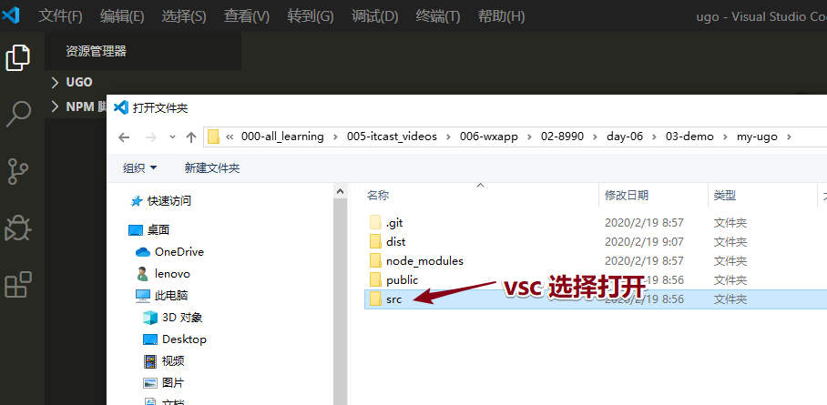

# 00-回顾

* 原生的时候：讲一点，练习一点；

* ugo：讲2小时，练习1小时；

* 项目的初始化：

  * @vue/cli  :  4.3.2

  ```cmd
  vue create -p dcloudio/uni-preset-vue my-project【注释：my-project起文件夹和项目的名字，不要中文】【注释：桌面创建了my-project文件夹】
  
  cd my-project
  
  npm run dev:mp-weixin 
  【注释：在my-project根目录下，有dist文件夹 / dev / mp-weixin文件夹】【mp-weixin文件夹：dev模式编译后的项目文件，可以被IDE识别 】
  【dev模式：桌面一直开启了cmd命令窗口，dev模式下千万不要关，服务，自动把写的源码的vue文件编译为小程序需要的文件】
  【dev模式的开启位置：cmd窗口、VSC命令窗口也可以】
  
  【注意：】
  1.dev模式不能关闭
  2.IDE打开：编译后文件夹（里面有wxml/wxss/json/js）,用于看效果；
  3.VSC打开：src源文件源码，用于编辑源码；（vue语法写逻辑，组件和API还是小程序的）；
  ```

  


# 01-ugo-首页-布局-01-初始化

* UI：要750px设计图；

* 初始化的一些问题：需要换手机热点 100M；家里网不行；


* 在**window powerShell**下：执行命令`vue create -p dcloudio/uni-preset-vue 项目文件夹的名称(自己起)`：**按键盘上下键，选择默认模板！**


* **先进入项目文件夹**：运行一个命令：`npm run dev:mp-weixin`   进行dev开发模式（了解 --watch：源码发生改变，改变部分自动编译到小程序的wxml wxss js JSON）(uniapp是个 非厉害的webpack，把vue可以编译为wxss等 )

* 界面打开：




* 注意：**UI 必须给我750px设计稿**
* less配置：
  * `npm i less less-loader -D`
    * **位置：在项目的文件夹 uni-test 下面npm安装，自动配置 ）**
    * **配置后：需要重新启动dev服务**
    * 说明：
      * -D : 开发依赖dev；
      * -S：--save 项目依赖 ；（未来，不需要less，打包编译后，没有less。都是css)
  * `vue单文件组件内 <style lang="less">`

* AppID更新失败：

  * 项目每次被重新编译：appID可能就会被编译没了；

  * 处理：找到appID，修改；或者不用管（不影响开发）


# 01-ugo-首页-布局-02-搜索区-轮播图-导航区

* 复习：
  * 二倍图：如何命名；
  * flex布局；

* 图片：从其他地方拿过来static文件夹，替换后，可能会有报错；


* UI要给咱们750设计稿，直接可以写标注的rpx；


# 01-ugo-首页-布局-03-楼层

* **浮动：清除浮动！！**
* 思路：
  * 1.写公共的样式；
  * 2.单独写第一个楼层的样式：注意CSS权重（less，注意less嵌套结构要一样）；
    * less：嵌套的结构；
    * 一定要保存：第一楼层的样式：权重和公共样式一样或者更高！less结构要一样：


* flex布局：移动布局的首选；
* 布局：
  * 移动端：首选是flex布局；
    * H5：适配（适配手机，比例等比变化，布局不会变），加rem单位替换；
    * 小程序：rpx；
  * **响应式：**（响应：不同的设备，布局就变了）
    * 响应三端：手机端、平板、PC端；
    * UI框架：**Bootstrap：搭建页面非常快；栅格系统 col-md-9**
  * PC端：
    * 不考虑兼容：flex布局；(快)
    * 传统布局：百分比、浮动、定位；基础班（马超）


* 练习：
  * 不会把整个项目都发给大家（100M），文件太多了，解压缩时间太长；
  * 文件：我把上课写的src 源码文件发给大家
  * 大家：
    * src有何用？看源码  VSC窗口
    * 不爱写样式，直接把src文件打开看下效果；怎么办？
      * 需要再次新建一个项目
      * 然后把项目初始里的src  替换为老师的src;
      * 开启dev模式，IDE去打开 dist/dev/mp-weixin 就可以看到效果；


* 用vue在vsc里源码：`<template lang="wxml">`识别到大家模板里面写wxml组件；


# 02-ugo-tabBar

* 注意：
  * pagePath路径，编译后的文件路径
  * 因为没有其他的文件路径，所有tabBar页面路径都写 pages/index/index（购物车和我的、后期要改）


* 文档配置位置：原生


* uni-app框架：pages.json 源码下的配置文件https://uniapp.dcloud.io/collocation/pages?id=tabbar


* **src下的源码的JSON配置文件里可以写注释，最终会被uni-app框架编译后清除注释；**

  


# 03-ugo-搜索组件-01-封装

* 为什么？组件复用，封装；

* 步骤：
  * 1.在src / 目录下新建  **components  文件夹**（或者cpts）  ，创建组件
  * 2.在使用的vue组件中，引入 import；
  * 3.注册  ；
  
  ```js
  export default {
    // 2.注册
    components:{
      search
    }
  }
  ```
  
  * 4.在vue template里使用组件；


# 03-ugo-搜索组件-02-在分类页中注册使用

* 创建分类页：

* 1.新建在src / pages/ category


* 2.进行手动配置：src / pages.json（为什么没有自动配置？自动配置 原生语法在IDE微信开发工具里面）
  * 1.先配置pages 
  * 2.再配置 tabBar


* 3.导入组件、注册、使用！


# 03-ugo-搜索组件-03-聚焦搜索框添加类名

* 步骤：

  - 1.初始化准备：类名 focus（背景灰色）、优化了wxml结构（增加了一些组件嵌套和取消盒子）【不难，小心】
    - 1.1 把样式一起重新梳理：**分为默认状态和聚焦状态；**
    - 1.2 默认状态 和  聚焦状态   less嵌套结构一致；

  

  

  - 2.给input注册focus事件；
  - 3.聚焦后：执行函数**给input最外面的父级** 添加一个设置好focus类名；(背景色、显示取消)


# 03-ugo-搜索组件-04-点击取消按钮失去类名

* 步骤：
  * 1.给取消按钮注册点击事件
  * 2.点击之后  `this.focus = false;`


# 03-ugo-搜索组件-05-取消按钮样式

* 步骤：
  * 0.看到UI设计稿，聚焦状态的时候分为上下两个部分
    * 上面：搜区区
    * 下面：历史区
    * 需要：重新规整下wxml结构和less结构样式（写布局的时候，自己写布局，全面）
  * 1.先设置 focus 初始化数据为true；（手动加类名，为了观测方便）
  * 2.flex布局：聚焦状态设置布局；
  * 3.写完样式，重置focus 初始化数据为false;


# 03-ugo-搜索组件-06-默认和聚焦状态的图标

* 步骤：
  
  - 1.准备两个组件；（经验：默认状态和聚焦状态下图标 两个图标）
  
  - 2.less 初始化：
  
    - 默认状态：图标1是显示的，图标2隐藏的；
    - 聚焦状态：图标1是隐藏的，图标2显示的；
  
    
  
  - 3.图标的样式：
  
    - **定位：绝对居中；**
    - wxss：使用背景图，使用相对路径报错（提醒大家使用使用网络图或者base64；）图标地址：http://static.botue.com/ugo/images/icon_search%402x.png
    - 大小 ：32rpx；


# 03-ugo-搜索组件-07-输入框的引导信息

- 需求：
- 默认状态：没有文字提示；
- 聚焦状态：有文字提示；
- 步骤：
  - 1.在JS  data准备文字属性：默认状态，没有文字提示；
  - 2.聚焦的时候：加引导性的文字；取消的时候，引导性的文字置空！
  - 3.聚焦的状态的时候：引导文字样式调整；设置input组件；


# 03-ugo-搜索组件-08-历史输入内容布局

* 步骤：
  - 1.默认状态：历史记录不显示；聚焦状态：显示；调整less样式；
  - 2.聚焦状态：设置历史记录的样式布局；（CSS布局基础知识）


# 03-ugo-搜索组件-09-首页中搜索组件与主页滚动条的问题

* 【！！！！：面试一定会问，开发小程序的时候遇见过什么问题？】

* 原因：
  * 1.搜索组件已经全部覆盖屏幕，
  * 2.主页盒子太多了，超出屏幕；搜索组件，覆盖不到所有的index主页；

* **搜索组件聚焦状态时候**步骤：传递高度值；
  - 1.点击子组件的搜索区，触发focus事件，执行函数内部 **获取窗口高度；**
  - 2.把获取 窗口高度 通过 **search子组件** 传递给 **index页面的父组件**;
  - 3.**父组件**拿到窗口高度，设置页面高度为窗口高度，且设置溢出隐藏；
* 点击取消按钮的时候：回到默认状态；
  * 需要子组件（搜索组件）给父组件index组件，传递auto ；回到auto高度；
* 1.子组件的设置：


* 父组件中设置：height默认值：auto；没有固定值；


* height初始化数据：默认状态，不需要设置高度；


* 拿到数据：在父组件上设置 style样式：


* 点击取消按钮执行步骤：
  * 1.子组件search 发送 数据给 父组件 index;
  * 2.发送 "auto";


