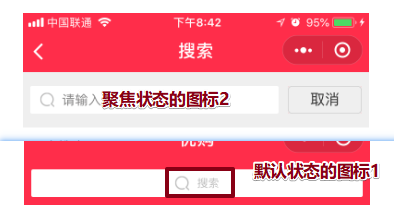

# 小程序 day_06


## 初始化


* ugo：
  * 项目课：6小时；讲4个小时；练习2个小时；
  * **课上：如何面对项目上知识点：整理步骤！发现自己的问题；**
  * 2小时：
    * 梳理下业务步骤；
    * 写注释；
    * 填入代码；查API；

* 注意：uni-app 原生  UI设计图：
  * 真实UI给我们应该是750px的PSD图或者sketch
  * 如果不是750px，打回重写做；
  * UI太慢了，出图375px；自己算！
  
* 配置less：**在开启dev服务之前**
  
  * 原生：wxss：按照我们传统的方式写样式；不能用less; this.data.xxx  this.setData();
  
  * 0.安装：**一定在项目的根目录；**
  
  * 1.安装：`npm i less less-loader -D`（在哪配置？npm安装，给项目安装。项目的文件夹的下面）【dev模式已经启动：重新安装dev模式需要的包，所以说，dev模式要重新启动一下；】
  
    【dev模式没有启动：安装完毕后，直接启动就可以】
  
  * 2.配置：`<style lang="less">`


## 首页-布局

* 标注图：
  * 公司：严格按照UI给的图写，也要按照UI的标注写；
  * 学习：布局不是咱们重点，核心在业务的JS；上面有丰富标注；为了大家方便，可以测量出写vue css 

* 搜索区及轮播图


* 导航区


* 公共楼层：
  * demo学习：为了方便，测量有误差；
  * 公司：严格的按照UI妹纸的标注!!!


* 第一楼层：单独对第一楼层的样式修改


## tabBar


* list：配置每项  2-5项
  - text：文字
  - iconPath：图标路径，相对路径（本地图片）默认
  - selectedIconPath: 当前选择项的图标路径，选择状态的图片
  - pagePath：选项卡点击后的页面地址
* 文字颜色：
  - color：选项卡字体颜色；大小和字号：固定设置；
  - selectedColor:被选择中的字体颜色

- 顶部线：
  - borderStyle：顶部线颜色，没有样式和宽度设置；只能为white或者black；

- 位置：
  - position：默认bottom；当设置top时，图标没有，只有下横线；

```json
  "tabBar": {
    "color": "#343434",
    "selectedColor": "#ea4451",
    "borderStyle": "white",
    "list": [{
        "text": "首页",
        "pagePath": "pages/index/index",
        "iconPath": "static/tabs/icon_home@3x.png",
        "selectedIconPath": "static/tabs/icon_home_active@3x.png"
      },
      {
        "text": "分类",
        "pagePath": "pages/category/index",
        "iconPath": "static/tabs/icon_category@3x.png",
        "selectedIconPath": "static/tabs/icon_category_active@3x.png"
      }, {
        "text": "购物车",
        "pagePath": "pages/index/index",
        "iconPath": "static/tabs/icon_cart@3x.png",
        "selectedIconPath": "static/tabs/icon_cart_active@3x.png"
      }, {
        "text": "我的",
        "pagePath": "pages/index/index",
        "iconPath": "static/tabs/icon_user@3x.png",
        "selectedIconPath": "static/tabs/icon_user_active@3x.png"
      }
    ]
  }
```


## 搜索-组件

### 需求：封装及使用

* 为什么要封装组件？

* 步骤：
  * 1.在src目录 / 下新建  **components  文件夹**（或者cpts）  ，创建组件
  * 2.在使用的vue组件中，引入；
  * 3.注册；
  * 4.在vue template里使用组件；


* 在页面中使用：1.导入；2.注册；3.使用；


### 需求：分类页中使用

* 1.新建 分类 category页：在src/pages下面


* 2.配置分类页：
  * 配置单独的页面配置项；
  * 配置tabBar的指向；


* 3.导入组件，注册。使用；


### 需求：聚焦搜索框，添加类名

* 步骤：
  * 1.初始化准备：类名focus（背景色灰色，取消按钮)
  * 2.给input注册focus事件，
  * 3.聚焦后：**给input的父级** 添加一个设置好focus类名；(背景色、显示取消)


* 聚焦后：添加类名


### 需求：点击取消，不添加类名

* 步骤：
  * 1.给 取消 注册点击事件
  * 2.点击后：给input的最外面父级 取消 设置好的灰色的类名；不添加准备好的类名


### 需求：取消按钮样式

* 需求：美化取消按钮，聚焦状态采用flex布局，初始化设置添加类名；
* 步骤：
  * 1.先设置 focus 初始化数据为 true；（手动加类名，为了修改样式的时候观测方便）
  * 2.flex布局：聚焦状态设置布局；
  * 3.写完样式，重置focus 初始化数据为false;（配合改回来）


### 需求：默认和聚焦状态的图标

* 需求：默认状态和聚焦状态均有自己显示图标：



* 经验：
  * 两个图标，两个盒子；
  * 分别在默认状态和聚焦状态控制其显示隐藏；


* 步骤：
  * 1.准备两个组件；（默认状态和聚焦状态）
  * 2.less 初始化：
    * 默认状态：图标1是显示的，图标2隐藏的；
    * 聚焦状态：图标1是隐藏的，图标2显示的；
  * 3.图标的样式：
    * 绝对居中；
    * wxss：使用背景图，使用本地相对路径（报错，提醒大家使用使用网络图或者base64；）
    * 图标地址：http://static.botue.com/ugo/images/icon_search%402x.png  


### 需求：输入框的引导信息

* 需求：默认状态：没有文字提示；聚焦状态：有文字提示；
* 步骤：
  * 1.准备文字：data里面初始化数据；
  * 2.聚焦的时候：加引导性的文字；取消的时候，引导性的文字置空！
  * 3.聚效状态的时候：引导文字样式调整 input；


### 需求：历史搜索内容

* 步骤：
  * 1.默认状态：历史记录不显示；聚焦状态：显示；调整less样式；
  * 2.聚焦状态：设置历史区域样式布局；


### 需求：聚焦状态下历史搜索的问题

* 问题：首页会出现滚动条；

* 原因：因为聚焦状态搜索组件覆盖在首页的上面，但是首页的盒子太多，首页高度太高了，超出屏幕；

* 步骤：

  * 搜索组件聚焦状态时候：
    * 1.点击子组件的搜索区，触发focus事件，执行函数内部 **获取窗口高度；**
    * 2.把获取窗口高度通过 **子组件**传递给 index页面的**父组件**;
    * 3.**父组件**拿到窗口高度，设置页面高度为窗口高度，且设置溢出隐藏；

  

  * 取消
    * 1.点击子组件的取消，触发点击事件；
    * 2.把`auto值`通过 **子组件**传递给 index页面的**父组件**;
    * 3.**父组件**拿到数据，设置跟标签高度为窗口高度，设置溢出隐藏；


* 目前：到此为止，我们封装搜索组件；接下来：不去一一的去实现布局；意义就是为了让大家体验下uni-app方式开发vue方式及css布局；
* 核心：接下来我们要使用已经写好布局的组件，核心只是去实现所有的业务JS；


