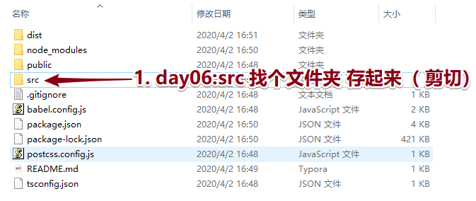
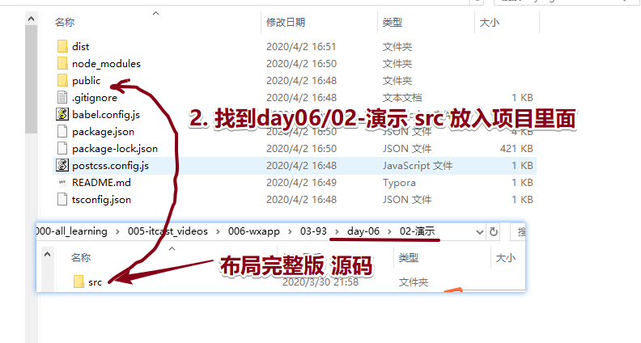
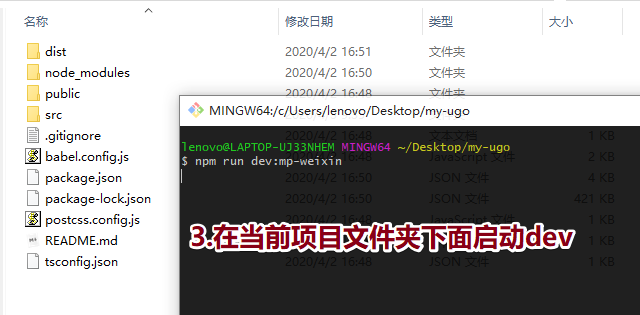
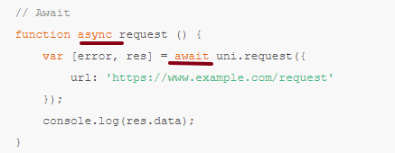
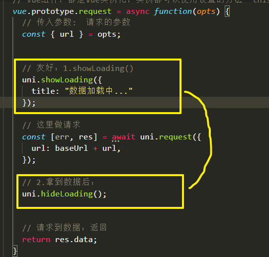
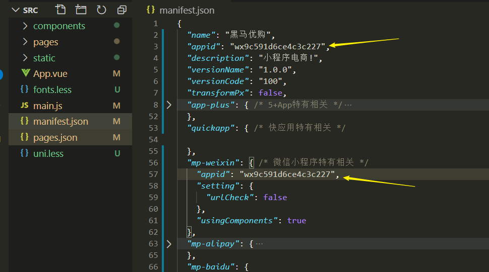
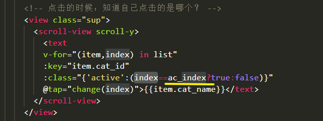
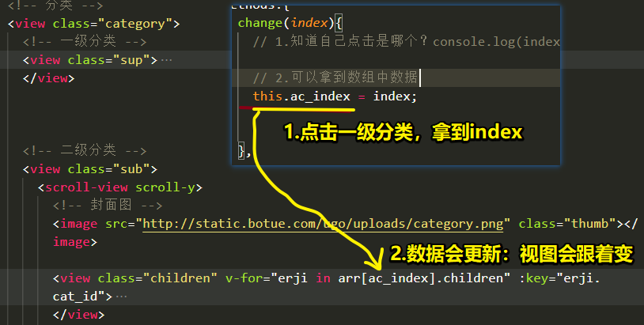

# 00-反馈及回顾

* 建议1 ：老师做事谨慎,基本没什么问题,看样子也是严苛要求自己今日事今日毕,这一点还是比较放心的,不过最好下次授课别的班级的时候可以前边紧张一些,感觉前几天比较清闲；
  * 节奏：wxapp慢慢，不一定uniapp，原生语法；
  * 清闲：把前面课程学习好多业务，用原生敲下，webAPI微博发布（新增、删除、排序、数据本地化）；可以预习；http://www.todolist.cn/
* 还有一点,老师最好在授课的时候多看看公屏,多提问一些(不是提问我),不然会有一种感觉,我们毕业了,随便讲讲就可以了；
  * 问题：大家，如果没有有时候我没有看见。及时联系我；
  * 课堂提问：随机点；
  * 作业：随机点昨天搜索栏（封装）发给我；合理的理由！
* 建议2 ：觉得老师上午没必要留一个小时的时间练习  因为一共就三个小时 第一节课复习前一天的内容就占了一大半 今天上午的讲课时间就一个小时多一点 如果要留时间练习 半个小时足矣
  * 灵活安排：复习；
  * 练习时间：灵活，复习知识点多，讲课少，上午练习控制；


* 有几个地方不太了解（Vue阶段的问题）： 
  * 1、渐进式框架是啥意思，体现在什么地方？vuex数据中心（目的：为了共享数据）；还能怎么实现！
  * 2、他跟pwa有什么关系么？ 
  * 3、Vue预渲染是啥？ 
    *  为了SEO优化；爬虫，搜索引擎；
    * SSR：服务端渲染，路径下服务器请求，读取模板HTML文件，把后台数据注入进去；返回--->前端；
    * Vue预渲染：对特定路由生成静态HTML文件，前端作为一个完全静态的站点；
      * 前端webpack插件：会给自动webpack生成静态文件；服务器；nginx;
      * https://www.cnblogs.com/xxm980617/p/10746037.html.
      * 特定的路径，不再动态生成html文件，访问特定已经生成好的HTML；
  * 4、vue路由history模式在实际开发时需求大不大？
    * 什么是路由history模式？/没有#   直接看到就是 /xx/xx/xx  上线
    * 路由模式：有几种？包括什么？hash   history
    * hash模式：#/asdsa/asdas/  开发阶段
    * 那语法怎么转换，需要配置一下么？vue-router配置：app.js入口JS文件；
* 表单组件里的label,用来改进表单组件的可用性 是什么意思呢
  * html见过：label  for属性：指定ID；checkbox
  * 点击label ，checkbox跟着联动；


* 回顾：
  * 1布局：flex布局；
  * 2.组件进行封装：
    * 如何封装组件
    * 如何使用
    * 组件内部：业务步骤要屡清楚；02-笔记 视频下面有步骤：
    * 【！！搜索组件与主页滚动的问题 】
      * 问题的出现：**要搜索的时候，覆盖了全部页面**，父亲盒子太多，页面高度太高 
      * 如何解决：首页的高度和屏幕一样高，超出部分隐藏 
        * 子传父：为什么要子传父？父亲自己不能获取屏幕高度数据？
          * 搜索的时候：传递屏幕高度
          * 取消的时候：传递auto(初始化值)
        * 语法：this.$emit？语法，死记住；
        * 父亲：拿到数据，设置在视图上；初始化数据：auto；
* 作业：
  * 跟着敲下来，代码发给我src：写适当注释；
  * 敲下来：src写注释，写的详细；理解和问题、写在里；


# 01-ugo-请求-00-布局完整版源码操作

* 主页布局，封装组件；
* 核心：业务分析；JS；






* dev模式：根目录下面；



- 开发：
  - **VSC：src 源码**（自上节课写的业务，都在里面）
  - **IDE：dist/dev/mp-weixin**


# 01-ugo-请求-01-介绍及轮播图接口

* 介绍：
  * uni-app 对部分 wx.API 进行了 Promise 封装；
  * **支持 async await 语法！！**




* 轮播图：

```js
// 获取轮播数据接口
async getSwiperList () {
    // 请求后端接口
    const [err,res] = await uni.request({
        url:"https://api-ugo-web.itheima.net/api/public/v1/home/swiperdata"
    });

    // 更新初始数据
    this.bannerList = res.data.message;
}, 
onLoad () {
    // 发请求，获取数据
    this.getSwiperList();
    
},
```

* 开发可能出现：接口地址没有配置在reques合法域名
  * 上线：需配置；
  * 开发：不校验；


# 01-ugo-请求-02-配置request插件

* 问题：不会一下就出现；
  * 前期开发：基础路径+请求路径；
  * 后面：项目大，维护；基础路径（换域名了），情况出现？你得把页面中所有用到这基础路径修改；容易出错；
  * 代码优化：代码格式太复杂；其他地方有不好修改的地方；前端就需要优化；
* 配置插件目标：
  * 配置项：专门用于配置baseURL地方；
  * 代码优化：前端给处理返回数据格式，调用自己写请求插件的话拿到数据就是格式简单；

* vue 框架：
  * 插件如何写？代码。
  * 先以大家比较容易接受的方式；Vue.use();

* **基础知识：**

```js
// Vue方法：use基本语法：和以前学习的知识不冲突；

// 1.Vue.use传入参数；可以传入一个函数；
// 2.函数内部可以得到参数，参数是啥？Vue
```

* 思考：

```
//    Vue本质是啥？构造函数
//    构造函数？在哪学习相关的知识？JS高级 原型对象、构造函数
//    原型对象？构造函数是不是会有一个原型对象？1
//    Vue也有原型对象？前面的学习，有没有用Vue原型对象知识点？
//    用作干啥了？拓展功能， Vue.prototype.$http=axios
//    为什么要这样用？全局vue实例都可以使用!!! 
```

* 解决问题：use参数函数内部拿到Vue。上面挂着一个方法

```js
  // ********************************************************************
  // 解决问题？1形成一个配置项；基础路径

  var baseUrl = "https://api-ugo-web.itheima.net";

  // 小细节问题：
  // 1 起自己定义方法名 requset行不行？实例中调用 this.request("实参接口路径")和 uni.request 单词有没有关系？没有关系
  // 2 基础路径写好了，接口路径在哪？在我们调用那个地方！
  // 3.如何在调用那个地方接口路径 拼在 函数内部？封装的时候形参，调用的时候传递的就是实参
  Vue.prototype.$request_95 = function(url){}  里面进行拼接
  
  
   // ********************************************************************
  // 解决问题？2 简单化处理返回的数据

  // 小细节问题：
  // 1.uni-app框架异步函数，都是支持 async await语法：能不能在这用下？可以
  // 2.怎么用？写？函数前 ：async   Vue.prototype.$request_95 = async function
  // 3.res 拿到返回的数据，做什么处理呢？res下面数据格式复杂；需要某个地方数据
  // 4.函数内部 return； 也是async await 函数里面可以使用;如何调用这个？ await this.requset_95()
  // 我们接下来：去index页面测试写函数；
  
  // 5.未来会传入 接口路径，POST、data、修改形参为？对象；内部需要调用对象下属性；

  Vue.prototype.$request_95 = async function(opt) {

    // 请求的封装
    // url:组成：基础路径+接口路径
    const [err, res] = await uni.request({
      url: baseUrl + opt.url
    });
    return res.data;

  }
```


# 01-ugo-请求-03-加载效果优化

* 美化：
  * 每次发出请求前：uni.showLoading()
  * 请求到数据后：uni.hideLoading();
* 思考：
  * 其实我们现在在做代码就是相当于我们以前大家学习axios 请求前，响应拦截器的配置；
  * 小程序不支持axios；




# 01-ugo-请求-04-导航及楼层接口

* 准备好接口
* 用自己的封装 $request_95 函数 进行调用接口
* 难点：循环遍历，注意；
* 楼层数据：楼层不是分公共的楼层和非公共的吗？获取的数据可以直接遍历渲染？
  * 区别：哪个地方，样式那个地方区别；
  * CSS和JS：有没有太大关系；HTml页面，有3按钮（初始化），很丑，3个能不能注册点击事件

* **uniapp：循环的时候，:key不能用原生*this**


# 02-ugo-下拉刷新

* 1.页面配置JSON：**enablePullDownRefresh：true**        **开启下拉效果；**
* 2.页面函数：响应下拉这个行为，需要函数执行！   **文档 / 框架/page  **

```js
    // 响应用户下拉的时候
    async onPullDownRefresh(){
      // 用户下拉的时候执行，里面写什么？
      // 需求： 1.更新数据？做请求？onLoad 函数再次调用；
      //       2.请求完毕的时候，关闭下拉刷新效果；API；函数在uni-app支持 async await 语法糖
        
      await this.get_banner();
        
      await this.get_nav();

      await this.get_floors();

      // 关闭效果：应该什么时候才去执行这个方法？上面这些方法异步的；
      // 异步执行：异步代码写在前面，也是在执行机制：同步后面会执行异步；
      uni.stopPullDownRefresh();
    }
```

* async await 语法糖？形式上 同步的方式；背后还是异步执行过程；
* 为什么发明语法糖？为了大家开发方便！！！


# 03-ugo-返回顶部

* 回到顶部：API：`uni.pageScrollTo({scrollTop:0});`

* 按钮：显示与隐藏：
  * **1.页面滚动的时候，监听行为，生命周期函数onPageScroll**
  * 2.onPageScroll 事件对象可以获取 垂直方向的卷入高度值；（和自己定的值进行比较判断）
* 补充：**uni-app：v-show后面就是简单判断（比较表达式、三元表达式），有问题！！！使用v-if；**uni-app：webpack有点问题；

  


# 04-ugo-分类页-01-数据渲染

* ID



* 后台数据设计：
  * 点击一级导航ID，传入后台，请求二级三级数据渲染；
  * **所有的分类数据全部返回：用户体验会好**   后台

* 难点：**数组套数组；遍历的时候要  注意细节；**

* 一级标题：注意类名的添加 active **默认先给它添加到第一项；**

```html
<text 
      v-for="(item,index) in arr" 
      :key="item.cat_id"
      :class="{'active':index==0}">{{item.cat_name}}</text>
```

* 二级数据：**注意默认是第一个一级数据下的children**

```html
<view class="children" v-for="erji in arr[0].children" :key="erji.cat_id">
```

* 三级数据：在二级数据下面；

```html
<navigator url="/pages/list/index" v-for="sanji in erji.children" :key="sanji.cat_id">
```


# 04-ugo-分类页-02-点击切换

* 步骤：
  * 一级导航点击事件：传入下标；
  * 点击之后：下标  知道自己点的是哪个！
  
* 实现：

  * 获取下标？有什么用？为了修改默认写的0 
  * 初始化data：ac_index:0
  * this.ac_index = 获取下标;

* 页面：修改

  




# 04-ugo-分类页-03-滚动介绍

* 组件：`<scroll-view scroll-y>`  区域滚动，盒子自己出现滚动条；scroll-x

* 场景：
  * **多导航项！！！**
  * **固定定位加输入框会有问题；输入框会被顶飞；**
    - 解决：
      - 输入框：绝对定位，定位在下方；
      - 上方盒子：scroll-view设置为区域滚动；


# 昨日作业：

- 搜索组件：单独封装；
- 想法：点击后，专门转跳路径：专门搜索页面？这样做行不行？前面就这样做；
- 分析：
  - 专门转跳：避免滚动问题；转跳的时候，过渡转跳页面过程；
  - 封装组件：避免专门转跳过程；展示组件，会出现滚动条【问题】；


# 作业：

* 请求插件配置：代码没有多少行；
* JS文件：怎么一步一步把插件封装出来。需要大家的理解；标识1 2 3

* 抽取5个同学作业：我建议大家，如果你觉得写的挺好，发给我！QQ给我！


