# 小程序 day_07


## 请求接口

* wx.requst()

* uni框架：统一为uni；

### Promise封装

- uni-app 对部分 `wx.API` 进行了 Promise 封装，返回数据：
  - 第一个参数：错误对象；
  - 第二个参数：获取的数据；
- 基本策略：
  - 异步的方法，如果不传入 success、fail、complete 等 callback 参数，**将以 Promise 返回数据。**
  - 异步的方法且有返回对象，如果希望获取返回对象，必须至少传入一项 success、fail、complete 等 callback 参数。

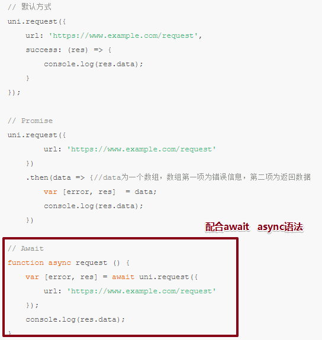


### 首页/轮播图 接口

- baseUrl:`https://api-ugo-web.itheima.net`
- api：`/api/public/v1/home/swiperdata`
- mothod:"Get"

```js
// 获取轮播数据接口
async getBannerList () {
    // 请求后端接口
    const res = await uni.request({
        url: 'https://www.uinav.com/api/public/v1/home/swiperdata'
    });

    // 更新初始数据
    this.bannerList = res1[1].data.message;
},    
onLoad () {
    // 发请求，获取数据
    this.getBannerList();
    
},
```

- 渲染数据：**banner.navigator_url数据  手动配置**

```html
<swiper-item :key="banner.goods_id" v-for="banner in bannerList">
    <navigator :url="'/pages/goods/index?id=' + banner.goods_id">
        <image :src="banner.image_src"></image>
    </navigator>
</swiper-item>
```


### 配置request插件

- 问题：不会一下就出现；
  - 前期开发：基础路径+请求路径；
  - 后面：项目大，维护；基础路径（换域名了），情况出现？你得把页面中所有用到这基础路径修改；容易出错；
  - 代码优化：代码格式太复杂；其他地方有不好修改的地方；前端就需要优化；
- 配置插件目标：
  - 配置项：专门用于配置baseURL地方；
  - 代码优化：前端给处理返回数据格式，调用自己写请求插件的话拿到数据就是格式简单；

- vue 框架：
  - 插件如何写？代码。
  - 先以大家比较容易接受的方式；Vue.use();

- **基础知识：**

```js
// Vue方法：use基本语法：和以前学习的知识不冲突；

// 1.Vue.use传入参数；可以传入一个函数；
// 2.函数内部可以得到参数，参数是啥？Vue

// Vue.use(function(e) {
//   console.log(e);//e==Vue
// });
```

- 思考：

```
//    Vue本质是啥？构造函数
//    构造函数？在哪学习相关的知识？JS高级 原型对象、构造函数
//    原型对象？构造函数是不是会有一个原型对象？1
//    Vue也有原型对象？前面的学习，有没有用Vue原型对象知识点？
//    用作干啥了？拓展功能， Vue.prototype.$http=axios
//    为什么要这样用？全局vue实例都可以使用!!! 
```

- 解决问题：use参数函数内部拿到Vue，上面可以设置方法；

```js
  // ********************************************************************
  // 解决问题？1形成一个配置项；基础路径

  var baseUrl = "https://api-ugo-web.itheima.net";

  // 小细节问题：
  // 1 起自己定义方法名 requset行不行？实例中调用 this.request("实参接口路径")和 uni.request 单词有没有关系？没有关系
  // 2 基础路径写好了，接口路径在哪？在我们调用那个地方！
  // 3.如何在调用那个地方接口路径 拼在 函数内部？封装的时候形参，调用的时候传递的就是实参
  Vue.prototype.$request_95 = function(url){}  里面进行拼接
  
  
   // ********************************************************************
  // 解决问题？2 简单化处理返回的数据

  // 小细节问题：
  // 1.uni-app框架异步函数，都是支持 async await语法：能不能在这用下？可以
  // 2.怎么用？写？函数前 ：async   Vue.prototype.$request_95 = async function
  // 3.res 拿到返回的数据，做什么处理呢？res下面数据格式复杂；需要某个地方数据
  // 4.函数内部 return； 也是async await 函数里面可以使用;如何调用这个？ await this.requset_95()
  // 我们接下来：去index页面测试写函数；
  
  // 5.未来会传入 接口路径，POST、data、修改形参为？对象；内部需要调用对象下属性；

  Vue.prototype.$request_95 = async function(opt) {

    // 请求的封装
    // url:组成：基础路径+接口路径
    const [err, res] = await uni.request({
      url: baseUrl + opt.url
    });
    return res.data;

  }
```


### 加载效果优化

- 美化：
  - 发出请求前设置加载动画效果；
  - 请求完成时关闭加载效果；

* 步骤：
  * 1.知识点：API（都是小程序的api，不能用顶级对象wx 用uni，会经过webpack编辑编译为小程序需要的wx）uni.showLoading();   uni.hideLoading();
  * **2.知识点：这个API要加在哪？插件封装函数里面；请求；**

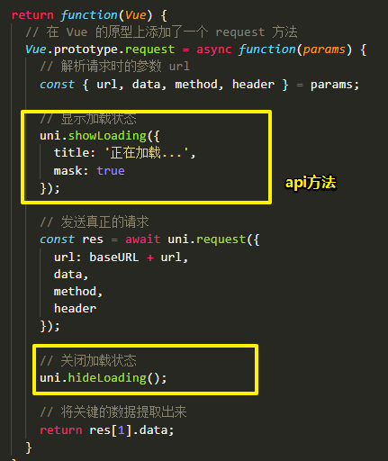


### 导航及楼层接口

- JS

```js
// 获取导航数据接口
async getNavList () {
    // 请求后端接口
    const {message} = await this.request({
        url: '/api/public/v1/home/catitems'
    })

    // console.log(message);
    // 更新初始数据
    this.navList = message;
},

// 获取楼层数据接口
async getFloorList () {
        // 请求后端接口
    const {message} = await this.request({
        url: '/api/public/v1/home/floordata'
    })

    // 更新初始数据
    this.floorList = message;
}
```

- **了解：**导航转跳数据：不规范；楼层的转跳数据：不规范；

```html
<navigator
           :key="nav.name" 
           v-for="nav in navList"
           :url="nav.navigator_url">
    <image :src="nav.image_src"></image>
</navigator>


    <view class="floors">
      <view :key="index" v-for="(floor, index) in floorList" class="floor">
        <view class="title">
          <image :src="floor.floor_title.image_src"></image>
        </view>
        <view class="items">
          <navigator :key="key" v-for="(product, key) in floor.product_list" url="/pages/list/index">
            <image :src="product.image_src"></image>
          </navigator>
        </view>
      </view>
    </view>
```


## 下拉刷新

### 效果开启

* 页面局部：配置下拉刷新；

- 小程序自带着下拉刷新，可以配置全局或者单独的页面；
- 在全局配置：所有的页面都可以下拉刷新效果；

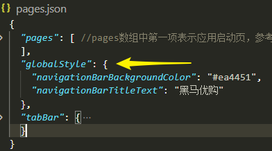

- 在页面配置：**enablePullDownRefresh：true**

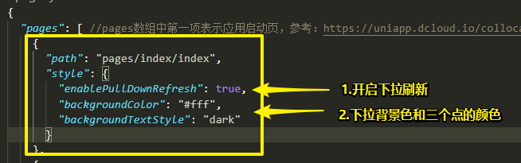

### 下拉函数

* 用户为什么要做这个动作？下拉刷新，背后需要函数支持动作，需要函数执行刷新代码

- **page JS文件配合 下拉行为 的事件执行函数**：onPullDownRefresh()   特别的生命周期函数；
- src源码：onPullDownRefresh 生命周期函数 和onLoad同样级别；
- 函数内部：请求页面上的数据，请求完毕后，下拉效果完成；api `wx.stopPullDownRefresh()`
- **使用async  await语法，保证请求完毕后，结束下拉效果；**

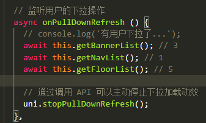


## 返回顶部

- 需求1：点击按钮，返回到顶部：wx.pageScrollTo(Object object) 

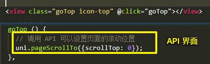

- 需求2：按钮的显示隐藏 v-show  v -if
  - 用户滚动页面的时候，行为；背后：需要一个函数执行；**onPageScroll：在滚动时候可以监听到滚动的位置；** 和onLoad同级别；
  - 初始化隐藏：uni-app  v-show如果后面跟着简单判断，有bug
  - 当滚动到大于某个数据某个位置时：按钮显示；

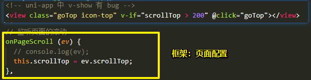

* 也可以在函数内部判断：

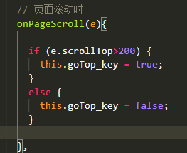


## 分类页 

### 数据渲染

* 页面：**category**
* url:`/api/public/v1/categories`;
* JS：数据如何返回：
  * 后台设计数据：一级二级导航数据全部返回；
  * 先把一级数据返回，点击其中一项的时候，拿到一级ID，请求返回二级数据；

```js
// 获取顶级（一级）分类
async getTopCategories () {
    // 请求后端接口
    const {message} = await this.request({
        url: '/api/public/v1/categories'
    });

    // 更新顶级分类
    this.topCategories = message;
},
```

* 一级数据渲染：

```html
<view class="sup">
    <scroll-view scroll-y>
        <!-- <text class="active">大家电</text> -->
        <text
            :key="top.cat_id"
            v-for="(top, index) in topCategories">
            {{top.cat_name}}
        </text>
    </scroll-view>
</view>
```

* 二级数据渲染：`ac_index默认取0；`

```html
<view class="children" :key="child.cat_id" v-for="child in topCategories[ac_index].children">
    
    <!-- 二级数据名称 -->
    <view class="title">{{child.cat_name}}</view>
    
    <!-- 品牌 -->
    <view class="brands">
        <navigator :key="brand.cat_id" v-for="brand in child.children" url="">
            <image :src="brand.cat_icon"></image>
            <text>{{brand.cat_name}}</text>
        </navigator>
    </view>
    
</view>
```

* 优化：没有数据时，视图不进行显示；

```html
<view v-if="topCategories.length">
```

* 给当前ac_index的一级数据项加active类名：`:class="{'active':index==ac_index}"`


### 点击切换

* 给一级选项注册点击事件，传入下标；
* 点击之后赋值给ac_index，知道刚才点击的是哪个一级数据；

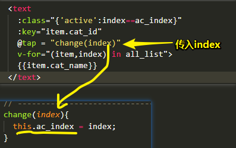


### 滚动

* 滚动：
  * 区域滚动：页面中某个盒子出现滚动；
  * 页面滚动：整个页面在窗口上实现的滚动效果；（index首页出现滚动条）
* 在手机设备（了解）：
  * 使用`css {overflow:scroll}`  ，实现**区域滚动**有bug；
  * bug：**因为手机不知道用户现在要滑动哪个部分；**
* 解决：
  * 网页中：借助于插件（JS、css模拟的滚动）**Swiper 、iScroll 插件**
  * 小程序：要使用区域专门的组件 `<scroll-view>`

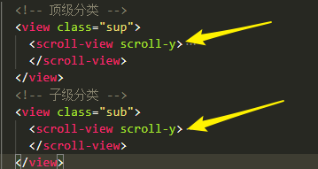

* 场景：
  * **多导航项!!!**
  * **固定定位加输入框会有问题；输入框会被顶飞；**
    * 解决：
      * 绝对定位（输入框）
      * 上方盒子设置为区域滚动；

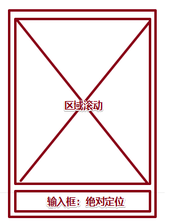


