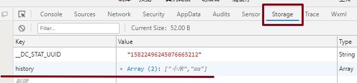
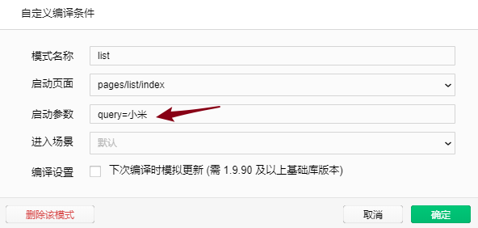
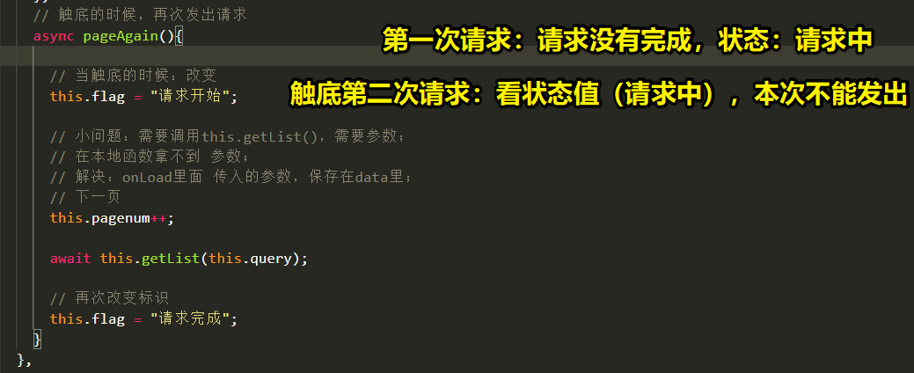
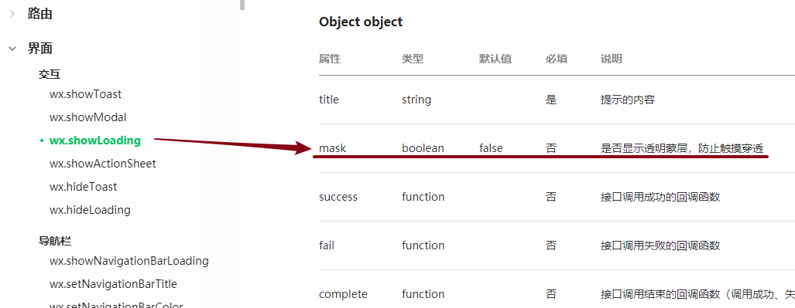
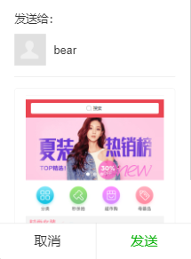
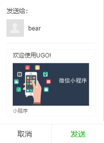
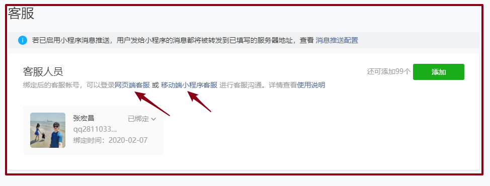
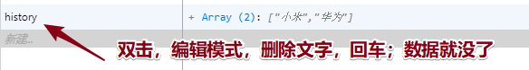

# 00-回顾及反馈

* 今日抽奖大名单：

* 反馈：
  
  * 我试了下在vue中把onLoad改成created代码竟然没挂还是能跑,不可思议,可能webpack封装的厉害了
    
    * vue/cli做项目：什么项目？
    * PC/移动端：正常用vue里面生命周期----------->html css  js  (没有哪个知识点特别指出就是生命周期)
  * wxapp：src源码，写wxapp需要的生命周期--------->小程序有自己专门语法；自己生命周期；
    * **created本身就是vue生命周期；** ----->打包成编译成什么？
    * 这开发小程序的时候用不用？不用created，用什么自己生命周期；
      * 小程序：各自有各自生命周期函数；从哪体现？npm run dev:**mp-weixin**
    
  * **老师封装插件的时候，这两种不是都能够得到vue的构造函数吗？main.js 可以直接拿到Vue;所以直接通过vue.prototype来封装不行吗？为啥还要通过函数内部参数的形式得到vue的构造函数**
  
    * 我说：我先给大家以一个好接受的方式讲解；
  
    * 看起来：不够规范；不够优雅；
  
    * 插件正式流程：**最终应该是一个独立的JS文件；**
  
      * 1.src 根目录 / utils文件夹 （放我们已经定义插件js文件）
  
      * 2.js文件：设置导出语法  `export default function(Vue) {day07分析}`；导出到main.js内，被Vue.use()
  
      * 3.main.js使用：
  
        ```js
        import request_95 from "./utils/request_95";
        Vue.use(request_95);
        ```

* 回顾：
  * 插件：
    * 1.**先main.js里面写相关的插件；思考**
      * 最为核心的一点：**Vue.prototype.fn** 都能用，公共方式！
      * 组件内部，this是啥？Vue的实例化；`this.__proto__`
        * 在组件A里面 `this.__proto__.$info = "zs"`
        * 在组件B里面 `this.$info`
      * vuex：作用：数据共享；到底能帮助我们干什么事？
    * 2.在试着封装JS插件；
  * 提高：看真正的vue源码；


# 01-ugo-搜索栏-01-输入时的建议查询

- 步骤：分析输入过程中：
  - 1.拿到实时输入的那个数据v-model  
  - 2.实时输入@input：事件，
  - 3.在事件中实时的发生请求；
  - 4.取消的时候：重置建议列表和查询字段
  - 5.设计UI界面上：历史记录和建议列表：刚开始搜索的时候，应该显示历史搜索记录，建议列表不出现（有数据的时候才出现）；
- 用户体验不应该防抖：非常快的响应！服务器压力的问题！让用户疯狂输入返回；


# 01-ugo-搜索栏-02-confirm进入确认列表

- 分析点击手机键盘上发生：
  - 1.注册点击发送事件 @confirm
  - 2.拿着你刚才输入的那个参数：小米；进入一个新的页面；list

```js
// 1.拿到输入的数据
// 2.去另外一个页面：JS部分去另外一个页面  拼接参数！
uni.navigateTo({
    url:'/pages/list/index?query='+this.str,
});
```


# 01-ugo-搜索栏-03-confirm添加历史记录




* 步骤：
  * 1.获取本地数据（赋值给 vue内的this.history ，在初始化数据)，查看本地是否有数据，没有就赋值为[]
  
    * 可以写API方法：但是写同步的API；
  * 位置1|| 位置2   
    * uni.getStorageSync("history") 方法同步：最终会有一个结果，到位置1
    * 结果||[]
  
  * 2.把刚才发送的查询字段添加到数组中；优化：数组去重；`[...new Set(arr)]`
  
    * 添加：push
    * 去重：new Set(数组)---->类似于数组一个对象（去重）
    * 快速复制：[...对象]
  
    ```js
    this.history = [...new Set(this.history)];
    ```
  
  * 3.保存到本地；名字要一样；
  
* API
  * wx.setStorageSync(key,value)：【设置，存起来】
  * wx.getStorageSync(key);【获取】

* **结论：修改JS内历史记录数组，就要存回本地；**


# 01-ugo-搜索栏-04-历史数据展示与删除

- 展示步骤：
  - 1.data的初始化的时候，拿到本地数据；
  - 2.v-for渲染：
    - query 语义好一点；起其他名字可以！

```html
<div class="history" v-for="(item,index) in  history" :key="index">
    <navigator :url="'/pages/list/index?query='+item">{{item}}</navigator>
</div>
```

- 删除：
  - 1.本地数据
  - 2.小程序页面中data初始化数据；

```js
// 清除本地和页面数据
uni.removeStorageSync("history");
this.history = [];
```


# 01-ugo-搜索栏-05-对tabBar的控制

* 第一页：封装搜索组件，聚焦的状态的时候，tabBar显示状态；
* UI设计图：上面就没有tabBar；

- 业务设计：API：tabBar显示和隐藏

```js
wx.showTabBar()；
wx.hideTabBar();
```


# 02-ugo-商品列表-01-初始化展示

* 开发阶段IDE：进入list页面，带着参数；



* 步骤：
  * 1.在哪拿：`onLoad(res){ res.query}`
  * 2.做请求数据；（页面：返回数组，v-for）


# 02-ugo-商品列表-02-触底加载新数据

* 需求：触底加载新数据；
* 后台：列表接口，一定是一个分页设计；pageNum；pageSize；
  * 为了减缓加载压力；
  * 触底需求：需要有这些设计 pageNum；
* 原因（步骤）：区域滚动，事件@scrolltolower
  * 1.触底：用户行为；函数会执行；
  * 执行：加载下一页；
    * 初始化数据：pageNum：1；
    * pageNum++；请求；
* **触底知识**：
  * 页面滚动触底：上拉屏幕，行为；生命周期函数；
  * 区域滚动 组件`scroll-view`：`bindscrolltolower`
* 过程：

```js
      // 触底的时候执行：
      scrolltolower(){

        // 1. pagenum++;
        this.pagenum++;
        // 2. 请求：重新写一次？不需要
        // 调用函数：需要参数？如何解决？query查询字段一开始就应该存起来；实例内使用方法都可以用；
        // 回去修改：onLoad 初始化query存起来；this.query = e.query;
        //         获取数据函数 get_data 内部参数；

        // 请求：应该是没有问题；
        this.get_data();

        // 问题：调用成功，把以前旧数据覆盖掉了；
        // 为什么：函数 因为this.list = message；
        // 解决：应该是push吧?  concat：返回新数组；重新赋值给this.list
      }
```


# 02-ugo-商品列表-03-多次触发多次加载问题



* 问题：多次触发底部行为，多次加载数据

* 解决：

  * 1.通过数据控制 请求状态，以解决问题；

  ```js
  async pageAgain(){
      if (this.flag=="请求开始") {
          return;
      }
  
      // 当触底的时候：改变
      this.flag = "请求开始";
  
      // 小问题：需要调用this.getList()，需要参数；
      // 在本地函数拿不到 参数；
      // 解决：onLoad里面 传入的参数，保存在data里；
      // 下一页
      this.pagenum++;
  
      await this.getList(this.query);
  
      // 再次改变标识
      this.flag = "请求完成";
  }
  ```
  
* 2.配置  请求插件；**优化效果：开启遮罩！防止用户做进一步的操作**
  
  


# 03-ugo-01-路由

* **重点：记住小程序页面分为两种；**
  
  * tabBar指定的页面；
  * 普通页面；
  
* 路由转跳：不同的方法：

* 勇于说出来：分析

  


## 转跳到非tabBar页(普通页面)  navigate

* JS：：API

```js
// 点击键盘的发送
confirm_search(){
    // 调用 API 实现页面的跳转,带着刚才搜索的参数
    uni.navigateTo({
        url: '/pages/list/index?query=' + this.words
    });
},
```

* wxml:

```html
<navigator :url="'/pages/goods/index?id='+item.goods_id">
```

----


## 转跳tabBar页  switchTab

* JS：

```js
uni.switchTab({
    url: '/pages/cart/index'
});
```

* wxml：组件进行转跳 tabBar页  

```html
<navigator open-type="switchTab"  url="/pages/category/index"> 
</navigator>
```


* 了解：
  * wx.redirectTo()：会替换上一次历史浏览记；
  * wx.reLaunch()：会把所有的历史记录清空掉，转跳到页面；
  * wx.navigateBack()：返回上一级页面；（不区分 是否为tabBar页面）


# 03-ugo-02-转发

* 开启：不神奇：十有八九 API；转发图片都是小程序自己截图

```js
 // 开启转发功能：
 // uni.showShareMenu();
```

* 瑕疵：小程序很随意，用户来说，不敢点击！




* 解决瑕疵：自定义转化！！！
  * 转发封面不好看，没有设计感！
  * 没有文字说明；

* 用户转发行为：page 生命周期 onShareAppMessage  
* **如果使用转发的监听onShareAppMessage  函数，默认就开启了转发功能**

```js
onShareAppMessage () {
    return {
        title: '欢迎使用UGO!',
        imageUrl: 'http://www.999zx.cn/adm_file/fck/images/2018/4/Image/20184386447866.jpg',
        path: '/pages/index/index'
    }
}
```




# 04-ugo-详情页-01-进入

* 进入途径：`/page/goods/index?id=129 ` 
  - 首页/轮播：点击每个进   **商品详情**
  - 搜索组件：
    - 搜索**建议列表**：点击进入   **商品详情**
    - 搜索**确认列表**：点击进入    **商品详情**

* 分析：
  * 1.拿到ID  `onLoad();`
  * 2.请求数据，渲染；

* IDE：指定测试页/page/goods/index，启动参数 id=129


# 04-ugo-详情页-02-商品介绍

* 后台返回的商品真实详情：**HTML字符串！！**
* 为什么是这个样子？？？
  * 1.小程序 给用户看！
  * 2.商品详情，图片？谁上传？？管理员平台！PC端；编辑文字？如何编译？富文本编辑器！！

* 用HTML字符串！！组件：

```html
// 小程序：
<rich-text nodes="HTML字符串"></rich-text>

// vue：
<view v-html="HTML字符串"></view>
```


# 04-ugo-详情页-03-客服

* 客服：背后非常庞大系统：
* 配置：开启客服功能！**open-type：神奇（微信已经帮咱们做好了）的按钮**

```html
<button open-type="contact" class="icon-handset">联系客服</button>
```

* 运营：客服在哪里？管理界面：客服；




# 04-ugo-详情页-04-购物车

* 重点：把路由相关有个记忆！**JS方法转跳 tabBar 页面**

```js
goCart () {
    uni.switchTab({
        url: '/pages/cart/index'
    });
},
```


# 04-ugo-详情页-05-加入购物车

* 本地数据API学习：搜小米 历史记录下；


* 注意：**对数据（本地缓存）如果有任何的改变，记得：存入本地；**
* 步骤：
  * 1.页面获取本地数据
  * 2.准备要添加的商品的数据
  * 3.添加到获取到的数据里面：是否重复：
    * Yes：让原来的数据数量++；
    * NO:没有重复，添加新商品；
  * 4.数据发生改变，记得存回去；
  * 5.友好提醒；

* 重点：

  * API记忆熟悉；
  * 业务逻辑：想通；重复代码；

* IDE小功能：

  

  


