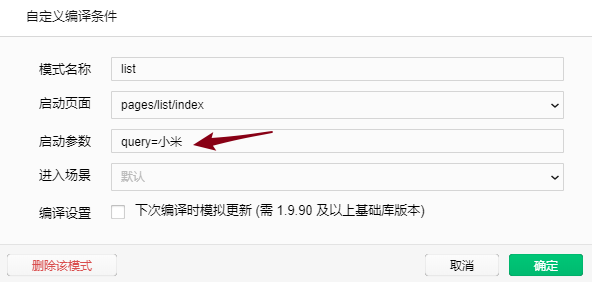
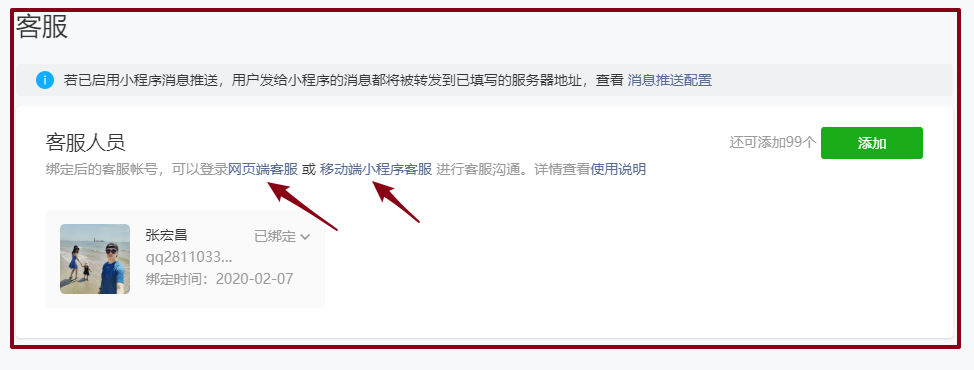

# 小程序 day_08


## 搜索栏

### 输入时的建议查询

- API
  - url:`/api/public/v1/goods/qsearch`
  - 参数：query：小
  - 方式：GET
- 步骤：输入内容的时候，请求数据，渲染；
  - 0.传递请求参数：data:{query：小}，请求插件现在有data配置？需要配置；
  - 1.给input组件注册input事件；@input
  - 2.获取input数据；v-model
  - 3.做请求

```js
// 搜索中
async searching(){
    const {message} =  await this.request({
        url:"/api/public/v1/goods/qsearch",
        data:{
            query:this.words
        }
    });
    this.list = message;
}
```

- 每条建议被点击进入详情页，点击时要把该商品的ID进行带上；


- 优化：

  - 搜索区应该是有数据时候展示；`<scroll-view scroll-y class="result" v-if="list.length">`
  - 点击取消时：旧搜索数据清空；

  


### confirm   进入确认列表

- 步骤：手机上按键盘 发送 进入新的list页面（确认我要搜索的这个地段的一个列表）；
  - 1.监听回车事件：（手机键盘的发送按钮）组件：input `bindconfirm  `  @confirm
  - 2.事件执行函数：JS方法，进入新的页面；带参数（查询字段）进入 API / 路由  `navigateTo`

```js
// 点击键盘的发送
confirm_search(){
    
    // 进入新的页面：JS方式
    // 调用 API 实现页面的跳转,带着刚才搜索的参数
    uni.navigateTo({
        url: '/pages/list/index?query=' + this.words
    });
},
```


### confirm   添加历史记录

- 需求：把曾经搜索过的数据保存在本地（手机的存储）；API : JS内部
  - wx.setStorageSync(key,value)：【设置，存起来】
  - wx.getStorageSync(key);【获取】
  - **注意：保证get 和set 获取设置数据名字得一样；**
- **本地存储：存储：记得只要把数据变了，就要存起来；**


- 步骤：
  - 1.获取本地存储数据（赋值给 vue内的this.history )，查看本地是否有数据，没有就赋值为[]
    - 为什么要设置 [] ;一会，添加查询很多数据，放入在哪里？数据集合 [];
  - 2.把刚才confirm发送的数据添加到  JS内部数组中；优化：数组去重；`[...new Set(arr)]`
  - 3.把JS内部历史记录数组------->保存到本地；


### 历史数据展示与删除

* 展示：读取到JS数据
* 删除：JS数据，算做修改，本地也要删除 API；

- 步骤：
  - 1.读取本地数据this.history：方法||[]
- - 2.展示 视图
- 展示：每个历史记录都可以进入一个列表

```html
<navigator 
    :url="'/pages/list/index?query='+item"
    :key="index"
    v-for="(item,index) in history" >
    {{item}}
</navigator>
```

- 点击 × 号，删除所有的历史数据
  - 手机：local
  - 页面JS：this.history


### 对tabBar的控制

- 业务设置：
  - 聚焦状态tabBar的隐藏  hideTabBar
  - 默认状态下tabBar显示；showTabBar
- 位置：**API/界面/tabBar   **   肯定都用在JS内部；


## 商品(确认)列表

### 初始化加载

- page页面：`/pages/list/index`
- API：
  - url：`/api/public/v1/goods/search`
  - method:GET
  - data:
    - query：查询关键词（小米）
    - cid:  分类ID（可选，没有不传）
    - pagenum：页数索引   1
    - pagesize：每页长度【到了公司，接口pagenum和pagesize，分页设计】 5
- 小程序编译模式：带参数测试



- 步骤：注意定义的变量先在data中定义
  - 1.参数是随着路径传递过来。思考：如何拿到参数？`onLoad(opts)  opts.query `
  - 2.请求，数据渲染；


### 触底加载  新数据

- 分析：后台的API也必须支持分页查询；

- 滚动：

  - 页面滚动：页面出现滚动条；
  
- 区域滚动：盒子组件内部出现滚动条；
  
- 触底语法：两块（触底，意味着有滚动条；滚动：页面滚动；区域滚动）

  - 滚动：页面滚动、区域滚动
- 怎么区别：滚动是哪个滚动啊？看组件名称：scroll-view ：一定是区域滚动！
  - 1.页面滚动：监听触底的行为，肯定需要页面需要监听；**page中配置的生命周期函数；**

  

  - 2.我们这里布局：**scroll-view 区域滚动；页面触底onReachBottom的函数不会执行；**
  
  - 组件内：`bindscrolltolower`事件  @scrolltolower
    - 函数内容：控制页码++；请求数据

    
  
    


### 多次触底 多次加载

* 问题：
  * 触底了，发出一次请求；请求服务很慢，返回就需要特别长时间；
  * 用户以为没有触底，进行一次触底行为；
  * 代码：会再一次执行一次触底的函数执行；
  * 又一次发出一次请求；
* 需求：**上一次请求没有完成时，**
  * **再次触底，就不能发出新的请求；**解决1:
  * 不让用户用能触底

- 解决1：
  - 1.data设置 **请求状态；**
  - 2.到底 scrolltolower 时判断状态：如果可以加载，要立马改变状态，以防止下次的请求；
  - 3.数据请求完后，恢复状态；


- 解决2：**设置 请求的封装 wx.showLoading 的遮罩；**网速情况还行，网速不行；


## 路由

* 转跳：
  * wxml 组件  JSAPI方式？
  * 转跳到 非tabBar页面还是tabBar页面；

* 页面：两种
  * tabBar页面：页面注册在tabBar list 页面都叫tabBar;
  * 普通页面：非tabBar页面；

### 转跳到 非tabBar页面(普通页面)

- JS： **业务演示：搜索/点击发送  进入确认列表页**

```js
// 点击键盘的发送 回车
confirm_search(){
    // 调用 API 实现页面的跳转,带着刚才搜索的参数
    uni.navigateTo({
        url: '/pages/list/index?query=' + this.words
    });
},
```

- wxml：**演示：首页/轮播图/详情页**

```html
<navigator :url="'/pages/goods/index?id='+item.goods_id">
```


### 转跳到 tabBar 页面 

- JS：**转跳到tabBar页面 使用 **      **演示：首页/轮播图/详情页/购物车**

```js
uni.switchTab({
    url: '/pages/cart/index'
});
```

- wxml:  **navigator  必须使用open-type="switchTab" **  **演示：首页/导航/分类 点击**

```html
<navigator 
    :key="item.name" 
    v-for="item in nav_list" 
    open-type="switchTab"
    url="/pages/category/index"> 
    <image :src="item.image_src"></image>
</navigator>
```


### 其他（了解）

- wx.redirectTo()：会替换上一次历史浏览记；
- wx.reLaunch()：会把所有的历史记录清空掉，转跳到页面；


## 转发

### 默认转发不开启

- **每个页面都有转发按钮，默认是不开启的；**
- 在选定的页面（订单不转发）开启：API
- 一般情况下是不用 API；
- 为什么不用：
  - 转发图片：index页面某个地方截图；
  - 用户不是搞开发：界面是花里胡哨界面，你敢点么？
  - 心里体验：随意；不靠谱；

```js
// 开启转发功能
uni.showShareMenu();
```

### 自定义转发

- 页面转发的监听函数；位置：`page配置`
- **如果使用转发的监听函数，默认就开启了转发功能**，这个事件对应函数的返回值即为自定义转发的信息；
- 主页添加生命周期函数  JS内部

```js
onShareAppMessage () {
    return {
        title: '山未动，心已远!一起和我旅游吧！',
        imageUrl: 'https://ss2.bdstatic.com/70cFvnSh_Q1YnxGkpoWK1HF6hhy/it/u=3823400770,3555259268&fm=26&gp=0.jpg',
        path: '/pages/index/index'
    }
}
```


## 详情页

### 进入

* 进入途径：`/page/goods/index?id=129 ` 
  * 首页/轮播：点击每个进   **商品详情**
  * 搜索组件：
    * 搜索**建议列表**：点击进入   **商品详情**
    * 搜索**确认列表**：点击进入    **商品详情**

* 步骤：初始化onLoad
  * 1.拿到商品id
  * 2.请求数据，渲染；

```js
onLoad (params) {
    // 获取地址中携带参数（商品id）

    // 解析参数
    const {id} = params;

    // 根据 id 查询商品详情
    this.getGoodsDetail(id);
}


// 获取商品详情接口
async getGoodsDetail (id) {
    // 调用后端接口
    const {message} = await this.request({
        url: '/api/public/v1/goods/detail',
        data: {
            goods_id: id
        }
    })
    
    // 更新商品详情数据
    this.goods = message;
}
```


### 商品介绍

* 返回的数据是HTML字符串
* 为什么是HTML字符串？
  * 每个用户界面的服务，都有一个后台管理员界面，用于上传商品的一些信息；更新商品活动；
  * 后台管理员界面：PC端界面；HTML东西；
  * 最为常用：富文本编辑器；（http://ueditor.baidu.com/website/onlinedemo.html）里面的格式样式都是连着html标签和样式一起上传；
  * 最开始小程序不支持解决这个问题；
* 解决：

```html
// 小程序：
<rich-text nodes="HTML字符串"></rich-text>

// vue：
<view v-html="HTML字符串"></view>
```


### 客服

* 点击客服，进入聊天界面；

* 前端代码：btn


* **open-type：神奇的按钮**


* 管理界面如何配置：谁客服？公司客服？




### 购物车


- 点击购物车小图标：`直接转跳到tabBar的购物车页面；`
- 意义：我不想买这个了，我直接去我的购物车页面；

```js
goCart () {
    uni.switchTab({
        url: '/pages/cart/index'
    });
},
```


### 加入购物车

* **真实整体流程：**


* demo学习：
  * 由于没有后台的接口的支持，不能存入数据库；
  * **就将购买商品信息存入本地；加强API的学习；**

* 分析：搜索组件 添加历史搜索一样；
  * 1.获取本地购物车数据到组件数据中
  * 2.添加商品的数据；基本信息：
    * ID：
      * 正常：公司开发的时候。只要有ID只有这个就行了；
      * demo：没有后台接口，购物车列表展示：需要
    * 名称（因为我们后台没有购物车相关的展示，而且一会我们要在**购物车页面**展现所有的订单，所有需要上面数据；)
    * 价格
    * 图片信息
    * 默认数量：1（因为没有提供选择商品的数量）
  * 3.逻辑判断：判断ID是否重复；
    * Yes：数量加1；
    * No：追加新的商品；
  * 4.加入本地数组后，再次存入本地；
  * 5.友好提示；
  
  
  


```js
// 1.获取本地数据 
// data.carts:uni.getStorageSync("carts")||[]

// 2.创建订单信息
// ID/name/价格、图片，数量（1）  数据在哪？ this.one;
const {
    goods_id,
    goods_name,
    goods_price,
    goods_small_logo
} = this.one;

// 3.判断当前的数据里面是否有重复的数据？ID
// JS基础：筛选0-100 质数
var key="未重复";
for (let i = 0; i < this.carts.length; i++) {
    // 已经有商品
    if (this.carts[i].goods_id==goods_id) {
        key="已重复";
        this.carts[i].goods_number++;
        break;
    }
}

// 未重复
if (key=="未重复") {
    this.carts.push({
        goods_id,
        goods_name,
        goods_price,
        goods_small_logo,
        goods_number:1
    });
}

//  4.把data 数据 存入本地
uni.setStorageSync("carts",this.carts);


// 5.提醒
uni.showToast({title:"添加成功",icon:"none"});
```

