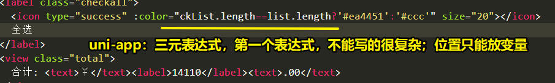
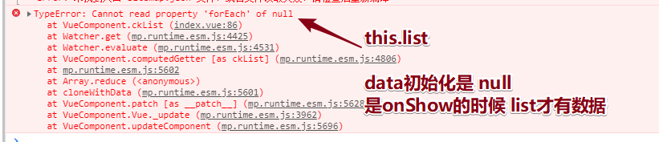
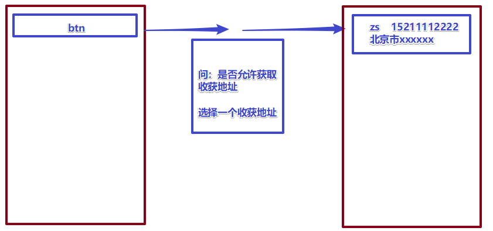
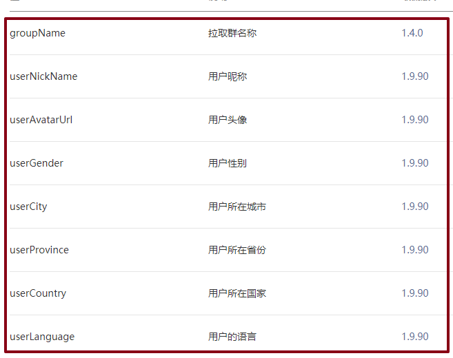
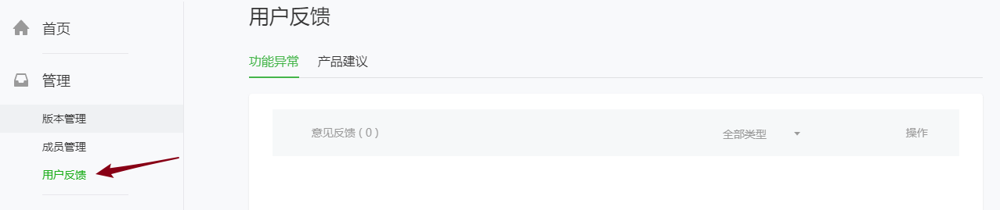
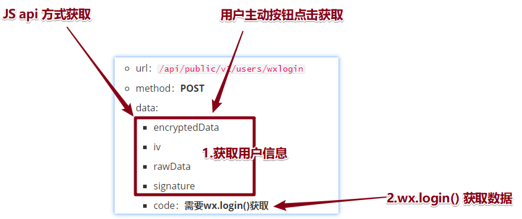

# 00-回顾

* PWA：https://www.jianshu.com/p/098af61bbe04
  * PWA：谷歌提出的开发移动端网页应用
    * 为了和原生的APP体验接近；
    * 渐进式网页应用；
  * 学习核心：
    * 业务分析
    * 配合（后台）
    * 排查错误bug
    * 性能：理解；

* 触底行为：滚动条；

  * 页面滚动：Page({})  生命周期函数；监听页面滚动的时候；
  * 区域滚动：`<scroll-view> 组件属性（和事件 bind事件=监听页面触底/右侧）`
  * 开发使用哪个？先开发着，不适合现在布局，考虑用区域滚动；
* 转发：Page({})生命周期函数，自定义转发（用户可以接受）；
* 路由转跳：

  * code方式：JS、wxml方式；
  * 页面分类：
    * 非tabBar页（普通页）：
    * tabBar页：switchTab;
* 加入购物车code：商品存入本地

  * 1.把本地数据读取到JS内部 赋值给 **this.carts**；（如果没有数据，赋值为[]）
  * 2.加入购物：
    * 2.1：准备即将要添加商品的数据（商品ID、数量、类型）name/价格、数量、图片；【购物车列表：展示东西；】
    * 2.2：添加商品：判断是否重复；通过ID唯一；
      * YES：已有的商品数量++；
      * NO：新的商品添加进入；
    * 2.3 **JS this.carts**：数组已经变了；
    * 2.4 存回去 **本地Storage**（手机）
    * 2.5 优化提示；（添加成功）

* 抽奖大名单：


# 00-ugo-购物车页-01-列表

- **看到购物车页面：商品信息：包括什么的状态决定，大家在一开始添加到购物车的时候，要添加什么属性；**
- 默认都是选中状态：添加到购物车的时候，补充一个属性：`goods_buy:true`
- 列表：
  - **本地数据读取出来 ：（练习的时候，按照出问题步骤走一次！） **
    - 1.data：上进行获取；为了展示；onLoad打印；
    - 2.在购物车页面，通过tabBar来到了主页，又添加了一件商品；再次来到购物车，问题：打印的数据不再打印；因为我们是在onLoad(): 改成了在onShow里面打印data数据；
    - 3.继续进行上面操作，问题：onShow确实可以打印数据，但是本地数据和data数据没有同步；（页面加载后，data数据只加载一次，需要让data上某些数据重新加载一次，）onShow里面继续重新获取下本地数据；
  - 渲染；


# 00-ugo-购物车页-02-加减数量

- 分析：
  - 1.注册点击事件
  - - 2.执行函数内部：对当前操作的商品数量进行数量修改；（+1 -1 数量的修改）
      - **敏感：数量的修改，JS数组变了，记得要存回本地去！**
      - 注册一个方法：
        - step:小经验
          - 传入参数；点击+：传入1；点击-，传入就是-1；
          - 传入的数据：和原来数据进行相加；2 +1 --->3   2+  (-1)----->1
        - 我怎么知道我点击是哪个商品呀？传入index：找到对应商品；
      - 内部：
        - 上限：（每个商品数据，都是从后台返回过来，带着库存数据）自己模拟定一个上限；
        - 下限：不能点击为0；到了1停止；

```js
      changeNum(step,index){

        // ------------------------2.页面数据改变
        // step
        // -1 ：点击是-
        // 1 ：点击是+

        // - :至少有一件商品
        if (step==-1&&this.carts[index].goods_number==1) {
          return;
        }
        // +: 按照道理和库存量对比
        if (step==1&&this.carts[index].goods_number==15) {
          return;
        }

        // 讨巧的抒写方式
        this.carts[index].goods_number += step;


        // ------------------------3.存回本地
        uni.setStorageSync("carts",this.carts);
      }
```


# 00-ugo-购物车页-03-单选

* 思考：
  - 买或者不买：代码上描述，是不是应该用属性标示买的状态；true false
  - 目前数据没有属性，怎么办？加一个！从哪加属性？
  - 商品从哪来的？自己选出来，加入购物车；准备商品数据（name/价格、数量、图片、**属性：默认就是买**）【大家课下练习步骤】
    - 1.本地数据没有买属性，删除本地数据；
    - 2.重新加入买属性后，重新添加购物车；

- 步骤：
  - 0.前面思考修改环节；
  - 1.icon组件（图标，简单的可以不用引入字体文件）注册点击事件，传入index；
  - 2.改变当前数据的是否购买状态；
  - 3.存回本地缓存；


# 00-ugo-购物车页-04-反选

- 需求：当子项商品全部处于选择状态的话，全选按钮是个选择的状态；
- 分析：
  - **1.处于选择状态的商品：筛选出来；（计算属性）**
  - 2.判断 购物车数组  ==  筛选出来选中的数组的长度 ？
    - true：全选：全选按钮是个选择的状态；
    - false：全选按钮不是个选择的状态；

```js
// 把选中的商品 筛选出来
buy_carts(){
    var arr = [];
    this.carts.forEach(function (item,index) { 
        // 商品要buy 状态
        if (item.goods_buy) {
            arr.push(item);
        }
    });
    return arr;
}
```

- 全选：

```html
<label class="checkall">
    <icon type="success" :color="is?'#ea4451':'#ccc'" size="20"></icon>
    全选
</label>

// is：设置在计算属性里面
computed:{
  is:function () { 
     return this.ckList.length==this.list.length;
  }
},
```


- uni-app: bug
  - v-show ：直接使用 v-if
  - 三元表达式：表达式1不能太复杂！ `<icon type="success" :color="(buy_carts.length==carts.length?'#ea4451':'#ccc')" size="20" ></icon>`






# 00-ugo-购物车页-05-全选

- 步骤：
  - 1.点击全选，拿到全选的现在的状态 **is**
  - 2.点击之后的状态 ：**!is**
  - 3.把点击之后的状态**!is**赋值给购物车的全部数据 
  - 4.list已经改变，存回去到手机本地；


# 00-ugo-购物车页-06-总价

- 功能：总价？**选中商品的总价！**
- 步骤：
  - 1.选中商品
  - 2.计算属性：数学：数量 X 单价；


# 00-ugo-购物车页-07-收获地址

- 了解：小程序不需要自己写收货地址；获取！



- HTML修改：v-if v-else   

```html
<!-- 判断有没有收货地址？没有地址，下面信息框 不显示 -->
<block v-if="addr">
    <view class="dt">收货人: </view>
    <view class="dd meta">
        <text class="name">刘德华</text>
        <text class="phone">13535337057</text>
    </view>
    <view class="dt">收货地址:</view>
    <view class="dd">广东省广州市天河区一珠吉</view>
</block>


<!-- 按钮：点击获取地址 -->
<button v-else type="primary">收货地址</button>
```

- 点击按钮：用户地址：**uni-app 对原生api 做了 promise封装；async  await **

```js
uni.chooseAddress({
    success:(res)=>{
        this.addr = res;
        // 详细地址
        this.addr.details = res.provinceName+res.cityName+res.countyName+res.detailInfo;
    }
});
```

* JQ阶段：购物车，DOM操作是怎么写；


# 01-ugo-个人中心-01-获取用户非隐私信息

* 组件：`open-data  type：用户昵称、性别、所在城市  【获取非隐私的信息，没有经过大家的同意】`
* open-data：行内元素；
  * 获取头像：可以理解为open-data父组件，头像就是子组件；设置父级组件样式，去控图片；




# 01-ugo-个人中心-02-电话联系客服及意见反馈

* API：调用手机拨号：  
* 文档：api/设备

```js
uni.makePhoneCall({
    phoneNumber:"10086"
});
```

* 意见反馈：
  * button 设置属性open-type可以让用户点击，主动行为；
  * 客服会话
  * 意见反馈
  * 用户信息、用户电话（用户比隐私信息，不能主动获取；只能让用户自己点，弹窗问是否能获取）

```html
<button open-type="feedback" class="item icon-arrow">意见反馈</button>
```




# 01-ugo-个人中心-03-open系列小结

* button 组件 ：**属性：open-type：**
  * 需要用户点击，需要主动获取，需要让你点击的！
  * 获取：个人隐私（名字、电话、住址）主动意愿
  * 其他：和小程序管理后台客服、用户反馈！
* **open-data 组件：**设置type属性
  * 获取：用户非隐私信息；头像。性别、年龄；没有按钮设置（不需要你同意）
* JS API：
  * 获取用户隐私信息
  * 调用硬件（电话、相机、蓝牙）！


# 02-ugo-购物车-结算前校验-无token

* 业务必须：和代码没有关系；
  * 收货地址
  * 选中商品
  * 登录状态：**token**（未来和后台配置，会拿到token，会存在本地上；）

```js
      goPay(){
        // 判断：
        // 1.是否有收货地址
        if (!this.addr) {
          // 简单弹窗
          uni.showToast({title:"没有收货地址",icon:"none"});
          return;
        }

        // 2.是否有选中商品
        if (!this.ckList.length) {
          uni.showToast({title:"没有选中的商品可结算",icon:"none"});
          return;
        }


        // 后面逻辑：
        //    1.如何登录；
        //    2.登录后，把获取的token 储存到本地 名字：token；

        // 3.现在是否登录状态：获取token;
        if (!uni.getStorageSync("token")) {
          // 没有登录，转跳一个页面：
          // 让用户去登录一个 非tabBar页面；
          uni.navigateTo({
            url:"/pages/auth/index"
          });

        }

      }
```


# 03-ugo-登录-01-接口信息

* 请求方式：“POST”
* 注意：回去修改 自己封装的插件 this.request();
* 传的数据：




# 03-ugo-登录-02-获取用户信息及token值

* 终极目标：为了获取token
* 发出请求：
  * 用户信息：通过JS API方法获取 也可以用户主动点击；
  * code：wx.login()  异步：
* 用户信息：
  * 过去：JS可以直接获取
  * 现在：
    * 1.加载页面的时候，先用JS方法获取用户信息；（如果能，意味着：之前点击过）看能不能获取到；
    * 2.如果获取不到用户的信息。需要用户主动点击按钮，进行获取（特性：只要用户点击授权后，那么下次可以直接通过JSapi 方式进行获取；）；

* JS方式：如果这条路走不通，待着在这，等待用户去自己点；

```js
// 为了获取用户信息：
async api_userInfo(){
    // API 方法：
    // wxapi: 异步；uni-app 对大部分的API做了封装；可以使用async await;
    // 返回：[错误对象，数据对象]
    const [err,res] = await uni.getUserInfo();

    // res: undefined 没有点击过。等待用户自己动手指去点击就行了；
    // 2.如果获取不到用户的信息。需要用户主动点击按钮，进行获取（特性：只要用户点击后，那么下次可以直接通过JSapi 方式进行获取；）；

    // res存在，意味着曾经授权过；；
    if (res) {
        this.get_token(res);
    }
},
```

* 用户点：`<button type="primary" open-type="getUserInfo" @getuserInfo = "getInfo">微信登录</button>`

```js
// 2.点击获取；改名字，为了大家更好理解；
// 从哪获取用户信息？肯定是事件对象；
// 经过用户点击第二步，下一次，就可以通过JS 第一步可以直接获取 用户信息；
btn_userInfo(e){
    // console.log(e);
    // 用户信息
    // console.log(e.detail);

    this.get_token(e.detail);

},
```

* 终极可以获取到用户数据：来到一个统一函数，为了获取最终token;

```js
// 无论是通过JS方式获取还是btn? 把拿到用户信息--->统一的传入一个函数（用于获取token）
// 设置形参：用于干啥？接受  用户信息；
// 两个途径：这个get_token 函数应该在两个地方都应该调用下；
async get_token(data){
    // 1.用户信息：data  console.log(data);

    // 2.code：JS api 直接进行获取  uni.login() 异步；
    // 怎么写；
    const [err,codeRes] =  await uni.login();


    // 3.接下来怎么办？发请求 异步；
    const {message} =  await this.$request_95({
        url:"/api/public/v1/users/wxlogin",
        method:"POST",
        data:{
            encryptedData:data.encryptedData,
            iv:data.iv,
            rawData:data.rawData,
            signature:data.signature,
            code:codeRes.code,
        }
    });

    // message：null？
    // 用户可以获取token的话，需要后台配置；
    // 需要小程序申请（选择组织：）的时候：（企业才是可以）支持做订单业务，支付的业务；
    // 需要：企业的小程序；
    // 个人:没有做支付订单（需要token;）
    // console.log(message);

    // wxappID:wx38d8faffac4d34d2  黑马的企业小程序的ID；大家到了公司：用企业公司小程序ID；
    // 下去练习的时候：黑马的企业小程序的ID大家能不能用？
    // 为什么不能用？大家不是我们学校添加开发人员；

    // 本地设置；
    uni.setStorageSync("token",message.token);

    // 需要回到 购物车：需要token;
    uni.navigateBack();
}
```


