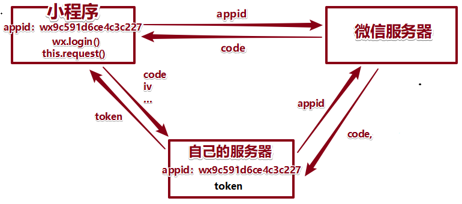

# 小程序 day_09


## 购物车页

### 列表展示

- 分析：我们这里购物车信息存入本地；
  - 1.获取本地数据：
    - 如果放入onLoad会有小问题，页面load后就不会再触发；
    - data里面去获取：小问题；
  - 2.渲染；

```js
    // 
    onLoad(){
        // this.carts = uni.getStorageSync("carts")||[];
    },
    // 1.页面显示出来，数据重新获取下
    onShow(){
        this.carts = uni.getStorageSync("carts")||[];
    }
```


### 加减数量

- 步骤：
  - 1.注册事件
  - 2.执行函数内部：对当前操作的商品数量进行数量修改；（+1 -1 数量的修改）
    - 敏感：数量的修改，JS数组变了，记得要存回本地去！
    - 我怎么知道我点击是哪个商品呀？
    - 注册一个方法：
      - step:
        - 传入参数；点击+：传入1；点击-，传入就是-1
        - 传入的数据：为了和原来数据进行相加；2 +1 --->3   2+  (-1)----->1
      - 传入index：找到对应商品；


- 直接修改：失去焦点时，判断当前的数据；


### 单选

* 思考：

  * 买或者不买：代码上描述，是不是应该用属性标示买的状态；true false

  * 目前数据没有属性，怎么办？加一个！从哪加属性？

  * 商品从哪来的？自己选出来，加入购物车；准备商品数据（name/价格、数量、图片、**属性：默认就是买**）【大家课下练习步骤】

    * 1.本地数据没有买属性，删除本地数据；
    * 2.重新加入买属性后，重新添加购物车；

    

- 组件：`<icon type="success" size="20" color="#ea4451"></icon>`  不需要引入字体文件；
- 分析：对一个商品选择
  - 1.商品的数据来自于我们自己选择的；凡是选择过来的数据，应该默认都是选中状态；给原来的数据添加状态数据，且默认为true；
  - 2.根据设置的数据设置 图标的颜色
  - 3.添加点击事件；


### 反选

- 步骤：
  - 经验：1.把选中商品筛选出来；（vue：计算属性）；
    - 计算属性：
      - 语法，函数内部返回出数据；
      - 函数内部：涉及到一些其他数据，其他数据发生改变的话，计算属性的值也会跟着变化；
    - 筛选：把已经选中要买的商品单独筛选一个数组；
  - 2.判断：所有商品数组 和 筛选出来要购买数组进行比较长度，如果一样则全选为选中状态；


- **uni-app框架 ：bug 避免使用三元时 前面判断太复杂！应该一个变量进行判断；**


### 全选

- 步骤：
  - 1.点击全选，拿到全选的现在的状态     is 
  - 2.点击之后的状态 ：!is
  - 3.把点击之后的状态   赋值给全部数据上  ；
  - 4.存回去本地；


### 总价

- 思路：**选中**商品的单价  x  数量 的总和；
  - 总价的属性：计算属性（用途：函数内部，只要有数据发生变化，计算属性就发生变化）


- 结算数量 ：选中商品类型的个数；


### 收获地址

- 网页操作：


- 小程序：不需要填入；获取手机微信里面地址，收货地址；


- 修改HTML代码：

```html
<block v-if="addr">
    <view class="dt">收货人: </view>
    <view class="dd meta">
        <text class="name">{{addr.userName}}</text>
        <text class="phone">{{addr.telNumber}}</text>
    </view>
    <view class="dt">收货地址:</view>
    <view class="dd">{{addr.details}}</view>
</block>

<button v-else type="primary" @click="getAttr">点击添加地址</button>
```

- JS：API方法获取；

```js
// 点击获取地址
getAttr(){
    // API 
    uni.chooseAddress({
        success:(res)=>{
            this.addr = res;
            // 详细地址
            this.addr.details = res.provinceName+res.cityName+res.countyName+res.detailInfo;
        }
    });
},
```


## 个人中心

### 获取用户信息


- 组件：open-data  type：用户昵称、性别、所在城市（获取不是太隐私的信息，没有经过大家的同意）

```html
<open-data class="avatar" type="userAvatarUrl"></open-data>
```

- 样式：行内样式


### 电话联系及意见反馈

- **API/设备/电话**  小程序平台 

```js
uni.makePhoneCall({phoneNumber: '10086'});
```

- 意见反馈 open-type="feedback"属性 神奇的按钮：商品商品：对话客服；

```html
<button open-type="feedback" class="item icon-arrow">意见反馈</button>
```


- 在后台收集反馈：


### open系列小结

- 组件：`<button> open-type：会有一些行为:客服、意见、获取电话、用户信息`

  

- 组件：`<open-data> type 展示用户名称、头像、性别、地址等非隐私信息`

  

- API：`调用硬件方面的东西:打电话、调用相机`

  - makePhoneCall
  - 用户信息（用户曾经允许获取的）


## 购物车/结算前校验 - 无token

- 业务：结算前进行信息校验：不能无收货地址，不能没有购买商品、**不能无登录状态（得知道是谁的订单）**
  - 没有收货地址：提醒没有收货地址
  - 没有选择中商品：提醒没有购买的商品
  - 没有本地token：没有登录，去登录  **获取token（就是代表用户的加密串）**；
  - 校验成功：创建订单(需要token)；和钱有关系的，都需要token;


* 登录状态token：当前用户加密串；
  
  * 代表用户的加密串，
  * **后期要需要后台配合获取token值；要token数据存在本地 setStorageSync；**
  
  

- 实现：点击结算
  - 1.看是否有收货地址
  - 2.是否有选择的商品
  - 3.是否为登录状态：看是否有 token
    - 没有token：**登录获取token；**
    - 有token：**创建订单；**（为什么？创建订单是需要token信息）


```js
pay(){
    // 1.判断是否有地址
    if (!this.addr) {
        uni.showToast({title:"无收货地址",icon:"none"});
        return;
    }

    // 2.选择的商品
    if (!this.ck_carts.length) {
        uni.showToast({title:"无结算商品",icon:"none"});
        return;
    }

    // 3.判断是否登录？
    if (!uni.getStorageSync("token")) {

        // 转跳到登录页面，进行登录；
        uni.navigateTo({
            url:"/pages/auth/index"
        });

        return;
    }
},
```


## 登录

* 登录：为了获取token值；【登录==token】

### 接口信息

* 1.后期需要后台配置，获取token；
* 2.存入本地

* 后台给我准备一个接口：用于获取token;
  * url：`/api/public/v1/users/wxlogin`
  * method：**POST**  (请求插件自己封装，思考有设置POST登录方式？，需要修改插件)
  * data:
    - encryptedData
    - iv
    - rawData
    - signature
    - code：**需要wx.login()获取**

- 优化 this.request(..)


### 获取 用户信息

- 页面：`pages/auth/index`

- 小程序：依托于微信！！有账户！


- 获取用户信息：
  - 过去 API方法 JS方法，曾经不用用户同意；
  - 现在需要用户同意；


* 获取用户信息：
  * 1.需要用户主动点击按钮，进行获取用户信息；
  * 2.一旦用户曾经点击过允许获取，下次再进入小程序的时候，不需要经过用户同意，直接通过JS api 方式就可以获取用户的信息；


* 代码：先用 JS api 获取下用户的信息，看能不能获取到；
  * 如果能获取到：用户曾经主动点击允许获取过；
  * 如果不能获取：用户现在没有授权允许获取；**显示按钮，让用户去点击按钮；**


- JS API获取用户信息：`api/开发接口/用户信息`
  - 直接获取用户信息；
  - 但是如果用户没有主动授权，这个方法是获取不到信息；(曾经是可以的)

```js
// 1.API js主动获取数据
async JsGetInfo(){
    // 1.获取用户信息
    //  1.1 先用 API js 方法  uni封装promise返回 [err, res]
    const [err,res] =  await uni.getUserInfo();

    //  1.2 res没有数据 用户没有授权：让用户主动授权；
    if (!res) {
        return;
    }

},

onLoad(){
    this.JsGetInfo();
}
```


- 组件：
  - **用户主动点击获取用户信息**
  - 主动授权后不再提醒是否授权；（下次登录的时候，不再提醒）；
    - open-type="getUserInfo"
    - @getUserInfo

```html
<button type="primary" open-type="getUserInfo" @getuserInfo = "getInfo">微信登录</button>
```

```js
btnGetInfo(res){
    console.log(res.detail);
}
```


- 为什么这么复杂？
  - 用户体验好；
  - [https://developers.weixin.qq.com/community/develop/doc/0000a26e1aca6012e896a517556c01?highline=%E7%94%A8%E6%88%B7%E4%BF%A1%E6%81%AF](https://developers.weixin.qq.com/community/develop/doc/0000a26e1aca6012e896a517556c01?highline=用户信息)


### 获取 token

- 上面的数据都进入getToken函数；
- 在函数内部：获取code数据

```js
async getToken(res){
    // 1.用户信息
    // console.log(res);

    // 2. code信息
    const [err,codeObj] =  await uni.login();

},
```

* 获取token数据

```js
// 获取token信息
async getToken(res){

    // 1.res用户信息
    // console.log(res);

    // 2. code信息
    const [err,codeObj] =  await uni.login();


    // 3.向公司服务器请求：返回应该给我token!!
    const {message} =  await this.request({
        url:"/api/public/v1/users/wxlogin",
        method:"POST",
        data:{
            code:codeObj.code,
            encryptedData:res.encryptedData,
            iv:res.iv,
            rawData:res.rawData,
            signature:res.signature,
        }
    });

    // 为什么错了？
    //    小程序：AppID：谁的？我的；
    //    公司服务器：里面也有AppID: 谁的？公司；

    // 公司：IDE 里面替换为 公司的appID;
    // 学生：你们没有权限，不是我们学校这个开发小程序的开发人员！！

    // 4.token获取到：存入本地
    uni.setStorageSync("token",message.token);

    // 5.返回去  路由 ：上一页（不分tabBar 还是非tabBar）；
    uni.navigateBack();

}
```

- 获取token成功：


### 整个流程-了解



* 小故事：

  * 用户向  **微信服务器**  获取当前  用户信息；
    - 用户：微信你好，我想获取下自己的信息；
    - 微信：好，上帝，您随便拿去；

  

  * **小程序**  向   **微信服务器**  获取小程序的 code：
    * 小程序：微信老大你好，我是小程序A，我拿下我的code数据；
    * 微信：哦，原来是小程序A啊；行，给你code拿去把；

  

  * ` 自己的公司服务器（小程序appID）  向 微信服务器  获取 code；（先后必须是同样的appID）`
    * 公司的服务器：微信老大你好，我是小程序A公司的服务器，我想拿下code数据；
    * 微信：哦。原来小程序A是你们公司的啊，行，给你code拿去把；

  

  * 用户信息 + code 从  **微信小程序** ----->   **自己的服务器 ** 请求数据获取token；
    * 用户：你好，这是我的个人用户数据 和 我来自小程序的code信息，我想拿下我的token信息；
    * 公司的服务器：
      * 欢迎光临，我看下您的code数据；呀！ 和我服务器上面存的code 是一样的哎！！！
      * 那么这就是生成的token信息，给您！上帝您慢走！


