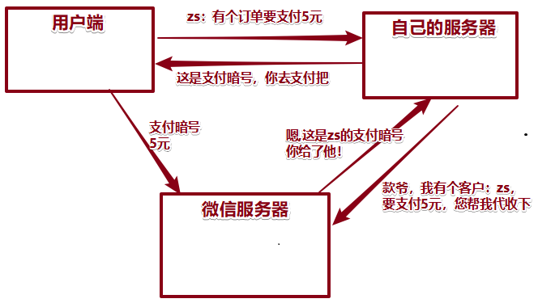
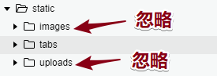
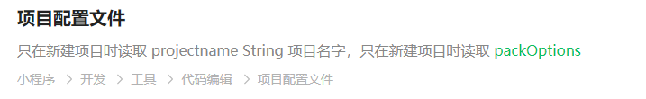
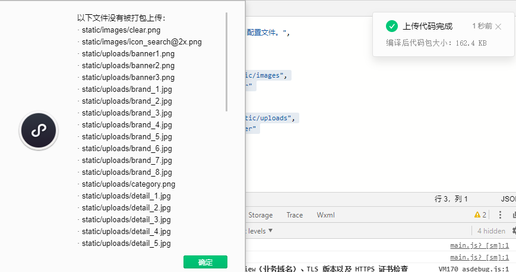

# 00-反馈及回顾

* data上数据也是加载一次就不再重新加载了！这是因为data的缓存机制吗?还是有别的原因
  * 小程序页面 onLoad函数（视图层和逻辑层）的时候，页面A
  * A页面到B页面；B页面返回到A页面
  *  onLoad函数不再执行；
  * 小程序为了用户体验；缓存？查下；底层设计数据长久化？

* 老师,可以简单说一下MVC MVP 软件架构设计模式吗? 
  * https://blog.csdn.net/victoryzn/article/details/78392128
  * 核心代码：找相应框架；**mvvm：老师带着你们写过数据双向绑定；最好能够自己写出来；**
  * 老师你讲课讲的太认真了,每次都刹不住车,就是可以按时下课吗,不然注意力没有办法长时间集中,听课效果不是很好
    * 1小时：超时；提醒我，视频中断；
    * 获取token：刚好讲到点了；
* 面试总结：参考https://github.com/zc3hd/Interview/tree/master/src_webapp/modules

* 获取token过程：
  * 向自己公司后台发生请求：
  * 数据：
    * 用户信息：rawData iv;
    * code：小程序的信息；
  * 用户信息策略：不是二选一；
    * 1.总会先让走JS-api方式（用户授权过，可以通过这个直接获取用户信息）【特别：不用JS方式，每次结算的时候吗，都用btn方式的；】
    * 2.JS方式获取不到数据，页面不动了，等着用户去点击；
    * 3.JS方式可以获取到数据；
  * get_token：函数里，做请求，完成后，获取token，我保证在本地；返回到结算页面；
    * 获取不成功：null
    * 结算：获取token，支付业务，都必须经过审核（企业：对公账户），个人没有权限；
    * 我自己appID---->学校的appID
    * 未来：到了公司；
      * appID：公司
      * 你：公司开发人员；
* 结算：
  * 收货地址
  * 购买商品
  * 用户登录状态：公司服务器返回一个token值；


# 00-ugo-购物车-结算前校验-token获取过程

* 用户在哪里？用户在小程序上面；
* 用户：获取自己的token，请求的数据，需要两部分东西：
  * 1.用户授权的用户信息；
  * 2.小程序的code：怎么得到？appID得到唯一的code；wx.login();
* 向公司的服务器做请求，拿到小程序请求过来的数据：
  * 1.用户授权的用户信息；------>加工，加密算法---->token
  * 2.小程序的code  == 服务器上面的code  【看小程序的appID == 服务器上面存appID】


# 01-ugo-购物车-结算前校验-有token

- 创建订单：需要token
- 创建订单：向我们公司的服务器请求！
  - 购物车的数据清空；` uni.removeStorageSync("carts");`
  - 转跳到订单页；
- **注意：把封装的request请求，优化！**

```js
// 4.有token：创建订单
const {message,meta} = await this.request({
    url:"/api/public/v1/my/orders/create",
    method:"POST",
    header:{"Authorization" : uni.getStorageSync("token")},
    data:{
        order_price:this.sum,
        consignee_addr:this.addr.details,
        goods:this.ck_carts
    }
});

// 订单创建成功:去订单页
if (meta.status==200) {
    
    // 清除购物车数据的数据 （业务上）
    // 清空掉
    uni.removeStorageSync("carts");
    
    // 转跳页面
    uni.navigateTo({
        url:"/pages/order/index"
    });
   

}
```


# 02-ugo-订单页-01-列表

- 注意：
  - 数据渲染的问题：数组套着数组！小心遍历；
  - 每个商品信息 需要套一个 <block>组件；


# 02-ugo-订单页-02-支付

- 支付的流程：了解；



* 1.向公司服务器发出请求后，获取支付暗号；
* 2.调用起手机微信支付功能；


# 03-ugo-业务梳理

* 业务：开会讨论业务合理性，开发周期；

* 公司：业务逻辑疏通后；
  * 沟通：业务上需求；

- 思考：比如自己开发小程序；
- 不会后台：nodejs绕不开
  - 有时间：入职后；
    - 忙：不得不，接触webpack node
    - 不忙：保持学习状态！
  - 现在：没有时间，准备简单，好好复习！


- 首页
  - 搜索组件：
    - 输入时：**搜索建议列表**
    - 点击发送，进入 **确认列表**
    - 搜索建议列表：点击进入   **商品详情**
    - 搜索列表：点击进入    **商品详情**
  - 轮播：点击每个进项： **商品详情**
  - nav：进入**确认列表 **
  - 楼层：三级分类进入 **确认列表**


- 分类页：三级分类进入 **搜索确认列表**


- 详情页：
  - 购物车：**不买了，直接进入购物车列表**
  - 加入购物车：只是把详情页的商品添加到购物车这个行为；
  - 立即支付：没有设计


- 购物车：结算：
  - 有token：生成订单，进入**订单页面**
  - 无token：登录页面，获取token后，返回购物车页面；


- 订单页面：
  - 所有订单展示；
  - 每个订单可以支付；urL 要求有token
- 我的：
  - 信息获取
  - 联系客服
  - 反馈意见


* 搜索组件：！！！**录制语音：面试，开发小程序，有没有遇到什么问题？**
  * 功能：这样设计：点击页面中搜索组件，转跳专门页面，就是写搜索的东西；
  * 后期：我们觉得用户体验不好，转跳的时候有点空白转跳；
  * 体验：用户点，直接无缝出现搜索状态；
  * 封装为搜索组件为子组件；
  * 遇到问题：状态会让搜索组件覆盖全页面；只是覆盖，父级组件页面，东西太多了。页面会产生一个滚动条；
  * 解决：搜索组件状态发生改变的同时，获取页面高度，传给父组件；让父组件也是这个高度；移出隐藏；

* 业务集中：购物车；代码注释写出来；
* 对token获取：注释写出来（代码）；


# 04-ugo-上线打包编译

- 1.dev停止  ctrl+c


- 2.看src：manifest.json：修改appID
- demo：只有个人appID; 写自己
  - 公司：公司的appID


- 3.打包：`npm run build:mp-weixin`；**项目文件夹/dist/build/mp-weixin**  IDE打开该文件夹


- 上传：我们微信小程序编译后代码：AppID自己，能不能做获取token,支付相关这些东西？


- 配置：静态图片资源忽略；重新进行上传；





```json
"packOptions": {
    "ignore": [
        {
            "value":"static/images",
            "type":"folder"
        },
        {
            "value": "static/uploads",
            "type": "folder"
        }
    ]
},
```

- 上传成功：




* 打开微信小程序管理后台：设置为体验版本


* 问题：请求在小程序都不是合法域名；线上没有配置 域名
  * 基础路径：https://api-ugo-web.itheima.net


# 作业

1.ugo项目：搜索组件开发描述，录制成语言；发给我；

2.购物车：业务整理；注释；

3.token：项目最难的一块；