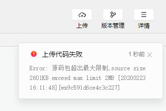

## 购物车/结算前校验-有token

- 结算前校验 

  - 收货地址   √
  - 选择购买的商品   √
  - 有token √

- 业务：有token就可以创建订单；

  - url:`/api/public/v1/my/orders/create`
  - header：`"Authorization" : token`   【想法：应该要封装？封装插件里面要改一改；】
  - method：POST
  - data：
    - order_price：订单价格
    - consignee_addr：订单地址
    - goods：选择商品列表内部存放商品（ID，amount和goods_price）列表


* 步骤：
  * **1.修改请求插件；配置header**
  * 2.在页面中做结算请求；
  * 3.请求成功：
    * 3.1 转跳订单页面；显示着每个订单多少钱；
    * 3.2 放在本地存储里面，清除购物车数据的本地数据

```js
// 4.有token：创建订单
const {message,meta} = await this.request({
    url:"/api/public/v1/my/orders/create",
    method:"POST",
    header:{"Authorization" : uni.getStorageSync("token")},
    data:{
        order_price:this.sum,
        consignee_addr:this.addr.details,
        goods:this.ck_carts
    }
});

// 订单创建成功:去订单页
if (meta.status==200) {
    
    // 清除购物车数据的数据 （业务上）
    // 清空掉
    uni.removeStorageSync("carts");
    
    // 转跳页面
    uni.navigateTo({
        url:"/pages/order/index"
    });
   

}
```


## 订单

### 列表

- 路径：`/pages/order/index`
- 接口：
  - url:`/api/public/v1/my/orders/all`
  - method:GET
  - header:{`"Authorization" : token`}
  - data：
    - type: 1  全部订单     2 代付款订单    3 已付款订单

```js
// 获取订单
async getOrders(){

    const {message}  = await this.request({
        url:"/api/public/v1/my/orders/all",
        method:"GET",
        header:{"Authorization" : uni.getStorageSync("token")},
        data:{
            type:1
        }
    });

    this.orders = message.orders;
},
```


### 支付

- 支付流程（涉及后台一些东西）：
  - 收款！都是微信服务器！帮助我们收取：企业申请：对公账户！
  - 这些都是微信定的规则、安全：


- 接口信息：
  - url:`/api/public/v1/my/orders/req_unifiedorder`
  - method:POST
  - header:{`"Authorization" : token`}
  - data:{order_number:订单编号}
- API：开放接口/支付 调用起支付页面；

```js
async goPay(order_number){
    // 1.支付请求
    const {message} = await this.request({
        url:"/api/public/v1/my/orders/req_unifiedorder",
        method:"POST",
        header:{Authorization:uni.getStorageSync("token")},
        data:{
            order_number
        }
    });

    // 3. 可以支付  API/
    uni.requestPayment(message.pay);
},
```


## Ugo业务梳理

- 首页
  - 搜索组件：
    - 输入时：**搜索建议列表**
    - 点击发送，进入 **确认列表**
    - 搜索建议列表：点击进入   **商品详情**
    - 搜索列表：点击进入    **商品详情**
  - 轮播：点击每个进项： **商品详情**
  - nav：进入**确认列表 **
  - 楼层：三级分类进入 **确认列表**


- 分类页：三级分类进入 **搜索确认列表**


- 详情页：
  - 购物车：**不买了，直接进入购物车列表**
  - 加入购物车：只是把详情页的商品添加到购物车这个行为；
  - 立即支付：没有设计


- 购物车：结算：
  - 有token：生成订单，进入**订单页面**
  - 无token：登录页面，获取token后，返回购物车页面；


- 订单页面：
  - 所有订单展示；
  - 每个订单可以支付；urL 要求有token


- 我的：
  - 信息获取
  - 联系客服
  - 反馈意见


* 掌握：作业！

  * 搜索组件：！！！捋出来；**录制语音：面试，开发小程序，有没有遇到什么问题？**
    - 功能：这样设计：点击页面中搜索组件，转跳专门页面，就是写搜索的东西；
    - 后期：我们觉得用户体验不好，转跳的时候有点空白转跳；
    - 体验：用户点，直接无缝出现搜索状态；
    - 封装为搜索组件为子组件；
    - 遇到问题：状态会让搜索组件覆盖全页面；只是覆盖，父级组件页面，东西太多了。页面会产生一个滚动条；
    - 解决：搜索组件状态发生改变的同时，获取页面高度，传给父组件；让父组件也是这个高度；移出隐藏；

  * 业务集中：购物车；代码注释写出来；
  * 对token获取：注释写出来（代码）；


## 上线

- dev停止


- 打包：`npm run build:mp-weixin`


- 上传我们微信小程序：错误！！！



- 配置：静态图片资源忽略


```json
"packOptions": {
    "ignore": [
        {
            "value":"static/images",
            "type":"folder"
        },
        {
            "value": "static/uploads",
            "type": "folder"
        }
    ]
},
```

- 上传成功：


## 其他组件

### 地图

- 展示：组件map

```html
<map longitude="113.324520" latitude="23.099994"></map>
```

- 获取经纬度：需要在pages.json增加配置：位置信息是用户隐私；

```js
wx.getLocation({success(res){
    // 用户经纬度：GPS模块；
}});
```

- app.json配置：权限说明：
  - 获取用户位置，算用户的隐私；
  - 配置：告诉用户，我想用你的位置做什么事？（测试？为了导弹攻打你？）

```json
{
  "pages": ["pages/index/index"],
  "permission": {
    "scope.userLocation": {
      "desc": "你的位置信息将用于小程序位置接口的效果展示" // 高速公路行驶持续后台定位
    }
  }
}
```


- 到这里去：使用微信内置地图查看位置

```js
wx.openLocation({
	longitude:119,
    latitude:30
});
```

- 分享位置：调用前需要 [用户授权](https://developers.weixin.qq.com/miniprogram/dev/framework/open-ability/authorize.html) scope.userLocation

```js
wx.chooseLocation();
```


### 公众号关联

- 小程序：小工具非常好用的同时，关注下公众号(粉丝，流量)；
- wxapp：做广告，公众号；


1. 进入**公众号管理后台**进行关联：现在没有公众号；


2. 在 小程序管理后台 开启 公众号 关注组件设置；不需要大家设置；


3. 使用组件

```html
<official-account></official-account>
```


### web-view

- 组件：
  - 到了公司，没有小程序开发；
  - 前辈：走了，留下H5 移动端页面；
  - 愁：移动端页面，开发出小程序（UI设计，功能一模一样）；
  - 你：老板，不要愁！找上我就对了！一分钟可以达到目标；
- HTML: **iframe**


