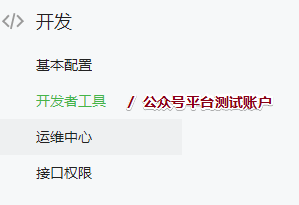
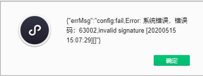

# 01-公众号-申请

* 公司：比较趋势于小程序；用户就来到这个地方；
  * 小程序：体验很接近原生APP；免安全；
  * 微信网页开发：宝宝投票（吸粉案例）；
    * 一个地址HTML页面，在微信中打开；
    * 微信网页载体就是微信公众号，给网页提供JS文件，微信特别功能：
      * 调用手机摄像头；
      * 做自定义分享；
    * 体验：基于HTML页面；

- 邮箱注册：


- 注册过期：
  - 找回：按照步骤；
  - 申请注销（邮箱还是可以用的）；


# 02-公众号-开发配置及测试账号

* 介绍：
  * 微信开发：会！微信网页（本质上就是前面写的H5页面），放在微信环境中使用；
  * 微信环境：
    * 载体：微信，公众号；
    * 功能：拍照、转发、支付等；
  * 如何开发：
    * 提供了一个JS文件：JS-SDK（文件引入）
    * **验证；（需要一些东西）**
* 开发需要：
  * 开发：基本不用下面信息
  * 上线的时候：才填入信息；


* 开发工具：


- 接口工具：了解（后台接口测试）


* JS-SDK文档:


- 前端流程：
  
  - **测试账号：完成开发**
  - 上线：一些信息的替换；（后台）
  
  
  
  


# 03-公众号-JS-SDK-01-开发环境搭建

- 1.开发工具：


- 开发工具：
  - 地址（IP+port）http://127.0.0.1:1010
  - 需要：后台服务；（现在没有后台，需要自己启动服务器）【nodejs不是我们的重点】
  - 公司：到了公司，后台服务代码都是后台去写；


# 03-公众号-JS-SDK-02-验证-01

* 启动服务：nodejs知识；express框架；
* 文件：新建app.js nodejs入口服务文件；
* 文件夹：webapp【一般就是前端文件】

```js
// 0. npm init -y; 
//    npm i express -S

// nodejs服务 启动文件

// 1.引入 express ；注意步骤0
const express = require('express');
const path = require('path');

// 2.开启 express 服务；
const app = express();

// 2.2 后台设置路由：所有静态资源都可以通过自己的路径进行访问；
//     127.0.0.1:1010 直接自己找的webapp目录下看有没有index.html文件

//     webapp文件夹：放都是前端文件（静态资源）
//     （动态资源）：动态获取，异步操作，从后台进行获取数据；
//     前后端分离；

app.use(express.static(path.join(__dirname, './webapp')));

// 2.1 设置端口
app.listen(1010);
console.log("node服务 已启动在1010端口");


// 3：启动服务；cmd : node app.js
//    注意：只要app.js文件发生改变，需要重启服务；
```

* 在开发工具打开 IP+port地址测试；http://localhost:1010/


* 微信网页：

  * 1.引入JS-SDK文件；http://res.wx.qq.com/open/js/jweixin-1.6.0.js
    * src：引入
    * 把该地址：浏览器打开，复制里面JS代码，本地化JS文件；
  * **2.配置 测试账号中安全域名：告诉微信官方，我们要在哪个域名（IP+prot）下用你的JS-SDK；**

  

  - 3.**验证：经过验证后才能使用：wx顶级对象;signature等数据；从哪来？从我们的后台来！**
    - 我们（公司）的后台：自己nodejs；
    - nodejs：需要设置一些 signature 返回到前端；

  ```js
  wx.config({
    debug: true, // 开启调试模式,调用的所有api的返回值会在客户端alert出来，若要查看传入的参数，可以在pc端打开，参数信息会通过log打出，仅在pc端时才会打印。
    appId: '', // 必填，公众号的唯一标识
    timestamp: , // 必填，生成签名的时间戳
    nonceStr: '', // 必填，生成签名的随机串
    signature: '',// 必填，签名
    jsApiList: [] // 必填，需要使用的JS接口列表
  });
  ```

  * 了解：后台如何拿到signature数据：
    * **前端：自己后台进行ajax请求；**
    * 后台：向微信服务器发出请求，获取signature；

  

  * 前端：向自己后台进行ajax请求；【Jq文件，封装好$.ajax()】

    * 1.引入JQ；

    * 2.html加载完成后，发出请求ajax----->后台nodejs后台！

      ```js
      // 路径请求：路径名字谁给的？
      $.get("/get_data", function(data) {
      
          // res可以拿到 signature 签名的数据；
          console.log(data);
      });
      ```

  * 后台：设置对应前端发出请求，设置专门的路径；**为了前后请求接口通了**

  ```js
  app.get("/get_data", (req, res) => {
    // 请求对象 和 响应对象
    // 返回；
    res.send({ ret: 1 })
  
  });
  ```

  

  

  

# 03-公众号-JS-SDK-02-验证-02

* 后台：知道前端是要签名数据；去哪找到这些signature数据；
  * 安装包：专门对nodejs做微信开发包；`npm install wechat-jssdk --save`
  * nodejs文件 ----->  微信服务器做请求；

```js
const {Wechat} = require('wechat-jssdk');

// 初始化：需要找到自己的测试账户ID appSecret
const wx = new Wechat({
  appId: 'wxbe9c38e132e1f95c',
  appSecret: 'fd5b2e90ad602c53593b2384a55ee613'
});

// 设计接口get请求
app.get("/get_data", (req, res) => {
  // 请求对象 和 响应对象
  // 返回；
  // res.send({ ret: 1 });

  // 要签名数据：已经在wx.jssdk里面封装好了；
  wx.jssdk
    // 传入路径参数：前面有http:// 后面有 / 
    .getSignature('http://localhost:1010/')
    .then(signatureData => {
      // console.log(signatureData);

      res.send(signatureData);
    });

});
```


* 测试账号：相关信息位置



- 进入测试账户：


# 03-公众号-JS-SDK-02-验证-03

* 前端：可以拿到签名数据；
* 前端验证方法：获取到数据，填入下面配置项；

```js
wx.config({
  debug: true, // 开启调试模式,调用的所有api的返回值会在客户端alert出来，若要查看传入的参数，可以在pc端打开，参数信息会通过log打出，仅在pc端时才会打印。
  appId: '', // 必填，公众号的唯一标识
  timestamp: , // 必填，生成签名的时间戳
  nonceStr: '', // 必填，生成签名的随机串
  signature: '',// 必填，签名
  jsApiList: [] // 必填，需要使用的JS接口列表
});
```

* 使用wx.api SDK里面提供这些功能：

  ```js
  // 在ready函数：验证成功的时候，在函数内部使用API；
  wx.ready(function() {
      // ？？
  });
  ```


* **前端流程：**
  * 1.IDE需要打开一个地址；（nodejs启动服务）
  * 2.用IDE窗口打开；
  * 3.index.html文件里引入JS-SDK文件；
    * 3.1 测试账号 JS接口安全域名配置；
    * 3.2 html页面内 向我们的后台获取 signature等参数；config配置后；
    * 3.3 wx.ready进行调用；


# 04-公众号-JS-SDK-03-使用

* **留意：下去自己练习可能会出现下面这个问题；**

* 发现报错：config验证配置失败了；



* nodejs：注意：


* 注意：
  * 学会查文档：https://developers.weixin.qq.com/doc/offiaccount/OA_Web_Apps/JS-SDK.html
  * API使用：在ready里面使用；
  * 登记：wx.config({})   jsApiList 需要登记；
* 思考：
  * 公众号网页开发
  * 小程序：界面，开发更加友好；

- 验证成功后，需要知道验证成功后，专门回调函数；

```js
wx.ready(function(){
  
});
```

- 经常会遇到下面这个错误：
  - API不能用
  - 配置、验证、ready;


- 原因解决：

```js
wx.config({
    ...
    // 即将你要用到的使用的API的名字，必须登记在这，字符串
    jsApiList: [] // 必填，需要使用的JS接口列表
});
```

- 演示：

```js
// 手机：HTML页面调用相机 
wx.chooseImage({
    // count: 1, // 默认9
    // sizeType: ['original', 'compressed'], // 可以指定是原图还是压缩图，默认二者都有
    // sourceType: ['album', 'camera'], // 可以指定来源是相册还是相机，默认二者都有
    success: function(res) {
        var localIds = res.localIds; // 返回选定照片的本地ID列表，localId可以作为img标签的src属性显示图片
        // console.log();

        // 展示出来：获取本地的图片显示
        wx.getLocalImgData({
            localId: localIds[0], // 图片的localID
            success: function(res) {
                var localData = res.localData; // localData是图片的base64数据，可以用img标签显示
                $("#img").attr("src", localData);
            }
        });

    }
});


// 自定义分享
wx.updateAppMessageShareData({
    title: '来传智，上颠峰！', // 分享标题
    desc: '年薪20万等你哦~', // 分享描述

    // 分享的时候，只能分享 配置在JS安全域名 下的路径的地址；
    link: 'http://localhost:1010/', // 分享链接，该链接域名或路径必须与当前页面对应的公众号JS安全域名一致
    imgUrl: 'http://img0.imgtn.bdimg.com/it/u=746748956,785751736&fm=26&gp=0.jpg', // 分享图标
    success: function() {
        // 分享成功后：在这里执行；
        console.log(1);

    }
})
```

- 思考：
  - 回调函数：涉及代码封装：
  - 考验：promise封装；
  
  


# 05-公众号-WeUI

* 快速搭建一个微信网页（到了公司：按照设计的来，等UI）；

- //res：如果浏览器当前使用的是https协议，那么就加载https协议的脚本，否则使用http，这保证了页面所有资源使用同一协议。
- 演示：https://weui.io/
- wiki：https://github.com/Tencent/weui/wiki/getting-started
  - 官方样式：`//res.wx.qq.com/open/libs/weui/1.1.3/weui.min.css`
  - JS：`https://github.com/Tencent/weui.js`;
- 样式：引入CSS文件
- 简单交互：slider拖动
- 例子：https://github.com/Tencent/weui/tree/master/src/example  看源码 html  JS部分；
  - 老板：没有UI比较忙，不用管好不好看，直接把需要做出来，到时候再说；
  - UI：严格按照UI设计写html CSS ; 


