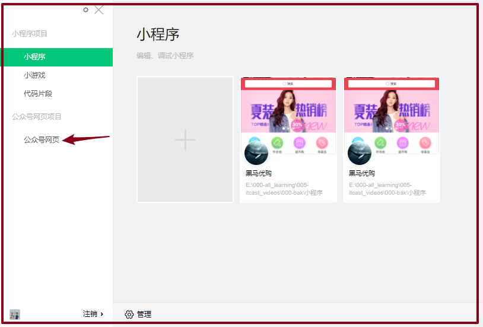
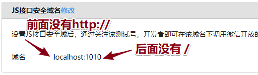
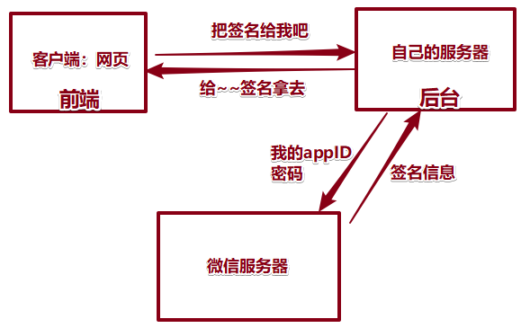
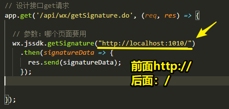
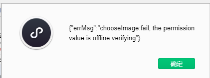

# 公众号

## 申请

- https://mp.weixin.qq.com/

- 选择类型：到了公司，公司的信息可以先申请订阅号（看功能是否满足），可免费升级为服务号；


- 注册流程和小程序一样：


## 开发

### 基本配置

- 公众号开发信息：到了公司，下面这些信息公司都会给大家的；
- 现在（学习）：不用，一会用测试账号，里面（测试ID和密码）
- 开发：
  - **先在测试账号走一走；**
  - 正式：把ID替换为真正的ID就可以了；


- **接口权限**
  - 订阅号、服务号等（提供接口是不一样）
  - 测试账号：拥有全部权限（开发不受限制，先做了）；开发完毕，再看某些接口，重新申请账号，选择认证；
  - 接口：大部分给谁？给后台同学（微信网页开发：前端页面展示，用户业务；后台：调用接口）；


### 开发者工具-测试账号


- 开发者文档，前端关注：**接口文档 / 微信网页开发 / JS-SDK说明文档**


- 在线接口测试，后端使用：


- web开发者工具/绑定成为开发者：类似于小程序的成员管理；


- **测试账号：**


## SDK初始化

### 介绍

- **微信网页：本质就是个网页（html），只不过是运行在微信环境中；**
- **微信环境：**提供了非常多的功能，摇一摇，拍照，微信支付，分享；
- 如何用呢：**封装好一个JS库，JS-SDK；**


### 搭建开发环境

- 选择 公众号网页：



- 输入栏可以直接输入地址 或者测试的本地  **IP +port**


- app.js：自动会找webapp文件夹下面的index.html页面；

```js
const express = require('express');
const path = require('path');

// 开启
const app = express();

// 设置静态资源
app.use(express.static(path.join(__dirname, './webapp')));

// 开启端口
app.listen(1010);
console.log("node服务 已启动在1010端口");
```


## SDK验证！！！

### 前端：引入JS文件


- 用提供的地址或者把JS文件打开下载下来引入；
  - 地址：http://res.wx.qq.com/open/js/jweixin-1.6.0.js
  - **SDK功能：摇一摇、扫码、支付等；**
  - 全局对象：wx  【wx和前面小程序学习顶级对象一样名，没有关系】

### 添加JS接口安全域名

* 配置：微信官方在哪个域名；（IP+port）用你的JS文件；



- 前端：如果要用wx，必须先验证：

```js
wx.config({
  debug: true, // 开启调试模式,调用的所有api的返回值会在客户端alert出来，若要查看传入的参数，可以在pc端打开，参数信息会通过log打出，仅在pc端时才会打印。
  appId: '', // 必填，公众号的唯一标识
  timestamp: , // 必填，生成签名的时间戳
  nonceStr: '', // 必填，生成签名的随机串
  signature: '',// 必填，签名
  jsApiList: [] // 必填，需要使用的JS接口列表
});
```

- 签名：**需要后台配合；**



### 后台：请求微信服务端 （了解）

- 后台：

```bash
$ npm install wechat-jssdk --save
```

```js
// app.js
const {Wechat} = require('wechat-jssdk');

// 初始化
const wx = new Wechat({
    appId: 'Your appid',
    appSecret: 'Your appsecret'
});

// 设计接口get请求
app.get('/weixin', (req, res) => {
    wx.jssdk.getSignature('http://localhost:1010/')
        .then(signatureData => {
            console.log(signatureData);
        });
});
```

- 特别注意：




### 前端：成功验证

```js
wx.ready(function(){
  // config信息验证后会执行ready方法，所有接口调用都必须在config接口获得结果之后，config是一个客户端的异步操作，所以如果需要在页面加载时就调用相关接口，则须把相关接口放在ready函数中调用来确保正确执行。对于用户触发时才调用的接口，则可以直接调用，不需要放在ready函数中。
});
```


## SDK使用 前端

### 错误提醒

- 提醒使用的方法需要注册：



### 基础演示

- 前端涉及到大量的异步回调：**主要问题处理这些异步promise；**

```js
wx.chooseImage({
    success: function(res) {
        var localIds = res.localIds;
        
        // API：把获取id 转化为 base64 图片信息
        wx.getLocalImgData({
            localId: localIds[0], // 图片的localID
            success: function(res) {
                var localData = res.localData; // localData是图片的base64数据
                $("#img").attr("src", localData);
            }
        });

    }
});
```

- 使用的方法需要注册：


### 页面分享！！！

- 公众号里面：微信网页，大部分需要的就是个分享功能；定制分享；
- 常规的分享：给人感觉这是啥？？不敢点击！
- 熟悉：计算文章；
- 下面这样连接形式，对方打开概率大么？效果不好；给用户体验不是太好；


- 接口：


```js
// 分享页面的时候触发
wx.updateAppMessageShareData({
    title: '来传智，上巅峰！', // 分享标题
    desc: '年薪20万等你哦~', // 分享描述
    link: 'http://localhost:1010/', // 分享链接，该链接域名或路径必须与当前页面对应的公众号JS安全域名一致
    imgUrl: 'http://img0.imgtn.bdimg.com/it/u=746748956,785751736&fm=26&gp=0.jpg', // 分享图标
    success: function() {
        // 分享成功后：在这里执行；
        console.log(1);

    }
})
```

- 实际开发如何调试：https://jingyan.baidu.com/article/0eb457e52ca0af03f0a90568.html


## WeUI

> [WeUI](https://weui.io/) 是一套同微信原生视觉体验一致的基础样式库，由微信官方设计团队为微信内网页和微信小程序量身设计，令用户的使用感知更加统一。
>
> 其本质就是微信官方事先写好CSS，开发时直接将其引入页面即可。

在微信网页或小程序中使用 WeUI，有如下优势：

1. 同微信客户端一致的视觉效果，令所有微信用户都能更容易地使用你的网站或小程序
2. 便捷获取快速使用，降低开发和设计成本
3. 微信设计团队精心打造，清晰明确，简洁大方


- 演示：https://weui.io/
- 文档：https://github.com/Tencent/weui/wiki/getting-started
  - 官方样式：`//res.wx.qq.com/open/libs/weui/1.1.3/weui.min.css`
  - JS：`https://github.com/Tencent/weui.js`;
  - //res：如果浏览器当前使用的是https协议，那么就加载https协议的脚本，否则使用http，这保证了页面所有资源使用同一协议。

* 例子：https://github.com/Tencent/weui/tree/master/src/example  看源码 html  JS部分；
  * 老板：没有UI比较忙，不用管好不好看，直接把需要做出来，到时候再说；
  * UI：严格按照UI设计写html CSS ; 


